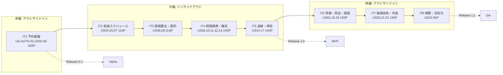
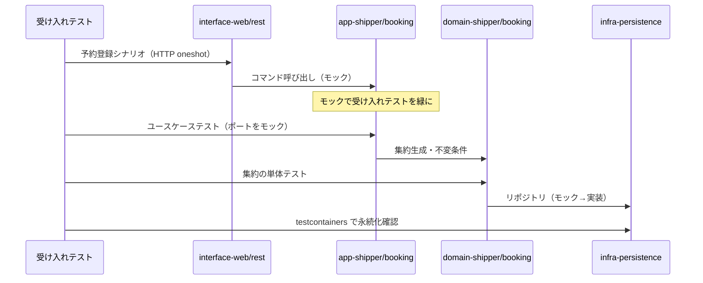
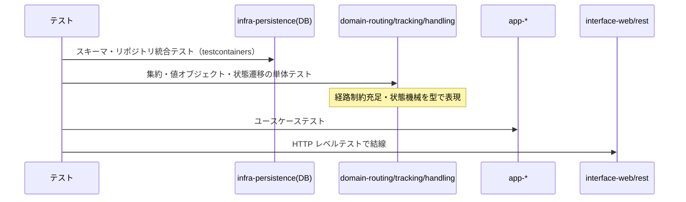
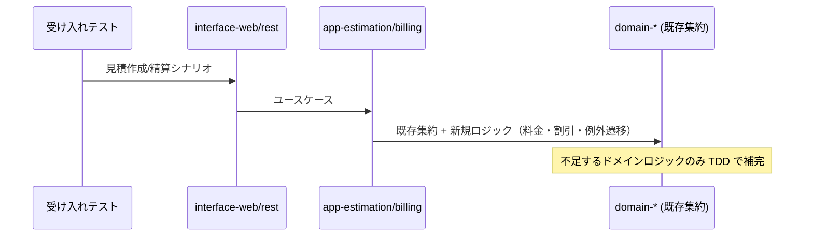

# 開発戦略 - 国際貨物輸送管理システム（Cargo Tracker / Rust 版）

## 概要

本ドキュメントは、[リリース計画](./release_plan.md) の 8 イテレーションを **序盤・中盤・終盤** の 3 局面に分け、各局面で採用する TDD アプローチ（テストの入口とレイヤー貫通順序）と横断的な進め方を定義する。

開発戦略の価値は「どのイテレーションでどちらのアプローチを採るか」という戦略レイヤーを明文化することにある。個々の Red-Green-Refactor サイクルの手順・品質基準・コミット規約は [コーディングとテストガイド](../reference/コーディングとテストガイド.md) を Single Source of Truth とし、本戦略はその上位で「テストの入口をどこに置き、レイヤーをどの順で貫通するか」を局面ごとに決める。

### 参照元と Single Source of Truth

| 事項 | Single Source of Truth |
| :--- | :--- |
| アプローチ選択フロー・TDD サイクル・品質基準・コミット規約 | [コーディングとテストガイド](../reference/コーディングとテストガイド.md) |
| イテレーション × ユーザーストーリー割り当て・SP・リリース | [リリース計画](./release_plan.md) |
| 画面遷移・ナビゲーション・ロール制御 | [UI 設計](../design/ui_design.md) |
| 境界づけられたコンテキスト・集約・ユビキタス言語 | [ドメインモデル設計](../design/domain-model.md) |
| ヘキサゴナル境界・クレート分割・依存規則 | [バックエンドアーキテクチャ](../design/architecture_backend.md)・[技術スタック](../design/tech_stack.md) |

---

## 戦略の全体像

局面ごとに変えるのは **テストの入口** と **レイヤー貫通の順序** のみ。Red-Green-Refactor サイクルそのものは全局面で不変とする。

| 局面 | 対象イテレーション | 主アプローチ | 狙い |
| :--- | :--- | :--- | :--- |
| 序盤 | IT1（予約基盤） | アウトサイドイン | 縦切りで「歩けるスケルトン」を通し、ヘキサゴナル + cargo workspace 基盤の妥当性を早期検証 |
| 中盤 | IT2-IT5（コア輸送フロー） | インサイドアウト | 経路算出・状態遷移など複雑なドメインロジックを、共有カーネル・ドメイン層から堅牢に作り込み、貧血ドメインモデルを回避 |
| 終盤 | IT6-IT8（見積・例外・精算） | アウトサイドイン | 既存の各コンテキスト集約を業務シナリオ起点で結合し、リリース全体の一貫性を担保 |



### アプローチ選択の根拠

選択は [コーディングとテストガイドの実装アプローチ選択フロー](../reference/コーディングとテストガイド.md#アプローチ戦略) に対応づける。局面が機械的な区切りではなく論理的必然であることを示す。

- **序盤（アウトサイドイン）**: 基本 CRUD も API も未実装の状態から始まる。選択フローの「API 実装済み? → いいえ → アウトサイドイン活用（UI のニーズから API 設計を導出）」に該当する。荷主登録〜貨物予約登録という最小の業務シナリオを受け入れテストで先に固定し、UI → アプリケーション層 → ドメイン層 → インフラ層の順に薄く貫通させることで、クレート分割・ヘキサゴナル境界・認証/ナビ骨格の妥当性を早期に検証する。
- **中盤（インサイドアウト）**: 経路候補算出（US08）や貨物状態遷移（US13-17）は不変条件・制約充足・状態機械を含む複雑ドメインで、ここで基盤を曖昧にすると貧血ドメインモデルに陥る。選択フローの「基本 CRUD 実装済み? → いいえ → インサイドアウト推奨（データ層から開始し基盤を固めて上位層へ展開）」に該当する。共有カーネル・ドメイン層の値オブジェクト/集約を先にテストで固め、リポジトリ（sqlx）→ アプリケーションサービス → インターフェースへと積み上げる。
- **終盤（アウトサイドイン）**: 各コンテキストの集約・リポジトリは中盤で実装済みであり、見積・例外対応・精算は既存部品を業務シナリオで束ねる作業になる。選択フローの「基本 CRUD 実装済み? → はい かつ ドメインロジックが複雑? → はい → アウトサイドイン推奨（UI からスタートしドメインロジックを段階的に実装）」に該当する。業務シナリオの受け入れテストを入口に、不足するドメインロジック（料金計算・割引・例外状態遷移）を段階的に補完する。

---

## 共通の TDD サイクル

全局面で不変の規律。詳細手順は [コーディングとテストガイド](../reference/コーディングとテストガイド.md) に従う。

### Red-Green-Refactor と 3 原則

1. 失敗するテストを書くまでプロダクトコードを書かない（Red）。
2. 失敗させるのに十分なテストしか書かない（Red）。
3. テストを通す以上のプロダクトコードを書かない（Green）。その後リファクタ（Refactor）。

### テストレイヤーとクレートの対応

cargo workspace のクレート分割がヘキサゴナル境界・コンテキスト境界を強制する。テストの入口は局面ごとに変わるが、各レイヤーのテスト責務は共通とする。

| レイヤー | クレート | テスト種別 | 主なツール |
| :--- | :--- | :--- | :--- |
| ドメイン | `domain-*`・`shared-kernel` | 単体テスト（値オブジェクト・集約の不変条件・状態遷移） | `cargo test`・`pretty_assertions` |
| アプリケーション | `app-*` | ユースケース単体テスト（出力ポートをモック） | `mockall`（`#[automock]`） |
| インフラ（永続化） | `infra-persistence` | 統合テスト（実 PostgreSQL・sqlx リポジトリ・Read Model） | `testcontainers-rs` |
| インフラ（外部連携） | `infra-external` | 契約テスト（外部 API スタブ） | `wiremock` |
| インターフェース | `interface-rest`・`interface-web` | HTTP レベルテスト（サーバ起動不要） | `tower::ServiceExt::oneshot` |
| E2E | `cargo-tracker-server`（統合） | 画面シナリオ（htmx 動的更新・ポーリング） | `Playwright` |

### 品質チェック（コミット前の必須確認）

```bash
# 1. テスト実行
cargo test --workspace
# 2. コードフォーマット
cargo fmt --all -- --check
# 3. 静的解析（警告をエラー化）
cargo clippy --workspace --all-targets -- -D warnings
# 4. ビルド確認（= アーキテクチャ境界検証）
cargo build --workspace
# 5. カバレッジ確認
cargo llvm-cov --workspace
# 6. 依存監査（リリース前）
cargo audit && cargo deny check
```

> **アーキテクチャテストの位置づけ**: 依存関係ルール（ドメイン層がインフラ層に依存しない、コンテキスト間を直接参照しない）は専用テストではなく **クレートの Cargo.toml 依存宣言**で強制する。違反は `cargo build` で即座にコンパイルエラーとなる。補助的に `cargo deny` の `bans` で禁止依存を宣言する。この「ビルドが通る = 構造が正しい」状態を全局面で常時グリーンに保つ。

---

## 序盤: アウトサイドイン（IT1）

### 目的

まず認証・ロール別アクセス制御（US-AUTH-01）を確立し、その上で荷主登録から貨物予約登録までの最小の業務シナリオを縦切りで通し、ヘキサゴナル + cargo workspace 基盤・認証・ナビゲーション骨格の妥当性を早期検証する（歩けるスケルトン）。

### 対象ユーザーストーリー

| IT | US | ストーリー | SP | 主コンテキスト |
| :--- | :--- | :--- | :--- | :--- |
| 1 | US-AUTH-01 | ログイン認証とロール別アクセス制御（最初に実装） | 3 | 横断（認証基盤） |
| 1 | US02 | 荷主を登録する | 3 | Shipper |
| 1 | US03 | 法人荷主を登録する | 2 | Shipper |
| 1 | US04 | 貨物予約を登録する | 5 | Booking |
| 1 | US05 | 危険物・冷凍貨物の予約を登録する | 3 | Booking |

### ワークフロー

[アウトサイドインアプローチ](../reference/コーディングとテストガイド.md#アウトサイドインアプローチ) に従い、受け入れテストを入口として外側から内側へ実装する。



### 手順

1. 予約登録の受け入れテスト（`interface-rest` の `oneshot`）を Red で書き、アプリケーションサービスをモックで満たす。
2. `app-booking`・`app-shipper` のユースケースを mockall でポートをモックしつつ実装する。
3. `domain-shipper`（Shipper 集約・個人/法人）・`domain-booking`（Cargo 集約・貨物仕様・危険物/冷凍の不変条件）を単体テストで固める。
4. `infra-persistence` の sqlx リポジトリを testcontainers で実装し、モックを実装へ差し替える。
5. 認証・ナビゲーション骨格を構築する（下記「ウォーキングスケルトンの基盤化」）。

### 完了条件

- [ ] 荷主登録・貨物予約登録の縦切りが受け入れテストで緑（UI → DB まで実データで通る）
- [ ] 認証・ナビ骨格と全ルートのプレースホルダ画面が成立
- [ ] `cargo build` でクレート依存境界が維持されている
- [ ] Release 0.1 Internal Alpha のリリース条件を満たす

---

## 中盤: インサイドアウト（IT2-IT5）

### 目的

経路候補算出・貨物状態遷移など複雑なドメインロジックを、共有カーネル・ドメイン層から堅牢に作り込み、貧血ドメインモデルを回避する。予約→経路設計→追跡→荷役の中核輸送フロー（Release 1.0 MVP）を完成させる。

### 対象ユーザーストーリー

| IT | US | ストーリー | SP | 主コンテキスト |
| :--- | :--- | :--- | :--- | :--- |
| 2 | US24, US25 | 航海スケジュールの新規登録・更新 | 6 | Routing |
| 2 | US07 | 航海スケジュールを検索する | 5 | Routing |
| 3 | US08 | 経路候補を算出する | 8 | Routing |
| 3 | US09 | 経路を選択・確定する | 3 | Routing |
| 4 | US06 | 予約情報を経路設計者に引き渡す | 2 | Booking |
| 4 | US10 | 経路条件を調整して再算出する | 5 | Routing |
| 4 | US11 | 経路情報を予約に紐付ける | 2 | Booking / Routing |
| 4 | US12 | 確定経路を荷主に通知する | 2 | Booking |
| 4 | US13 | 予約を確定する | 3 | Booking |
| 5 | US14 | 追跡番号を発行する | 3 | Booking / Tracking |
| 5 | US15 | 荷役作業を記録する | 5 | Handling |
| 5 | US16 | 引取作業を記録する | 3 | Handling |
| 5 | US17 | 貨物状態を手動更新する | 3 | Tracking |

### ワークフロー

[インサイドアウトアプローチ](../reference/コーディングとテストガイド.md#インサイドアウトアプローチ) に従い、データ層・ドメイン層から積み上げる。



### 手順

1. `shared-kernel`（Location・状態 enum 等）と各 `domain-*` の集約・値オブジェクトを単体テストで先に固める。特に経路制約充足（US08）は直行便 → 単純接続 → 多段接続の順に段階実装する。
2. `infra-persistence` のリポジトリ・Read Model を testcontainers で統合テストする。
3. `app-*` のユースケース（コマンド/クエリ）を組み、コンテキスト間連携は in-process イベントバス（tokio broadcast）と ACL ポート経由で結ぶ。
4. `interface-*` で画面・API を実画面へ差し替える。

### 完了条件

- [ ] 各コンテキストのドメイン不変条件・状態遷移が単体テストで網羅
- [ ] リポジトリ・Read Model の統合テストが緑（testcontainers）
- [ ] 中核輸送フローが E2E で通る
- [ ] テストカバレッジ 80% 以上
- [ ] Release 1.0 MVP のリリース条件を満たす

---

## 終盤: アウトサイドイン（IT6-IT8）

### 目的

見積・追跡照会・例外対応・料金算出・精算を、中盤で実装済みの各集約を業務シナリオ起点で結合して実装し、リリース全体の一貫性を担保する（Release 1.1）。

### 対象ユーザーストーリー

| IT | US | ストーリー | SP | 主コンテキスト |
| :--- | :--- | :--- | :--- | :--- |
| 6 | US01 | 輸送見積を作成する | 5 | Estimation |
| 6 | US18 | 追跡情報を照会する | 3 | Tracking（読取） |
| 6 | US19 | 遅延例外を処理する | 5 | Tracking |
| 7 | US20 | 破損・紛失例外を処理する | 5 | Tracking |
| 7 | US21 | 輸送料金を算出する | 5 | Billing |
| 7 | US22 | 法人割引を適用する | 3 | Billing |
| 8 | US23 | 精算を処理する | 5 | Billing |

### ワークフロー

再び [アウトサイドインアプローチ](../reference/コーディングとテストガイド.md#アウトサイドインアプローチ) を採る。既存集約が揃っているため、受け入れテスト → 不足ドメインロジックの補完という段階的実装になる。



### 手順

1. 業務シナリオ（見積作成・遅延/破損例外・料金算出→割引→精算）の受け入れテストを Red で書く。
2. `app-estimation`・Billing ユースケースを組み、既存の Routing/Tracking/Shipper 集約を ACL・イベント経由で参照する。
3. 不足するドメインロジック（料金計算・法人割引・例外状態遷移）を単体テストで補完する。
4. 追跡照会（US18）は認証不要の公開ページ（`/public/tracking/{trackingId}`）を含めて結線する。
5. IT8 は精算完成に加え、統合・E2E ハードニングと非機能要件の受け入れ確認を行う。

### 完了条件

- [ ] 見積・例外・精算の業務シナリオが受け入れテストで緑
- [ ] 例外種別「紛失」の escalation 通知・法人割引の自動適用が検証済み
- [ ] 全テスト・E2E・パフォーマンステストがパス
- [ ] `cargo audit`・`cargo deny` が緑
- [ ] Release 1.1 のリリース条件を満たす

---

## ウォーキングスケルトンの基盤化

序盤（IT1）で認証（axum-login）とセッション（tower-sessions）の横断基盤を構築した直後に、[UI 設計の画面遷移図](../design/ui_design.md#画面遷移図) と[画面一覧](../design/ui_design.md#画面一覧)に従い、ロール制御付きナビゲーションバーと全ルートのプレースホルダ画面を一括作成し、これを骨格とする。認証・認可（RBAC）・PRG・フラッシュ・共通レイアウト（Bootstrap 5 + htmx）といった横断関心事を業務ロジックが薄いうちに全画面で成立させ、以降の各 IT を「プレースホルダを実画面へ差し替える」インクリメンタルな作業に落とす。

| ルート | 表示ロール | 実画面差し替え担当 IT |
| :--- | :--- | :--- |
| `/login`・`/`（ダッシュボード） | 全ロール | IT1 |
| `/bookings`・`/bookings/new`・`/bookings/{id}` | ROLE_SALES, ROLE_SHIPPER | IT1（登録）・IT4（詳細/確定） |
| `/voyages` | ROLE_ROUTE_DESIGNER | IT2 |
| `/bookings/{id}/route` | ROLE_ROUTE_DESIGNER | IT3-IT4 |
| `/handling`・`/handling/new`・`/customs` | ROLE_HANDLER, ROLE_TRACKER | IT5 |
| `/tracking`・`/tracking/{no}`・`/public/tracking/{id}` | ROLE_SHIPPER, ROLE_CONSIGNEE, ROLE_TRACKER, 未認証 | IT5（更新）・IT6（照会） |
| `/tracking/{no}/exceptions/*` | ROLE_TRACKER | IT6-IT7 |
| `/estimates`・`/estimates/new`・`/estimates/{id}` | ROLE_SALES | IT6 |
| `/billing/invoices`・`/billing/invoices/{id}` | ROLE_BILLING | IT7-IT8 |
| `/admin/discount-policies*` | ROLE_ADMIN | 未計画（後続バックログ） |

> ナビゲーションのメニュー項目・表示ロールは [UI 設計の共通レイアウト設計](../design/ui_design.md#共通レイアウト設計) のメニュー表を「正」とする。ロール別の出し分けは Askama の条件分岐で実装する。

---

## イテレーションごとの設計ドキュメント整合

各 IT で `iteration_plan-N.md` の設計トピックと `docs/design/`（ドメイン/データモデル・UI 設計・アーキテクチャ・ADR）の整合を、着手時・実装中・完了時に確認する。イテレーション計画は局所ビュー、`docs/design/` は全体の「正」である。実装で設計判断が変わったら、その場で `docs/design/` を更新する（計画側だけに書いて放置しない）。

- **着手時**: `validating-iteration-plan` で当該 IT の計画と上流設計の整合を検証する。
- **実装中**: ユビキタス言語（コンテキスト・集約・コマンド名）を [ドメインモデル設計](../design/domain-model.md) と一致させる。命名がぶれたら設計ドキュメントを更新する。
- **完了時**: 構造変更（クレート追加・ポート追加・ADR 起票）が発生した場合は `cargo build`（依存境界検証）とフルテスト（`cargo test --workspace`）で裏取りし、ADR を `docs/adr/` に記録する。

---

## 局面移行時の一貫性維持

局面（アプローチ）が変わっても、以下の規律は不変とする。

- **Red-Green-Refactor 3 原則**: テストの入口が UI かデータ層かに関わらず、失敗するテストなしにプロダクトコードを書かない。
- **1 コミット 1 変更**: 構造変更（リファクタ）と動作変更（機能追加）を同一コミットに混ぜない。[コミット規約](../reference/コーディングとテストガイド.md#コミット規約) に従う。
- **品質基準**: 全局面で `cargo test` / `cargo fmt` / `cargo clippy -D warnings` / `cargo build` を緑に保つ。カバレッジ 80% 以上を維持する。
- **アーキテクチャ境界常時グリーン**: クレート依存宣言による構造制約（ドメイン層がインフラに依存しない、コンテキスト間を直接参照しない）を `cargo build` で常時成立させる。中盤で作った境界を終盤の結合で崩さない。
- **ユビキタス言語の連続性**: コンテキスト・集約・コマンドの命名を局面をまたいで一貫させる。序盤で確立した骨格の命名規約を終盤まで踏襲する。

局面の移行は「前局面の完了条件を満たしたこと」を条件とする。序盤の歩けるスケルトンが緑にならないまま中盤のドメイン作り込みに進まない。中盤の中核フローが E2E で通らないまま終盤の結合に進まない。

---

## 更新履歴

| 日付 | 更新内容 | 更新者 |
|------|---------|--------|
| 2026-07-18 | 初版作成（IT1 序盤 / IT2-5 中盤 / IT6-8 終盤の 3 局面割り当て） | - |
