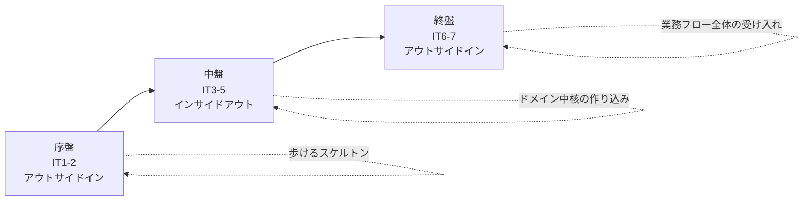
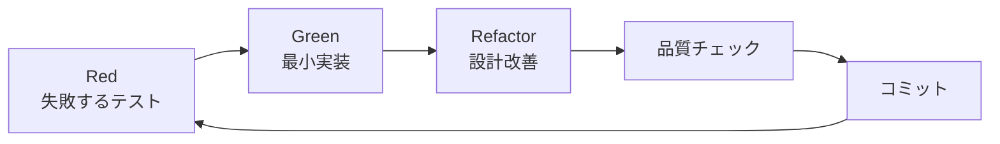
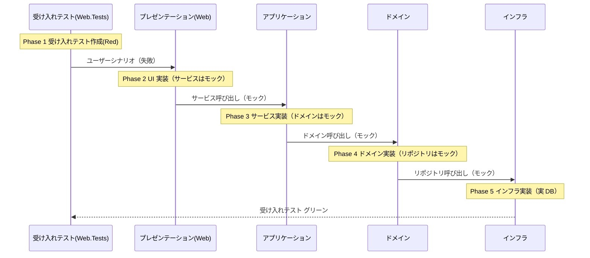
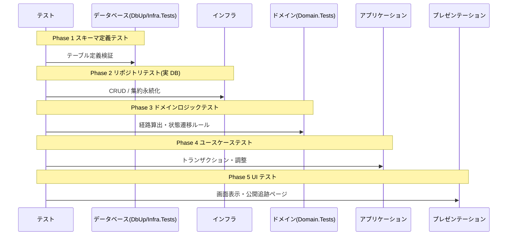
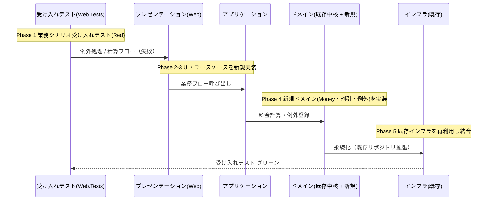
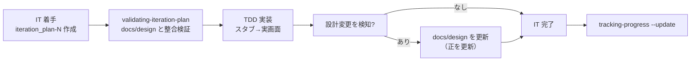

# 開発戦略 - 国際貨物輸送管理システム（Cargo Tracker C# 版）

## 概要

本ドキュメントは、Cargo Tracker C# 版の開発を **序盤・中盤・終盤** の 3 局面に分け、各局面で採用する TDD アプローチ（アウトサイドイン / インサイドアウト）を定義します。局面ごとに適切なアプローチを選択しつつ、全体を通じて一貫した開発リズムを保つことを目的とします。

- 実装プロセスの具体手順・品質基準・コミット規約は [コーディングとテストガイド](../reference/コーディングとテストガイド.md) を Single Source of Truth とします。
- イテレーション × ユーザーストーリーの割り当ては [リリース計画](./release_plan.md) を Single Source of Truth とします。
- 本ドキュメントは「どのイテレーションでどちらのアプローチを採るか」という**戦略レイヤー**を定義し、個々の TDD サイクルはガイドに従います。

---

## 戦略の全体像



| 局面 | イテレーション | 主アプローチ | 狙い |
|------|---------------|-------------|------|
| **序盤** | IT1-2 | アウトサイドイン | 認証・荷主・予約の縦切りで「歩けるスケルトン」を通し、アーキテクチャの妥当性を早期に検証する |
| **中盤** | IT3-5 | インサイドアウト | 経路算出・追跡・荷役という複雑なドメインロジックを、ドメイン層から堅牢に作り込む |
| **終盤** | IT6-7 | アウトサイドイン | 例外対応・請求精算を業務シナリオ起点で束ね、Release 1.0/1.1 の受け入れ観点で一貫性を担保する |

### なぜ「序盤アウトサイドイン → 中盤インサイドアウト → 終盤アウトサイドイン」なのか

アプローチ選択はガイドの [実装アプローチ選択フロー](../reference/コーディングとテストガイド.md#アプローチ戦略) に従います。

- **序盤（アウトサイドイン）**: 基本 CRUD もアーキテクチャ基盤も未実装の状態では、UI/受け入れテストのニーズから API 設計を導出し、レイヤーを薄く貫通させて全体像を固めるのが安全。ガイドの「API 未実装 → アウトサイドイン活用」に対応。
- **中盤（インサイドアウト）**: 経路候補算出（US08）・追跡（US18）・荷役（US15）はドメインロジックが複雑で、貧血ドメインモデルを避けたい。データ層・ドメイン層の基盤を固めてから上位層へ展開する。ガイドの「基盤未確立 → インサイドアウト推奨」に対応。
- **終盤（アウトサイドイン）**: 中盤までにドメイン中核が揃うため、例外・請求はドメインの複雑度が高い一方で「既存ドメインを組み合わせて業務シナリオを完成させる」段階。UI/受け入れテスト起点で結合し、リリース全体の一貫性を確認する。ガイドの「基本実装済み × ドメイン複雑 → アウトサイドイン推奨」に対応。

---

## 共通の TDD サイクル

すべての局面で、以下の Red-Green-Refactor サイクルを共通の心臓部とします（詳細は [コーディングとテストガイド](../reference/コーディングとテストガイド.md#red-green-refactor-サイクル) 参照）。



局面ごとに変わるのは **どのテストから書き始めるか（テストの入口）** と **レイヤーを貫通する順序** です。サイクルそのものは変えません。

### テストプロジェクトとレイヤーの対応

| レイヤー | テストプロジェクト | 主なテスト種別 |
|---------|-------------------|---------------|
| プレゼンテーション | `CargoTracker.Web.Tests` | 受け入れ / UI / エンドポイント |
| アプリケーション | `CargoTracker.Application.Tests` | ユースケース / 統合 |
| ドメイン | `CargoTracker.Domain.Tests` | ビジネスルール / 単体 |
| インフラ | `CargoTracker.Infrastructure.Tests` | 永続化（Testcontainers） |
| 横断（構造） | `CargoTracker.Architecture.Tests` | 依存方向・レイヤー境界 |

### 品質チェック（コミット前の必須確認）

```bash
# ソリューションルート: apps/cargo-tracker
dotnet test apps/cargo-tracker/CargoTracker.sln   # 全テスト
dotnet format apps/cargo-tracker/CargoTracker.sln # フォーマット
dotnet build apps/cargo-tracker/CargoTracker.sln  # ビルド警告 0
```

品質基準（カバレッジ 80% 以上・ドメイン層 85% 以上、循環的複雑度 10 以下、重複 0%、警告 0）はガイドの [品質チェックリスト](../reference/コーディングとテストガイド.md#品質チェックリスト) に従います。`CargoTracker.Architecture.Tests` は局面を問わず常にグリーンを維持します。

---

## 序盤: アウトサイドイン（IT1-2）

### 目的

認証・荷主登録・見積・貨物予約という**業務の入口**を、UI/受け入れテストから内側へ貫通させて実装し、「歩けるスケルトン（Walking Skeleton）」を早期に確立する。アーキテクチャ基盤（DbUp・Unit of Work + post-commit イベント）の妥当性を、実際に動く縦切り機能で検証する。

### 対象ユーザーストーリー

| IT | US | 内容 |
|----|-----|------|
| IT1 | US26 / US02 / US03 / US01 | 認証・荷主登録・法人荷主・輸送見積 |
| IT2 | US04 / US05 / US06 | 貨物予約・危険物冷凍予約・経路設計者への引き渡し |

### ワークフロー

ガイドの [アウトサイドインアプローチ](../reference/コーディングとテストガイド.md#アウトサイドインアプローチ) に基づき、外側（受け入れテスト）から内側（インフラ）へ実装を進めます。



### 手順

1. **受け入れテスト（Red）**: `CargoTracker.Web.Tests` に業務シナリオの失敗テストを書く（例: 「荷主を登録すると一覧に表示される」）。
2. **UI 実装**: エンドポイント/画面を実装し、下位サービスはモックで満たす。
3. **アプリケーション実装**: ユースケースを実装し、ドメイン・リポジトリはモックで満たす。
4. **ドメイン実装**: エンティティ・値オブジェクトのビジネスルールを最小実装。
5. **インフラ実装**: DbUp スキーマ + リポジトリを実装し、Testcontainers で永続化を確認。受け入れテストをグリーンにする。
6. 各フェーズで Red-Green-Refactor と品質チェック、コミット。

### ウォーキングスケルトンの基盤: ナビゲーション一括作成

序盤の要となる作業として、**認証基盤（US26）を構築した直後に、[ui_design.md の画面遷移図](../design/ui_design.md#画面遷移図) に従ったナビゲーションを一括作成**し、これをウォーキングスケルトンの骨格とします。

#### 狙い

- 画面遷移図の全ルートに対する **ロール制御付きナビゲーションバー**（[ui_design.md ナビゲーション構成](../design/ui_design.md#ナビゲーション構成)）と、各遷移先の **プレースホルダ画面（「準備中」スタブ）** を先に通す。
- これにより、認証・ロール別アクセス制御・PRG・フラッシュメッセージ・レイアウトといった横断関心事を、業務ロジックが薄いうちに全画面で成立させる。以降の各イテレーションは「準備中スタブを実画面に差し替える」インクリメンタルな作業になる。
- 未認証リダイレクト・ロール別メニュー表示・公開追跡ページ（認証不要）の到達可否を、序盤の受け入れテストで確認できる状態にする。

#### 一括作成の対象（画面遷移図の全ルート）

ナビゲーションと遷移先スタブは、画面遷移図に現れる全フローを対象とします。表示ロールは [ui_design.md ナビゲーション構成](../design/ui_design.md#ナビゲーション構成) に従います。

| フロー | ルート | 表示ロール | 序盤での状態 |
|--------|--------|-----------|-------------|
| 認証 | `/login`, `/logout` | 全ロール | 実装（US26） |
| ダッシュボード | `/` | 全ロール | 実装（サマリーカードは最小） |
| 荷主 | `/shippers`, `/shippers/new` | ROLE_SALES | IT1 で実画面（US02/03） |
| 見積 | `/estimates`, `/estimates/new`, `/estimates/{id}` | ROLE_SALES | IT1 で実画面（US01） |
| 予約 | `/bookings`, `/bookings/new`, `/bookings/{id}`, `/bookings/{id}/route` | ROLE_SALES, ROLE_SHIPPER | スタブ（IT2/IT4 で実装） |
| 追跡 | `/tracking`, `/tracking/{trackingNumber}`, `.../exceptions/new` | ROLE_SHIPPER, ROLE_CONSIGNEE, ROLE_TRACKER | スタブ（IT5/IT6 で実装） |
| 荷役 | `/handling`, `/handling/new` | ROLE_HANDLER, ROLE_TRACKER | スタブ（IT5 で実装） |
| 航路・経路設計 | `/voyages`, `/voyages/new`, `/voyages/{no}/edit`, `/routing/requests`, `/routing/requests/{bookingId}` | ROLE_ROUTE_DESIGNER | スタブ（IT3/IT4 で実装） |
| 請求 | `/billing/invoices`, `/billing/invoices/{id}` | ROLE_BILLING | スタブ（IT7 で実装） |
| 管理 | `/admin/discount-policies`（+ new/edit） | ROLE_ADMIN | スタブ（IT7 で実装） |
| 公開追跡 | `/public/tracking/{trackingId}` | 認証不要 | スタブ（IT5 で実装） |

> スタブ画面は共通レイアウト（navbar・ページタイトル・フッター）を継承し、本文に「準備中（担当 IT: ITx / US)」を表示する最小ページとします。ルートが解決しリンクが機能することを優先し、業務ロジックは持たせません。

#### 完了条件（ウォーキングスケルトン）

- 画面遷移図の全ナビゲーション項目がロール別に表示制御され、リンク先ルートが 200（または認可外は 403/リダイレクト）で解決する。
- ログイン成功でダッシュボードへ、未認証アクセスは `/login` へリダイレクトされる。公開追跡ページは未認証でも到達できる。
- スタブ画面と実画面が同一の共通レイアウト・フラッシュ機構を共有している。

### 完了条件

- 受け入れシナリオ（US26 ログイン → US02 荷主登録 → US01 見積）がエンドツーエンドで動作する。
- 上記ウォーキングスケルトン（ナビゲーション一括作成）の完了条件を満たす。
- 基盤タスク（DbUp 起動時配線・UoW + post-commit・ロールバック時非発行の統合テスト）が完了している。
- `Architecture.Tests` でレイヤー依存方向が守られている。

---

## 中盤: インサイドアウト（IT3-5）

### 目的

経路候補算出・追跡・荷役という**複雑なドメインロジックの中核**を、データ層・ドメイン層から堅牢に組み上げる。貧血ドメインモデルを避け、ビジネスルールをドメイン層に凝集させる。外部経路サービス ACL はスタブ契約（WireMock.Net）を先に固定し、ドメインをスタブ駆動で作り込む。

### 対象ユーザーストーリー

| IT | US | 内容 |
|----|-----|------|
| IT3 | US24 / US25 / US07 / US08 | 航海スケジュール登録・更新・検索・経路候補算出 |
| IT4 | US09 / US10 / US11 / US12 / US13 | 経路選択・再算出・紐付け・通知・予約確定 |
| IT5 | US14 / US15 / US16 / US17 / US18 | 追跡番号発行・荷役・引取・状態更新・追跡照会 |

### ワークフロー

ガイドの [インサイドアウトアプローチ](../reference/コーディングとテストガイド.md#インサイドアウトアプローチ) に基づき、内側（データ・ドメイン）から外側（プレゼンテーション）へ実装を進めます。



### 手順

1. **データベース（Red→Green）**: `Infrastructure.Tests` で新スキーマ（航海・経路・荷役・追跡）を検証。DbUp スクリプトを追加。
2. **インフラ**: 集約リポジトリを Testcontainers で実 DB に対して実装。
3. **ドメイン**: `Domain.Tests` で経路候補算出・状態遷移などのビジネスルールを厚くテストし作り込む（ここが中盤の主戦場）。
4. **アプリケーション**: ユースケースでドメインを束ね、トランザクション境界を確認。
5. **プレゼンテーション**: 画面・公開追跡ページを実装し表示を確認。
6. 各フェーズで Red-Green-Refactor と品質チェック、コミット。ドメイン層カバレッジ 85% 以上を厳守。

### 完了条件

- 経路算出（US08）・追跡照会（US18）・荷役記録（US15）のドメインルールが単体テストで網羅されている。
- 外部経路サービスはスタブ契約で固定され、契約変更時の影響が局所化されている。
- IT5 完了時に Release 1.0（MVP）のリリース条件（[release_plan.md](./release_plan.md)）を満たす。

---

## 終盤: アウトサイドイン（IT6-7）

### 目的

例外対応・請求・精算を、中盤までに整ったドメイン中核の上に**業務シナリオ起点で結合**する。個々のドメインは複雑だが、既存の集約を組み合わせて「遅延処理 → 通知」「料金算出 → 割引 → 精算」という業務フロー全体を、受け入れテストで一気通貫に検証し、Release 1.0/1.1 の一貫性を担保する。

### 対象ユーザーストーリー

| IT | US | 内容 |
|----|-----|------|
| IT6 | US19 / US20 | 遅延例外処理・破損/紛失例外処理（+ Release 1.0 フィードバック対応） |
| IT7 | US21 / US22 / US23 | 輸送料金算出・法人割引・精算処理 |

### ワークフロー

序盤と同じく [アウトサイドインアプローチ](../reference/コーディングとテストガイド.md#アウトサイドインアプローチ) を採用しますが、終盤では **既存ドメインの再利用** が前提となる点が異なります。モックは「まだ無い部分」だけに限定し、確立済みのドメイン・インフラは実物を使って結合します。



### 手順

1. **受け入れテスト（Red）**: `Web.Tests` に業務シナリオを書く（例: 「Delivered の貨物に請求書を発行し精算する」）。
2. **UI / アプリケーション実装**: 例外登録・精算のユースケースを実装。既存サービスは実物、新規部分のみモック。
3. **新規ドメイン実装**: Money 値オブジェクト・割引上限（30%）・例外エスカレーションなど金額/状態ルールを単体テストで作り込む（境界値テスト必須）。
4. **インフラ結合**: 既存リポジトリを拡張し、実 DB で結合。受け入れテストをグリーンにする。
5. 各フェーズで Red-Green-Refactor と品質チェック、コミット。

### 完了条件

- 例外フロー（US19/20）・精算フロー（US21-23）が受け入れテストで一気通貫に動作する。
- 金額計算の境界値テスト（Money・割引上限 30%）が完了している。
- IT7 完了時に Release 1.1 のリリース条件（[release_plan.md](./release_plan.md)）を満たす。

---

## イテレーションごとの設計ドキュメント整合

ウォーキングスケルトンのスタブを実画面へ差し替えていく各イテレーションでは、**イテレーション計画（`iteration_plan-N.md`）の「設計」節の設計トピックと、`docs/design/` の設計ドキュメントとの整合を常にとりながら**進めます。イテレーション計画は当該 IT の局所ビュー、`docs/design/` はプロジェクト全体の正となる設計であり、両者の食い違いを開発着手前・完了時に解消します。

### 対応する設計ドキュメント

| 設計トピック（イテレーション計画） | 正となる設計ドキュメント |
|-----------------------------------|--------------------------|
| ドメインモデル | [domain-model.md](../design/domain-model.md) |
| データモデル | [data-model.md](../design/data-model.md) |
| ユーザーインターフェース（ビュー・遷移） | [ui_design.md](../design/ui_design.md) |
| API 設計・ディレクトリ構成 | [architecture_backend.md](../design/architecture_backend.md) / [architecture_frontend.md](../design/architecture_frontend.md) |
| ADR | [../adr/](../adr/) |

### 各イテレーションでの整合フロー



1. **着手時**: `iteration_plan-N.md` の「設計」節を作成したら、`validating-iteration-plan` で `docs/design/`（ユーザーストーリー・ドメイン/データモデル・UI 設計）との不整合を検証し、開発着手前に修正する。
2. **実装中**: 画面遷移図（[ui_design.md 画面遷移図](../design/ui_design.md#画面遷移図)）のルート・遷移・ロール制御を正として、スタブを実画面へ差し替える。実装で設計判断が変わった場合は、その場で `docs/design/` の該当ドキュメントを更新し「正」を最新に保つ（イテレーション計画側にのみ書いて放置しない）。
3. **完了時**: `iteration_plan-N.md` の設計節に反映した差分が `docs/design/` に取り込まれているかを確認し、必要なら ADR を起票する。ドメイン/データモデルの構造変更は必ず `Architecture.Tests` とフルテストで裏取りする。

### 整合が崩れやすいポイント

- **画面遷移図とルーティングの乖離**: 新規ルート追加・遷移変更時は先に [ui_design.md](../design/ui_design.md) を更新してから実装する。ナビゲーション（navbar）はウォーキングスケルトンで一括作成済みのため、ロール表示条件の追加・変更のみを差分で反映する。
- **ナビゲーション整合性の必須確認（絶対項目）**: スタブを実画面へ差し替える各 IT では、**個別画面の整合性とナビゲーション整合性の両方**を必ず確認する。「画面は作ったがナビ／ダッシュボードから辿れない」「ナビ項目はあるが表示ロール条件が誤っている」を防ぐため、以下を DoD に含める。
  - 新規／実画面化した画面が、**共通レイアウトの navbar（`Views/Shared/_Layout.cshtml`）とダッシュボード（`Views/Home/Index.cshtml`）の両方**に、[ui_design.md ナビゲーション構成](../design/ui_design.md#ナビゲーション構成) の表示ロールどおりに反映されている。
  - **ナビゲーション表示を検証する自動テスト**（`WalkingSkeletonTest` にロール別のナビ／ダッシュボード表示アサートを追加）で担保する。個別画面の受入テストが緑でも、ナビ導線が抜けていれば別テストで検出できる状態にする。
  - この確認は当該 IT のロール（例: IT3 は ROLE_ROUTE_DESIGNER）について行い、**ui_design.md のナビ表 → navbar → dashboard → テストの 4 点が一致**することを確認する。
- **集約フィールドの後付け追加**: `Maybe`/nullable での段階導入を用い、ADR とドメインモデルを同時更新する。
- **用語のブレ**: ユビキタス言語（請求書/精算書、追跡番号など）をテスト名・画面ラベル・設計ドキュメントで一致させる。

---

## 局面移行時の一貫性維持

局面が切り替わってもアーキテクチャと品質の一貫性を保つため、移行時に以下を確認します。

| 移行 | 確認事項 |
|------|---------|
| 序盤 → 中盤（IT2→IT3） | 序盤で確立した縦切りパターン・レイヤー境界を、中盤のドメイン中心実装でも踏襲する。`Architecture.Tests` がグリーン。 |
| 中盤 → 終盤（IT5→IT6） | 中盤で作り込んだドメイン中核を終盤で再利用する前提を確認。Release 1.0 リリース条件を満たしたうえで移行。 |
| 全局面共通 | テストピラミッド（単体 60% / 統合 30% / E2E 10%）の比率を維持。ユビキタス言語がテスト名・コードに一貫して反映されている。 |

### アプローチが変わっても不変な規律

- Red-Green-Refactor サイクルと 3 原則（[TDD の三つの原則](../reference/コーディングとテストガイド.md#tdd-test-driven-development-の三つの原則)）。
- 1 コミット = 1 論理的変更、ビルドが通る状態でコミット（[コミット規約](../reference/コーディングとテストガイド.md#コミット規約)）。
- 品質基準（カバレッジ・複雑度・重複・警告）とコミット前の品質チェック。
- `Architecture.Tests` による依存方向の常時検証。

---

## 更新履歴

| 日付 | 更新内容 | 更新者 |
|------|---------|--------|
| 2026-07-08 | 初版作成（序盤アウトサイドイン / 中盤インサイドアウト / 終盤アウトサイドインの 3 局面戦略を定義） | - |
