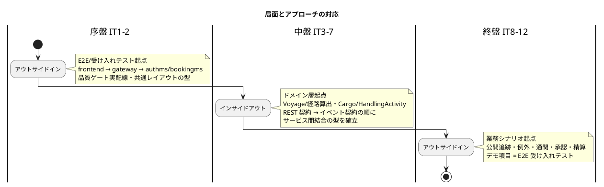
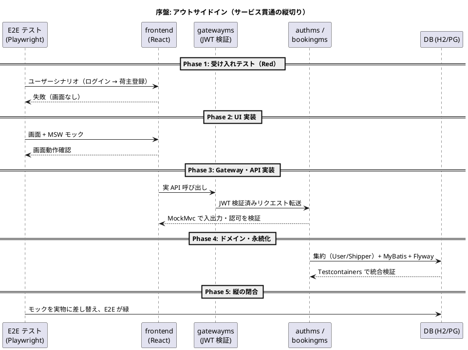
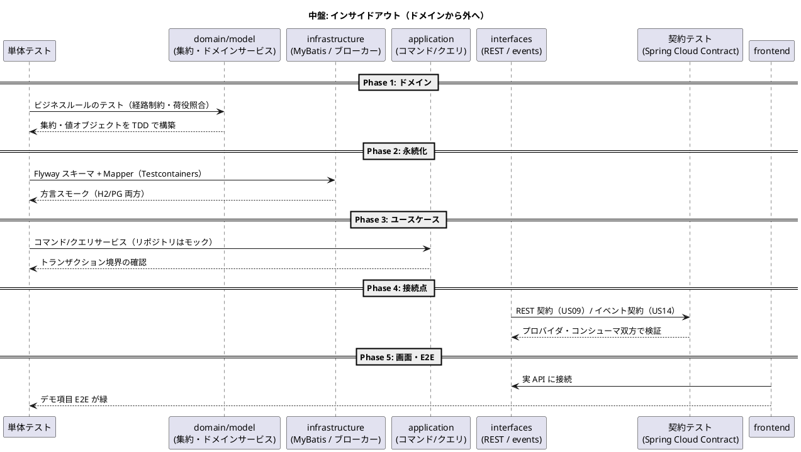
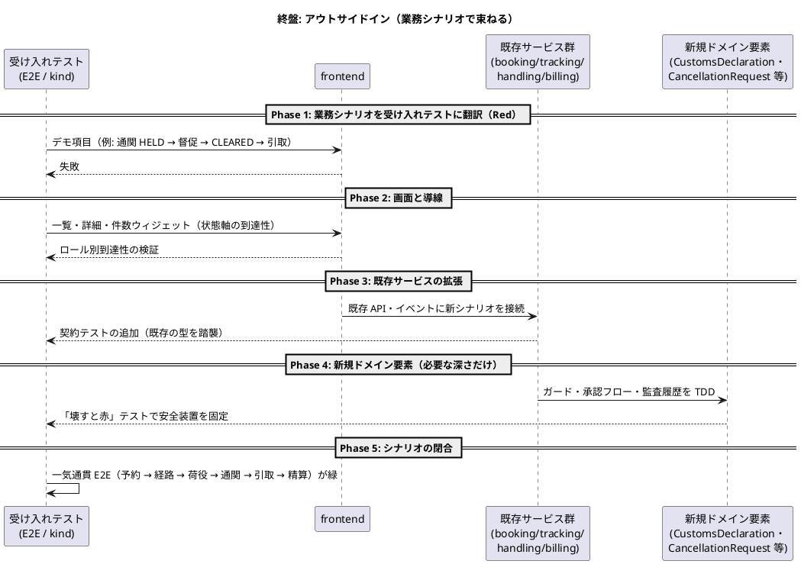

# 開発戦略 - 国際貨物輸送管理システム（java/take-7）

## 概要

本ドキュメントは、計画済みイテレーション（IT1〜IT12 + 予備 IT13）を**序盤・中盤・終盤**の 3 局面に分け、各局面で採用する TDD アプローチと横断的な進め方を定義する。

個々の TDD サイクル（Red-Green-Refactor）は [コーディングとテストガイド](../reference/コーディングとテストガイド.md) に従う。本戦略はその上位で「**テストの入口をどこに置き、レイヤーとサービスをどの順で貫通するか**」を局面ごとに決める。

### 参照元（Single Source of Truth）

| 内容 | 正典 |
| :--- | :--- |
| イテレーション × US のマクロ配分 | [リリース計画](release_plan.md) |
| 各 IT の対象 US・デモ項目・受け入れ基準 | `iteration_plan-N.md`（IT1 は作成済み。以降は各 IT 開始時に作成） |
| TDD アプローチ・選択フロー・手順 | [コーディングとテストガイド](../reference/コーディングとテストガイド.md) |
| テスト種別・形状・品質ゲート | [テスト戦略](../design/test_strategy.md) |
| 画面遷移・ナビゲーション | [UI 設計](../design/ui_design.md) |
| 受入基準 | [ユーザーストーリー](../requirements/user_story.md) |

### take-7 固有の前提

本プロジェクトは**マイクロサービス構成（7 サービス）**のため、従来の「レイヤー貫通」に加えて「**サービス貫通**」の次元がある。局面の設計はこの 2 軸で行う。

- **レイヤー軸**: interfaces → application → domain → infrastructure（ヘキサゴナル 4 層）
- **サービス軸**: frontend → gatewayms → 各サービス →（イベント）→ 別サービス

---

## 戦略の全体像

| 局面 | 対象 IT | リリース | 主アプローチ | 狙い |
| :--- | :--- | :--- | :--- | :--- |
| 序盤 | IT1〜IT2 | Release 0.1 | **アウトサイドイン** | 縦切り（frontend → gateway → authms/bookingms）で「歩けるスケルトン」を通し、認証・共通レイアウト・品質ゲートというアーキテクチャ基盤の妥当性を早期検証する |
| 中盤 | IT3〜IT7 | Release 0.2〜1.0 前半 | **インサイドアウト** | 中核ドメイン（経路候補算出・荷役）とサービス間結合の基盤（REST 契約・イベント契約・ACL）をドメイン層から堅牢に作り込み、貧血ドメインモデルを回避する |
| 終盤 | IT8〜IT12 | Release 1.0 後半〜2.0 | **アウトサイドイン** | 既存の集約・サービスを業務シナリオ（追跡照会・例外・通関・キャンセル承認・精算）起点で結合し、一気通貫とリリース全体の一貫性を担保する |

予備 IT13 は消化する局面のアプローチに従う。



### アプローチ選択の根拠

選択はコーディングとテストガイドの「実装アプローチ選択フロー」に対応づける。

- **序盤（アウトサイドイン）**: API も基盤も未実装 →「API 未実装 → アウトサイドイン活用」。UI・E2E のニーズから API を導出し、薄く貫通させる。認証・ルーティングガード・403 という横断関心事は、業務ロジックが薄いうちに全経路で成立させるのが最も安い
- **中盤（インサイドアウト）**: 経路候補算出（US08・8SP）はグラフ探索と制約充足を含む本システム最複雑のドメインであり、荷役（US15）はイベント + ACL の結合を含む。「基本 CRUD 未実装 → インサイドアウト推奨」に該当し、データ層・ドメイン層の基盤を固めてから上位へ展開して貧血モデルを避ける。**サービス間結合の型（US09 で REST 契約・US14 でイベント契約）もドメインの出力ポートから外へ向かって確立する**
- **終盤（アウトサイドイン）**: 基本実装済み × ドメイン複雑 →「アウトサイドイン推奨」。既存集約（Cargo・TrackingActivity・HandlingActivity・CustomsDeclaration・Invoice）を組み合わせ、業務シナリオを受け入れテストで束ねる

---

## 共通の TDD サイクル（全局面で不変）

局面ごとに変えるのは**テストの入口とレイヤー貫通の順序のみ**。以下は全局面で不変とする。

### Red-Green-Refactor の 3 原則

1. 失敗するテストを書くまで実装コードを書かない
2. テストを通す最小限の実装のみを行う
3. テストが緑の状態でのみリファクタリングする

### テスト種別とレイヤーの対応

テスト形状はハイブリッド（サービス内ピラミッド + サービス間ダイヤモンド）。詳細は [テスト戦略](../design/test_strategy.md)。

| テスト種別 | 対象レイヤー | ツール | 実行 |
| :--- | :--- | :--- | :--- |
| 単体テスト | domain/model（集約・値オブジェクト）、application | JUnit 5 + Mockito + AssertJ | `./gradlew test` |
| 統合テスト | infrastructure（MyBatis Mapper・ブローカー） | Testcontainers（PostgreSQL / RabbitMQ） | `./gradlew test` |
| REST API テスト | interfaces/rest | Spring MockMvc | `./gradlew test` |
| 契約テスト | サービス間（REST・イベント） | Spring Cloud Contract | `./gradlew test`（中盤で導入） |
| アーキテクチャテスト | 全レイヤー・BC 独立性 | ArchUnit（共有配置 + 未適用検出メタテスト） | `./gradlew test` |
| コンポーネントテスト | frontend | Vitest + Testing Library + MSW | `cd apps/frontend && npm test` |
| E2E / 受け入れテスト | 全サービス | Playwright（IT1 で基盤導入） | `npm run e2e`（ローカル）/ kind 統合 |

### 品質チェック（実コマンド）

```bash
# バックエンド（ユニット・統合・ArchUnit・カバレッジ検証を含む）
cd apps/backend && ./gradlew build

# 業務タイムゾーンの日付判定を UTC でも検証
TZ=UTC ./gradlew test

# フロントエンド
cd apps/frontend && npm test && npm run build

# ローカル統合（全 7 サービス + PostgreSQL + RabbitMQ）
npx gulp dev:k8s:up

# 設計と実装の乖離確認（JIG / jig-erd）
npx gulp dev:jig && npx gulp dev:jig-erd
```

### 不変の規律

- **1 コミット 1 目的**: 構造変更と動作変更を同一コミットに含めない（Conventional Commits）
- **ArchUnit 常時グリーン**: Port の追加・ADR 起票を伴う変更では必ずフルテスト（`./gradlew build`）を実行する。レビューは構造的検証を代替できない
- **安全装置は破るテストで固定する**: ロック・認可・通関ガード・楽観的ロックは「入れたこと」ではなく「壊すと赤になること」で検証する
- **集約状態はカラムに永続化する**: 履歴からの再導出は偽の安全網になるため禁止
- **業務日付は注入した Clock で判定する**: テストも本体と同じ Clock を使い、`TZ=UTC` でも回す
- **方言スモーク**: 全クエリを H2 / PostgreSQL の両方で「解釈できるか」を検証する（方言差は両方向に起きる）

---

## デモ項目を受け入れ基準とする（局面横断）

各 `iteration_plan-N.md` の**デモ項目を、そのままパスする E2E 受け入れテストに翻訳**し、当該 IT の受け入れ基準とする。

- **序盤（IT1）**: E2E 基盤（Playwright）をセットアップし、スモーク 1 本（ログイン → ダッシュボード → ログアウト → ブラウザバック不可 + `/` が未認証で 200）を通す。これがウォーキングスケルトン成立の判定基準
- **中盤・終盤**: 各 IT のデモ項目を「操作の系列」に翻訳して E2E テストを追加する。例: IT4 のデモ「経路候補一覧の表示まで」、IT7 のデモ「荷役記録 → 追跡状態の反映」
- **判定**: 当該 IT のデモ項目テストがすべて緑であることを DoD に含める。緑でなければイテレーションはクローズしない
- **回帰**: 追加したテストは以降の全 IT で実行し、既存デモ項目の回帰を防ぐ
- **E2E の日時は業務タイムゾーンで生成する共有ヘルパ**（`apps/frontend/src/lib/business-time.ts`）を使う。`toISOString()` を直接使わない

---

## 序盤: アウトサイドイン（IT1〜IT2 / Release 0.1）

### 目的

縦切りの最初の 1 本（frontend → gatewayms → authms / bookingms → DB）を通し、以降の全 IT が乗る基盤の妥当性を検証する。

- 認証（JWT 発行・Gateway 検証・ロール認可）— ADR-004 の分担をテストで固定
- フロントの型（共通レイアウト・認証ガード付きルーティング・403・ポータル骨格）
- 品質ゲートの実配線（ArchUnit 共有配置 + メタテスト・カバレッジ機械判定・CI・E2E 基盤・方言スモーク）

### 対象ユーザーストーリー

| IT | US | SP |
| :--- | :--- | :--- |
| IT1 | US26 ログイン、US27 ログアウト、US31 アカウント保護、US02 荷主登録 | 9 |
| IT2 | US03 法人荷主、US04 貨物予約、US05 危険物・冷凍予約 | 8 |

### ワークフロー



### 手順

1. E2E（デモ項目の翻訳）を先に書き、赤を確認する
2. UI を MSW モックで動かし、**UI のニーズから API 契約（リクエスト/レスポンス）を導出**する
3. Gateway のルーティング・JWT 検証フィルタ（public-paths の破壊検証つき）→ Controller（MockMvc）→ application → domain（TDD）→ infrastructure（Testcontainers）の順で内側へ掘る
4. モックを実物に差し替え、E2E の緑で縦切りを閉じる

### 完了条件

- IT1・IT2 のデモ項目 E2E がすべて緑
- 品質ゲート 5 点（ArchUnit 全サービス・カバレッジ検証・CI・E2E 基盤・方言スモーク）が実配線され、`./gradlew build` と `TZ=UTC ./gradlew test` が緑
- 全ロール名確定・`ui_design.md` の保留記述解消（IT3 での作り直し防止）
- Heroku デプロイ後 `npx gulp deploy:dev:health` の全 URL が 200

---

## 中盤: インサイドアウト（IT3〜IT7 / Release 0.2〜1.0 前半）

### 目的

本システムの中核ドメインを、データ層・ドメイン層から堅牢に作り込む。

- **経路候補算出（US08）**: 航海スケジュール・寄港地接続・期限・貨物種別・港湾制約を考慮するグラフ探索。UI から書き始めると制約ロジックがサービス層に漏れて貧血モデル化するため、`Voyage` 集約と経路算出ドメインサービスの単体テストから始める
- **サービス間結合の型**: US09 で REST 契約（bookingms ⇄ routingms・ACL）、US14 でイベント契約（`TrackingNumberIssuedEvent`・RabbitMQ。[ADR-022](../adr/022-domain-event-contract.md)）を、**ドメインの出力ポートから外へ向かって**確立する。以降の全イベント（荷役・通関・精算）はこの型を踏襲する
- **荷役（US15）**: HandlingActivity 集約 + CargoSnapshot ACL + イベント発行の複合。予定ルート照合のドメインルールを先に固める

### 対象ユーザーストーリー

| IT | US | SP | デモの区切り |
| :--- | :--- | :--- | :--- |
| IT3 | US24, US25, US06, US07 | 10 | 航海スケジュールの登録・更新・検索と予約の引き渡し |
| IT4 | US08 | 8 | **経路候補一覧の表示まで**（往復は IT5 で閉じる） |
| IT5 | US09, US10, US11 | 8 | 候補の選択 → 確定 → 予約への紐付けの往復が閉じる |
| IT6 | US12, US13, US14, US32 | 9 | 予約確定 → 追跡番号発行（初イベント）。イベント基盤構築を独立タスクで |
| IT7 | US15, US16 | 10 | 荷役記録 → 追跡状態の反映（2 本目のイベント） |

### ワークフロー



### 手順

1. 集約・ドメインサービスの単体テストから始める（依存ゼロ・最速のフィードバック）
2. Flyway マイグレーション + Mapper を Testcontainers で検証し、方言スモークを通す
3. アプリケーションサービス（ユースケース）をモックリポジトリで TDD
4. サービス間の接続点は契約テストを先に書く（コンシューマ駆動）。イベントは `@TransactionalEventListener(AFTER_COMMIT)` の型を守る
5. 画面を実 API に接続し、デモ項目 E2E で閉じる

### 完了条件

- 各 IT のデモ項目 E2E が緑（IT4 は「候補一覧表示まで」の区切りを明示的に守る）
- US09 完了時に REST 契約、US14 完了時にイベント契約の型が確立され、契約テストが CI に配線されている
- kind 統合環境で `TrackingNumberIssuedEvent` / `HandlingActivityRegisteredEvent` の発行・購読スモークが緑
- ドメイン層カバレッジ 90% 以上を機械判定で維持

---

## 終盤: アウトサイドイン（IT8〜IT12 / Release 1.0 後半〜2.0）

### 目的

既存の集約・サービスを**業務シナリオ起点**で結合し、一気通貫とリリース全体の一貫性を担保する。ここで作るのは新しいドメインの塊ではなく、「現場の仕事が回る形」への束ね直しである。

- 公開追跡（US18）: 認証の外の唯一の画面。入口（ポータル・ログイン画面）からの導線を E2E で固定
- 例外・通関・キャンセル承認（US19/20/29/30）: **状態軸の到達性**（件数 → 対象一覧）を同一 IT で実装する横断規約の適用対象
- 誤配（US28）: 4 サービスを横断する最長のシナリオ。検知 → 起票 → 再設計を 1 本の受け入れテストで束ねる
- 精算（US21〜23）・見積（US01): CargoDeliveredEvent からの連鎖と金額計算（プロパティテスト）

### 対象ユーザーストーリー

| IT | US | SP |
| :--- | :--- | :--- |
| IT8 | US17, US18, US19, US20 | 9 |
| IT9 | US29, US30 | 10 |
| IT10 | US28 | 7 |
| IT11 | US21, US22 | 9 |
| IT12 | US23, US01（+ US21 の再実施） | **11** |

### ワークフロー



### 手順

1. デモ項目を受け入れテスト（E2E）に翻訳し、赤から始める
2. 画面・導線（件数 → 一覧 → 詳細）を先に作り、ロール別到達性・状態軸の到達性を検証に含める
3. 既存サービスへの接続は既存の契約テストの型を踏襲して追加する
4. 新規のドメイン要素（通関ガード・承認フロー）は必要な深さだけ TDD で掘り、安全装置は破壊検証とペアにする
5. リリースごとの一気通貫 E2E で閉じる

### 完了条件

- 各 IT のデモ項目 E2E が緑
- 安全装置（通関ガード・キャンセル承認・追記専用監査）の「壊すと赤」テストがパス
- 状態軸の到達性（US19/20/29/30 の件数ウィジェット → 対象一覧）が同一 IT で実装・検証済み
- Release 2.0 時点で一気通貫 E2E（予約 → 精算）が緑

---

## イテレーションごとの設計ドキュメント整合

各 IT で `iteration_plan-N.md` の設計トピックと `docs/design/`（ドメイン/データモデル・UI 設計・アーキテクチャ・ADR）の整合を、着手時・実装中・完了時に確認する。

- イテレーション計画は**局所ビュー**、`docs/design/` は**全体の正**。実装で設計判断が変わったらその場で `docs/design/` を更新する（計画側だけに書いて放置しない）
- **スコープ外 → 内の変更は正典 3 点（ADR・domain-model・該当 plan）を同一変更で更新する**（過去 take の教訓）
- 着手時は `validating-iteration-plan` で検証し、構造変更はアーキテクチャテストとフルテストで裏取りする
- 各 IT クローズ時に JIG / jig-erd を再生成し、設計（docs/design）と実装の乖離を差分で確認する

## 局面移行時の一貫性維持

- **序盤 → 中盤（IT2 → IT3）**: 序盤で確立した型（ヘキサゴナル 4 層・ArchUnit ルール・フロント共通レイアウト）を routingms へコピーして差分だけ直す。型の再議論はしない。ArchUnit のメタテストが「routingms がルール適用対象に入っていないこと」を検出することを確認してから着手する
- **中盤 → 終盤（IT7 → IT8）**: 中盤で確立した契約テストの型（REST・イベント）を新シナリオでも踏襲する。終盤で新しい結合方式を発明しない。発明が必要になったら ADR を起票してから実装する（設計図の向きを変えたら ADR）
- **不変のもの**: Red-Green-Refactor 3 原則・1 コミット 1 目的・品質ゲート（ArchUnit / カバレッジ / TZ=UTC / E2E）・ユビキタス言語（ドメインモデル設計の用語集）は局面に関わらず維持する

## 更新履歴

| 日付 | 更新内容 | 更新者 |
|------|---------|--------|
| 2026-08-19 | 初版作成（IT1〜IT12 を 3 局面に割り当て。序盤・終盤 = アウトサイドイン、中盤 = インサイドアウト） | - |
