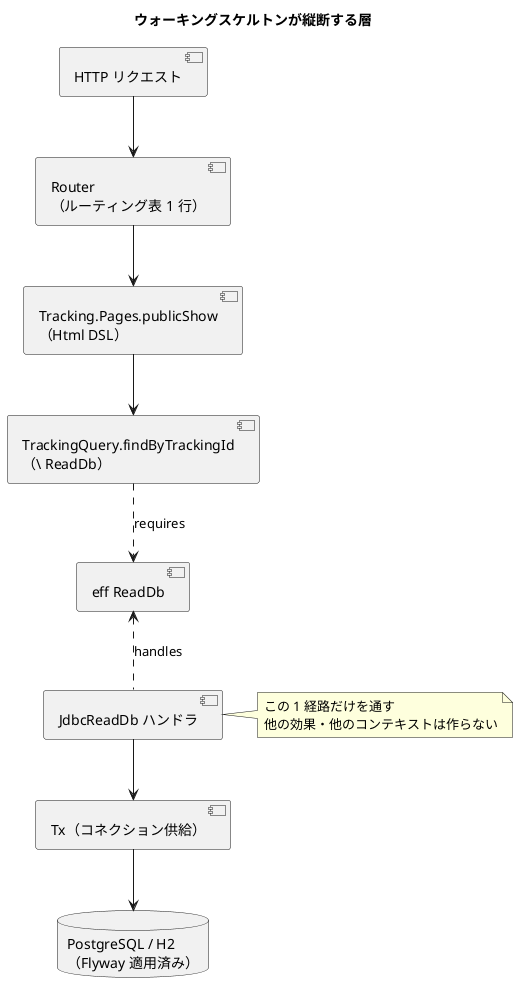

# 開発戦略 - 国際貨物輸送管理システム（Flix 実装）

## 概要

本ドキュメントは、[リリース計画](release_plan.md) の 10 イテレーションを **序盤・中盤・終盤**の 3 局面に分け、
各局面で採用する TDD アプローチと設計ドキュメントの整合方針を定義します。

局面ごとにアプローチを変えるのは、解くべき問題が局面ごとに異なるためです。
序盤は「アーキテクチャが成立するか」、中盤は「ビジネスルールが正しいか」、終盤は「業務フローが通るか」が主題になります。

本ドキュメントは [設計索引](../design/index.md) の「段階的実装方針（暫定）」を正式化したものです。

---

## 1. 局面の定義

| 局面 | イテレーション | 主題 | TDD アプローチ |
|------|:---:|------|---------------|
| **序盤** | IT1-IT3 | アーキテクチャの成立と基盤の確立 | **アウトサイドイン** |
| **中盤** | IT4-IT7 | ドメインモデルとビジネスルールの構築 | **インサイドアウト** |
| **終盤** | IT8-IT10 | 業務フローの結合と例外系の作り込み | **アウトサイドイン** |

### 序盤（IT1-IT3）: アーキテクチャの成立

**目的**: 設計が机上の仮定で終わっていないことを、動くコードで証明する。

**アプローチ: アウトサイドイン**

外側（HTTP リクエスト）から始めて内側（データベース）へ降ります。この局面で確かめたいのは
ドメインロジックの正しさではなく、**層と層のつなぎ目が成立するか**だからです。

```
受入テスト（HTTP レベル）を先に書く
  → ルーティング → 画面関数 → ユースケース → 効果宣言 → ハンドラ → SQL
  → 各段階で最小実装を置き、受入テストが緑になるまで内側へ降りる
```

**この局面で検証する仮定**（[リリース計画](release_plan.md) の Release v0.1.0 と対応）:

| 仮定 | 検証方法 | 破れた場合の影響 |
|------|---------|----------------|
| 効果によるポート注入が実用に耐える | シグネチャの効果数と行数を実測 | アーキテクチャの根本見直し |
| `Tx` 効果でトランザクション境界が引ける | 同一トランザクション内の複数 SQL を検証 | 永続化設計の見直し |
| after-commit イベント配信が成立する | ロールバック時に配信されないことを検証 | イベント駆動設計の見直し |
| `Html` DSL の記述量が許容範囲 | 1 画面あたりの行数を実測 | テンプレートエンジン導入の再検討 |
| `arch-lint` が違反を検出できる | 違反フィクスチャで検証 | 規約の強制手段を失う |

### 中盤（IT4-IT7）: ドメインモデルの構築

**目的**: 集約の不変条件と状態遷移を、外部依存なしで正確に組み上げる。

**アプローチ: インサイドアウト**

ドメイン層から始めて外側へ向かいます。この局面の主題はビジネスルールであり、
**外部依存を後回しにすることでルールに集中できる**ためです。

```
集約・値オブジェクトの単体テスト（効果なし）
  → 効果（ポート）を宣言
  → インメモリハンドラでユースケースの単体テスト
  → JDBC ハンドラの統合テスト
  → ルーティング・画面
```

**この局面の規律**:

- ドメイン層の関数は効果を要求しない。現在時刻は引数で受け取る
- 状態遷移は「許可される遷移」と「拒否される遷移」の両方をテストする
- 不変条件は `Result[DomainError, t]` で表し、例外に頼らない
- 実装を書く前にビジネスルール ⇄ テストの対応表（`business_rule_traceability.md`）に行を追加する

### 終盤（IT8-IT10）: 業務フローの結合

**目的**: コンテキストをまたぐフローと例外系を通し、業務として成立させる。

**アプローチ: アウトサイドイン**

再び外側から入ります。この局面の主題は個々のルールではなく
**複数コンテキストをまたぐ振る舞い**（荷役 → 追跡の反映、配送完了 → 精算）であり、
E2E シナリオを起点にする方が抜けを見つけやすいためです。

```
E2E シナリオ（Playwright）を先に書く
  → HTTP 統合テスト → イベント購読 → ユースケース → ドメイン
```

**この局面の規律**:

- ドメインイベントの購読側は、発行側と別トランザクションであることを前提にテストする
- 例外系（遅延・破損・紛失・通関保留）を正常系と同じ密度でテストする
- 反映遅延（after-commit + 30 秒ポーリング）を UI で説明しているか確認する

---

## 2. ウォーキングスケルトンの定義

IT1 で構築するウォーキングスケルトンの範囲を明示します。**汎用化しない**ことが最も重要な規律です。

### 対象ユースケース

**公開貨物追跡（US18 の一部）**: 追跡番号を受け取り、貨物の現在ステータスを HTML で返す。

選定理由:

- 認証を必要としない（自作セキュリティという最大リスクを IT3 まで分離できる）
- 読み取りのみだが、`Tx`・JDBC ハンドラ・`Html` DSL・ルーティングをすべて通る
- E2E シナリオ④として最後まで回帰テストに使える

### 縦断する層



### 完了条件

- [ ] `GET /public/tracking/{trackingId}` が HTML を返す
- [ ] 存在しない追跡番号で「該当する貨物が見つかりません」を返す
- [ ] Flyway で `tracking_activity` 系のテーブルが作成される
- [ ] H2 に対する統合テストが通る
- [ ] JDK `HttpClient` による HTTP 統合テストが通る
- [ ] `arch-lint` の規約 1・2・3・5 に違反しない（IT2 で機械検査を実装）

### やらないこと（IT1 のスコープ外）

汎用化の誘惑を断つため、明示的に列挙します。

- 認証・認可・セッション・CSRF（IT3）
- `Html` のコンポーネント群（レイアウト・ナビ・フォーム）（IT2 の TS04）
- 書き込み系の効果（`CargoRepo` 等）とトランザクション書き込み（IT4 以降）
- イベントバス（IT8 で荷役 → 追跡の連携を作るときに導入）
- 他のコンテキスト（Booking・Routing 等）のモジュール雛形

> **原則**: 「後で必要になるから今作る」は禁止。必要になったイテレーションで作ります。

---

## 3. デモ項目を受け入れ基準とする方針

各イテレーションの**デモ項目をそのまま受け入れテストとして自動化**します。
「デモできること」と「テストが通ること」を一致させ、デモのための手作業を排除するためです。

| 局面 | デモ項目の実現手段 |
|------|------------------|
| 序盤 | HTTP 統合テスト（JDK `HttpClient`）。ブラウザ操作を伴うものは Playwright |
| 中盤 | ユースケースの単体テスト + HTTP 統合テスト。ドメインルールは単体テストで示す |
| 終盤 | E2E シナリオ（Playwright）。5 本のシナリオがそのままデモになる |

**規律**:

- イテレーション計画のデモ項目は、対応するテスト関数名を併記する
- 自動化できないデモ項目は計画に入れない（手動確認は DoD のチェックリストで扱う）

---

## 4. 設計ドキュメントとの整合方針

実装と設計が乖離すると、設計ドキュメントは急速に信用を失います。以下を規律とします。

### 正典の所在

| トピック | 正典 |
|---------|------|
| ユーザーストーリー・受入基準 | `docs/requirements/user_story.md` |
| 業務フロー・アクターの職掌 | `docs/requirements/business_usecase.md` |
| コンテキスト・集約・ビジネスルール・ユビキタス言語 | `docs/design/domain-model.md` |
| テーブル・カラム・命名 | `docs/design/data-model.md` |
| 画面・URL・遷移・ナビゲーション | `docs/design/ui_design.md` |
| ロール定義・API・効果（ポート）・レイヤ規約 | `docs/design/architecture_backend.md` |
| テストレベル・品質ゲート・トレーサビリティ | `docs/design/test_strategy.md` |

### 更新の規律

1. **実装と設計は同一コミットで更新する**。「後でドキュメントを直す」は先行乖離を生む
2. **スコープ外だった要素を実装する場合は、正典 3 点（ADR・設計ドキュメント・該当イテレーション計画）を同時に更新する**
3. **設計ドキュメントに欠落があると気づいた場合**は、計画に「注（設計への反映が必要）」と明記し、当該イテレーションで反映する
4. **命名は正典に従う**。実装側で別名を導入しない（どうしても必要なら正典を先に変える）
5. **ユビキタス言語の変更は `domain-model.md` から始める**。コードの変更が先行しない

### イテレーションごとの整合確認

各イテレーションのクローズ時（`closing-iteration`）に以下を確認します。

- [ ] 実装した集約・値オブジェクト・効果が `domain-model.md` / `architecture_backend.md` に載っている
- [ ] 追加したテーブル・カラムが `data-model.md` に載っている
- [ ] 追加した画面・URL が `ui_design.md` の画面一覧・遷移図・ナビに載っている
- [ ] トレーサビリティ表（`test_strategy.md` 5 章）に完了ストーリーの行が埋まっている
- [ ] ビジネスルール ⇄ テストの対応表に未対応ルールがない

---

## 5. 技術的負債の扱い

**「余力次第で返済する」という枠は設けません**。余力は生まれず、負債は繰り越されて固定化するためです。

代わりに以下とします。

- 返済すべき負債は、**イテレーション序盤の独立したコミット枠**として計画に明示する
- 当該イテレーションで返済しないと判断した場合は、**スコープ外であることを計画に明記**する（「余力次第」と書かない）
- 負債の発生時は `docs/adr/` または該当イテレーションのふりかえりに記録し、返済イテレーションを指定する

---

## 6. 局面ごとのリスクと着手判断

| 局面 | 主なリスク | 着手前の判断基準 |
|------|-----------|----------------|
| 序盤 | 効果の伝播でシグネチャが破綻する | IT1 完了時に効果数と行数を実測。破綻の兆候があれば IT2 で設計を見直す |
| 序盤 | 基盤の自作が想定以上に膨らむ | 「やらないこと」を守る。汎用化の必要が生じたら次イテレーションへ回す |
| 中盤 | ドメインモデルが設計と乖離する | 実装前に `domain-model.md` の該当節を読む。乖離は設計側を先に直す |
| 終盤 | イベント連携の結果整合で見えないバグが出る | 状態は必ずカラムに永続化する。履歴からの再導出を禁じる |
| 全局面 | Flix 0.x の破壊的変更 | バージョン固定。アップグレードは独立コミット + フルテスト |

---

## 更新履歴

| 日付 | 更新内容 | 更新者 |
|------|---------|--------|
| 2026-07-31 | 初版作成（設計索引の暫定方針を正式化） | - |
