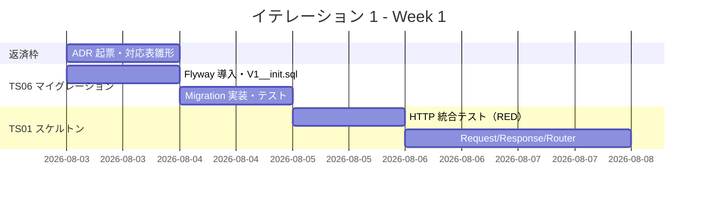
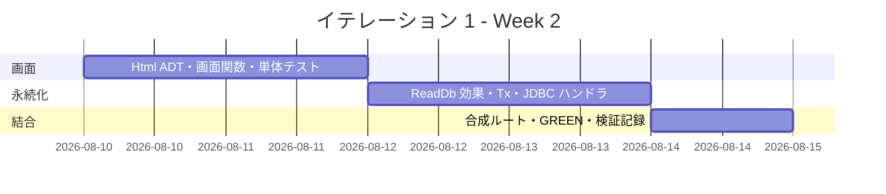
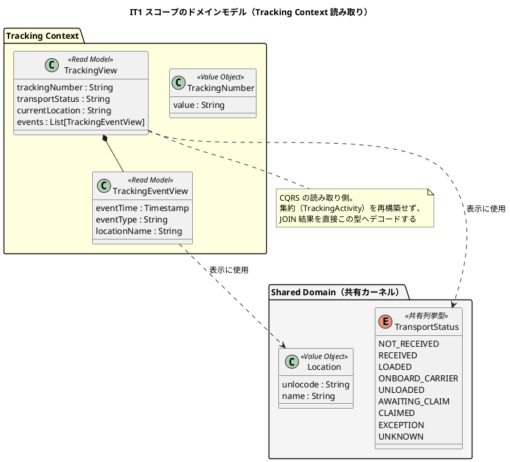
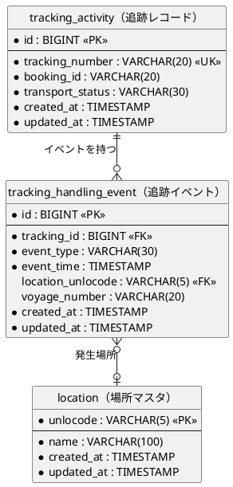
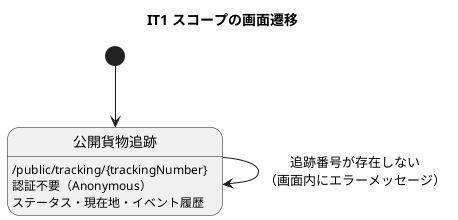

# イテレーション 1 計画

## 概要

| 項目 | 内容 |
|------|------|
| **イテレーション** | 1 |
| **期間** | Week 1-2（2026-08-03 〜 2026-08-14） |
| **局面** | 序盤（アウトサイドイン。[開発戦略](development_strategy.md) 参照） |
| **ゴール** | 公開貨物追跡の 1 ユースケースを HTTP からデータベースまで縦に貫き、設計が前提とする機構が実装として成立することを証明する |
| **目標 SP** | 16 |

---

## ゴール

### イテレーション終了時の達成状態

1. **ウォーキングスケルトンの成立**: `GET /public/tracking/{trackingNumber}` が、ルーティング → 画面関数 → クエリサービス → `ReadDb` 効果 → JDBC ハンドラ → データベースを通って HTML を返す
2. **マイグレーション基盤の確立**: Flyway で `location` / `tracking_activity` / `tracking_handling_event` の 3 テーブルが作成され、テストと本番で同一のスクリプトが適用される
3. **アーキテクチャ仮定の検証**: 効果によるポート注入・`Tx` によるコネクション供給・`Html` DSL の記述量について、**実測値を得て記録する**

### 成功基準

- [ ] 追跡番号を指定して貨物の状態・現在地・イベント履歴が HTML で表示される
- [ ] 存在しない追跡番号でエラーメッセージが表示される（HTTP 200 で画面内表示）
- [ ] H2（PostgreSQL 互換モード）に対する統合テストが通る
- [ ] JDK `HttpClient` による HTTP 統合テストが通る
- [ ] `npm run dev:verify` が全件成功する
- [ ] **検証記録**（効果数・シグネチャ行数・1 画面あたりの行数・ビルド時間）をふりかえりに記載する

> **カバレッジ目標は設定しません**。Flix に計測ツールが存在しないためです（[テスト戦略](../design/test_strategy.md) 6.1）。
> 代わりに「ビジネスルール ⇄ テスト」の対応表とトレーサビリティ表で網羅を担保します。

---

## ユーザーストーリー

### 対象ストーリー

| ID | ストーリー | SP | 優先度 | Issue |
|----|-----------|:--:|--------|-------|
| TS01 | ウォーキングスケルトン（HTTP ルータ・Html DSL 最小・`Tx` 効果・JDBC ハンドラの縦断） | 13 | 必須 | [#440](https://github.com/k2works/case-study-cargo-tracker/issues/440) |
| TS06 | Flyway マイグレーション基盤 | 3 | 必須 | [#441](https://github.com/k2works/case-study-cargo-tracker/issues/441) |
| **合計** | | **16** | | |

GitHub Project: [CargoTracker flix/take-1](https://github.com/users/k2works/projects/39)
マイルストーン: `[flix/take-1] Release 0.1.0 基盤と公開追跡`

US18（追跡情報を照会する）の受入基準のうち、**公開追跡の読み取り経路のみ**を本イテレーションで扱います。
US18 自体の完了は IT2（画面の作り込み）で判定します。

### ストーリー詳細

#### TS01: ウォーキングスケルトン

**ストーリー**:
> 開発チームとして、1 つのユースケースを HTTP からデータベースまで縦に貫きたい。
> なぜなら、代数的効果によるヘキサゴナルアーキテクチャが実装として成立するかを、
> 机上の仮定ではなく動くコードで確認する必要があるからだ。

**受入条件**:

1. `GET /public/tracking/{trackingNumber}` が認証なしでアクセスでき、HTML を返す
2. 存在する追跡番号で、輸送状態・現在地・イベント履歴が表示される
3. 存在しない追跡番号で「該当する貨物が見つかりません。追跡番号を確認の上、再度お試しください」が表示される
4. クエリサービスは `ReadDb` 効果を要求し、ハンドラを差し替えるだけでインメモリ実装に置き換えられる
5. `arch-lint` の規約 1・2・3・5 に違反する構造がない（機械検査は IT2 で実装）

**やらないこと**（[開発戦略](development_strategy.md) 2 節）:

認証・セッション・CSRF、`Html` コンポーネント群、書き込み系の効果、イベントバス、他コンテキストの雛形。

#### TS06: Flyway マイグレーション基盤

**ストーリー**:
> 開発チームとして、スキーマ変更をバージョン管理したい。
> なぜなら、テストと本番で同一のスキーマを保証し、H2 と PostgreSQL の方言差を早期に検出したいからだ。

**受入条件**:

1. `V1__init.sql` が Flyway で適用され、`location` / `tracking_activity` / `tracking_handling_event` が作成される
2. アプリケーション起動時に 1 度だけマイグレーションが実行される
3. テストでも同一の SQL が適用される（テスト専用 DDL を作らない）
4. 開発用のシードデータが `R__seed_dev.sql`（繰り返し実行可能）で投入される

### タスク

#### 1. TS06: Flyway マイグレーション基盤（3 SP）

| # | タスク | 見積もり | 担当 | 状態 |
|---|--------|:---:|------|:---:|
| 1.1 | `flix.toml` に Flyway・HikariCP を追加し、依存解決を確認する | 1h | - | [ ] |
| 1.2 | `V1__init.sql` を作成（`location` / `tracking_activity` / `tracking_handling_event`） | 2h | - | [ ] |
| 1.3 | `Migration.flix`（Java 相互運用で `Flyway.migrate()` を呼ぶ）を実装する | 2h | - | [ ] |
| 1.4 | `R__seed_dev.sql`（開発シード）を作成する | 1h | - | [ ] |
| 1.5 | H2 でマイグレーションが適用されることをテストする | 2h | - | [ ] |

**小計**: 8h（理想時間）

#### 2. TS01: ウォーキングスケルトン（13 SP）

**アウトサイドインで進めます。** 受入テストを先に書き、外側から内側へ降ります。

| # | タスク | 見積もり | 担当 | 状態 |
|---|--------|:---:|------|:---:|
| 2.1 | 【RED】HTTP 統合テストを書く（JDK `HttpClient` で `/public/tracking/{n}` を叩き 200 と本文を検証） | 3h | - | [ ] |
| 2.2 | `Request` / `Response` / `HttpMethod` の ADT を定義する | 2h | - | [ ] |
| 2.3 | `Router`（`Route` ADT・パスパターン照合・`RequiredRole` を含む）を実装する | 4h | - | [ ] |
| 2.4 | `HttpServer`（JDK 内蔵）の起動と Executor 構成（仮想スレッド・同時実行上限）を実装する | 3h | - | [ ] |
| 2.5 | `Html` ADT と `render`（エスケープ既定）を実装する | 3h | - | [ ] |
| 2.6 | `Tracking.Pages.publicShow`（Read Model を受け取り `Html` を返す純粋関数）を実装する | 3h | - | [ ] |
| 2.7 | 画面関数の単体テスト（表示項目・エスケープ・未検出時の文言） | 2h | - | [ ] |
| 2.8 | `eff ReadDb` を宣言し、`TrackingQuery.findByTrackingNumber` を実装する | 2h | - | [ ] |
| 2.9 | インメモリ `ReadDb` ハンドラでクエリサービスの単体テストを書く | 2h | - | [ ] |
| 2.10 | `eff Tx`（`connection` / `afterCommit`）と `transactional`（読み取り専用対応）を実装する | 4h | - | [ ] |
| 2.11 | `JdbcReadDb` ハンドラと `TrackingRow` デコーダ（`ResultSet` → Read Model）を実装する | 4h | - | [ ] |
| 2.12 | H2 に対する永続化統合テスト（JOIN を含む読み取りクエリ） | 3h | - | [ ] |
| 2.13 | 合成ルート（`Composition.flix`）でハンドラを結線し、`Main` から起動する | 2h | - | [ ] |
| 2.14 | 【GREEN】HTTP 統合テストを通す | 2h | - | [ ] |
| 2.15 | 【REFACTOR】重複除去・命名整理。**検証記録の測定**（効果数・行数・ビルド時間） | 3h | - | [ ] |

**小計**: 42h（理想時間）

#### 3. 設計レビューの残作業（返済枠・0 SP）

[設計レビュー](../review/設計ドキュメント_review_20260731.md) の残作業のうち、本イテレーションの前提になるものを
**イテレーション序盤の独立コミット枠**として実施します（[開発戦略](development_strategy.md) 5 節）。

| # | タスク | 見積もり | 担当 | 状態 |
|---|--------|:---:|------|:---:|
| 3.1 | ADR-0001: Flix 採用とバージョン固定方針 | 1h | - | [ ] |
| 3.2 | ADR-0002: Web・セキュリティ基盤の自作とその補償策 | 1h | - | [ ] |
| 3.3 | `business_rule_traceability.md` の雛形作成（[テスト戦略](../design/test_strategy.md) 6.1） | 1h | - | [ ] |

**小計**: 3h（理想時間）

> ADR-0003（セッション要件の扱い）は認証を扱う IT3 で起票します。**本イテレーションではスコープ外**とし、
> 「余力次第」とはしません。

#### タスク合計

| カテゴリ | SP | 理想時間 | 状態 |
|---------|:--:|:---:|:---:|
| TS06 Flyway マイグレーション基盤 | 3 | 8h | [ ] |
| TS01 ウォーキングスケルトン | 13 | 42h | [ ] |
| 設計レビュー残作業（返済枠） | 0 | 3h | [ ] |
| **合計** | **16** | **53h** | |

**1 SP あたり**: 約 3.3h
**進捗率**: 0%（0/16 SP）

> **見積もり超過の認識**: 想定稼働は 40h/イテレーションであり、53h は 33% の超過です。
> 1 SP ≒ 2.5h という当初想定に対し、本計画は 3.3h/SP になっています。
> **これは基盤の自作を含む序盤の実態を反映した結果であり、初回イテレーションの実績値として観測することに意味があります**。
> 超過分は TS01 の 2.3（Router）・2.10（`Tx`）を最小実装に留めることで吸収します。
> それでも収まらない場合は TS06 の 1.4（シードデータ）を IT2 へ送ります。

---

## スケジュール

### Week 1（Day 1-5）



| 日 | タスク |
|----|--------|
| Day 1 | 3.1-3.3（返済枠）、1.1-1.2（Flyway 導入・DDL） |
| Day 2 | 1.3-1.5（Migration 実装・テスト） |
| Day 3 | 2.1（HTTP 統合テストを RED で書く）、2.2（Request/Response ADT） |
| Day 4 | 2.3（Router） |
| Day 5 | 2.3 続き、2.4（HttpServer・Executor 構成） |

### Week 2（Day 6-10）



| 日 | タスク |
|----|--------|
| Day 6 | 2.5（Html ADT・render）、2.6（画面関数） |
| Day 7 | 2.7（画面関数の単体テスト）、2.8（`ReadDb` 効果・クエリサービス） |
| Day 8 | 2.9（インメモリハンドラのテスト）、2.10（`Tx` 効果） |
| Day 9 | 2.11（JDBC ハンドラ・デコーダ）、2.12（永続化統合テスト） |
| Day 10 | 2.13（合成ルート）、2.14（GREEN）、2.15（リファクタと**検証記録の測定**）、デモ準備 |

---

## 設計

本イテレーションのスコープに絞って掲載します。

### ドメインモデル

本イテレーションは**読み取り専用**であり、集約の状態遷移を扱いません。
したがって扱うのは Tracking Context の読み取りモデルと共有カーネルのみです。



**注（設計への反映が必要）**: [バックエンドアーキテクチャ](../design/architecture_backend.md) のコンテキストマップに
「Location（UN/LOCODE）のみ共有カーネルとして維持」とありますが、[ドメインモデル設計](../design/domain-model.md) の
共有コンポーネント一覧では `Location`・`ShipperId`（共有カーネル）と `TransportStatus`・`RoutingStatus`（共有列挙型）が
共有対象とされています。**ドメインモデル設計を正典**とし、バックエンドアーキテクチャの記述を本イテレーションで是正します。

### 状態モデル

`TransportStatus`（9 値）は本イテレーションでは**表示のみ**で、遷移を扱いません。
値は [ドメインモデル設計](../design/domain-model.md) を正典とし、表示ラベルとバッジ色は
[UI 設計 - TransportStatus バッジ定義](../design/ui_design.md) に従います。
状態遷移の実装は IT8（US15 荷役記録）で行います。したがって状態遷移図は掲載しません。

### データモデル



カラム定義は [データモデル設計](../design/data-model.md) の該当節と一致させています。
`location` は `tracking_handling_event.location_unlocode` の参照先として必要なため本イテレーションで作成します。

### ユーザーインターフェース

対象は公開貨物追跡の 1 画面のみです。ワイヤーフレームは
[UI 設計 - 公開貨物追跡](../design/ui_design.md#公開貨物追跡-publictrackingtrackingid) を正典とします。



**注（設計への反映が必要）**: 未検出時の文言が、[UI 設計](../design/ui_design.md) では
「該当する貨物が見つかりません。追跡番号を確認の上、再度お試しください」、
[ユーザーストーリー US18](../requirements/user_story.md) の受入基準では「追跡番号が見つかりません」となっています。
**UI 設計を画面文言の正典**とし、実装は UI 設計に従います。ユーザーストーリー側の表記は
受入基準の意図（未検出時にメッセージが出ること）を満たすため、変更しません。

本イテレーションでは共通レイアウト・ナビゲーションを作りません（TS04 は IT2）。
公開追跡は未認証ユーザー向けであり、業務ナビゲーションを持たない画面のためスコープを分離できます。

### ディレクトリ構成

```text
apps/cargo-tracker/
├── flix.toml                       # Flyway・HikariCP を追加
├── src/
│   ├── Main.flix                   # 起動（マイグレーション → サーバ起動）
│   ├── shared/
│   │   ├── domain/model/
│   │   │   ├── Location.flix
│   │   │   └── TransportStatus.flix
│   │   └── infrastructure/
│   │       ├── http/{Request.flix, Response.flix, Router.flix, Server.flix}
│   │       ├── html/Html.flix
│   │       ├── db/{Pool.flix, Tx.flix, Migration.flix}
│   │       └── runtime/Composition.flix
│   └── tracking/
│       ├── domain/
│       │   ├── model/TrackingNumber.flix
│       │   └── port/ReadDb.flix            # eff 宣言
│       ├── application/queryservices/TrackingQuery.flix
│       ├── infrastructure/
│       │   ├── repositories/JdbcReadDb.flix
│       │   └── mapper/TrackingRow.flix
│       └── interfaces/web/TrackingPublicPages.flix
├── test/
│   ├── support/{InMemoryHandlers.flix, Fixtures.flix, TestServer.flix}
│   ├── tracking/{TrackingQueryTest.flix, TrackingPagesTest.flix}
│   └── integration/{MigrationTest.flix, JdbcReadDbTest.flix, PublicTrackingHttpTest.flix}
└── resources/db/migration/{V1__init.sql, R__seed_dev.sql}
```

### API 設計

| メソッド | エンドポイント | 説明 | 必要ロール |
|---------|---------------|------|-----------|
| `GET` | `/public/tracking/{trackingNumber}` | 公開貨物追跡（HTML） | `Anonymous` |
| `GET` | `/health/live` | Liveness（DB を見ない） | `Anonymous` |
| `GET` | `/health/ready` | Readiness（DB 疎通・マイグレーション適用判定） | `Anonymous` |

`/health/*` は [非機能要件](../design/non_functional.md) 3.4 で定義済みであり、
コンテナのヘルスチェックに必要なため本イテレーションで実装します。

### データベーススキーマ

`resources/db/migration/V1__init.sql`（[データモデル設計](../design/data-model.md) の定義に従う）

```sql
CREATE TABLE location (
    unlocode   VARCHAR(5)   PRIMARY KEY,
    name       VARCHAR(100) NOT NULL,
    created_at TIMESTAMP    NOT NULL DEFAULT NOW(),
    updated_at TIMESTAMP    NOT NULL DEFAULT NOW()
);

CREATE TABLE tracking_activity (
    id               BIGSERIAL   PRIMARY KEY,
    tracking_number  VARCHAR(20) NOT NULL UNIQUE,
    booking_id       VARCHAR(20) NOT NULL,
    transport_status VARCHAR(30) NOT NULL,
    created_at       TIMESTAMP   NOT NULL DEFAULT NOW(),
    updated_at       TIMESTAMP   NOT NULL DEFAULT NOW()
);

CREATE TABLE tracking_handling_event (
    id                BIGSERIAL   PRIMARY KEY,
    tracking_id       BIGINT      NOT NULL REFERENCES tracking_activity(id),
    event_type        VARCHAR(30) NOT NULL,
    event_time        TIMESTAMP   NOT NULL,
    location_unlocode VARCHAR(5)  REFERENCES location(unlocode),
    voyage_number     VARCHAR(20),
    created_at        TIMESTAMP   NOT NULL DEFAULT NOW(),
    updated_at        TIMESTAMP   NOT NULL DEFAULT NOW()
);

CREATE INDEX idx_tracking_event_tracking_id ON tracking_handling_event(tracking_id);
```

### ADR

| ADR | タイトル | ステータス |
|-----|---------|-----------|
| ADR-0001 | Flix の採用とバージョン固定方針 | 本 IT で起票 |
| ADR-0002 | Web・セキュリティ基盤の自作とその補償策 | 本 IT で起票 |
| ADR-0003 | セッション要件（同時セッション数 1）の扱い | **IT3 で起票（スコープ外）** |

---

## リスクと対策

| リスク | 影響度 | 対策 |
|--------|--------|------|
| 効果の伝播でシグネチャが肥大化する | 高 | 2.15 で効果数と行数を実測し、ふりかえりで評価する。破綻の兆候があれば IT2 で設計を見直す |
| `Tx` 効果とハンドラの結線が設計どおりに書けない | 高 | 2.10 を最小実装（読み取り専用トランザクション）に留める。書き込み系は IT4 で拡張する |
| 見積もりが 53h で稼働 40h を超過している | 高 | Router と `Tx` を最小実装に留める。それでも収まらなければ 1.4（シードデータ）を IT2 へ送る |
| Flix の学習コストが見積もりに含まれていない | 中 | 本イテレーションは学習期間と位置づける。実績が低くても計画の失敗とみなさない |
| JDBC ドライバの ServiceLoader が効かない | 低 | 環境構築時に判明済み。`Class.forName` による明示登録を `Pool.flix` に実装する |
| H2 と PostgreSQL の方言差（`BIGSERIAL`・`NOW()`） | 中 | H2 は PostgreSQL 互換モードで使用する。IT3 の CI 構築後、日次で実 PostgreSQL に対して同じテストを流す |

---

## 完了条件

### Definition of Done

- [ ] `npm run dev:verify`（ビルド + 全テスト）が成功する
- [ ] コンパイラ警告が 0 件
- [ ] 受入条件（TS01・TS06）をすべて満たす
- [ ] 実装した効果・モジュール構成が [バックエンドアーキテクチャ](../design/architecture_backend.md) と一致する
- [ ] 作成したテーブルが [データモデル設計](../design/data-model.md) と一致する
- [ ] トレーサビリティ表（[テスト戦略](../design/test_strategy.md) 5 章）の US18 行を更新する
- [ ] 「注（設計への反映が必要）」の 2 件を設計ドキュメントに反映する
- [ ] 検証記録（効果数・行数・ビルド時間）をふりかえりに記載する

### デモ項目

デモ項目は対応するテスト関数を併記します（[開発戦略](development_strategy.md) 3 節）。

| # | デモ項目 | 対応テスト |
|---|---------|-----------|
| 1 | 追跡番号を指定して貨物の状態・現在地・イベント履歴が表示される | `PublicTrackingHttpTest.testShowsTrackingDetail` |
| 2 | 存在しない追跡番号でエラーメッセージが表示される | `PublicTrackingHttpTest.testShowsNotFoundMessage` |
| 3 | 認証なしでアクセスできる | `PublicTrackingHttpTest.testAccessibleWithoutAuth` |
| 4 | `ReadDb` ハンドラをインメモリ実装に差し替えても同じ結果になる | `TrackingQueryTest.testFindByTrackingNumber` |
| 5 | Flyway でスキーマが適用される | `MigrationTest.testMigrationCreatesTables` |
| 6 | `/health/ready` が DB 疎通を検査して 200 を返す | `HealthHttpTest.testReadyReturnsUp` |

---

## 更新履歴

| 日付 | 更新内容 | 更新者 |
|------|---------|--------|
| 2026-07-31 | 初版作成 | - |

---

## 関連ドキュメント

- [リリース計画](release_plan.md)
- [開発戦略](development_strategy.md)
- [イテレーション 1 ふりかえり](./retrospective-1.md)（イテレーション終了時に作成）
