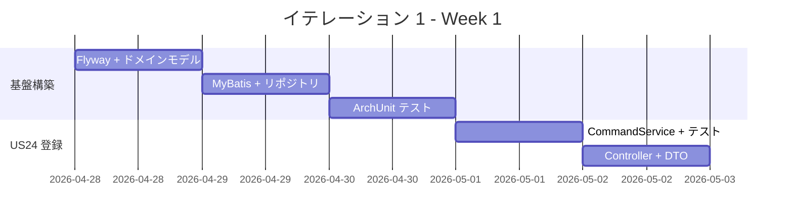
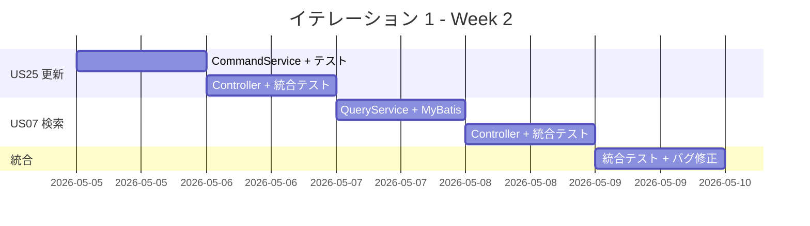
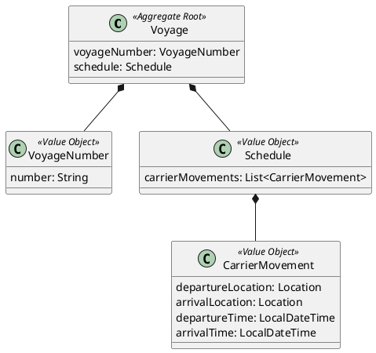
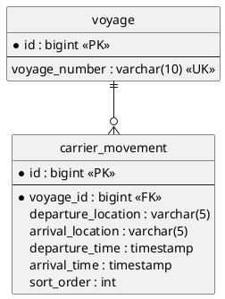

# イテレーション 1 計画

## 概要

| 項目 | 内容 |
|------|------|
| **イテレーション** | 1 |
| **期間** | Week 1-2（2026-04-28〜2026-05-09） |
| **ゴール** | 航海スケジュール CRUD の API + 管理画面を構築する |
| **目標 SP** | 18（BE 11 + FE 7） |

---

## ゴール

### イテレーション終了時の達成状態

1. **航海スケジュール管理 API**: 航海スケジュールの新規登録・更新・検索が REST API で動作する
2. **航海スケジュール管理画面**: React SPA で航海スケジュールの一覧・登録・更新・検索画面が動作する
3. **フルスタック TDD 基盤**: バックエンド（routingms）とフロントエンド（React）の両方で TDD サイクルが回る開発基盤が確立されている
4. **アーキテクチャ検証**: ヘキサゴナル + MyBatis + CQRS（BE）と TanStack Query + Container/Presentational（FE）のパターンが確立されている

### 成功基準

- [ ] US24: 航海スケジュール新規登録 API が動作する
- [ ] US25: 航海スケジュール更新 API が動作する
- [ ] US07: 航海スケジュール検索 API が動作する
- [ ] ArchUnit テストが通過する（ヘキサゴナル依存ルール）
- [ ] テストカバレッジ 80% 以上（routingms 全体、JaCoCo で測定）

---

## ユーザーストーリー

### 対象ストーリー

| ID | ユーザーストーリー | BE | FE | SP | 優先度 |
|----|-------------------|----|----|----|----|
| US24 | 航海スケジュールを新規登録する | 5 | 3 | 8 | 必須 |
| US25 | 既存航海スケジュールを更新する | 3 | 2 | 5 | 必須 |
| US07 | 航海スケジュールを検索する | 3 | 2 | 5 | 必須 |
| **合計** | | **11** | **7** | **18** | |

### ストーリー詳細

#### US24: 航海スケジュールを新規登録する

**ストーリー**:

> 経路設計者として、航海スケジュール（航海番号・出発地・到着地・出発日・到着日）を新規登録したい。なぜなら、貨物の経路候補を算出するための基礎データが必要だからだ。

**受入条件**:

1. 航海番号・出発地・到着地・出発日・到着日を入力できる
2. 重複する航海番号がある場合、エラーを返す
3. 登録後、航海番号が発行される

#### US25: 既存航海スケジュールを更新する

**ストーリー**:

> 経路設計者として、既存の航海スケジュールのスケジュール情報を更新したい。なぜなら、運航スケジュールは変更されることがあるからだ。

**受入条件**:

1. 航海番号で既存スケジュールを取得し、日時を変更できる
2. 存在しない航海番号の場合、404 エラーを返す

#### US07: 航海スケジュールを検索する

**ストーリー**:

> 経路設計者として、出発地・到着地で航海スケジュールを検索したい。なぜなら、貨物の経路候補を探すために該当する航路を絞り込みたいからだ。

**受入条件**:

1. 出発地・到着地で検索できる
2. 結果は航海番号・出発地・到着地・出発日・到着日の一覧で返る
3. 該当する航路がない場合、空の一覧を返す

### タスク

#### 1. routingms TDD 開発基盤構築（2 SP）

| # | タスク | 見積もり | 状態 |
|---|--------|---------|------|
| 1.1 | Flyway マイグレーション（`V2__create_voyage.sql` を `routingms/src/main/resources/db/migration/` に配置） | 2h | [ ] |
| 1.2 | ドメインモデル: Voyage 集約、VoyageNumber 値オブジェクト | 2h | [ ] |
| 1.3 | MyBatis マッパー XML + Mapper インターフェース | 2h | [ ] |
| 1.4 | リポジトリインターフェース + MyBatis 実装 | 2h | [ ] |
| 1.5 | ArchUnit テスト（ヘキサゴナル依存ルール） | 1h | [ ] |

**小計**: 9h

#### 2. US24: 航海スケジュール新規登録（5 SP）

| # | タスク | 見積もり | 状態 |
|---|--------|---------|------|
| 2.1 | CommandService: VoyageCommandService（登録） | 3h | [ ] |
| 2.2 | REST Controller: VoyageController（POST） | 2h | [ ] |
| 2.3 | DTO + Assembler（リクエスト/レスポンス変換） | 2h | [ ] |
| 2.4 | 統合テスト（MockMvc + H2） | 2h | [ ] |
| 2.5 | バリデーション（重複チェック） | 1h | [ ] |

**小計**: 10h

#### 3. US25: 航海スケジュール更新（3 SP）

| # | タスク | 見積もり | 状態 |
|---|--------|---------|------|
| 3.1 | CommandService: VoyageCommandService（更新） | 2h | [ ] |
| 3.2 | REST Controller: VoyageController（PUT） | 1h | [ ] |
| 3.3 | 統合テスト（更新・404） | 2h | [ ] |

**小計**: 5h

#### 4. US07: 航海スケジュール検索（3 SP）

| # | タスク | 見積もり | 状態 |
|---|--------|---------|------|
| 4.1 | QueryService: VoyageQueryService（検索） | 2h | [ ] |
| 4.2 | MyBatis クエリ（CQRS 読み取り側） | 2h | [ ] |
| 4.3 | REST Controller: VoyageController（GET） | 1h | [ ] |
| 4.4 | 統合テスト（検索・空結果） | 2h | [ ] |

**小計**: 7h

#### 5. FE 基盤: API クライアント統合・共通レイアウト（2 SP）

| # | タスク | 見積もり | 状態 |
|---|--------|---------|------|
| 5.1 | API クライアント（`lib/api-client.ts`）を routingms と接続検証 | 1h | [ ] |
| 5.2 | AppLayout にナビゲーション追加（航海スケジュール管理リンク） | 1h | [ ] |

**小計**: 2h

#### 6. FE US24: 航海スケジュール登録画面（3 SP）

| # | タスク | 見積もり | 状態 |
|---|--------|---------|------|
| 6.1 | `features/routing/hooks/useVoyages.ts`（TanStack Query） | 2h | [ ] |
| 6.2 | `features/routing/components/VoyageForm.tsx`（React Hook Form） | 3h | [ ] |
| 6.3 | `pages/VoyageNewPage.tsx` + ルーティング設定 | 1h | [ ] |
| 6.4 | Vitest コンポーネントテスト | 2h | [ ] |

**小計**: 8h

#### 7. FE US25: 航海スケジュール更新画面（2 SP）

| # | タスク | 見積もり | 状態 |
|---|--------|---------|------|
| 7.1 | `pages/VoyageEditPage.tsx`（フォーム初期値プリロード） | 2h | [ ] |
| 7.2 | Vitest コンポーネントテスト | 1h | [ ] |

**小計**: 3h

#### 8. FE US07: 航海スケジュール一覧・検索画面（2 SP）

| # | タスク | 見積もり | 状態 |
|---|--------|---------|------|
| 8.1 | `features/routing/components/VoyageList.tsx`（一覧テーブル） | 2h | [ ] |
| 8.2 | `features/routing/components/VoyageSearchForm.tsx`（検索フィルター） | 2h | [ ] |
| 8.3 | `pages/VoyageListPage.tsx` + ルーティング設定 | 1h | [ ] |
| 8.4 | Vitest コンポーネントテスト | 1h | [ ] |

**小計**: 6h

#### タスク合計

| カテゴリ | SP | 理想時間 | 状態 |
|---------|----|----|------|
| BE: TDD 開発基盤構築 | 2 | 9h | [ ] |
| BE: US24 航海スケジュール新規登録 | 5 | 10h | [ ] |
| BE: US25 航海スケジュール更新 | 3 | 5h | [ ] |
| BE: US07 航海スケジュール検索 | 3 | 7h | [ ] |
| FE: 基盤・共通レイアウト | 2 | 2h | [ ] |
| FE: US24 登録画面 | 3 | 8h | [ ] |
| FE: US25 更新画面 | 2 | 3h | [ ] |
| FE: US07 一覧・検索画面 | 2 | 6h | [ ] |
| **合計** | **22** | **50h** | |

**1 SP あたり**: 約 2.3h
**進捗率**: 0% (0/22 SP)

> **Note**: 目標 SP は 18 だが、タスク分解の結果 22 SP となった。BE 基盤構築（2 SP）は初回のみの固定コストであり、次イテレーション以降は不要。実質ストーリー SP は 18 SP で計画通り。

---

## スケジュール

### Week 1（Day 1-5: 2026-04-28〜2026-05-02）



| 日 | タスク |
|----|--------|
| Day 1 | 1.1 Flyway, 1.2 ドメインモデル |
| Day 2 | 1.3 MyBatis マッパー, 1.4 リポジトリ |
| Day 3 | 1.5 ArchUnit, 2.1 CommandService 開始 |
| Day 4 | 2.1 完了, 2.2 Controller |
| Day 5 | 2.3 DTO, 2.4 統合テスト, 2.5 バリデーション |

### Week 2（Day 6-10: 2026-05-05〜2026-05-09）



| 日 | タスク |
|----|--------|
| Day 6 | 3.1 更新 CommandService, 3.2 Controller |
| Day 7 | 3.3 統合テスト |
| Day 8 | 4.1 QueryService, 4.2 MyBatis クエリ |
| Day 9 | 4.3 Controller, 4.4 統合テスト |
| Day 10 | 統合テスト、バグ修正、デモ準備 |

---

## 設計

### ドメインモデル



### データモデル



### API 設計

| メソッド | エンドポイント | 説明 |
|---------|---------------|------|
| POST | /api/v1/voyages | 航海スケジュール新規登録 |
| PUT | /api/v1/voyages/{voyageNumber} | 航海スケジュール更新 |
| GET | /api/v1/voyages | 航海スケジュール一覧・検索 |
| GET | /api/v1/voyages/{voyageNumber} | 航海スケジュール詳細 |

### ディレクトリ構成

```
apps/backend/routingms/src/main/java/com/example/routingms/
├── RoutingApplication.java
├── interfaces/
│   └── rest/
│       ├── VoyageController.java
│       ├── dto/
│       │   ├── CreateVoyageRequest.java
│       │   ├── UpdateVoyageRequest.java
│       │   └── VoyageResponse.java
│       └── transform/
│           └── VoyageAssembler.java
├── application/
│   └── internal/
│       ├── commandservices/
│       │   └── VoyageCommandService.java
│       └── queryservices/
│           └── VoyageQueryService.java
├── domain/
│   └── model/
│       ├── aggregates/
│       │   └── Voyage.java
│       └── valueobjects/
│           ├── VoyageNumber.java
│           ├── Schedule.java
│           └── CarrierMovement.java
└── infrastructure/
    └── repositories/
        ├── VoyageRepository.java (interface in domain)
        ├── VoyageMapper.java
        ├── VoyageRecord.java
        └── MyBatisVoyageRepository.java
```

---

## リスクと対策

| リスク | 影響度 | 対策 |
|--------|--------|------|
| MyBatis + ヘキサゴナルの組み合わせが未検証 | 中 | Day 1-2 で基盤を構築し早期に検証 |
| CQRS の読み取り側 SQL が複雑になる | 低 | 初回は単純な SELECT で開始 |

---

## 完了条件

### Definition of Done

- [ ] コードレビュー完了
- [ ] ユニットテストがパス
- [ ] 統合テスト（MockMvc + H2）がパス
- [ ] ArchUnit テストがパス
- [ ] Checkstyle / SpotBugs エラーなし
- [ ] テストカバレッジ 80% 以上（routingms 全体、JaCoCo で測定）
- [ ] Swagger UI で API 動作確認済み
- [ ] ドキュメント更新完了

### デモ項目

1. Swagger UI で航海スケジュール新規登録
2. 登録したスケジュールの更新
3. 出発地・到着地での検索

---

## 更新履歴

| 日付 | 更新内容 | 更新者 |
|------|---------|--------|
| 2026-04-25 | 初版作成 | - |

---

## 関連ドキュメント

- [リリース計画](./release_plan.md)
- [ユーザーストーリー](../requirements/user_story.md)
- [ドメインモデル設計](../design/domain-model.md)
- [データモデル設計](../design/data-model.md)
