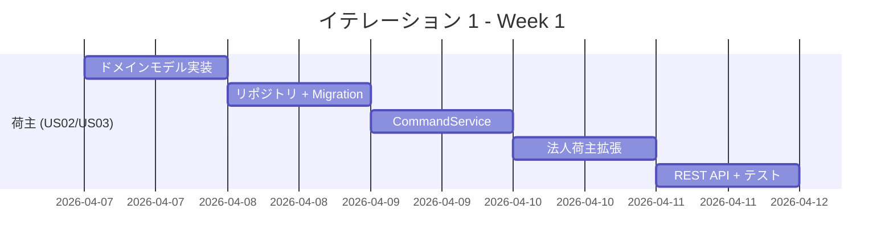
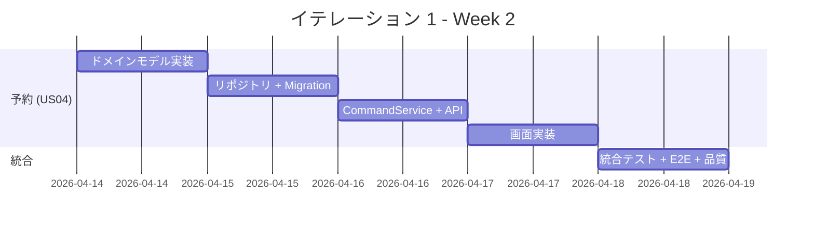
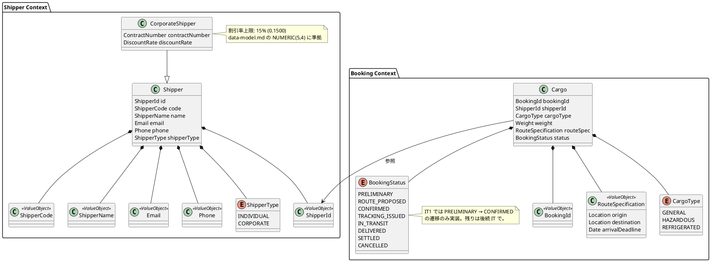
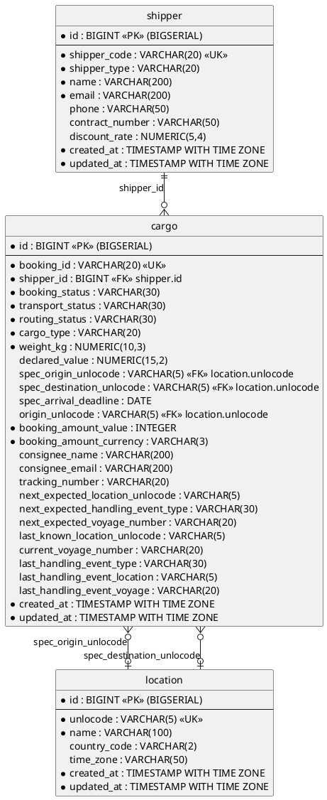
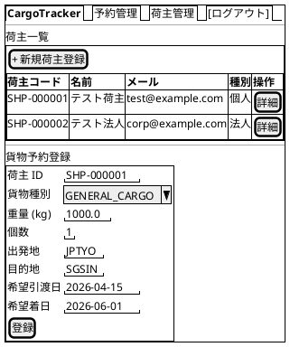
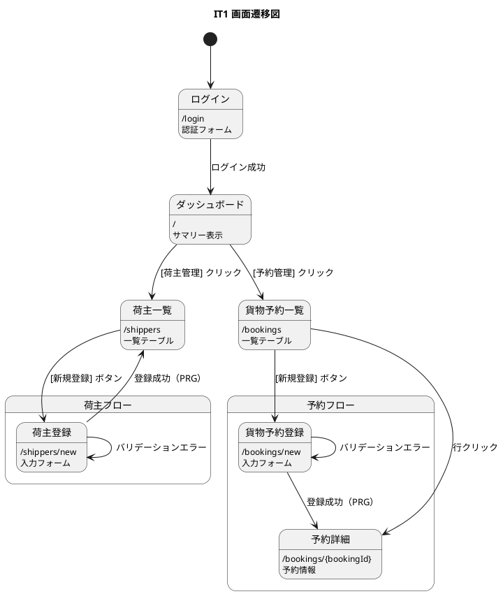

# イテレーション 1 計画

## 概要

| 項目 | 内容 |
|------|------|
| **イテレーション** | 1 |
| **期間** | Week 1-2（2026-04-07 〜 2026-04-18） |
| **ゴール** | 荷主登録（個人・法人）と貨物予約登録の基本フローが動作すること |
| **目標 SP** | 10 |

---

## ゴール

### イテレーション終了時の達成状態

1. **荷主管理**: 個人荷主・法人荷主の CRUD が REST API と画面の両方で動作する
2. **貨物予約**: 荷主を指定して貨物予約を登録し、予約番号が発行される
3. **品質**: テストカバレッジ 80% 以上、SonarQube Quality Gate PASS

### 成功基準

- [ ] US02: 個人荷主を登録し、荷主 ID が発行される
- [ ] US03: 法人荷主を登録し、契約番号・割引率が保存される
- [x] US04: 荷主 ID を指定して貨物予約を登録し、予約番号が発行される
- [ ] テストカバレッジ 80% 以上
- [ ] SonarQube Quality Gate PASS
- [ ] Playwright E2E テストが通過

---

## ユーザーストーリー

### 対象ストーリー

| ID | ユーザーストーリー | SP | 優先度 |
|----|-------------------|----|--------|
| US02 | 荷主を登録する | 3 | 必須 |
| US03 | 法人荷主を登録する | 2 | 必須 |
| US04 | 貨物予約を登録する | 5 | 必須 |
| **合計** | | **10** | |

### ストーリー詳細

#### US02: 荷主を登録する

**ストーリー**:

> 営業担当者として、新規荷主の氏名/社名・住所・連絡先・メールアドレスをシステムに登録したい。なぜなら、次回以降の予約で荷主情報の再入力を省略でき、顧客情報を一元管理できるからだ。

**受入条件**:

1. 氏名/社名・住所・連絡先・メールアドレス・荷主種別（個人/法人）を入力できる
2. 同一メールアドレスが既に登録されている場合、既存荷主として表示しどちらを使用するか選択できる
3. 登録完了後、荷主 ID が発行される
4. 荷主種別「個人」で登録できる

#### US03: 法人荷主を登録する

**ストーリー**:

> 営業担当者として、法人荷主の契約番号と割引率を含めて登録したい。なぜなら、法人契約条件（割引率）を精算時に自動適用できるからだ。

**受入条件**:

1. 荷主種別「法人」を選択すると、法人契約情報（契約番号・割引率）の入力フィールドが表示される
2. 割引率は 0〜30% の範囲で設定できる
3. 法人荷主で登録完了後、荷主 ID が発行される
4. 登録した法人情報は US22（法人割引を適用する）で参照される

#### US04: 貨物予約を登録する

**ストーリー**:

> 営業担当者として、荷主 ID・貨物仕様（種別・重量・寸法・個数・品名）・輸送条件（出発地・目的地・希望日）を入力して予約を登録したい。なぜなら、荷主の見積承認後に正式な予約を受け付け、経路設計フェーズに引き継げるからだ。

**受入条件**:

1. 荷主 ID を入力して既存荷主を選択できる
2. 貨物種別・重量・寸法・個数・品名を入力できる
3. 出発地・目的地・希望引渡日・希望着日を入力できる
4. 登録完了後、予約番号が発行され状態が「仮受付」になる
5. 経路設計者に予約登録の通知が送信される（IT1 ではイベント発行のみ、通知は IT2 以降）
6. 見積情報との整合性が確認される（IT1 では見積未実装のためスキップ）

### タスク

#### 1. 荷主登録（US02 + US03: 5 SP）

| # | タスク | 見積もり | 担当 | 状態 |
|---|--------|---------|------|------|
| 1.1 | Shipper ドメインモデル実装（エンティティ・値オブジェクト・集約） | 3h | - | [ ] |
| 1.2 | Shipper リポジトリポート定義 + MyBatis 実装 | 3h | - | [ ] |
| 1.3 | Flyway マイグレーション（shipper テーブル） | 1h | - | [ ] |
| 1.4 | RegisterShipperCommandService 実装 | 2h | - | [ ] |
| 1.5 | CorporateShipper（法人荷主）拡張 | 2h | - | [ ] |
| 1.6 | Shipper REST API (POST /api/shippers) | 2h | - | [ ] |
| 1.7 | Shipper 一覧・登録画面（Thymeleaf） | 3h | - | [ ] |
| 1.8 | 単体テスト + API E2E テスト | 2h | - | [ ] |

**小計**: 18h（理想時間）

#### 2. 貨物予約登録（US04: 5 SP）

| # | タスク | 見積もり | 担当 | 状態 |
|---|--------|---------|------|------|
| 2.1 | Cargo ドメインモデル実装（Cargo・BookingId・RouteSpecification 等） | 4h | - | [ ] |
| 2.2 | CargoRepository ポート定義 + MyBatisCargoRepository 実装 | 3h | - | [ ] |
| 2.3 | Flyway マイグレーション（cargo テーブル） | 1h | - | [ ] |
| 2.4 | CargoBookingCommandService + CargoBookingQueryService 実装 | 2h | - | [ ] |
| 2.5 | BookingRestController (POST /api/bookings) | 2h | - | [x] |
| 2.6 | BookingThymeleafController 一覧・登録画面 | 3h | - | [x] |
| 2.7 | 単体テスト + API E2E テスト | 3h | - | [x] |

**小計**: 18h（理想時間）

#### タスク合計

| カテゴリ | SP | 理想時間 | 状態 |
|---------|----|----|------|
| 荷主登録 (US02 + US03) | 5 | 18h | [ ] |
| 貨物予約登録 (US04) | 5 | 18h | [ ] |
| **合計** | **10** | **36h** | |

**1 SP あたり**: 約 3.6h
**進捗率**: 0% (0/10 SP)

---

## スケジュール

### Week 1（Day 1-5）



| 日 | タスク |
|----|--------|
| Day 1 | 1.1 Shipper ドメインモデル実装 |
| Day 2 | 1.2 リポジトリ + 1.3 マイグレーション |
| Day 3 | 1.4 CommandService 実装 |
| Day 4 | 1.5 法人荷主拡張 + 1.6 REST API |
| Day 5 | 1.7 画面実装 + 1.8 テスト |

### Week 2（Day 6-10）



| 日 | タスク |
|----|--------|
| Day 6 | 2.1 Booking ドメインモデル実装 |
| Day 7 | 2.2 リポジトリ + 2.3 マイグレーション |
| Day 8 | 2.4 CommandService + 2.5 REST API |
| Day 9 | 2.6 画面実装 |
| Day 10 | 2.7 統合テスト・E2E テスト・品質チェック |

---

## 設計

### ドメインモデル



### データモデル

> data-model.md に完全準拠。IT1 で使用しないカラムもテーブル定義に含める（Flyway マイグレーションで一括作成するため）。



> **注**: テーブル名は単数形、PK は BIGSERIAL サロゲートキー、業務キーは UK 制約。data-model.md に準拠。

### ユーザーインターフェース

#### ビュー

> **注**: ui_design.md に荷主専用画面 (`/shippers`) は定義されていない。荷主の登録・選択は予約登録画面 (`/bookings/new`) 内で行う設計。ただし IT1 では荷主管理の REST API を先に実装し、画面は管理用の簡易画面として `/shippers` を追加する。ui_design.md への反映は IT1 完了時に実施する。



#### インタラクション



**フィードバックメッセージ**:

| 操作 | メッセージ | スタイル |
|------|----------|---------|
| 荷主登録成功 | 「荷主を登録しました（SHP-XXXXXX）」 | `alert-success` |
| 予約登録成功 | 「予約を登録しました（BK-XXXXXX）」 | `alert-success` |
| バリデーションエラー | フィールド単位のエラー表示 | `alert-danger` |

### API 設計

| メソッド | エンドポイント | 説明 |
|---------|---------------|------|
| POST | /api/shippers | 荷主を登録する |
| GET | /api/shippers | 荷主一覧を取得する |
| GET | /api/shippers/{id} | 荷主を取得する |
| POST | /api/bookings | 貨物予約を登録する |
| GET | /api/bookings | 予約一覧を取得する |
| GET | /api/bookings/{id} | 予約を取得する |

### ディレクトリ構成

> Practical DDD in Enterprise Java (Chapter 3) のパッケージ構造に準拠。`domain/model/` 配下に `aggregates/`・`valueobjects/`・`commands/` を配置、`interfaces/rest/` に REST Controller と DTO を配置する。

```
apps/cargo-tracker/src/main/java/com/example/cargotracker/
├── shipper/
│   ├── domain/
│   │   └── model/
│   │       ├── aggregates/
│   │       │   └── Shipper.java                         (集約ルート)
│   │       ├── commands/
│   │       │   └── RegisterShipperCommand.java
│   │       └── valueobjects/
│   │           ├── ShipperCode.java
│   │           ├── ShipperType.java
│   │           ├── ContractNumber.java
│   │           └── DiscountRate.java
│   ├── application/
│   │   └── internal/
│   │       ├── commandservices/
│   │       │   └── RegisterShipperCommandService.java
│   │       └── queryservices/
│   │           └── ShipperQueryService.java
│   ├── infrastructure/
│   │   └── repositories/
│   │       └── MyBatisShipperRepository.java            (出力アダプター)
│   └── interfaces/
│       ├── rest/
│       │   ├── ShipperController.java                   (REST Controller)
│       │   ├── dto/
│       │   │   └── RegisterShipperResource.java
│       │   └── transform/
│       │       └── RegisterShipperCommandDTOAssembler.java
│       └── web/
│           └── ShipperThymeleafController.java          (画面 Controller)
├── booking/
│   ├── domain/
│   │   └── model/
│   │       ├── aggregates/
│   │       │   ├── Cargo.java                           (集約ルート)
│   │       │   └── BookingId.java
│   │       ├── commands/
│   │       │   └── BookCargoCommand.java
│   │       ├── entities/
│   │       │   └── Location.java                        (UN/LOCODE)
│   │       └── valueobjects/
│   │           ├── BookingStatus.java
│   │           ├── CargoType.java
│   │           └── RouteSpecification.java
│   ├── application/
│   │   └── internal/
│   │       ├── commandservices/
│   │       │   └── CargoBookingCommandService.java
│   │       └── queryservices/
│   │           └── CargoBookingQueryService.java
│   ├── infrastructure/
│   │   └── repositories/
│   │       └── MyBatisCargoRepository.java              (出力アダプター)
│   └── interfaces/
│       ├── rest/
│       │   ├── CargoBookingController.java              (REST Controller)
│       │   ├── dto/
│       │   │   └── BookCargoResource.java
│       │   └── transform/
│       │       └── BookCargoCommandDTOAssembler.java
│       └── web/
│           └── BookingThymeleafController.java          (画面 Controller)
└── shareddomain/
    ├── events/
    │   └── CargoBookedEvent.java                        (ドメインイベント)
    └── model/
        └── ShipperId.java                               (共有カーネル)
```

---

## リスクと対策

| リスク | 影響度 | 対策 |
|--------|--------|------|
| MyBatis マッパー XML の設定ミス | 中 | Testcontainers で実 DB テストを実施 |
| Thymeleaf テンプレートの Spring Security 連携 | 低 | 認証済みフィクスチャで E2E テスト |
| ドメインモデルの設計変更 | 中 | TDD で小さく作り、リファクタリングで進化させる |

---

## 完了条件

### Definition of Done

- [ ] コードレビュー完了
- [ ] 単体テストがパス
- [ ] API E2E テストがパス
- [ ] Playwright E2E テストがパス
- [ ] SonarQube Quality Gate PASS
- [ ] テストカバレッジ 80% 以上
- [ ] 機能がローカル環境で動作確認済み
- [ ] ドキュメント更新完了

### デモ項目

1. 個人荷主を登録し、荷主 ID が発行されることを確認
2. 法人荷主を登録し、契約番号・割引率が保存されることを確認
3. 荷主を指定して貨物予約を登録し、予約番号が発行されることを確認
4. Swagger UI で API の動作を確認

---

## 更新履歴

| 日付 | 更新内容 | 更新者 |
|------|---------|--------|
| 2026-04-04 | 初版作成 | - |
| 2026-04-04 | 整合性検証に基づく修正（US04 受入基準補完、データモデル data-model.md 準拠、UI 設計追加） | - |
| 2026-04-04 | エージェント検証結果反映（BookingStatus 8 値、CargoType GENERAL、ShipperType、arrivalDeadline） | - |
| 2026-04-04 | ディレクトリ構成を Practical DDD Chapter3 に準拠（aggregates/valueobjects/commands/、application/internal/、interfaces/rest/dto/transform/） | - |
| 2026-04-04 | データモデルを data-model.md と完全突合（location テーブル追加、cargo の全カラム反映、FK 関係追加） | - |

---

## 関連ドキュメント

- [リリース計画](./release_plan.md)
- [ユーザーストーリー](../requirements/user_story.md)
- [ドメインモデル設計](../design/domain-model.md)
- [データモデル設計](../design/data-model.md)
- [アプリケーション開発環境セットアップ](../operation/dev_app_instrunction.md)
