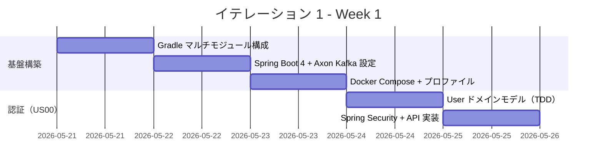
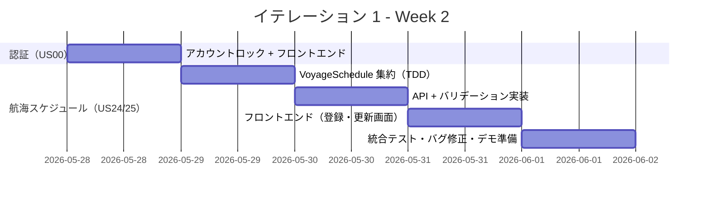
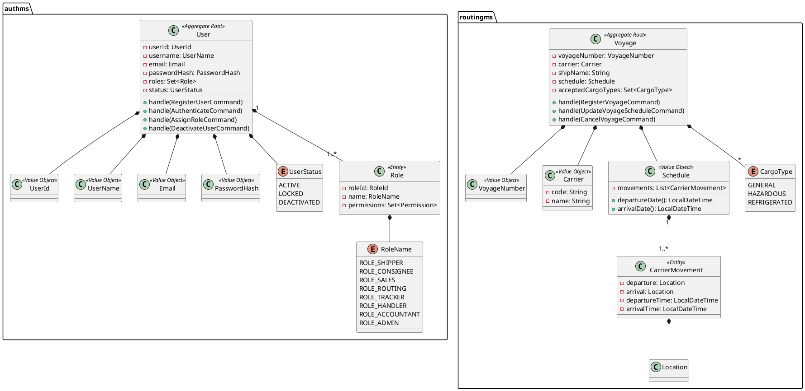
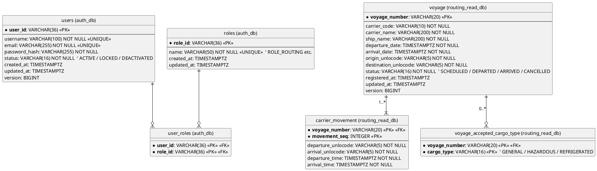
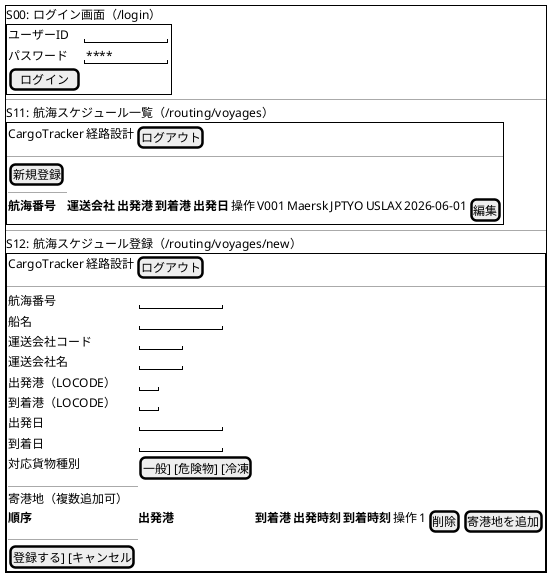
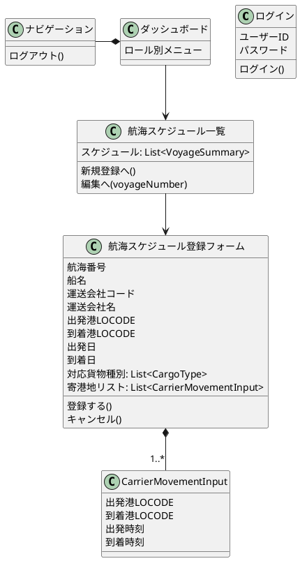
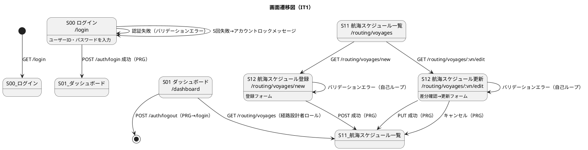

# イテレーション 1 計画

## 概要

| 項目 | 内容 |
|------|------|
| **イテレーション** | 1 |
| **期間** | Week 1-2（2026-05-21 〜 2026-06-03） |
| **ゴール** | Axon Kafka + Heroku 基盤を確立し、認証と航海スケジュール管理を動作させる |
| **目標 SP** | 10 |

---

## ゴール

### イテレーション終了時の達成状態

1. **基盤構築**: Spring Boot 4 + Axon Kafka Extension + local-h2/local-docker/heroku プロファイルが動作し、マルチモジュール構成（authms・routingms 最小骨格）が揃っている
2. **認証（US00）**: ログイン・ログアウト・アカウントロックが動作し、ロールベースのアクセス制御が機能している
3. **航海スケジュール管理（US24・US25）**: 経路設計者が航海スケジュールの新規登録と更新をできる

### 成功基準

- [x] `./gradlew test` がすべて PASS する（local-h2 プロファイル）
- [x] `docker compose up` で Kafka + PostgreSQL が起動し local-docker プロファイルでサービスが動作する
- [x] 認証（ログイン・ログアウト・アカウントロック）が UI から操作できる
- [x] 航海スケジュールの新規登録・更新が UI から操作できる
- [ ] テストカバレッジ 80% 以上（全体 62.3%・新規コード 81.8%・Quality Gate PASS）

---

## ユーザーストーリー

### 対象ストーリー

| ID | ユーザーストーリー | SP | 優先度 |
|----|-------------------|----|----|
| US00 | 認証を実装する | 3 | 必須 |
| US24 | 航海スケジュールを新規登録する | 3 | 必須 |
| US25 | 既存航海スケジュールを更新する | 2 | 必須 |
| - | 基盤構築（マルチモジュール・Kafka 接続） | 2 | 必須 |
| **合計** | | **10** | |

### ストーリー詳細

#### US00: 認証を実装する

> **注**: US00 は user_story.md に独立した ID は存在しないが、システム全体の前提となる認証基盤として IT1 のゴールに位置づけている。

**ストーリー**:

> ユーザーとして、ユーザーID とパスワードでログインし、ログアウトでき、連続失敗時にアカウントがロックされるようにしたい。なぜなら、不正アクセスを防ぎ役割に応じた操作制限が必要だからだ。

**受入条件**:

1. ユーザーID・パスワードでログインできる
2. ログアウトができる
3. 連続失敗（5 回）でアカウントがロックされる
4. ロールに基づくアクセス制御（ROLE_SHIPPER / ROLE_CONSIGNEE / ROLE_SALES / ROLE_ROUTING / ROLE_TRACKER / ROLE_HANDLER / ROLE_ACCOUNTANT / ROLE_ADMIN）が機能する

#### US24: 航海スケジュールを新規登録する

**ストーリー**:

> 経路設計者として、各運送会社が公開している航海スケジュール（航海番号・船名・出発港・到着港・出発日・到着日・寄港地・対応貨物種別）をシステムに新規登録したい。なぜなら、最新の運航情報をシステムに反映することで、経路候補の算出精度が上がり荷主に正確な経路・所要日数を提案できるからだ。

**受入条件**:

1. 航海番号・船名・運送会社・出発港（UN/LOCODE）・到着港（UN/LOCODE）・出発日・到着日・対応貨物種別を入力できる
2. 寄港地を複数かつ順序付きで入力できる
3. 必須項目が未入力の場合、未入力箇所を明示したエラーが表示される
4. 出発日が到着日より後の場合、日付の整合性エラーが表示される
5. 同一航海番号がシステムに存在しない場合、登録が完了し登録番号が発行される
6. 登録後、UC05（航海スケジュール検索）の検索対象として利用できる

#### US25: 既存航海スケジュールを更新する

**ストーリー**:

> 経路設計者として、運送会社が運航変更を発表した場合に、システムに登録済みの航海スケジュールを最新情報に更新したい。なぜなら、スケジュール変更を即座にシステムに反映することで、変更後の経路候補算出に誤りが生じるのを防げるからだ。

**受入条件**:

1. 既存の航海番号を指定して既登録スケジュールを呼び出せる
2. 既存内容と更新内容の差分が確認画面に表示される
3. 差分確認後に「更新する」を選択することで既存スケジュールが上書き更新される
4. 更新後、UC05（航海スケジュール検索）の検索結果に更新内容が反映される
5. 「キャンセル」を選択した場合、既存スケジュールは変更されない

### タスク

#### 0. 基盤構築（2 SP）

| # | タスク | 見積もり | 担当 | 状態 |
|---|--------|---------|------|------|
| 0.1 | Gradle マルチモジュール構成（authms・routingms・shared）を作成 | 4h | - | [x] |
| 0.2 | Spring Boot 4 + Axon Kafka Extension 依存関係設定 | 2h | - | [x] |
| 0.3 | local-h2 / local-docker / heroku プロファイル設定 | 2h | - | [x] |
| 0.4 | Docker Compose（Kafka + Zookeeper + PostgreSQL）設定 | 2h | - | [x] |
| 0.5 | Gateway（gatewayms）最小構成 + フロントエンド（Vite）起動確認 | 2h | - | [x] |

**小計**: 12h

#### 1. US00: 認証（3 SP）

| # | タスク | 見積もり | 担当 | 状態 |
|---|--------|---------|------|------|
| 1.1 | User エンティティ・ロール定義（TDD: Red） | 2h | - | [x] |
| 1.2 | User ドメインモデル実装（TDD: Green） | 2h | - | [x] |
| 1.3 | Spring Security 設定（JWT + ロールベースアクセス制御） | 4h | - | [x] |
| 1.4 | ログイン API（POST /auth/login）実装 | 2h | - | [x] |
| 1.5 | ログアウト API（POST /auth/logout）実装 | 1h | - | [x] |
| 1.6 | アカウントロック機能（失敗 5 回）実装 | 2h | - | [x] |
| 1.7 | フロントエンド: ログイン画面・ナビゲーション実装 | 3h | - | [x] |

**小計**: 16h

#### 2. US24: 航海スケジュール新規登録（3 SP）

| # | タスク | 見積もり | 担当 | 状態 |
|---|--------|---------|------|------|
| 2.1 | Voyage 集約定義（TDD: Red → Green） | 3h | - | [x] |
| 2.2 | RegisterVoyageCommand / VoyageRegisteredEvent 実装 | 2h | - | [x] |
| 2.3 | Voyage Read Model（voyage + carrier_movement + voyage_accepted_cargo_type）MyBatis Mapper 実装 | 2h | - | [x] |
| 2.4 | POST /api/voyages エンドポイント実装 | 2h | - | [x] |
| 2.5 | バリデーション（必須項目・日付整合性）実装 | 2h | - | [x] |
| 2.6 | フロントエンド: 航海スケジュール登録フォーム実装 | 3h | - | [x] |

**小計**: 14h

#### 3. US25: 既存航海スケジュール更新（2 SP）

| # | タスク | 見積もり | 担当 | 状態 |
|---|--------|---------|------|------|
| 3.1 | UpdateVoyageScheduleCommand / VoyageScheduleUpdatedEvent 実装（TDD） | 2h | - | [x] |
| 3.2 | PUT /api/voyages/{voyageNumber} エンドポイント実装 | 2h | - | [x] |
| 3.3 | フロントエンド: 更新フォーム実装 | 3h | - | [x] |

**小計**: 7h

#### タスク合計

| カテゴリ | SP | 理想時間 | 状態 |
|---------|----|----|------|
| 基盤構築 | 2 | 12h | [x] |
| US00: 認証 | 3 | 16h | [x] |
| US24: 航海スケジュール新規登録 | 3 | 14h | [x] |
| US25: 既存航海スケジュール更新 | 2 | 7h | [x] |
| **合計** | **10** | **49h** | |

**1 SP あたり**: 約 4.9h

**進捗率**: 100%（10/10 SP）

---

## スケジュール

### Week 1（Day 1-5: 2026-05-21 〜 2026-05-27）

| 日 | タスク |
|----|--------|
| Day 1（5/21） | Gradle マルチモジュール構成・プロジェクト骨格作成 |
| Day 2（5/22） | Spring Boot 4 + Axon Kafka Extension 依存関係設定 |
| Day 3（5/23） | Docker Compose（Kafka + PostgreSQL）+ プロファイル設定 |
| Day 4（5/26） | US00: User ドメインモデル TDD（Red → Green → Refactor） |
| Day 5（5/27） | US00: Spring Security 設定 + ログイン/ログアウト API 実装 |

### Week 2（Day 6-10: 2026-05-28 〜 2026-06-03）

| 日 | タスク |
|----|--------|
| Day 6（5/28） | US00: アカウントロック実装 + ログイン UI |
| Day 7（5/29） | US24: VoyageSchedule 集約 TDD（Command/Event/Aggregate） |
| Day 8（6/2） | US24: API + バリデーション + US25: UpdateVoyageCommand |
| Day 9（6/3 AM） | US24/25: フロントエンド（登録・差分確認・更新フォーム） |
| Day 10（6/3 PM） | 統合テスト・バグ修正・デモ準備 |

---

## 設計

### ドメインモデル

> **注**: domain-model.md の定義に準拠する。

### データモデル

> **注**: data-model.md の routing_read_db・auth_db 定義に準拠する。

### ユーザーインターフェース

> **注**: ui_design.md の画面 ID・パスに準拠する。S00=`/login`, S01=`/dashboard`, S11=`/routing/voyages`, S12=`/routing/voyages/new` & `/routing/voyages/:vn/edit`。

#### ビュー

#### モデル

#### インタラクション

### API 設計

| メソッド | エンドポイント | 説明 |
|---------|---------------|------|
| POST | /auth/login | ログイン（JWT 発行） |
| POST | /auth/logout | ログアウト |
| GET | /api/voyage-schedules | 航海スケジュール一覧 |
| POST | /api/voyage-schedules | 航海スケジュール新規登録 |
| GET | /api/voyage-schedules/{voyageNumber} | 航海スケジュール詳細 |
| PUT | /api/voyage-schedules/{voyageNumber} | 航海スケジュール更新 |

### ADR

| ADR | タイトル | ステータス |
|-----|---------|-----------|
| [ADR-0001](../adr/0001-axon-kafka-aiven-adoption.md) | Axon Kafka Extension + Aiven 採用 | 承認済み |
| [ADR-0002](../adr/0002-mybatis-adoption.md) | MyBatis 採用 | 承認済み |
| [ADR-0006](../adr/0006-heroku-deployment-setup.md) | Heroku Container Registry デプロイ構成 | 承認済み |

---

## リスクと対策

| リスク | 影響度 | 対策 |
|--------|--------|------|
| Axon Kafka Extension が Spring Boot 4 / Axon 5 に未対応 | 高 | Day 2 で依存解決を検証。非対応の場合は Spring Cloud Stream への切替を ADR に記録 |
| local-h2 プロファイルで Axon Kafka を無効化できない | 中 | `axon.kafka.enabled=false` プロパティで制御。SimpleCommandBus + InMemoryEventStore に切替 |
| Gradle マルチモジュール構成の複雑化 | 中 | take-4 の build.gradle 構成を参考に最小限から開始 |

---

## 完了条件

### Definition of Done

- [ ] コードレビュー完了（セルフレビュー）
- [ ] ユニットテストがパス（`./gradlew test`）
- [ ] 統合テストがパス（local-docker プロファイル）
- [ ] ESLint / Checkstyle エラーなし
- [ ] 認証・航海スケジュール機能がローカル環境で動作確認済み
- [ ] ドキュメント更新完了

### デモ項目

1. ログイン → ダッシュボード表示 → ログアウト
2. 認証失敗 5 回でアカウントロック
3. 航海スケジュール新規登録（UN/LOCODE 形式・寄港地複数）
4. 航海番号指定で既存スケジュール呼び出し → 差分確認 → 更新

---

## 更新履歴

| 日付 | 更新内容 | 更新者 |
|------|---------|--------|
| 2026-05-21 | 初版作成 | k2works |
| 2026-05-21 | 整合性検証に基づく修正（ドメインモデル・データモデル・UI・ユーザーストーリー） | k2works |

---

## 関連ドキュメント

- [リリース計画](./release_plan.md)
- [イテレーション 1 ふりかえり](./retrospective-1.md)

---

## 整合性検証結果

### 検証対象

- イテレーション計画: `docs/development/iteration_plan-1.md`

### 検証結果サマリー

| ステップ | 検証対象 | 結果 | 不整合件数 |
|---------|---------|------|-----------|
| 1 | テンプレートフォーマット | OK | 0 件（修正済み） |
| 2 | ユーザーストーリー | OK | 0 件（修正済み） |
| 3 | ドメインモデル | OK | 0 件（修正済み） |
| 4 | データモデル | OK | 0 件（修正済み） |
| 5 | UI 設計（ビュー） | OK | 0 件（修正済み） |
| 6 | UI 設計（インタラクション） | OK | 0 件（修正済み） |
| 7 | ゴールの整合性 | OK | 0 件（修正済み） |
| 8 | 過去レビュー指摘事項 | OK | 0 件（IT1 スコープ外は保留明記） |

### 修正内容一覧

#### ステップ 1: テンプレートフォーマット

- UI セクションに「ビュー」「モデル」「インタラクション」の 3 サブセクションを追加

#### ステップ 2: ユーザーストーリー

| # | 修正箇所 | 修正前 | 修正後 |
|---|---------|--------|--------|
| 1 | US00 の注記 | なし | US00 が user_story.md に存在しない旨を注記追加 |
| 2 | US00 受入条件 4 | ADMIN/STAFF/HANDLER/TRACKER/ACCOUNTANT（5 ロール） | ROLE_SHIPPER/ROLE_CONSIGNEE/.../ROLE_ADMIN（8 ロール） |
| 3 | US24 ストーリー文 | 省略形 | user_story.md 原文に一致させた |
| 4 | US24 受入条件 | 5 件 | 6 件（「登録後 UC05 の検索対象として利用できる」追加） |
| 5 | US25 ストーリー文 | 省略形 | user_story.md 原文に一致させた |
| 6 | US25 受入条件 | 4 件 | 5 件（「更新後 UC05 の検索結果に反映される」追加） |

#### ステップ 3: ドメインモデル

| # | 修正箇所 | 修正前 | 修正後 |
|---|---------|--------|--------|
| 1 | 集約名 | 航海スケジュール | Voyage（domain-model.md 準拠） |
| 2 | エンティティ名 | 寄港地 | CarrierMovement（departure/arrival Location 対） |
| 3 | 運送会社 | 文字列属性 | Carrier 値オブジェクト（code + name） |
| 4 | ユーザーロール enum | ADMIN/STAFF/HANDLER/TRACKER/ACCOUNTANT | RoleName（8 値: ROLE_ROUTING 等） |
| 5 | User 集約 | 簡略表現 | domain-model.md 準拠（email, roles: Set<Role>, status: UserStatus） |
| 6 | コマンド名 | UpdateVoyageCommand | UpdateVoyageScheduleCommand |

#### ステップ 4: データモデル

| # | 修正箇所 | 修正前 | 修正後 |
|---|---------|--------|--------|
| 1 | テーブル名 | 航海スケジュール | voyage（英語・単数形） |
| 2 | テーブル名 | 寄港地 | carrier_movement |
| 3 | カラム名 | carrier（単一） | carrier_code + carrier_name |
| 4 | カラム名 | departure_port | origin_unlocode |
| 5 | カラム名 | arrival_port | destination_unlocode |
| 6 | 型 | departure_date: DATE | departure_date: TIMESTAMPTZ |
| 7 | 型 | arrival_date: DATE | arrival_date: TIMESTAMPTZ |
| 8 | cargo_types 設計 | varchar 単一列 | voyage_accepted_cargo_type 別テーブル |
| 9 | carrier_movement | port_code + sequence | departure_unlocode + arrival_unlocode + movement_seq |
| 10 | users 設計 | locked: boolean | status: VARCHAR（ACTIVE/LOCKED/DEACTIVATED） |
| 11 | users 設計 | email カラム欠落 | email: VARCHAR 追加 |
| 12 | 認可設計 | role: varchar（単一列） | roles + user_roles テーブルに分離 |

#### ステップ 5/6: UI 設計

| # | 修正箇所 | 修正前 | 修正後 |
|---|---------|--------|--------|
| 1 | ビューサブセクション | なし | @startsalt ワイヤーフレーム追加（S00/S11/S12） |
| 2 | モデルサブセクション | なし | 画面モデルクラス図追加 |
| 3 | 画面 ID・パス | 未定義 | ui_design.md 準拠（S11=/routing/voyages, S12=/routing/voyages/new 等） |
| 4 | バリデーション自己ループ | なし | 全フォーム画面に自己ループ遷移追加 |

#### ステップ 7: ゴールの整合性

| # | 修正箇所 | 修正前 | 修正後 |
|---|---------|--------|--------|
| 1 | タスク 2.1 | VoyageSchedule 集約 | Voyage 集約 |
| 2 | タスク 3.1 | UpdateVoyageCommand | UpdateVoyageScheduleCommand |
| 3 | タスク 3.2 | PUT /{id} | PUT /{voyageNumber} |

#### ステップ 8: 過去レビュー指摘事項

レビュー（docs/review/ドメインモデル分析_review_20260331.md）の高優先度指摘 H1〜H11 はすべて domain-model.md に反映済み。IT1 の計画はそれに準拠した形で記述されており、直接の不整合なし。H2（Billing）・H3（Shipper/Consignee）等 IT1 スコープ外の機能は IT2 以降で対応予定。
