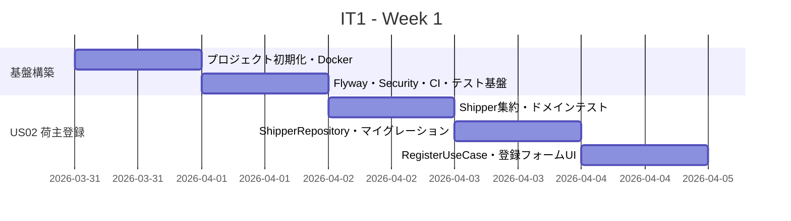
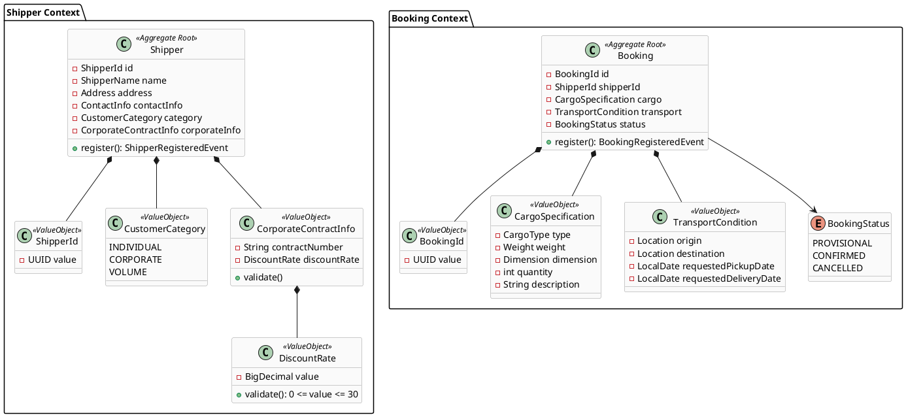

# イテレーション 1 計画

## 概要

| 項目 | 内容 |
|------|------|
| **イテレーション** | 1 |
| **期間** | Week 1-2（2026-03-31〜2026-04-13） |
| **ゴール** | Spring Boot プロジェクト基盤を構築し、荷主登録と貨物予約登録の CRUD を動作させる |
| **目標 SP** | 10 |

---

## ゴール

### イテレーション終了時の達成状態

1. **プロジェクト基盤**: Spring Boot 3.4 + ヘキサゴナルアーキテクチャのパッケージ構造が確立し、Docker Compose でローカル起動できる
2. **荷主登録（US02・US03）**: 個人・法人荷主を登録フォームから登録でき、荷主 ID が発行される
3. **貨物予約登録（US04）**: 荷主 ID を指定して貨物仕様と輸送条件を入力し、予約番号が発行される

### 成功基準

- [ ] `./gradlew bootRun` でアプリが起動し、ブラウザからログインできる
- [ ] 荷主登録フォームで個人・法人荷主を登録でき、一覧で確認できる
- [ ] 貨物予約フォームで予約を登録でき、予約番号が発行される
- [ ] `./gradlew test` で全テストがパスする
- [ ] テストカバレッジ 80% 以上（ドメイン層・ユースケース層）

---

## ユーザーストーリー

### 対象ストーリー

| ID | ユーザーストーリー | SP | 優先度 |
|----|-------------------|----|--------|
| US02 | 荷主を登録する | 3 | 必須 |
| US03 | 法人荷主を登録する | 2 | 必須 |
| US04 | 貨物予約を登録する | 5 | 必須 |
| **合計** | | **10** | |

※ プロジェクト基盤構築（環境セットアップ）は IT1 のオーバーヘッドとして SP に含まない。

### ストーリー詳細

#### US02: 荷主を登録する

**ストーリー**:
> 営業担当者として、新規荷主の氏名/社名・住所・連絡先・メールアドレスをシステムに登録したい。
> なぜなら、次回以降の予約で荷主情報の再入力を省略でき、顧客情報を一元管理できるからだ。

**受入条件**:

1. 氏名/社名・住所・連絡先・メールアドレス・荷主種別（個人/法人）を入力できる
2. 同一メールアドレスが既に登録されている場合、既存荷主として表示しどちらを使用するか選択できる
3. 登録完了後、荷主 ID が発行される
4. 荷主種別「個人」で登録できる

#### US03: 法人荷主を登録する

**ストーリー**:
> 営業担当者として、法人荷主の契約番号と割引率を含めて登録したい。
> なぜなら、法人契約条件（割引率）を精算時に自動適用できるからだ。

**受入条件**:

1. 荷主種別「法人」を選択すると、法人契約情報（契約番号・割引率）の入力フィールドが表示される
2. 割引率は 0〜30% の範囲で設定できる
3. 法人荷主で登録完了後、荷主 ID が発行される
4. 登録した法人情報は US17（法人割引を適用する）で参照される

#### US04: 貨物予約を登録する

**ストーリー**:
> 営業担当者として、荷主 ID・貨物仕様（種別・重量・寸法・個数・品名）・輸送条件（出発地・目的地・希望日）を入力して予約を登録したい。
> なぜなら、荷主の見積承認後に正式な予約を受け付け、経路設計フェーズに引き継げるからだ。

**受入条件**:

1. 荷主 ID を入力して既存荷主を選択できる
2. 貨物種別・重量・寸法・個数・品名を入力できる
3. 出発地・目的地・希望引渡日・希望着日を入力できる
4. 登録完了後、予約番号が発行され状態が「仮受付」になる
5. 経路設計者に予約登録の通知が送信される（`@TransactionalEventListener(AFTER_COMMIT)` 経由）
6. 見積情報との整合性が確認される

---

## タスク

### 0. プロジェクト基盤構築（環境セットアップ）

| # | タスク | 見積もり | 状態 |
|---|--------|---------|------|
| 0.1 | Spring Boot 3.4 + Java 21 プロジェクト初期化（Gradle、Kotlin DSL） | 4h | [ ] |
| 0.2 | ヘキサゴナルアーキテクチャのパッケージ構造作成（6 コンテキスト分） | 2h | [ ] |
| 0.3 | Docker Compose 設定（PostgreSQL 16 + app） | 2h | [ ] |
| 0.4 | Flyway マイグレーション基盤（`db/migration/` ディレクトリ） | 2h | [ ] |
| 0.5 | Spring Security ログイン認証基盤（ROLE ベース、ログイン画面） | 4h | [ ] |
| 0.6 | GitHub Actions CI 設定（test + build） | 2h | [ ] |
| 0.7 | テスト基盤構築（Testcontainers + JUnit5 + Mockito + WireMock） | 4h | [ ] |

**小計**: 20h（環境セットアップ）

### 1. US02: 荷主を登録する（3 SP）

| # | タスク | 見積もり | 状態 |
|---|--------|---------|------|
| 1.1 | Shipper 集約・値オブジェクト実装（ShipperId、ShipperName、ContactInfo） | 3h | [ ] |
| 1.2 | Shipper ドメインモデルのユニットテスト | 2h | [ ] |
| 1.3 | ShipperRepository（ポート）+ MyBatis mapper（アダプター） | 2h | [ ] |
| 1.4 | V001__create_shippers_table.sql マイグレーション | 1h | [ ] |
| 1.5 | RegisterShipperUseCase + テスト（Testcontainers 統合テスト） | 2h | [ ] |
| 1.6 | 荷主登録フォーム UI（Thymeleaf + Bootstrap 5、バリデーション表示） | 2h | [ ] |

**小計**: 12h（3 SP × 4h）

### 2. US03: 法人荷主を登録する（2 SP）

| # | タスク | 見積もり | 状態 |
|---|--------|---------|------|
| 2.1 | CustomerCategory 値オブジェクト（INDIVIDUAL / CORPORATE）追加 | 1h | [ ] |
| 2.2 | CorporateContractInfo 値オブジェクト（契約番号・割引率 0-30% バリデーション） | 2h | [ ] |
| 2.3 | 法人フォーム動的表示（htmx swap で法人情報フィールドを表示/非表示） | 2h | [ ] |
| 2.4 | US03 ユニットテスト + 統合テスト追加 | 2h | [ ] |
| 2.5 | V002__add_corporate_info_to_shippers.sql マイグレーション | 1h | [ ] |

**小計**: 8h（2 SP × 4h）

### 3. US04: 貨物予約を登録する（5 SP）

| # | タスク | 見積もり | 状態 |
|---|--------|---------|------|
| 3.1 | Booking 集約・値オブジェクト（BookingId、CargoSpecification、TransportCondition） | 4h | [ ] |
| 3.2 | Booking ドメインモデルのユニットテスト | 2h | [ ] |
| 3.3 | BookingRepository（ポート）+ MyBatis mapper | 3h | [ ] |
| 3.4 | V003__create_bookings_table.sql マイグレーション | 1h | [ ] |
| 3.5 | BookingRegisteredEvent + @TransactionalEventListener(AFTER_COMMIT) 実装パターン確立 | 3h | [ ] |
| 3.6 | RegisterBookingUseCase + 統合テスト（@TestTransaction + AFTER_COMMIT 検証） | 3h | [ ] |
| 3.7 | 予約登録フォーム UI（荷主選択・貨物仕様・輸送条件入力） | 4h | [ ] |

**小計**: 20h（5 SP × 4h）

### タスク合計

| カテゴリ | SP | 理想時間 | 状態 |
|---------|-----|---------|------|
| 環境セットアップ | - | 20h | [ ] |
| US02 荷主登録 | 3 | 12h | [ ] |
| US03 法人荷主登録 | 2 | 8h | [ ] |
| US04 貨物予約登録 | 5 | 20h | [ ] |
| **合計** | **10** | **60h** | |

**1 SP あたり**: 4h（基準どおり）
**進捗率**: 0%（0/10 SP）

---

## スケジュール

### Week 1（Day 1-5: 2026-03-31〜2026-04-04）



| 日 | タスク |
|----|--------|
| Day 1（03/31） | タスク 0.1〜0.3（プロジェクト初期化・パッケージ構造・Docker Compose） |
| Day 2（04/01） | タスク 0.4〜0.7（Flyway・Security・CI・Testcontainers 基盤） |
| Day 3（04/02） | タスク 1.1〜1.2（Shipper 集約・ドメインユニットテスト） |
| Day 4（04/03） | タスク 1.3〜1.5（Repository・Migration・UseCase 統合テスト） |
| Day 5（04/04） | タスク 1.6（荷主登録フォーム UI）・Week 1 動作確認 |

### Week 2（Day 6-10: 2026-04-07〜2026-04-11）


| 日 | タスク |
|----|--------|
| Day 6（04/07） | タスク 2.1〜2.2（CustomerCategory・CorporateContractInfo 値オブジェクト） |
| Day 7（04/08） | タスク 2.3〜2.5（htmx 動的フォーム・テスト・Migration） |
| Day 8（04/09） | タスク 3.1〜3.2（Booking 集約・ドメインユニットテスト） |
| Day 9（04/10） | タスク 3.3〜3.6（Repository・@TransactionalEventListener・UseCase 統合テスト） |
| Day 10（04/11） | タスク 3.7（予約登録フォーム UI）・統合テスト・バグ修正・デモ準備 |

---

## 設計

### ドメインモデル（IT1 対象集約）



### ヘキサゴナルアーキテクチャ パッケージ構造

```
src/main/java/com/example/cargotracker/
├── shipper/
│   ├── domain/
│   │   ├── model/          # Shipper, ShipperId, CustomerCategory, ...
│   │   └── repository/     # ShipperRepository (ポート)
│   ├── application/
│   │   ├── usecase/        # RegisterShipperUseCase
│   │   └── event/          # ShipperRegisteredEvent
│   └── infrastructure/
│       ├── persistence/    # ShipperRepositoryImpl, ShipperMapper
│       └── web/            # ShipperController, ShipperForm
├── booking/
│   ├── domain/
│   │   ├── model/          # Booking, BookingId, CargoSpecification, ...
│   │   └── repository/     # BookingRepository (ポート)
│   ├── application/
│   │   ├── usecase/        # RegisterBookingUseCase
│   │   └── event/          # BookingRegisteredEvent, BookingEventHandler
│   └── infrastructure/
│       ├── persistence/    # BookingRepositoryImpl, BookingMapper
│       └── web/            # BookingController, BookingForm
└── shared/
    ├── domain/             # 共有値オブジェクト（Location, Address, ...）
    └── infrastructure/     # Spring Security 設定, Flyway 設定
```

### データベーススキーマ（IT1 マイグレーション）

```sql
-- V001__create_shippers_table.sql
CREATE TABLE shippers (
    id              UUID PRIMARY KEY DEFAULT gen_random_uuid(),
    name            VARCHAR(200) NOT NULL,
    email           VARCHAR(254) NOT NULL UNIQUE,
    phone           VARCHAR(20),
    address         TEXT,
    category        VARCHAR(20) NOT NULL DEFAULT 'INDIVIDUAL',
    created_at      TIMESTAMP NOT NULL DEFAULT CURRENT_TIMESTAMP,
    updated_at      TIMESTAMP NOT NULL DEFAULT CURRENT_TIMESTAMP
);

-- V002__add_corporate_info_to_shippers.sql
ALTER TABLE shippers
  ADD COLUMN contract_number  VARCHAR(50),
  ADD COLUMN discount_rate    NUMERIC(5, 2);

-- V003__create_bookings_table.sql
CREATE TABLE bookings (
    id                      UUID PRIMARY KEY DEFAULT gen_random_uuid(),
    shipper_id              UUID NOT NULL REFERENCES shippers(id),
    cargo_type              VARCHAR(30) NOT NULL,
    cargo_weight_kg         NUMERIC(10, 2) NOT NULL,
    cargo_length_cm         NUMERIC(8, 2),
    cargo_width_cm          NUMERIC(8, 2),
    cargo_height_cm         NUMERIC(8, 2),
    cargo_quantity          INT NOT NULL DEFAULT 1,
    cargo_description       TEXT,
    origin_location         VARCHAR(200) NOT NULL,
    destination_location    VARCHAR(200) NOT NULL,
    requested_pickup_date   DATE NOT NULL,
    requested_delivery_date DATE NOT NULL,
    status                  VARCHAR(20) NOT NULL DEFAULT 'PROVISIONAL',
    created_at              TIMESTAMP NOT NULL DEFAULT CURRENT_TIMESTAMP,
    updated_at              TIMESTAMP NOT NULL DEFAULT CURRENT_TIMESTAMP
);
```

### 主要 URL

| メソッド | パス | 説明 | ロール |
|---------|------|------|--------|
| GET | `/shippers` | 荷主一覧 | ROLE_SALES |
| GET | `/shippers/new` | 荷主登録フォーム | ROLE_SALES |
| POST | `/shippers` | 荷主登録 | ROLE_SALES |
| GET | `/shippers/{id}` | 荷主詳細 | ROLE_SALES |
| GET | `/bookings/new` | 貨物予約登録フォーム | ROLE_SALES |
| POST | `/bookings` | 貨物予約登録 | ROLE_SALES |
| GET | `/htmx/shippers/corporate-fields` | 法人フィールド（htmx swap） | ROLE_SALES |

### @TransactionalEventListener パターン（ADR-002 準拠）

```java
// BookingRegisteredEvent を AFTER_COMMIT で受信
@Component
public class BookingEventHandler {

    @TransactionalEventListener(phase = TransactionPhase.AFTER_COMMIT)
    public void handleBookingRegistered(BookingRegisteredEvent event) {
        // 経路設計者への通知（IT1 ではログ出力のみ）
        log.info("Booking registered: {}", event.bookingId());
    }
}
```

### ADR 参照

| ADR | タイトル | 適用箇所 |
|-----|---------|---------|
| [ADR-002](../adr/002-transactional-event-listener.md) | @TransactionalEventListener(AFTER_COMMIT) 必須化 | BookingRegisteredEvent |
| [ADR-003](../adr/003-discount-policy-as-entity.md) | DiscountPolicy エンティティ設計 | CorporateContractInfo.discountRate |

---

## リスクと対策

| リスク | 影響度 | 対策 |
|--------|--------|------|
| Spring Boot 3.4 + Java 21 の依存関係解決に時間がかかる | 中 | Day 1 に Spring Initializr で最小構成を確認してから拡張 |
| Testcontainers の初回起動が遅くテスト時間が増大 | 低 | `@Container` を `@BeforeAll` で 1 回起動し再利用（Singleton コンテナパターン）|
| htmx の Thymeleaf 連携で fragment 実装が複雑化 | 低 | IT1 では法人フィールドの動的表示のみに限定し、複雑な htmx は IT2 以降で対応 |
| @TransactionalEventListener のテスト検証方法が不明 | 中 | ADR-002 の `@Commit` パターンを Day 9 に先行検証し、テストパターンを確立する |

---

## 完了条件

### Definition of Done

- [ ] `./gradlew test` で全テストがパスする
- [ ] ドメイン層・ユースケース層のテストカバレッジ 80% 以上
- [ ] `./gradlew bootRun` でローカル起動し、ブラウザから操作できる
- [ ] Docker Compose (`docker compose up`) で起動できる
- [ ] GitHub Actions CI が green になる
- [ ] US02・US03・US04 の全受入条件を満たす
- [ ] `release_plan.md` の進捗状況を更新する

### デモ項目

1. ログイン画面からアプリにログインできる（営業担当者ロール）
2. 個人荷主（田中太郎）を登録し、荷主 ID が発行される
3. 法人荷主（ABC 株式会社）を登録し、割引率 10% が設定される
4. 荷主 ID を指定して貨物予約を登録し、予約番号「PROVISIONAL」が発行される

---

## 更新履歴

| 日付 | 更新内容 | 更新者 |
|------|---------|--------|
| 2026-03-31 | 初版作成 | Copilot |

---

## 関連ドキュメント

- [リリース計画](./release_plan.md)
- [ユーザーストーリー](../requirements/user_story.md)
- [ADR-002: @TransactionalEventListener](../adr/002-transactional-event-listener.md)
- [ADR-003: DiscountPolicy エンティティ設計](../adr/003-discount-policy-as-entity.md)
- [UI 設計](../design/ui_design.md)
- [データモデル設計](../design/data-model.md)
- [バックエンドアーキテクチャ](../design/architecture_backend.md)
