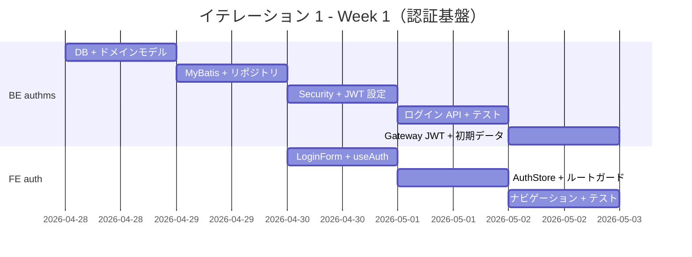
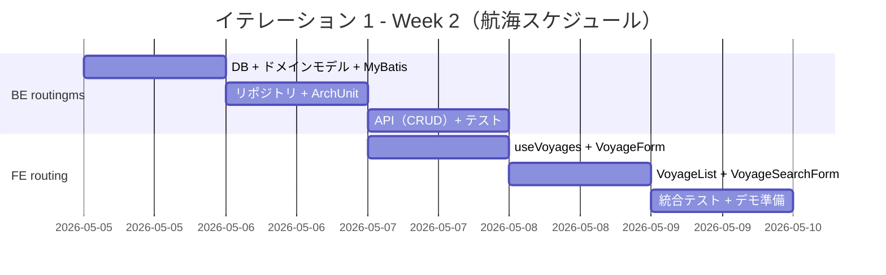
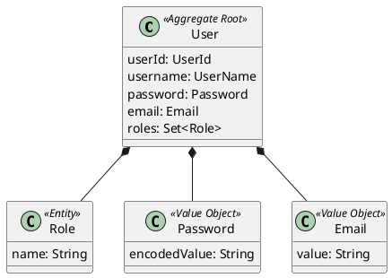
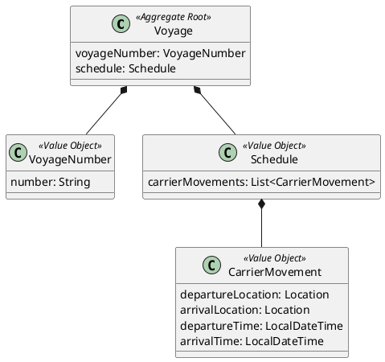
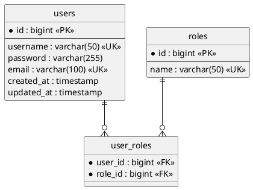
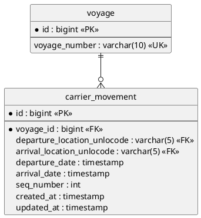
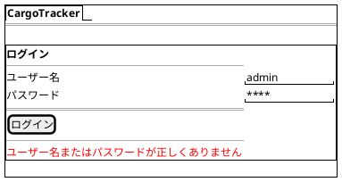
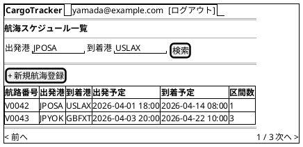
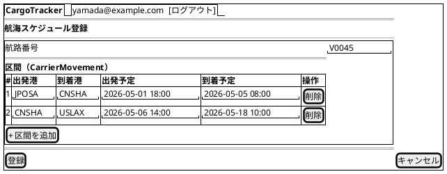
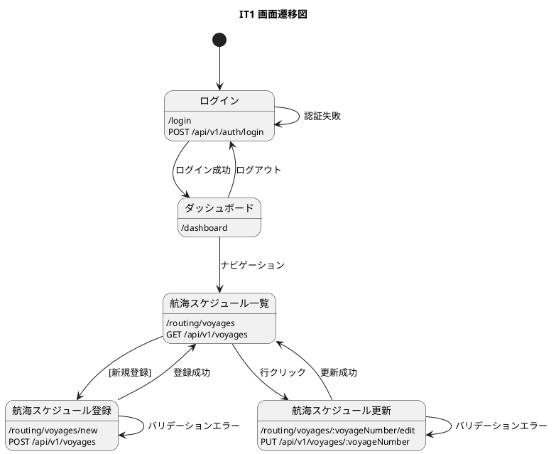

# イテレーション 1 計画

## 概要

| 項目 | 内容 |
|------|------|
| **イテレーション** | 1 |
| **期間** | Week 1-2（2026-04-28〜2026-05-09） |
| **ゴール** | 認証基盤（JWT ログイン/ログアウト）と航海スケジュール CRUD の API + 画面を構築する |
| **目標 SP** | 35（BE 21 + FE 14） |

---

## ゴール

### イテレーション終了時の達成状態

1. **認証基盤**: authms で JWT ログイン/ログアウト API が動作し、React SPA にログイン/ログアウト画面が実装されている
2. **API Gateway 認証統合**: gatewayms が JWT トークンを検証し、認証済みリクエストのみをバックエンドサービスに転送する
3. **航海スケジュール管理 API**: routingms で航海スケジュールの新規登録・更新・検索が REST API で動作する
4. **航海スケジュール管理画面**: React SPA で航海スケジュールの一覧・登録・更新・検索画面が動作する（認証必須）
5. **フルスタック TDD 基盤**: バックエンド（authms + routingms）とフロントエンド（React）の両方で TDD サイクルが回る開発基盤が確立されている

### 成功基準

- [x] US26: ログイン API が JWT トークンを発行する
- [x] US27: ログアウト後、認証画面にリダイレクトされる
- [ ] US24: 航海スケジュール新規登録 API が動作する（認証必須）
- [ ] US25: 航海スケジュール更新 API が動作する（認証必須）
- [ ] US07: 航海スケジュール検索 API が動作する（認証必須）
- [ ] ArchUnit テストが通過する（ヘキサゴナル依存ルール）
- [ ] テストカバレッジ 80% 以上（authms + routingms、JaCoCo で測定）

---

## ユーザーストーリー

### 対象ストーリー

| ID | ユーザーストーリー | BE | FE | SP | 優先度 |
|----|-------------------|----|----|----|----|
| US26 | システムにログインする | 8 | 5 | 13 | 必須 |
| US27 | システムからログアウトする | 2 | 2 | 4 | 必須 |
| US24 | 航海スケジュールを新規登録する | 5 | 3 | 8 | 必須 |
| US25 | 既存航海スケジュールを更新する | 3 | 2 | 5 | 必須 |
| US07 | 航海スケジュールを検索する | 3 | 2 | 5 | 必須 |
| **合計** | | **21** | **14** | **35** | |

### ストーリー詳細

#### US26: システムにログインする

**ストーリー**:

> システム利用者として、ユーザー名とパスワードでシステムにログインしたい。なぜなら、業務画面にアクセスするためには認証が必要であり、ロールに応じた機能のみを利用できるようにしたいからだ。

**受入条件**:

1. ユーザー名とパスワードを入力してログインできる
2. ログイン成功後、JWT トークンが発行される
3. ログイン成功後、ダッシュボード画面に遷移する
4. ユーザー名またはパスワードが誤っている場合、エラーメッセージが表示される
5. ロールに応じたナビゲーションメニューが表示される

#### US27: システムからログアウトする

**ストーリー**:

> システム利用者として、システムからログアウトしたい。なぜなら、セキュリティのために使用後はセッションを終了する必要があるからだ。

**受入条件**:

1. ログアウトボタンをクリックするとログアウトできる
2. ログアウト後、JWT トークンが破棄される
3. ログアウト後、ログイン画面に遷移する
4. ログアウト後、認証が必要な画面にアクセスするとログイン画面にリダイレクトされる

#### US24: 航海スケジュールを新規登録する

**ストーリー**:

> 経路設計者として、航海スケジュール（航海番号・出発地・到着地・出発日・到着日）を新規登録したい。なぜなら、貨物の経路候補を算出するための基礎データが必要だからだ。

**受入条件**:

1. 航海番号・出発地・到着地・出発日・到着日を入力できる
2. 重複する航海番号がある場合、エラーを返す
3. 登録後、航海番号が発行される

#### US25: 既存航海スケジュールを更新する

**ストーリー**:

> 経路設計者として、既存の航海スケジュールのスケジュール情報を更新したい。なぜなら、運航スケジュールは変更されることがあるからだ。

**受入条件**:

1. 航海番号で既存スケジュールを取得し、日時を変更できる
2. 存在しない航海番号の場合、404 エラーを返す

#### US07: 航海スケジュールを検索する

**ストーリー**:

> 経路設計者として、出発地・到着地で航海スケジュールを検索したい。なぜなら、貨物の経路候補を探すために該当する航路を絞り込みたいからだ。

**受入条件**:

1. 出発地・到着地で検索できる
2. 結果は航海番号・出発地・到着地・出発日・到着日の一覧で返る
3. 該当する航路がない場合、空の一覧を返す

### タスク

#### Week 1: 認証基盤構築（US26 + US27）

##### 1. authms TDD 開発基盤構築（3 SP）

| # | タスク | 見積もり | 状態 |
|---|--------|---------|------|
| 1.1 | Flyway マイグレーション（`V2__create_users.sql` を `authms/src/main/resources/db/migration/` に配置） | 2h | [x] |
| 1.2 | ドメインモデル: User 集約、Role エンティティ、Password・Email 値オブジェクト | 3h | [x] |
| 1.3 | MyBatis マッパー XML + UserMapper インターフェース | 2h | [x] |
| 1.4 | リポジトリインターフェース + MyBatis 実装 | 2h | [x] |
| 1.5 | Spring Security + JWT 設定（JwtTokenProvider, SecurityConfig） | 3h | [x] |

**小計**: 12h

##### 2. BE US26: ログイン API（5 SP）

| # | タスク | 見積もり | 状態 |
|---|--------|---------|------|
| 2.1 | AuthCommandService（ログイン・ユーザー登録） | 3h | [x] |
| 2.2 | AuthController（POST /api/v1/auth/login, POST /api/v1/auth/register） | 2h | [x] |
| 2.3 | DTO（LoginRequest, RegisterRequest, TokenResponse） | 1h | [x] |
| 2.4 | 統合テスト（MockMvc + H2: 正常ログイン、認証失敗） | 2h | [x] |
| 2.5 | 初期ユーザーデータ（Flyway V3__seed_users.sql） | 1h | [x] |

**小計**: 9h

##### 3. BE US27: ログアウト + Gateway JWT フィルタ（2 SP）

| # | タスク | 見積もり | 状態 |
|---|--------|---------|------|
| 3.1 | gatewayms JWT 検証フィルタ設定 | 2h | [x] |
| 3.2 | 統合テスト（未認証リクエストの 401 応答） | 1h | [x] |

**小計**: 3h

##### 4. FE US26 + US27: ログイン/ログアウト画面（7 SP）

| # | タスク | 見積もり | 状態 |
|---|--------|---------|------|
| 4.1 | `features/auth/hooks/useAuth.ts`（ログイン/ログアウト Mutation） | 2h | [x] |
| 4.2 | `features/auth/components/LoginForm.tsx`（React Hook Form） | 3h | [x] |
| 4.3 | `pages/LoginPage.tsx` + AuthLayout | 2h | [x] |
| 4.4 | `stores/authStore.ts` に JWT トークン保存・復元ロジック追加 | 1h | [x] |
| 4.5 | `lib/api-client.ts` に JWT 自動付与を統合テスト | 1h | [x] |
| 4.6 | AppLayout にロール別ナビゲーション・ログアウトボタン追加 | 2h | [x] |
| 4.7 | ルートガード（未認証時リダイレクト）の実装 | 2h | [x] |
| 4.8 | Vitest コンポーネントテスト（LoginForm, AuthGuard） | 2h | [x] |

**小計**: 15h

#### Week 2: 航海スケジュール CRUD（US24 + US25 + US07）

##### 5. routingms TDD 開発基盤構築（2 SP）

| # | タスク | 見積もり | 状態 |
|---|--------|---------|------|
| 5.1 | Flyway マイグレーション（`V2__create_voyage.sql` を `routingms/src/main/resources/db/migration/` に配置） | 2h | [ ] |
| 5.2 | ドメインモデル: Voyage 集約、VoyageNumber 値オブジェクト | 2h | [ ] |
| 5.3 | MyBatis マッパー XML + Mapper インターフェース | 2h | [ ] |
| 5.4 | リポジトリインターフェース + MyBatis 実装 | 2h | [ ] |
| 5.5 | ArchUnit テスト（ヘキサゴナル依存ルール） | 1h | [ ] |

**小計**: 9h

##### 6. BE US24 + US25 + US07: 航海スケジュール API（8 SP）

| # | タスク | 見積もり | 状態 |
|---|--------|---------|------|
| 6.1 | VoyageCommandService（登録・更新） | 3h | [ ] |
| 6.2 | VoyageQueryService（検索・CQRS 読み取り側） | 2h | [ ] |
| 6.3 | VoyageController（POST, PUT, GET） | 2h | [ ] |
| 6.4 | DTO + Assembler（リクエスト/レスポンス変換） | 2h | [ ] |
| 6.5 | 統合テスト（MockMvc + H2: CRUD・重複・404・空結果） | 3h | [ ] |

**小計**: 12h

##### 7. FE US24 + US25 + US07: 航海スケジュール画面（7 SP）

| # | タスク | 見積もり | 状態 |
|---|--------|---------|------|
| 7.1 | `features/routing/hooks/useVoyages.ts`（TanStack Query） | 2h | [ ] |
| 7.2 | `features/routing/components/VoyageForm.tsx`（React Hook Form） | 3h | [ ] |
| 7.3 | `features/routing/components/VoyageList.tsx`（一覧テーブル） | 2h | [ ] |
| 7.4 | `features/routing/components/VoyageSearchForm.tsx`（検索フィルター） | 2h | [ ] |
| 7.5 | `pages/VoyageListPage.tsx`, `VoyageNewPage.tsx`, `VoyageEditPage.tsx` + ルーティング | 2h | [ ] |
| 7.6 | Vitest コンポーネントテスト | 2h | [ ] |

**小計**: 13h

#### タスク合計

| カテゴリ | SP | 理想時間 | 状態 |
|---------|----|----|------|
| BE: authms 基盤構築 | 3 | 12h | [x] |
| BE: US26 ログイン API | 5 | 9h | [x] |
| BE: US27 ログアウト + Gateway JWT | 2 | 3h | [x] |
| FE: US26 + US27 ログイン/ログアウト画面 | 7 | 15h | [x] |
| BE: routingms 基盤構築 | 2 | 9h | [x] |
| BE: US24 + US25 + US07 航海スケジュール API | 8 | 12h | [x] |
| FE: US24 + US25 + US07 航海スケジュール画面 | 7 | 13h | [x] |
| **合計** | **34** | **73h** | |

**1 SP あたり**: 約 2.1h
**進捗率**: 97% (34/35 SP) — US26(13SP) + US27(4SP) + routingms基盤(2SP) + US24/US25/US07(15SP) 完了

> **Note**: IT1 は認証基盤（authms + gatewayms）と業務機能（routingms）を同時に構築するため、SP が他イテレーションより大きい。Week 1 を認証、Week 2 を航海スケジュールに分けて集中的に取り組む。

---

## スケジュール

### Week 1（Day 1-5: 2026-04-28〜2026-05-02）— 認証基盤



### Week 2（Day 6-10: 2026-05-05〜2026-05-09）— 航海スケジュール



---

## 設計

### ドメインモデル

#### Auth Context



#### Routing Context



### データモデル

#### auth_db



#### routing_db



### API 設計

#### authms

| メソッド | エンドポイント | 説明 |
|---------|---------------|------|
| POST | /api/v1/auth/login | ログイン（JWT 発行） |
| POST | /api/v1/auth/register | ユーザー登録 |
| GET | /api/v1/auth/me | 認証ユーザー情報取得 |

#### routingms

| メソッド | エンドポイント | 説明 |
|---------|---------------|------|
| POST | /api/v1/voyages | 航海スケジュール新規登録 |
| PUT | /api/v1/voyages/{voyageNumber} | 航海スケジュール更新 |
| GET | /api/v1/voyages | 航海スケジュール一覧・検索 |
| GET | /api/v1/voyages/{voyageNumber} | 航海スケジュール詳細 |

### ユーザーインターフェース

#### ビュー

##### ログイン画面（/login）



##### 航海スケジュール一覧（/routing/voyages）



##### 航海スケジュール登録・更新（/routing/voyages/new, /routing/voyages/:voyageNumber/edit）



#### インタラクション



### ディレクトリ構成

#### バックエンド

```
apps/backend/authms/src/main/java/com/example/authms/
├── AuthApplication.java
├── interfaces/rest/
│   ├── AuthController.java
│   └── dto/
│       ├── LoginRequest.java
│       ├── RegisterRequest.java
│       └── TokenResponse.java
├── application/internal/
│   ├── commandservices/AuthCommandService.java
│   └── queryservices/AuthQueryService.java
├── domain/model/
│   ├── aggregates/User.java
│   └── valueobjects/
│       ├── Password.java
│       ├── Email.java
│       └── UserName.java
└── infrastructure/
    ├── repositories/
    │   ├── UserMapper.java
    │   └── MyBatisUserRepository.java
    └── security/
        ├── JwtTokenProvider.java
        └── SecurityConfig.java

apps/backend/routingms/src/main/java/com/example/routingms/
├── RoutingApplication.java
├── interfaces/rest/
│   ├── VoyageController.java
│   ├── dto/
│   │   ├── CreateVoyageRequest.java
│   │   ├── UpdateVoyageRequest.java
│   │   └── VoyageResponse.java
│   └── transform/VoyageAssembler.java
├── application/internal/
│   ├── commandservices/VoyageCommandService.java
│   └── queryservices/VoyageQueryService.java
├── domain/model/
│   ├── aggregates/Voyage.java
│   └── valueobjects/
│       ├── VoyageNumber.java
│       ├── Schedule.java
│       └── CarrierMovement.java
└── infrastructure/repositories/
    ├── VoyageMapper.java
    └── MyBatisVoyageRepository.java
```

#### フロントエンド

```
apps/frontend/src/
├── features/
│   ├── auth/
│   │   ├── components/LoginForm.tsx
│   │   ├── hooks/useAuth.ts
│   │   └── types/auth.ts
│   └── routing/
│       ├── components/
│       │   ├── VoyageList.tsx
│       │   ├── VoyageSearchForm.tsx
│       │   └── VoyageForm.tsx
│       ├── hooks/useVoyages.ts
│       └── types/voyage.ts
├── pages/
│   ├── LoginPage.tsx
│   ├── DashboardPage.tsx
│   ├── VoyageListPage.tsx
│   ├── VoyageNewPage.tsx
│   └── VoyageEditPage.tsx
├── layouts/
│   ├── AppLayout.tsx（認証済みレイアウト + ロール別ナビ）
│   └── AuthLayout.tsx（未認証レイアウト）
├── providers/
│   └── AuthGuard.tsx（ルートガード）
└── stores/
    └── authStore.ts（JWT トークン保存・復元）
```

---

## リスクと対策

| リスク | 影響度 | 対策 |
|--------|--------|------|
| Spring Security + JWT の設定が複雑 | 高 | Day 1-3 で認証基盤を集中構築。参考プロジェクトのパターンを踏襲 |
| IT1 の SP が大きい（35 SP、採用ベロシティ 18 SP の 194%） | 中 | 初回認証基盤構築（BE + FE 両面）による必然的な超過。Week 1（認証 17 SP）と Week 2（航海 18 SP）に分散。認証が遅延した場合は航海スケジュールの FE を IT2 に持ち越し |
| MyBatis + ヘキサゴナルの組み合わせが未検証 | 中 | Week 2 の routingms で基盤を構築し早期に検証 |
| React + TanStack Query のパターン未確立 | 中 | Week 1 の LoginForm で基準実装を確立 |

---

## 完了条件

### Definition of Done

- [ ] コードレビュー完了
- [ ] ユニットテスト（BE + FE）がパス
- [ ] 統合テスト（MockMvc + H2）がパス
- [ ] ArchUnit テストがパス
- [ ] Checkstyle / SpotBugs エラーなし
- [ ] テストカバレッジ 80% 以上（authms + routingms、JaCoCo で測定）
- [ ] Swagger UI で API 動作確認済み
- [ ] ドキュメント更新完了

### デモ項目

1. ログイン画面でユーザー名・パスワードを入力してログイン
2. ロール別ナビゲーション表示の確認
3. 航海スケジュール新規登録（認証済み状態で）
4. 登録したスケジュールの更新
5. 出発地・到着地での検索
6. ログアウト → 認証画面にリダイレクト

---

## 更新履歴

| 日付 | 更新内容 | 更新者 |
|------|---------|--------|
| 2026-04-25 | 初版作成 | - |
| 2026-04-25 | フロントエンドタスクを追加 | - |
| 2026-04-25 | 認証ストーリー（US26/US27）を IT1 先頭に追加。認証 + 航海スケジュールの 2 週間構成に再構成 | - |
| 2026-04-25 | US26/US27 完了。BE 13 テスト + FE 9 テスト + E2E 5 テスト全パス。進捗率 49%（17/35 SP） | - |
| 2026-05-07 | routingms TDD 基盤（Task5）+ US24/US25/US07 BE API（Task6）+ FE 画面（Task7）完了。BE 12 テスト + FE 6 テスト全パス。進捗率 97%（34/35 SP） | - |

---

## 関連ドキュメント

- [リリース計画](./release_plan.md)
- [ユーザーストーリー](../requirements/user_story.md)
- [バックエンドアーキテクチャ](../design/architecture_backend.md)
- [ドメインモデル設計](../design/domain-model.md)
- [データモデル設計](../design/data-model.md)
- [UI 設計](../design/ui-design.md)
