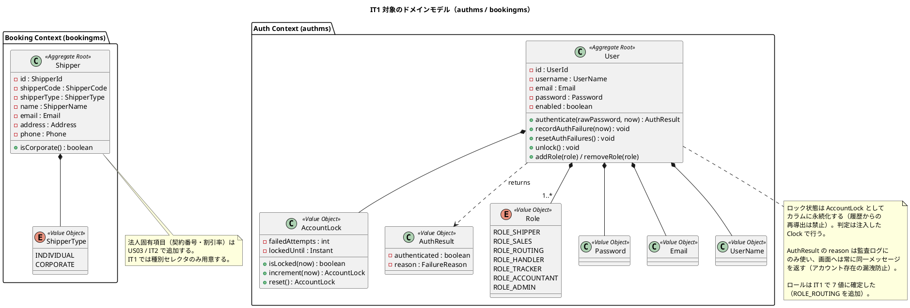
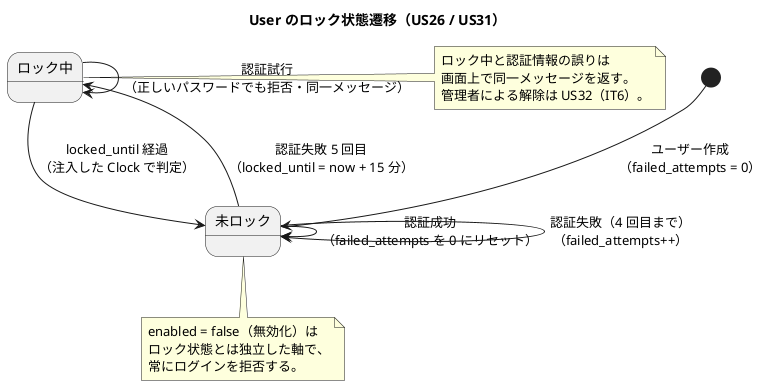
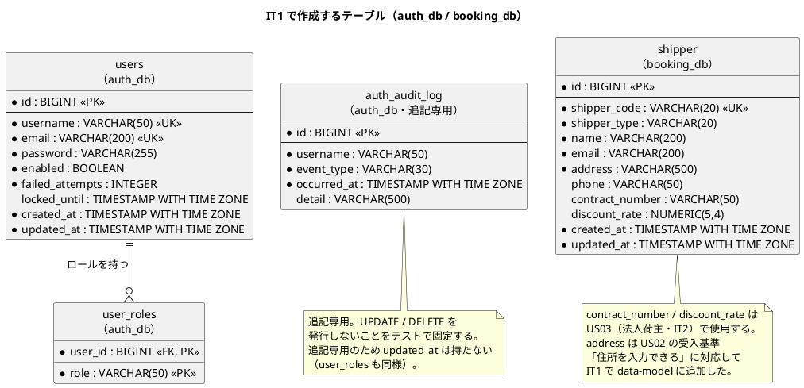
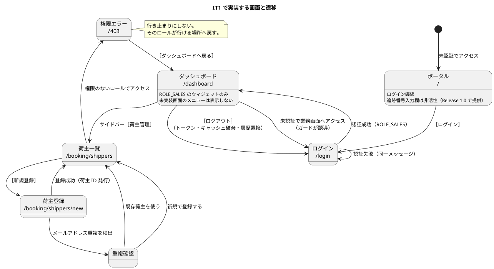

# イテレーション 1 計画

## 概要

| 項目 | 内容 |
|------|------|
| **イテレーション** | 1 |
| **期間** | Week 1-2（2026-08-24 〜 2026-09-04・2 週間） |
| **ゴール** | 認証基盤の完成。営業担当者がログイン・ログアウトでき、総当たり攻撃からアカウントが守られている。荷主を登録できる。品質ゲートが実配線される |
| **目標 SP** | 9 |

---

## ゴール

### イテレーション終了時の達成状態

1. **認証（authms + gatewayms）**: JWT でログイン・ログアウトでき、Gateway が保護経路で JWT を検証している。5 回失敗でロックされ、ロック中と認証誤りで同一メッセージが返る
2. **荷主登録（bookingms）**: 営業担当者が荷主（個人）を登録でき、荷主 ID が発行される
3. **マイクロサービスの型の確立**: ヘキサゴナル 4 層 + MyBatis + Flyway + ArchUnit の実装パターンを authms・bookingms で確立し、以降のサービスが踏襲できる状態にする
4. **品質ゲートの実配線**（レビュー H6）: ArchUnit 全サービス適用 + カバレッジ閾値の機械判定 + CI + E2E スモーク 1 本。「基準はあるが検査は無い」状態を IT1 で解消する
5. **入口の確立**（レビュー H13/H14）: ポータル（`/`）の骨格と ROLE_SALES ダッシュボード。他ロールのダッシュボードは各ロールの最初の業務画面と同じ IT で作る（スコープ外）

### 成功基準（すべて実行コマンドで判定する — レビュー H7）

- [ ] US26・US27・US31・US02 の受入基準（`docs/requirements/user_story.md` の該当節）をすべて満たす
- [ ] `./gradlew build` が緑（ユニット・統合・ArchUnit・`jacocoTestCoverageVerification` を含む）
- [ ] `TZ=UTC ./gradlew test` が緑（業務タイムゾーンの日付判定）
- [ ] E2E スモーク（`npm run e2e` — ログイン → ダッシュボード → ログアウト → ブラウザバックで業務画面に戻れない）が緑
- [ ] CI ワークフローが構成され、PR 上で上記が自動実行されて緑
- [ ] Heroku デプロイ後に `npx gulp deploy:dev:health` の全 URL が HTTP 200

---

## ユーザーストーリー

### 対象ストーリー

| ID | ユーザーストーリー | SP | 優先度 | Issue |
|----|-------------------|----|----|-------|
| US26 | システムにログインする | 3 | 必須 | [#543](https://github.com/k2works/case-study-cargo-tracker/issues/543) |
| US27 | システムからログアウトする | 1 | 必須 | [#544](https://github.com/k2works/case-study-cargo-tracker/issues/544) |
| US31 | 認証失敗が続いたアカウントを保護する | 2 | 必須 | [#548](https://github.com/k2works/case-study-cargo-tracker/issues/548) |
| US02 | 荷主を登録する | 3 | 必須 | [#519](https://github.com/k2works/case-study-cargo-tracker/issues/519) |
| **合計** | | **9** | | |

> 受入基準の正典は `docs/requirements/user_story.md` です。**書き写さず参照します**（DoD は条件を書き写さず引用する — 過去 take の教訓。書き写した条件は正典が変わっても追随しない）。

### ストーリーの依存関係

- US26 → US27（ログアウトはログインの存在が前提）
- US26 → US31（ロックはログインと同じテーブル・同じエンドポイントを触る。**同時に作るのが最も安い**）
- US26 → US02（荷主登録は認証済み営業担当者の操作。Gateway の JWT 検証を通す）

### タスク

#### 1. US26: システムにログインする（3 SP）

| # | タスク | 見積もり | 状態 |
|---|--------|---------|------|
| 1.0 | **ロール名の確定**と `ui_design.md` の保留記述解消（IT1 で確定済み: `ROLE_ROUTING` を追加した 7 値。domain-model・architecture_backend・non_functional・ui_design を同一変更で更新） | 1h | [x] |
| 1.1 | users / user_roles テーブルの Flyway マイグレーションと User 集約（TDD） | 3h | [x] |
| 1.2 | ログインユースケース（BCrypt 検証・JWT 発行）と認証監査ログ | 3h | [x] |
| 1.3 | AuthController（POST /api/v1/auth/login, GET /api/v1/auth/me）と MockMvc テスト | 2h | [x] |
| 1.4 | Gateway の JWT 検証フィルタ（public-paths 以外を保護・未認証 401・権限なし 403。**public-paths のパターンが広すぎて業務 API まで素通りしないことを検査する破壊検証を含む**） | 4h | [x] |
| 1.5 | フロントエンド: 共通レイアウト（サイドバー + ヘッダー・ロール別かつ**実装済み画面のみ**のメニュー表示）・認証ガード付きルーティング・403 画面（ダッシュボードへ戻る導線付き）の型 | 3h | [x] |
| 1.6 | フロントエンド: ログイン画面・authStore・**ROLE_SALES の**ダッシュボード骨格（他ロールは各ロールの最初の業務画面と同じ IT — release_plan の横断規約） | 3h | [x] |
| 1.7 | フロントエンド: ポータル（`/`）の骨格 — ログイン導線 + 追跡番号入力欄は「Release 1.0 で提供予定」として非活性（レビュー H13。`/` が未認証で 200 を返すことを E2E に含める） | 2h | [x] |

**小計**: 22h

#### 2. US27: システムからログアウトする（1 SP）

| # | タスク | 見積もり | 状態 |
|---|--------|---------|------|
| 2.1 | ログアウトエンドポイント（セッション破棄記録）と監査ログ | 2h | [x] |
| 2.2 | フロントエンド: ログアウト操作・トークン破棄・**クエリキャッシュ破棄・履歴置換**（ブラウザバックで業務画面に戻れないことを E2E で検証） | 2h | [x] |

**小計**: 4h

#### 3. US31: 認証失敗が続いたアカウントを保護する（2 SP）

| # | タスク | 見積もり | 状態 |
|---|--------|---------|------|
| 3.1 | failed_attempts / locked_until / enabled カラムとロックのドメインロジック（TDD。境界値: 失敗 4 回目は可・5 回目でロック・期限ちょうどで解除・リセット後の再失敗） | 4h | [x] |
| 3.2 | ロック中・認証誤り・無効化アカウントで同一メッセージを返す検証（**正しいパスワードでもロック中は拒否**する「壊すと赤」テスト） | 3h | [x] |
| 3.3 | 自動解除（期限経過・注入した Clock で判定）・成功時リセット・監査ログ（**ログ行が実際に書かれることをアサート**） | 2h | [x] |

**小計**: 9h

> 管理者によるロック解除は **US32（Release 0.2 / IT6）に分割**した（レビュー H8）。利用者への「通知」は
> 画面では行わず別チャネルとする（`user_story.md` の US31 注記が正典）。

> ロック状態は**カラムに永続化**します。履歴からの再導出は禁止です（集約状態の再導出禁止 — 過去 take で偽の安全網になった）。

#### 4. US02: 荷主を登録する（3 SP）

| # | タスク | 見積もり | 状態 |
|---|--------|---------|------|
| 4.1 | shipper テーブルの Flyway マイグレーション（**`V1__init_booking.sql` に shipper のみを含める。location/cargo/leg は IT2 の `V2__` で追加**）と Shipper 集約（TDD・荷主 ID は本番経路で採番。種別セレクタは個人/法人を用意し、法人固有項目は US03/IT2） | 3h | [x] |
| 4.2 | 登録ユースケース（メールアドレス重複時は既存荷主を提示し、**既存を使う / 新規で登録の両分岐**をテスト） | 3h | [x] |
| 4.3 | ShipperController（`POST/GET /api/v1/shippers`）と MockMvc テスト（ROLE_SALES 認可。**他ロールの JWT で 403 になることを、認可を外すと赤になる形で検証**） | 2h | [x] |
| 4.4 | フロントエンド: 荷主一覧画面（検索付き。営業ダッシュボードから導線） | 2h | [x] |
| 4.5 | フロントエンド: 荷主登録画面（**重複検出時の選択 UI: 既存荷主の情報表示 + 既存を使う/新規登録の 2 択**。着手時にこの分岐の画面イメージを起こす） | 3h | [x] |
| 4.6 | **bookingms が署名を再検証しないことの統合テスト**（不正署名 + 正しいロールクレームで 200 になる）。ADR-004 のコンプライアンス (b) | 2h | [x] |

**小計**: 15h

> **4.6 は ADR-004 が最も恐れる失敗モードを止める唯一の検査**である。これが無いと、サービス側に
> Spring Security を素直に入れて署名検証が 7 サービスに拡散する流れを誰も止められない
> （ADR に落とした規則は、同じ変更で検査に落とさなければ守られない）。

#### 5. 品質ゲートの実配線（SP 対象外の基盤投資 — レビュー H6）

「基準はあるが検査は無い」状態を IT1 で解消する。以降 11 IT の全ストーリーがこの上に乗るため、IT1 で払うのが最も安い。

| # | タスク | 見積もり | 状態 |
|---|--------|---------|------|
| 5.1 | ArchUnit ルールを共有配置（Gradle convention または shared testFixtures）で**全サービス**に適用し、**未適用サービスの存在自体を落とすメタテスト**を追加（検査は未登録を素通りさせない） | 4h | [x] |
| 5.2 | `jacocoTestCoverageVerification`（全体 80% / `domain/model` 90%）を `check` に紐付け。設定クラス等の除外はレイヤー別 rule で最初から現実的に設定する（「後で上げる」は固定化する） | 2h | [x] |
| 5.3 | CI ワークフロー（backend: `./gradlew build` + `TZ=UTC ./gradlew test`、frontend: test + build）を追加 | 3h | [x] |
| 5.4 | E2E 基盤: Playwright 導入 + スモーク 1 本（ログイン → ダッシュボード → ログアウト → ブラウザバック不可 + `/` が未認証で 200） | 4h | [x] |
| 5.5 | H2 / PostgreSQL 方言スモークの型（最初の Flyway SQL を書く IT1 が最安のタイミング。全クエリを両 DB で「解釈できるか」を検証） | 2h | [x] |

**小計**: 15h

#### 6. ユーザーマニュアルの初版（SP 対象外の基盤投資）

**IT1 は画面を伴うイテレーション**のため、マニュアル更新をタスクと DoD に計上する。クローズ時に初めて着手すると、計画外の作業がイテレーション末に積み上がる。IT1 では以降の全 IT が踏襲する**マニュアルの型**（構成・執筆テンプレート・キャプチャの撮り方）を作ることが主目的。

| # | タスク | 見積もり | 状態 |
|---|--------|---------|------|
| 6.1 | `docs/manual/index.md`（構成・執筆テンプレート・キャプチャ方針）を作成 | 2h | [ ] |
| 6.2 | 「ログインする」「ログアウトする」「ロックされたとき」の節を執筆（読者は業務担当者） | 2h | [ ] |
| 6.3 | 「荷主を登録する」の節を執筆（メールアドレス重複時の選択を含む） | 2h | [ ] |
| 6.4 | 画面キャプチャの自動生成を Playwright に配線（出力先 `docs/manual/assets/`）し、上記 4 節分を生成 | 3h | [ ] |

**小計**: 9h

> キャプチャは手動で撮らず**自動生成**にする。手動だと画面変更のたびに撮り直しが漏れ、実装とマニュアルが乖離する。
> IT1 で E2E 基盤（タスク 5.4）を作るので、同じ Playwright を流用するのが最も安い。

#### タスク合計

| カテゴリ | SP | 理想時間 | 状態 |
|---------|----|----|------|
| US26 ログイン（+ロール確定・ポータル・共通レイアウト） | 3 | 22h | [ ] |
| US27 ログアウト | 1 | 4h | [ ] |
| US31 アカウント保護 | 2 | 9h | [ ] |
| US02 荷主登録 | 3 | 15h | [ ] |
| 品質ゲート実配線（SP 対象外） | - | 15h | [ ] |
| ユーザーマニュアル初版（SP 対象外） | - | 9h | [ ] |
| **合計** | **9** | **74h** | |

**1 SP あたり**: 約 5.2h（品質ゲート・マニュアル除く）
**進捗率**: 0% (0/9 SP)

> **IT1 の総時間は他 IT より重い**（基盤投資 24h = 品質ゲート 15h + マニュアル 9h を含むため）。これは意図した配分であり、
> ベロシティ実績の記録では基盤投資分を分けて記録する（純粋なストーリー実装の実績を汚さない）。
> 2 週間に収まらない場合は、リスク表の対策に従いストーリー実装を優先する。

---

## スケジュール

> **順序は開発戦略の序盤ワークフロー（アウトサイドイン）に従う**: E2E（赤）→ UI + MSW モック →
> Gateway・Controller → ユースケース → ドメイン・永続化 → モックを実物に差し替えて閉じる。
> **UI のニーズから API 契約を導出する**ため、フロントが先、ドメインが後になる。
> ドメインから書き始めるとこの狙いが失われ、API 契約の手戻りが IT2 以降に波及する。

### Week 1（Day 1-5）— 外側から

| 日 | タスク | アウトサイドインの位置づけ |
|----|--------|--------------------------|
| Day 1 | 1.0 ロール名確定、5.1 ArchUnit 共有配置 + メタテスト、5.2 カバレッジ検証 | 検査の土台（以降すべてがこの上に乗る） |
| Day 2 | 5.4 E2E 基盤 + スモークを**赤で置く**、5.3 CI ワークフロー | Phase 1: 受け入れテスト（Red） |
| Day 3 | 1.5 共通レイアウト・ルーティングガード・403 画面、1.7 ポータル骨格 | Phase 2: UI（MSW モックで動かす） |
| Day 4 | 1.6 ログイン画面・authStore・ROLE_SALES ダッシュボード、2.2 ログアウト（キャッシュ破棄・履歴置換） | Phase 2: UI。**ここで API 契約が確定する** |
| Day 5 | 1.4 Gateway JWT 検証フィルタ（public-paths 破壊検証含む）、1.3 AuthController（MockMvc） | Phase 3: Gateway・API |

### Week 2（Day 6-10）— 内側へ、そして閉じる

| 日 | タスク | アウトサイドインの位置づけ |
|----|--------|--------------------------|
| Day 6 | 1.2 ログインユースケース・JWT 発行、2.1 ログアウト API | Phase 3-4: ユースケース |
| Day 7 | 1.1 users / user_roles の Flyway と User 集約（TDD）、5.5 方言スモークの型 | Phase 4: ドメイン・永続化 |
| Day 8 | 3.1 ロックのドメインロジック（境界値）、3.2 同一メッセージの破壊検証、3.3 自動解除・監査ログ | Phase 4: ドメイン（US31） |
| Day 9 | 4.4 荷主一覧・4.5 荷主登録画面（**先に UI で契約を決める**）、4.3 ShipperController、4.6 署名非再検証テスト | US02 も外側から |
| Day 10 | 4.2 登録ユースケース、4.1 Shipper 集約と Flyway、**E2E を実物に差し替えて緑にする**、6.1〜6.4 マニュアル、統合確認（kind）・Heroku デプロイ | Phase 4-5: 縦の閉合 |

> **Day 2 で E2E を赤にしておくことが要**。ウォーキングスケルトンの成立が最後まで判定できない状態を作らない。
> Day 10 でモックを実物に差し替え、同じテストが緑になることで縦切りが閉じたと判定する。

---

## 設計

設計の正典は以下を参照します（受入基準・仕様は書き写しません）。

| トピック | 正典 |
|---------|------|
| 集約・値オブジェクト（User / AccountLock / Shipper） | [ドメインモデル設計](../design/domain-model.md) |
| テーブル定義（users / user_roles / auth_audit_log / shipper） | [データモデル設計](../design/data-model.md) |
| 画面（ポータル・ログイン・ダッシュボード・荷主一覧/登録・403） | [UI 設計](../design/ui_design.md) |
| API（`/api/v1/auth/**`, `/api/v1/shippers`） | [バックエンドアーキテクチャ](../design/architecture_backend.md) |
| 認証方式・ロック仕様（5 回・15 分・同一メッセージ） | [非機能要件定義](../design/non_functional.md) §2.1 |

以下の 4 図は**本イテレーションのスコープに絞った抜粋**です。全体像は上記の正典を参照してください。

### ドメインモデル図（IT1 スコープ）

> **BC 独立性**: authms の `User` と bookingms の `Shipper` は互いに参照しません。荷主登録の認可は Gateway が検証した JWT クレームのロールで行い、bookingms は authms のドメイン型に依存しません（ADR-004）。共有カーネルは `Location` のみで、IT1 では使用しません。

### 状態遷移図（IT1 スコープ: アカウントのロック状態）

### ER 図（IT1 スコープ）

> **Database per Service**: `users` と `shipper` は別データベース（auth_db / booking_db）にあり、FK では結べません。図で線がつながらないことが正しい状態です。
> **採番は本番経路で行う**: `shipper_code` はシーケンス等の本番と同じ経路で採番し、テストで MAX+1 の自前採番をしません。

### 画面遷移図（IT1 スコープ）

> **ロール別到達性**: IT1 で到達先を持つのは ROLE_SALES のみです。他ロールのダッシュボードとメニューは、各ロールの最初の業務画面と同じ IT で実装します（リリース計画の横断規約）。

### ADR

| ADR | タイトル | ステータス |
|-----|---------|-----------|
| [ADR-001](../adr/001-microservices-architecture.md) | マイクロサービスアーキテクチャの採用 | 承認済み |
| [ADR-002](../adr/002-local-kubernetes-kustomize.md) | ローカル統合環境に kind + Kustomize | 承認済み |
| [ADR-003](../adr/003-heroku-development-environment.md) | 開発環境に Heroku | 承認済み |
| [ADR-004](../adr/004-gateway-jwt-verification.md) | JWT 署名検証の Gateway 一元化とサービス側ロール認可 | 承認済み |

---

## リスクと対策

| リスク | 影響度 | 対策 |
|--------|--------|------|
| Gateway の JWT 検証（WebFlux）と各サービスの認可（MVC）の二重管理が混乱する | 高 | 検証は Gateway に一元化し、サービス側はクレームのロールで認可のみ行う（設計どおり）。境界を ArchUnit とテストで固定 |
| 初 IT でマイクロサービスの型決めに時間を使いすぎる | 中 | authms で確立した型を bookingms にコピーして差分だけ直す。型の議論は IT1 内で打ち切り、以降は踏襲 |
| H2 と PostgreSQL の方言差 | 中 | 全クエリを両 DB でスモーク（テスト戦略の規律）。Flyway は common に方言を書かない |
| フロントの共通レイアウト・ルーティングガードの型決めが後続 20 画面に波及する | 高 | タスク 1.5 を独立させ Day 5 に集中実施。型の議論は IT1 内で打ち切り、以降は踏襲 |
| IT1 の総時間（74h）が 2 週間に収まらない | 中 | 品質ゲート（タスク 5）を Day 1 から先行し、遅延時はストーリー実装を優先して 5.4/5.5 のみ IT2 冒頭へ繰り越し可とする |

---

## 完了条件

### Definition of Done

- [ ] 対象 4 ストーリーの受入基準（`docs/requirements/user_story.md` の該当節）をすべて満たす
- [ ] `./gradlew build` が緑（ユニット・統合・ArchUnit・カバレッジ検証を含む。静的解析は `ignoreFailures` のため判定に使わない — 警告として扱う）
- [ ] `TZ=UTC ./gradlew test` が緑
- [ ] フロントエンドのテスト・ビルド・E2E スモークがパス
- [ ] 画面を追加した各 US について、`ui_design.md` のナビゲーション表・サイドバー実装・ダッシュボード導線・到達性テストの **4 点一致**を確認（過去 take の導線欠落の型）
- [x] **全ロール名を確定**し、`ui_design.md` の保留記述を解消（タスク 1.0 で実施済み: `ROLE_ROUTING` を追加した 7 値）
- [ ] kind 統合環境で Gateway 経由の動作確認済み
- [ ] 開発環境（Heroku）へデプロイ済み
- [ ] **ユーザーマニュアル**（`docs/manual/`）の対象 4 節が執筆され、画面キャプチャが自動生成で最新化されている
- [ ] ドキュメント更新完了（release_plan.md の進捗・JIG / jig-erd 再生成）

### デモ項目

> **E2E に翻訳する範囲**: 序盤（IT1）は開発戦略に従い **E2E スモーク 1 本**（デモ項目 1 + 4 の一部）を自動化する。
> デモ項目 2（ロック → 15 分経過後にログイン）は待機時間を要し、Clock を注入できる統合テスト側で検証する方が確実。
> デモ項目 3（荷主登録）は IT2 で予約登録と結合したときに E2E 化する。中盤以降は各 IT のデモ項目を全件 E2E 化する。

1. ログイン → 営業ダッシュボード表示 → ログアウト
2. パスワードを 5 回誤る → ロック → 正しいパスワードでも拒否（同一メッセージ） → 期限経過後にログイン成功
3. 営業担当者で荷主（個人）を登録 → 荷主 ID の発行を確認
4. 未ログインで業務画面にアクセス → ログイン画面へ誘導。公開追跡経路（US18 の先行確認）は 401 にならないこと

---

## 更新履歴

| 日付 | 更新内容 | 更新者 |
|------|---------|--------|
| 2026-08-19 | 初版作成 | - |
| 2026-08-19 | 開始準備（opening-iteration）: IT1 スコープに絞った設計 4 図を追加、ユーザーマニュアル初版のタスクと DoD を計上 | - |
| 2026-08-19 | 整合性検証の反映: スケジュールをアウトサイドイン順に組み替え（A-1）、ADR-004 の署名非再検証テストをタスク 4.6 に追加（C-2）、荷主 API を `/api/v1/shippers` に確定（C-4）、ロール名を `ROLE_ROUTING` 追加の 7 値に確定（タスク 1.0）、ドメイン図のメソッド名を正典に統一・AuthResult 追加、ER 図に監査カラムと address を追加、ログアウト遷移先をログイン画面に修正 | - |
| 2026-08-19 | レビュー反映: 品質ゲート実配線タスク（H6）、判定可能な成功基準（H7）、US31 の管理者解除を US32 へ分割（H8）、ポータル骨格（H13）、ダッシュボードのスコープ明示と 4 点一致 DoD（H14）、破壊検証の拡大・境界値の明記・E2E スモーク | - |

---

## 関連ドキュメント

- [リリース計画](./release_plan.md)
- [イテレーション 1 ふりかえり](./retrospective-1.md)（イテレーション終了時に作成）
