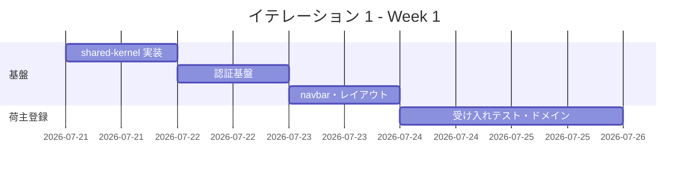
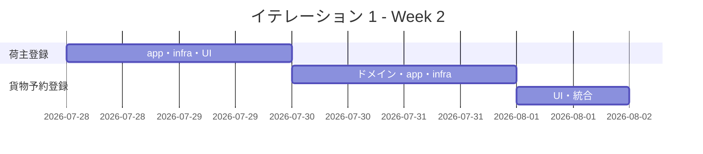
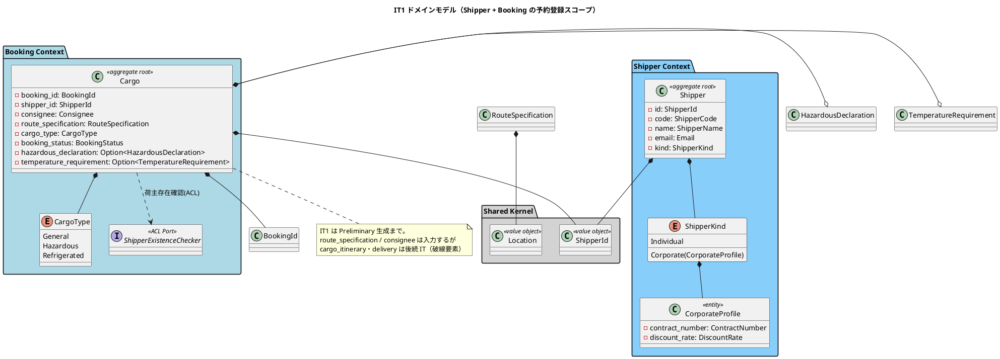
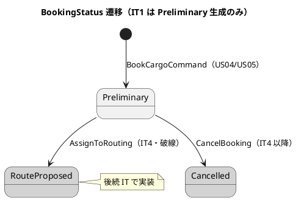
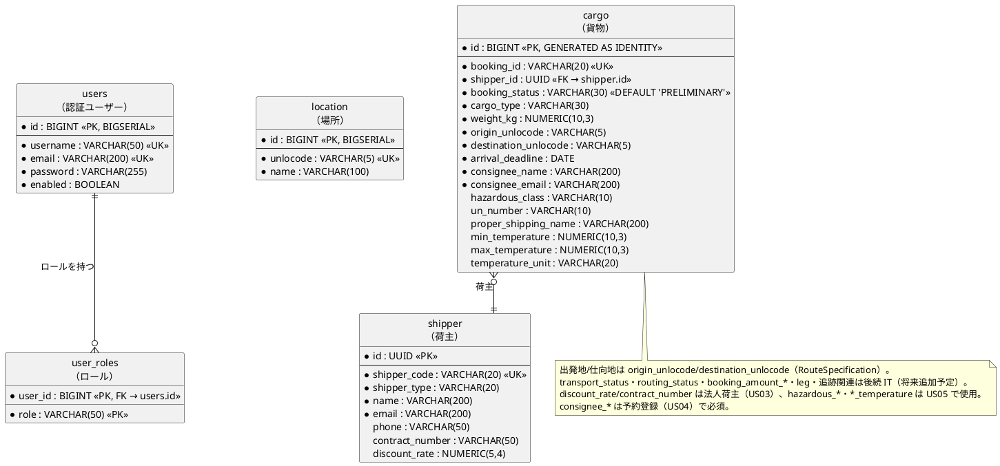
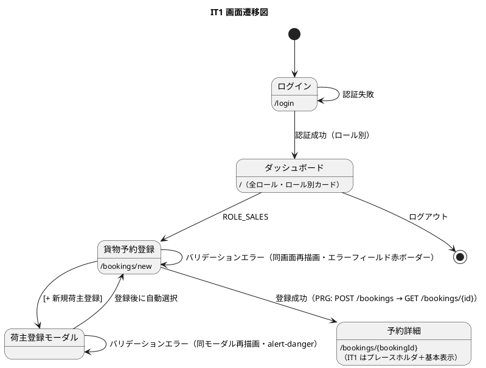

# イテレーション 1 計画

## 概要

| 項目 | 内容 |
|------|------|
| **イテレーション** | 1 |
| **期間** | Week 1-2（2026-07-21 〜 2026-08-03） |
| **局面** | 序盤（アウトサイドイン） / [開発戦略](./development_strategy.md#序盤-アウトサイドインit1) |
| **ゴール** | 認証・ロール別アクセス制御を最初に確立し、荷主登録から貨物予約登録までの縦切りを受け入れテストで通す（歩けるスケルトン） |
| **目標 SP** | 16 |

> 対象ストーリー・SP は [リリース計画](./release_plan.md) を、局面・アプローチは [開発戦略](./development_strategy.md) を正とする。

---

## ゴール

### イテレーション終了時の達成状態

1. **認証・認可基盤（最初に実装）**: axum-login によるログイン/ログアウトと、ロール別のアクセス制御・ナビゲーション出し分けが成立し、未認証アクセスは `/login` にリダイレクトされる。
2. **予約基盤の縦切り**: 荷主（個人・法人）登録と貨物予約登録が UI → アプリケーション層 → ドメイン層 → PostgreSQL まで実データで通る。
3. **ウォーキングスケルトン基盤化**: ロール制御付きナビゲーションバーと、UI 設計の全ルートに対応するプレースホルダ画面が成立する。
4. **アーキテクチャ基盤の検証**: cargo workspace のクレート分割（`domain-*`/`app-*`/`infra-*`/`interface-*`）とヘキサゴナル境界が `cargo build` で強制され、Booking↔Shipper 間の ACL（ShipperExistenceChecker）が機能する。

### 成功基準

- [x] ログイン/ログアウトが動作し、ロール別アクセス制御と未認証リダイレクトが機能する
- [x] 荷主登録（個人・法人）の受け入れテストが緑（Email 重複検出・割引率 0〜30% 検証含む）
- [x] 貨物予約登録（一般・危険物・冷凍）の受け入れテストが緑（危険物申告・温度条件の必須検証含む）
- [x] ログイン → ダッシュボード → 予約登録 → 予約詳細の画面遷移が動作する（実 PostgreSQL で確認）
- [x] ナビゲーションバーがロール別に出し分けされ、検証テストが緑
- [x] `cargo build` / `cargo clippy -D warnings` / `cargo fmt --check` が緑
- [ ] テストカバレッジ 80% 以上（未計測。cargo-llvm-cov による計測は残ハードニング）

---

## ユーザーストーリー

### 対象ストーリー

| ID | ユーザーストーリー | SP | 優先度 | GitHub |
|----|-------------------|----|----|----|
| US-AUTH-01 | ログイン認証とロール別アクセス制御（最初に実装） | 3 | 必須 | #359 |
| US02 | 荷主を登録する | 3 | 必須 | #334 |
| US03 | 法人荷主を登録する | 2 | 必須 | #335 |
| US04 | 貨物予約を登録する | 5 | 必須 | #336 |
| US05 | 危険物・冷凍貨物の予約を登録する | 3 | 必須 | #337 |
| **合計** | | **16** | | |

### ストーリー詳細

#### US-AUTH-01: ログイン認証とロール別アクセス制御

**ストーリー**:
> システム利用者（全ロール）として、ユーザー名とパスワードでログインし、自分のロールに応じた機能・画面にのみアクセスしたい。なぜなら、業務データを権限のない者から保護し、各担当者が必要な画面だけを迷わず利用できるからだ。

**受入条件**:

1. ユーザー名（メールアドレス）とパスワードでログインできる（axum-login フォーム認証）
2. 認証失敗時に「ユーザー名またはパスワードが正しくありません」が表示される
3. ログイン成功後、ロールに応じたダッシュボードへリダイレクトされる
4. 未認証で保護ページにアクセスすると `/login` へリダイレクトされる
5. セッションはサーバー側（tower-sessions / PostgreSQL ストア）で管理され、タイムアウト後は `/login?timeout` へ
6. ナビゲーションバーがロール別に出し分けされ、許可外の画面・操作は 403 となる
7. ログアウトでセッションが破棄され `/login` へ戻る

**備考**: 全業務ユースケースの前提となる横断基盤。IT1 で最初に実装する。

#### US02: 荷主を登録する

**ストーリー**:
> 営業担当者として、新規荷主の氏名/社名・住所・連絡先・メールアドレスをシステムに登録したい。なぜなら、次回以降の予約で荷主情報の再入力を省略でき、顧客情報を一元管理できるからだ。

**受入条件**:

1. 氏名/社名・住所・連絡先・メールアドレス・荷主種別（個人/法人）を入力できる
2. 同一メールアドレスが既に登録されている場合、既存荷主として表示しどちらを使用するか選択できる
3. 登録完了後、荷主 ID（および荷主コード `SHP-xxxxxxxx`）が発行される
4. 荷主種別「個人」で登録できる

#### US03: 法人荷主を登録する

**ストーリー**:
> 営業担当者として、法人荷主の契約番号と割引率を含めて登録したい。なぜなら、法人契約条件（割引率）を精算時に自動適用できるからだ。

**受入条件**:

1. 荷主種別「法人」を選択すると、法人契約情報（契約番号・割引率）の入力フィールドが表示される
2. 割引率は 0〜30% の範囲で設定できる（範囲外はドメインエラー）
3. 法人荷主で登録完了後、荷主 ID が発行される
4. 登録した法人情報は後続 US22（法人割引を適用する）で参照される

#### US04: 貨物予約を登録する

**ストーリー**:
> 営業担当者として、荷主 ID・貨物仕様（種別・重量・寸法・個数・品名）・輸送条件（出発地・目的地・希望日）を入力して予約を登録したい。なぜなら、荷主の見積承認後に正式な予約を受け付け、経路設計フェーズに引き継げるからだ。

**受入条件**:

1. 荷主 ID を入力して既存荷主を選択できる（ShipperExistenceChecker ACL で存在確認）
2. 貨物種別・重量・寸法・個数・品名を入力できる
3. 出発地・目的地・希望引渡日・希望着日を入力できる（UN/LOCODE 5 文字、出発地≠目的地）
4. 登録完了後、予約番号が発行され状態が「仮受付（Preliminary）」になる
5. 経路設計者に予約登録の通知が送信される（本 IT ではイベント発行の骨格まで）
6. 見積情報との整合性が確認される（注: 見積は US01/IT6 のため、本 IT では整合チェックのインターフェースのみ用意し実チェックは IT6 で実装）

#### US05: 危険物・冷凍貨物の予約を登録する

**ストーリー**:
> 営業担当者として、危険物や冷凍・冷蔵貨物の場合に、特別な追加情報（危険物申告・温度管理条件）を含めて予約を登録したい。なぜなら、貨物種別に応じた法的要件と取扱い条件を正確に管理し、安全な輸送を保証できるからだ。

**受入条件**:

1. 貨物種別「危険物（Hazardous）」を選択すると、危険物申告情報（クラス・UN 番号・正式輸送品名）の入力が必須となる
2. 貨物種別「冷凍・冷蔵（Refrigerated）」を選択すると、温度管理条件（最低/最高温度・単位）の入力が必須となる
3. 必須情報が欠落した場合、`Cargo::book` がドメインエラーを返し登録が拒否される

---

### タスク

#### 1. US-AUTH-01 認証・ロール別アクセス制御（3 SP・最初に実装）

| # | タスク | 見積もり | 担当 | 状態 |
|---|--------|---------|------|------|
| 1.1 | `shared-kernel` に Location（UN/LOCODE）・ShipperId・共通 enum・DomainError・ロール定義を実装（TDD） | 4h | - | [ ] |
| 1.2 | axum-login + tower-sessions による認証基盤（ログイン/ログアウト・PostgreSQL セッションストア・users/user_roles マイグレーション） | 5h | - | [ ] |
| 1.3 | ロール別認可（AuthzBackend）と未認証リダイレクト・403 制御 | 3h | - | [ ] |
| 1.4 | Askama `base.html` 共通レイアウト + ロール制御付き navbar（UI 設計メニュー表準拠） | 3h | - | [ ] |
| 1.5 | 全ルートのプレースホルダ画面 + ダッシュボード（`/`）のロール別カード表示 | 3h | - | [ ] |
| 1.6 | ログイン・ロール別ナビ表示・認可の検証テスト（interface-web の HTTP レベル） | 3h | - | [ ] |
| 1.7 | sqlx オフラインビルド基盤（`SQLX_OFFLINE` + `.sqlx` コミット + `cargo sqlx prepare --check`）と Dockerfile 整合（設計レビュー #155 対応） | 2h | - | [ ] |

**小計**: 23h（理想時間）

#### 2. US02/US03 荷主登録（Shipper Context・5 SP）

| # | タスク | 見積もり | 担当 | 状態 |
|---|--------|---------|------|------|
| 2.1 | 受け入れテスト（荷主登録シナリオ・interface-rest oneshot）を Red で作成 | 2h | - | [ ] |
| 2.2 | `domain-shipper`: Shipper 集約・ShipperKind（Individual/Corporate）・値オブジェクト（ShipperCode 生成・Email・DiscountRate 0〜30%）を TDD 実装 | 5h | - | [ ] |
| 2.3 | `app-shipper`: RegisterShipperCommand サービス（Email 重複チェック・ShipperCode 自動生成、ポートは mockall） | 3h | - | [ ] |
| 2.4 | `infra-persistence`: shipper テーブルマイグレーション + SqlxShipperRepository（testcontainers 統合テスト） | 4h | - | [ ] |
| 2.5 | `interface-web`: 荷主登録フォーム（htmx モーダル・法人フィールド動的表示） + PRG | 3h | - | [ ] |

**小計**: 17h（理想時間）

#### 3. US04/US05 貨物予約登録（Booking Context・8 SP）

| # | タスク | 見積もり | 担当 | 状態 |
|---|--------|---------|------|------|
| 3.1 | 受け入れテスト（一般/危険物/冷凍の予約登録シナリオ）を Red で作成 | 3h | - | [ ] |
| 3.2 | `domain-booking`: Cargo 集約・BookingId・RouteSpecification（出発地≠目的地）・CargoType・HazardousDeclaration・TemperatureRequirement・Dimensions/Quantity/Description を TDD 実装 | 6h | - | [ ] |
| 3.3 | `domain-booking`: `Cargo::book` の不変条件（危険物→申告必須・冷凍→温度条件必須）と BookingStatus=Preliminary 生成を TDD | 3h | - | [ ] |
| 3.4 | `app-booking`: BookCargoCommand サービス（ShipperExistenceChecker ACL で荷主存在確認・予約番号発行） | 4h | - | [ ] |
| 3.5 | `infra-persistence`: cargo テーブルマイグレーション + SqlxCargoRepository（testcontainers 統合テスト） | 4h | - | [ ] |
| 3.6 | `infra-external`/`infra-eventbus`: ShipperExistenceChecker アダプター + 予約登録イベント発行の骨格 | 3h | - | [ ] |
| 3.7 | `interface-web`: 予約登録フォーム（貨物種別で申告/温度フィールド動的表示・荷主インクリメンタル検索）+ PRG | 4h | - | [ ] |

**小計**: 27h（理想時間）

#### タスク合計

| カテゴリ | SP | 理想時間 | 状態 |
|---------|----|----|------|
| US-AUTH-01 認証・認可基盤 | 3 | 23h | [x] 完了（認証・セッション・RBAC・ナビ・ダッシュボード・骨格） |
| US02/US03 荷主登録 | 5 | 17h | [x] 完了（ドメイン/アプリ/永続化/UI） |
| US04/US05 貨物予約登録 | 8 | 27h | [x] 完了（ドメイン/アプリ/永続化/UI/予約詳細） |
| **合計** | **16** | **67h** | |

**1 SP あたり**: 約 4.2h
**進捗率**: 100%（機能スコープ完了。残るはハードニング項目のみ・下記参照）

> **実装進捗メモ（2026-07-18 セッション）**: 序盤アウトサイドインの中で DDD コアをインサイドに先行実装後、
> 認証・UI・サーバ結線まで縦切りを完成。
> - `shared-kernel`（ShipperId・Role）、`domain-shipper`+`app-shipper`、`domain-booking`+`app-booking`
> - `infra-persistence`（マイグレーション・SqlxShipperRepository・SqlxCargoRepository・
>   SqlxShipperExistenceChecker・SqlxUserRepository + argon2）
> - `interface-web`（Askama SSR・tower-sessions・ロール別 navbar・ダッシュボード・ログイン・
>   荷主登録・予約登録・予約詳細・全ルートのプレースホルダ）
> - `cargo-tracker-server`（PgPool・セッション・web_router・/health の合成ルート）
>
> 全テスト green（単体 + testcontainers 統合 + HTTP フロー oneshot、失敗ゼロ）。
> ログイン→荷主登録→予約登録→予約詳細の縦切りが実 PostgreSQL 上で成立。
>
> **完了済み追加分**: `SqlxUserRepository`（argon2 認証）、`interface-rest` の `/api/shippers` 増分検索
>（app クエリポート + sqlx アダプター、ADR-0001 準拠）、認証 ADR-0002 起票。
>
> **残ハードニング（機能に影響しない・後続対応可）**: (1) sqlx を `query!` マクロ化しコンパイル時 SQL 検証
>（現状はランタイム `sqlx::query` のためオフラインビルド自体は成立済み・task 1.7 の残りは検証強化のみ）、
> (2) tower-sessions を `MemoryStore` から PostgreSQL ストアへ移行（ADR-0002）、
> (3) 予約フォームの荷主入力を `/api/shippers` を使う htmx インクリメンタル検索モーダル化
>（現状は荷主 ID テキスト入力で機能）、(4) 静的アセット（Bootstrap/htmx）のベンダリング配信。

---

## スケジュール

### Week 1（Day 1-5）



| 日 | タスク |
|----|--------|
| Day 1 | 1.1 shared-kernel（Location・ShipperId・ロール・DomainError） |
| Day 2 | 1.2 認証基盤（axum-login + tower-sessions・users/user_roles） |
| Day 3 | 1.3/1.4 認可・未認証リダイレクト・navbar |
| Day 4 | 1.5/1.6 プレースホルダ・ダッシュボード・認証/ナビ検証テスト |
| Day 5 | 2.1/2.2 荷主受け入れテスト・Shipper 集約 TDD |

### Week 2（Day 6-10）



| 日 | タスク |
|----|--------|
| Day 6 | 2.3/2.4 app-shipper・SqlxShipperRepository |
| Day 7 | 2.5 荷主登録フォーム / 3.1 予約受け入れテスト |
| Day 8 | 3.2/3.3 Cargo 集約・Cargo::book 不変条件 TDD |
| Day 9 | 3.4/3.5/3.6 app-booking・SqlxCargoRepository・ACL/イベント |
| Day 10 | 3.7 予約登録フォーム・統合テスト・デモ準備 |

---

## 設計

> 本節の図は IT1 の実装対象（Shipper Context・Booking Context の予約登録まで）に絞る。後続 IT の要素は破線・注記で区別する。全体像は [ドメインモデル設計](../design/domain-model.md)・[データモデル設計](../design/data-model.md)・[UI 設計](../design/ui_design.md) を正とする。

### ドメインモデル（IT1 スコープ）



### 状態遷移（BookingStatus・IT1 スコープ）



### データモデル（IT1 スコープ・ER 図）



### 画面遷移（IT1 スコープ）



### ディレクトリ構成（IT1 で着手するクレート）

```text
apps/cargo-tracker/crates/
  shared-kernel/       # Location・ShipperId・DomainError
  domain-shipper/      # Shipper 集約・ShipperKind・値オブジェクト
  domain-booking/      # Cargo 集約・CargoType・宣言/温度条件・ShipperExistenceChecker ポート
  app-shipper/         # RegisterShipperCommand サービス
  app-booking/         # BookCargoCommand サービス
  infra-persistence/   # shipper/cargo マイグレーション + Sqlx リポジトリ
  infra-external/      # ShipperExistenceChecker アダプター
  infra-eventbus/      # 予約登録イベント発行の骨格
  interface-web/       # base.html・navbar・ダッシュボード・荷主/予約登録フォーム
  interface-rest/      # 荷主インクリメンタル検索 API（/api/shippers）
  cargo-tracker-server/# 認証・セッション・ルーティング合成
```

### API / 画面ルート設計（IT1）

| メソッド | エンドポイント | 説明 | ロール |
|---------|---------------|------|------|
| GET/POST | `/login`・`/logout` | 認証 | 全ロール |
| GET | `/` | ダッシュボード（ロール別カード） | 全ロール |
| GET | `/bookings/new` | 予約登録フォーム | ROLE_SALES |
| POST | `/bookings` | 予約登録（PRG で `/bookings/{id}` へ） | ROLE_SALES |
| GET | `/bookings/{bookingId}` | 予約詳細（IT1 は基本表示） | ROLE_SALES, ROLE_SHIPPER |
| GET | `/api/shippers?q=` | 荷主インクリメンタル検索（htmx） | ROLE_SALES |
| POST | `/api/shippers` | 荷主登録（モーダル・htmx） | ROLE_SALES |

> 上記以外の全ルート（`/voyages`・`/tracking`・`/handling`・`/billing/*` 等）はプレースホルダ画面として navbar から到達可能にする（実画面化は担当 IT で実施）。ナビ構成・表示ロールは [UI 設計の共通レイアウト設計](../design/ui_design.md#共通レイアウト設計) を正とする。

### ナビゲーション整合性（絶対項目）

- IT1 で実画面化する `/`・`/bookings/new`・`/bookings/{id}` を、`base.html` の navbar と ダッシュボード（`/` ハンドラー）へ**ロール条件付き**で反映する（Askama の条件分岐）。
- navbar のロール別表示（ROLE_SALES に「貨物予約」「見積管理」等）の**検証テスト**を interface-web の HTTP レベルテストとして追加する（タスク 0.5）。
- 個別画面の整合性とナビゲーション整合性の両方を確認する。

### ADR

| ADR | タイトル | ステータス |
|-----|---------|-----------|
| [ADR-0001](../adr/0001-cqrs-read-model-placement.md) | CQRS Read Model 配置 | 承認済（本 IT のクエリ側に適用） |
| （候補） | 認証・セッション方式（axum-login + tower-sessions / PostgreSQL ストア） | 本 IT で構造確定時に起票検討 |

---

## リスクと対策

| リスク | 影響度 | 対策 |
|--------|--------|------|
| ウォーキングスケルトン基盤（認証・navbar・全ルート）に想定以上の工数がかかる | 高 | Day 1-3 に集中配置。プレースホルダは最小実装に留め、US02-05 の縦切りを優先 |
| testcontainers による PostgreSQL 統合テストの CI 実行環境整備 | 中 | ローカルは Docker Compose の PostgreSQL を利用。`sqlx` の `.sqlx` オフラインキャッシュを準備 |
| Booking↔Shipper の ACL（ShipperExistenceChecker）境界設計のぶれ | 中 | ドメインモデル設計の ACL ポート定義を正とし、Cargo.toml でコンテキスト間直接依存を禁止（`cargo build` 検証） |
| htmx モーダル（荷主登録）+ PRG の実装パターン未確立 | 低 | IT1 で共通パターンを確立し、以降の IT で踏襲（開発戦略のインクリメンタル差し替え方針） |

---

## 完了条件

### Definition of Done

- [ ] コードレビュー完了（self-review 済み・`developing-review` は未実施）
- [x] ユニットテストがパス（`cargo test --workspace`）
- [x] 統合テストがパス（testcontainers による shipper/cargo/user リポジトリ・auth/shipper/booking フロー）
- [ ] E2E テスト（Playwright）— 未実装（HTTP レベル oneshot で代替検証済み。Playwright は後続）
- [x] clippy エラーなし（`cargo clippy --workspace --all-targets -- -D warnings`）
- [x] `cargo fmt --check` が緑・`cargo build` でクレート境界が維持
- [x] ナビゲーション表示のロール別検証テストが緑
- [x] 機能がローカル環境で動作確認済み（seed + 実起動でログイン〜予約詳細を確認）
- [x] ドキュメント更新完了（設計判断の変更は docs/design へ反映・ADR-0002 起票）

### デモ項目

1. ログイン/ログアウトし、ロール別にナビゲーションバーが出し分けされること・未認証リダイレクトを確認する
2. 個人・法人の荷主を登録し、荷主コード・割引率が発行/検証される
3. 一般貨物の予約を登録し、予約番号発行・状態 Preliminary を確認する
4. 危険物・冷凍貨物の予約で、申告/温度条件の必須検証が働くことを確認する

---

## 更新履歴

| 日付 | 更新内容 | 更新者 |
|------|---------|--------|
| 2026-07-18 | 初版作成（US02-05・13SP・ウォーキングスケルトン基盤化） | - |
| 2026-07-18 | 認証ストーリー US-AUTH-01（3SP）を追加し最初のスコープに設定（計 16SP） | - |

---

## 関連ドキュメント

- [リリース計画](./release_plan.md)
- [開発戦略](./development_strategy.md)
- [イテレーション 1 ふりかえり](./retrospective-1.md)（イテレーション終了時に作成）
