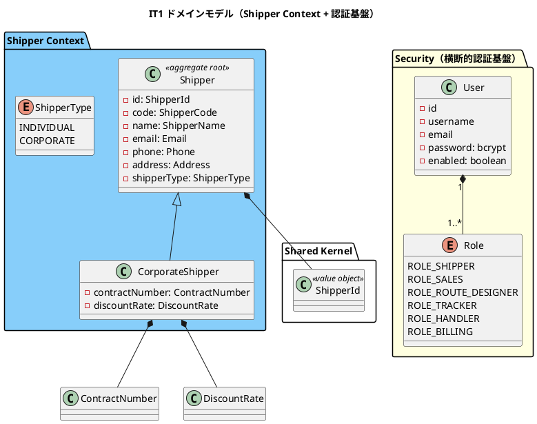
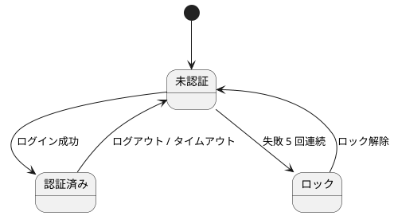
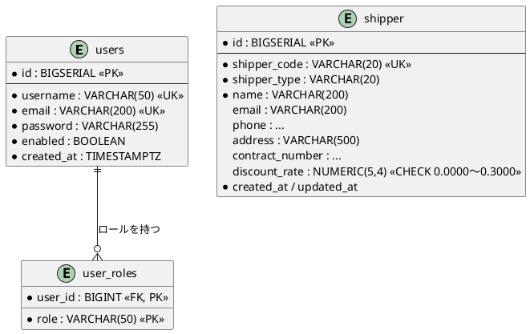
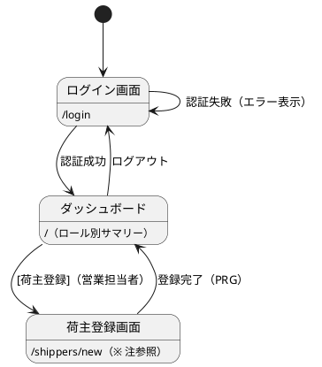

# イテレーション 1 計画

## ゴール

ウォーキングスケルトン（NestJS モジュラーモノリス + TSX SSR + htmx + Kysely + 品質ゲート + CI）を縦切りで一本通し、その骨格の上で **認証（ログイン・ログアウト）** と **荷主登録（個人・法人）** が動く状態にする。序盤局面の狙いどおり、非典型構成（TSX SSR + htmx）の実装リスクを最初の 2 週間で消化する。

- **局面**: 序盤（[開発戦略](development_strategy.md) — アウトサイドイン）
- **期間**: 2026-07-27 〜 2026-08-09（Week 1-2）
- **目標 SP**: 8（基盤構築に工数を割くため抑制。[release_plan.md](release_plan.md) の Note に準拠）

---

## 対象ユーザーストーリー

| ID | ユーザーストーリー | SP | 優先度 | 対応 UC |
| :--- | :--- | :--: | :--- | :--- |
| US26 | システムにログインする | 3 | 必須 | UC20 |
| US27 | システムからログアウトする | 1 | 中 | UC20 |
| US02 | 荷主を登録する | 2 | 必須 | UC02 |
| US03 | 法人荷主を登録する | 2 | 必須 | UC02 |
| **合計** | | **8** | | |

出典: [release_plan.md](release_plan.md) Phase 1（イテレーション 1-2）。

---

## 受入条件（デモ項目 = 受け入れ基準）

序盤はデモ項目を受け入れテスト（Playwright E2E）で束ねる。以下が green であることを DoD とする。

### ウォーキングスケルトン（スケルトン成立の判定基準）

- [ ] 全ルートのプレースホルダ画面へ到達でき、ロール別に表示/非表示/403 が制御される（UI 設計「ロール別画面到達性マトリクス」を正とする Playwright テストが green）
- [ ] `/health` が 200 を返す
- [ ] `npm run verify`（lint / typecheck / arch / test）がパスする

### US26: ログイン

- [ ] 利用者 ID とパスワードでログインできる
- [ ] ログイン成功後、ロールに応じたダッシュボード（`/`）が表示される
- [ ] 認証情報が一致しない場合「利用者 ID またはパスワードが正しくありません」を表示する
- [ ] 認証失敗が 5 回連続するとアカウントが一時ロックされ、利用者に通知される
- [ ] 無効化されたアカウント（`enabled = false`）ではログインできず、管理者への問い合わせが案内される
- [ ] ログイン成功・失敗がログ（pino）に記録される
- [ ] 未ログイン状態で業務機能（追跡照会 US18 を除く）にアクセスするとログイン画面へ誘導される

### US27: ログアウト

- [ ] ログアウト操作でセッションが破棄され、ログイン画面に戻る
- [ ] ログアウト後にブラウザバック等で業務画面へ戻れない
- [ ] ログアウト日時がログに記録される

### US02: 荷主登録（個人）

- [ ] 氏名/社名・住所・連絡先・メールアドレス・荷主種別（個人/法人）を入力できる
- [ ] 同一メールアドレスが既に登録されている場合、既存荷主として表示しどちらを使用するか選択できる（`EmailAlreadyRegisteredError`）
- [ ] 登録完了後、荷主 ID（`ShipperCode` = `SHP-` + UUID 先頭 8 文字）が発行される
- [ ] 荷主種別「個人」で登録できる

### US03: 荷主登録（法人）

- [ ] 荷主種別「法人」を選択すると、法人契約情報（契約番号・割引率）の入力フィールドが表示される（htmx フラグメント差し替え）
- [ ] 割引率は 0〜30%（`0.0000`〜`0.3000`）の範囲で設定できる（境界値: 0 / 30 は許可、-1 / 31 は拒否）
- [ ] 法人荷主で登録完了後、荷主 ID が発行される

---

## タスク分解

理想時間見積り（4-16h 粒度）。序盤アウトサイドイン: 受け入れテスト Red → TSX 画面 → Controller → Application → Domain → Repository → 受け入れ Green。

### T0. ウォーキングスケルトン基盤（[開発戦略](development_strategy.md) の 5 項目）

| # | タスク | 見積 |
| :--- | :--- | :--: |
| T0-1 | `apps/cargo-tracker` の NestJS 雛形・npm workspaces・ディレクトリ規約 `src/contexts/<context>/{domain,application,infrastructure,presentation}` | 6h |
| T0-2 | 横断基盤: DI 組み立て・Passport セッション認証（passport-local）・CSRF・pino ログ・`/health`・TSX レンダリング基盤（`views/render.tsx`・`Layout.tsx`） | 12h |
| T0-3 | UI 設計の画面遷移図に従った全ルートのプレースホルダ画面 + navbar（ロール制御付き） | 8h |
| T0-4 | 品質ゲート: dependency-cruiser・ESLint・Prettier・Vitest・Testcontainers・Playwright・GitHub Actions CI | 10h |
| T0-5 | DB 基盤: node-pg-migrate 初期マイグレーション（`users` / `user_roles` / `shipper`）・pg-mem 起動配線・シード | 8h |

### T1. 認証（US26/US27）

| # | タスク | 見積 |
| :--- | :--- | :--: |
| T1-1 | ログイン画面（`/login`）TSX テンプレート + テンプレートテスト | 4h |
| T1-2 | AuthController（`/login` POST・`/logout`）統合テスト（SSR HTML・PRG リダイレクト） | 6h |
| T1-3 | 認証 Application（資格情報照合・失敗回数カウント・5 回でロック・enabled 判定） | 8h |
| T1-4 | RBAC ガード（6 ロール `ROLE_SHIPPER`/`ROLE_SALES`/`ROLE_ROUTE_DESIGNER`/`ROLE_TRACKER`/`ROLE_HANDLER`/`ROLE_BILLING`）・未認証リダイレクト（US18 公開追跡を除外） | 6h |
| T1-5 | UserRepository（Testcontainers 統合テスト）・bcrypt ハッシュ照合 | 4h |

### T2. 荷主登録（US02/US03）

| # | タスク | 見積 |
| :--- | :--- | :--: |
| T2-1 | 荷主登録画面（フォーム + 法人フィールドの htmx 差し替え）TSX + テンプレートテスト | 6h |
| T2-2 | ShipperController（登録 POST・PRG・Email 重複時の既存荷主表示/選択）統合テスト | 6h |
| T2-3 | Shipper 集約・CorporateShipper・値オブジェクト（`ShipperCode`/`ShipperName`/`Email`/`Phone`/`Address`/`ContractNumber`/`DiscountRate`/`ShipperType`）単体テスト（境界値: 割引率 0/30/31） | 8h |
| T2-4 | RegisterShipper Application（Email 重複チェック・ShipperCode 自動生成）単体テスト（ポートはモック） | 6h |
| T2-5 | ShipperRepository（Testcontainers 統合テスト・`shipper` テーブル・`discount_rate` CHECK 制約） | 4h |

### T3. デモ・回帰

| # | タスク | 見積 |
| :--- | :--- | :--: |
| T3-1 | スケルトン判定 E2E（全ナビゲーション + ロール制御）Playwright | 6h |
| T3-2 | US26/US27/US02/US03 デモ項目 E2E | 6h |

---

## スケジュール

| 週 | 主対象 |
| :--- | :--- |
| Week 1（07-27〜08-02） | T0 ウォーキングスケルトン一式 → スケルトン判定 E2E green |
| Week 2（08-03〜08-09） | T1 認証 → T2 荷主登録 → T3 デモ項目 E2E green・`npm run verify` パス |

---

## 設計（IT1 スコープ）

### ドメインモデル図（Shipper Context / 認証基盤）

出典: [domain-model.md](../design/domain-model.md) 第 2 章 Shipper Context。ビジネスルール: Email 一意（`EmailAlreadyRegisteredError`）・CORPORATE は契約番号/割引率必須・割引率 0.0000〜0.3000・ShipperCode 自動生成。

### 状態遷移図

IT1 の対象（User / Shipper）は業務状態機械を持たない。認証は「未認証 → 認証済み（セッション有効）→ 未認証（ログアウト/タイムアウト）」の単純遷移、アカウントは `enabled` フラグとログイン失敗 5 回による一時ロックのみ。BookingStatus 等の状態遷移は IT2 以降のため本 IT では省略する。

### ER 図（IT1 対象テーブル）

出典: [data-model.md](../design/data-model.md) `users` / `user_roles` / `shipper`。`discount_rate` は `CHECK (discount_rate BETWEEN 0.0000 AND 0.3000)`。

### 画面遷移図（IT1 対象画面）

出典: [ui_design.md](../design/ui_design.md) ログイン画面（`/login`）・ダッシュボード（`/`）。

---

## リスク

| リスク | 影響 | 対策 |
| :--- | :--- | :--- |
| IT1 の基盤構築が超過しストーリーを圧迫 | 高 | 目標 SP を 8 に抑制済み。超過時は US27（1 SP）を IT2 へ繰り越す |
| TSX SSR + htmx の非典型構成による手戻り | 中 | T0-2/T0-3 でスケルトンの SSR 配線・フラグメント分岐を先に検証してから本実装 |
| 荷主登録画面が UI 設計の画面一覧・到達性マトリクスに未定義（下記「注」） | 中 | 本 IT で `/shippers/new` として UI 設計へ反映し、画面一覧・到達性マトリクスに追記する |

---

## 注（設計への反映が必要）

検証（validating-iteration-plan / validating-design）で検出した設計ドキュメント側の欠落・ドリフト。**当該 IT で設計へ反映する**。

1. **荷主登録画面の欠落**: [ui_design.md](../design/ui_design.md) の「画面一覧」「ロール別画面到達性マトリクス」に US02/US03 に対応する荷主登録・荷主一覧画面が存在しない。本計画では `/shippers/new`（営業担当者）を採用し、IT1 で UI 設計に画面行・遷移・到達性（`ROLE_SALES` = ○）を追記する。URL パスが確定次第、本計画も同期する。
2. **設計ドキュメントの他 take 由来ドリフト**: [domain-model.md](../design/domain-model.md) に「IT1 実装状況（2026-04-04 完了）」等の実装済み注記があるが、本 TypeScript take-1 は実装未着手であり日付も計画（IT1 = 2026-07-27〜）と矛盾する。移植元の記述と判断し、本 IT の実装進行に合わせて実状（未実装 → 実装済み）と日付を更新する。

---

## DoD（完了の定義）

- [ ] スケルトン判定 E2E（全ナビゲーション + ロール制御）green
- [ ] US26/US27/US02/US03 のデモ項目 E2E green
- [ ] `npm run verify`（lint / typecheck / arch / test）パス
- [ ] ドメイン層カバレッジ基準を維持（Shipper 集約・値オブジェクト境界値含む）
- [ ] dependency-cruiser グリーン（BC 独立性: Booking は Shipper に直接依存せず ACL 経由 ※ IT1 では Shipper のみ）
- [ ] 上記「注」の設計反映（UI 設計への荷主登録画面追記）を完了
- [ ] 意味のある単位でコミット済み
