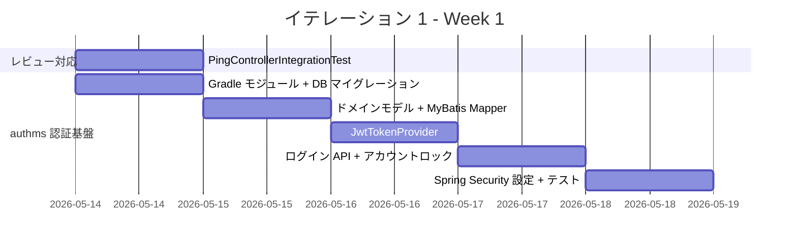
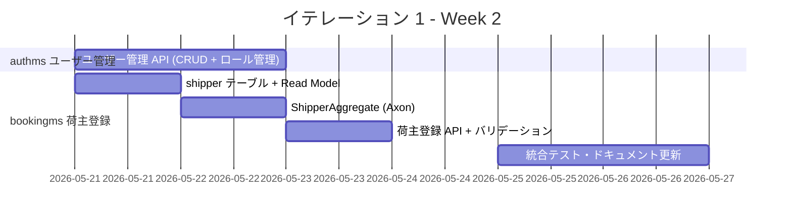
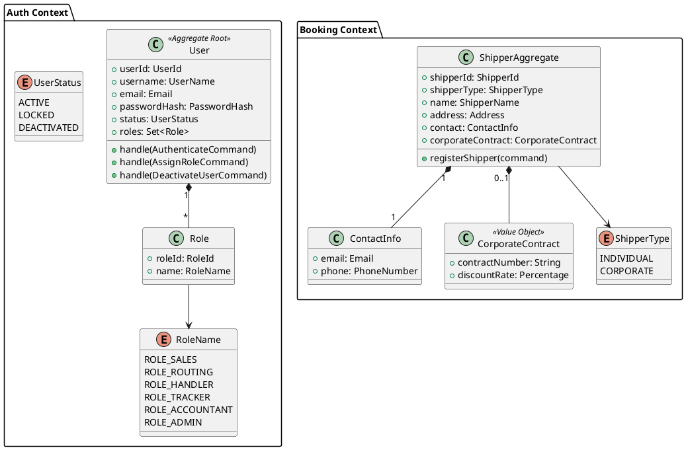
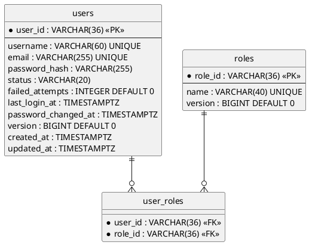
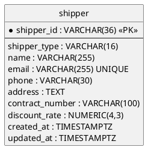
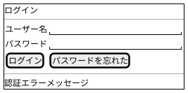
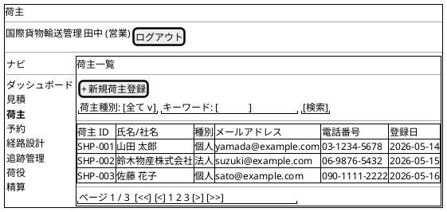
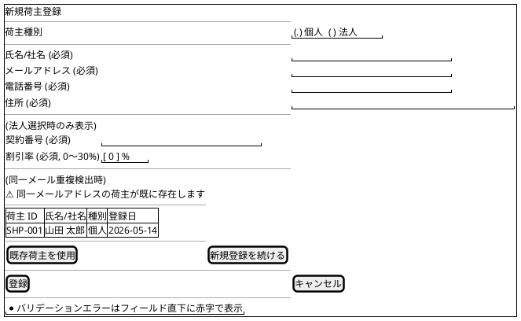
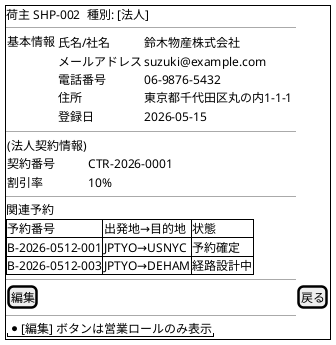
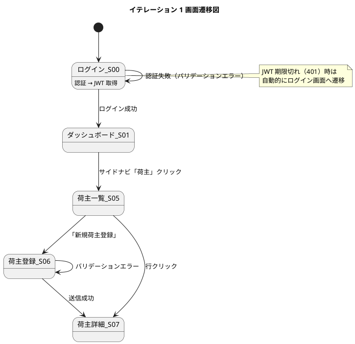

# イテレーション 1 計画

## 概要

| 項目 | 内容 |
|------|------|
| **イテレーション** | 1 |
| **期間** | Week 1-2（2026-05-14 〜 2026-05-27） |
| **ゴール** | JWT 認証基盤（authms）を構築し、荷主登録（bookingms shipper）を実装する |
| **目標 SP** | 16 |

---

## ゴール

### イテレーション終了時の達成状態

1. **認証基盤**: ユーザーが ID・パスワードでログインし、ロール別に保護された API にアクセスできる
2. **ユーザー管理**: 管理者がユーザーアカウントの作成・ロール付与・無効化を行える
3. **荷主登録**: 営業担当者が個人・法人荷主を登録し、荷主 ID を取得できる

### 成功基準

- [ ] `POST /api/v1/auth/login` でログインし JWT トークンを取得できる
- [ ] 無効な認証情報でのログイン失敗が適切にハンドリングされる
- [ ] 5 回連続失敗でアカウントロックが機能する
- [ ] `POST /api/v1/admin/users` で新規ユーザーを作成できる（`ROLE_ADMIN` のみ）
- [ ] `ADR-0004`・`ADR-0005` が作成される
- [ ] `POST /api/v1/shippers` で個人荷主を登録できる（`ROLE_SALES` のみ）
- [ ] `POST /api/v1/shippers` で法人荷主（契約番号・割引率付き）を登録できる
- [ ] 全 API の単体テスト・統合テストがパス（カバレッジ 80% 以上）
- [ ] `BookingApplicationTests` に加え `PingControllerIntegrationTest` がパス（レビュー指摘対応）

---

## ユーザーストーリー

### 対象ストーリー

| ID | ユーザーストーリー | SP | 優先度 |
|----|-------------------|----|--------|
| US00 | システムにログインする | 5 | 必須 |
| US00a | ユーザーアカウントを管理する | 3 | 必須 |
| US02 | 荷主を登録する | 3 | 必須 |
| US03 | 法人荷主を登録する | 3 | 必須 |
| US-UI | UI 実装（ログイン・荷主画面） | 2 | 必須 |
| **合計** | | **16** | |

### ストーリー詳細

#### US00: システムにログインする

**ストーリー**:

> システムユーザー（営業担当者、経路設計者、荷役作業員、追跡管理者、経理担当者、管理者）として、ユーザー ID とパスワードを入力してシステムにログインし、自分のロールに応じた機能を利用したい。なぜなら、業務ロールに応じたアクセス制御により安全に操作できるからだ。

**受入条件**:

1. ユーザー ID とパスワードを入力してログインできる
2. 認証成功時に JWT トークンが発行される（有効期限 1 時間）
3. ログイン後、自分のロール（`ROLE_SALES`・`ROLE_ROUTING`・`ROLE_HANDLER`・`ROLE_TRACKER`・`ROLE_ACCOUNTANT`・`ROLE_ADMIN`）に対応したメニューが表示される
4. 認証失敗時は 401 エラーとメッセージ「ユーザー ID またはパスワードが正しくありません」を返す
5. 5 回連続失敗でアカウントが一時ロックされる
6. ログアウト（トークン無効化）ができる
7. JWT トークン期限切れ時は自動的にログイン画面に遷移する

#### US00a: ユーザーアカウントを管理する

**ストーリー**:

> システム管理者として、ユーザーアカウントの作成・ロール付与・無効化を管理したい。なぜなら、組織変更に伴うアクセス権限を適切に管理しセキュリティを維持できるからだ。

**受入条件**:

1. 新規ユーザー（ユーザー ID・パスワード・表示名・ロール）を作成できる
2. 既存ユーザーにロール（`ROLE_SALES`・`ROLE_ROUTING`・`ROLE_HANDLER`・`ROLE_TRACKER`・`ROLE_ACCOUNTANT`・`ROLE_ADMIN`）を付与・剥奪できる
3. ユーザーアカウントを無効化・再有効化できる
4. 管理者自身のアカウントは無効化できない
5. パスワードは BCrypt でハッシュ化して保存される
6. ユーザー一覧を取得できる

#### US02: 荷主を登録する

**ストーリー**:

> 営業担当者として、新規荷主の氏名・住所・連絡先・メールアドレスをシステムに登録したい。なぜなら、次回以降の予約で荷主情報の再入力を省略でき、顧客情報を一元管理できるからだ。

**受入条件**:

1. 氏名/社名・住所・連絡先・メールアドレス・荷主種別（個人/法人）を入力できる
2. 荷主種別「個人」で登録できる
3. 同一メールアドレスが既に登録されている場合、既存荷主として表示しどちらを使用するか選択できる
4. 登録完了後、荷主 ID（UUID）が発行される

#### US03: 法人荷主を登録する

**ストーリー**:

> 営業担当者として、法人荷主の契約番号と割引率を含めて登録したい。なぜなら、法人契約条件（割引率）を精算時に自動適用できるからだ。

**受入条件**:

1. 荷主種別「法人」を選択すると法人契約情報（契約番号・割引率）の入力が必須になる
2. 割引率は 0〜30% の範囲で設定できる
3. 法人荷主で登録完了後、荷主 ID が発行される

---

## タスク

### 1. Phase 0 レビュー指摘対応（0.5 SP 相当）

| # | タスク | 見積もり | 状態 |
|---|--------|---------|------|
| 1.1 | `PingControllerIntegrationTest` を追加する | 2h | [x] |
| 1.2 | `BookingApplicationTests.contextLoads` に `@DisplayName("Spring コンテキストが正常に起動する")` を追加 | 0.5h | [x] |
| 1.3 | マイクロサービス分割方針 ADR（`docs/adr/0004-microservice-split-strategy.md`）を作成する（レビュー指摘 #2） | 2h | [x] |
| 1.4 | `shared` モジュールの役割 ADR（`docs/adr/0005-shared-module-role.md`）を作成する（レビュー指摘 #3） | 1h | [x] |

**小計**: 5.5h

### 2. authms 認証基盤（US00: 5 SP）

| # | タスク | 見積もり | 状態 |
|---|--------|---------|------|
| 2.1 | `authms` Gradle サブモジュールを作成し `settings.gradle.kts` に追加 | 2h | [x] |
| 2.2 | `users` / `roles` / `user_roles` テーブルの Flyway マイグレーション作成（`auth_db`） | 2h | [x] |
| 2.3 | `User` 集約・`Role` エンティティのドメインモデル実装 | 3h | [x] |
| 2.4 | MyBatis Mapper（`UserMapper` / `RoleMapper`）と Mapper XML 実装 | 3h | [x] |
| 2.5 | `JwtTokenProvider`（発行・検証・無効化）実装 | 4h | [x] |
| 2.6 | `POST /api/v1/auth/login` コントローラー + サービス実装 | 3h | [x] |
| 2.7 | アカウントロック機能（5 回失敗で 30 分ロック）実装 | 2h | [ ] |
| 2.8 | `POST /api/v1/auth/logout` 実装 | 1h | [ ] |
| 2.9 | Spring Security 設定（フィルターチェーン・JWT 検証フィルター） | 3h | [x] |
| 2.10 | 認証系ユニットテスト・統合テスト（Testcontainers PostgreSQL） | 4h | [x] |

**小計**: 27h

### 3. authms ユーザー管理（US00a: 3 SP）

| # | タスク | 見積もり | 状態 |
|---|--------|---------|------|
| 3.1 | `GET/POST /api/v1/admin/users` コントローラー実装 | 3h | [x] |
| 3.2 | `PUT /api/v1/admin/users/{id}/roles` ロール付与・剥奪 API | 2h | [x] |
| 3.3 | `PUT /api/v1/admin/users/{id}/status` 有効化・無効化 API | 2h | [x] |
| 3.4 | 管理者権限チェック（`ROLE_ADMIN` のみ許可）の実装 | 1h | [x] |
| 3.5 | ユーザー管理系ユニットテスト・統合テスト | 3h | [x] |

**小計**: 11h

### 4. bookingms 荷主登録（US02 + US03: 6 SP）

| # | タスク | 見積もり | 状態 |
|---|--------|---------|------|
| 4.1 | `shipper` テーブルの Flyway マイグレーション作成（`booking_read_db`） | 1h | [x] |
| 4.2 | `Shipper` Read Model（`ShipperSummary`）と MyBatis Mapper 実装 | 3h | [x] |
| 4.3 | `RegisterShipperCommand` / `ShipperRegisteredEvent` 定義 | 1h | [ ] |
| 4.4 | `ShipperAggregate` 実装（Axon `@Aggregate` / `@CommandHandler` / `@EventSourcingHandler`） | 4h | [ ] |
| 4.5 | `ShipperProjection`（`@EventHandler` → `shipper` テーブル更新） | 2h | [ ] |
| 4.6 | `POST /api/v1/shippers` コントローラー（個人・法人の分岐） | 3h | [x] |
| 4.7 | 重複メールチェック（`UNIQUE(email)` 制約エラーハンドリング） | 1h | [x] |
| 4.8 | 法人割引率バリデーション（0〜30% 範囲チェック） | 1h | [x] |
| 4.9 | 荷主登録 Axon `AggregateTestFixture` ユニットテスト | 3h | [x] |
| 4.10 | 荷主登録統合テスト（Testcontainers + Axon Server モック） | 3h | [x] |

**小計**: 22h

### 5. フロントエンド UI 実装（US00/US02/US03: 2 SP）

| # | タスク | 対象ファイル | 見積もり | 状態 |
|---|--------|------------|---------|------|
| 5.1 | `apps/frontend` Vite + React プロジェクト初期化（TanStack Query・Zustand・React Router 設定） | `apps/frontend/` | 2h | [x] |
| 5.2 | `api-client.ts` 実装（JWT ヘッダー自動付与・401 時ログイン画面リダイレクト） | `lib/api-client.ts` | 2h | [x] |
| 5.3 | 認証フィーチャー実装（`authApi.ts`・`useAuth.ts`・`authStore.ts`・`LoginForm.tsx`・`LoginPage.tsx`） | `features/auth/`・`pages/LoginPage.tsx` | 4h | [x] |
| 5.4 | 荷主一覧フィーチャー実装（`shipperApi.ts`・`useShippers.ts`・`ShipperList.tsx`・`ShipperListPage.tsx`） | `features/shipper/`・`pages/ShipperListPage.tsx` | 3h | [x] |
| 5.5 | 荷主登録フィーチャー実装（`useRegisterShipper.ts`・`ShipperForm.tsx`（種別切替・重複選択 UI）・`ShipperNewPage.tsx`） | `features/shipper/`・`pages/ShipperNewPage.tsx` | 4h | [x] |
| 5.6 | 荷主詳細フィーチャー実装（`ShipperDetail.tsx`・`ShipperDetailPage.tsx`） | `features/shipper/`・`pages/ShipperDetailPage.tsx` | 2h | [x] |
| 5.7 | 共通レイアウト実装（`AppLayout.tsx`・`AuthLayout.tsx`・`Sidebar`・ロール別メニュー表示制御） | `layouts/`・`components/layout/` | 2h | [x] |
| 5.8 | フロントエンド E2E テスト（ログイン〜荷主登録フロー） | `e2e/` | 3h | [ ] |

**小計**: 22h

### タスク合計

| カテゴリ | SP | 理想時間 | 状態 |
|---------|-----|---------|------|
| Phase 0 レビュー対応 | - | 5.5h | [ ] |
| US00 認証ログイン | 5 | 27h | [ ] |
| US00a ユーザー管理 | 3 | 11h | [ ] |
| US02/US03 荷主登録 | 6 | 22h | [ ] |
| UI 実装（US00/US02/US03） | 2 | 22h | [ ] |
| **合計** | **16** | **87.5h** | |

**1 SP あたり**: 約 5.5h（16 SP × 5.5h ≒ 87.5h ≒ 2 週間 × 5 日 × 8.75h）

> **注**: スケジュールバッファとして Day 10 に 4h を確保済み。UI タスク（5.7・5.8）は並行実施可能。超過の場合は 5.8（E2E テスト）を IT2 に持ち越す。

> **依存関係注記**: US00（認証基盤）の完成（Week 1 終了目安）が US02/US03 の受け入れテスト実施の前提となる。US02/US03 の受け入れ検証は Week 2 以降に実施する。

**進捗率**: 約 75%（12/16 SP 相当）

---

## スケジュール

### Week 1（Day 1-5: 2026-05-14〜05-20）



| 日 | タスク |
|----|--------|
| Day 1（05-14） | レビュー対応（PingControllerTest）/ authms Gradle モジュール作成 / DB マイグレーション |
| Day 2（05-15） | `User` ドメインモデル / `UserMapper` / `RoleMapper` 実装 |
| Day 3（05-16） | `JwtTokenProvider`（発行・検証・無効化）実装 |
| Day 4（05-17） | `POST /auth/login` + アカウントロック機能 |
| Day 5（05-19） | Spring Security フィルター設定 / 認証系テスト |

### Week 2（Day 6-10: 2026-05-21〜05-27）



| 日 | タスク |
|----|--------|
| Day 6（05-21） | ユーザー管理 API（CRUD）/ shipper テーブルマイグレーション |
| Day 7（05-22） | ロール付与・無効化 API / `ShipperAggregate` 実装 |
| Day 8（05-23） | `ShipperProjection` / `POST /api/v1/shippers` コントローラー |
| Day 9（05-26） | 荷主登録テスト（AggregateTestFixture + Testcontainers） |
| Day 10（05-27） | 統合テスト・バグ修正・ドキュメント更新・デモ準備 |

---

## 設計

### ドメインモデル



### データモデル（authms: auth_db）



### データモデル（bookingms: booking_read_db）



### ユーザーインターフェース

#### ビュー

| ID | 画面名 | パス | 備考 |
|----|--------|------|------|
| S00 | ログイン | `/login` | `ui_design.md` 定義済み。JWT 取得・ローカルストレージ保存・エラー表示 |
| S05 | 荷主一覧 | `/shippers` | 今回追加定義。コレクションビュー（検索フィルター・ページネーション） |
| S06 | 荷主登録 | `/shippers/new` | 今回追加定義。法人種別の動的切替・重複メール選択 UI |
| S07 | 荷主詳細 | `/shippers/:id` | 今回追加定義。シングルビュー（営業ロールのみ編集可） |

##### S00: ログイン



##### S05: 荷主一覧（コレクションビュー）



##### S06: 荷主登録（フォームビュー）



##### S07: 荷主詳細（シングルビュー）



#### インタラクション（画面遷移図）



#### フィードバックメッセージ

| 操作 | メッセージ | スタイル |
|------|-----------|---------|
| ログイン成功 | 「ようこそ、{氏名} さん」 | alert-success |
| 認証失敗 | 「ユーザー ID またはパスワードが正しくありません」 | alert-danger |
| アカウントロック | 「アカウントがロックされています。30 分後に再試行してください」 | alert-warning |
| JWT 期限切れ | 「セッションが切れました。再ログインしてください」 | alert-warning |
| 荷主登録完了 | 「荷主を登録しました（ID: {shipperId}）」 | alert-success |
| メール重複検出 | 「同一メールアドレスの荷主が既に存在します」 | alert-warning |
| 登録バリデーションエラー | フィールド直下に赤字エラーメッセージ | inline |

### API 設計

| メソッド | エンドポイント | 説明 | 認可 |
|---------|---------------|------|------|
| `POST` | `/api/v1/auth/login` | ログイン（JWT 発行） | Public |
| `POST` | `/api/v1/auth/logout` | ログアウト（トークン無効化） | 認証済み |
| `GET` | `/api/v1/admin/users` | ユーザー一覧取得 | `ROLE_ADMIN` |
| `POST` | `/api/v1/admin/users` | ユーザー作成 | `ROLE_ADMIN` |
| `PUT` | `/api/v1/admin/users/{id}/roles` | ロール付与・剥奪 | `ROLE_ADMIN` |
| `PUT` | `/api/v1/admin/users/{id}/status` | アカウント有効化・無効化 | `ROLE_ADMIN` |
| `POST` | `/api/v1/shippers` | 荷主登録（個人・法人） | `ROLE_SALES` |

### ディレクトリ構成

#### バックエンド

```
apps/backend/
├── authms/
│   └── src/main/java/com/example/cargotracker/authms/
│       ├── AuthApplication.java
│       ├── domain/
│       │   ├── model/User.java
│       │   ├── model/Role.java
│       │   └── model/RoleName.java
│       ├── application/
│       │   ├── AuthService.java
│       │   └── UserManagementService.java
│       ├── infrastructure/
│       │   ├── persistence/UserMapper.java
│       │   ├── persistence/RoleMapper.java
│       │   └── security/JwtTokenProvider.java
│       └── interfaces/rest/
│           ├── AuthController.java
│           └── UserManagementController.java
└── bookingms/
    └── src/main/java/com/example/cargotracker/bookingms/
        ├── domain/
        │   └── aggregate/ShipperAggregate.java
        ├── application/command/RegisterShipperCommand.java
        ├── application/event/ShipperRegisteredEvent.java
        ├── infrastructure/projection/ShipperProjection.java
        └── interfaces/rest/ShipperController.java
```

#### フロントエンド

```
apps/frontend/
└── src/
    ├── components/
    │   ├── ui/              # Button, Input, Modal, Table など共通パーツ
    │   └── layout/          # Header, Sidebar
    ├── config/
    │   ├── constants.ts
    │   ├── env.ts
    │   └── api.ts           # API エンドポイント定義
    ├── features/
    │   ├── auth/            # 認証（US00）
    │   │   ├── api/
    │   │   │   └── authApi.ts        # POST /auth/login, /auth/logout
    │   │   ├── components/
    │   │   │   └── LoginForm.tsx     # S00 ログインフォーム
    │   │   ├── hooks/
    │   │   │   └── useAuth.ts        # JWT 管理・ログイン/ログアウト
    │   │   └── types/
    │   │       └── auth.types.ts
    │   └── shipper/         # 荷主管理（US02/US03）
    │       ├── api/
    │       │   └── shipperApi.ts     # POST /shippers, GET /shippers
    │       ├── components/
    │       │   ├── ShipperList.tsx   # S05 荷主一覧テーブル
    │       │   ├── ShipperForm.tsx   # S06 荷主登録フォーム（種別切替・重複選択 UI）
    │       │   └── ShipperDetail.tsx # S07 荷主詳細
    │       ├── hooks/
    │       │   ├── useShippers.ts    # GET /shippers（TanStack Query）
    │       │   └── useRegisterShipper.ts # POST /shippers（useMutation）
    │       └── types/
    │           └── shipper.types.ts
    ├── layouts/
    │   ├── AppLayout.tsx    # サイドナビ + ヘッダー共通レイアウト
    │   └── AuthLayout.tsx   # ログイン画面専用レイアウト
    ├── lib/
    │   ├── api-client.ts    # fetch ラッパー（JWT ヘッダー自動付与・401 自動遷移）
    │   └── auth.ts          # 認証ライブラリ設定
    ├── pages/
    │   ├── LoginPage.tsx         # /login (S00)
    │   ├── ShipperListPage.tsx   # /shippers (S05)
    │   ├── ShipperNewPage.tsx    # /shippers/new (S06)
    │   └── ShipperDetailPage.tsx # /shippers/:id (S07)
    ├── providers/
    │   ├── AuthProvider.tsx
    │   └── AppProviders.tsx
    ├── stores/
    │   └── authStore.ts     # Zustand: JWT・ユーザー情報・ロール
    └── types/
        ├── api.ts
        └── common.ts
```

### ADR

| ADR | タイトル | ステータス |
|-----|---------|-----------|
| [ADR-0001](../adr/0001-axon-framework-adoption.md) | Axon Framework 採用 | 承認 |
| [ADR-0002](../adr/0002-mybatis-adoption.md) | MyBatis 採用 | 承認 |
| [ADR-0003](../adr/0003-phase0-skeleton.md) | Phase 0 Walking Skeleton | 承認 |
| ADR-0004（IT1 で作成予定） | マイクロサービス分割方針 | 提案中 |
| ADR-0005（IT1 で作成予定） | shared モジュールの役割 | 提案中 |

---

## リスクと対策

| リスク | 影響度 | 対策 |
|--------|--------|------|
| authms の Axon Server 依存（Token Store / Saga Store が JDBC ベース） | 中 | `authms` は Event Sourcing 不使用のため Axon 依存は最小限。Axon の JDBC Token Store のみ設定 |
| Spring Boot 4.x + Spring Security 7.x の API 変更 | 中 | 公式マイグレーションガイドと Spring Boot 4.0.6 リリースノートを参照して実装 |
| Axon Server が起動していないとテストが失敗する | 高 | authms は Axon Server なし（CRUD のみ）。bookingms のテストは `@MockBean` または Embedded Axon で対処 |
| ShipperAggregate の Event Sourcing 実装コスト超過 | 中 | Day 8 で予定どおりに進まない場合、US02/US03 を Read Model のみ（CRUD）に切り替えてベロシティを確保 |
| ArchUnit アーキテクチャテスト未導入（レビュー中優先度 #4） | 低 | IT1 内での導入を目指すが、工数超過の場合は IT2 に持ち越す。リスクテーブルに明記し、タスク 2.10 の統合テスト作業に含める形で対応を検討する |

---

## 完了条件

### Definition of Done

- [ ] コードレビュー完了（セルフレビュー）
- [ ] ユニットテスト（`AggregateTestFixture`・`MockMvc`）がパス
- [ ] 統合テスト（Testcontainers PostgreSQL）がパス
- [ ] テストカバレッジ 80% 以上
- [ ] Checkstyle / SpotBugs エラーなし
- [ ] 実装した API が `local-docker` プロファイルで動作確認済み
- [ ] Swagger UI で全 API が確認できる
- [ ] フロントエンド E2E テスト（ログイン〜荷主登録フロー）がパス
- [ ] 画面（S00/S05/S06/S07）が `local-docker` プロファイルで動作確認済み
- [ ] ADR-0004・ADR-0005 が作成済み
- [ ] ドキュメント（本ファイル）の状態更新完了

### デモ項目

1. `POST /api/v1/auth/login` でログインし JWT トークンを取得する（API）
2. JWT を使って `ROLE_SALES` 権限の API にアクセスできることを確認する
3. 無効な認証情報で 401 エラーが返ることを確認する
4. 管理者として新規ユーザーを作成し、ロールを付与する
5. `POST /api/v1/shippers` で個人荷主を登録し、荷主 ID を取得する（API）
6. 同じメールアドレスで登録すると既存荷主が表示され選択できることを確認する
7. 法人荷主（割引率 15%）を登録できることを確認する
8. ログイン画面（S00）でユーザー名・パスワードを入力しログインできる（UI）
9. 荷主一覧画面（S05）で登録済み荷主の一覧が表示・検索できる（UI）
10. 荷主登録画面（S06）で個人・法人荷主を登録し、詳細画面（S07）に遷移する（UI）
11. JWT 期限切れ時にログイン画面に自動遷移することを確認する（UI）

---

## 更新履歴

| 日付 | 更新内容 | 更新者 |
|------|---------|--------|
| 2026-05-13 | 初版作成 | AI Agent |
| 2026-05-13 | 整合性検証により修正（受入条件・ドメインモデル・データモデル・ADR タスク追加） | AI Agent |
| 2026-05-13 | UI 設計セクション追加・フロントエンドタスク追加（ストーリー 5: 2 SP） | AI Agent |
| 2026-05-13 | 第 2 回整合性検証による修正（ストーリー文・受入条件・ドメインモデル・データモデル・DoD・デモ項目を修正） | AI Agent |
| 2026-05-13 | フロントエンドディレクトリ構成追加・タスク 5 を 8 タスクに詳細化（`apps/frontend/src/` 構成準拠） | AI Agent |

---

## 関連ドキュメント

- [リリース計画](./release_plan.md)
- [ユーザーストーリー](../requirements/user_story.md)
- [バックエンドアーキテクチャ](../design/architecture_backend.md)
- [データモデル](../design/data-model.md)
- [イテレーション 1 ふりかえり](./retrospective-1.md)
