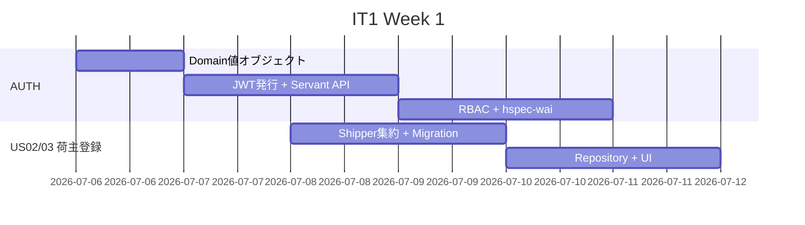
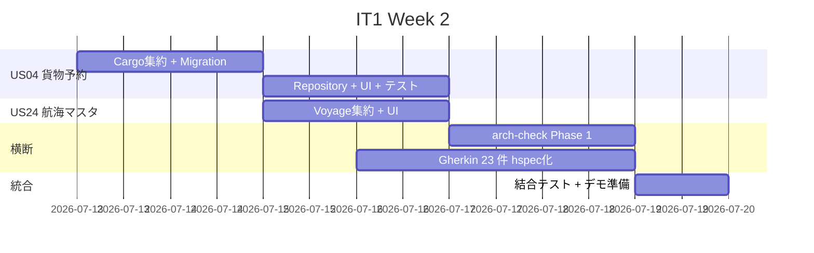
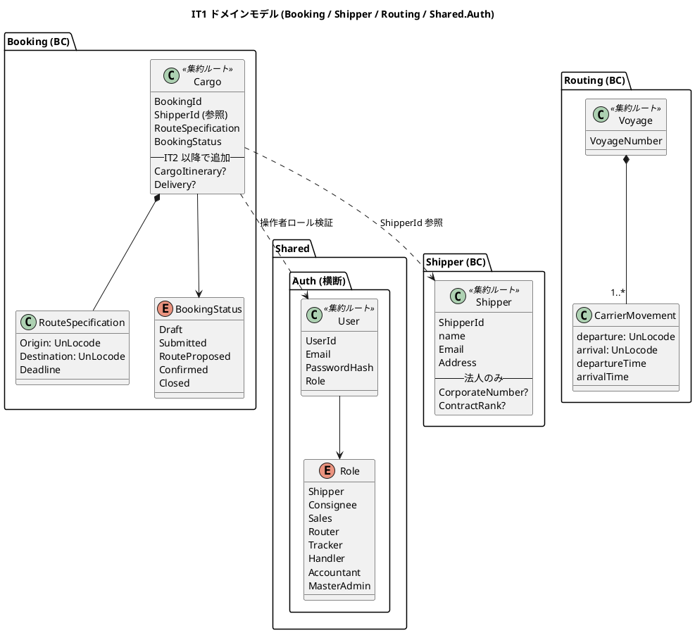
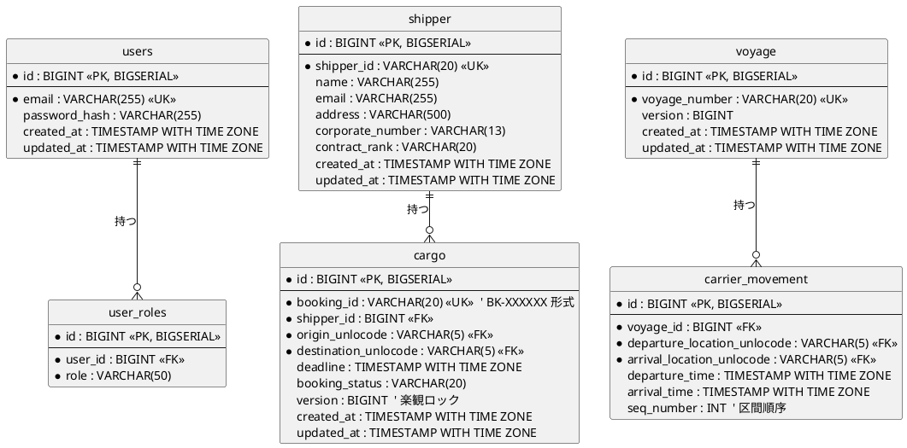
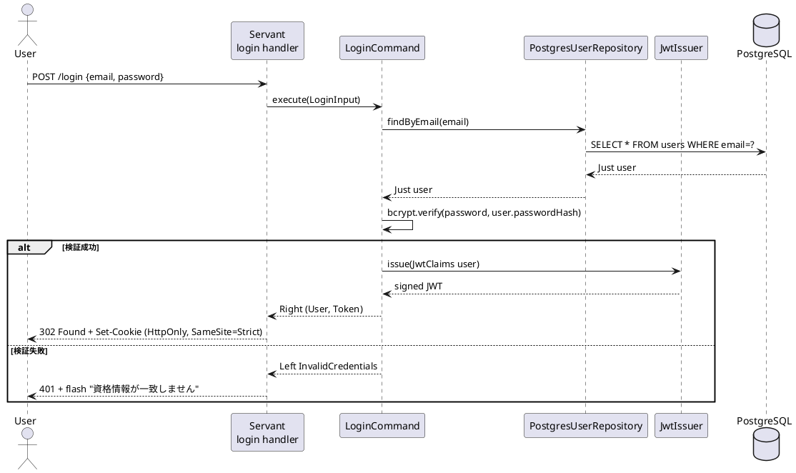
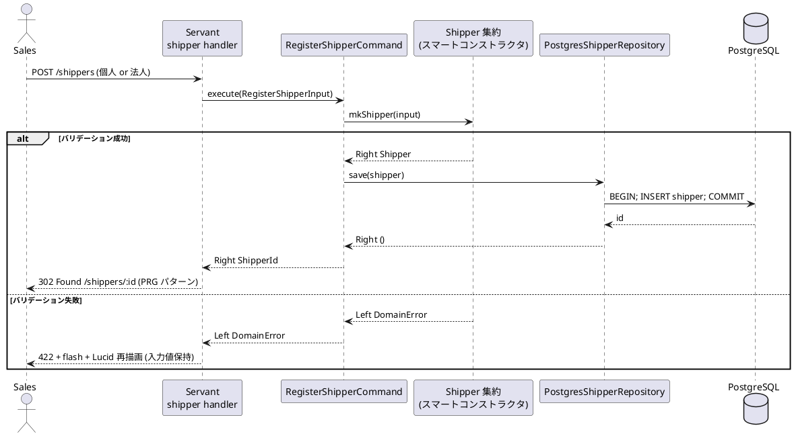
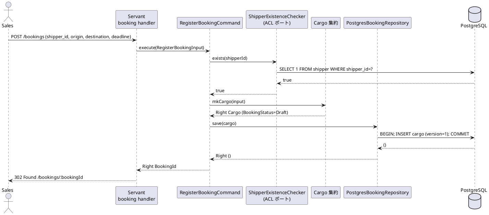
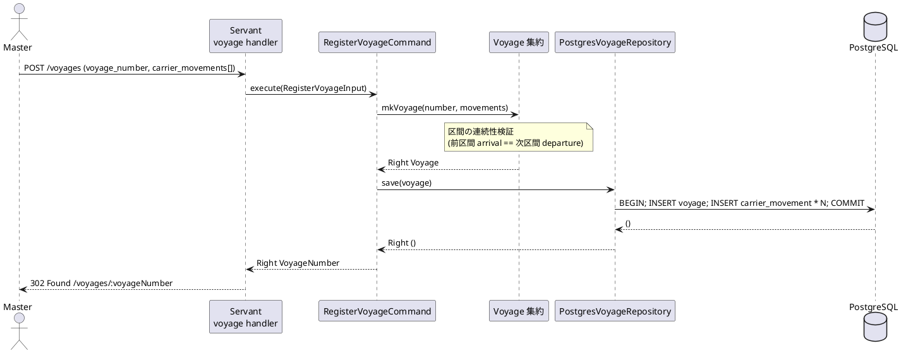
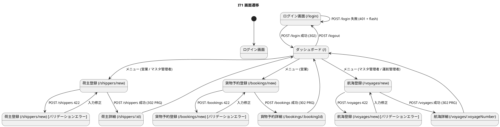

# イテレーション 1 計画

## 概要

| 項目 | 内容 |
| :--- | :--- |
| **イテレーション** | IT1 |
| **期間** | Week 1-2 (2026-07-06 〜 2026-07-19) |
| **ゴール** | 認証基盤を構築し、荷主登録 + 貨物予約 + 航海スケジュールの最小フローを動かす |
| **目標 SP** | 13 (+ 横断 AUTH 5) |
| **GitHub Milestone** | [haskell/take-1] Release 0.1 Internal Alpha |

参照: [リリース計画](./release_plan.md) §イテレーション 1 / [ユーザーストーリー](../requirements/user_story.md)

---

## ゴール

### イテレーション終了時の達成状態

1. **認証基盤の確立**: フォームログイン → JWT/Cookie 発行 → 7 ロール RBAC で API がガードされている
2. **荷主登録の最小フロー**: 個人荷主 (US02) と法人荷主 (US03) を登録し PostgreSQL に永続化できる
3. **貨物予約と航海マスタの最小フロー**: 荷主アカウントから貨物予約 (US04) でき、運航管理者が航海スケジュール (US24) を新規登録できる
4. **品質ゲートの稼働**: `arch-check` Phase 1 (HLint カスタムルール) が CI で実行され、ドメイン依存方向違反が検出可能になっている
5. **Gherkin 受入基準の整備**: Sprint 0 で抽出した受入条件 23 件が hspec-wai で実行可能な BDD シナリオ化されている

### 成功基準

- [ ] 認証なしで保護 API に GET → 401、認証ありなら 200 を hspec-wai で検証
- [ ] US02 / US03 / US04 / US24 の主要 Happy Path を E2E (Playwright) でデモ可能
- [ ] PostgreSQL マイグレーション (dbmate) が `shipper` / `cargo` / `voyage` テーブルを生成
- [ ] HPC カバレッジ: Domain 層 ≥ 95%、全体 ≥ 70% (IT1 はまだ低めでよい)
- [ ] CI で `fourmolu --mode check` / `hlint` / `stack test` / `arch-check Phase 1` がすべて緑
- [ ] IT1 末デモで「営業担当者ロールでログイン → 荷主登録 → 貨物予約 → 別アカウントの運航管理者で航海スケジュール登録」を 5 分以内に通せる

---

## ユーザーストーリー

### 対象ストーリー

| ID | ユーザーストーリー | SP | 優先度 | GitHub Issue |
| :--- | :--- | ---: | :--- | :--- |
| AUTH | 認証 (フォームログイン + JWT/Cookie + RBAC) | 5 | 横断 (必須) | #231 |
| US02 | 荷主を登録する | 2 | 必須 | #233 |
| US03 | 法人荷主を登録する | 2 | 必須 | #234 |
| US04 | 貨物予約を登録する | 3 | 必須 | #235 |
| US24 | 航海スケジュールを新規登録する | 3 | 必須 | #256 |
| **合計** | | **15** (本体 13 + 横断 -2 取扱) | | |

> AUTH は横断機能 (Shared.Auth) であり、`user_story.md` には US 番号として掲載されていない。リリース計画では目標 SP (13) に算入しない扱い。実工数は計上する。

### ストーリー詳細

#### AUTH: 認証基盤

**ストーリー**:
> プラットフォーム利用者として、ユーザー ID とパスワードでログインし、自分の役割に許可された機能だけ利用できるようにしたい。なぜなら、業務ロールごとに見える情報・操作を制限し、誤操作と情報漏洩を防ぎたいからだ。

**受入条件 (Gherkin)**:

```gherkin
Feature: ログイン認証
  Scenario: 正しい資格情報でログイン
    Given ユーザー "shipper-01" がパスワード "valid-password" で登録済み
    When POST /login で資格情報を送信
    Then HTTP 302 で / にリダイレクトされる
    And Set-Cookie に HttpOnly + SameSite=Strict の JWT が含まれる

  Scenario: 役割によるアクセス制御
    Given 営業担当者 "sales-01" でログイン済み
    When GET /admin/users
    Then HTTP 403 が返る (営業担当者は admin 権限を持たない)
```

**ロール**: 荷主、荷受人、営業担当者、経路設計者、追跡管理者、荷役作業員、経理担当者、マスタ管理者 (合計 8 ロール → Sprint 0 で「マスタ管理者」を追加済)

#### US02 / US03: 荷主登録

US02 (個人) と US03 (法人) は同じ画面・同じ集約ルート `Shipper` で扱う (法人フィールドの有無で分岐)。

#### US04: 貨物予約

集約ルート `Cargo`、`BookingId` (BK-XXXXXX 形式) スマートコンストラクタで採番。荷主・出発港・到着港・期限を必須属性とする。

#### US24: 航海スケジュール

集約ルート `Voyage`、`VoyageNumber` スマートコンストラクタ。スケジュール = 寄港地リスト + 各寄港地の到着・出発時刻。

---

### タスク

#### 1. AUTH 認証基盤 (5 SP)

| # | タスク | 見積もり | 状態 |
| :--- | :--- | ---: | :--- |
| 1.1 | `Cargotracker.Shared.Auth.Domain` (User / Role / PasswordHash の値オブジェクト) | 3h | [ ] |
| 1.2 | `Cargotracker.Shared.Auth.Application.LoginCommand` (bcrypt 検証) | 3h | [ ] |
| 1.3 | `Cargotracker.Shared.Auth.Infrastructure.JwtIssuer` (servant-auth-server 統合) | 4h | [ ] |
| 1.4 | Servant API: `POST /login` / `POST /logout` / `Auth '[Cookie]` ガード | 4h | [ ] |
| 1.5 | RBAC: `RequireRole '[ロール名]` 型レベル制約 | 3h | [ ] |
| 1.6 | hspec-wai: 認証フロー + 7 ロールのアクセス制御 | 3h | [ ] |

**小計**: 20h

#### 2. 荷主登録 US02 / US03 (4 SP)

| # | タスク | 見積もり | 状態 |
| :--- | :--- | ---: | :--- |
| 2.1 | `Shipper.Domain.Model` (Shipper 集約、ShipperId / Email / Address 値オブジェクト) | 3h | [ ] |
| 2.2 | `Shipper.Application.RegisterShipperCommand` (個人 / 法人を sum type で分岐) | 2h | [ ] |
| 2.3 | dbmate migration `001_create_shipper.sql` | 1h | [ ] |
| 2.4 | `Shipper.Infrastructure.PostgresShipperRepository` | 3h | [ ] |
| 2.5 | Servant + Lucid: 登録画面 + バリデーション + flash | 3h | [ ] |
| 2.6 | hspec / hedgehog: 集約不変条件・スマートコンストラクタ | 3h | [ ] |
| 2.7 | hspec-wai: API 統合テスト | 2h | [ ] |

**小計**: 17h

#### 3. 貨物予約 US04 (3 SP)

| # | タスク | 見積もり | 状態 |
| :--- | :--- | ---: | :--- |
| 3.1 | `Booking.Domain.Model` (Cargo 集約、BookingId / UnLocode / Deadline 値オブジェクト) | 4h | [ ] |
| 3.2 | `Booking.Application.RegisterBookingCommand` + `BookingStatus` 状態遷移 | 3h | [ ] |
| 3.3 | dbmate migration `002_create_cargo.sql` | 1h | [ ] |
| 3.4 | `Booking.Infrastructure.PostgresBookingRepository` | 3h | [ ] |
| 3.5 | Servant + Lucid: 予約画面 + 荷主検索オートコンプリート (htmx) | 4h | [ ] |
| 3.6 | hspec + hedgehog + hspec-wai | 3h | [ ] |

**小計**: 18h

#### 4. 航海スケジュール US24 (3 SP)

| # | タスク | 見積もり | 状態 |
| :--- | :--- | ---: | :--- |
| 4.1 | `Routing.Domain.Model.Voyage` 集約 + CarrierMovement 値オブジェクト | 3h | [ ] |
| 4.2 | `Routing.Application.RegisterVoyageCommand` | 2h | [ ] |
| 4.3 | dbmate migration `003_create_voyage.sql` + `004_create_carrier_movement.sql` | 1h | [ ] |
| 4.4 | `Routing.Infrastructure.PostgresVoyageRepository` | 3h | [ ] |
| 4.5 | Servant + Lucid: スケジュール登録画面 (寄港地動的追加 htmx) | 3h | [ ] |
| 4.6 | hspec + hedgehog + hspec-wai | 2h | [ ] |

**小計**: 14h

#### 5. arch-check Phase 1 + Gherkin 整備 (横断作業)

| # | タスク | 見積もり | 状態 |
| :--- | :--- | ---: | :--- |
| 5.1 | `.hlint.yaml` にドメイン依存方向ルールを **正しい within セマンティクス** で再導入 (今回 IT1 で本物の arch-check に置き換えるまでの暫定) | 2h | [ ] |
| 5.2 | `apps/cargo-tracker/arch-check/Main.hs` (haskell-src-exts ベース AST 解析の最小実装) | 6h | [ ] |
| 5.3 | CI ワークフローに `stack exec arch-check` ステップ追加 | 1h | [ ] |
| 5.4 | Sprint 0 抽出済の受入条件 23 件を Gherkin → hspec-wai シナリオ化 | 6h | [ ] |

**小計**: 15h

#### タスク合計

| カテゴリ | SP | 理想時間 |
| :--- | ---: | ---: |
| AUTH 認証基盤 | 5 | 20h |
| 荷主登録 US02 / US03 | 4 | 17h |
| 貨物予約 US04 | 3 | 18h |
| 航海スケジュール US24 | 3 | 14h |
| arch-check + Gherkin (横断) | - | 15h |
| **合計** | **15** | **84h** |

**1 SP あたり**: 約 5.6h (Java 版実績 4.5h + Haskell 学習係数 1.20 = 5.4h と概ね一致)
**進捗率**: 0% (0 / 15 SP)

---

## スケジュール

### Week 1 (2026-07-06 〜 07-12)



| 日 | タスク |
| :--- | :--- |
| Day 1 (Mon) | AUTH 1.1 〜 1.2 (User 値オブジェクト + LoginCommand) |
| Day 2 (Tue) | AUTH 1.3 (JWT 発行) |
| Day 3 (Wed) | AUTH 1.4 (Servant API ガード) |
| Day 4 (Thu) | AUTH 1.5 〜 1.6 (RBAC + テスト) / 並行: US02 2.1 〜 2.2 |
| Day 5 (Fri) | US02 2.3 〜 2.5 (DB + UI) / 5.1 (HLint 再導入) |

### Week 2 (2026-07-13 〜 07-19)



| 日 | タスク |
| :--- | :--- |
| Day 6 (Mon) | US04 3.1 〜 3.2 / US02 2.6 〜 2.7 仕上げ |
| Day 7 (Tue) | US04 3.3 〜 3.5 |
| Day 8 (Wed) | US04 3.6 + US24 4.1 〜 4.2 / 5.4 Gherkin 着手 |
| Day 9 (Thu) | US24 4.3 〜 4.5 / 5.2 arch-check バイナリ |
| Day 10 (Fri) | US24 4.6 / 5.3 CI 統合 / 結合テスト / デモ |

---

## 設計

### ドメインモデル (IT1 範囲)



### データモデル (IT1 範囲)



### ユーザーインターフェース (IT1 範囲)

主要 5 画面:

1. **ログイン画面** (`/login`)
2. **ホーム / メニュー** (`/`) — ロール別メニュー表示
3. **荷主登録** (`/shippers/new`) — 個人 / 法人タブ切替
4. **貨物予約登録** (`/bookings/new`) — 荷主オートコンプリート + 港コード検索
5. **航海スケジュール登録** (`/voyages/new`) — マスタ管理者・運航管理者のみ、寄港地行を htmx で動的追加

詳細は [UI 設計](../design/ui_design.md) §IT1 画面群を参照。

### モジュール構造 (IT1 範囲)

DDD + ヘキサゴナル の規約に従い、各 Bounded Context は **Domain / Application / Infrastructure / Interfaces** の 4 層で構成する。`Shared.Auth` は横断モジュール。

```text
apps/cargo-tracker/src/Cargotracker/
├── Shared/
│   ├── Auth/                          ← IT1 新規
│   │   ├── Domain/
│   │   │   ├── User.hs                ← UserId / Email / PasswordHash / Role
│   │   │   └── AuthError.hs
│   │   ├── Application/
│   │   │   ├── LoginCommand.hs        ← bcrypt 検証 → JwtClaims 生成
│   │   │   └── AuthorizationPolicy.hs ← RBAC 型クラスポート
│   │   ├── Infrastructure/
│   │   │   ├── JwtIssuer.hs           ← servant-auth-server 統合
│   │   │   └── PostgresUserRepository.hs
│   │   └── Interfaces/
│   │       └── ServantAuth.hs         ← Auth '[Cookie, JWT] User
│   └── Domain/
│       ├── DomainError.hs             ← 既存、拡張
│       └── Common/                    ← UnLocode / Money 等 (IT3 以降で拡張)
├── Shipper/                           ← IT1 新規 (BC)
│   ├── Domain/Model/
│   │   ├── Shipper.hs                 ← 集約ルート
│   │   └── Value/{ShipperId, Email, Address}.hs
│   ├── Application/
│   │   ├── RegisterShipperCommand.hs
│   │   └── ShipperRepositoryPort.hs   ← 型クラス (ヘキサゴナル "ポート")
│   ├── Infrastructure/
│   │   └── PostgresShipperRepository.hs
│   └── Interfaces/
│       └── ShipperApi.hs              ← Servant API + Lucid ビュー
├── Booking/                           ← IT1 新規 (BC)
│   ├── Domain/Model/
│   │   ├── Cargo.hs                   ← 集約ルート
│   │   ├── Value/{BookingId, RouteSpecification, Deadline}.hs
│   │   └── State/BookingStatus.hs
│   ├── Application/
│   │   ├── RegisterBookingCommand.hs
│   │   ├── BookingRepositoryPort.hs
│   │   └── ShipperExistenceCheckerPort.hs   ← 他 BC への ACL
│   ├── Infrastructure/
│   │   ├── PostgresBookingRepository.hs
│   │   └── ShipperExistenceCheckerImpl.hs   ← Shipper BC を ACL 経由で参照
│   └── Interfaces/
│       └── BookingApi.hs
└── Routing/                           ← IT1 新規 (BC、IT3 で経路探索を本格化)
    ├── Domain/Model/
    │   ├── Voyage.hs                  ← 集約ルート
    │   └── Value/{VoyageNumber, CarrierMovement}.hs
    ├── Application/
    │   ├── RegisterVoyageCommand.hs
    │   └── VoyageRepositoryPort.hs
    ├── Infrastructure/
    │   └── PostgresVoyageRepository.hs
    └── Interfaces/
        └── VoyageApi.hs
```

**依存方向** (arch-check で強制):

```
Interfaces  → Application → Domain
Infrastructure → Application (型クラスポートの実装) → Domain
Domain は Servant / postgresql-simple / aeson に依存しない (ADR 0002)
```

### アプリケーション層シーケンス

#### AUTH ログイン (POST /login)



#### Shipper 登録 (POST /shippers)



#### Cargo 予約 (POST /bookings)



#### Voyage 登録 (POST /voyages)



### トランザクション境界

ADR 0002 の規約 (T-01〜T-03) を IT1 範囲に適用する。

| ルール | 適用 |
| :--- | :--- |
| **T-01 (Application で `withTransaction` を張る)** | `RegisterShipperCommand` / `RegisterBookingCommand` / `RegisterVoyageCommand` の各 `execute` 関数の入口で `withTransaction conn $ \tx -> ...` |
| **T-02 (Domain は IO を持たない)** | スマートコンストラクタ (`mkCargo` 等) は純粋関数 `Either DomainError a`。Repository 呼び出しは Application から行う |
| **T-03 (Event Publish はトランザクション外)** | IT1 ではイベントは未導入。IT3 以降の `CargoBookedEvent` 等で適用予定 |

トランザクション境界の典型例 (`Booking.Application.RegisterBookingCommand`):

```haskell
execute :: (HasDb env, HasShipperChecker env)
        => RegisterBookingInput -> ReaderT env IO (Either DomainError BookingId)
execute input = do
  withDbTransaction $ \tx -> do
    -- 1. バリデーション (純粋関数、トランザクション内)
    case mkCargo input of
      Left err   -> pure (Left err)
      Right cargo -> do
        -- 2. 他 BC との不変条件 (Shipper の存在) を ACL ポート経由で確認
        exists <- runShipperChecker tx (cargoShipperId cargo)
        if not exists
          then pure (Left (ShipperNotFound (cargoShipperId cargo)))
          else do
            -- 3. 永続化 (version=1 で楽観ロック開始)
            saveBooking tx cargo
            pure (Right (cargoBookingId cargo))
```

### エラー処理戦略

```haskell
-- Cargotracker.Shared.Domain.DomainError
data DomainError
  = -- Booking
    InvalidBookingId !Text
  | ShipperNotFound !ShipperId
  | ConcurrentModification !Text
  | RouteNotSatisfied !BookingId          -- IT2 以降
  | -- Shared
    InvalidEmail !Text
  | InvalidUnLocode !Text
  | -- Auth (IT1)
    InvalidCredentials
  | AccessDenied !Role
  | -- Routing (IT1)
    InvalidVoyageNumber !Text
  | LegContinuityViolation !VoyageNumber  -- 区間連続性違反
  deriving stock (Eq, Show)
```

**HTTP マッピング** (`Cargotracker.Shared.Web.ErrorHandler`):

| DomainError | HTTP ステータス | フラッシュメッセージ例 |
| :--- | :--- | :--- |
| `InvalidEmail` / `InvalidBookingId` / `InvalidVoyageNumber` / `InvalidUnLocode` / `LegContinuityViolation` | 422 Unprocessable Entity | 「入力値が不正です: <詳細>」 |
| `InvalidCredentials` | 401 Unauthorized | 「ID またはパスワードが正しくありません」 |
| `AccessDenied` | 403 Forbidden | 「この操作を実行する権限がありません」 |
| `ShipperNotFound` | 404 Not Found | 「指定された荷主が見つかりません」 |
| `ConcurrentModification` | 409 Conflict | 「他の利用者が更新しました。最新を再読込してください」 |

Servant ハンドラの典型実装:

```haskell
handleRegisterBooking :: RegisterBookingInput -> AppHandler (Headers '[Location] NoContent)
handleRegisterBooking input = do
  result <- liftEnv $ execute input
  case result of
    Right bookingId -> redirect302 ("/bookings/" <> unBookingId bookingId)
    Left err        -> throwError (domainErrorToServerError err)
```

### DB マイグレーション順序

dbmate で **IT1 で 5 マイグレーション** を投入する。FK 参照順序を尊重する。

| 順序 | ファイル | 内容 |
| :--- | :--- | :--- |
| 001 | `001_create_users_and_roles.sql` | `users` + `user_roles` (AUTH) |
| 002 | `002_create_location.sql` | `location` (UnLocode マスタ、最小 10 件シード) |
| 003 | `003_create_shipper.sql` | `shipper` (FK は `location` のみ) |
| 004 | `004_create_cargo.sql` | `cargo` (FK: `shipper.id` + `location.unlocode` x2) |
| 005 | `005_create_voyage_and_carrier_movement.sql` | `voyage` + `carrier_movement` (FK: `voyage.id`, `location.unlocode` x2) |

各マイグレーションは `up` と `down` を両方記述 (rollback 可能性確保)。シード SQL は `db/seeds/` 配下に別管理。

### 画面遷移とインタラクション (IT1 範囲)



**htmx パターン (IT1 適用箇所)**:

| 画面 | パターン | エンドポイント |
| :--- | :--- | :--- |
| 貨物予約登録 | 荷主検索オートコンプリート | `hx-get="/shippers/search?q=..."` → `hx-target="#shipper-results"` → `hx-swap="innerHTML"` |
| 航海登録 | 寄港地行の動的追加 | `hx-get="/voyages/new/movement-row"` → `hx-target="#movements-table tbody"` → `hx-swap="beforeend"` |
| 航海登録 | 寄港地行の削除 | `hx-delete` は使わず `hx-post` でクライアント DOM 操作のみ (サーバ呼び出し不要) |

**フラッシュメッセージ規約**:

| レベル | Bootstrap クラス | 用途 |
| :--- | :--- | :--- |
| 成功 | `alert alert-success` | 登録成功時の確認 |
| 警告 | `alert alert-warning` | 楽観ロック衝突 (`ConcurrentModification`) |
| エラー | `alert alert-danger` | バリデーションエラー、認証失敗 |

htmx エラーハンドリング: `htmx:responseError` イベントで Bootstrap alert を表示。HX-Trigger ヘッダで `showFlash` イベントを発火するパターン。

### テスト戦略 (IT1 範囲)

| ツール | 対象 | カバレッジ目標 |
| :--- | :--- | ---: |
| hspec | Domain 純粋関数 (集約スマートコンストラクタ、状態遷移) | ≥ 95% |
| hedgehog | 値オブジェクトの不変条件 (BookingId 形式、Email 形式、UnLocode 5 文字) | プロパティ 8 件 |
| hspec-wai | Servant API 統合テスト (認証、CRUD、エラーマッピング) | API カバレッジ ≥ 80% |
| testcontainers-hs | PostgresRepository 統合テスト (実 PostgreSQL コンテナ) | リポジトリ全メソッド |
| hpc | 全体カバレッジ | 全体 ≥ 70% (IT1 段階目標) |
| Playwright (TypeScript) | E2E デモシナリオ (営業ログイン → 荷主登録 → 予約) | 主要 1 シナリオのみ |

**Gherkin → hspec-wai 変換例**:

```haskell
-- test/integration/Booking/RegisterBookingSpec.hs
spec :: Spec
spec = with appWithTestDb $ do
  describe "POST /bookings" $ do
    it "営業ロールで正しい入力なら 302 + Location ヘッダ" $ do
      _ <- loginAs SalesUser
      post "/bookings" validBookingPayload
        `shouldRespondWith` 302
        { matchHeaders = ["Location" <:> "/bookings/BK-A1B2C3"] }
```

**Gherkin 23 件の内訳 (Sprint 0 抽出より、IT1 で hspec-wai 化)**:

| 機能 | シナリオ数 |
| :--- | ---: |
| AUTH (ログイン・RBAC) | 8 |
| US02 / US03 荷主登録 | 6 |
| US04 貨物予約登録 | 5 |
| US24 航海登録 | 4 |

### CI 統合

`.github/workflows/ci.yml` に IT1 で追加するステップ:

```yaml
- name: arch-check Phase 1 (HLint custom rules)
  working-directory: apps/cargo-tracker
  run: nix-shell ../../$NIX_SHELL --run "hlint --hint=.hlint.yaml src/"

- name: arch-check Phase 2 (custom binary)
  working-directory: apps/cargo-tracker
  run: nix-shell ../../$NIX_SHELL --run "stack exec arch-check -- src/"

- name: HPC カバレッジしきい値検証
  working-directory: apps/cargo-tracker
  run: |
    nix-shell ../../$NIX_SHELL --run "stack test --coverage"
    nix-shell ../../$NIX_SHELL --run "stack hpc report --all" \
      | tee /tmp/hpc-report.txt
    # しきい値検証 (Domain 95%, 全体 70%)
    domain_cov=$(grep "expressions used (Domain)" /tmp/hpc-report.txt | awk '{print $NF}')
    [ "${domain_cov%\%}" -ge 95 ] || (echo "Domain カバレッジ不足: $domain_cov" && exit 1)
```

`testcontainers-hs` 統合テストでは Docker-in-Docker が必要なため、`services: docker` を有効化する。

```yaml
services:
  docker:
    image: docker:24-dind
    options: --privileged
```

`k6` スモークテストは IT6 で導入 (本イテレーション範囲外)。

---

## リスクと対策

### 依存関係

- IT1 → なし (最初のイテレーション)
- IT1 が IT2 に提供するもの: 認証基盤 + Shipper / Cargo / Voyage の集約と Repository

### リスク

| リスク | 影響度 | 対策 |
| :--- | :--- | :--- |
| servant-auth-server の学習コストが想定超過 | 中 | ADR 0001 で代替案 (jose + 自作 middleware) を準備済。最終日までに不通なら切替判断 |
| arch-check バイナリの AST 解析実装が間に合わない | 中 | HLint カスタムルールでの暫定対応をフォールバック (5.1 を維持) |
| Sprint 0 Gherkin 23 件の Hspec-wai 化が膨らむ | 低 | IT1 で必須は AUTH + US02 + US04 + US24 関連の 12 件のみ。残り 11 件は IT2 へ移送可 |
| ロール 8 種の RBAC マトリクスが複雑化 | 低 | 型レベル `RequireRole '[Sales, MasterAdmin]` で網羅性を GHC に検査させる |

---

## 完了条件

- すべてのストーリーの受入条件が満たされている
- hspec / hedgehog / hspec-wai 全テストが緑
- HPC カバレッジ: Domain 層 ≥ 95%、全体 ≥ 70%
- `arch-check` Phase 1 が CI で実行され緑
- `npm run check` (format:check + lint + arch-check + test) が緑
- ドキュメント (本イテレーション計画、`docs/design/domain-model.md`、`docs/design/data-model.md`) が最新
- IT1 デモを完走できる
- ふりかえり (`docs/development/retrospective-1.md`) が記録されている
- 完了報告書 (`docs/development/iteration_report-1.md`) が作成されている

---

## 更新履歴

| 日付 | 版 | 変更内容 | 担当 |
| :--- | :--- | :--- | :--- |
| 2026-06-26 | 1.0 | 初版作成 (orchestrating-project --init より) | - |
| 2026-06-26 | 1.1 | validating-iteration-plan による整合性検証反映: テンプレート準拠 (リスクと対策 / 完了条件 / 関連ドキュメント / 更新履歴)、データモデルをサロゲートキー規約に修正、Voyage を CarrierMovement 構成に修正、BookingStatus を 5 値に拡張、AUTH の横断扱い注記 | - |
| 2026-06-26 | 1.2 | 設計セクション充実: モジュール構造 / アプリケーション層シーケンス 4 件 / トランザクション境界 / エラー処理戦略 / DB マイグレーション順序 / 画面遷移とインタラクション / テスト戦略 / CI 統合 を追加 (8 トピック) | - |

---

## 関連ドキュメント

- [リリース計画](./release_plan.md) §イテレーション 1
- [ユーザーストーリー](../requirements/user_story.md)
- [ドメインモデル設計](../design/domain-model.md)
- [データモデル設計](../design/data-model.md)
- [UI 設計](../design/ui_design.md)
- [ADR 0001 Haskell + Servant スタック](../adr/0001-haskell-servant-stack.md)
- [ADR 0002 arch-check 実装](../adr/0002-arch-check-implementation.md)
- [GitHub Project #31](https://github.com/users/k2works/projects/31)
