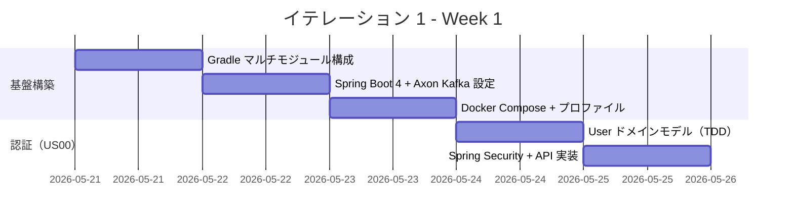
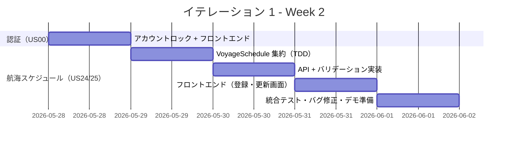
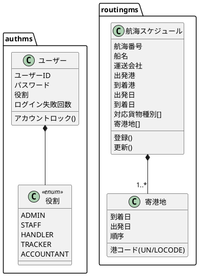
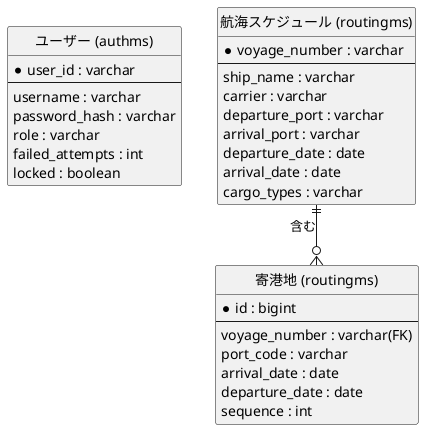
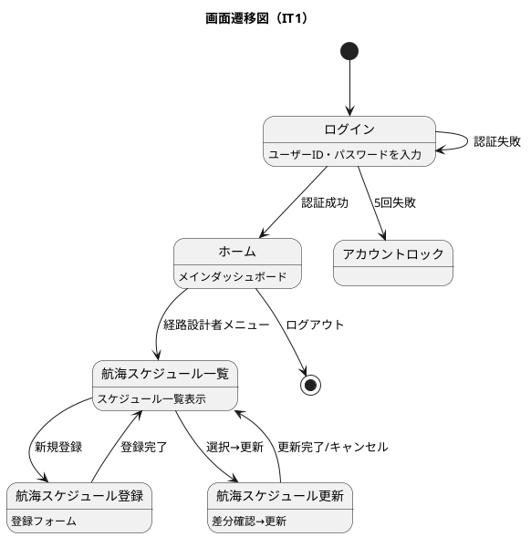

# イテレーション 1 計画

## 概要

| 項目 | 内容 |
|------|------|
| **イテレーション** | 1 |
| **期間** | Week 1-2（2026-05-21 〜 2026-06-03） |
| **ゴール** | Axon Kafka + Heroku 基盤を確立し、認証と航海スケジュール管理を動作させる |
| **目標 SP** | 10 |

---

## ゴール

### イテレーション終了時の達成状態

1. **基盤構築**: Spring Boot 4 + Axon Kafka Extension + local-h2/local-docker/heroku プロファイルが動作し、マルチモジュール構成（authms・routingms 最小骨格）が揃っている
2. **認証（US00）**: ログイン・ログアウト・アカウントロックが動作し、ロールベースのアクセス制御が機能している
3. **航海スケジュール管理（US24・US25）**: 経路設計者が航海スケジュールの新規登録と更新をできる

### 成功基準

- [ ] `./gradlew test` がすべて PASS する（local-h2 プロファイル）
- [ ] `docker compose up` で Kafka + PostgreSQL が起動し local-docker プロファイルでサービスが動作する
- [ ] 認証（ログイン・ログアウト・アカウントロック）が UI から操作できる
- [ ] 航海スケジュールの新規登録・更新が UI から操作できる
- [ ] テストカバレッジ 80% 以上

---

## ユーザーストーリー

### 対象ストーリー

| ID | ユーザーストーリー | SP | 優先度 |
|----|-------------------|----|----|
| US00 | 認証を実装する | 3 | 必須 |
| US24 | 航海スケジュールを新規登録する | 3 | 必須 |
| US25 | 既存航海スケジュールを更新する | 2 | 必須 |
| - | 基盤構築（マルチモジュール・Kafka 接続） | 2 | 必須 |
| **合計** | | **10** | |

### ストーリー詳細

#### US00: 認証を実装する

**ストーリー**:

> ユーザーとして、ユーザーID とパスワードでログインし、ログアウトでき、連続失敗時にアカウントがロックされるようにしたい。なぜなら、不正アクセスを防ぎ役割に応じた操作制限が必要だからだ。

**受入条件**:

1. ユーザーID・パスワードでログインできる
2. ログアウトができる
3. 連続失敗（5 回）でアカウントがロックされる
4. ロールに基づくアクセス制御（ADMIN/STAFF/HANDLER/TRACKER/ACCOUNTANT）が機能する

#### US24: 航海スケジュールを新規登録する

**ストーリー**:

> 経路設計者として、航海番号・船名・運送会社・出発港・到着港・出発日・到着日・対応貨物種別・寄港地をシステムに新規登録したい。なぜなら、最新の運航情報をシステムに反映することで経路候補算出精度が上がるからだ。

**受入条件**:

1. 航海番号・船名・運送会社・出発港（UN/LOCODE）・到着港・出発日・到着日・対応貨物種別を入力できる
2. 寄港地を複数かつ順序付きで入力できる
3. 必須項目未入力時にエラーが表示される
4. 出発日が到着日より後の場合に日付整合性エラーが表示される
5. 同一航海番号が未登録の場合、登録が完了し登録番号が発行される

#### US25: 既存航海スケジュールを更新する

**ストーリー**:

> 経路設計者として、航海番号を指定して既登録スケジュールを呼び出し、変更内容を差分確認して更新したい。なぜなら、スケジュール変更を即座にシステムに反映し経路候補算出の誤りを防ぐからだ。

**受入条件**:

1. 既存の航海番号を指定して既登録スケジュールを呼び出せる
2. 既存内容と更新内容の差分が確認画面に表示される
3. 確認後「更新する」で既存スケジュールが上書き更新される
4. 「キャンセル」選択時は変更されない

### タスク

#### 0. 基盤構築（2 SP）

| # | タスク | 見積もり | 担当 | 状態 |
|---|--------|---------|------|------|
| 0.1 | Gradle マルチモジュール構成（authms・routingms・shared）を作成 | 4h | - | [ ] |
| 0.2 | Spring Boot 4 + Axon Kafka Extension 依存関係設定 | 2h | - | [ ] |
| 0.3 | local-h2 / local-docker / heroku プロファイル設定 | 2h | - | [ ] |
| 0.4 | Docker Compose（Kafka + Zookeeper + PostgreSQL）設定 | 2h | - | [ ] |
| 0.5 | Gateway（gatewayms）最小構成 + フロントエンド（Vite）起動確認 | 2h | - | [ ] |

**小計**: 12h

#### 1. US00: 認証（3 SP）

| # | タスク | 見積もり | 担当 | 状態 |
|---|--------|---------|------|------|
| 1.1 | User エンティティ・ロール定義（TDD: Red） | 2h | - | [ ] |
| 1.2 | User ドメインモデル実装（TDD: Green） | 2h | - | [ ] |
| 1.3 | Spring Security 設定（JWT + ロールベースアクセス制御） | 4h | - | [ ] |
| 1.4 | ログイン API（POST /auth/login）実装 | 2h | - | [ ] |
| 1.5 | ログアウト API（POST /auth/logout）実装 | 1h | - | [ ] |
| 1.6 | アカウントロック機能（失敗 5 回）実装 | 2h | - | [ ] |
| 1.7 | フロントエンド: ログイン画面・ナビゲーション実装 | 3h | - | [ ] |

**小計**: 16h

#### 2. US24: 航海スケジュール新規登録（3 SP）

| # | タスク | 見積もり | 担当 | 状態 |
|---|--------|---------|------|------|
| 2.1 | VoyageSchedule 集約定義（TDD: Red → Green） | 3h | - | [ ] |
| 2.2 | RegisterVoyageCommand / VoyageRegisteredEvent 実装 | 2h | - | [ ] |
| 2.3 | VoyageSchedule リポジトリ（MyBatis Read Model）実装 | 2h | - | [ ] |
| 2.4 | POST /api/voyage-schedules エンドポイント実装 | 2h | - | [ ] |
| 2.5 | バリデーション（必須項目・日付整合性・重複チェック）実装 | 2h | - | [ ] |
| 2.6 | フロントエンド: 航海スケジュール登録フォーム実装 | 3h | - | [ ] |

**小計**: 14h

#### 3. US25: 既存航海スケジュール更新（2 SP）

| # | タスク | 見積もり | 担当 | 状態 |
|---|--------|---------|------|------|
| 3.1 | UpdateVoyageCommand / VoyageUpdatedEvent 実装（TDD） | 2h | - | [ ] |
| 3.2 | PUT /api/voyage-schedules/{id} エンドポイント実装 | 2h | - | [ ] |
| 3.3 | フロントエンド: 差分確認画面・更新フォーム実装 | 3h | - | [ ] |

**小計**: 7h

#### タスク合計

| カテゴリ | SP | 理想時間 | 状態 |
|---------|----|----|------|
| 基盤構築 | 2 | 12h | [ ] |
| US00: 認証 | 3 | 16h | [ ] |
| US24: 航海スケジュール新規登録 | 3 | 14h | [ ] |
| US25: 既存航海スケジュール更新 | 2 | 7h | [ ] |
| **合計** | **10** | **49h** | |

**1 SP あたり**: 約 4.9h

**進捗率**: 0%（0/10 SP）

---

## スケジュール

### Week 1（Day 1-5: 2026-05-21 〜 2026-05-27）

| 日 | タスク |
|----|--------|
| Day 1（5/21） | Gradle マルチモジュール構成・プロジェクト骨格作成 |
| Day 2（5/22） | Spring Boot 4 + Axon Kafka Extension 依存関係設定 |
| Day 3（5/23） | Docker Compose（Kafka + PostgreSQL）+ プロファイル設定 |
| Day 4（5/26） | US00: User ドメインモデル TDD（Red → Green → Refactor） |
| Day 5（5/27） | US00: Spring Security 設定 + ログイン/ログアウト API 実装 |

### Week 2（Day 6-10: 2026-05-28 〜 2026-06-03）

| 日 | タスク |
|----|--------|
| Day 6（5/28） | US00: アカウントロック実装 + ログイン UI |
| Day 7（5/29） | US24: VoyageSchedule 集約 TDD（Command/Event/Aggregate） |
| Day 8（6/2） | US24: API + バリデーション + US25: UpdateVoyageCommand |
| Day 9（6/3 AM） | US24/25: フロントエンド（登録・差分確認・更新フォーム） |
| Day 10（6/3 PM） | 統合テスト・バグ修正・デモ準備 |

---

## 設計

### ドメインモデル

### データモデル

### ユーザーインターフェース

#### 画面遷移

### API 設計

| メソッド | エンドポイント | 説明 |
|---------|---------------|------|
| POST | /auth/login | ログイン（JWT 発行） |
| POST | /auth/logout | ログアウト |
| GET | /api/voyage-schedules | 航海スケジュール一覧 |
| POST | /api/voyage-schedules | 航海スケジュール新規登録 |
| GET | /api/voyage-schedules/{voyageNumber} | 航海スケジュール詳細 |
| PUT | /api/voyage-schedules/{voyageNumber} | 航海スケジュール更新 |

### ADR

| ADR | タイトル | ステータス |
|-----|---------|-----------|
| [ADR-0001](../adr/0001-axon-kafka-aiven-adoption.md) | Axon Kafka Extension + Aiven 採用 | 承認済み |
| [ADR-0002](../adr/0002-mybatis-adoption.md) | MyBatis 採用 | 承認済み |
| [ADR-0006](../adr/0006-heroku-deployment-setup.md) | Heroku Container Registry デプロイ構成 | 承認済み |

---

## リスクと対策

| リスク | 影響度 | 対策 |
|--------|--------|------|
| Axon Kafka Extension が Spring Boot 4 / Axon 5 に未対応 | 高 | Day 2 で依存解決を検証。非対応の場合は Spring Cloud Stream への切替を ADR に記録 |
| local-h2 プロファイルで Axon Kafka を無効化できない | 中 | `axon.kafka.enabled=false` プロパティで制御。SimpleCommandBus + InMemoryEventStore に切替 |
| Gradle マルチモジュール構成の複雑化 | 中 | take-4 の build.gradle 構成を参考に最小限から開始 |

---

## 完了条件

### Definition of Done

- [ ] コードレビュー完了（セルフレビュー）
- [ ] ユニットテストがパス（`./gradlew test`）
- [ ] 統合テストがパス（local-docker プロファイル）
- [ ] ESLint / Checkstyle エラーなし
- [ ] 認証・航海スケジュール機能がローカル環境で動作確認済み
- [ ] ドキュメント更新完了

### デモ項目

1. ログイン → ダッシュボード表示 → ログアウト
2. 認証失敗 5 回でアカウントロック
3. 航海スケジュール新規登録（UN/LOCODE 形式・寄港地複数）
4. 航海番号指定で既存スケジュール呼び出し → 差分確認 → 更新

---

## 更新履歴

| 日付 | 更新内容 | 更新者 |
|------|---------|--------|
| 2026-05-21 | 初版作成 | k2works |

---

## 関連ドキュメント

- [リリース計画](./release_plan.md)
- [イテレーション 1 ふりかえり](./retrospective-1.md)
