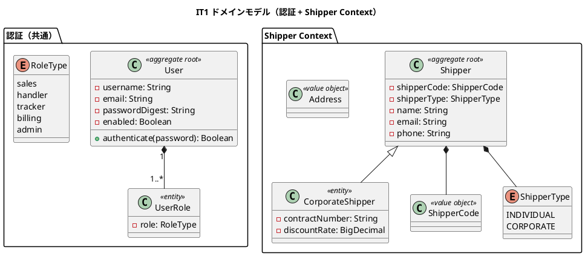
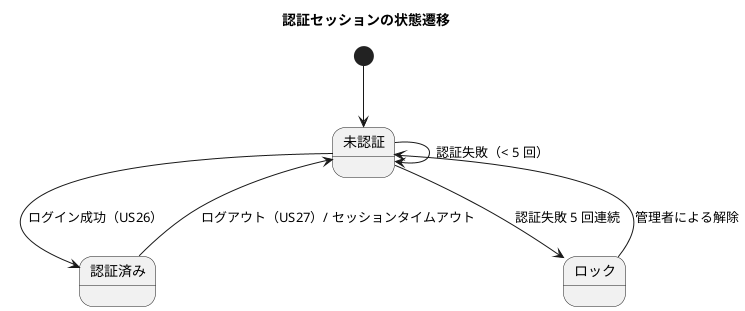
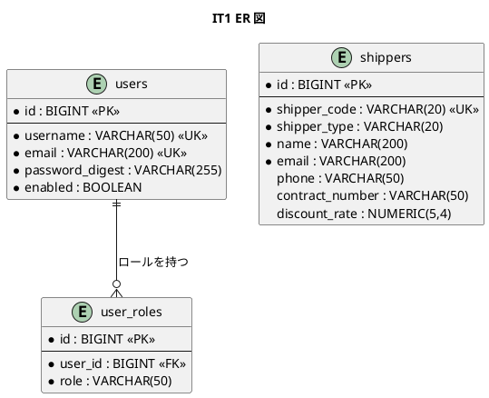
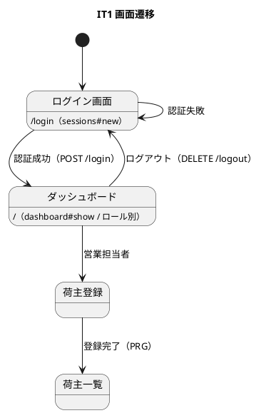

# イテレーション 1 計画 - 基盤構築 + 認証 + 荷主登録

## ゴール

Rails 8 + packs（DDD/ヘキサゴナル/CQRS）基盤とウォーキングスケルトンを構築し、ユーザー認証（US26/US27）とロール別ダッシュボード、荷主・法人荷主登録（US02/US03）を序盤アウトサイドインで TDD 完成させる。

- **局面**: 序盤（アウトサイドイン）— [development_strategy.md](development_strategy.md) 参照
- **期間**: Week 1-2（2026-07-13 〜 2026-07-26）
- **目標 SP**: 11（+ 基盤構築オーバーヘッド）

## 対象ストーリー

| US | 概要 | SP | BC | 対応 UC |
|:---|:-----|:--|:---|:--------|
| US26 | システムにログインする | 3 | 共通（認証・認可基盤） | UC20 |
| US27 | システムからログアウトする | 2 | 共通（認証・認可基盤） | UC20 |
| US02 | 荷主を登録する | 3 | Shipper Context | UC02 |
| US03 | 法人荷主を登録する | 3 | Shipper Context | UC02 |

（release_plan.md Phase 1 / IT1 と一致）

## 受入条件

[user_story.md](../requirements/user_story.md) の受け入れ基準に準拠（全文）。

**US26 システムにログインする**（として: システム利用者）

- [ ] 利用者 ID とパスワードを入力してログインできる
- [ ] ログイン成功後、ロールに応じたダッシュボードが表示される
- [ ] 認証情報が一致しない場合、「利用者 ID またはパスワードが正しくありません」と表示される
- [ ] 認証失敗が 5 回連続するとアカウントが一時ロックされ、利用者に通知される
- [ ] 無効化されたアカウントではログインできず、管理者への問い合わせが案内される
- [ ] ログイン成功・失敗がログに記録される
- [ ] 未ログイン状態で業務機能（追跡照会 US18 を除く）にアクセスするとログイン画面に誘導される

**US27 システムからログアウトする**（として: システム利用者）

- [ ] ログアウト操作でセッションが破棄され、ログイン画面に戻る
- [ ] ログアウト後にブラウザバック等で業務画面へ戻れない
- [ ] ログアウト日時がログに記録される

**US02 荷主を登録する**（として: 営業担当者）

- [ ] 氏名/社名・住所・連絡先・メールアドレス・荷主種別（個人/法人）を入力できる
- [ ] 同一メールアドレスが既に登録されている場合、既存荷主として表示しどちらを使用するか選択できる
- [ ] 登録完了後、荷主 ID が発行される
- [ ] 荷主種別「個人」で登録できる

**US03 法人荷主を登録する**（として: 営業担当者）

- [ ] 荷主種別「法人」を選択すると、法人契約情報（契約番号・割引率）の入力フィールドが表示される
- [ ] 割引率は 0〜30% の範囲で設定できる
- [ ] 法人荷主で登録完了後、荷主 ID が発行される
- [ ] 登録した法人情報は US22（法人割引を適用する）で参照される

## タスク分解（アウトサイドイン）

### 基盤構築（オーバーヘッド）

- [ ] Rails 8 新規アプリ + packs/Packwerk 設定（BC ごとの pack 雛形）
- [ ] RSpec / SimpleCov / RuboCop（+ rails/rspec）/ Brakeman 導入
- [ ] Docker Compose（PostgreSQL 16）+ GitHub Actions CI（Backend CI）
- [ ] Capybara + capybara-playwright-driver（system spec 基盤）

### ウォーキングスケルトン

- [ ] Rails 8 標準認証（`has_secure_password` + Session）+ Pundit（ロール: sales / handler / tracker / billing / admin）
- [ ] `users` / `user_roles` テーブル migration
- [ ] UI 設計の画面遷移図に沿った全ルートのプレースホルダ画面 + ナビゲーション（ロール制御）
- [ ] 荷主登録（`/shippers`）導線を navbar（`app/views/shared/_navbar.html.erb`）とダッシュボードに営業担当者ロール条件付きで追加し、ui_design.md のナビゲーション構成表にも反映（ナビゲーション整合性）
- [ ] 全ナビゲーション遷移・ロール別 403・ロール別到達性（営業担当者がダッシュボード/navbar から荷主登録へ到達できる）を担保する system spec（骨格の受け入れ基準）

### US26/US27 ログイン・ログアウト（認証）

- [ ] system spec: ログイン成功→ダッシュボード、失敗→エラー、5 回ロック、ログアウト（アウトサイドインの入口）
- [ ] `sessions#new/create/destroy`（`/login` GET/POST、`/logout` DELETE）
- [ ] 認証サービス（アカウントロック・監査ログ）→ User（PORO 認証情報検証）
- [ ] request spec: 未認証アクセスのログイン画面誘導

### US02/US03 荷主登録

- [ ] system spec: 個人・法人荷主の登録シナリオ（法人選択で契約情報フィールド表示、バリデーションエラー自己ループ）
- [ ] 荷主登録コントローラ・フォーム（PRG パターン、メール重複時は既存荷主提示・選択）
- [ ] `Shipper` 集約（PORO）・`CorporateShipper` サブタイプ・値オブジェクト（`ShipperCode` / `ShipperType` / `Address`）のユニット spec
- [ ] `DiscountRate` 値オブジェクト（0〜30%）のユニット spec（境界値）
- [ ] `ShipperRepository`（Active Record アダプタ）の repository spec、`shippers` テーブル migration

### 設計レビュー指摘の反映（2026-07-07 設計ドキュメントレビュー）

- [ ] 【高 #12】data-model.md の Devise 併記を削除し Rails 8 標準認証（`has_secure_password` + Session）に統一（認証実装前に対応）
- [ ] 【高 #1】Shipper を独立コンテキストとする決定を ADR に記録（domain-model の 8 コンテキストを正とし、Booking との統合是非を明記）

## スケジュール

| Week | 主な作業 |
|:-----|:---------|
| Week 1 | 基盤構築・認証基盤・ウォーキングスケルトン・US26/US27 |
| Week 2 | US02/US03 荷主登録、デモ項目 system spec の green 化、品質ゲート |

## 設計（IT1 スコープに絞った 4 図）

### ドメインモデル図（認証 + Shipper Context）

### 状態遷移図（認証セッション）

> **注**: Shipper 集約は登録後の業務状態機械を持たないため、状態遷移図は認証セッションのみを掲載する。

### ER 図（IT1 スコープ）

### 画面遷移図（IT1 スコープ）

## リスク

| リスク | 対策 |
|--------|------|
| PORO ドメイン層 ↔ Active Record 変換のボイラープレートが重い | IT1 の Shipper で変換パターンを確立し、以降のコストを実測（ADR 0001） |
| Rails 8 標準認証 + Pundit の初期構築コスト | ウォーキングスケルトンで認証・認可を先に貫通させ、以降の IT へ横展開 |
| 荷主登録画面 URL が UI 設計に未定義（下記「設計への反映が必要」） | 着手時に ui_design.md へ `/shippers` を追記して整合を取る |

## 設計への反映が必要（validating 検証で検出）

以下は設計ドキュメント側の欠落・先行実装が必要なため、本 IT で `docs/design/` へ反映してから実装する（実装と設計の同時反映）。

1. **アカウントロック用カラム**: `users` テーブルに認証失敗回数・ロック状態を保持するカラム（例: `failed_attempts` / `locked_at`）が data-model.md に未定義。US26 の「5 回連続失敗でロック」実装前に data-model.md へ追加する。
2. **荷主登録画面の URL**: ui_design.md の画面一覧に荷主登録（`/shippers`, `shippers#new/create`）の明示的なルートがない（US02/US03 が `/bookings` に紐付いている）。IT1 着手時に ui_design.md へ荷主登録画面と RESTful ルートを追記する。
3. **荷主住所カラムの欠落**: US02 受け入れ基準は住所入力を要求し domain-model.md にも `Address` 値オブジェクト（最大 500 文字）があるが、data-model.md の `shippers` テーブルに `address` カラムがない。US02 実装前に data-model.md の `shippers` へ `address VARCHAR(500)` を追加する。

## Definition of Done

- [ ] US26/US27/US02/US03 の受け入れ基準をすべて満たす
- [ ] デモ項目 system spec（ログイン→ロール別ダッシュボード→荷主登録→法人荷主登録→ログアウト）が green
- [ ] 全ナビゲーション遷移・ロール別 403・ロール別到達性（営業担当者→荷主登録）の system spec が green
- [ ] `bundle exec rspec` / `bundle exec rubocop` / `bundle exec brakeman` / `bin/packwerk check` がすべて green
- [ ] ドメイン層カバレッジ 85% 以上・全体 80% 以上
- [ ] 上記「設計への反映が必要」の 2 点を `docs/design/` に反映済み

## デモ項目（イテレーションレビュー）

1. 利用者がログインし、ロールに応じたダッシュボードが表示される。
2. 認証失敗を 5 回繰り返すとアカウントがロックされる。
3. 営業担当者が個人荷主・法人荷主（割引率付き）を登録できる。
4. ログアウトするとセッションが破棄され、業務画面へ戻れない。

## 更新履歴

| 日付 | 更新内容 | 更新者 |
|------|---------|--------|
| 2026-07-27 | 初版作成（IT1: 基盤 + 認証 US26/US27 + 荷主登録 US02/US03） | - |
| 2026-07-27 | validating-iteration-plan 検証を反映（受入条件を全文化、レビュー高 #12/#1 をタスク化、住所カラム欠落を追記、テンプレート必須節を補完） | - |

## 関連ドキュメント

- [リリース計画](release_plan.md)
- [開発戦略](development_strategy.md)
- [ユーザーストーリー](../requirements/user_story.md)（US26/US27/US02/US03）
- [ドメインモデル](../design/domain-model.md)（Shipper Context）
- [データモデル](../design/data-model.md)（users / user_roles / shippers）
- [UI 設計](../design/ui_design.md)（ログイン・ダッシュボード・荷主登録）
- [設計ドキュメントレビュー 2026-07-07](../review/設計ドキュメント_review_20260707.md)
