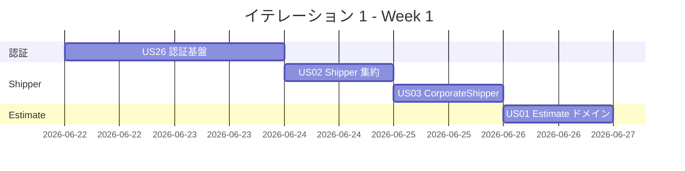
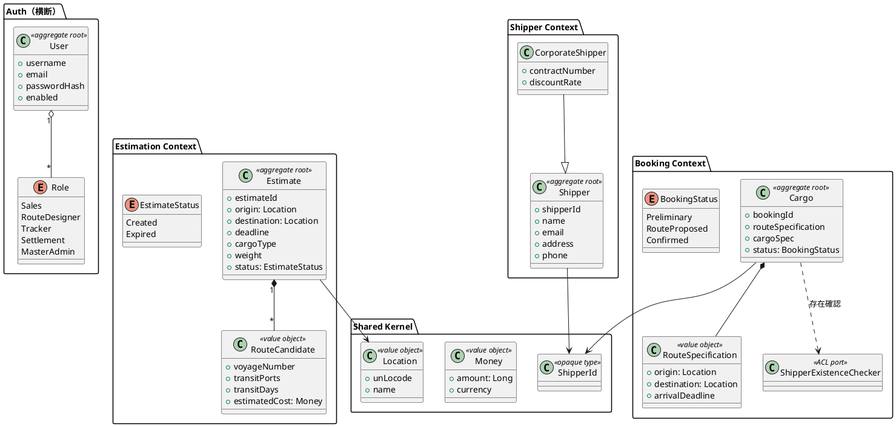
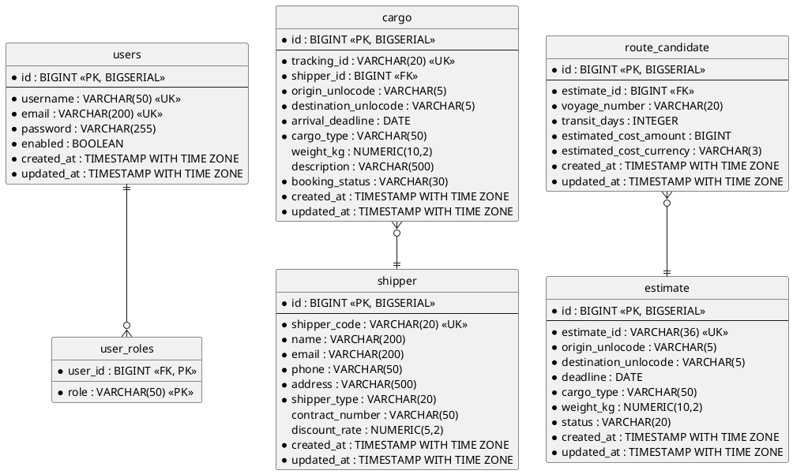
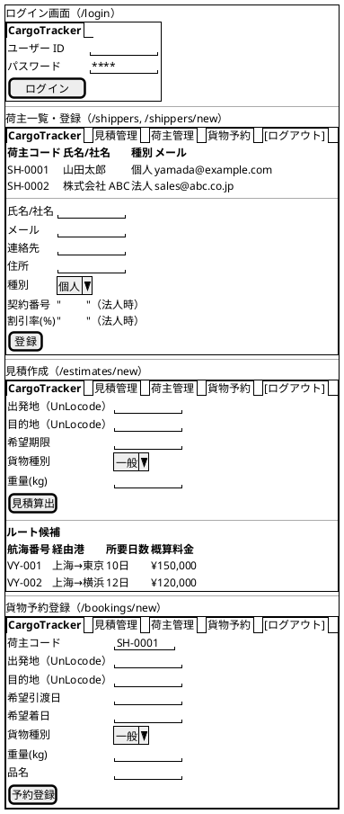
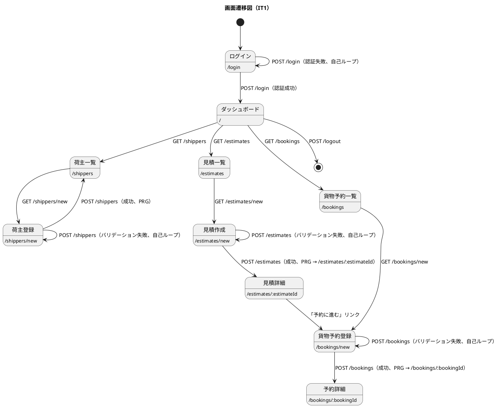

# イテレーション 1 計画

## 概要

| 項目 | 内容 |
|------|------|
| **イテレーション** | 1 |
| **期間** | Week 1-2（2026-06-22 〜 2026-07-05、2 週間） |
| **ゴール** | 認証基盤と Shipper・Estimate・Cargo の DDD ドメイン基盤を構築し、Scala 3 / Play 3 / ScalikeJDBC の縦串疎通を通す |
| **目標 SP** | 12（ストレッチ） |

---

## ゴール

### イテレーション終了時の達成状態

1. **認証基盤**: ユーザーが `/login` で認証でき、`AuthenticatedAction` が保護リソースへのアクセスを制御する。`users` / `user_roles` テーブルがマイグレーション済み
2. **Shipper コンテキスト**: 個人・法人荷主が `shipper` テーブルに登録され、法人 variant は契約番号と割引率を保持する
3. **Estimation コンテキスト**: 輸送見積（`Estimate` 集約）が `estimate` テーブルに保存でき、`RouteCandidate` のモック生成で縦串疎通が完成する
4. **Booking コンテキスト**: 貨物予約（`Cargo` 集約）が `cargo` テーブルに登録でき、Shipper の存在確認 ACL ポート（`ShipperExistenceChecker`）が動作する

### 成功基準

- [ ] US26・US02・US03・US01・US04 の受入基準すべてを満たす
- [ ] テストカバレッジ 80% 以上
- [ ] ScalaTest によるユニット/統合テストが全パス
- [ ] ArchUnit 4 ルール pass
- [ ] SonarQube Quality Gate PASS

---

## ユーザーストーリー

### 対象ストーリー

| ID | ユーザーストーリー | SP | 優先度 |
|----|-------------------|----|----|
| US26 | システムにログイン・ログアウトする | 2 | 必須 |
| US02 | 荷主を登録する | 2 | 必須 |
| US03 | 法人荷主を登録する | 2 | 必須 |
| US01 | 輸送見積を作成する | 3 | 必須 |
| US04 | 貨物予約を登録する | 3 | 必須 |
| **合計** | | **12** | |

### ストーリー詳細

#### US26: システムにログイン・ログアウトする

**ストーリー**:
> システム利用者（営業担当者・経路設計者・追跡担当者・精算担当者・マスタ管理者）として、ユーザー ID とパスワードでログインし、業務終了時にログアウトしたい。なぜなら、各役割の操作権限を分離し、業務ログを操作者単位で追跡できるからだ。また個人情報・契約情報を含む荷主データへの不正アクセスを防げるからだ。

**対応 UC**: 横断（認証・認可、全 UC の前提）

**受入基準**:

1. ユーザー ID とパスワードを入力してログインできる
2. 認証成功時は役割（ロール）に応じたトップ画面に遷移する
3. 認証失敗時はエラーメッセージを表示し、入力フォームに戻る
4. 未認証で保護リソースにアクセスした場合、ログイン画面にリダイレクトされる
5. セッションタイムアウト（30 分無操作）でログイン画面に戻る
6. ログアウトボタンでセッションを破棄しログイン画面に戻る
7. パスワードはハッシュ化（bcrypt 等）して保存される
8. 公開追跡ページ（`/public/tracking/:trackingNumber`）は認証不要

#### US02: 荷主を登録する

**ストーリー**:
> 営業担当者として、新規荷主の氏名/社名・住所・連絡先・メールアドレスをシステムに登録したい。なぜなら、次回以降の予約で荷主情報の再入力を省略でき、顧客情報を一元管理できるからだ。

**対応 UC**: UC02

**受入基準**:

1. 氏名/社名・住所・連絡先・メールアドレス・荷主種別（個人/法人）を入力できる
2. 同一メールアドレスが既に登録されている場合、既存荷主として表示しどちらを使用するか選択できる
3. 登録完了後、`ShipperId`（業務キー `shipper_code`）が発行される
4. 荷主種別「個人」で登録できる

#### US03: 法人荷主を登録する

**ストーリー**:
> 営業担当者として、法人荷主の契約番号と割引率を含めて登録したい。なぜなら、法人契約条件（割引率）を精算時に自動適用できるからだ。

**対応 UC**: UC02

**受入基準**:

1. 荷主種別「法人」を選択すると、法人契約情報（契約番号・割引率）の入力フィールドが表示される
2. 割引率は 0〜30% の範囲で設定できる
3. 法人荷主で登録完了後、`ShipperId` が発行される（`CorporateShipper` variant）
4. 登録した法人情報は US22（法人割引を適用する）で参照される

#### US01: 輸送見積を作成する

**ストーリー**:
> 営業担当者として、荷主の輸送要件（出発地・目的地・希望期限・貨物種別・重量）を入力し、輸送料金と所要日数の見積を作成したい。なぜなら、荷主が予算と納期を事前に把握でき、予約決定を迅速に行えるからだ。

**対応 UC**: UC01

**受入基準**:

1. 出発地・目的地（共有カーネル `Location` の UnLocode）・希望期限・貨物種別・重量を入力できる
2. 航海スケジュール情報をもとにルート概算候補（`RouteCandidate`）が表示される
3. ルート候補ごとに「経由港・所要日数・概算料金・航海番号」が表示される
4. 見積情報が保存され、`EstimateId`（UUID）が発行される
5. 希望期限に間に合うルートが存在しない場合、その旨が通知される
6. 危険物含有時は危険物申告入力フォームが表示される
7. **料金計算ロジックは US21（料金算出）と共通化する設計とする**（ADR-IT1-2）

#### US04: 貨物予約を登録する

**ストーリー**:
> 営業担当者として、荷主 ID・貨物仕様（種別・重量・寸法・個数・品名）・輸送条件（出発地・目的地・希望日）を入力して予約を登録したい。なぜなら、荷主の見積承認後に正式な予約を受け付け、経路設計フェーズに引き継げるからだ。

**対応 UC**: UC03

**受入基準**:

1. `ShipperId` を入力して既存荷主を選択できる（`ShipperExistenceChecker` ACL ポート経由で存在確認）
2. 貨物種別・重量・寸法・個数・品名を入力できる
3. 出発地・目的地・希望引渡日・希望着日を入力できる（`RouteSpecification` に格納）
4. 登録完了後、`BookingId`（`BK-XXXXXX`）が発行され `BookingStatus = Preliminary` になる
5. 経路設計者に予約登録通知（ドメインイベント）が送信される
6. 見積情報との整合性が確認される

### タスク

#### 1. US26: 認証基盤（2 SP）

| # | タスク | 見積もり | 担当 | 状態 |
|---|--------|---------|------|------|
| 1.1 | `users` / `user_roles` テーブル Flyway マイグレーション（V1） | 1h | - | [ ] |
| 1.2 | `User` エンティティ + `Role` enum + bcrypt パスワード値オブジェクト | 2h | - | [ ] |
| 1.3 | `AuthenticatedAction` + `AuthController`（`/login` GET/POST、`/logout` POST） | 2h | - | [ ] |
| 1.4 | セッションフィルタ（30 分タイムアウト・公開 URL 除外） | 2h | - | [ ] |
| 1.5 | ログイン画面 Twirl テンプレート + ナビバー（共通レイアウト） | 1h | - | [ ] |
| 1.6 | テスト（ユニット + 統合 + ArchUnit） | 1h | - | [ ] |

**小計**: 9h（理想時間）

#### 2. US02・US03: Shipper 集約（2+2 SP = 4 SP）

| # | タスク | 見積もり | 担当 | 状態 |
|---|--------|---------|------|------|
| 2.1 | `shipper` テーブル Flyway マイグレーション（V2、`BIGSERIAL` + `shipper_code` UK + `created_at/updated_at`） | 2h | - | [ ] |
| 2.2 | `Shipper` 集約ルート（`final case class`） + `CorporateShipper` variant + `ShipperId` opaque type | 3h | - | [ ] |
| 2.3 | 値オブジェクト（`Email`・`Address`・`DiscountRate`、`opaque type` + `Either[DomainError, _]`） | 2h | - | [ ] |
| 2.4 | `ShipperRepository`（ScalikeJDBC、SQL interpolation）+ `ShipperExistenceChecker` ACL ポート実装 | 3h | - | [ ] |
| 2.5 | `ShipperController`（`/shippers` GET、`/shippers/new` GET、`/shippers` POST、PRG パターン）+ Twirl 画面 | 3h | - | [ ] |
| 2.6 | メール重複チェック（既存表示・選択 UI） | 1h | - | [ ] |
| 2.7 | テスト（ユニット + 統合 + E2E + ArchUnit） | 2h | - | [ ] |

**小計**: 16h（理想時間）

#### 3. US01: Estimate 集約（3 SP）

| # | タスク | 見積もり | 担当 | 状態 |
|---|--------|---------|------|------|
| 3.1 | `estimate` テーブル + `route_candidate` テーブル Flyway マイグレーション（V3、`BIGSERIAL` + `estimate_id` UUID UK） | 2h | - | [ ] |
| 3.2 | `Estimate` 集約 + `RouteCandidate` 値オブジェクト + `EstimateStatus` enum（Created / Expired） | 3h | - | [ ] |
| 3.3 | `PricingService` ドメインサービス設計（US21 共通化前提、`Money` 共有カーネル使用） | 3h | - | [ ] |
| 3.4 | ルート候補生成（IT1 はモック、IT2 で `Voyage` 統合） | 2h | - | [ ] |
| 3.5 | `EstimateRepository`（ScalikeJDBC） | 2h | - | [ ] |
| 3.6 | `EstimateController`（`/estimates` GET、`/estimates/new` GET、`/estimates` POST、`/estimates/:estimateId` GET）+ Twirl 画面 | 3h | - | [ ] |
| 3.7 | テスト（ユニット + 統合 + E2E + ArchUnit） | 2h | - | [ ] |

**小計**: 17h（理想時間）

#### 4. US04: Cargo 集約（3 SP）

| # | タスク | 見積もり | 担当 | 状態 |
|---|--------|---------|------|------|
| 4.1 | `shipper`（前出）・`cargo` テーブル Flyway マイグレーション（V4、`BIGSERIAL` + `tracking_id` UK） | 2h | - | [ ] |
| 4.2 | `Cargo` 集約ルート + `BookingId` opaque type + `BookingStatus` enum（Preliminary 等） | 3h | - | [ ] |
| 4.3 | 値オブジェクト（`RouteSpecification`・`Dimensions`・`Quantity`・`Description`・`HazardousDeclaration`） | 2h | - | [ ] |
| 4.4 | `CargoRepository`（ScalikeJDBC） + `ShipperExistenceChecker` 利用 | 2h | - | [ ] |
| 4.5 | `BookingController`（`/bookings` GET、`/bookings/new` GET、`/bookings` POST）+ Twirl 画面 | 3h | - | [ ] |
| 4.6 | ドメインイベント（`CargoBookedEvent`） + 通知ハンドラ（経路設計者向け） | 2h | - | [ ] |
| 4.7 | テスト（ユニット + 統合 + E2E + ArchUnit） | 2h | - | [ ] |

**小計**: 16h（理想時間）

#### タスク合計

| カテゴリ | SP | 理想時間 | 状態 |
|---------|----|----|------|
| US26 認証基盤 | 2 | 9h | [ ] |
| US02・US03 Shipper 集約 | 4 | 16h | [ ] |
| US01 Estimate 集約 | 3 | 17h | [ ] |
| US04 Cargo 集約 | 3 | 16h | [ ] |
| **合計** | **12** | **58h** | |

**1 SP あたり**: 約 4.8h
**進捗率**: 0% (0/12 SP)

---

## スケジュール

### Week 1（Day 1-5: 2026-06-22 〜 2026-06-26）



| 日 | タスク |
|----|--------|
| Day 1 | US26 `users`/`user_roles` マイグレーション・`User` エンティティ・`AuthController` |
| Day 2 | US26 セッションフィルタ・ログイン画面・テスト |
| Day 3 | US02 `Shipper` 集約・`shipper` テーブル・`ShipperController` + テスト |
| Day 4 | US03 `CorporateShipper` variant・`DiscountRate` 値オブジェクト・契約番号 UI + テスト |
| Day 5 | US01 `Estimate` 集約設計・`PricingService` 設計 |

### Week 2（Day 6-10: 2026-06-29 〜 2026-07-03）


| 日 | タスク |
|----|--------|
| Day 6 | US01 ルート候補生成（モック）・`EstimateRepository`・画面 |
| Day 7 | US01 テスト・見積整合性 |
| Day 8 | US04 `Cargo` 集約・`cargo` テーブル・`CargoRepository` |
| Day 9 | US04 `BookingController`・画面・`CargoBookedEvent` 発行・テスト |
| Day 10 | 統合テスト、バグ修正、デモ準備、IT1 ふりかえり |

---

## 設計

### ドメインモデル



**実装規約**（domain-model.md 準拠）:

- 集約ルート・エンティティ: `final case class`（イミュータブル）、状態変更は `Either[DomainError, Self]` で新インスタンスを返す
- 値オブジェクト（単一値）: `opaque type` + スマートコンストラクタ（`apply` が `Either[DomainError, A]`）
- 値オブジェクト（複合値）: `final case class` + コンパニオンのスマートコンストラクタ

### データモデル



### ユーザーインターフェース

#### ビュー



#### インタラクション



**htmx パターン**:

- 荷主登録時のメール重複チェック: `hx-get="/shippers/check-email"` `hx-target="#email-warning"` `hx-swap="innerHTML"` `hx-trigger="blur"`
- 見積算出: `POST /estimates` は PRG（リダイレクト後 GET）。htmx ではなく通常フォーム送信
- 法人時の契約情報表示: 種別 select の `hx-get="/shippers/form-fields"` `hx-target="#corporate-fields"`

**フィードバックメッセージ**（Bootstrap 5 alert）:

| 種別 | スタイル | 例 |
|------|---------|-----|
| 成功 | `alert-success` | 「荷主 SH-0001 を登録しました」 |
| 警告 | `alert-warning` | 「同一メール荷主が既に存在します」 |
| エラー | `alert-danger` | 「ログインに失敗しました」「バリデーションエラー」 |

**htmx エラーハンドリング**:

- `htmx:responseError` イベントで `alert-danger` を表示し、500/422 を共通レイアウトに通知

### ディレクトリ構成

```
app/
├── controllers/
│   ├── AuthController.scala
│   ├── ShipperController.scala
│   ├── EstimateController.scala
│   └── BookingController.scala
├── domain/
│   ├── auth/
│   │   ├── User.scala
│   │   ├── Role.scala
│   │   └── PasswordHash.scala
│   ├── shared/
│   │   ├── Location.scala
│   │   ├── Money.scala
│   │   ├── ShipperId.scala
│   │   └── DomainError.scala
│   ├── shipper/
│   │   ├── Shipper.scala
│   │   ├── CorporateShipper.scala
│   │   ├── DiscountRate.scala
│   │   └── ShipperRepository.scala
│   ├── estimation/
│   │   ├── Estimate.scala
│   │   ├── RouteCandidate.scala
│   │   ├── EstimateStatus.scala
│   │   ├── PricingService.scala
│   │   └── EstimateRepository.scala
│   └── booking/
│       ├── Cargo.scala
│       ├── BookingId.scala
│       ├── BookingStatus.scala
│       ├── RouteSpecification.scala
│       ├── ShipperExistenceChecker.scala
│       └── CargoRepository.scala
├── infrastructure/
│   ├── auth/
│   │   ├── AuthenticatedAction.scala
│   │   └── BcryptPasswordHasher.scala
│   └── persistence/
│       ├── ScalikeJDBCUserRepository.scala
│       ├── ScalikeJDBCShipperRepository.scala
│       ├── ScalikeJDBCEstimateRepository.scala
│       ├── ScalikeJDBCCargoRepository.scala
│       └── ShipperExistenceCheckerImpl.scala
├── views/
│   ├── layout.scala.html               # ナビバー共通レイアウト
│   ├── auth/login.scala.html
│   ├── shipper/{list,form}.scala.html
│   ├── estimate/{list,form,detail}.scala.html
│   └── booking/{list,form,detail}.scala.html
└── filters/
    └── SessionTimeoutFilter.scala
conf/
├── routes
└── db/migration/
    ├── V1__create_users_and_roles.sql
    ├── V2__create_shipper.sql
    ├── V3__create_estimate_and_route_candidate.sql
    └── V4__create_cargo.sql
```

### API 設計

| メソッド | エンドポイント | 説明 |
|---------|---------------|------|
| GET | `/login` | ログイン画面 |
| POST | `/login` | 認証実行（PRG） |
| POST | `/logout` | ログアウト |
| GET | `/` | ダッシュボード |
| GET | `/shippers` | 荷主一覧 |
| GET | `/shippers/new` | 荷主登録画面 |
| POST | `/shippers` | 荷主登録（PRG） |
| GET | `/shippers/check-email` | メール重複チェック（htmx） |
| GET | `/estimates` | 見積一覧 |
| GET | `/estimates/new` | 見積作成画面 |
| POST | `/estimates` | 見積作成（PRG） |
| GET | `/estimates/:estimateId` | 見積詳細 |
| GET | `/bookings` | 貨物予約一覧 |
| GET | `/bookings/new` | 貨物予約登録画面 |
| POST | `/bookings` | 貨物予約登録（PRG） |
| GET | `/bookings/:bookingId` | 予約詳細 |
| GET | `/public/tracking/:trackingNumber` | 公開追跡（IT5 から実装、認証不要） |

### ADR

| ADR | タイトル | ステータス |
|-----|---------|-----------|
| [ADR 0001](../adr/0001-play-framework-scala-stack.md) | Play Framework + Scala 採用 | 承認 |
| ADR-IT1-1（新規作成予定） | bcrypt パスワードハッシュとセッションタイムアウト方針 | 提案 |
| ADR-IT1-2（新規作成予定） | 料金計算ドメインサービスの US01/US21 共通化方針 | 提案 |
| ADR-IT1-3（新規作成予定） | US26 を UC 横断ストーリーとして扱う方針 | 提案 |

---

## リスクと対策

| リスク | 影響度 | 対策 |
|--------|--------|------|
| Scala 3 / opaque type / Either 合成の習熟不足で IT1 ストレッチ 12 SP 未達 | 高 | US04 を IT2 へ繰り延べ可能（必須機能だが Phase 1 内で完結）。Day 5 時点で進捗確認 |
| 認証の設計判断が後続イテレーションに影響 | 高 | ADR-IT1-1 で bcrypt/セッション方針を確定、Phase 2 以降は反復適用 |
| 料金計算ロジックを US01 で簡易実装し US21 で大幅変更が必要になる | 中 | ADR-IT1-2 で `PricingService` インターフェースを先に固定、US01 は最小実装 |
| 航海マスタ未実装で US01 `RouteCandidate` 生成がモック依存 | 中 | IT2 で US24 実装後に本物データに切替、IT1 末で E2E モック差し替え予定を明示 |

---

## 完了条件

### Definition of Done

- [ ] コードレビュー完了（self-review + developing-review 1 回）
- [ ] ScalaTest によるユニットテスト pass
- [ ] 統合テスト pass（Testcontainers PostgreSQL）
- [ ] E2E テスト pass（ログイン → 荷主登録 → 見積 → 予約の貫通シナリオ）
- [ ] テストカバレッジ 80% 以上
- [ ] ArchUnit 4 ルール pass
- [ ] SonarQube Quality Gate PASS
- [ ] ScalafmtCheck・ScalafixCheck pass
- [ ] 機能がローカル環境で動作確認済み
- [ ] ADR-IT1-1/2/3 を `docs/adr/` に作成
- [ ] CHANGELOG・index 更新

### デモ項目

1. 営業担当ユーザーで `/login` ログイン → ダッシュボード表示 → ログアウト
2. 個人荷主を `/shippers/new` で登録 → 法人荷主を割引率 15% で登録
3. `/estimates/new` で輸送見積を作成 → ルート候補（モック）が表示される
4. 見積詳細から `/bookings/new` に遷移 → 予約登録 → `BookingId` 発行・`Preliminary` 表示

---

## 更新履歴

| 日付 | 更新内容 | 更新者 |
|------|---------|--------|
| 2026-06-20 | 初版作成（IT1 ストレッチ 12 SP、認証 US26 含む） | AI Agent |
| 2026-06-20 | validating-iteration-plan 指摘を反映：ドメイン名称統一（Cargo/Shipper/Estimate）、DB 設計（単数形・BIGSERIAL・users/user_roles・created_at/updated_at）、URL 統一（/login・/shippers・/estimates）、ナビバー・htmx パターン・フィードバック規約追加、UC20 を横断扱いに修正 | AI Agent |

---

## 関連ドキュメント

- [リリース計画](./release_plan.md)
- [ドメインモデル設計](../design/domain-model.md)
- [データモデル設計](../design/data-model.md)
- [UI 設計](../design/ui_design.md)
- [イテレーション 1 ふりかえり](./retrospective-1.md)（IT1 完了後）
