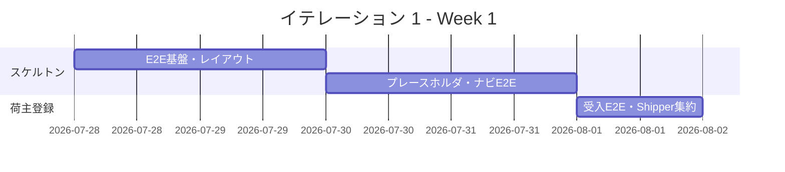
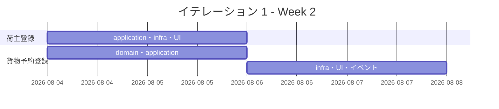
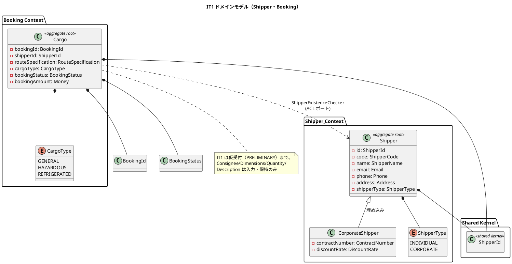
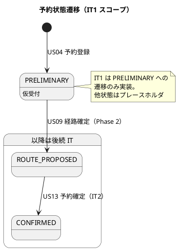
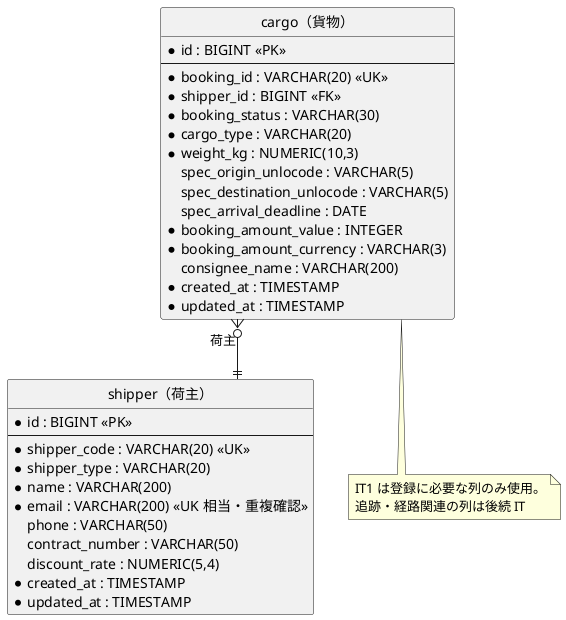
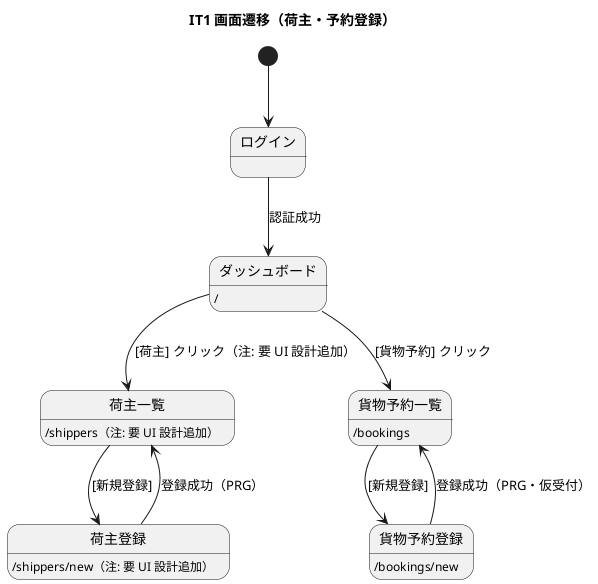

# イテレーション 1 計画

## 概要

| 項目 | 内容 |
|------|------|
| **イテレーション** | 1 |
| **期間** | Week 1-2（2 週間 / 2026-07-28 〜 2026-08-08） |
| **ゴール** | 荷主・貨物予約の登録を縦切りで通し、全ルートのナビゲーションと Playwright E2E 基盤を確立する（ウォーキングスケルトン） |
| **目標 SP** | 10 |
| **局面 / アプローチ** | 序盤 / アウトサイドイン（[開発戦略](development_strategy.md) 参照） |

---

## ゴール

### イテレーション終了時の達成状態

1. **ウォーキングスケルトン**: [UI 設計](../design/ui_design.md) の全ルートにプレースホルダ画面が存在し、ナビゲーションバー（ロール制御付き）から到達できる。Playwright E2E 基盤が動作し、全ナビゲーション遷移の E2E が green。
2. **荷主登録**: 個人・法人荷主を登録でき、荷主 ID が発行される（US02・US03）。
3. **貨物予約登録**: 既存荷主を参照して貨物予約を登録でき、予約番号が発行され状態が「仮受付（PRELIMINARY）」になる（US04）。

### 成功基準

- [ ] 全ルートのナビゲーション E2E（Playwright）が green
- [ ] US02・US03・US04 の受入基準を満たす
- [ ] `make check`（build + test + lint + arch）が green
- [ ] ドメイン層テストカバレッジ 90% 以上・全体 80% 以上
- [ ] ヘキサゴナル + BC 境界（`make arch`）が green

---

## ユーザーストーリー

### 対象ストーリー

| ID | ユーザーストーリー | SP | 優先度 |
|----|-------------------|----|----|
| US02 | 荷主を登録する | 3 | 必須 |
| US03 | 法人荷主を登録する | 2 | 必須 |
| US04 | 貨物予約を登録する | 5 | 必須 |
| **合計** | | **10** | |

### ストーリー詳細

#### US02: 荷主を登録する

**ストーリー**:
> 営業担当者として、新規荷主の氏名/社名・住所・連絡先・メールアドレスをシステムに登録したい。なぜなら、次回以降の予約で荷主情報の再入力を省略でき、顧客情報を一元管理できるからだ。

**受入条件**:

1. 氏名/社名・住所・連絡先・メールアドレス・荷主種別（個人/法人）を入力できる
2. 同一メールアドレスが既に登録されている場合、既存荷主として表示しどちらを使用するか選択できる
3. 登録完了後、荷主 ID が発行される
4. 荷主種別「個人」で登録できる

#### US03: 法人荷主を登録する

**ストーリー**:
> 営業担当者として、法人荷主の契約番号と割引率を含めて登録したい。なぜなら、法人契約条件（割引率）を精算時に自動適用できるからだ。

**受入条件**:

1. 荷主種別「法人」を選択すると、法人契約情報（契約番号・割引率）の入力フィールドが表示される
2. 割引率は 0〜30% の範囲で設定できる
3. 法人荷主で登録完了後、荷主 ID が発行される
4. 登録した法人情報は US22（法人割引を適用する）で参照される（IT1 では登録・保持のみ）

#### US04: 貨物予約を登録する

**ストーリー**:
> 営業担当者として、荷主 ID・貨物仕様（種別・重量・寸法・個数・品名）・輸送条件（出発地・目的地・希望日）を入力して予約を登録したい。なぜなら、荷主の見積承認後に正式な予約を受け付け、経路設計フェーズに引き継げるからだ。

**受入条件**:

1. 荷主 ID を入力して既存荷主を選択できる
2. 貨物種別・重量・寸法・個数・品名を入力できる
3. 出発地・目的地・希望引渡日・希望着日を入力できる
4. 登録完了後、予約番号が発行され状態が「仮受付（PRELIMINARY）」になる
5. 経路設計者に予約登録の通知が送信される（IT1 ではドメインイベント発行のみ。購読側の routing 実装は Phase 2）
6. 見積情報との整合性が確認される（IT1 対象外。estimation は Phase 2。本受入は Phase 2 で充足）

### タスク

序盤アプローチ（アウトサイドイン）に従い、E2E/受け入れテストの入口から `interfaces → application → domain → infrastructure` を薄く貫通させる。

#### 0. ウォーキングスケルトン基盤（3 SP 相当のオーバーヘッド）

| # | タスク | 見積もり | 担当 | 状態 |
|---|--------|---------|------|------|
| 0.1 | `web/` に Playwright E2E 基盤をセットアップ（設定・CI ジョブ雛形） | 4h | - | [ ] |
| 0.2 | `templates/layout.html`（`layout`・`navbar` フラグメント）と共通ミドルウェア・PRG・フラッシュを実装 | 4h | - | [ ] |
| 0.3 | UI 設計の全ルートにプレースホルダ画面を配置（ロール制御付き navbar から到達可能に） | 4h | - | [ ] |
| 0.4 | 全ナビゲーション遷移の E2E（ロール別の表示/非表示/403 含む）を作成し green にする | 4h | - | [ ] |

**小計**: 16h（理想時間）

#### 1. 荷主登録（US02・US03 / 5 SP）

| # | タスク | 見積もり | 担当 | 状態 |
|---|--------|---------|------|------|
| 1.1 | 荷主登録の受け入れ E2E（個人・法人）を先に記述（Red） | 3h | - | [ ] |
| 1.2 | `internal/shipper/domain`: Shipper 集約・値オブジェクト（ShipperCode/ShipperName/Email/Phone/Address/ContractNumber/DiscountRate）・ShipperType・CorporateShipper をユニットテストで実装 | 6h | - | [x] |
| 1.3 | `internal/shipper/application`: ShipperRepository ポート・登録コマンドサービス（メール重複確認含む）を実装 | 4h | - | [x] |
| 1.4 | `internal/shipper/infrastructure`: sqlc + pgx で shipper テーブル Repository を実装し testcontainers-go で検証 | 5h | - | [x] |
| 1.5 | `internal/shipper/interfaces`: `/shippers`・`/shippers/new`・`POST /shippers` の Handler・DTO・html/template（法人フィールドの htmx 表示切替） | 5h | - | [ ] |
| 1.6 | 割引率 0〜30% バリデーション・メール重複時の既存荷主選択フローを実画面へ差し替え | 3h | - | [ ] |

**小計**: 26h（理想時間）

#### 2. 貨物予約登録（US04 / 5 SP）

| # | タスク | 見積もり | 担当 | 状態 |
|---|--------|---------|------|------|
| 2.1 | 貨物予約登録の受け入れ E2E を記述（Red） | 3h | - | [ ] |
| 2.2 | `internal/booking/domain`: Cargo 集約・値オブジェクト（BookingId/RouteSpecification/Consignee/Dimensions/Quantity/Description/Money）・CargoType・BookingStatus をユニットテストで実装（初期状態 PRELIMINARY） | 7h | - | [ ] |
| 2.3 | `internal/booking/application`: CargoRepository ポート・ShipperExistenceChecker ACL ポート・予約登録コマンドサービスを実装 | 5h | - | [ ] |
| 2.4 | `internal/booking/infrastructure`: cargo テーブル Repository（sqlc + pgx）・ShipperExistenceChecker アダプター（shipper への ACL）を testcontainers-go で検証 | 6h | - | [ ] |
| 2.5 | `internal/booking/interfaces`: `/bookings`・`/bookings/new`・`POST /bookings` の Handler・DTO・template（荷主 ID 参照・貨物仕様入力） | 5h | - | [ ] |
| 2.6 | 予約登録時に `CargoBooked` ドメインイベントを発行（購読側はスタブ。Phase 2 で routing 実装） | 2h | - | [ ] |

**小計**: 28h（理想時間）

#### タスク合計

| カテゴリ | SP | 理想時間 | 状態 |
|---------|----|----|------|
| ウォーキングスケルトン基盤 | - | 16h | [ ] |
| 荷主登録（US02・US03） | 5 | 26h | [ ] |
| 貨物予約登録（US04） | 5 | 28h | [ ] |
| **合計** | **10** | **70h** | |

**1 SP あたり**: 約 7.0h（スケルトン基盤オーバーヘッド込み）
**進捗率**: 0% (0/10 SP)

---

## スケジュール

### Week 1（Day 1-5）



| 日 | タスク |
|----|--------|
| Day 1 | Playwright E2E 基盤・共通レイアウト（0.1・0.2） |
| Day 2 | 共通ミドルウェア・PRG・フラッシュ（0.2） |
| Day 3 | 全ルートのプレースホルダ画面（0.3） |
| Day 4 | 全ナビゲーション E2E green（0.4） |
| Day 5 | 荷主登録 受入 E2E・Shipper 集約（1.1・1.2） |

### Week 2（Day 6-10）



| 日 | タスク |
|----|--------|
| Day 6 | 荷主 application・infrastructure（1.3・1.4） |
| Day 7 | 荷主 interfaces・バリデーション（1.5・1.6） |
| Day 8 | 予約 受入 E2E・Cargo 集約・application（2.1・2.2・2.3） |
| Day 9 | 予約 infrastructure・interfaces・イベント（2.4・2.5・2.6） |
| Day 10 | 統合テスト、バグ修正、デモ準備、Release 0.1 リリース条件確認 |

---

## 設計

IT1 スコープ（Shipper Context・Booking Context）に絞って掲載する。

### ドメインモデル



### 状態遷移図（BookingStatus）



### データモデル（ER 図）



### 画面遷移図



### ディレクトリ構成

```text
apps/cargo-tracker/
├── internal/
│   ├── shipper/{domain,application,infrastructure,interfaces}
│   ├── booking/{domain,application,infrastructure,interfaces}
│   └── shared/domain            # ShipperId 等の共有カーネル
├── db/migrations                # shipper・cargo テーブル
├── db/queries                   # sqlc クエリ
└── web/                         # html/template・Playwright E2E
```

### API 設計

| メソッド | エンドポイント | 説明 |
|---------|---------------|------|
| GET | `/shippers` | 荷主一覧（注: 要 UI 設計追加） |
| GET | `/shippers/new` | 荷主登録フォーム（注: 要 UI 設計追加） |
| POST | `/shippers` | 荷主登録（個人・法人）・荷主 ID 発行 |
| GET | `/bookings` | 貨物予約一覧 |
| GET | `/bookings/new` | 貨物予約登録フォーム |
| POST | `/bookings` | 貨物予約登録・予約番号発行・PRELIMINARY |

### ADR

| ADR | タイトル | ステータス |
|-----|---------|-----------|
| [ADR-0001](../adr/0001-go-tech-stack.md) | Go スタック選定 | 承認 |
| [ADR-0002](../adr/0002-bounded-context-canon.md) | BC 正典（境界付けられたコンテキスト構成） | 承認 |
| [ADR-0004](../adr/0004-discount-rate-limit.md) | 割引率上限（0〜30%） | 承認 |

---

## 検証結果（validating-iteration-plan / validating-design）

着手前の整合性検証で以下を確認・是正した。

### 一致を確認した項目

- ストーリー ID・受入基準: `docs/requirements/user_story.md` の US02・US03・US04 と一致。
- 集約・値オブジェクト名: `docs/design/domain-model.md` の Shipper / CorporateShipper / Cargo / 各値オブジェクト・ShipperType・CargoType・BookingStatus と一致。
- テーブル・カラム: `docs/design/data-model.md` の shipper / cargo テーブルと一致。
- アプローチ・局面: `docs/development/development_strategy.md` の序盤 IT1-2 アウトサイドイン・ウォーキングスケルトン方針と一致。BC 独立性（booking → shipper は ShipperExistenceChecker ACL 経由のみ）を踏襲。

### 注（設計への反映が必要）

以下は上流設計ドキュメントの欠落・不整合であり、IT1 で設計ドキュメントへ反映する（設計と実装の同時反映）。

1. **UI 設計に荷主登録画面が欠落**: `docs/design/ui_design.md` の画面一覧に `/shippers`・`/shippers/new`（荷主一覧・荷主登録）が存在せず、US02・US03 が `/bookings`（貨物予約一覧）に誤って対応づけられている。navbar にも荷主メニューがない。→ IT1 で荷主画面 2 件と navbar 「荷主」メニュー（ROLE_SALES）を UI 設計に追加する。
2. **UI 設計の US 番号が乖離**: `ui_design.md` の「対応 US」列が `user_story.md` の番号体系と一致しない（例: UI 設計 US13→追跡入力 だが user_story では US13=予約確定）。→ UI 設計の対応 US 列を user_story の最新番号に整合させる（IT1 では荷主・予約登録に関係する行を是正し、全体整合は後続 IT で継続）。

---

## リスクと対策

| リスク | 影響度 | 対策 |
|--------|--------|------|
| UI 設計の荷主画面欠落による手戻り | 中 | 上記「注」のとおり IT1 で UI 設計へ画面・navbar を追加し、実装と同時反映する |
| ウォーキングスケルトンの構築が想定超過 | 中 | E2E 基盤とプレースホルダは最小に留め、遷移とロール制御のみ担保。実画面化は各ストーリータスクで実施 |
| sqlc + pgx の初回導入コスト | 中 | shipper の単純な CRUD で導入パターンを確立してから cargo に展開する |
| US04 の通知・見積整合が Phase 2 依存 | 低 | IT1 はドメインイベント発行までとし、購読側・見積整合は Phase 2 で充足（受入基準に明記） |

---

## 完了条件

### Definition of Done

- [ ] コードレビュー完了（self-review）
- [ ] ユニットテストがパス（`make test`、ドメイン層 90%）
- [ ] 統合テストがパス（`make test-integration`、testcontainers-go）
- [ ] 全ナビゲーション E2E がパス（Playwright）
- [ ] `make lint`（golangci-lint + govulncheck）エラーなし
- [ ] `make arch`（go-arch-lint）が green
- [ ] 機能がローカル環境で動作確認済み（`make watch`）
- [ ] UI 設計への荷主画面・navbar 反映（上記「注」）完了
- [ ] ドキュメント更新完了

### デモ項目

1. ログイン → ダッシュボードから全メニューへ遷移でき、ロールに応じて表示制御される（ウォーキングスケルトン）
2. 個人荷主を登録し、荷主 ID が発行される（US02）
3. 法人荷主を契約番号・割引率（0〜30%）付きで登録する（US03）
4. 既存荷主を参照して貨物予約を登録し、予約番号が発行され状態が「仮受付」になる（US04）

---

## 更新履歴

| 日付 | 更新内容 | 更新者 |
|------|---------|--------|
| 2026-07-24 | 初版作成。ウォーキングスケルトン + 荷主・貨物予約登録（US02・US03・US04、10 SP）。UI 設計の荷主画面欠落・US 番号乖離を「注」として記載。 | - |

---

## 関連ドキュメント

- [イテレーション 1 ふりかえり](./retrospective-1.md)（クローズ時に作成）
- [リリース計画](./release_plan.md)
- [開発戦略](./development_strategy.md)
