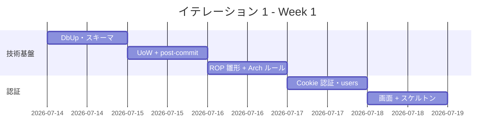
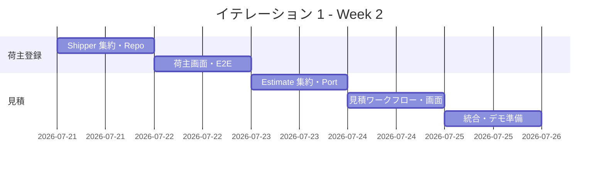

# イテレーション 1 計画

## 概要

| 項目 | 内容 |
|------|------|
| **イテレーション** | 1 |
| **期間** | 2026-07-14 〜 2026-07-25（2 週間） |
| **ゴール** | 技術基盤（DbUp・UnitOfWork + post-commit イベント・FsToolkit ROP ワークフロー・認証）を確立し、荷主登録と見積で最初の業務価値を届ける |
| **目標 SP** | 10（+ 基盤タスク） |

---

## ゴール

### イテレーション終了時の達成状態

1. **技術基盤**: DbUp が起動時に SQLite / PostgreSQL のマイグレーションを適用し、AggregateRoot + UnitOfWork + post-commit ディスパッチの参照実装がテスト付きで存在する。FsToolkit（`asyncResult` / `validation`）による CQRS ワークフローの雛形が確立している（MediatR 不使用）
2. **認証（基盤タスク）**: 業務ロールの Cookie 認証でログイン・ログアウトでき、未認証アクセスは `/login` にリダイレクトされる（Giraffe `requiresAuthentication` / `requiresRole`）
3. **荷主登録（US02/03）**: 営業担当者が個人・法人荷主を登録・一覧できる
4. **見積（US01）**: 営業担当者が輸送見積を作成し、スタブルート候補を確認できる

### 成功基準

- [ ] 「ログイン → 荷主登録 → 見積作成」が WebApplicationFactory 受入テストで一気通貫
- [ ] ロールバック時にドメインイベントが発行されないことを統合テストで実証（`UnitOfWorkTest`）
- [ ] スクリプト同期の検証テスト（両方言のバージョン一致）が動作
- [ ] 方言検出テスト（`NOW()` / `RETURNING` 等の禁止パターンのソース走査）が動作
- [ ] ArchUnitNET ルール（Domain → Infrastructure 非依存・Giraffe/Donald 非侵入）が緑
- [ ] テストカバレッジ 80% 以上（ドメイン層は先行 TDD で網羅、計測 coverlet は IT2 で CI 組込）

> **アプローチ（開発戦略 序盤＝アウトサイドイン）**: [開発戦略](./development_strategy.md#序盤-アウトサイドインit1-it2)に従い、各ストーリーは `HttpHandler`／WebApplicationFactory の受け入れテストを Red にする所から着手し、UI ニーズから Command／Port を導出して薄く縦に貫通させる。下記タスク表はレイヤー別の成果物一覧であり厳密な実装順ではない（実行順は「受け入れテスト Red → ドメイン最小 → Port スタブ → 縦貫通 → Refactor」）。認証基盤の確立後にウォーキングスケルトン（タスク 2.5）を骨格化する。

---

## ユーザーストーリー

### 対象ストーリー

| ID | ユーザーストーリー | SP | 優先度 |
|----|-------------------|----|----|
| US02 | 荷主を登録する | 3 | 必須 |
| US03 | 法人荷主を登録する | 2 | 必須 |
| US01 | 輸送見積を作成する | 5 | 必須 |
| **合計** | | **10** | |

### ストーリー詳細

#### US02: 荷主を登録する

**ストーリー**:
> 営業担当者として、新規荷主の氏名/社名・住所・連絡先・メールアドレスをシステムに登録したい。なぜなら、次回以降の予約で荷主情報の再入力を省略でき、顧客情報を一元管理できるからだ。

**受入条件**:

1. 氏名/社名・住所・連絡先・メールアドレス・荷主種別（個人/法人）を入力できる
2. 同一メールアドレスが既に登録されている場合、既存荷主として表示しどちらを使用するか選択できる
3. 登録完了後、荷主 ID が発行される
4. 荷主種別「個人」で登録できる

#### US03: 法人荷主を登録する

**ストーリー**:
> 営業担当者として、法人荷主の契約番号と割引率を含めて登録したい。なぜなら、法人契約条件（割引率）を精算時に自動適用できるからだ。

**受入条件**:

1. 荷主種別「法人」を選択すると、法人契約情報（契約番号・割引率）の入力フィールドが表示される
2. 割引率は 0〜30% の範囲で設定できる
3. 法人荷主で登録完了後、荷主 ID が発行される
4. 登録した法人情報は US22（法人割引を適用する）で参照される

#### US01: 輸送見積を作成する

**ストーリー**:
> 営業担当者として、荷主の輸送要件（出発地・目的地・希望期限・貨物種別・重量）を入力し、輸送料金と所要日数の見積を作成したい。なぜなら、荷主が予算と納期を事前に把握でき、予約決定を迅速に行えるからだ。

**受入条件**:

1. 出発地・目的地・希望期限・貨物種別・重量を入力できる
2. 航海スケジュール情報をもとにルート概算候補が表示される
3. ルート候補ごとに「経由港・所要日数・概算料金・航海番号」が表示される
4. 見積情報が保存され、見積番号が発行される
5. 希望期限に間に合うルートが存在しない場合、その旨が通知される
6. 危険物が含まれる場合、危険物申告情報の入力フォームが表示される

> **注**: IT1 時点では航海スケジュール（US24/25、IT3）が未実装のため、ルート候補算出は WireMock.Net で契約を固定したスタブ（`ExternalRoutingServicePort` 関数レコード）で提供する。受入条件 2 の「航海スケジュール情報をもとに」はスタブ応答で代替し、IT3 で実データに差し替える。

### タスク

#### 1. 技術基盤（ストーリー外・基盤）

| # | タスク | 見積もり | 担当 | 状態 |
|---|--------|---------|------|------|
| 1.1 | DbUp 起動時配線（プロバイダ判定・`Scripts/postgresql|sqlite` 適用） | 3h | - | [ ] |
| 1.2 | 初期スキーマ（両方言・per-story: 0001 users / 0002 shipper / 0003 estimate・route_candidate） | 3h | - | [ ] |
| 1.3 | AggregateRoot + UnitOfWork + post-commit ディスパッチ（関数合成・MediatR 不使用） | 4h | - | [ ] |
| 1.4 | ロールバック時イベント非発行の統合テスト（`UnitOfWorkTest`） | 2h | - | [ ] |
| 1.5 | 方言検出テスト（禁止パターン走査）+ スクリプト同期検証を CI に追加 | 2h | - | [ ] |
| 1.6 | FsToolkit ROP ワークフロー雛形（`asyncResult` / `validation` CE の Command 処理）＋ ArchUnitNET レイヤールール | 2h | - | [ ] |
| 1.7 | 時刻・GUID 注入ポート（`Clock: unit -> DateTimeOffset` / `IdGenerator`）の参照実装（ADR-0006・EstimateId.generate で使用） | 2h | - | [~] |

**小計**: 18h（理想時間）

> **状態凡例**: `[x]` 完了 / `[~]` 部分完了 / `[ ]` 未着手。
>
> **1.3 注**: ドメインイベントはコミット成功後（post-commit）に関数の部分適用でディスパッチする。イベント発行を Port（関数レコード）に閉じ込め、UnitOfWork がコミット結果に応じて発火する。
> **1.4 注**: UoW のコミット/ロールバック挙動は方言非依存のため SQLite in-memory で検証（Testcontainers はリポジトリ SQL 検証に使用）。
> **1.6 注**: F# のファイル順コンパイル（Domain → Application → Infrastructure → Interfaces）で依存方向を静的保証し、ArchUnitNET で補完検証する。

#### 2. 認証（基盤タスク・Cookie 認証）

| # | タスク | 見積もり | 担当 | 状態 |
|---|--------|---------|------|------|
| 2.1 | Cookie 認証構成（ログインパス・未認証リダイレクト・公開パス除外） | 2h | - | [ ] |
| 2.2 | users / user_roles リポジトリ（Donald）+ パスワードハッシュ（PBKDF2 相当） | 3h | - | [ ] |
| 2.3 | ログイン / ログアウト画面（Giraffe.ViewEngine、エラー表示・入力保持） | 2h | - | [ ] |
| 2.4 | ロール別ナビゲーション制御（`requiresRole`）+ シードユーザー投入 | 2h | - | [ ] |
| 2.5 | ウォーキングスケルトン: 画面一覧（ui_design）準拠の全ルートにロール制御付きプレースホルダを一括作成 | 2h | - | [ ] |
| 2.6 | ナビゲーション整合性: navbar ビュー関数＋ダッシュボードにロール条件付きで反映し、ロール別ナビ表示の検証テスト（WebApplicationFactory）を追加 | 2h | - | [ ] |

**小計**: 13h（理想時間）

> **注（認証方針・data-model 準拠）**: ASP.NET Core Identity は導入せず Cookie 認証 + Donald 軽量ユーザーストア + パスワードハッシュを採用。ユーザー・ロールは data-model.md（正）に従い `users` テーブル + `user_roles`（多対多）テーブルで管理し、Giraffe の `requiresAuthentication` / `requiresRole` と統合する。ロールは `ROLE_SALES` 等の `ROLE_` プレフィックス表記（ui_design のロール別ナビゲーションマトリクスを正とする）。公開追跡ページ（`/public/tracking/{accessToken}`）と `/health` は未認証で許可する。

#### 3. US02/US03: 荷主登録（5 SP）

| # | タスク | 見積もり | 担当 | 状態 |
|---|--------|---------|------|------|
| 3.1 | Shipper 集約（個人/法人・DiscountRate 0-30% スマートコンストラクタ）ユニット + FsCheck | 3h | - | [x] |
| 3.2 | ShipperRepository（Donald 手書き SQL・レコードマッピング）統合テスト | 3h | - | [x] |
| 3.3 | 荷主一覧 / 登録画面（`/shippers`, `/shippers/new`、種別切替・重複メール確認・htmx） | 4h | - | [ ] |
| 3.4 | Playwright E2E テスト（ログイン → 荷主登録 → 一覧表示） | 2h | - | [ ] |

**小計**: 12h（理想時間）

> **注**: 楽観的ロック（version 更新）は登録のみの US02/03 では不要のため未実装（列は用意済み）。更新系ストーリー着手時に実装する。

#### 4. US01: 輸送見積（5 SP）

| # | タスク | 見積もり | 担当 | 状態 |
|---|--------|---------|------|------|
| 4.1 | Estimate 集約（EstimateId は IdGenerator ポート経由・RouteCandidate・出発地/仕向地の UN/LOCODE 検証）ユニット + FsCheck | 3h | - | [x] |
| 4.2 | ExternalRoutingServicePort スタブ実装（関数リテラル・WireMock.Net 契約テストは IT3） | 3h | - | [ ] |
| 4.3 | 見積作成ワークフロー（`asyncResult` 合成・危険物申告分岐・期限超過通知） | 3h | - | [ ] |
| 4.4 | 見積作成画面（`/estimates/new`・候補一覧表示・危険物フォーム）+ EstimateRepository | 4h | - | [ ] |

**小計**: 13h（理想時間）

#### タスク合計

| カテゴリ | SP | 理想時間 | 状態 |
|---------|----|----|------|
| 技術基盤 | - | 18h | [ ] |
| 認証（基盤） | - | 13h | [ ] |
| US02/US03 荷主登録 | 5 | 12h | [ ] |
| US01 輸送見積 | 5 | 13h | [ ] |
| **合計** | **10** | **56h** | |

**1 SP あたり**: 約 2.5h（ストーリー分のみ 25h / 10 SP。基盤 31h を含めた総見積 56h）
**進捗率**: 0% (0/10 SP)

---

## スケジュール

### Week 1（Day 1-5）: 技術基盤 + 認証

| 日 | タスク |
|----|--------|
| Day 1 | DbUp 起動時配線・初期スキーマ（両方言） |
| Day 2 | AggregateRoot + UnitOfWork + post-commit・ロールバックテスト |
| Day 3 | 方言検出/同期テスト・FsToolkit ROP 雛形・ArchUnitNET ルール |
| Day 4 | Cookie 認証構成・users リポジトリ・パスワードハッシュ |
| Day 5 | ログイン/ログアウト画面・ロール別ナビ・ウォーキングスケルトン |

### Week 2（Day 6-10）: 荷主登録 + 見積

| 日 | タスク |
|----|--------|
| Day 6 | Shipper 集約（FsCheck）・ShipperRepository 統合テスト |
| Day 7 | 荷主一覧/登録画面・Playwright E2E |
| Day 8 | Estimate 集約・ExternalRoutingServicePort スタブ |
| Day 9 | 見積作成ワークフロー・見積画面・EstimateRepository |
| Day 10 | 統合テスト、バグ修正、デモ準備 |

---

## 設計

参照する設計ドキュメント:

- [ドメインモデル設計](../design/domain-model.md)（Shipper / Estimate 集約）
- [データモデル設計](../design/data-model.md)（users / shipper / estimate テーブル）
- [UI 設計](../design/ui_design.md)（画面遷移図・荷主/見積画面）
- [バックエンドアーキテクチャ](../design/architecture_backend.md)（ヘキサゴナル + ROP）

### ADR

IT1 が前提とする ADR:

**既存（承認済み）** — IT1 で参照実装する:

| ADR | タイトル | ステータス |
|-----|---------|-----------|
| [ADR-0001](../adr/0001-モジュール構成は垂直スライスを採用.md) | モジュール構成は垂直スライス（コンテキストファースト）を採用 | 承認済み |
| [ADR-0002](../adr/0002-ドメインイベントはPayloadレコード方式とpost-commitディスパッチを採用.md) | ドメインイベントは Payload レコード方式 + post-commit ディスパッチを採用 | 承認済み |
| [ADR-0003](../adr/0003-DBマイグレーションはDbUpによるforward-only方式を採用.md) | DB マイグレーションは DbUp による forward-only 方式を採用 | 承認済み |

**IT1 で新規起票する**:

| ADR | タイトル | ステータス |
|-----|---------|-----------|
| ADR-0004 | Donald による DDD 集約の永続化パターン（手書き SQL・楽観ロック） | 提案 |
| ADR-0005 | Cookie 認証 + `users`/`user_roles` による RBAC | 提案 |
| ADR-0006 | 時刻・GUID の注入ポート（`Clock: unit -> DateTimeOffset` / `IdGenerator`） | 提案 |

> **注**: DomainEvent 設計の統一（Payload レコード方式）とモジュール構成の一本化（垂直スライス）は
> 既存の ADR-0002 / ADR-0001 で確定済みであり、新規 ADR は不要（設計レビュー 2026-07-06 の高優先度指摘は解消済み）。
> ADR-0006 は同レビューの「時刻・GUID 注入ポート未設計」指摘への対応として起票する。

---

## 過去レビュー対応（設計ドキュメントレビュー 2026-07-06）

[F# 版設計ドキュメントレビュー](../review/設計ドキュメント_review_20260706.md)（高 14 / 中 18 / 低 6）のうち、IT1 着手前に対応する高優先度指摘と対応方針。

| 指摘 | 内容 | IT1 での対応 |
|------|------|-------------|
| 高（architect） | DomainEvent 設計がドキュメント間で矛盾（巨大 DU vs Payload レコード） | 解消済み（ADR-0002 で Payload レコード方式に確定） |
| 高（architect） | モジュール構成・名前空間が 2 ドキュメントで逆 | 解消済み（ADR-0001 で垂直スライスに確定） |
| 高（architect） | ADR-0002/0003 が未起票 | 解消済み（ADR-0002/0003 起票・承認済み） |
| 高（tester） | 時刻・乱数注入ポート未設計（`EstimateId.generate` 等） | ADR-0006・タスク 1.7 で Clock/IdGenerator ポートを参照実装 |
| 高（tester） | SQLite/PostgreSQL 二方言テストギャップ | タスク 1.5 の方言検出テスト + Testcontainers で対応 |
| 高（pm） | コンテキスト数の記述が不統一（8/7/6/5） | 解消済み（domain-model・architecture_backend・design/index で「7 + Shared」に統一） |
| 高（pm/architect） | domain-model / architecture_backend に US トレーサビリティ断絶 | 解消済み（architecture_backend に各 BC の「対応 US」行を追加済み） |
| 中（pm） | US-ADM-01 が user_story に存在しない設計先行 | 解消済み（user_story.md に US-ADM-01 を正式化・IT7 に配置） |

> **注**: ACL ポート名の不統一（`ExternalRoutingPort` / `ExternalRoutingServicePort`）は `ExternalRoutingServicePort` に統一済み（architecture_backend・tech_stack を修正）。Booking Context 内の US14 業務解釈（追跡番号発行の導線）は IT5 で確定する。

## リスクと対策

| リスク | 影響度 | 対策 |
|--------|--------|------|
| Donald の集約永続化パターンが未確立で見積超過 | 高 | Shipper を参照実装として先行確立し、以降のリポジトリに横展開 |
| post-commit イベント基盤（関数合成）の不具合波及 | 高 | ロールバック時非発行テストを必須ゲート化 |
| F# ファイル順コンパイル制約による設計手戻り | 中 | Day 1-3 でレイヤー配置を確定し ArchUnitNET で早期検証 |

---

## 完了条件

### Definition of Done

- [ ] コードレビュー完了（self-review: xp-programmer / xp-tester）
- [ ] ユニット・統合・アーキテクチャテストがパス
- [ ] Playwright E2E（ログイン → 荷主登録）がパス
- [ ] ロール別ナビゲーション表示の検証テスト（navbar／ダッシュボード）がパス
- [ ] Fantomas フォーマットクリーン・FSharpLint 警告なし・ビルド警告 0
- [ ] 機能がローカル環境で動作確認済み
- [ ] ドキュメント更新完了（release_plan 進捗・ADR）

### デモ項目

1. ロール別ログイン・ログアウト
2. 個人/法人荷主の登録と一覧表示
3. 輸送見積の作成とスタブルート候補の表示

---

## 更新履歴

| 日付 | 更新内容 | 更新者 |
|------|---------|--------|
| 2026-07-14 | 初版作成（US02/US03/US01・10 SP + 技術基盤）。F# 技術スタック（Giraffe/Donald/FsToolkit ROP）に適応 | - |

---

## 関連ドキュメント

- [リリース計画](./release_plan.md)
- [イテレーション 1 ふりかえり](./retrospective-1.md)（IT1 完了時に作成）
