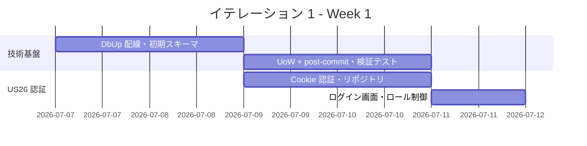
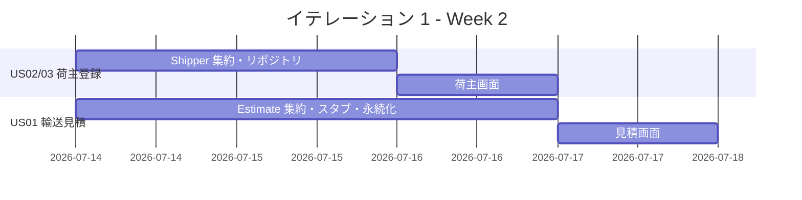
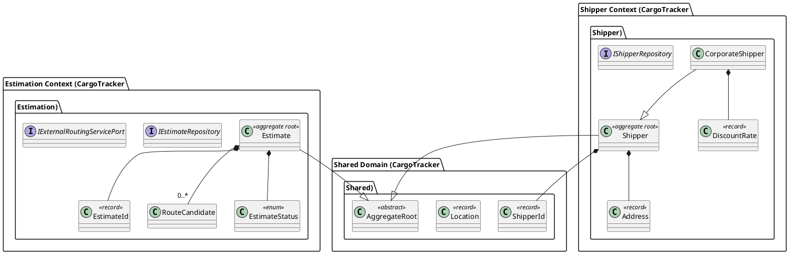
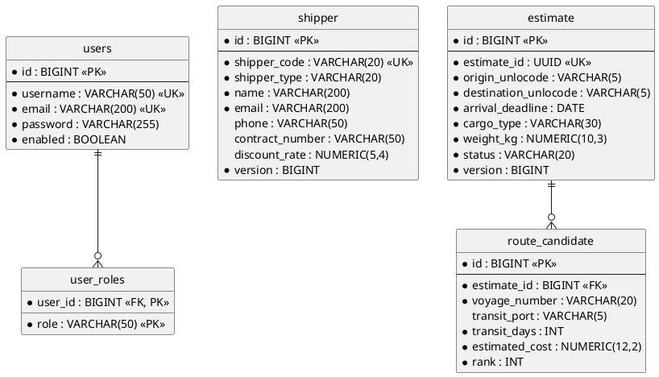
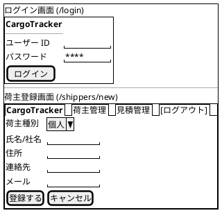
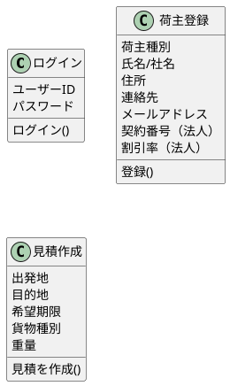
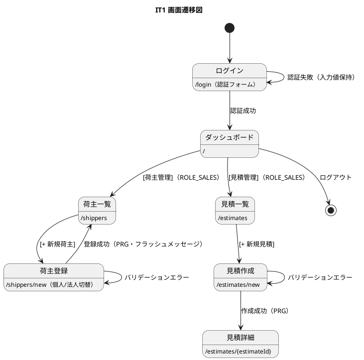

# イテレーション 1 計画

## 概要

| 項目 | 内容 |
|------|------|
| **イテレーション** | 1 |
| **期間** | 2026-07-07 〜 2026-07-18（2 週間） |
| **ゴール** | 技術基盤（DbUp・UoW + post-commit イベント）と認証を確立し、荷主登録と見積で最初の業務価値を届ける |
| **目標 SP** | 13 |

---

## ゴール

### イテレーション終了時の達成状態

1. **技術基盤**: DbUp が起動時に SQLite / PostgreSQL のマイグレーションを適用し、AggregateRoot + IUnitOfWork + post-commit ディスパッチ（ADR-0001/0002）の参照実装がテスト付きで存在する
2. **認証（US26）**: 6 ロールの Cookie 認証でログイン・ログアウトでき、未認証アクセスは `/login` にリダイレクトされる
3. **荷主登録（US02/03）**: 営業担当者が個人・法人荷主を登録・一覧できる
4. **見積（US01）**: 営業担当者が輸送見積を作成し、スタブルート候補を確認できる

### 成功基準

- [x] 「ログイン → 荷主登録 → 見積作成」が WebApplicationFactory 受入テストで一気通貫（Heroku デプロイでのデモは IT 完了後に実施）
- [x] ロールバック時にドメインイベントが発行されないことを統合テストで実証（ADR-0002 コンプライアンス・`UnitOfWorkTest`）
- [x] スクリプト同期の検証テスト（両方言のバージョン一致）が動作（ADR-0003 #3・`MigrationScriptSyncTest`）
- [x] 方言検出テスト（`NOW()` / `RETURNING` 等の禁止パターンのソース走査）が動作（ADR-0003 #2・`SqlDialectComplianceTest`・レビュー #24）
- [ ] テストカバレッジ計測（coverlet）は未実施 → IT2 で CI に組み込み（現状の実装はドメイン先行 TDD でドメイン層を網羅）

> **IT1 実績（tracking-progress 2026-07-08）**: 計画 13 SP を全完了（達成率 100%）。全 62 テストパス（Domain 26 / App 4 / Infra 15 / Web 16 / Arch 1）、ビルド警告 0、`dotnet format` クリーン。

---

## ユーザーストーリー

### 対象ストーリー

| ID | ユーザーストーリー | SP | 優先度 |
|----|-------------------|----|----|
| US26 | システムにログインする | 3 | 必須 |
| US02 | 荷主を登録する | 3 | 必須 |
| US03 | 法人荷主を登録する | 2 | 必須 |
| US01 | 輸送見積を作成する | 5 | 必須 |
| **合計** | | **13** | |

### ストーリー詳細

#### US26: システムにログインする

**ストーリー**:
> 業務ユーザー（営業担当者・経路設計者・追跡管理者・荷役作業員・経理担当者・管理者）として、ユーザー ID とパスワードでシステムにログインし、自分のロールに応じた画面・機能だけを利用したい。なぜなら、業務データ（荷主情報・予約・請求）への不正アクセスを防ぎ、誰がどの操作を行ったかを追跡できるからだ。

**受入条件**:

1. ユーザー ID とパスワードでログインできる（Cookie 認証）
2. 認証失敗時はエラーメッセージが表示され、入力値は保持される
3. 未認証で保護ページにアクセスするとログイン画面へリダイレクトされる
4. 公開貨物追跡ページ（`/public/tracking/{trackingId}`）と `/health` は未認証でアクセスできる
5. ログアウトするとセッションが破棄されログイン画面に戻る
6. ロール（ROLE_ADMIN / ROLE_SALES / ROLE_ROUTE_DESIGNER / ROLE_TRACKER / ROLE_HANDLER / ROLE_BILLING）に応じてナビゲーションと機能が制御される（ADR-0004。ROLE_SHIPPER / ROLE_CONSIGNEE は後続 IT に繰り延べ）
7. パスワードはハッシュ化（`PasswordHasher`・PBKDF2／BCrypt 相当）して保存される

#### US02: 荷主を登録する

**ストーリー**:
> 営業担当者として、新規荷主の氏名/社名・住所・連絡先・メールアドレスをシステムに登録したい。なぜなら、次回以降の予約で荷主情報の再入力を省略でき、顧客情報を一元管理できるからだ。

**受入条件**:

1. 氏名/社名・住所・連絡先・メールアドレス・荷主種別（個人/法人）を入力できる
2. 同一メールアドレスが既に登録されている場合、既存荷主として表示しどちらを使用するか選択できる
3. 登録完了後、荷主 ID が発行される
4. 荷主種別「個人」で登録できる

#### US03: 法人荷主を登録する

**ストーリー**:
> 営業担当者として、法人荷主の契約番号と割引率を含めて登録したい。なぜなら、法人契約条件（割引率）を精算時に自動適用できるからだ。

**受入条件**:

1. 荷主種別「法人」を選択すると、法人契約情報（契約番号・割引率）の入力フィールドが表示される
2. 割引率は 0〜30% の範囲で設定できる
3. 法人荷主で登録完了後、荷主 ID が発行される
4. 登録した法人情報は US22（法人割引を適用する）で参照される

#### US01: 輸送見積を作成する

**ストーリー**:
> 営業担当者として、荷主の輸送要件（出発地・目的地・希望期限・貨物種別・重量）を入力し、輸送料金と所要日数の見積を作成したい。なぜなら、荷主が予算と納期を事前に把握でき、予約決定を迅速に行えるからだ。

**受入条件**:

1. 出発地・目的地・希望期限・貨物種別・重量を入力できる
2. 航海スケジュール情報をもとにルート概算候補が表示される
3. ルート候補ごとに「経由港・所要日数・概算料金・航海番号」が表示される
4. 見積情報が保存され、見積番号が発行される
5. 希望期限に間に合うルートが存在しない場合、その旨が通知される
6. 危険物が含まれる場合、危険物申告情報の入力フォームが表示される

> **注**: IT1 時点では航海スケジュール（US24/25、IT3）が未実装のため、ルート候補算出は WireMock.Net で契約を固定したスタブ（`IExternalRoutingServicePort`）で提供する。受入条件 2 の「航海スケジュール情報をもとに」はスタブ応答で代替し、IT3 で実データに差し替える。

### タスク

#### 1. 技術基盤（ストーリー外・ADR-0001/0002/0003 の実装）

| # | タスク | 見積もり | 担当 | 状態 |
|---|--------|---------|------|------|
| 1.1 | DbUp 起動時配線（プロバイダ判定・`Scripts/postgresql|sqlite` 適用） | 3h | - | [x] |
| 1.2 | 初期スキーマ（両方言・per-story: 0001 users / 0002 shipper / 0003 estimate・route_candidate） | 3h | - | [x] |
| 1.3 | AggregateRoot 基底クラス + IUnitOfWork + post-commit ディスパッチ実装 | 4h | - | [x] |
| 1.4 | ロールバック時イベント非発行の統合テスト（`UnitOfWorkTest`） | 2h | - | [x] |
| 1.5 | 方言検出テスト（禁止パターン走査）+ スクリプト同期検証を CI に追加 | 2h | - | [x] |
| 1.6 | CQRS 段階適用の判断を ADR 化（レビュー #23・ADR-0005） | 1h | - | [x] |

**小計**: 15h（理想時間）

> **状態凡例**: `[x]` 完了 / `[~]` 部分完了 / `[ ]` 未着手。
>
> **1.2 注**: 当初の「0001＝5 テーブル一括」から per-story マイグレーション方針に変更（validating-design）。`user_roles` は ADR-0004（単一 role カラム）により不採用。
> **1.4 注**: UoW のコミット/ロールバック挙動は方言非依存のため SQLite in-memory で検証（Testcontainers はリポジトリ SQL 検証に使用）。
> **1.5 完了**: スクリプト同期検証（`MigrationScriptSyncTest`）+ 禁止パターン走査（`SqlDialectComplianceTest`・`NOW()`/`RETURNING`/`ILIKE`/`ON CONFLICT`/`JSONB`/`::` を検出）を実装。CI（`backend-ci.yml` の `dotnet test` 全体実行）に自動包含される。
> **1.6 完了**: CQRS 段階適用の判断を [ADR-0005](../adr/0005-CQRSの段階的適用.md)（サービス分離・単一 DB・イベントソーシングなし）として起票・承認。IT1 の Shipper/Estimation で参照実装済み。

#### 2. US26: システムにログインする（3 SP）

| # | タスク | 見積もり | 担当 | 状態 |
|---|--------|---------|------|------|
| 2.1 | Cookie 認証構成（ログインパス・未認証リダイレクト・公開パス除外・ADR-0004） | 2h | - | [x] |
| 2.2 | users リポジトリ（Dapper・単一 role カラム）+ パスワードハッシュ（`PasswordHasher`） | 3h | - | [x] |
| 2.3 | ログイン / ログアウト画面（Razor、エラー表示・入力保持） | 2h | - | [x] |
| 2.4 | ロール別ナビゲーション制御 + シードユーザー投入 | 2h | - | [x] |
| 2.5 | ウォーキングスケルトン: 画面遷移図準拠の全ルートにロール制御付きプレースホルダを一括作成（development_strategy 序盤方針） | 2h | - | [x] |

> **注（ADR-0004）**: full ASP.NET Core Identity は導入せず Cookie 認証 + Dapper 軽量ユーザーストア + `PasswordHasher` を採用。ロールは 1 ユーザー 1 ロール（`users.role`）とし `user_roles` テーブルは導入しない（多ロール要件発生時に再検討）。
>
> **注（序盤アプローチ）**: 開発戦略の序盤（アウトサイドイン）に従い、認証基盤の確立後に [ui_design 画面遷移図](../design/ui_design.md#画面遷移図) 準拠のナビゲーションと全ルートのプレースホルダを一括作成し、ウォーキングスケルトンの骨格とする。以降の US はプレースホルダを実画面へ差し替える。

**小計**: 11h（理想時間）

#### 3. US02/US03: 荷主登録（5 SP）

| # | タスク | 見積もり | 担当 | 状態 |
|---|--------|---------|------|------|
| 3.1 | Shipper 集約（個人/法人、DiscountRate 0-30% 検証）ユニットテスト | 3h | - | [x] |
| 3.2 | ShipperRepository（ADR-0001 参照実装）統合テスト | 3h | - | [x] |
| 3.3 | 荷主一覧 / 登録画面（`/shippers`, `/shippers/new`、種別切替・重複メール確認） | 4h | - | [x] |
| 3.4 | Playwright E2E テスト（ログイン → 荷主登録 → 一覧表示） | 2h | - | [x] |

**小計**: 12h（理想時間）

> **注**: 楽観的ロック（version 更新）は登録のみの US02/03 では不要のため未実装（列は用意済み）。更新系ストーリー着手時に ADR-0001 準拠で実装する。

#### 4. US01: 輸送見積（5 SP）

| # | タスク | 見積もり | 担当 | 状態 |
|---|--------|---------|------|------|
| 4.1 | Estimate 集約（EstimateId・RouteCandidate・出発地仕向地検証）ユニットテスト | 3h | - | [x] |
| 4.2 | IExternalRoutingServicePort スタブ実装（WireMock.Net 契約テストは IT3 で追加） | 3h | - | [x] |
| 4.3 | EstimateRepository（estimate / route_candidate 集約永続化）統合テスト | 3h | - | [x] |
| 4.4 | 見積一覧 / 作成 / 詳細画面（`/estimates`, `/estimates/new`, `/estimates/{estimateId}`） | 4h | - | [x] |
| 4.5 | Playwright E2E テスト（ログイン → 見積作成 → 詳細でルート候補表示） | 2h | - | [x] |

**小計**: 15h（理想時間）

> **注**: ルート算出は IT1 では素の型付きスタブ（`StubExternalRoutingService`）で提供。WireMock.Net による契約テストは航海スケジュール実装の IT3 で `IExternalRoutingServicePort` の契約固定と同時に追加する。

#### タスク合計

| カテゴリ | SP | 理想時間 | 状態 |
|---------|----|----|------|
| 技術基盤 | - | 15h | [x]（1.1-1.6 全完了） |
| US26 認証 | 3 | 9h | [x] |
| US02/03 荷主登録 | 5 | 10h | [x] |
| US01 輸送見積 | 5 | 13h | [x] |
| **合計** | **13** | **47h** | |

**1 SP あたり**: 約 2.5h（基盤 15h を除く）
**進捗率**: 100% (13/13 SP)

---

## スケジュール

### Week 1（Day 1-5: 07-07 〜 07-11）



| 日 | タスク |
|----|--------|
| Day 1 | 1.1 DbUp 配線 |
| Day 2 | 1.2 初期スキーマ 0001 |
| Day 3 | 1.3 UoW + post-commit / 2.1 認証構成 |
| Day 4 | 1.4-1.5 検証テスト・CI / 2.2 users リポジトリ |
| Day 5 | 2.3-2.4 ログイン画面・ロール制御 / 1.6 ADR |

### Week 2（Day 6-10: 07-14 〜 07-18）



| 日 | タスク |
|----|--------|
| Day 6 | 3.1 Shipper 集約 / 4.1 Estimate 集約 |
| Day 7 | 3.2 ShipperRepository / 4.2 ルーティングスタブ |
| Day 8 | 3.3 荷主画面 / 4.3 EstimateRepository |
| Day 9 | 4.4 見積画面 |
| Day 10 | 統合テスト、バグ修正、デモ準備（Heroku デプロイ） |

---

## 設計

### ドメインモデル

domain-model.md（Shipper Context / Estimation Context / Shared Domain）を正とする。



> **注**: `AggregateRoot` 基底クラスは ADR-0002 で導入を決定した基盤要素であり、domain-model.md には未記載。IT1 完了時に domain-model.md（共有カーネル節）へ反映する。
>
> **注**: 認証（users / user_roles）は業務ドメインではなくインフラ関心事のため、`Shared/Infrastructure` 配下で実装しドメインモデルには含めない（architecture_backend.md の Shared 構成に準拠）。

### データモデル

data-model.md のテーブル定義（Shared Domain / Booking Context / Estimation Context）を正とする。IT1 で作成するのは以下の 5 テーブル。



- 全テーブルに `created_at` / `updated_at`（`TIMESTAMP WITH TIME ZONE NOT NULL`）を付与（監査カラム規約）
- タイムスタンプはアプリ側 `DateTimeOffset.UtcNow` をパラメータで渡す（実行時 SQL に `NOW()` 禁止。ADR-0003）
- 集約ルート表（shipper / estimate）に `version` 列（楽観的ロック。ADR-0001・設計判断 #8）

### ユーザーインターフェース

ui_design.md の画面詳細設計（ログイン / 荷主一覧 / 荷主登録 / 見積一覧 / 見積作成 / 見積詳細）を正とする。

#### ビュー



（見積作成・一覧・詳細のワイヤーフレームは ui_design.md の該当節を参照）

#### モデル



#### インタラクション



- 荷主種別の法人切替は htmx（`hx-get` で法人フィールドのパーシャルを `hx-target` に挿入）
- 成功メッセージは TempData フラッシュ（`alert-success`）、htmx エラーは `htmx:responseError` でトースト表示（ui_design.md 規約）

### ディレクトリ構成

```
apps/cargo-tracker/src/CargoTracker.Web/
├── Shipper/{Domain,Application/Internal,Infrastructure}/   # US02/03
├── Estimation/{Domain,Application/Internal,Infrastructure}/ # US01（新設）
├── Shared/
│   ├── Domain/Model/            # AggregateRoot, ShipperId, Location
│   └── Infrastructure/
│       ├── Auth/                # US26（Cookie 認証・users リポジトリ）
│       ├── Persistence/         # UnitOfWork, DbUp ブートストラップ
│       └── Config/
├── Pages/                       # Razor コントローラー
└── Scripts/{postgresql,sqlite}/ # 0001_initial_schema.sql ほか
```

### API 設計

| メソッド | エンドポイント | 説明 |
|---------|---------------|------|
| GET/POST | /login, /logout | 認証（US26） |
| GET | /shippers | 荷主一覧 |
| GET/POST | /shippers/new | 荷主登録（PRG） |
| GET | /estimates | 見積一覧 |
| GET/POST | /estimates/new | 見積作成（PRG） |
| GET | /estimates/{estimateId} | 見積詳細（ルート候補一覧） |

### データベーススキーマ

DbUp のバージョン付きスクリプトを **ストーリー単位で前進的（forward-only）に追加**する（`Scripts/postgresql/` と `Scripts/sqlite/` を同一バージョンで並行管理・ADR-0003）。IT1 では `0001_initial_schema.sql`（`users` テーブル・US26 認証基盤）を作成し、荷主・見積のテーブルは後続スクリプト（0002 以降）で追加する。監査カラム（`created_at`・`updated_at`）+ `version` を付与し、方言差分は BIGSERIAL ⇔ INTEGER AUTOINCREMENT・TIMESTAMPTZ ⇔ TEXT 等に限定する。

> **注**: 当初の「0001＝5 テーブル一括」から、DbUp の forward-only 思想（適用済みスクリプトは不変）に沿った per-story マイグレーション方針に変更（validating-design 2026-07-08）。

### ADR

| ADR | タイトル | ステータス |
|-----|---------|-----------|
| [ADR-0001](../adr/0001-集約永続化戦略.md) | Dapper による集約永続化戦略 | 承認（本 IT で参照実装） |
| [ADR-0002](../adr/0002-UnitOfWorkとpost-commitイベントディスパッチ.md) | UoW と post-commit ディスパッチ | 承認（本 IT で参照実装） |
| [ADR-0003](../adr/0003-開発SQLite本番PostgreSQLの二方言運用.md) | 二方言運用 | 承認（本 IT で検出テスト実装） |
| [ADR-0004](../adr/0004-Cookie認証と軽量ユーザーストア.md) | Cookie 認証と Dapper 軽量ユーザーストア | 承認（本 IT の US26 で実装） |
| [ADR-0005](../adr/0005-CQRSの段階的適用.md) | CQRS の段階的適用（サービス分離・単一 DB） | 承認（本 IT で参照実装） |

---

## リスクと対策

| リスク | 影響度 | 対策 |
|--------|--------|------|
| Dapper 集約永続化パターンの確立に想定以上の時間がかかる | 高 | Week 1 で Shipper を参照実装として先行。難航時は US01 の画面（4.4）をフィーチャバッファへ |
| 二方言スキーマ（0001）の SQLite 差分でハマる | 中 | 方言差分を BIGSERIAL/IDENTITY と TIMESTAMPTZ に限定し、CI のスクリプト同期検証で早期検知 |
| 認証とロール制御の作り込み過ぎ | 中 | US26 の受入条件のみ実装（パスワード有効期限・ロックは非機能要件の後続 IT へ） |
| 外部ルーティングスタブの契約が IT3 で覆る | 中 | WireMock.Net の契約を `IExternalRoutingServicePort` の型に固定し、差し替え面をポートに限定 |

---

## 完了条件

### Definition of Done

- [ ] コードレビュー完了（self-review + developing-review）← IT 完了レビューで実施予定
- [x] ユニットテストがパス（ドメイン 26 件。カバレッジ計測は IT2 で CI 導入）
- [x] 統合テストがパス（Testcontainers PostgreSQL・ロールバック時イベント非発行を含む）
- [x] dotnet format / Analyzers エラーなし（警告 0）
- [ ] 機能が Heroku 開発環境で動作確認済み ← IT 完了後にデプロイ実施
- [x] ドキュメント更新完了（ADR-0004 起票・設計整合修正・進捗反映）

### デモ項目

1. ログイン（成功・失敗・未認証リダイレクト）とロール別ナビゲーション
2. 個人荷主・法人荷主（割引率 0〜30% 検証）の登録と一覧表示
3. 見積作成 → スタブルート候補の表示 → 見積番号発行
4. ロールバック時にイベントが発行されないことのテスト実行

---

## 更新履歴

| 日付 | 更新内容 | 更新者 |
|------|---------|--------|
| 2026-07-04 | 初版作成 | - |
| 2026-07-08 | ADR-0004（軽量認証）反映・ロール名統一・per-story スキーマ方針・ウォーキングスケルトン追記（validating-design） | - |
| 2026-07-08 | IT1 完了。全タスク [x]・進捗率 100%（13/13 SP）・全 62 テストパスを反映（tracking-progress） | - |

---

## 関連ドキュメント

- [リリース計画](./release_plan.md)
- [ユーザーストーリー](../requirements/user_story.md)
- [ドメインモデル設計](../design/domain-model.md)
- [データモデル設計](../design/data-model.md)
- [UI 設計](../design/ui_design.md)
- イテレーション 1 ふりかえり（完了時に作成: retrospective-1.md）
