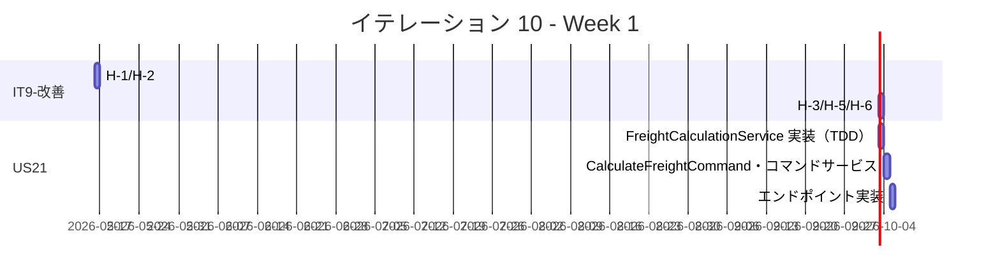
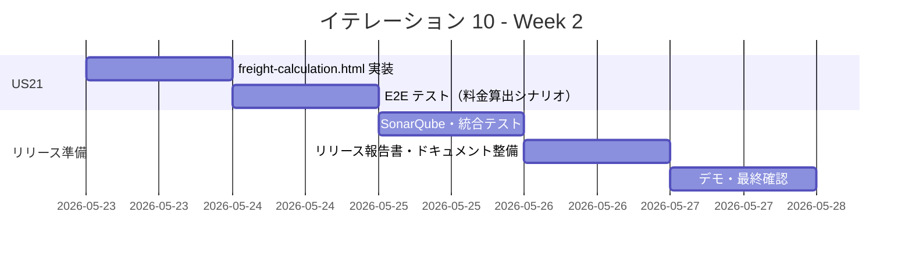
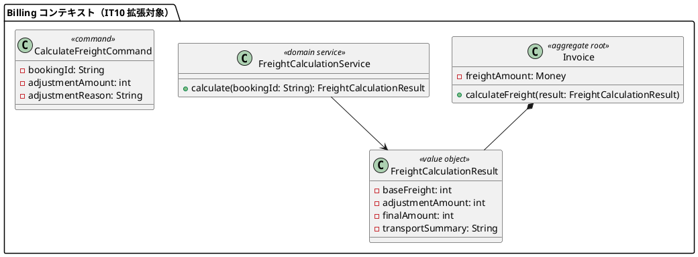
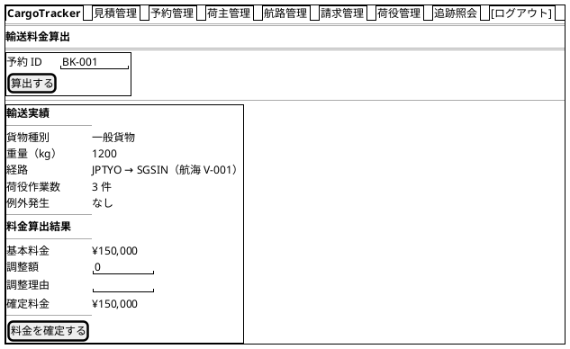
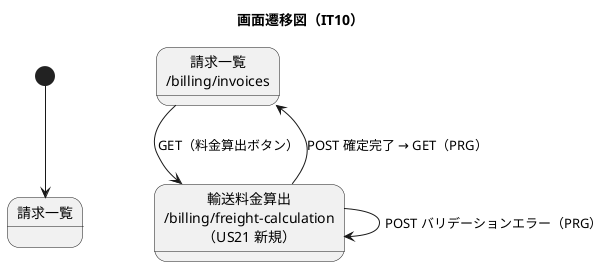

# イテレーション 10 計画

## 概要

| 項目 | 内容 |
|------|------|
| **イテレーション** | 10 |
| **期間** | Week 19-20（2026-05-16 〜 2026-05-29） |
| **ゴール** | IT9 申し送り事項（技術的負債 H-1〜H-3・H-5・H-6）を解消し、輸送料金算出（US21）を実装してすべての機能を完成させ、Release 2.0 のリリース準備を完了させる |
| **目標 SP** | 8 |

---

## ゴール

### イテレーション終了時の達成状態

1. **IT9-改善完了**: IT5 レビュー指摘事項（H-1〜H-3・H-5・H-6）の技術的負債を解消し、Booking コンテキストのコード品質を向上させる
2. **US21 完了**: 経理担当者が引取済みの予約に対して輸送実績をもとに輸送料金を算出・確定できる
3. **Release 2.0 完成**: SonarQube Quality Gate PASS・全テスト通過・リリース完了報告書作成

### 成功基準

- [ ] H-1: `assignItinerary` に `requireStatus(EnumSet.of(...))` パターンが適用されている
- [ ] H-2: `assignItinerary` 完了時に `CargoRoutedEvent` が発行されている
- [ ] H-3: `assignRoute` コントローラメソッドが `executeBookingCommand` パターンに統合されている
- [ ] H-5: `routeDetail` の未使用 `bookingId` パスパラメータが削除されている
- [ ] H-6: `BookingThymeleafControllerTest` のセットアップが `@BeforeEach` に集約されている
- [ ] 引取済（CLAIMED）状態の予約に対して料金算出を開始できる
- [ ] 輸送実績（経路・重量・貨物種別・荷役作業実績）が表示される
- [ ] 基本料金が自動計算される
- [ ] 算出結果を確認して確定操作ができる
- [ ] SonarQube Quality Gate が PASS している
- [ ] テストカバレッジ 80% 以上

---

## ユーザーストーリー

### 対象ストーリー

| ID | ユーザーストーリー | SP | 優先度 |
|----|-------------------|----|--------|
| IT9-改善 | IT5 技術的負債解消（H-1〜H-3・H-5・H-6） | 3 | 高 |
| US21 | 輸送料金を算出する | 5 | 必須 |
| **合計** | | **8** | |

> **注**: US12（確定経路の荷主通知・2SP）はメールインフラ未整備のため IT10 スコープ外とする。Release 2.0 リリース準備はタスクとして含める（SP カウントなし）。

### ストーリー詳細

#### IT9-改善: IT5 技術的負債解消

**対応内容**:

- H-1: `Booking.assignItinerary()` に `requireStatus(EnumSet.of(CONFIRMED))` パターンを適用し、状態ガードを `cancel()` と統一する
- H-2: `Booking.assignItinerary()` 完了時に `CargoRoutedEvent` を発行し、イベント駆動の一貫性を確保する（`InvoiceEventHandler` で受信して精算書自動生成）
- H-3: `BookingThymeleafController.assignRoute()` を `executeBookingCommand` パターンに統合し、例外処理を一元化する
- H-5: `BookingThymeleafController.routeDetail()` から未使用の `bookingId` パスパラメータを削除する
- H-6: `BookingThymeleafControllerTest` のセットアップ（`voyageQueryService` スタブ等）を `@BeforeEach` に集約し、テストの保守性を向上させる

#### US21: 輸送料金を算出する

**ストーリー**:
> 経理担当者として、配送完了した予約に対して輸送実績（経路・重量・貨物種別・荷役実績）をもとに輸送料金を算出したい。なぜなら、実際の輸送内容に基づく正確な料金を算出し、精算に進めるからだ。

**受入条件**:

1. 「引取済（CLAIMED）」状態の予約に対して料金算出を開始できる
2. 輸送実績（経路・距離・重量・貨物種別・荷役作業実績）が表示される
3. 基本料金が自動計算される
4. 算出結果を確認して確定操作ができる
5. 確定後、輸送料金が「確定」状態で登録される
6. 例外（遅延・破損等）が発生している場合、料金調整（減額・補償費用）の入力ができる

> **実装方針**: 現在の `InvoiceEventHandler.onCargoRouted()` は経路確定時に `totalBaseFare` で精算書を自動生成している。US21 では「引取済み（CLAIMED）」後に実績ベースで料金を再算出・確定する新しいフローを追加する。`/billing/freight-calculation` エンドポイントを新設し、対象予約の輸送実績を表示・確定できる UI を実装する。

### タスク

#### 1. IT9-改善: IT5 技術的負債解消（3 SP）

| # | タスク | 見積もり | 担当 | 状態 |
|---|--------|---------|------|------|
| 1.1 | H-1: `Booking.assignItinerary()` に `requireStatus(EnumSet.of(CONFIRMED))` パターンを適用（TDD） | 1h | - | [ ] |
| 1.2 | H-2: `assignItinerary()` 完了時に `CargoRoutedEvent` を発行（TDD）・`InvoiceEventHandler` との連携確認 | 2h | - | [ ] |
| 1.3 | H-3: `assignRoute()` を `executeBookingCommand` パターンに統合（TDD） | 1h | - | [ ] |
| 1.4 | H-5: `routeDetail()` の未使用 `bookingId` パスパラメータを削除 | 0.5h | - | [ ] |
| 1.5 | H-6: `BookingThymeleafControllerTest` セットアップを `@BeforeEach` に集約 | 1h | - | [ ] |
| 1.6 | リグレッションテスト確認・SonarQube スキャン実行 | 0.5h | - | [ ] |

**小計**: 6h（理想時間）

#### 2. US21: 輸送料金を算出する（5 SP）

| # | タスク | 見積もり | 担当 | 状態 |
|---|--------|---------|------|------|
| 2.1 | `FreightCalculationService` ドメインサービス実装（引取済み予約の輸送実績集計・基本料金算出）（TDD） | 2h | - | [ ] |
| 2.2 | `CalculateFreightCommand`・`InvoiceCommandService.calculateFreight()` 拡張（TDD） | 1h | - | [ ] |
| 2.3 | `GET /billing/freight-calculation`・`POST /billing/freight-calculation` エンドポイント追加 | 1h | - | [ ] |
| 2.4 | Thymeleaf: `billing/freight-calculation.html` 実装（輸送実績表示・基本料金・調整入力・確定ボタン） | 2h | - | [ ] |
| 2.5 | E2E テスト: 料金算出シナリオ（freight-calculation.spec.ts 新規） | 2h | - | [ ] |

**小計**: 8h（理想時間）

#### 3. Release 2.0 リリース準備（SP 外）

| # | タスク | 見積もり | 担当 | 状態 |
|---|--------|---------|------|------|
| 3.1 | SonarQube Quality Gate 最終確認・イシュー修正 | 1h | - | [ ] |
| 3.2 | リリース完了報告書（release_report-2_0_0.md）作成 | 1h | - | [ ] |
| 3.3 | ドキュメント最終整備（docs/index.md・mkdocs.yml 更新） | 0.5h | - | [ ] |

**小計**: 2.5h（理想時間）

#### タスク合計

| カテゴリ | SP | 理想時間 | 状態 |
|---------|----|---------|------|
| IT9-改善（技術的負債） | 3 | 6h | [ ] |
| US21 輸送料金算出 | 5 | 8h | [ ] |
| Release 2.0 リリース準備 | - | 2.5h | [ ] |
| **合計** | **8** | **16.5h** | |

**1 SP あたり**: 約 1.8h
**進捗率**: 0% (0/8 SP)

---

## スケジュール

### Week 1（Day 1-5）



| 日 | タスク |
|----|--------|
| Day 1 | IT9-改善: H-1（requireStatus）・H-2（CargoRoutedEvent 発行） |
| Day 2 | IT9-改善: H-3（assignRoute 統合）・H-5（bookingId 削除）・H-6（テストセットアップ） |
| Day 3 | US21: FreightCalculationService ドメインサービス実装（TDD） |
| Day 4 | US21: CalculateFreightCommand・InvoiceCommandService 拡張（TDD） |
| Day 5 | US21: GET/POST /billing/freight-calculation エンドポイント実装 |

### Week 2（Day 6-10）



| 日 | タスク |
|----|--------|
| Day 6 | US21: freight-calculation.html 実装（輸送実績表示・料金確定 UI） |
| Day 7 | US21: E2E テスト（freight-calculation.spec.ts 新規） |
| Day 8 | SonarQube スキャン・Quality Gate 確認・Code Smell 修正 |
| Day 9 | リリース完了報告書（release_report-2_0_0.md）作成・ドキュメント整備 |
| Day 10 | デモ準備・最終動作確認・Release 2.0 タグ付け |

---

## 設計

### ドメインモデル

> **注**: 既存の Billing コンテキストを拡張する。`FreightCalculationService` を新規追加し、`Invoice.calculateFreight()` メソッドで実績ベースの料金算出を行う。



### ユーザーインターフェース

#### ビュー

##### 輸送料金算出画面 (/billing/freight-calculation) — US21 新規



#### インタラクション



### ディレクトリ構成

```
apps/cargo-tracker/src/main/java/.../billing/
├── domain/model/
│   └── services/
│       └── FreightCalculationService.java  (IT10 新規)
├── application/internal/commandservices/
│   ├── CalculateFreightCommand.java        (IT10 新規)
│   └── InvoiceCommandService.java          (calculateFreight() 追加)
└── interfaces/web/
    └── BillingThymeleafController.java     (GET/POST /billing/freight-calculation 追加)

apps/cargo-tracker/src/main/resources/templates/billing/
└── freight-calculation.html               (IT10 新規)

apps/cargo-tracker/e2e/src/tests/
└── freight-calculation.spec.ts            (IT10 新規: US21)
```

### API 設計

| メソッド | エンドポイント | 認証 | 説明 |
|---------|---------------|------|------|
| GET | /billing/freight-calculation | 要 | 料金算出フォームを表示する（IT10 新規） |
| POST | /billing/freight-calculation | 要 | 輸送料金を算出・確定する（US21） |

---

## ストーリー間の依存関係

| 依存元 | 依存先 | 理由 |
|--------|--------|------|
| US21 | IT9-改善（H-2） | H-2 で `CargoRoutedEvent` 発行が確立した後、US21 の精算書フローと連携させる |
| Release 準備 | US21 | US21 完了後に最終 Quality Gate 確認・リリース報告書作成を実施する |

実装順序: IT9-改善 → US21（料金算出）→ Release 2.0 リリース準備

## IT9 申し送り事項の対応方針

| 優先度 | 項目 | IT10 対応方針 |
|--------|------|-------------|
| 高 | IT5 技術的負債（H-1〜H-3・H-5・H-6） | IT10 冒頭で対応（Booking コンテキストの品質向上） |
| 高 | US21 輸送料金算出 | IT10 主要機能として実装 |
| 中 | US12 スコープ判断 | IT10 スコープ外（メールインフラ未整備）。将来課題として記録 |
| 低 | US18 推定到着日 | IT10 スコープ外。追跡詳細画面の将来改善として記録 |
| 低 | H2 長時間稼働問題 | IT10 リリース時に注意事項として記載 |
| 低 | E2E タスク 1.4 | 優先度低のため IT10 では対応しない |

## リスクと対策

| リスク | 影響度 | 対策 |
|--------|--------|------|
| H-2 の CargoRoutedEvent 発行が既存 E2E テストに影響する | 中 | `InvoiceEventHandler` が既存テストと競合しないか E2E でリグレッション確認を優先する |
| FreightCalculationService の実績データ取得が複数コンテキストをまたぐ | 中 | ACL（Anti-Corruption Layer）パターンで `BookingSettlementPort`・`TrackingPort` を経由する |
| IT10 完了前に Branch カバレッジ 80% 未達が続く | 低 | FreightCalculationService の分岐を単体テストで網羅し instruction/branch 両方のカバレッジを向上させる |

---

## 完了条件

### Definition of Done

- [ ] コードレビュー完了
- [ ] ユニットテストがパス（Java テスト件数 > 315 件）
- [ ] E2E テストがパス（E2E テスト数 > 93 件）
- [ ] SonarQube Quality Gate PASS
- [ ] 機能がローカル環境で動作確認済み
- [ ] ドキュメント更新完了
- [ ] Release 2.0 完了報告書作成

### デモ項目

1. H-1 確認: `Booking.assignItinerary()` の状態ガードが EnumSet パターンで統一されていることを確認
2. H-2 確認: 経路確定時に `CargoRoutedEvent` が発行されて精算書が自動生成されることを確認
3. US21: 引取済みの予約に対して輸送料金算出画面を開き、輸送実績と基本料金が表示されることを確認
4. US21: 算出結果を確認して「料金を確定する」を実行し、精算書に確定料金が登録されることを確認
5. リリース確認: SonarQube Quality Gate PASS・全テスト通過・リリース完了報告書作成完了

---

## 更新履歴

| 日付 | 更新内容 | 更新者 |
|------|---------|--------|
| 2026-04-23 | 初版作成 | - |

---

## 関連ドキュメント

- [イテレーション 10 ふりかえり](./retrospective-10.md)
- [イテレーション 9 計画](./iteration_plan-9.md)
- [イテレーション 9 ふりかえり](./retrospective-9.md)
- [リリース計画](./release_plan.md)
