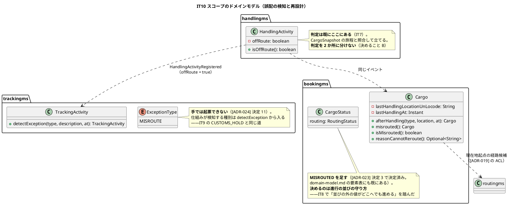
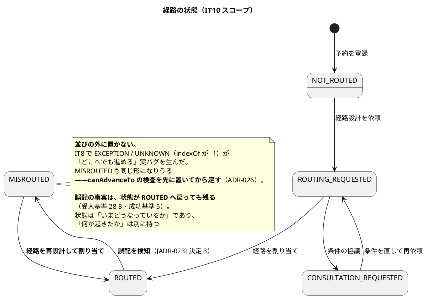
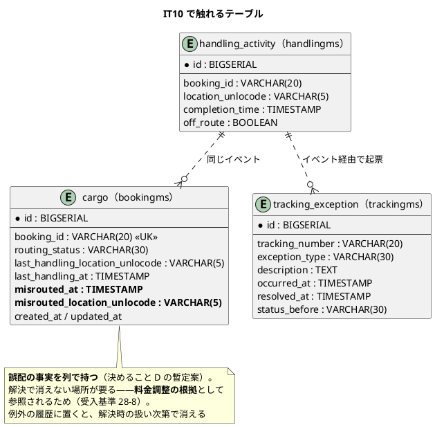
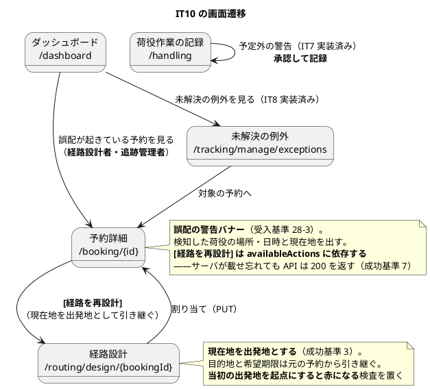

# イテレーション 10 計画

| 項目 | 内容 |
| :--- | :--- |
| イテレーション | IT10 |
| 期間 | 2026-09-21 〜 2026-10-04（2 週間） |
| 対象ストーリー | US28（誤配を検知して経路を再設計する） |
| 計画 SP | 7 |
| 局面 | **終盤（3 本目）／アウトサイドイン**（[開発戦略](development_strategy.md#終盤-アウトサイドインit8it12--release-10-後半20)） |
| 前提 | [IT9 完了報告書](iteration_report-9.md)・[IT9 ふりかえり](retrospective-9.md) |
| リリース | [Release 1.1](release_plan.md)（IT9〜IT10）——**本 IT で Release 1.1 が完了する** |

## ゴール

**予定と違う場所で降ろされた貨物を、その場で気づいて組み直せるようになる。**

IT7 で「予定ルート外の作業は、警告を出したうえで記録に残す」ところまでは実装した
（[ADR-023](../adr/023-handling-activity-validation.md) 決定 3）。**しかしその警告は、記録の
瞬間に画面へ出るだけで、どこにも残らない。** 誤配のフラグ（`offRoute`）は荷役の行に立つが、
**予約はそれを知らず、追跡管理者の一覧にも現れず、経路を組み直す導線も無い。**

IT10 で、**検知 → 起票 → 再設計 → 記録**を業務として繋ぐ。

> **誤配は発見が遅れるほど被害が膨らむ。** 貨物は目的地から遠ざかり続け、納期遅延と輸送
> コストが積み上がる。**その場で気づけること**が価値の中心であり、「あとから一覧を見れば
> 分かる」では足りない。

### 成功基準

> **通知の「送信」は行いません。** IT8・IT9 と同じ形で、**通知したという事実を記録し、画面で
> 見える形**に代替します（[ADR-024](../adr/024-tracking-manual-update-and-exceptions.md) 決定 9）。
> **代替であることを画面・マニュアル・完了報告書に明記します。**

| # | 基準 | 測り方 |
| :--- | :--- | :--- |
| 1 | **予定ルート外の荷役が、予約と追跡の両方に届く** | kind 統合環境で、予定にない港で荷役を記録すると、**予約の経路状態が「誤配」になり**、trackingms に `MISROUTE` の例外が**自動起票**される。どちらか片方を壊すと赤になること |
| 2 | **誤配は予約詳細で分かり、そこから次の行動へ進める** | 予約詳細に警告バナーが出て、**検知した荷役の場所・日時と貨物の現在地**が示される。経路設計者はそこから経路の再設計へ進める（件数から対象へ辿れる横断規約） |
| 3 | **再設計は現在地を出発地とする** | 経路候補の要求が**現在地起点**で組まれる。目的地と希望期限は元の予約から引き継がれる。**当初の出発地を起点にすると赤になる**こと |
| 4 | **期限を超えるなら、超える分が見える** | 再設計後の到着予定が当初の希望期限を超える場合、**差分（日数）が明示され**、荷主への通知内容（代替）に含まれる |
| 5 | **誤配の記録は解決後も残る** | 例外を解決しても、**誤配が起きた事実（場所・日時）は消えない**。料金調整の根拠として参照できる。解決で消える実装にすると赤になること |
| 6 | **受入基準の項目ごとに、達成を確かめる検査がある**（[IT9 Try 6](retrospective-9.md)） | US28 の受入基準 8 項目それぞれに、対応する検査を 1 本以上持つ。**DoD のチェックだけで達成と判定しない**——IT9 は US29-6 をそれで見落とした |
| 7 | **応答の一覧に依存する画面は、画面から踏むテストを持つ**（[IT9 Try 1](retrospective-9.md)） | 「経路を再設計」の導線は `availableActions` に依存する。**サーバが載せ忘れても API は 200 を返す**ため、画面から踏む受け入れテストを 1 本置く |
| 8 | **この IT で書いた「〜しない」「〜まで確かめる」が、検査に固定されている** | 否定形・保証形のコメントを数え、同じ数の検査を持つ。**復元の「ここでは検査しない」も含む**（IT9 で宣言だけの状態を見つけた） |
| 9 | ドメイン層のカバレッジ 90% 以上 | 6 サービス + shared |

## 局面とアプローチ

**終盤の 3 本目（アウトサイドイン）。** 業務シナリオを受け入れテストに翻訳してから、
画面 → API → ドメインの順に埋める。

**新しい集約は作らない。** US28 は既存の 4 サービス（handlingms・trackingms・bookingms・
routingms）を業務シナリオで束ねるストーリーである。**発明が必要になったら ADR を起票して
から実装する**——[ADR-022](../adr/022-domain-event-contract.md) のイベント契約、
[ADR-019](../adr/019-route-assignment-api.md) の ACL、IT9 で確立した「自動検知は
`detectException` から入る」形（[ADR-024](../adr/024-tracking-manual-update-and-exceptions.md)
決定 11）をそのまま写す。

> **IT9 の `CUSTOMS_HOLD` と同型である。** 留置 → 例外の自動起票は、
> `DetectCustomsHoldUseCase` が既に作った道である。誤配も同じ道を通る——**違うのは、
> 起点が「状態の変更」ではなく「荷役の記録そのもの」であり、届け先が trackingms と
> bookingms の 2 つある**点だけである。

## 前イテレーションからの反映

### ふりかえりの Try（[retrospective-9.md](retrospective-9.md)）

| # | Try | 本 IT での扱い |
| :--- | :--- | :--- |
| 1 | 応答の一覧に依存する画面は、画面から踏む受け入れテストを 1 本持つ | **成功基準 7 に据えた。** 「経路を再設計」の導線がまさにこの形（IT9 はキャンセル申請の入口で踏んだ） |
| 2 | 検査がリポジトリのファイルを読むなら、その場で入力に宣言し、壊して赤を確認する | **DoD に入れた。** 本 IT で新しく書く検査すべてに適用する |
| 3 | 新しい検査コマンドを使い始めたら、一度壊して赤になることを確かめる | **DoD に入れた。** IT9 は `tsc --noEmit` が何も見ていないことに気づかなかった |
| 4 | ガードを 1 段足したら、その後ろにある守りの検査が今も踏まれているか確かめる | **進め方に入れた。** 誤配の検知は荷役の登録経路に手を入れるため、**通関ガード・荷受人の確認の検査が今も踏まれているか**を確かめる |
| 6 | 受入基準の項目ごとに、達成を確かめる検査を 1 本持つ | **成功基準 6 に据えた。** IT9 は US29-6 を「DoD にチェックを付けたが検査が無い」形で落とした |
| 7 | 品質ゲートの前は必ずフルビルドでレポートを作り直す | **DoD に入れた**（クローズ時の手順） |

> Try 5（レビューの結果が揃うまでクローズを宣言しない）は `closing-iteration` の運用であり、
> 本 IT のクローズ時に適用する。

### 引き継ぎ（返済枠・SP 対象外）

IT9 のクローズレビューで IT10 送りにしたものと、tester の指摘を返済枠として持つ。
**IT 序盤（Day 1-3）に独立したコミットで済ませる**——3 IT 連続で全返済できている形を保つ。

| # | 内容 | 見積 | 出典 |
| :--- | :--- | :--- | :--- |
| 0.1 | **通関申告一覧を「毎朝の待ち行列」にする。** 未決着（審査中＋留置）を同時に見られるようにし、**表示件数と切り捨ての明示**（200 件で黙って切れる）も直す | 6h | [Issue #557](https://github.com/k2works/case-study-cargo-tracker/issues/557) |
| 0.2 | **US30-10 の履歴を全件出す。** `decidedBy` / `decidedAt` を画面に出し、**却下後に再申請しても前回の却下理由が残る**ことを検査で固定する | 6h | [Issue #556](https://github.com/k2works/case-study-cargo-tracker/issues/556)。**受入基準の一部未達** |
| 0.3 | **荷役側に「陸揚げ待ち」の入口を置く。** 承認済みで陸揚げ地が決まっている貨物の待ち行列。連絡を忘れると貨物は指定した港を通り過ぎる | 5h | [Issue #558](https://github.com/k2works/case-study-cargo-tracker/issues/558) |
| 0.4 | キャンセル一覧の予約 ID から**予約詳細へ行けるようにする**。承認の判断には荷主・貨物種別・旅程を見たくなる | 2h | IT9 レビュー遅着 #20 |
| 0.5 | **通関済にした申告を「審査中」へ戻せる**。「未決着は貨物あたり 1 件」の前提が巻き戻しで崩れないか確かめる。誤操作の訂正手段は要るため禁止まではしない | 3h | IT9 レビュー遅着 #21 |
| 0.6 | **キャンセル料の受け皿の要否を判断する。** 承認された案件のキャンセル料を誰も算定していない（US21 待ち）。一覧の書き出しでも可 | 2h | IT9 レビュー遅着 #23 |
| 0.7 | 再留置後の「4 日目以降は true」側の対を張り、`heldAt` の取り違えをより強く判別する | 2h | IT9 レビュー tester |
| 0.8 | 即時確定パスで「通知しない／申請は保存される」ことを張り、承認確定との副作用の違いを守る | 2h | IT9 レビュー tester |
| 0.9 | 2 回目の決定で内部状態が上書きされていないことまで見る（例外を投げつつ書き換える実装ミス） | 2h | IT9 レビュー tester |
| 0.10 | **`tsc -b` を CI とローカルの品質ゲートに組み込む。** IT9 で `tsc --noEmit` が何も見ていないことが分かった。**壊して赤を確認する** | 3h | IT9 Problem 3 |
| 0.11 | **IT9 時点のコメントが残っていないか確かめる**（実装した IT で消す） | 2h | 各 IT の慣行 |
| **合計** | | **35h** | |

### IT9 から「着手前に決めること」として引き継いだもの

| # | 決めること | 本 IT での扱い |
| :--- | :--- | :--- |
| A | **`MISROUTED` を `RoutingStatus` に足したとき、進行の並びをどう守るか** | **決定済み。足す。** [ADR-023](../adr/023-handling-activity-validation.md) 決定 3 が「**`RoutingStatus` を `MISROUTED` へ動かすのは US28（IT10）である**」と明記しており、[domain-model.md](../design/domain-model.md) の要素表にも `MISROUTED` が載っている。IT7・IT8 の計画も一貫してそう書いてきた。**過去の決定を今になって覆さない。** そのうえで**決めるのは「進行の並びをどう守るか」である**—— IT8 で `EXCEPTION` / `UNKNOWN`（並びの外の値）が「どこへでも進める」実バグを生んだ。`MISROUTED` は同じ形になりうる——**ADR-026 で、並びの検査を先に置いてから足す** |
| B | **誤配の検知を、どこが担うか。** handlingms（記録の瞬間）か、trackingms（イベントを受けて）か | **ADR-026 で決める。** `offRoute` の判定は既に handlingms が持つ（`CargoSnapshot` の旅程と照合）——**判定を 2 か所に分けない** |
| C | **再設計の入口をどこに置くか。** 予約詳細からか、例外一覧からか | **両方に置く。** 気づく人（追跡管理者）と直す人（経路設計者）が違うため。**ロール別の到達性**を確かめる |
| D | **誤配の記録を、解決後もどこに残すか。** 例外の履歴か、予約か、荷役の行か | **ADR-026 で決める。** 成功基準 5。**料金調整の根拠**として参照されるため、解決で消えない場所が要る |
| E | **期限超過の差分を、どこで計算するか** | 到着予定は routingms の候補が持ち、希望期限は bookingms の `RouteSpecification` が持つ。**bookingms で突き合わせる**（[ADR-017](../adr/017-arrival-deadline-in-destination-calendar.md) の「目的地の暦で判断する」を踏襲） |

## 対象ストーリーと受入基準

### US28: 誤配を検知して経路を再設計する（7 SP）

**として**: 追跡管理者（検知は荷役作業員）
**したい**: 予定ルートと異なる場所で荷役が行われたことを検知し、貨物の現在地から目的地までの
経路を組み直したい
**なぜなら**: 誤配は発見が遅れるほど納期遅延と輸送コストが膨らむため、その場で気づいて
組み直せることが被害を最小にするからだ

| # | 受入基準 | 本 IT での扱い | 対応する検査（成功基準 6） |
| :--- | :--- | :--- | :--- |
| 28-1 | 荷役作業の登録時、作業場所が予約の予定ルートに含まれない場合、登録前に警告が表示される | **実装済み（IT7）。** 検査が今も踏まれているか確かめる（Try 4） | `HandlingActivityTest` の予定外警告 |
| 28-2 | 警告を承認して登録すると、経路状態が「誤配」に更新され、例外種別「誤配」の例外イベントが自動起票される | **実装（成功基準 1）。** イベントが 2 つの購読側へ届く | 予約の経路状態・`MISROUTE` の起票を各 1 本 |
| 28-3 | 予約詳細に誤配の警告バナーが表示され、検知した荷役イベント（場所・日時）と貨物の現在地が示される | **実装（成功基準 2）** | 画面テスト 1 本（**値が層を生き延びるか**も見る） |
| 28-4 | 経路設計者は予約詳細から `[経路を再設計]` により、**現在地を出発地とした**経路割り当て画面へ遷移できる | **実装（成功基準 3・7）。** `availableActions` に依存する導線 | 画面から踏む受け入れテスト 1 本 |
| 28-5 | 再設計時の目的地と希望期限は元の予約から引き継がれる | **実装（成功基準 3）** | 引き継ぎを壊すと赤になる検査 1 本 |
| 28-6 | 再設計後の到着予定が当初の希望期限を超える場合、その差分が明示され、荷主への通知内容に含まれる | **実装（成功基準 4）＋通知は代替** | 差分の計算 1 本・画面表示 1 本 |
| 28-7 | 誤配の例外イベントは例外一覧（追跡管理者）に表示され、解決フォームから対応内容を記録できる | **実装。** IT8 の解決フォームを使う | 例外一覧に出ることを 1 本 |
| 28-8 | 誤配の事実は解決後も記録として残り、料金調整の根拠として参照できる | **実装（成功基準 5）** | **解決後も残る**ことを 1 本 |

## 設計

### ドメインモデル図（IT10 スコープ）

### 状態遷移図（IT10 スコープ）

> **`MISROUTED` を足すことは [ADR-023](../adr/023-handling-activity-validation.md) 決定 3 で
> 決まっている**（IT7 は動かさない、US28 で動かす）。この図は「足したあと、進行の並びを
> どう守るか」の暫定案である——**IT8 で並びの外の値が「どこへでも進める」を生んだ**ため、
> `canAdvanceTo` の検査を先に置いてから足す。ADR-026 で確定させ、決定と食い違ったら
> この図を直す。

### ER 図（IT10 スコープ）

> **`cargo` への列追加は [data-model.md](../design/data-model.md) への反映が要る。**
> 返済枠 0.1（IT9）で置いた `SchemaDesignConsistencyTest` が、反映しないと赤にする。

### 画面遷移図（IT10 スコープ）

## タスク

### 0. 返済枠（SP 対象外・35h）

上の「引き継ぎ」の 0.1〜0.11。**Day 1-3 に独立したコミットで済ませる。**

### 1. Phase 1: 業務シナリオを受け入れテストに翻訳する（1 SP 相当・10h）

| # | タスク | 見積 | 注意 |
| :--- | :--- | :--- | :--- |
| 1.1 | **[ADR-026] を起票し、決めること A〜E を決定する** | 4h | **決定ごとに検査を書き、1 件ずつ壊して赤を確認する**（IT9 の形を踏襲）。コンプライアンス表の「壊して赤を確認」列が全件「済」になるまで完了としない。**A は「足すかどうか」ではなく「並びをどう守るか」を決める**——足すことは [ADR-023] 決定 3 で決まっている |
| 1.2 | 受入基準 28-1〜28-8 を、**画面から踏む受け入れテスト**に翻訳する（Red） | 6h | **8 項目それぞれに検査を対応させる**（成功基準 6）。この時点では赤でよい |

### 2. Phase 2: 画面と導線（1.5 SP 相当・16h）

| # | タスク | 見積 | 注意 |
| :--- | :--- | :--- | :--- |
| 2.1 | 予約詳細に**誤配の警告バナー**（場所・日時・現在地） | 5h | 受入基準 28-3。**値が層を生き延びるか**を 1 本ずつ |
| 2.2 | **[経路を再設計]** の導線（`availableActions` 経由）。遷移先は既存の `/routing/design/{bookingId}`（[ui_design.md](../design/ui_design.md) 画面一覧） | 4h | 成功基準 7。**画面から踏むテストを 1 本**。ロール（経路設計者）で出し分ける。**新しい画面を作らない**——既存の経路設計画面に「現在地起点」の入力を足す |
| 2.3 | **期限超過の差分**の表示 | 4h | 受入基準 28-6。「何日超えるか」を出す。**通知が代替であることを画面に書く** |
| 2.4 | ダッシュボードに**誤配が起きている予約の件数**（経路設計者・追跡管理者） | 3h | 横断規約（件数から対象一覧へ辿れる）。**IT9 はこれを落とした**（US29-6） |

### 3. Phase 3: API と結合（2 SP 相当・22h）

| # | タスク | 見積 | 注意 |
| :--- | :--- | :--- | :--- |
| 3.1 | bookingms が `offRoute` の荷役イベントで**誤配を記録**する | 5h | 既存の `AdvanceBookingUseCase` の購読に足す。**巻き戻さない・冪等**を保つ |
| 3.2 | trackingms が同じイベントで **`MISROUTE` を自動起票**する | 5h | IT9 の `DetectCustomsHoldUseCase` と同型。**未解決の例外があるときは起票しない** |
| 3.3 | **現在地起点の経路候補**（bookingms → routingms） | 6h | [ADR-019](../adr/019-route-assignment-api.md) の ACL をそのまま使う。**現在地・目的地・期限の引き継ぎ**を検査で固定 |
| 3.4 | **期限超過の差分**の算出（bookingms） | 3h | 決めること E。[ADR-017](../adr/017-arrival-deadline-in-destination-calendar.md) の「目的地の暦で判断する」を踏襲 |
| 3.5 | 誤配の状態を応答に載せる（`availableActions` を含む） | 3h | **載せ忘れると画面に何も出ないが API は 200 を返す**。`BookingActionRosterTest` が守る |

### 4. Phase 4: ドメイン（2 SP 相当・20h）

| # | タスク | 見積 | 注意 |
| :--- | :--- | :--- | :--- |
| 4.1 | `RoutingStatus` に **`MISROUTED` を足す**（[ADR-023] 決定 3）。`Cargo` に**誤配の記録**と述語（`isMisrouted` / `reasonCannotReroute`） | 6h | 決めること A・D。**`canAdvanceTo` の検査を先に置いてから足す**——IT8 で並びの外の値が実バグを生んだ。復元では検査しない（**検査で固定する**） |
| 4.2 | `cargo` への列追加（migration）と [data-model.md](../design/data-model.md) の反映 | 3h | `SchemaDesignConsistencyTest` が未反映を赤にする。**`routing_status` の値も設計と突き合わせる** |
| 4.3 | **誤配の事実が解決後も残る**ことを固定する | 4h | 成功基準 5。**解決で消える実装にすると赤になる** |
| 4.4 | イベント契約（`HandlingActivityRegistered` の `offRoute` を購読側で使う） | 4h | 既存の契約に項目は揃っている。**契約テストを両側に置く** |
| 4.5 | **通関ガード・荷受人の確認の検査が今も踏まれているか確かめる**（Try 4） | 3h | 荷役の登録経路に手を入れるため。**前提を作ってから確かめる形**になっているか |

### 5. Phase 5: 通知の代替（0.5 SP 相当・5h）

| # | タスク | 見積 | 注意 |
| :--- | :--- | :--- | :--- |
| 5.1 | 誤配と期限超過を荷主へ伝える**代替**（記録して画面に出す） | 5h | 受入基準 28-6。**送っていないことを画面が言う**（IT8・IT9 と同じ形） |

### 6. Phase 6: 実環境で通す（10h）

| # | タスク | 見積 | 注意 |
| :--- | :--- | :--- | :--- |
| 6.1 | **kind 統合環境で成功基準 1・2 を通す**。**先にイメージを作り直す** | 6h | 予定外の荷役 → 予約の誤配 → 例外の起票 → 予約詳細のバナー、を 1 本で通す |
| 6.2 | **kind で成功基準 3・4 を通す** | 4h | 現在地起点の再設計 → 期限超過の差分 |

> **IT8 は 1 件、IT9 は 3 件を、この枠で捕まえた。** 枠の価値は上がっている。

### 7. ユーザーマニュアル（10h）

| # | タスク | 見積 | 注意 |
| :--- | :--- | :--- | :--- |
| 7.1 | [08 荷役管理](../manual/08-荷役管理.md)に**予定外の作業と誤配**の節を足す | 4h | 「警告は出るが記録は拒まない」理由まで書く |
| 7.2 | [04 貨物予約](../manual/04-貨物予約.md)に**誤配のバナーと再設計**の節を足す | 4h | 経路設計者の手順 |
| 7.3 | **画面キャプチャを生成 spec 経由で撮り直し、目視する** | 2h | 手で PNG を差し替えない。**撮った絵を見る**——IT9 は撮った絵が実欠陥（生の ISO 日時）を見せた |

### 8. 計画への差し戻し（4h）

| # | タスク | 見積 | 注意 |
| :--- | :--- | :--- | :--- |
| 8.1 | **US33 のリリース配置を決める**（IT9 で起票済み・未配置） | 2h | [Issue #555](https://github.com/k2works/case-study-cargo-tracker/issues/555)。**「次の見直しで」と書き続けない**。→ **Release 2.1（IT13）に配置した**——依存が無く、一気通貫の完成を優先し、予備枠に収まる |
| 8.2 | Release 1.1 の完了を確認し、Release 2.0（IT11〜IT12）の前提を洗い出す | 2h | 本 IT で Release 1.1 が完了する |

### 見積もり合計

| 区分 | 見積 |
| :--- | :--- |
| 0. 返済枠 | 35h |
| 1. Phase 1 受け入れテストと ADR | 10h |
| 2. Phase 2 画面と導線 | 16h |
| 3. Phase 3 API と結合 | 22h |
| 4. Phase 4 ドメイン | 20h |
| 5. Phase 5 通知の代替 | 5h |
| 6. Phase 6 実環境 | 10h |
| 7. ユーザーマニュアル | 10h |
| 8. 計画への差し戻し | 4h |
| レビュー手直しの枠 | クローズ時（`developing-review`） |
| **合計** | **132h** |

## スケジュール

### Week 1（Day 1-5）

| Day | 内容 |
| :--- | :--- |
| 1-3 | **返済枠 0.1〜0.11（35h）。** 独立したコミットで済ませる |
| 4 | Phase 1（ADR-026 の起票と決定・受入テストの翻訳） |
| 5 | Phase 2 前半（警告バナー・再設計の導線） |

### Week 2（Day 6-10）

| Day | 内容 |
| :--- | :--- |
| 6 | Phase 2 後半（期限超過の差分・ダッシュボードの件数） |
| 7 | Phase 3（API と結合） |
| 8 | Phase 4（ドメイン） |
| 9 | Phase 5・Phase 6（通知の代替・実環境） |
| 10 | Phase 7・8（マニュアル・計画への差し戻し）→ クローズ |

## リスク

| # | リスク | 影響 | 対策 |
| :--- | :--- | :--- | :--- |
| 1 | **1 つのイベントを 2 つのサービスが購読し、片方だけ処理される** | 予約は誤配になったのに例外が起票されない（またはその逆）。**どちらも例外にならないので気づかない** | 成功基準 1 で**両方を 1 本の受け入れテストに束ねる**。片方を壊すと赤になること |
| 2 | **`MISROUTED` を足して、進行の並びが壊れる** | IT8 で `EXCEPTION` / `UNKNOWN`（`indexOf` が -1）が「どこへでも進める」実バグを生んだ形の再来。**足すこと自体は [ADR-023] 決定 3 で決まっている** | **`canAdvanceTo` の検査を先に置いてから足す**（ADR-026）。列挙に値を足したら並びの検査が赤になる形にする |
| 3 | **誤配の記録が解決で消える** | 料金調整の根拠が失われる（受入基準 28-8） | 成功基準 5。**解決してから参照する**検査を置く |
| 4 | **再設計が当初の出発地を起点にする** | 貨物が今いない港からの経路を組み、現場が動けない | 成功基準 3。**当初の出発地を起点にすると赤になる**検査 |
| 5 | **導線が `availableActions` に載らず、画面に何も出ない** | IT9 で実際に踏んだ形（キャンセル申請の入口）。API は 200 を返す | 成功基準 7。`BookingActionRosterTest` が名簿を突き合わせる |
| 6 | **荷役の登録経路に手を入れて、通関ガードの検査が空振りになる** | IT9 の Problem 7 の再来 | タスク 4.5。**前提を作ってから確かめる形**になっているかを見る |

## 設計への反映が必要な箇所（注）

| # | 反映先 | 内容 | 担保 |
| :--- | :--- | :--- | :--- |
| 1 | [data-model.md](../design/data-model.md) | `cargo` の誤配の列（決めること D の確定後） | `SchemaDesignConsistencyTest` が赤にする |
| 2 | [domain-model.md](../design/domain-model.md) | `Cargo` の誤配の述語・`ExceptionType.MISROUTE` の起票経路。**`RoutingStatus` の `MISROUTED` は要素表に既にある**——実装がそれに追いつく（[ADR-023](../adr/023-handling-activity-validation.md) 決定 3） | 要素表と実装の**列挙値を突き合わせる検査** |
| 3 | [architecture_backend.md](../design/architecture_backend.md) | 誤配のイベント購読（bookingms・trackingms の 2 つ） | API 一覧・イベント一覧 |
| 4 | [ui_design.md](../design/ui_design.md) | 誤配のバナー・再設計の画面・ダッシュボードの件数 | ナビゲーション構成表 |

> **列挙して約束する形にしない**（IT8 の教訓）。**検査が緑になったことで判定する。**

## デモ項目

| # | 項目 | アクター | 受入基準 |
| :--- | :--- | :--- | :--- |
| 1 | 予定にない港での荷役に警告が出ることを示す | 荷役作業員 | 28-1 |
| 2 | 承認して記録すると、予約が「誤配」になることを示す | 荷役作業員 | 28-2 |
| 3 | 例外一覧に「誤配」が自動で現れることを示す | 追跡管理者 | 28-2・28-7 |
| 4 | 予約詳細の警告バナーに、場所・日時・現在地が出ることを示す | 経路設計者 | 28-3 |
| 5 | ダッシュボードの件数から、誤配の予約へ辿れることを示す | 経路設計者 | 横断規約 |
| 6 | [経路を再設計] から、**現在地を出発地とした**候補が出ることを示す | 経路設計者 | 28-4 |
| 7 | 目的地と希望期限が引き継がれていることを示す | 経路設計者 | 28-5 |
| 8 | 期限を超える場合、**何日超えるか**が出ることを示す | 経路設計者 | 28-6 |
| 9 | 通知が**送られていない**ことを画面が言っていることを示す | 荷主 | 28-6 |
| 10 | 例外を解決しても、**誤配の記録が残る**ことを示す | 追跡管理者 | 28-8 |

## DoD（完了の定義）

- [ ] 対象ストーリーの受入基準を満たす。**果たせないもの（28-6 の通知は代替）を [ADR-026] と完了報告書に記録する**
- [ ] 成功基準 1〜9 を満たす
- [ ] **受入基準 28-1〜28-8 それぞれに、達成を確かめる検査がある**（Try 6・成功基準 6）。**DoD のチェックだけで達成と判定しない**
- [ ] 全テストが緑。**品質ゲートは CI と同じコマンドで回す**——バックエンドは `./gradlew build`、フロントエンドは **`tsc -b`**（`tsc --noEmit` ではない。Try 3）
- [ ] **CI が緑**（GitHub Actions の run 番号を完了報告書に記録）
- [ ] **`TZ=UTC` でも緑**（`--rerun-tasks` で強制再実行）
- [ ] **ドメイン層のカバレッジが 90% 以上**（6 サービス + shared）
- [ ] **品質ゲートの前にフルビルドでレポートを作り直した**（Try 7）
- [ ] SonarQube Quality Gate が **両プロジェクトで PASS**（Bug 0・Vulnerability 0）
- [ ] **ADR-026 の決定ごとに検査があり、1 件ずつ壊して赤を確認した記録がある**
- [ ] **この IT で書いた「〜しない」「〜まで確かめる」の数だけ検査があり、壊して赤を確認した**（成功基準 8）
- [ ] **検査がリポジトリのファイルを読むなら、入力に宣言し、壊して赤を確認した**（Try 2）
- [ ] **新しく使い始めた検査コマンドを、一度壊して赤になることを確かめた**（Try 3）
- [ ] **ガードを足したあと、その後ろにある守りの検査が今も踏まれているか確かめた**（Try 4・タスク 4.5）
- [ ] **応答の一覧に依存する画面を、画面から踏むテストで確かめた**（Try 1・成功基準 7）
- [ ] **新しく足した値が層をまたいで生き延びる**。値ごとに 1 本
- [ ] **設計への反映が検査で担保されている**。**注の表の消化ではなく、検査が緑になったことで判定する**
- [ ] **ナビゲーションの 4 点が一致している**。**ロール別・状態別の到達性**を確かめた
- [ ] **件数から対象一覧へ辿れる**（[横断規約](release_plan.md)）
- [ ] **サービス間の呼び出しを実際に 1 往復させた**（kind で予定外の荷役 → 誤配 → 例外）
- [ ] **実環境で確かめる前にイメージを作り直した**
- [ ] **デモ項目 10 件をこの順で通した**
- [ ] **IT9 時点のコメントが残っていない**（返済枠 0.11）
- [ ] **JIG / jig-erd の出力を再生成した**
- [ ] ユーザーマニュアル 08 章・04 章を更新し、**キャプチャを再生成して目視した**
- [ ] **US33 のリリース配置を決めた**（タスク 8.1）
- [ ] `docs/index.md` / `development/index.md` / `mkdocs.yml` を同期した

## 進捗

| 区分 | 状態 |
| :--- | :--- |
| 返済枠（0.1〜0.11） | **完了（11 件・35h）** |
| Phase 1 受け入れテストと ADR | 完了（[ADR-026](../adr/026-misroute-detection-and-rerouting.md) の 8 決定すべて「壊して赤を確認」済み） |
| Phase 2 画面と導線 | 完了 |
| Phase 3 API と結合 | 完了 |
| Phase 4 ドメイン | 完了 |
| Phase 5 通知の代替 | 完了 |
| Phase 6 実環境 | 完了（kind で成功基準 1〜3 を通した。**環境同期の欠陥を 1 件捕まえた**） |
| ユーザーマニュアル | 完了（08 章 8.2 の追記・06 章 6.6 の新設・キャプチャ） |
| 計画への差し戻し | 完了（US33 を Release 2.1 へ配置） |
| レビュー手直しの枠 | クローズ時（`developing-review`） |

## 整合性検証の結果

着手前に [validating-iteration-plan](../../.claude/skills/validating-iteration-plan/SKILL.md) と
[validating-design](../../.claude/skills/validating-design/SKILL.md) の観点で突合した。

| 軸 | 対象 | 結果 | 修正した点 |
| :--- | :--- | :--- | :--- |
| 開発戦略 | [development_strategy.md](development_strategy.md) | OK | IT10 は終盤（IT8〜IT12）・アウトサイドイン。Phase の並びを戦略の終盤ワークフローに揃えた |
| ユーザーストーリー | [user_story.md](../requirements/user_story.md) | OK | 受入基準 8 項目を全文で引用し、**項目ごとに対応する検査**を表に持たせた（Try 6） |
| ドメインモデル | [domain-model.md](../design/domain-model.md) | **要注意 → 解消** | 初版は「`MISROUTED` を足すか別の軸で持つか」を未決として書いたが、**[ADR-023](../adr/023-handling-activity-validation.md) 決定 3 が「US28 で `MISROUTED` へ動かす」と明記**しており、要素表にも既にある。**過去の決定を覆さない**形に直した（決めるのは並びの守り方） |
| データモデル | [data-model.md](../design/data-model.md) | OK | `last_handling_*` は IT9 で追加済み。誤配の列は本 IT で足し、`SchemaDesignConsistencyTest` が反映漏れを赤にする |
| UI 設計 | [ui_design.md](../design/ui_design.md) | **要修正 → 修正** | 初版は再設計の遷移先を `/routing/assign?...` と書いたが、画面一覧・実装とも **`/routing/design/:bookingId`**。**新しい画面を作らず**、既存画面に現在地起点の入力を足す形に直した |
| 過去計画の連続性 | IT7・IT8・IT9 の計画 | OK | 3 つとも「`MISROUTED` は US28（IT10）」「bookingms の購読は US28」と書いており、本計画がそれを受けている |
| 前 IT のレビュー指摘 | [IT9 レビュー](../review/イテレーション9_review_20260825.md) | OK | IT10 送りの 6 件を返済枠 0.1〜0.6 に、tester の 3 件を 0.7〜0.9 に計上 |

> **検証で 2 件の不整合が出た。** どちらも「計画側が設計を知らずに書いた」形であり、
> **設計を正として計画を直している。** 特に `MISROUTED` は、3 つの過去計画と 1 つの ADR が
> 一貫して「US28 で動かす」と書いてきたものを、**着手前に危うく作り直すところだった**。

## 更新履歴

| 日付 | 内容 | 担当 |
| :--- | :--- | :--- |
| 2026-08-25 | 初版作成（US28／7 SP／返済枠 11 件） | 開発 |
| 2026-08-25 | **Phase 1〜8 を完了。** ADR-026 の 8 決定すべてを壊して赤で確認した。**撮った絵が 2 件の欠陥を見せた**（誤配の日時が生の ISO・手番の欄が空の枠）——IT9 に続いて 3 度目である。**Phase 6 で捕まえたのは実装ではなく環境同期の欠陥**だった：Deployment が別のタグ（0.0.6）を掴んでおり、`rollout:restart` は古いイメージで起動し直すだけだった（正しくは `rollout:image`） | 開発 |
| 2026-08-25 | **返済枠 11 件を完了**（Day 1-3 相当）。0.8（即時確定パスの副作用を張る）が**実欠陥**を捕まえた——輸送開始前のキャンセルでは `CargoCancelled` を発行しておらず、荷主は追跡画面で「輸送中」を見続けていた。0.5 は確かめた結果**実装の変更が不要**だった（登録側の 2 つのガードが巻き戻し後も効いている）。0.10 で置いた検査に**自分で書いた注意書きが捕まり**、実行を指示する行だけを見る形へ直した | 開発 |
| 2026-08-25 | 整合性検証の結果を反映：`MISROUTED` は [ADR-023] 決定 3 で決定済みのため「足すかどうか」を論点から外し、**進行の並びの守り方**を決めること A に据え直した。再設計の遷移先を `/routing/design/:bookingId`（既存画面）に修正 | 開発 |

## 関連ドキュメント

- [リリース計画](release_plan.md)
- [開発戦略](development_strategy.md)
- [IT9 完了報告書](iteration_report-9.md)・[IT9 ふりかえり](retrospective-9.md)
- [IT9 レビュー](../review/イテレーション9_review_20260825.md)
- [ADR-019 経路割り当て API](../adr/019-route-assignment-api.md)
- [ADR-022 ドメインイベント契約](../adr/022-domain-event-contract.md)
- [ADR-023 荷役の検証](../adr/023-handling-activity-validation.md)
- [ADR-024 追跡の手動更新と例外](../adr/024-tracking-manual-update-and-exceptions.md)
- [ADR-025 通関申告とキャンセル承認](../adr/025-customs-declaration-and-cancellation-approval.md)
