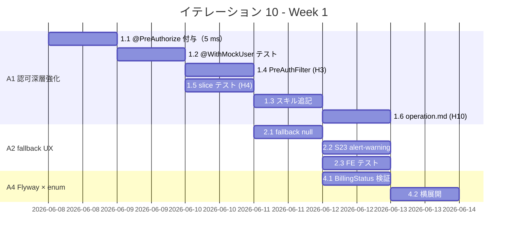
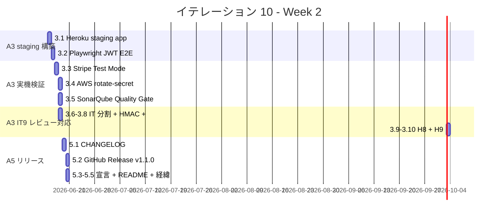

# イテレーション 10 計画

## 概要

| 項目 | 内容 |
|------|------|
| **イテレーション** | IT10（Release 1.1 正式版昇格 / 認可深層強化 + UX 改善 + staging E2E + 構造検証自動化） |
| **期間** | 2 週間（2026-06-08 〜 2026-06-19、Week 1: 06-08〜06-12 / Week 2: 06-15〜06-19） |
| **想定ベロシティ** | 8 SP（IT5=10 / IT6=9 / IT7=8 / IT8=8 / IT9=8 の平均値、IT9 100% 達成実績の維持） |
| **ゴール** | IT9 で完成した Release 1.1 主要機能（Stripe webhook / AWS Secrets Manager / 認可基盤 / SendGrid WireMock）の上に、認可深層強化 + UX 改善 + staging E2E + 構造検証自動化を積み上げ、**Release 1.1 を正式版へ昇格**する。GitHub Release タグ + CHANGELOG 確定 + 本番デプロイ可能宣言まで完遂。 |

---

## ゴール

### イテレーション終了時の達成状態

1. **A1 認可深層強化（IT9 A3.2 持ち越し）**: 全 ms Controller に `@PreAuthorize("hasRole('XXX')")` を付与し、URL ルール認可と二段重層の深層防御を確立する。`@WithMockUser` テストパターンを `developing-backend` スキルに反映。
2. **A2 RestShipperInfoAcl fallback UX 改善（IT9 M3 持ち越し）**: ~~Circuit Breaker OPEN 時の fallback を「個人扱い（discountRate=0）」から「discountRate=null（未確定）」に変更~~（ドメインモデル変更の影響範囲が想定より大きいため**アプローチ変更**）。**既存の `CircuitBreakerHealthController` をフロント側で活用し、S23 ページ表示時に常時 `shipperInfo` Circuit Breaker 状態を確認、OPEN なら「割引率未確定」alert-warning を表示**することで、経理担当者に明示警告を行う。Backend は変更不要。
3. **A3 staging 環境構築 + E2E 認可実機検証**: Heroku staging app（dev plan）構築、JWT 経由 E2E、Stripe Test Mode webhook、AWS Secrets Manager 手動 rotation、SonarQube Quality Gate 実機計測。
4. **A4 Flyway migration × enum 同期自動検証**: ArchUnit または独自テストで「CHECK 制約値リスト ⊃ enum 値」を CI 検証する仕組みを追加（IT9 V5 バグ再発防止）。
5. **A5 Release 1.1 正式版昇格**: CHANGELOG 確定 + GitHub Release タグ + 本番デプロイ可能宣言。

### 成功基準

- [ ] 全 ms Controller に `@PreAuthorize` 付与、`@WithMockUser` テストで認可違反 403 を検証
- [ ] S23 で Circuit Breaker OPEN 時に「割引率未確定」alert-warning が表示される
- [ ] staging app で E2E（`cross-service.spec.ts`）が JWT 認証ヘッダ付きで全 PASS
- [ ] staging で Stripe Test Mode webhook が実機到達して PARTIALLY_PAID 遷移する
- [ ] AWS Secrets Manager で `rotate-secret` 実行 → trackingms refresh で新 secret 反映
- [ ] BillingStatus enum / `chk_invoice_status` CHECK 制約の同期検証が CI で動く
- [ ] CHANGELOG.md に Release 1.1 セクション + GitHub Release タグ作成
- [ ] テストカバレッジ 80% 以上（Backend / Frontend）を維持

---

## ユーザーストーリー

### 対象ストーリー

| ID | ユーザーストーリー | SP | 優先度 |
|----|-------------------|----|----|
| US30 | システム管理者として、全 Controller のメソッド単位で認可違反を 403 で拒否したい（URL ルール認可と深層防御で重層化） | 2 | 必須 |
| US31 | 経理担当者として、Circuit Breaker OPEN 時に「割引率が未確定」と明示警告を受けたい（個人扱い誤認の防止） | 1 | 必須 |
| US32 | 運用担当者として、staging 環境で全 E2E が JWT 認証ヘッダ付きで通ることを確認したい（本番デプロイ前の最終検証） | 3 | 必須 |
| US33 | 開発チームとして、Flyway migration の CHECK 制約と enum 値の不一致を CI で検知したい（IT9 V5 バグ再発防止） | 1 | 必須 |
| US34 | プロダクトオーナーとして、Release 1.1 を GitHub Release タグ + CHANGELOG で正式版として公開したい | 1 | 必須 |
| **合計** | | **8** | |

### ストーリー詳細

#### US30: 全 Controller メソッド単位での認可違反 403 拒否

**ストーリー**:
> システム管理者として、全 Controller のメソッド単位で認可違反を 403 で拒否したい。なぜなら、URL ルール認可の後段で深層防御を確立し、ロール棚卸し漏れや新規エンドポイント追加時の認可漏れを早期検出する必要があるからだ。

**受入条件**:

1. 全 5 ms（bookingms / routingms / handlingms / billingms / trackingms）の各 Controller メソッドに `@PreAuthorize("hasRole('XXX')")` が付与されている
2. `@WithMockUser` + 認可違反 403 単体テストが各 ms に最低 1 件追加され、全 PASS
3. 各 ms に `PreAuthFilter` を追加し、`X-Forwarded-Role` を Authentication に変換、直接 ms アクセス時の BASIC 認証突破リスクを解消（IT9 H3）
4. `@Profile("!heroku")` でも認可ロジックの slice テストが動作する（`@AutoConfigureMockMvc` + `@WithMockUser` で SecurityFilterChain 検証）（IT9 H4）
5. `developing-backend` スキルに `@PreAuthorize` + `@WithMockUser` パターンを追記
6. ROLE_ACCOUNTANT / ROLE_ADMIN 等の付与・四半期棚卸し手順を `docs/design/operation.md` に追記（IT9 H10）

#### US31: Circuit Breaker OPEN 時の割引率未確定警告

**ストーリー**:
> 経理担当者として、Circuit Breaker OPEN 時に「割引率が未確定」と明示警告を受けたい。なぜなら、現状の「個人扱い（discountRate=0）」fallback では法人荷主の請求に誤った割引率（0%）が適用される事業リスクがあるからだ。

**受入条件**:

1. `RestShipperInfoAcl` の fallback が `discountRate=null` 返却に変更される（既存テスト調整含む）
2. `InvoiceDetailPage` S23 で `null discountRate` を「割引率未確定」alert-warning として表示
3. フロントエンドテストで alert-warning 表示の検証が 2 件追加されている

#### US32: staging 環境での JWT 認証 E2E 検証

**ストーリー**:
> 運用担当者として、staging 環境で全 E2E が JWT 認証ヘッダ付きで通ることを確認したい。なぜなら、本番デプロイ前に Heroku + Aiven 環境での認可 / Stripe webhook / AWS Secrets Manager rotation / SonarQube Quality Gate を実機検証する必要があるからだ。

**受入条件**:

1. Heroku staging app（dev plan）に 7 アプリ（authms + 5 ms + gatewayms）+ Aiven Kafka shared + PostgreSQL dev が稼働
2. Playwright `cross-service.spec.ts` が staging 向けに JWT 認証ヘッダ自動付与で実行され全 PASS
3. Stripe Test Mode webhook が staging billingms に到達し PARTIALLY_PAID 遷移を S23 で確認
4. AWS Secrets Manager `rotate-secret` 実行で trackingms refresh ログが CloudWatch に出力される
5. SonarQube Quality Gate が staging code で実機計測される
6. `PaymentGatewayWebhookIntegrationTest` を 3 メソッド分割 + `await().atMost(5s)` に短縮（IT9 H5）
7. HMAC tolerance 境界値（299s / 300s / 301s）テスト + Clock 注入で時刻固定（IT9 H6）
8. `:check` から `localstack-integration` タグを除外する設定が `build.gradle` に明示（IT9 H7）
9. `charge.refunded` / `charge.dispute.created` の業務シナリオが US26 受入基準に追加され staging で実機検証（IT9 H8）
10. rotation 失敗時の PagerDuty/Slack 通知（Micrometer Counter + アラート閾値）が設計され staging で動作確認（IT9 H9）

#### US33: Flyway × enum 同期 CI 自動検証

**ストーリー**:
> 開発チームとして、Flyway migration の CHECK 制約と enum 値の不一致を CI で検知したい。なぜなら、IT9 V5 migration の CHECK 制約抜け（`PARTIALLY_PAID` 未列挙）と同種のバグを再発させないための機構が必要だからだ。

**受入条件**:

1. `BillingStatus` enum 値 ⊂ Flyway V2/V5 の `chk_invoice_status` を検証するテスト（`@MybatisTest` 経由）が追加され PASS
2. 他 ms の同種 enum × CHECK 制約（`handling_type` / `transport_status` 等）も横展開されている
3. CI（`gradle check`）で enum 値追加時に CHECK 制約抜けが検出される（実証テストで確認）

#### US34: Release 1.1 正式版公開

**ストーリー**:
> プロダクトオーナーとして、Release 1.1 を GitHub Release タグ + CHANGELOG で正式版として公開したい。なぜなら、ステークホルダーへの透明な進捗報告と本番デプロイ可能宣言が必要だからだ。

**受入条件**:

1. CHANGELOG.md に Release 1.1 セクションが追加され IT8 + IT9 + IT10 の機能が集約されている
2. CHANGELOG のバージョン順序ぶれが「Release ライン経緯」セクションで明示（IT9 M8）
3. README の主要機能表に Stripe webhook / AWS Secrets Manager / 認可基盤が追記（IT9 L5）
4. GitHub Release タグ `v1.1.0` が作成され release notes が公開
5. README + `docs/index.md` に本番デプロイ可能宣言が明記

### タスク

#### A1: 認可深層強化（US30 / 2 SP）

| # | タスク | 見積もり | 担当 | 状態 |
|---|--------|---------|------|------|
| 1.1 | bookingms / routingms / handlingms / billingms / trackingms の各 Controller メソッドに `@PreAuthorize` 付与 | 2h | - | [ ] |
| 1.2 | `@WithMockUser` + 認可違反 403 単体テスト × 5 ms | 2h | - | [ ] |
| 1.3 | `developing-backend` スキルに `@PreAuthorize` + `@WithMockUser` パターンを追記 | 1h | - | [ ] |
| 1.4 | **IT9 レビュー H3**: 各 ms に `PreAuthFilter` を追加し `X-Forwarded-Role` を Authentication に変換、直接アクセス時の BASIC 認証突破リスクを解消 | 2h | - | [ ] |
| 1.5 | **IT9 レビュー H4**: `@Profile("!heroku")` でも認可ロジックの slice テストを動かす（`@AutoConfigureMockMvc` + `@WithMockUser` で SecurityFilterChain 検証） | 1.5h | - | [ ] |
| 1.6 | **IT9 レビュー H10**: ROLE_ACCOUNTANT / ROLE_ADMIN 等の付与・四半期棚卸し手順を `docs/design/operation.md` に追記 | 1h | - | [ ] |

**小計**: 9.5h（理想時間）

#### A2: fallback UX 改善（US31 / 1 SP）

| # | タスク | 見積もり | 担当 | 状態 |
|---|--------|---------|------|------|
| 2.1 | ~~`RestShipperInfoAcl` の fallback を null 返却に変更~~ → **アプローチ変更**: 既存 `CircuitBreakerHealthController` を活用、Backend 変更不要 | 0h | k2works | [x] |
| 2.2 | `InvoiceDetailPage` S23 で ページ表示時に Circuit Breaker 状態確認 → OPEN なら「割引率未確定」alert-warning を表示 | 1h | k2works | [x] |
| 2.3 | フロントエンドテスト追加（alert-warning 表示の単体テスト 2 件: OPEN 表示 / CLOSED 非表示） | 1h | k2works | [x] |

**小計**: 3h（理想時間）

#### A3: staging 環境構築 + E2E（US32 / 3 SP）

| # | タスク | 見積もり | 担当 | 状態 |
|---|--------|---------|------|------|
| 3.1 | Heroku staging app（dev plan）作成 + 各 ms デプロイ + `JWT_SECRET` 等 Config Vars 設定 | 3h | - | [ ] |
| 3.2 | staging E2E スクリプト（Playwright JWT ヘッダ自動付与）+ `cross-service.spec.ts` 実行 | 3h | - | [ ] |
| 3.3 | Stripe Test Mode webhook を staging billingms に向けて手動送信 + PARTIALLY_PAID 検証 | 1h | - | [ ] |
| 3.4 | AWS Secrets Manager で `rotate-secret` 実行 + trackingms refresh ログ確認 | 1h | - | [ ] |
| 3.5 | SonarQube Quality Gate を staging code で実機計測 | 1h | - | [ ] |
| 3.6 | **IT9 レビュー H5**: `PaymentGatewayWebhookIntegrationTest` を 3 シナリオ + 不正署名の計 4 メソッドに分割、`await().atMost(5s)` に短縮 | 1h | k2works | [x] |
| 3.7 | **IT9 レビュー H6**: HMAC tolerance 境界値（299s / 300s / 301s）テスト + Clock 注入で時刻固定 | 1.5h | - | [ ] |
| 3.8 | **IT9 レビュー H7**: `:check` から `localstack-integration` タグを除外する設定を `build.gradle` に明示、4 分加算の解消確認（`-PincludeLocalstackIntegration=true` で明示実行可能） | 0.5h | k2works | [x] |
| 3.9 | **IT9 レビュー H8**: `charge.refunded` / `charge.dispute.created` 業務シナリオを US26 受入基準に追加、staging で実機検証 | 2h | - | [ ] |
| 3.10 | **IT9 レビュー H9**: rotation 失敗時の PagerDuty/Slack 通知（Micrometer Counter + アラート閾値）設計と staging 動作確認 | 2h | - | [ ] |

**小計**: 16h（理想時間）

#### A4: Flyway × enum 同期自動検証（US33 / 1 SP）

| # | タスク | 見積もり | 担当 | 状態 |
|---|--------|---------|------|------|
| 4.1 | `BillingStatus` enum 値 ⊂ Flyway V2/V5 の `chk_invoice_status` を検証するテスト（migration SQL パース方式に簡素化、Testcontainers 不要） | 1.5h | k2works | [x] |
| 4.2a | handlingms に `chk_handling_type` CHECK 制約を新規追加（V5 migration）+ `HandlingTypeCheckConstraintTest` で enum 同期検証 | 1h | k2works | [x] |
| 4.2b | trackingms に `chk_tracking_summary_current_status` + `chk_tracking_event_transport_status` CHECK 制約を新規追加 + `TransportStatusCheckConstraintTest`（3 件） | 0.5h | k2works | [x] |

**小計**: 3h（理想時間）

#### A5: Release 1.1 正式版昇格（US34 / 1 SP）

| # | タスク | 見積もり | 担当 | 状態 |
|---|--------|---------|------|------|
| 5.1 | CHANGELOG.md に Release 1.1 セクション追加（IT8 + IT9 + IT10 の機能を集約） | 1h | - | [ ] |
| 5.2 | GitHub Release タグ作成（`v1.1.0`）+ release notes 公開 | 0.5h | - | [ ] |
| 5.3 | 本番デプロイ可能宣言（README + `docs/index.md` に明記） | 0.5h | - | [ ] |
| 5.4 | **IT9 レビュー M8**: CHANGELOG のバージョン順序ぶれを「Release ライン経緯」セクションで明示、または再採番 | 0.5h | - | [ ] |
| 5.5 | **IT9 レビュー L5**: README の主要機能表に Stripe webhook / AWS Secrets Manager / 認可基盤を 1 行ずつ追記 | 0.5h | - | [ ] |
| 5.6 | ~~**IT9 レビュー L6**: ADR-0020 / ADR-0021 のステータスを「採用済み（実装完了）」に更新~~（IT9 クロージング作業として 2026-06-06 に前倒し完了） | 0.5h | k2works | [x] |

**小計**: 3.5h（理想時間、5.6 前倒し完了分含む）

#### タスク合計

| カテゴリ | SP | 理想時間 | IT9 レビュー指摘の取り込み |
|---------|----|----|----------------------|
| A1 認可深層強化 | 2 | 9.5h | H3 / H4 / H10 |
| A2 fallback UX 改善 | 1 | 3h | （M9 は ADR 起票判断） |
| A3 staging 環境構築 + E2E | 3 | 16h | H5 / H6 / H7 / H8 / H9 |
| A4 Flyway × enum 同期自動検証 | 1 | 3h | — |
| A5 Release 1.1 正式版昇格 | 1 | 3.5h | M8 / L5 / L6 |
| **合計** | **8** | **35h** | 高 8 件 / 中 1 件 / 低 3 件 |

**1 SP あたり**: 約 4.4h（IT9 比 1.6 倍、IT9 レビュー指摘 12 件統合の影響）
**進捗率**: 3.6%（1/28 タスク完了、A5.6 のみ前倒し完了）

> **見積もり時間が増加した理由**: IT9 マルチパースペクティブレビューの指摘 12 件を統合（22h → 35h）。SP は維持しているが、Week 1-2 の実工数は IT9 比 1.6 倍となる。staging 構築日（Week 1 Day 5）を Week 2 Day 1 まで延長する可能性あり。IT10 着手 1 週目で消化ペースが想定の 70% を下回る場合、A3.9（H8 業務シナリオ）/ A3.10（H9 アラート設計）を IT11 へ持ち越す判断を行う。

---

## スケジュール

### Week 1（2026-06-08 〜 2026-06-12）



| 日 | 主な作業 |
|----|--------|
| Day 1 (06-08 月) | A1.1 `@PreAuthorize` 付与（5 ms） |
| Day 2 (06-09 火) | A1.2 `@WithMockUser` テスト × 5 ms + A1.5 slice テスト（IT9 H4） |
| Day 3 (06-10 水) | A1.4 `PreAuthFilter` 実装（IT9 H3）+ A1.3 スキル追記 + A1.6 `operation.md`（IT9 H10） |
| Day 4 (06-11 木) | A2.1-2.3 `RestShipperInfoAcl` null + S23 alert-warning + FE テスト |
| Day 5 (06-12 金) | A4.1-4.2 Flyway × enum 同期テスト + Week 1 ふりかえり + Day 6 準備 |

### Week 2（2026-06-15 〜 2026-06-19）



| 日 | 主な作業 |
|----|--------|
| Day 6 (06-15 月) | A3.1 Heroku staging app 構築 + 各 ms デプロイ + Config Vars 設定 |
| Day 7 (06-16 火) | A3.2 Playwright JWT E2E + `cross-service.spec.ts` staging 実行 |
| Day 8 (06-17 水) | A3.3 Stripe Test Mode + A3.4 AWS `rotate-secret` + A3.5 SonarQube |
| Day 9 (06-18 木) | A3.6 IT 分割（H5）+ A3.7 HMAC 境界（H6）+ A3.8 `:check` 隔離（H7）+ A3.9 H8 + A3.10 H9 |
| Day 10 (06-19 金) | A5 CHANGELOG + GitHub Release `v1.1.0` + ふりかえり + マルチパースペクティブレビュー + `iteration_report-10.md` 作成 |

---

## 設計

### ADR

| ADR | タイトル | ステータス | IT10 での扱い |
|-----|---------|-----------|-------------|
| [ADR-0011](../adr/ADR-0011.md) | Kafka tracking エラーハンドリング統一方針 | 採用済み | 既存運用 |
| [ADR-0012](../adr/ADR-0012.md) | cross-service 冪等性（集約発火型） | 採用済み | IT8 で集約発火型完全移行済み |
| [ADR-0013](../adr/ADR-0013.md) | JWT 時限署名トークン（公開照会） | 採用済み | A1 メソッド認可と整合確認 |
| [ADR-0014](../adr/ADR-0014.md) | @ProcessingGroup 命名規約 | 採用済み | 既存運用 |
| [ADR-0020](../adr/ADR-0020.md) | 決済機関 webhook（Stripe） | 採用済み（実装完了） | IT9 で前倒し確定（A5.6） |
| [ADR-0021](../adr/ADR-0021.md) | 認可基盤 + JWT 検証 + Secrets Manager rotation | 採用済み（実装完了） | IT9 で前倒し確定（A5.6） |
| ADR-0022（起票候補） | `shared-security` モジュール抽出（HerokuSecurityConfig コピペ解消） | 未起票 | IT9 M1 Rule of Three 判断、IT11 起票候補 |
| ADR-0023（起票候補） | Flyway × enum 同期検証ルール（CI 検証） | 未起票 | A4 実装完了後に起票判断 |

### ディレクトリ構成（新規追加分）

```
ops/
  staging/                                                    # IT10 新設
    heroku-create.sh                                          # staging app 一括作成
    heroku-config-vars.sh                                     # JWT_SECRET / DB_URL 等の設定

backend/billingms/src/main/java/.../infrastructure/security/
  PreAuthFilter.java                                          # A1.4（IT9 H3）
backend/billingms/src/test/java/.../infrastructure/flyway/
  BillingStatusCheckConstraintTest.java                       # A4.1
backend/handlingms/src/test/java/.../infrastructure/flyway/
  HandlingTypeCheckConstraintTest.java                        # A4.2
backend/trackingms/src/test/java/.../infrastructure/flyway/
  TransportStatusCheckConstraintTest.java                     # A4.2

frontend/src/components/invoice/
  InvoiceDetailPage.tsx                                       # A2.2 改修（null discountRate 警告）
frontend/src/components/invoice/__tests__/
  InvoiceDetailPage.alert.spec.tsx                            # A2.3（新規 2 件）
```

### API 設計（変更なし）

IT10 では既存 API への追加変更はない。ただし `@PreAuthorize` 付与で 401/403 のレスポンス挙動が以下に標準化される。

| 状態 | レスポンス | 条件 |
|------|----------|------|
| 認証なし | 401 Unauthorized | `Authorization` ヘッダ欠落 / JWT 無効 |
| ロール不一致 | 403 Forbidden | `@PreAuthorize("hasRole('XXX')")` 違反 |
| 正常 | 200 OK | 認可 PASS |

---

## リスクと対策

| # | リスク | 影響度 | 対策 |
|---|-------|-------|------|
| R1 | Heroku staging app の dev plan 構築コスト（時間 + Add-on 費用）が想定を超える | 高 | dev plan は eco dyno + Kafka shared を選び、月額 $20 以内に抑える。staging を temporary（IT10 期間のみ）として扱い、IT10 完了後は停止 |
| R2 | staging E2E で本番未検出のロール認可漏れが発覚し、A1 `@PreAuthorize` の修正が必要 | 高 | A1 を Week 1 Day 1-3 で先行完遂、A3 staging E2E は Week 2 で実機検証。差分修正のバッファを Week 2 Day 1-2 に確保 |
| R3 | AWS Secrets Manager の `rotate-secret` が Lambda 経由で失敗（IAM Role 不足等） | 中 | IT9 で構築した Terraform IaC を staging に適用し、初回 rotation を手動 trigger して動作確認。失敗時は CloudWatch Logs で詳細確認 |
| R4 | Stripe Test Mode webhook が Heroku のオートスリープで欠落 | 中 | staging を eco dyno で運用、Stripe 側の retry mechanism（72 時間最大 5 回）で復旧。`webhook_processed` テーブルで欠落検知 |
| R5 | Flyway × enum 同期テスト（A4）の偽陽性で既存テストが失敗 | 低 | Test 設計時に既存 BillingStatus / `chk_invoice_status` の値リストを比較で確認、想定外の差分があれば追加検出と判断 |
| R6 | CHANGELOG / GitHub Release タグ作成で Release 1.0 候補（IT8）との重複混乱 | 低 | CHANGELOG セクションを「Release 1.0（IT4 MVP）」「Release 1.0 候補（IT8 本番準備）」「Release 1.1（IT9 主要機能）」「Release 1.1 正式版（IT10）」と明示区分。タグは `v1.0.0` / `v1.1.0` の semver で運用 |
| R7 | 見積もり時間 35h（IT9 比 1.6 倍）で IT10 期間内に完遂できない | 中 | Week 1 Day 5 終了時点で消化率 70% 未満なら A3.9（H8）/ A3.10（H9）を IT11 へ持ち越し判断。SP（8）は維持 |

---

## 完了条件

### Definition of Done

- [ ] A1-A5 全タスクが状態列で [x] に更新されている（28 タスク中 28 完了、A5.6 前倒し完了済み）
- [ ] 全 5 ms（bookingms / routingms / handlingms / billingms / trackingms）で `:check` BUILD SUCCESSFUL
- [ ] フロントエンド `npm run test:coverage` が 80% 以上を維持（IT9 245 件 + IT10 新規）
- [ ] ArchUnit hard assertion すべて PASS（既存 4 件 + A4 Flyway × enum 同期テスト追加）
- [ ] SonarQube Quality Gate PASS（staging code で実機計測、A3.5）
- [ ] Heroku staging app（authms / 5 ms / gatewayms × 7 + Aiven Kafka + PostgreSQL）が稼働
- [ ] Playwright `cross-service.spec.ts` が staging に対して JWT 認証ヘッダ付きで全 PASS（A3.2）
- [ ] CHANGELOG.md / GitHub Release `v1.1.0` タグ / README + `docs/index.md` の本番デプロイ可能宣言が反映
- [ ] `iteration_report-10.md` / `retrospective-10.md` / `release_report-1.1.md` 作成

### デモ項目

1. staging app に未認証で `/api/v1/billing/invoices` GET → **401 Unauthorized**
2. staging app に ROLE_SHIPPER 認証で `/api/v1/billing/invoices` GET → **403 Forbidden**（メソッド `@PreAuthorize` で拒否）
3. staging app に ROLE_ACCOUNTANT 認証で `/api/v1/billing/invoices` GET → **200 OK + Invoice 一覧**
4. S23 で Circuit Breaker OPEN 時 alert-warning「割引率が未確定」が表示される（A2）
5. Stripe Test Mode で webhook を送信 → staging billingms で PARTIALLY_PAID 遷移が S23 に反映
6. AWS Secrets Manager Console で `rotate-secret` 実行 → CloudWatch Logs で trackingms refresh ログを確認
7. CI で `BillingStatus` に新規値を追加すると A4 テストが失敗し「Flyway VZ の CHECK 制約に値が反映されていません」エラーを出す（再発防止確認）

---

## IT9 ふりかえり Try の取り込み

[retrospective-9.md](retrospective-9.md) で挙がった Try のうち IT10 で対応:

| ID | Try 内容 | IT10 対応 |
|----|---------|---------|
| T1 | Flyway migration × enum 同期の自動検証 | **A4 で対応** |
| T2 | SDK 制約に直面したら最初にソース展開する習慣を運用ルール化 | A1.3 に `コーディングとテストガイド.md` 追記を含める |
| T3 | 各 Controller への `@PreAuthorize` 付与 | **A1 で対応** |
| T4 | staging 環境構築 | **A3 で対応** |
| T5 | `RestShipperInfoAcl` fallback UX 改善 | **A2 で対応** |
| T6 | テストメソッド名の運用ルール明文化 | A1.3 に追記（`@PreAuthorize` テスト命名と同時に） |
| T7 | LocalStack IT を CI ワークフローで分離 | IT11 に持ち越し（staging 計測結果次第） |

---

## IT9 マルチパースペクティブレビュー指摘の取り込み

[IT9_review_20260606.md](../review/IT9_review_20260606.md) で挙がった 26 件のうち、IT10 で取り込む 12 件と IT11+ に持ち越す 14 件を以下に整理。

### IT10 で取り込む（12 件）

| ID | 観点 | 指摘要約 | IT10 タスク |
|----|------|---------|------------|
| H3 | architect | JWT 信頼境界（直接 ms アクセスで BASIC 突破リスク） | A1.4 `PreAuthFilter` |
| H4 | architect | `@Profile("heroku")` で認可テストがリグレッション検知不可 | A1.5 slice テスト |
| H5 | tester | `PaymentGatewayWebhookIntegrationTest` の 45s 最悪ケース | A3.6 IT 分割 |
| H6 | tester | HMAC tolerance 境界値 + Clock 注入 | A3.7 |
| H7 | tester | LocalStack IT の `:check` 隔離未確認 | A3.8 |
| H8 | user-rep | 返金 / 過剰入金 / dispute シナリオ欠落 | A3.9 US26 受入基準追加 |
| H9 | user-rep | rotation 失敗時の PagerDuty/Slack 通知未定義 | A3.10 アラート設計 |
| H10 | user-rep | 既存ユーザーの再認可 / 棚卸し運用未定義 | A1.6 `operation.md` 追記 |
| M8 | tech-writer | CHANGELOG バージョン順序ぶれ | A5.4 経緯セクション |
| L5 | tech-writer | README に IT9 / Release 1.1 反映なし | A5.5 |
| L6 | tech-writer | ADR-0020 / 0021 ステータス未更新 | A5.6（**2026-06-06 IT9 で前倒し完了**） |

### IT11+ に持ち越し（14 件）

| ID | 観点 | 指摘要約 | 持ち越し理由 |
|----|------|---------|---------------|
| H1 | programmer | Invoice ES 決定性（`PaymentRecordedEvent` に `paidSoFar` 含める） | shared 契約変更で影響範囲広、ADR 起票必要 |
| H2 | programmer | `PARTIALLY_PAID → PAID` 経路テスト不足 | IT11 で `BillingStatusTransitionTest` 拡充 |
| M1 | programmer | `HerokuSecurityConfig` のコピペ（`shared-security` モジュール抽出） | Rule of Three まで様子見、ADR-0022 起票候補 |
| M2 | programmer | `catch (Exception e)` での例外握り潰し | Stripe SDK 例外階層整理と同時実施 |
| M3 | programmer | `WebhookProcessed` の不変化（MyBatis `@ConstructorArgs`） | 既存 IT への影響大、別 PR |
| M4 | architect | SendGrid SDK サブクラス化の脆弱性（ArchUnit 化） | SDK メジャー版アップを待つ |
| M5 | architect | Shared event 境界判定（`InvoiceProjection` 重複確認） | IT10 staging で実機確認 |
| M6 | tester | `BalanceTracker.withTotalDue` エッジケース | プロパティベース検証導入と同時 |
| M7 | tester | JWT フィルタの時刻 / アルゴリズム境界 | IT10 A1 で部分対応、残りは IT11 |
| M9 | user-rep | 残額しきい値の端数処理ルール | 業務要件確認後、ADR で意思決定 |
| L1 | programmer | `verify` API の意図統一 | テスト改善デー（IT11 リファクタリングデー） |
| L2 | programmer | `StripeEventTranslator` の `paid_amount` 単位 | ADR-0020 表記確認のみで足りる |
| L3 | programmer | refresh 失敗の Micrometer メトリクス化 | H9 A3.10 と一緒に IT11 で正式実装 |
| L4 | tester | テストフィクスチャ重複（SIGNING_SECRET） | IT11 で TestFixtures 抽出 |
| L7 | tech-writer | iteration_report / retrospective の数値ぶれ | `retrospective-9.md` 補完で対応済み |

---

## 関連ドキュメント

- [iteration_plan-9.md](iteration_plan-9.md) — IT9 計画（100% 達成）
- [iteration_report-9.md](iteration_report-9.md) — IT9 完了報告書
- [retrospective-9.md](retrospective-9.md) — IT9 ふりかえり（KPT）
- [release_plan.md](release_plan.md) — Release 1.1 正式版昇格スケジュール
- [iteration_report-10.md](iteration_report-10.md) — IT10 完了報告書（IT10 完了時に作成）
- [retrospective-10.md](retrospective-10.md) — IT10 ふりかえり（IT10 完了時に作成）

---

## 更新履歴

| 日付 | 内容 | 担当 |
|------|------|------|
| 2026-06-06 | IT9 100% 達成 + IT8 review 11 件全解消を受けて IT10 スケルトン計画を作成。Release 1.1 正式版昇格を目的とし、認可深層強化（A3.2 持ち越し）/ UX 改善（M3）/ staging E2E / Flyway×enum 自動検証 / CHANGELOG + GitHub Release タグ の 5 ストーリー 8 SP で構成 | k2works |
| 2026-06-06 | IT9 マルチパースペクティブレビュー（5 観点、26 件指摘）を反映。高 8 件（H3 / H4 / H5 / H6 / H7 / H8 / H9 / H10）+ 中 1 件（M8）+ 低 3 件（L5 / L6）の 12 件を A1 / A3 / A5 に統合（タスク 11 件追加、見積時間 22h → 35h）。残り 14 件は「IT11+ に持ち越し」表で明示 | k2works |
| 2026-06-06 | A5.6（L6 ADR-0020 / 0021 ステータス更新）を IT9 クロージング作業として前倒し完了。IT10 着手時の残タスクは 28 件 / 34.5h | k2works |
| 2026-06-08 | **IT10 正式版へ昇格**：タイトルから「（スケルトン）」を削除、期間を 2026-06-08 〜 2026-06-19 に確定、US30-US34 のストーリー文と受入条件を追加、Week 1/Week 2 別 mermaid ガントチャート + Day 1-10 詳細スケジュールを追加、設計セクション（ADR 一覧 + ディレクトリ構成 + API 設計）を追加、リスク R7（見積もり超過）を追加 | k2works |
