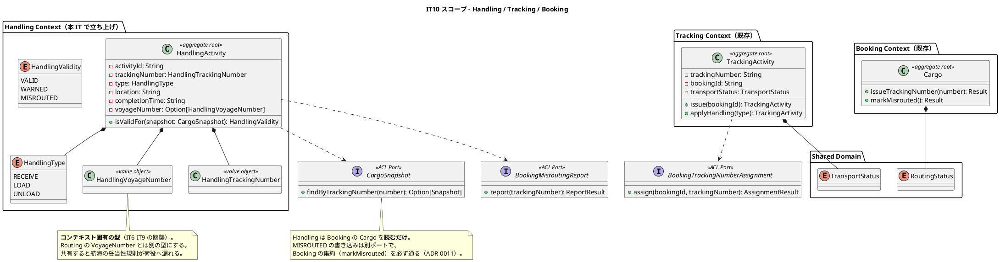
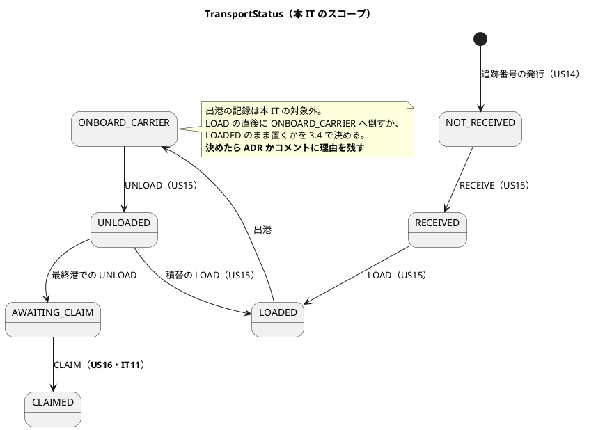
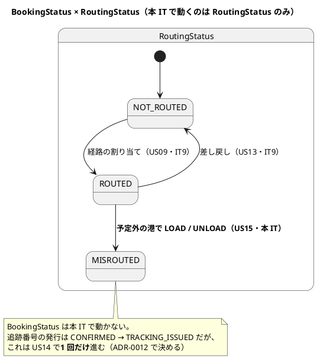
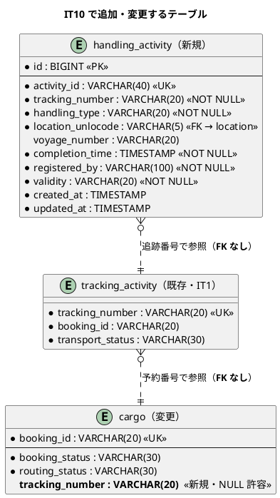
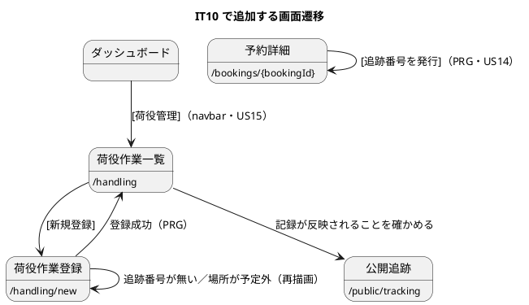

# IT10 イテレーション計画

## 概要

| 項目 | 内容 |
| :--- | :--- |
| 期間 | 2026-08-05 〜（2 週間相当） |
| 局面 | **終盤**（IT8-IT12）。アプローチは**アウトサイドイン** |
| 対象ストーリー | US14（2 SP）・US15（8 SP）・TS17（2 SP） |
| 計画 SP | **12** |
| 新規 Bounded Context | **Handling Context**（本 IT で立ち上げる） |

> **リリース計画では IT10 を 10 SP（US14・US15）としていました**。
> IT9 のレビューが中 14 件・低 12 件を残したため、**返済を独立ストーリー TS17（2 SP）として
> 計上します**（利用者判断・2026-08-05）。「余力があれば」と書かないのは、
> ADR-0008 が 3 イテレーション繰り越した前例があるためです。

---

## ゴール

### イテレーション終了時の達成状態

**確定した予約に追跡番号が発行され、荷役作業員が現場の作業を記録すると、
その結果が荷主の見る追跡画面に反映される**——ここまでが画面から通ります。

これは本プロジェクトで初めて「**コンテキストをまたいで状態が伝播する**」
イテレーションです（Handling → Tracking → 公開追跡、および Handling → Booking の MISROUTED）。

### 成功基準

| # | 基準 | 検証 |
| :--: | :--- | :--- |
| 1 | 確定済み（CONFIRMED）の予約に追跡番号を発行でき、貨物状態が「受領待ち」になる | `TrackingNumberHttpTest` |
| 2 | 追跡番号が一意に採番される（同時発行でも重複しない） | 同上（同時発行テストを含む） |
| 3 | 荷役作業員が追跡番号で貨物を特定し、受領・積込・荷降しを記録できる | `HandlingHttpTest` |
| 4 | 記録後、貨物の輸送状態が対応する状態に**永続化されて**更新される | 同上 + `HandlingActivityTest` |
| 5 | **予定ルートと異なる場所の LOAD / UNLOAD で MISROUTED が確定する** | `HandlingActivityTest`（デシジョンテーブルを表駆動で網羅） |
| 6 | 存在しない追跡番号は「次に何をすればよいか」を言うエラーになる | `HandlingHttpTest` |
| 7 | 荷役作業員が navbar / ダッシュボードから作業入口へ到達できる | `NavigationReachabilityTest` |
| 8 | 全テスト緑・`arch-lint` 0 件・`trace-lint` 0 件・`test:dbnames` 0 件・CI 緑 | クローズ手順 |
| 9 | **SonarQube Quality Gate が PASS** | クローズ時に利用者が実行（下記「品質ゲートの実行手順」） |

---

## IT9 ふりかえりの反映

IT9 の Try 7 件を、本計画のどこで扱うかを明示します。

| Try | 本計画での扱い |
| :--- | :--- |
| **T1** 状態ごとの到達性を DoD に入れる。受入テストは URL 直叩きをやめる | **タスク 2.4・3.5 の DoD**。荷役の記録画面は追跡番号の状態（未発行・発行済・輸送中・引取済）ごとに到達性を確かめる。受入テストは**画面の HTML からリンクを辿る** |
| **T2** 見送りの判断には、その根拠を壊しうる同 IT のタスク名を併記する | **全タスクの DoD**。「いまは要らない」と書くコメントには、同 IT の他タスク名を必ず添える |
| **T3** 同時実行の安全装置は、外したテストが赤くなることを実測してから入れる | **タスク 1.2 の DoD**（追跡番号の一意採番）。赤くできないなら「検証できていない」とコメントに書く |
| **T4** SonarQube の実行方法を着手前に決める | **決定済み**（利用者判断・2026-08-05）。下記「品質ゲートの実行手順」。3 回目の繰り越しにしない |
| **T5** 自作 lint の例外は許可リストで書く。フィクスチャは差分 1 行の対にする | **タスク 4.2 の DoD**（規約 12 を起こす場合） |
| **T6** 設計同期は実装コミットに同梱し、上位の図も開く | **全実装タスクの DoD**。Handling BC を足すので `architecture_backend.md` の**コンテキストマップと規約一覧を必ず開く** |
| **T7** 検査器を作るタスクの DoD に「CI のどのステップから呼ばれるか」を書く | **タスク 4.2 の DoD** |

### 品質ゲートの実行手順（T4 の決定）

SonarQube は `.env.vault` の復号に対話的なパスワード入力が要るため、
**AI エージェント単独では実行できません**。クローズ時に利用者が次を実行し、
結果を AI が受け取って判定します。

```
! npx gulp vault:decrypt      # .env.vault のパスワードを入力する
! npx gulp sonar-local:check  # scan → gate
```

`!` プレフィックスはセッション内でコマンドを実行し、出力を会話へ流し込みます。
**この手順を `docs/operation/` にも書きます**（タスク 4.1）。手順が計画にしか無いと、
次のイテレーションでまた探すことになります。

---

## ユーザーストーリー

### 対象ストーリー

| ID | 内容 | アクター | SP |
| :--- | :--- | :--- | :--: |
| US14 | 追跡番号を発行する | 経路設計者 | 2 |
| US15 | 荷役作業を記録する | 荷役作業員 | 8 |
| TS17 | IT9 レビューの返済 | — | 2 |

### US14: 追跡番号を発行する

| # | 受入基準 | 本 IT での扱い |
| :--: | :--- | :--- |
| 1 | 「予約確定」状態の予約に対して追跡番号を発行できる | **実装** |
| 2 | 追跡番号は一意に採番される | **実装** |
| 3 | 発行後、貨物状態が「受領待ち」に設定される | **実装**（`TransportStatus.NOT_RECEIVED`） |
| 4 | 荷主に追跡番号と追跡方法をメール通知する | **将来リリース**（US12 と同じ通知基盤。画面と計画の両方に明記する） |

### US15: 荷役作業を記録する

| # | 受入基準 | 本 IT での扱い |
| :--: | :--- | :--- |
| 1 | 追跡番号の入力で貨物を特定できる | **実装**（スキャンは対象外。入力欄のみ） |
| 2 | 作業種別（受領・積込・荷降し）を選択できる | **実装**。CLAIM（引取）は **US16・IT11** |
| 3 | 作業日時と作業場所（UN/LOCODE）を入力できる | **実装** |
| 4 | 記録後、貨物状態が対応する状態に自動更新される | **実装**（**カラムに永続化する**。履歴からの再導出を禁じる） |
| 5 | 記録後、荷主に状態変更通知が送信される | **将来リリース**（US12 と同じ通知基盤） |
| 6 | 追跡番号が存在しない場合、エラーメッセージが表示される | **実装** |
| 7 | 作業場所が予定ルートと異なる場合、警告が表示される | **実装**（LOAD/UNLOAD は MISROUTED 確定、RECEIVE は警告） |

### TS17: IT9 レビューの返済（2 SP）

**Day 2 に独立したコミットで行います**。実装タスクと混ぜません。

| # | 返済対象 | 出所 |
| :--: | :--- | :--- |
| 1 | 経路割り当て画面に「現在割り当てられている経路」を表示し、候補一覧の該当行に印を付ける | M10 |
| 2 | 候補の並べ替え（所要日数・概算費用・積替有無）と表示件数の上限 | M11 |
| 3 | 候補未選択で送信したときのメッセージを分ける（＋ラジオに `required`） | M9 |
| 4 | `requiresCsrf` を意味に合う名前へ（「検証が要るか」→「どちらのトークンと照合するか」）。`isValidCsrf` の古い doc も直す | M6 |
| 5 | `findVisibleWithItinerary` の可視範囲判定の複製を畳む | M7 |
| 6 | `statusLabel` の doc コメントが `displayStatusOf` に付け替わっているのを戻す | L1 |
| 7 | 表示ラベル「確認済」を **「予約確定」** へ（US13 の受入基準と現場の呼称に合わせる） | L10・利用者代表 |

**送らないもの**は理由を付けて残します。

| 指摘 | 扱い |
| :--- | :--- |
| M12 確定画面に概算費用が無い | US12（通知）と同じ情報。**US12 と揃えて実装**（将来リリース） |
| M13 差し戻しの記録（日時・理由・外した経路） | **スキーマ変更を伴うため独立ストーリーとして起票**。IT11 の候補 |
| M14 二重送信 Cookie の `__Host-` 未採用 | **ADR で受容範囲を宣言する**（タスク 4.3）。`SameSite=Strict` が主防御 |
| M8 確定・キャンセルで `leg` を全削除・再挿入 | **本 IT で直す**。`leg` を参照する側（荷役実績）が本 IT で現れるため、先送りの前提が崩れる（Try T2 の適用例）→ **タスク 3.2 に含める** |

---

## 壊れ方の観点（6 軸）

着手前に「この機能はどう壊れるか」を書き出します。受入基準は正常系しか書きません。

| 軸 | 問い | 本 IT で該当するもの |
| :--: | :--- | :--- |
| 1 | **状態が永続化されず履歴から再導出されていないか** | 荷役記録後の輸送状態。**カラムに書く**。履歴から導出すると、ユニット緑でもクロスリクエストで誤復帰する（記録済みの教訓） |
| 2 | **同時に来たらどうなるか** | 追跡番号の採番（重複）。同じ貨物への荷役の同時登録 |
| 3 | **その状態のレコードから画面を開けるか** | 追跡番号未発行の予約・引取済の貨物。IT9 H1 の再発防止（Try T1） |
| 4 | **拒まれた理由が画面の表示と食い違わないか** | MISROUTED の警告。存在しない追跡番号 |
| 5 | **横断的な防御が正常な経路を巻き込まないか** | 荷役登録はヘルスチェックを巻き込まない（IT7 の再発防止） |
| 6 | **BC をまたぐ書き込みが集約を通っているか** | Handling → Booking（MISROUTED）・Tracking → Booking（追跡番号）。ADR-0011 の形を踏襲する |

---

## タスク

### 0. 着手前の準備（0 SP）

| # | タスク | 内容 |
| :--: | :--- | :--- |
| 0.1 | 設計ドキュメントの読み合わせ | `domain-model.md` の Tracking / Handling 節、`data-model.md` の該当テーブル、`ui_design.md` の荷役画面 |
| 0.2 | **ADR-0012 の起票**（追跡番号の発行主体） | 下記「ADR」節 |
| 0.3 | **US14 の画面が `ui_design.md` の画面一覧に無い**ことの是正 | 設計への反映が必要（下記「設計ドキュメントへの反映」） |

### 1. US14: 追跡番号の発行（2 SP・Day 1）

| # | タスク | 理想時間 |
| :--: | :--- | :--: |
| 1.1 | 受入テスト（HTTP）を先に書く——確定済みの予約から発行 → 貨物状態が「受領待ち」 | 4 |
| 1.2 | 採番と一意性。**同時発行のテストを書き、一意制約を外すと赤くなることを実測する**（Try T3） | 4 |
| 1.3 | Booking への記録（ACL ポート経由・ADR-0012） | 4 |
| 1.4 | 画面（予約詳細からの発行導線）とナビゲーション整合 | 4 |

### 2. TS17: IT9 レビューの返済（2 SP・**Day 2 に独立したコミット**）

| # | タスク | 理想時間 |
| :--: | :--- | :--: |
| 2.1 | 経路割り当て画面: 現在の経路の表示・並べ替え・件数上限（M10・M11） | 8 |
| 2.2 | 未選択メッセージ・`requiresCsrf` のリネーム・可視範囲判定の重複・doc 位置（M9・M6・M7・L1） | 4 |
| 2.3 | 表示ラベル「確認済」→「予約確定」（L10） | 2 |
| 2.4 | **状態ごとの到達性の確認**（Try T1）。IT9 で作った画面を状態の数だけ開く | 2 |

### 3. US15: 荷役作業の記録（8 SP・Day 3-8）

| # | タスク | 理想時間 |
| :--: | :--- | :--: |
| 3.1 | 受入テスト（HTTP）を先に書く——追跡番号で特定 → 受領を記録 → 公開追跡に反映 | 8 |
| 3.2 | **Handling Context の立ち上げ**（新 BC）。`HandlingActivity` 集約・`HandlingType`・`isValidFor` のデシジョンテーブル。**効果を要求しない純粋なドメイン**（終盤でも新 BC のドメインは中盤の規律） | 12 |
| 3.3 | `CargoSnapshot` ACL ポート（Handling → Booking の読み）。**M8 の返済を含む**（`leg` の全削除・再挿入をやめる） | 8 |
| 3.4 | 輸送状態の更新（Handling → Tracking）。**カラムに永続化する**（観点 1） | 8 |
| 3.5 | MISROUTED の確定（Handling → Booking）。ADR-0011 の形で集約を通す | 8 |
| 3.6 | 画面（`/handling` 一覧・`/handling/new` 登録）とナビゲーション整合。**navbar の `荷役管理` を `Planned` → `Implemented` へ** | 8 |

### 4. 観測・規律・ドキュメント（0 SP）

| # | タスク | 内容 |
| :--: | :--- | :--- |
| 4.1 | **SonarQube の実行手順を運用ドキュメントへ**（Try T4） | `docs/operation/` に手順を書く |
| 4.2 | **規約 12 の起票判断**（BC の SQL に現れるテーブルは自 BC 所有か ACL 配下）。IT4 M1 由来で 5 イテレーション未着手。**Handling が SQL で他 BC のテーブルを引く誘惑が本 IT で最大**になる | 実装するなら Try T5・T7 の DoD を適用 |
| 4.3 | **ADR: ログイン CSRF の受容範囲**（M14） | `SameSite=Strict` を主防御とする判断を残す |
| 4.4 | 設計ドキュメントの同期（**実装コミットに同梱**・Try T6） | 下記「設計ドキュメントへの反映」 |

### タスク合計

| 区分 | SP | 理想時間 |
| :--- | :--: | :--: |
| US14 | 2 | 16 |
| TS17 | 2 | 16 |
| US15 | 8 | 52 |
| 観測・規律 | 0 | — |
| **合計** | **12** | **84** |

---

## 縮退順序（着手前に確定させる）

判定日に間に合わない見込みなら、**上から順に**落とします。

| 順 | 落とすもの | 理由 |
| :--: | :--- | :--- |
| 1 | US15 受入基準 7 のうち **RECEIVE / CLAIM の警告**（LOAD/UNLOAD の MISROUTED は残す） | 警告は業務を止めない。MISROUTED は貨物が違う船に乗る話であり落とせない |
| 2 | 荷役作業一覧（`/handling`）の検索・絞り込み | 登録できることが先。一覧は全件表示で始める |
| 3 | TS17 のうち M10・M11（経路割り当て画面の改善） | 返済であり、業務は現状でも回る。**ただし落としたら IT11 で必ず返す**（繰り越しの固定化を防ぐため、落とす場合は IT11 計画に先に書く） |

**US14 と US15 の受入基準 1-6 は落としません**。落とすと業務フローが繋がらず、
終盤の目的（業務として成立させる）を満たしません。

### 縮退の判定日

**Day 6 終了時**。US15 のタスク 3.1-3.4 が終わっていなければ、上の順で落とします。

---

## 設計

### ドメインモデル（本 IT のスコープ）



### 状態遷移（本 IT のスコープ）

**2 つの軸が別々に動きます**（IT9 で確立した形）。





### データモデル（本 IT のスコープ）

`tracking_activity` / `tracking_handling_event` は **IT1 で作成済み**です（読み取りのみ使用）。
本 IT で追加するのは次の 2 つです。



**FK を張らない箇所**（コンテキストを越える参照）:

| 参照 | 理由 |
| :--- | :--- |
| `handling_activity.tracking_number` → `tracking_activity` | Handling → Tracking。BC を越える（`leg.voyage_number` と同じ判断） |
| `handling_activity.voyage_number` → `voyage` | Handling → Routing。同上 |
| `tracking_activity.booking_id` → `cargo` | 既存（IT1 から FK なし） |

**マイグレーション**: `V11__add_tracking_number_and_handling.sql`

> **注（設計への反映が必要）**: `data-model.md` の `handling_activity` は
> `booking_id` を持つ設計になっています。本 IT では**追跡番号で引く**
> （US15 受入基準 1 が「追跡番号の入力で貨物を特定できる」と書いている）ため、
> **設計側を追跡番号に合わせて是正します**（タスク 4.4）。
> `customs_declaration` は US16（IT11）まで作りません。

### ユーザーインターフェース（本 IT のスコープ）



| 画面 | URL | ロール | 状態 |
| :--- | :--- | :--- | :--- |
| 追跡番号の発行 | `/bookings/{bookingId}` 内の操作 | 経路設計者 | **新規**（専用画面は作らない） |
| 荷役作業一覧 | `/handling` | 荷役作業員・追跡管理者 | **新規** |
| 荷役作業登録 | `/handling/new` | 荷役作業員 | **新規** |

> **注（設計への反映が必要）**: `ui_design.md` の画面一覧に
> **追跡番号の発行に関する記述がありません**。US14 は専用画面を作らず
> 予約詳細の操作にするため、予約詳細の仕様へ追記します（タスク 4.4）。
> また `ui_design.md:125` の「荷役管理 … 準備中（US15・**IT9**）」は
> IT10 の誤りです（同時に是正）。

### ナビゲーション整合性

**荷役作業員（ROLE_HANDLER）は現在、押せる入口を 1 つも持っていません**
（`ui_design.md:135`。IT7 から続く状態）。本 IT で解消します。

| 確認箇所 | 内容 |
| :--- | :--- |
| `ui_design.md` の画面一覧・ナビゲーション表 | 荷役 2 画面を「実装済み」へ |
| `Layout.navItems` | 「荷役管理」を `NavStatus.Planned` → `Implemented` へ |
| ダッシュボード | 荷役作業員向けの作業入口（[荷役を登録する]） |
| `NavigationReachabilityTest` | 荷役作業員が 2 クリック以内で登録画面へ到達できること |

**状態ごとの到達性**（Try T1）も併せて確かめます。

| 貨物の状態 | 荷役を登録できるか | 画面の見え方 |
| :--- | :---: | :--- |
| 追跡番号 未発行 | ✕ | 追跡番号で引けない → 「その追跡番号は登録されていません」 |
| NOT_RECEIVED | ✅ RECEIVE | |
| RECEIVED / UNLOADED | ✅ LOAD | |
| LOADED / ONBOARD_CARRIER | ✅ UNLOAD | |
| CLAIMED | ✕ | US16（IT11）まで到達しない |

### ADR

| # | 主題 | 判断が要る理由 |
| :--- | :--- | :--- |
| **ADR-0012** | **追跡番号の発行主体と書き込みの向き** | Tracking が採番するのか Booking が採番するのか、`cargo.tracking_number` を誰が書くのかが決まっていない。ADR-0011（Routing は Booking の集約を通して書く）の形を踏襲するのが自然だが、**明示しないと 3 つ目の BC で同じ議論を繰り返す**。一般形として決める |
| （検討） | ログイン CSRF の受容範囲（M14） | `SameSite=Strict` を主防御とし `__Host-` を採らない判断（タスク 4.3） |
| （検討） | 規約 12（BC の SQL に現れるテーブル） | 起票するかを 4.2 で判断する |

---

## スケジュール

| Day | 内容 |
| :--- | :--- |
| 1 | タスク 0（ADR-0012・設計の読み合わせ）+ US14 全体 |
| 2 | **TS17（返済枠・独立したコミット）** |
| 3-4 | US15 受入テスト（3.1）+ Handling ドメイン（3.2） |
| 5-6 | ACL ポート（3.3）+ 輸送状態の更新（3.4）。**Day 6 終了時が縮退の判定日** |
| 7-8 | MISROUTED（3.5）+ 画面とナビゲーション（3.6） |
| 9 | 観測・規律・ドキュメント（タスク 4）。**取りこぼしの確認だけにする** |

---

## リスクと対策

| リスク | 影響 | 対策 |
| :--- | :--- | :--- |
| **Handling が新規 BC で 8 SP** | 見積もりを超える | 終盤でも**新 BC のドメインは中盤の規律**で組む（効果を要求しない・現在時刻は引数）。受入テストだけ先に書く |
| **BC をまたぐ状態伝播が初めて** | 見えないバグ | **状態はカラムに永続化する**（履歴からの再導出を禁じる）。記録済みの教訓が直接あたる |
| MISROUTED のデシジョンテーブルが 4 種 × 場所判定 | 実装漏れ | **表駆動テスト**で網羅する（US16 の CLAIM 行も表には書き、本 IT では未実装と明示） |
| `leg` の全削除・再挿入（M8）が荷役の参照を壊す | 参照の破損 | **タスク 3.3 で先に返す**（Try T2 の適用例。前提が崩れたので見送りを撤回する） |
| 追跡番号の採番が同時発行で重複 | 業務停止 | DB の UNIQUE 制約 + 同時発行テスト。**外して赤くなることを実測する**（Try T3） |

---

## 完了条件

### Definition of Done

- [ ] 全受入基準を満たす（将来リリースへ送るものは**画面と計画の両方に明記**）
- [ ] 全テスト緑・`arch-lint` 違反 0 件・`trace-lint` 違反 0 件・`test:dbnames` 重複 0 件
- [ ] CI 緑
- [ ] **SonarQube Quality Gate が PASS**（利用者が実行。手順は上記）
- [ ] **状態ごとの到達性を確認**（Try T1）。受入テストは URL 直叩きでなく画面のリンクを辿る
- [ ] 見送りの判断に**その根拠を壊しうる同 IT のタスク名を併記**（Try T2）
- [ ] 同時実行の安全装置は**外して赤くなることを実測**（Try T3。できないならその旨を書く）
- [ ] 各実装コミットのメッセージに**壊れ方の観点の該当行を引用**
- [ ] `docs/design/` への反映を**実装と同じコミット**で行い、`architecture_backend.md` の
      コンテキストマップと規約一覧も開く（Try T6）
- [ ] ADR-0012 を起票

### デモ項目

| # | デモ項目 | 対応するテスト |
| :--: | :--- | :--- |
| 1 | 経路設計者が確定済みの予約に追跡番号を発行する（貨物状態が「受領待ち」になる） | `TrackingNumberHttpTest.testRouterIssuesTrackingNumber` |
| 2 | 荷役作業員が追跡番号で貨物を特定し、受領を記録する | `HandlingHttpTest.testHandlerRegistersReceive` |
| 3 | 記録が公開追跡画面に反映される | `HandlingHttpTest.testHandlingIsReflectedInPublicTracking` |
| 4 | 予定外の港で積込を記録すると MISROUTED になる | `HandlingActivityTest.testLoadAtUnplannedPortIsMisrouted` |
| 5 | 荷役作業員が navbar から作業入口へ到達できる | `NavigationReachabilityTest.testHandlerReachesHandlingRegistration` |

> **E2E（Playwright）は IT11 以降**とします。IT9 計画で「業務フローが US14 まで通って
> 初めてシナリオ 1 本が端から端まで書ける」と書きましたが、**引取（US16）まで無いと
> 貨物が荷主の手に渡りません**。IT11 で US16 が入った時点でシナリオ 1 本を書きます。

---

## 前イテレーション（IT9）からの引き継ぎ

### 本 IT で扱うもの

| 内容 | 扱い |
| :--- | :--- |
| IT9 レビュー 中 9 件・低 12 件のうち 7 件 | **TS17**（2 SP・Day 2） |
| M8（`leg` の全削除・再挿入） | **タスク 3.3**（前提が崩れたため見送りを撤回） |
| Try T1-T7 | 上記「IT9 ふりかえりの反映」 |
| SonarQube の実行方法 | **決定済み**（利用者がクローズ時に実行） |

### 本 IT で扱わないもの（方針を明記する）

| 内容 | 方針 |
| :--- | :--- |
| **行ロックが働くことの検証**（IT9 P3） | **IT10 でも解けていない**。テスト構成が要求を直列化するため、識別できるテストの書き方を探す。**見つからなければ「検証していない」と書き続ける**——緑にして忘れない |
| 間欠失敗（`Set-Cookie` 欠落・404） | 再現したら診断情報を記録する。IT9 の H5・H6 で診断は強化済み |
| M13（差し戻しの記録） | **独立ストーリーとして起票**。IT11 の候補 |
| M12（確定画面の概算費用） | US12（通知）と揃えて実装（将来リリース） |
| US15 受入基準 4・5 の通知 | 将来リリース（US12 と同じ通知基盤） |

---

## 設計ドキュメントへの反映（タスク 4.4）

**実装コミットに同梱します**（Try T6）。

| # | 対象 | 是正内容 |
| :--: | :--- | :--- |
| 1 | `ui_design.md:125` | 「荷役管理 … 準備中（US15・**IT9**）」→ IT10・実装済み |
| 2 | `ui_design.md` 画面一覧 | 荷役 2 画面を実装済みへ。**追跡番号の発行**を予約詳細の仕様に追記 |
| 3 | `ui_design.md:135` | 「押せる入口を 1 つも持たないロール」から荷役作業員を外す |
| 4 | `data-model.md` `handling_activity` | `booking_id` → `tracking_number` で引く形へ。`V11` をマイグレーション一覧に追加 |
| 5 | `data-model.md` `cargo` | `tracking_number` を「将来追加予定カラム」から実装済みへ |
| 6 | `domain-model.md` Handling 節 | 実装した範囲（RECEIVE/LOAD/UNLOAD）と未実装（CLAIM・通関）を明示 |
| 7 | `architecture_backend.md` | **コンテキストマップに Handling の ACL 2 本を追加**。認可表に荷役ルートを追加 |
| 8 | `business_rule_traceability.md` | TR-1（追跡番号）・HD-*（荷役）の該当行を「済」へ |
| 9 | `operation.md` | 荷役作業員の日次手順。**SonarQube の実行手順**（タスク 4.1） |

---

## 実績（クローズ時に記入）

| ストーリー | 計画 SP | 実績 SP | 状態 |
|-----------|:--:|:--:|------|
| US14 | 2 | - | - |
| TS17 | 2 | - | - |
| US15 | 8 | - | - |
| **合計** | **12** | **-** | |

---

## 更新履歴

| 日付 | 更新内容 |
| :--- | :--- |
| 2026-08-05 | 初版作成。利用者判断 2 件（TS17 を計上し 10 → 12 SP・SonarQube は利用者がクローズ時に実行）を反映 |

---

## 関連ドキュメント

- [リリース計画](release_plan.md)
- [開発戦略](development_strategy.md)
- [IT9 ふりかえり](retrospective-9.md)
- [IT9 実装レビュー](../review/IT9実装_review_20260805.md)
- [ドメインモデル設計](../design/domain-model.md)
- [データモデル設計](../design/data-model.md)
- [UI 設計](../design/ui_design.md)
