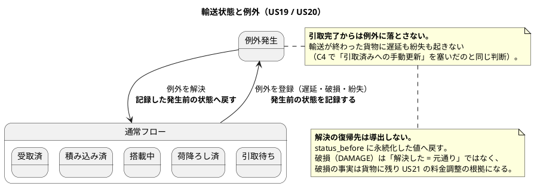
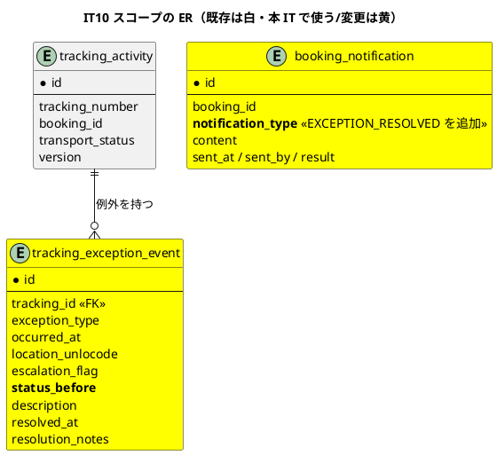
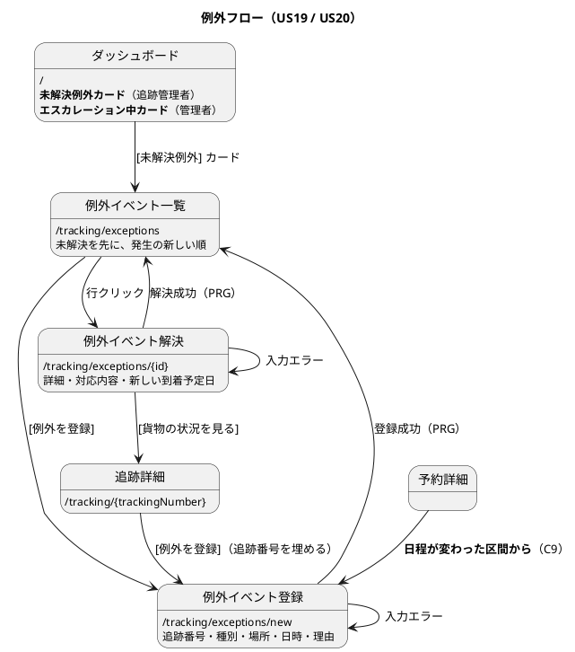

# イテレーション 10 計画

## 概要

| 項目 | 内容 |
| :--- | :--- |
| イテレーション | IT10 |
| リリース | 1.1 実運用補完 |
| 期間 | 2026-08-09 〜 2026-08-10（10 営業日相当） |
| 局面 | **終盤**（`development_strategy.md`。アプローチ: アウトサイドイン） |
| 計画 SP | **10SP**（US19 5SP / US20 5SP） |
| 前提 | IT9 クローズ済み（累計 71SP / 71SP、9 IT 連続で計画 = 実績） |

---

## ゴール

**輸送が計画どおりに進まなくなったとき、その事実を記録し、荷主に伝え、対応を追える状態にする。**

これまでの 9 イテレーションが作ってきたのは「うまくいく道」だった。予約し、経路を割り当て、確定し、追跡番号を発行し、荷役を記録し、引き取る。IT10 で扱うのは**その道から外れたとき**である。遅延・破損・紛失は例外的な出来事ではなく、国際輸送では日常的に起きる。

---

## 前イテレーションの学びの反映（ふりかえり Try）

IT9 のふりかえり（`retrospective-9.md`）の Try 8 件を、本計画のタスクと DoD に落とす。

| Try | 内容 | 本計画への反映 |
| :--- | :--- | :--- |
| T1 | **ドメインが例外で拒む経路には、画面から踏むテストを必ず対にする** | タスク 1・3 の進め方。DoD「主張とテスト」に条項を追加 |
| T2 | **「気づく手段」を作ったら、そこから次の行動へ行けるかを確かめる** | タスク 4（到達性）。**本 IT の主眼そのもの**（例外は「気づく」ための機能である） |
| T3 | 早見表に行を足すときは文言の出どころを確かめる | タスク 5-2（マニュアル）の手順 |
| T4 | 「今後の提供」の記述を一括棚卸し | タスク 0（返済枠） |
| T5 | 認可のパターンは「一致してほしくない URL」もテストに書く | タスク 3-3 と DoD |
| T6 | テストが時刻・日付を作る場所を 1 か所に集める | DoD。**絶対日付を書かない** |
| T7 | 新しいテストクラスは既存が使っていない港（データ）を使う | タスク 1 の注 |
| T8 | **返済枠は IT 序盤の独立コミットで先に着手する** | **タスク 0 を最初に置く**（IT9 と同じ形） |

---

## 返済枠（タスク 0。**序盤に先に着手する**）

IT9 のふりかえりで持ち越した C1〜C17 のうち、**構造に関わるもの**と**時限式のもの**を先に返す。

| # | 内容 | 由来 | 扱い |
| :--- | :--- | :--- | :--- |
| C1 | `shared.application` が ArchUnit のどのルールにも守られていない。ADR-005 本文にも位置づけが無い | IT9 レビュー M1 | **返す。** ADR-005 に「`shared.application` は BC 横断の約束のみ」を追記し、クラス名を列挙する ArchUnit ルールを追加（**違反クラスを一時的に足して赤を確認してから有効化**） |
| C2 | `CargoSpecification.of` / `reconstruct` が `create` の不変条件を素通りできる | IT9 レビュー M2 | **返す。** `of` を `create` に委譲し、`reconstruct` の用途を Javadoc で限定 |
| C3 | `Voyage.reschedule(command)` の 1 引数版が出港済み検査を無効化する入口 | IT9 レビュー M3 | **返す。** 削除し、テストは明示的に `Instant` を渡す |
| C4 | 認可判定で UUID を文字列比較している | IT9 レビュー M4 | **返す。** `UUID` 同士で比較する |
| C5 | 完全修飾名でのインライン参照（ADR-012 の依存測定の根拠を弱める） | IT9 レビュー M5 | **返す。** import に揃える |
| C13 | `ShipperSelfServiceTest` が共有の `users` 行を書き換えたまま戻さない | IT9 レビュー M12 | **返す。** 後片付けを入れる |
| C15 | 実装済みなのに「今後の提供」と書かれた記述 5 箇所 | IT9 レビュー / T4 | **返す。** 一括で棚卸しする |
| C14 | 付録 B の見出し番号の重複（Q3-6 の位置、Q4-4・Q5-3 の重複） | IT9 以前からの負債 | **返す。** 番号を振り直す |
| C17 | `data-model.md` の列が実スキーマに存在するかの検査が無い | IT9 レビュー | **返す。** `H2DialectSmokeTest` の系統に検査を足す（**危険物 6 列が 8 IT 残った原因**） |

**返さないもの**（理由を明記する）

| # | 内容 | 理由 |
| :--- | :--- | :--- |
| C6 | 温度の境界・危険物クラスの妥当性・C10 の秒単位の境界 | **US05 の追検証であり、本 IT のスコープ（例外対応）と重ならない。** IT11 の返済枠に送る |
| C7 | 更新確定後のフラッシュに影響件数が残らない | 同上（US25 の追補）。IT11 |
| C8 | 荷主の予約詳細に一覧へ戻る導線・追跡へのリンクが無い | 同上（US34 の追補）。IT11 |
| C11 | 荷主の紐付けを営業・管理者が画面で確認する手段が無い | **US32（荷主情報の訂正）の延長であり、画面を 1 つ足す判断が要る。** IT11 |
| C12 | US05 受入基準 3 が E2E 1 本だけで支えられている | IT11 の返済枠 |
| C16 | ADR-013 の「紐付けは運用手順」の手順書の所在 | **C11 と同時に扱う**（画面ができれば手順書の対象が変わる）。IT11 |

**C9 / C10 は返済枠ではなくスコープ内で扱う**（次節）。

---

## 対象ユーザーストーリー

| ID | ユーザーストーリー | SP | 優先度 | Issue |
| :--- | :--- | :--- | :--- | :--- |
| US19 | 遅延例外を処理する | 5 | 必須 | [#502](https://github.com/k2works/case-study-cargo-tracker/issues/502) |
| US20 | 破損・紛失例外を処理する | 5 | 必須 | [#503](https://github.com/k2works/case-study-cargo-tracker/issues/503) |
| | **合計** | **10** | | |

> マイルストーンは 2 件とも `[java/take-6] Release 1.1 実運用補完`、ラベルは `it10` である。
> **java/take-6 には GitHub Project を作っていない。** イテレーションの割り当ては
> `it10` ラベルとマイルストーンで表す。

### 実装順序

**US19 → US20** の順に進める。US19 が例外の記録・状態遷移・通知・解決という**骨格**を作り、US20 はそこに**エスカレーション**という一段強い扱いを足す。逆順にすると、エスカレーションの判断を骨格が無いまま設計することになる。

### 受入基準

受入基準の正典は [ユーザーストーリー](../requirements/user_story.md) である。**本計画に書き写さず引用する。**

- US19: [US19 の受入基準](../requirements/user_story.md#us19-遅延例外を処理する)
- US20: [US20 の受入基準](../requirements/user_story.md#us20-破損紛失例外を処理する)

### 受入基準のうち解釈が要るもの

| 内容 | 扱い | 理由 |
| :--- | :--- | :--- |
| US19「荷主に遅延発生の通知が送信される」/ US20「荷主に破損・紛失発生の通知が送信される」 | **記録として満たす。** 外部へは送らない（ADR-006） | 通知の実体は記録である（US12 / IT8 で確立）。`BookingNotification` に `EXCEPTION_RAISED` として積む |
| US19「対応内容を入力して荷主に対応報告を送信できる」 | **満たす。** 新しい通知種別 `EXCEPTION_RESOLVED` を足す | 発生と解決は荷主にとって別の知らせである。同じ種別にすると履歴で区別できない |
| US20「管理職への escalation 通知が送信される」 | **記録＋画面で満たす。** 外部へは送らない（ADR-006） | **「送った」だけで誰も見ないなら意味が無い。** エスカレーション済みの例外を管理者が見る場所を作る（後述の設計反映 #4） |
| 「貨物状態が『例外発生』に更新される」 | **満たす。** `TransportStatus.EXCEPTION` へ遷移し、**発生前の状態を `status_before` に永続化する** | 解決時の復帰先を履歴から再導出すると、ユニット緑でもリクエストをまたいで誤った状態に戻る（`data-model.md` の注記。IT6 の教訓と同型） |

### 本 IT で扱う IT9 の持ち越し（C9 / C10）

| # | 内容 | 本 IT での扱い |
| :--- | :--- | :--- |
| C9 | **荷主が予約詳細で古い到着日時を見る可能性。** 経路の区間は割り当て時の写しで、航海を更新しても書き換わらない | **US19 の一部として扱う。** 「日程が当初と違う」ことを荷主に伝えるのが遅延例外そのものである。航海スケジュールが変わった区間に印を出し、**遅延例外の登録へ導く** |
| C10 | **運航変更に気づけるのが経路設計者だけ。** 営業担当者は担当荷主の日程が変わったことを知る手段が無い | **US19 の一部として扱う。** 例外イベント一覧を「連絡すべき仕事の待ち行列」として作り、ダッシュボードの未解決例外カードから到達させる |

**C9 / C10 を返済枠でなくスコープ内に置く理由**: どちらも「荷主に日程の変更を伝える」という US19 の目的そのものである。返済枠に置くと「余力次第」になり、[ADR-008 が IT6〜IT8 で 3 回繰り越された](retrospective-9.md)のと同じ形になる。

---

## 設計への反映が必要（当該 IT で対応）

着手前の突合で見つかった差分。**当該 IT で設計ドキュメントに反映する。**

| # | 対象 | 内容 | 反映先 |
| :--- | :--- | :--- | :--- |
| 1 | マイグレーション / `data-model.md` | **`tracking_exception_event` に発生場所の列が無い**（`status_before` / `escalation_flag` / `resolution_notes` は V1 にある）。正典の列定義にも `location` が無く、受入基準「発生状況（場所・日時・理由）」を満たせない | マイグレーション（V22）と `data-model.md` |
| 2 | `booking_notification` の CHECK | `EXCEPTION_RESOLVED` が制約に無い（V16 / V19 は 4 種別まで） | マイグレーション（V22） |
| 3 | `domain-model.md` | `TrackingExceptionEvent` の図に **`statusBefore` / `resolutionNotes`** が無い（`data-model.md` には列がある） | `domain-model.md` |
| 4 | `ui_design.md` | **エスカレーションされた例外を管理者が見る場所が定義されていない。** 例外管理は `ROLE_TRACKER` のみで、US20 の「管理職への escalation」の受け皿が無い | `ui_design.md` 画面一覧・ナビゲーション構成 |
| 5 | `ui_design.md` | **ダッシュボードのカード定義に `ROLE_ADMIN` の行が無い**（他の 6 ロールにはある）。管理者がエスカレーションに気づく場所を置けない。**追跡管理者の「未解決の例外」カードは定義済み**（実測） | `ui_design.md` ダッシュボード |
| 6 | `domain-model.md` | **例外の解決で復帰する先が `status_before` であることが要素表に無い**（ビジネスルール 5 は「例外発生前の状態」とだけ書く） | `domain-model.md` |
| 7 | `domain-model.md` | ビジネスルール 4「CUSTOMS_HOLD は税関システムから自動登録」は **ADR-006（外部連携しない）と矛盾する** | `domain-model.md`（US29 / IT11 の範囲として書き直す） |
| 8 | `non_functional.md` | ROLE_ADMIN の権限範囲に例外のエスカレーション確認が無い | `non_functional.md` §4.1 |
| 9 | `ui_design.md` | 例外イベント一覧の**並び順が定義されていない**（未解決が先か、発生順か）。他の待ち行列（経路割り当て待ち・追跡番号発行待ち）は「期限の近い順」と明記されている | `ui_design.md` |
| 10 | ADR | **例外解決時の状態復帰をどう表すか**（`status_before` の永続化）は既に `data-model.md` が決めている。**ADR は起票しない**が、実装が正典どおりであることをテストで固定する | 判断済み（ADR 不要） |

---

## 設計（IT10 スコープ）

### ドメインモデル図

```plantuml
@startuml
title IT10 スコープのドメインモデル（既存は白・本 IT で追加/変更は黄）

package "Tracking Context" {
  class TrackingActivity <<集約ルート>> #Yellow {
    + trackingNumber
    + transportStatus
    + exceptions <<新>>
    + raiseException(ex) <<新>>
    + resolveException(id, notes) <<新>>
    + hasActiveException() <<新>>
  }
  class TrackingExceptionEvent <<エンティティ>> #Yellow {
    + exceptionType
    + location / occurredAt
    + description
    + escalationFlag
    + statusBefore <<復帰先>>
    + resolvedAt / resolutionNotes
    + 解決済みか()
  }
  enum ExceptionType #Yellow {
    DELAY
    DAMAGE
    LOST
    CUSTOMS_HOLD
    + エスカレーションが要るか()
  }
  TrackingActivity *-- TrackingExceptionEvent
  TrackingExceptionEvent *-- ExceptionType
}

note bottom of TrackingExceptionEvent
  **発生前の状態を永続化する。**
  荷役イベント履歴から再導出すると、
  ユニット緑でもリクエストをまたいで
  誤った状態に復帰する（data-model.md）。
end note

package "Booking Context" {
  class BookingNotification <<集約ルート>> {
    + notificationType
    + content
  }
  enum NotificationType #Yellow {
    ROUTE_CONFIRMED
    SCHEDULE_CHANGED
    EXCEPTION_RAISED
    EXCEPTION_RESOLVED <<新>>
    STATUS_UPDATED
  }
  BookingNotification *-- NotificationType
}

package "shared" {
  class CargoExceptionRaisedEvent <<ドメインイベント>> #Yellow
  class CargoExceptionResolvedEvent <<ドメインイベント>> #Yellow
}

TrackingActivity ..> CargoExceptionRaisedEvent : 発行
TrackingActivity ..> CargoExceptionResolvedEvent : 発行
CargoExceptionRaisedEvent ..> BookingNotification : 購読して記録
CargoExceptionResolvedEvent ..> BookingNotification : 購読して記録

note bottom of CargoExceptionRaisedEvent
  **Tracking から Booking を呼ばない**（ADR-012）。
  起きた事実をイベントで伝え、通知の記録は
  Booking が自分で作る（ADR-009）。
  US17 の CargoStatusUpdatedEvent と同じ形。
end note
@enduml
```

### 状態遷移図（IT10 スコープ）



### ER 図（IT10 スコープ）



> **`tracking_exception_event` は V1 で作成済みだが、発生場所の列が無い**（実測）。
> 受入基準「発生状況（**場所**・日時・理由）を記録できる」を満たすため、
> `location_unlocode`（FK → `location`）を V22 で追加する。
> あわせて `booking_notification.notification_type` の CHECK に
> `EXCEPTION_RESOLVED` を足す。
>
> **IT9 の危険物 6 列と同じ形の見落としである**（テーブルはあるが列が足りない）。
> C17 の検査（`data-model.md` の列が実スキーマにあるか）は、まさにこれを
> 機械で捕まえるためのものである。**本 IT では検査が無い状態で人が見つけた。**

### 画面遷移図（IT10 スコープ）



---

## タスク分解

### 0. 返済枠（**最初に着手する**。IT9 の Try T8）

| # | タスク | 見積 |
| :--- | :--- | :--- |
| 0-1 | **C1: `shared.application` を ArchUnit で固定** + ADR-005 に位置づけを追記。**違反クラスを足して赤を確認してから有効化** | 2.5h |
| 0-2 | C2 / C3: 不変条件を素通りする入口（`of` の委譲・`reschedule` の 1 引数版）を塞ぐ | 2.0h |
| 0-3 | C4 / C5: UUID の比較・完全修飾名の整理 | 1.5h |
| 0-4 | C13: テストの後片付け。C17: **`data-model.md` の列が実スキーマにあるかの検査** | 2.5h |
| 0-5 | C14 / C15: 付録 B の番号振り直しと「今後の提供」の棚卸し | 1.5h |
| | **小計** | **10.0h** |

### 1. 受け入れテスト（赤）とドメイン

| # | タスク | 見積 |
| :--- | :--- | :--- |
| 1-1 | US19 / US20 の受け入れテストを**赤で**書く（受入基準に 1:1） | 4.0h |
| 1-2 | `TrackingExceptionEvent` と `ExceptionType`。**紛失はエスカレーションが要る**を列挙型が持つ | 3.0h |
| 1-3 | `TrackingActivity.raiseException` / `resolveException`。**発生前の状態を記録し、解決でそこへ戻す** | 4.0h |
| 1-4 | **引取完了からは例外に落とさない**（C4 と同じ判断）。二重解決も拒む | 2.0h |
| | **小計** | **13.0h** |

> **テストデータの港は既存テストが使っていないものを選ぶ**（Try T7）。
> **日時は `Clock` 相対で作る。絶対日付を書かない**（Try T6）。

### 2. 永続化

| # | タスク | 見積 |
| :--- | :--- | :--- |
| 2-1 | `V22`（`tracking_exception_event.location_unlocode` の追加 ＋ `EXCEPTION_RESOLVED` の CHECK 追加） | 1.5h |
| 2-2 | 例外の読み書き（集約全体で保存）と Testcontainers のテスト | 3.0h |
| 2-3 | 例外イベント一覧のクエリ（**未解決を先に、発生の新しい順**。N+1 を作らない） | 2.5h |
| 2-4 | ドメインイベント（`CargoExceptionRaisedEvent` / `CargoExceptionResolvedEvent`）と Booking 側の購読 | 3.0h |
| | **小計** | **10.0h** |

### 3. アプリケーションと画面（アウトサイドインの主戦場）

| # | タスク | 見積 |
| :--- | :--- | :--- |
| 3-1 | 例外イベント一覧（未解決フィルタ・エスカレーションの強調） | 3.0h |
| 3-2 | 例外イベント登録（PRG。追跡詳細からは追跡番号を埋めて開く） | 3.5h |
| 3-3 | 例外イベント解決（対応内容・新しい到着予定日）。**認可は「一致してほしくない URL」もテストに書く**（Try T5） | 3.5h |
| 3-4 | ダッシュボードの**未解決例外カード**（追跡管理者）と**エスカレーション中カード**（管理者） | 2.5h |
| 3-5 | **C9: 日程が変わった区間に印を出し、遅延例外の登録へ導く** | 3.0h |
| 3-6 | **C10: 例外イベント一覧を「連絡すべき仕事の待ち行列」にする**（誰に連絡するのかが読める） | 2.0h |
| | **小計** | **17.5h** |

### 4. E2E とテスト

| # | タスク | 見積 |
| :--- | :--- | :--- |
| 4-1 | E2E: 遅延の発生 → 荷主への記録 → 解決 → 状態が元に戻る | 3.0h |
| 4-2 | E2E: 紛失の発生 → エスカレーション → 管理者が見る | 2.5h |
| 4-3 | **T4: 安全装置を「その装置だけを壊して」赤にする**（10 件） | 3.0h |
| 4-4 | **T5: E2E の操作を 1 本ずつ外して赤になることを確かめる** | 1.5h |
| 4-5 | **Try T1: ドメインが例外で拒む経路に、画面から踏むテストを対にする**（新規の `throw` を数え、対応表を作る） | 2.0h |
| | **小計** | **12.0h** |

### 5. ドキュメント

| # | タスク | 見積 |
| :--- | :--- | :--- |
| 5-0 | **T2: 正典の受入基準を 1 行ずつ指差す** | 1.0h |
| 5-1 | 設計ドキュメントの反映（9 件。ADR は起票しない） | 3.5h |
| 5-2 | マニュアル更新（**07-追跡管理に例外の章を追加**）＋キャプチャ再生成。**早見表は文言の出どころを確かめてから書く**（Try T3） | 4.5h |
| 5-3 | 用語集・付録 B・索引 3 点同期 | 2.0h |
| | **小計** | **11.0h** |

**合計見積: 73.5h**（うち返済枠 10.0h）

---

## ADR

| # | 判断 | 起票要否 |
| :--- | :--- | :--- |
| 1 | 例外解決時の状態復帰を `status_before` の永続化で表す | **起票しない。** `data-model.md` が既に決めており、理由も記録済み |
| 2 | エスカレーションを外部通知でなく記録＋画面で表す | **起票しない。** ADR-006（外部連携しない）と US12 で確立した「通知の実体は記録」の適用である |
| 3 | 例外の発生・解決を Tracking → Booking のドメインイベントで伝える | **起票しない。** ADR-009 / ADR-012 の適用であり、US17 と同じ形 |
| 4 | `shared.application` の位置づけ | **ADR-005 に追記する**（新規 ADR は起こさない）。共有カーネルの範囲という同じ判断の続きであるため |

---

## スケジュール

| 日 | 内容 |
| :--- | :--- |
| 1 | タスク 0（返済枠 10h。**構造と時限式のものを先に返す**） |
| 2-3 | タスク 1（受け入れテストを赤にしてからドメイン） |
| 4-5 | タスク 2（永続化） |
| 6-8 | タスク 3（アプリケーションと画面） |
| 9 | タスク 4（E2E と安全装置） |
| 10 | タスク 5（ドキュメント）・クローズ準備 |

---

## リスクと対策

| # | リスク | 影響 | 対策 |
| :--- | :--- | :--- | :--- |
| 1 | **例外の解決で誤った状態に復帰する** | 大（貨物の状態が実態と食い違う） | **発生前の状態を永続化する**（`status_before`）。履歴から再導出しない。安全装置の破壊検証で固定する |
| 2 | 10SP はベロシティ（8SP）を 2SP 超える | 中 | **超過が見えた時点で落とす順序を先に決める**: 3-5（C9 の印）→ 4-2（紛失の E2E）の順で落とす。US19 / US20 の受入基準は落とさない |
| 3 | エスカレーションが「記録しただけ」になる | 中 | **管理者が見る場所を作る**（設計反映 #4）。Try T2 の対象そのもの |
| 4 | 例外が絡む状態遷移が既存の手動更新（US17）と衝突する | 中 | 例外発生中の手動更新をどう扱うかを**タスク 1-4 で先に決める**（受け付けるなら復帰先が動く） |
| 5 | 返済枠 10h が膨らむ | 中 | C1 の ArchUnit と C17 の検査を先に固定し、**残りは「返さないもの」の表に移して IT11 へ送る**（余力次第にしない） |

---

## 完了条件

### デモ項目

1. 追跡詳細から**遅延**を登録すると、貨物状態が「例外発生」になる
2. 予約詳細の**通知履歴に例外発生が現れる**（ADR-006 により外部へは送らない）
3. 対応内容と新しい到着予定日を入力すると、**荷主への対応報告が記録される**
4. 解決すると、**例外発生前の状態に戻る**（例外発生中に進めた状態には戻らない）
5. **紛失**を登録すると、エスカレーションのフラグが立つ
6. **管理者がエスカレーション中の例外を見られる**（ダッシュボードのカードから）
7. 例外イベント一覧が**未解決を先に**並べ、**誰に連絡するのか**が読める
8. **引取が完了した貨物には例外を登録できない**
9. 航海スケジュールが変わった区間に印が出て、**そこから遅延例外の登録へ行ける**（C9）

### 完了の定義（DoD）

#### 機能

- [ ] US19 / US20 の受入基準（**正典を 1 行ずつ指差して確認**。T2）が緑
- [ ] デモ項目 9 件が動作する
- [ ] **IT9 から持ち越した C9 / C10 に決着が付いている**

#### 終盤の完了条件（`development_strategy.md`）

- [ ] 業務シナリオが通しで動作する
- [ ] E2E のクリティカルパス（既存 8 本）＋本 IT の 2 本が緑
- [ ] ArchUnit のルールがすべて有効（**`shared.application` の新ルールを含む**）

#### 品質

- [ ] `./gradlew check` が緑（Checkstyle 0 / SpotBugs 0 / ArchUnit / JaCoCo レイヤー別）
- [ ] CI が緑・SonarQube Quality Gate が PASS（Bug 0 / Vulnerability 0 / **Code Smell 0**）

#### 主張とテスト（T1。**本 IT の最上位**）

- [ ] **「〜しない」「〜に限る」と書いたコメントに、それを破るテストが同じコミットにある**
- [ ] **ドメインに足した `throw` の一つひとつに、画面から踏むテストが対になっている**（IT9 の Try T1）
- [ ] 書けない主張はコメントから落とした

#### 安全装置（T4・T10: 入口と出口の両方・**その装置だけを壊す**）

| # | 装置 | 入口（壊す） | 出口（壊す） |
| :--- | :--- | :--- | :--- |
| 1 | 発生前の状態を永続化する | 解決を実行 | 例外発生中に進めた状態でなく**発生前**に戻ること |
| 2 | 引取済みには例外を登録できない | 引取後に遅延を登録 | 例外が増えないこと |
| 3 | 二重解決を拒む | 解決済みを再解決 | `resolved_at` が変わらないこと |
| 4 | 紛失はエスカレーションする | 紛失を登録 | `escalation_flag` が立つこと |
| 5 | 遅延はエスカレーションしない | 遅延を登録 | フラグが立たないこと |
| 6 | 例外の発生で通知が記録される | 例外を登録 | `booking_notification` に行が増えること |
| 7 | 解決の報告は別種別で記録される | 解決を実行 | `EXCEPTION_RESOLVED` で積まれること |
| 8 | 追跡管理者以外は例外を登録できない | 荷役作業員で POST | 403 になること |
| 9 | 管理者以外はエスカレーション一覧を開けない | 追跡管理者で GET | 403 になること |
| 10 | **`shared.application` に約束以外を置けない**（C1） | クラスを 1 つ足す | ArchUnit が赤になること |

#### 到達性（ロール別・状態別・**発生時点**。T2 / T3）

- [ ] 追跡管理者がダッシュボードから未解決例外へ到達できる
- [ ] **管理者がエスカレーション中の例外へ到達できる**（US20 の受入基準の受け皿）
- [ ] `EXCEPTION` の貨物から例外解決へ到達できる（**状態軸**）
- [ ] **例外の一覧から「誰に連絡するのか」が読め、その予約へ行ける**（IT9 の Try T2）
- [ ] 画面の案内文が指す先を、その文を読むロールで実際に開ける

#### ドキュメント

- [ ] 設計への反映 9 件を完了
- [ ] **マニュアルを更新**（07-追跡管理に例外の章）＋キャプチャ再生成
- [ ] 早見表に足した文言が**実際に画面に出ることを確認**（IT9 の Try T3）
- [ ] 用語集・付録 B・索引 3 点を同期

---

## 更新履歴

| 日付 | 内容 |
| :--- | :--- |
| 2026-08-09 | 初版作成（`opening-iteration` ステップ 2）。IT9 のふりかえり T1〜T8・C1〜C17 を反映 |

---

## 参照

- [リリース計画](release_plan.md) / [開発戦略](development_strategy.md)
- [IT9 計画](iteration_plan-9.md) / [IT9 ふりかえり](retrospective-9.md) / [IT9 実装レビュー](../review/IT9実装_review_20260809.md)
- [ユーザーストーリー](../requirements/user_story.md)
- [ドメインモデル設計](../design/domain-model.md) / [データモデル設計](../design/data-model.md) / [UI 設計](../design/ui_design.md)
- [ADR-005 共有カーネルの範囲](../adr/005-shared-kernel-scope.md)
- [ADR-006 外部システム連携の内部シミュレーション](../adr/006-external-integration-internal-simulation.md)
- [ADR-009 BC 間の状態伝播はドメインイベント](../adr/009-domain-events-for-cross-context-propagation.md)
- [ADR-012 BC 間の依存の向き](../adr/012-cross-context-dependency-direction.md)
