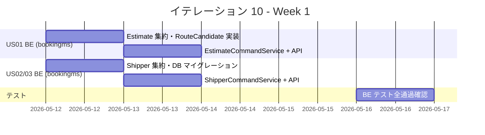
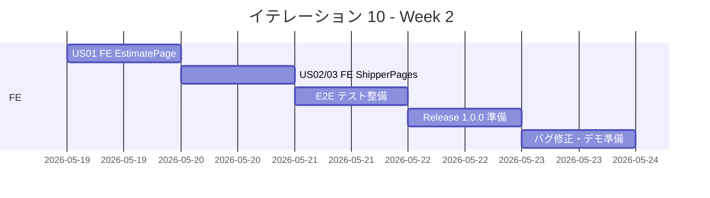
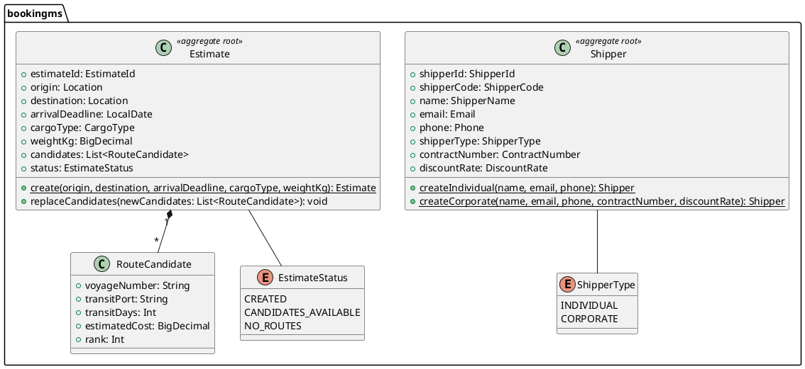
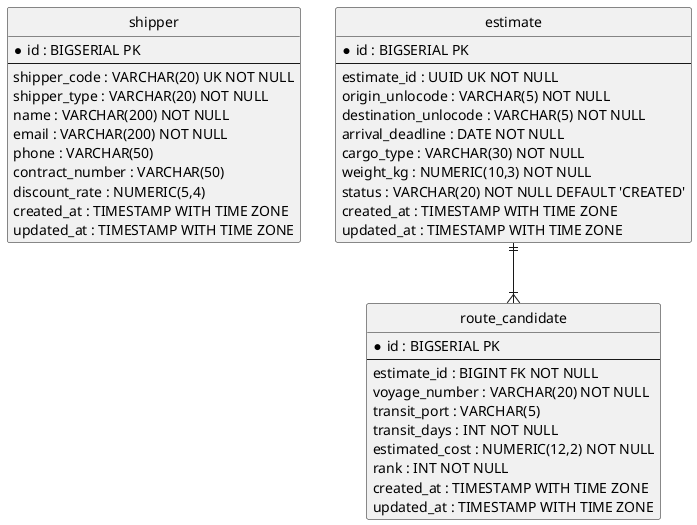
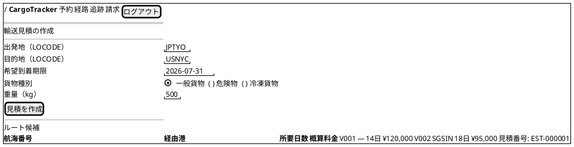
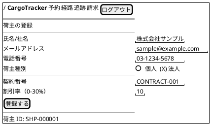
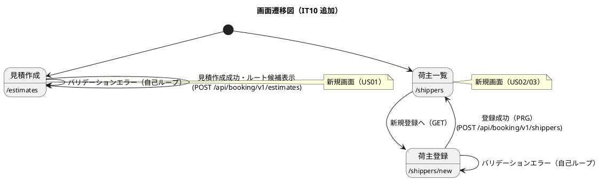

# イテレーション 10 計画

## 概要

| 項目 | 内容 |
|------|------|
| **イテレーション** | 10 |
| **期間** | Week 19-20（2 週間） |
| **ゴール** | 輸送見積（US01）・荷主登録（US02）・法人荷主登録（US03）の API + 画面を実装し全機能を完成する |
| **目標 SP** | 21 |

---

## ゴール

### イテレーション終了時の達成状態

1. **輸送見積（US01）**: 出発地・目的地・期限・貨物種別・重量を入力し、ルート候補（経由港・所要日数・概算料金）を表示できる
2. **荷主登録（US02）**: 新規荷主を氏名/社名・住所・連絡先・種別（個人/法人）で登録でき、荷主 ID が発行される
3. **法人荷主登録（US03）**: 法人荷主の契約番号・割引率を含めて登録でき、US22 の法人割引と連携できる

### 成功基準

- [ ] US01: 見積作成・ルート候補表示・見積番号発行ができる
- [ ] US02: 個人荷主の登録・荷主 ID 発行ができる
- [ ] US03: 法人荷主（契約番号・割引率）の登録ができる
- [ ] bookingms テスト全通過（カバレッジ 80% 以上）
- [ ] フロントエンド テスト全通過
- [ ] E2E テスト全シナリオ通過
- [ ] Release 1.0.0 タグ作成・CHANGELOG 更新

---

## ユーザーストーリー

### 対象ストーリー

| ID | ユーザーストーリー | BE SP | FE SP | SP | 優先度 |
|----|--------------------|-------|-------|----|--------|
| US01 | 輸送見積を作成する | 5 | 5 | 10 | 中 |
| US02 | 荷主を登録する | 3 | 3 | 6 | 中 |
| US03 | 法人荷主を登録する | 3 | 2 | 5 | 低 |
| **合計** | | **11** | **10** | **21** | |

### ストーリー詳細

#### US01: 輸送見積を作成する

**ストーリー**:
> 営業担当者として、荷主の輸送要件（出発地・目的地・希望期限・貨物種別・重量）を入力し、輸送料金と所要日数の見積を作成したい。なぜなら、荷主が予算と納期を事前に把握でき、予約決定を迅速に行えるからだ。

**受入条件**:

1. 出発地・目的地・希望期限・貨物種別・重量を入力できる
2. 航海スケジュール情報をもとにルート概算候補が表示される
3. ルート候補ごとに「経由港・所要日数・概算料金・航海番号」が表示される
4. 見積情報が保存され、見積番号が発行される
5. 希望期限に間に合うルートが存在しない場合、その旨が通知される
6. 危険物が含まれる場合、危険物申告情報の入力フォームが表示される

#### US02: 荷主を登録する

**ストーリー**:
> 営業担当者として、新規荷主の氏名/社名・住所・連絡先・メールアドレスをシステムに登録したい。なぜなら、次回以降の予約で荷主情報の再入力を省略でき、顧客情報を一元管理できるからだ。

**受入条件**:

1. 氏名/社名・住所・連絡先・メールアドレス・荷主種別（個人/法人）を入力できる
2. 同一メールアドレスが既に登録されている場合、既存荷主として表示しどちらを使用するか選択できる
3. 登録完了後、荷主 ID が発行される
4. 荷主種別「個人」で登録できる

#### US03: 法人荷主を登録する

**ストーリー**:
> 営業担当者として、法人荷主の契約番号と割引率を含めて登録したい。なぜなら、法人契約条件（割引率）を精算時に自動適用できるからだ。

**受入条件**:

1. 荷主種別「法人」を選択すると、法人契約情報（契約番号・割引率）の入力フィールドが表示される
2. 割引率は 0〜30% の範囲で設定できる
3. 法人荷主で登録完了後、荷主 ID が発行される
4. 登録した法人情報は US22（法人割引を適用する）で参照される

### タスク

#### 1. US01 バックエンド（bookingms）（5 SP）

| # | タスク | 見積もり | 担当 | 状態 |
|---|--------|---------|------|------|
| 1.1 | ドメイン: `Estimate` 集約ルート実装（`create()` / `replaceCandidates()` / `EstimateStatus`） | 2h | - | [ ] |
| 1.2 | ドメイン: `RouteCandidate` エンティティ実装（voyage_number・transit_port・transit_days・estimated_cost） | 1h | - | [ ] |
| 1.3 | アプリ: `CreateEstimateCommand` + `EstimateCommandService.create()` 実装 | 2h | - | [ ] |
| 1.4 | プレゼン: `POST /api/booking/v1/estimates` エンドポイント追加 | 2h | - | [ ] |
| 1.5 | DB: `estimate` / `route_candidate` テーブル作成（V2 マイグレーション） | 1h | - | [ ] |
| 1.6 | テスト: ドメイン・サービス・コントローラー単体テスト | 2h | - | [ ] |

**小計**: 10h（理想時間）

#### 2. US01 フロントエンド（5 SP）

| # | タスク | 見積もり | 担当 | 状態 |
|---|--------|---------|------|------|
| 2.1 | `EstimatePage.tsx`: 見積フォーム（出発地・目的地・期限・貨物種別・重量）実装 | 3h | - | [ ] |
| 2.2 | `EstimatePage.tsx`: ルート候補一覧表示（経由港・所要日数・概算料金） | 2h | - | [ ] |
| 2.3 | `EstimatePage.tsx`: 危険物申告フォームの動的表示（US05 パターンを踏襲） | 1h | - | [ ] |
| 2.4 | `useEstimate.ts`: `useCreateEstimate` hook 追加 | 2h | - | [ ] |
| 2.5 | `App.tsx` に `/estimates` ルート追加 | 1h | - | [ ] |

**小計**: 9h（理想時間）

#### 3. US02 バックエンド（bookingms）（3 SP）

| # | タスク | 見積もり | 担当 | 状態 |
|---|--------|---------|------|------|
| 3.1 | ドメイン: `Shipper` 集約ルート実装（shipper_code・name・email・phone・shipper_type） | 2h | - | [ ] |
| 3.2 | アプリ: `RegisterShipperCommand` + `ShipperCommandService.register()` 実装 | 2h | - | [ ] |
| 3.3 | プレゼン: `POST /api/booking/v1/shippers` エンドポイント追加 | 1h | - | [ ] |
| 3.4 | DB: `shipper` テーブル作成（V3 マイグレーション） | 1h | - | [ ] |
| 3.5 | テスト: ドメイン・サービス・コントローラー単体テスト | 2h | - | [ ] |

**小計**: 8h（理想時間）

#### 4. US02 フロントエンド（3 SP）

| # | タスク | 見積もり | 担当 | 状態 |
|---|--------|---------|------|------|
| 4.1 | `ShipperNewPage.tsx`: 荷主登録フォーム（氏名/社名・連絡先・メール・種別）実装 | 3h | - | [ ] |
| 4.2 | `ShipperListPage.tsx`: 荷主一覧・重複メール警告表示 | 2h | - | [ ] |
| 4.3 | `useShippers.ts`: `useRegisterShipper` / `useShippers` hook 追加 | 2h | - | [ ] |
| 4.4 | `App.tsx` に `/shippers` / `/shippers/new` ルート追加 | 1h | - | [ ] |

**小計**: 8h（理想時間）

#### 5. US03 バックエンド（bookingms）（3 SP）

| # | タスク | 見積もり | 担当 | 状態 |
|---|--------|---------|------|------|
| 5.1 | ドメイン: `Shipper.registerAsCorporate(contractNumber, discountRate)` 追加 | 1h | - | [ ] |
| 5.2 | アプリ: `RegisterShipperCommand` に `contractNumber` / `discountRate` フィールド追加 | 1h | - | [ ] |
| 5.3 | DB: `shipper` テーブルに `contract_number` / `discount_rate` カラム追加（V3 に含める） | 1h | - | [ ] |
| 5.4 | テスト: 法人荷主登録ロジックのユニットテスト | 2h | - | [ ] |

**小計**: 5h（理想時間）

#### 6. US03 フロントエンド（2 SP）

| # | タスク | 見積もり | 担当 | 状態 |
|---|--------|---------|------|------|
| 6.1 | `ShipperNewPage.tsx` に法人種別選択時の契約番号・割引率フィールドを動的表示 | 2h | - | [ ] |
| 6.2 | `shippers/types/shipper.ts` に `RegisterShipperRequest` 型追加 | 1h | - | [ ] |

**小計**: 3h（理想時間）

#### 7. Release 1.0.0 準備（SP 外）

| # | タスク | 見積もり | 担当 | 状態 |
|---|--------|---------|------|------|
| 7.1 | CHANGELOG.md 更新（Phase 3 完了内容記載） | 1h | - | [ ] |
| 7.2 | `v1.0.0` タグ作成・リモートプッシュ | 0.5h | - | [ ] |

#### タスク合計

| カテゴリ | BE SP | FE SP | SP | 理想時間 | 状態 |
|---------|-------|-------|----|---------|------|
| US01 輸送見積 | 5 | 5 | 10 | 19h | [ ] |
| US02 荷主登録 | 3 | 3 | 6 | 16h | [ ] |
| US03 法人荷主登録 | 3 | 2 | 5 | 8h | [ ] |
| **合計** | **11** | **10** | **21** | **43h** | |

**1 SP あたり**: 約 2.0h
**進捗率**: 0% (0/21 SP)

---

## スケジュール

### Week 1（Day 1-5）



| 日 | タスク |
|----|--------|
| Day 1 | US01 BE: Estimate 集約・RouteCandidate ドメイン実装 |
| Day 2 | US01 BE: EstimateCommandService + POST /estimates API |
| Day 3 | US02/03 BE: Shipper 集約・DB マイグレーション（V2/V3） |
| Day 4 | US02/03 BE: ShipperCommandService + POST /shippers API |
| Day 5 | BE テスト全通過確認・カバレッジ確認 |

### Week 2（Day 6-10）



| 日 | タスク |
|----|--------|
| Day 6 | US01 FE: EstimatePage.tsx（フォーム・ルート候補表示） |
| Day 7 | US02/03 FE: ShipperNewPage.tsx / ShipperListPage.tsx |
| Day 8 | E2E テスト整備・既存シナリオリグレッション確認 |
| Day 9 | Release 1.0.0: CHANGELOG・タグ作成 |
| Day 10 | 統合テスト・バグ修正・デモ準備 |

---

## 設計

### ドメインモデル



### データモデル



### ユーザーインターフェース

#### ビュー

**US01: 輸送見積作成画面** (`/estimates`)



**US02/03: 荷主登録画面** (`/shippers/new`)



#### インタラクション



### ディレクトリ構成

```
apps/backend/bookingms/src/
  main/java/com/example/bookingms/
    domain/model/aggregates/
      Shipper.java                          ← 新規
      Estimate.java                         ← 新規
    domain/model/entities/
      RouteCandidate.java                   ← 新規
    domain/model/valueobjects/
      ShipperType.java                      ← 新規
      EstimateStatus.java                   ← 新規
    application/internal/commandservices/
      RegisterShipperCommand.java           ← 新規
      ShipperCommandService.java            ← 新規
      CreateEstimateCommand.java            ← 新規
      EstimateCommandService.java           ← 新規
    interfaces/rest/
      ShipperController.java                ← 新規
      EstimateController.java               ← 新規
      dto/
        RegisterShipperRequest.java         ← 新規
        ShipperResponse.java                ← 新規
        CreateEstimateRequest.java          ← 新規
        EstimateResponse.java               ← 新規
        RouteCandidateResponse.java         ← 新規
  resources/db/migration/
    V2__create_shipper.sql                  ← 新規
    V3__create_estimate.sql                 ← 新規

apps/frontend/src/
  pages/
    EstimatePage.tsx                        ← 新規
    ShipperNewPage.tsx                      ← 新規
    ShipperListPage.tsx                     ← 新規
  features/booking/
    hooks/useEstimate.ts                    ← 新規
    hooks/useShippers.ts                    ← 新規
    types/estimate.ts                       ← 新規
    types/shipper.ts                        ← 新規
```

### API 設計

| メソッド | エンドポイント | 説明 |
|---------|---------------|------|
| `POST` | `/api/booking/v1/estimates` | 見積作成・ルート候補算出 |
| `GET` | `/api/booking/v1/estimates/{estimateId}` | 見積照会 |
| `POST` | `/api/booking/v1/shippers` | 荷主登録（個人/法人） |
| `GET` | `/api/booking/v1/shippers` | 荷主一覧照会 |

### データベーススキーマ

```sql
-- V2: shipper テーブル作成
CREATE TABLE shipper (
  id BIGSERIAL PRIMARY KEY,
  shipper_code VARCHAR(20) NOT NULL UNIQUE,
  shipper_type VARCHAR(20) NOT NULL,
  name VARCHAR(200) NOT NULL,
  email VARCHAR(200) NOT NULL,
  phone VARCHAR(50),
  contract_number VARCHAR(50),
  discount_rate NUMERIC(5,4),
  created_at TIMESTAMP WITH TIME ZONE NOT NULL DEFAULT NOW(),
  updated_at TIMESTAMP WITH TIME ZONE NOT NULL DEFAULT NOW()
);

-- V3: estimate / route_candidate テーブル作成
CREATE TABLE estimate (
  id BIGSERIAL PRIMARY KEY,
  estimate_id UUID NOT NULL UNIQUE,
  origin_unlocode VARCHAR(5) NOT NULL,
  destination_unlocode VARCHAR(5) NOT NULL,
  arrival_deadline DATE NOT NULL,
  cargo_type VARCHAR(30) NOT NULL,
  weight_kg NUMERIC(10,3) NOT NULL,
  status VARCHAR(20) NOT NULL DEFAULT 'CREATED',
  created_at TIMESTAMP WITH TIME ZONE NOT NULL DEFAULT NOW(),
  updated_at TIMESTAMP WITH TIME ZONE NOT NULL DEFAULT NOW()
);
CREATE TABLE route_candidate (
  id BIGSERIAL PRIMARY KEY,
  estimate_id BIGINT NOT NULL REFERENCES estimate(id),
  voyage_number VARCHAR(20) NOT NULL,
  transit_port VARCHAR(5),
  transit_days INT NOT NULL,
  estimated_cost NUMERIC(12,2) NOT NULL,
  rank INT NOT NULL,
  created_at TIMESTAMP WITH TIME ZONE NOT NULL DEFAULT NOW(),
  updated_at TIMESTAMP WITH TIME ZONE NOT NULL DEFAULT NOW()
);
```

---

## リスクと対策

| リスク | 影響度 | 対策 |
|--------|--------|------|
| bookingms の V2/V3 マイグレーション番号衝突 | 中 | 既存 V1 を確認してから V2/V3 を採番する |
| ルート候補算出ロジックの複雑さ | 高 | IT10 では routingms の既存航海スケジュール API を活用し、ルート候補は簡易版（静的ルール）で実装する |
| 荷主 shipper_code の採番ロジック | 低 | `SHP-` + ゼロパディング 6 桁（`SHP-000001`）形式。データベースシーケンスで採番する |
| US03 と US22 の法人割引連携 | 中 | IT10 では荷主 ID の手動入力で割引率を取得する簡易連携で対応。後続でドロップダウン選択に改善する |

---

## 完了条件

### Definition of Done

- [ ] コードレビュー完了
- [ ] ユニットテストがパス
- [ ] E2E テストがパス
- [ ] ESLint エラーなし
- [ ] 機能がローカル環境で動作確認済み
- [ ] ドキュメント更新完了
- [ ] Release 1.0.0 タグ作成・CHANGELOG 更新

### デモ項目

1. 出発地・目的地・期限・貨物種別・重量を入力して輸送見積を作成し、ルート候補を確認する
2. 個人荷主を登録して荷主 ID が発行されることを確認する
3. 法人荷主（契約番号・割引率）を登録して登録内容を確認する

---

## 更新履歴

| 日付 | 更新内容 | 更新者 |
|------|---------|--------|
| 2026-05-11 | 初版作成 | - |

---

## 関連ドキュメント

- [イテレーション 9 完了報告書](./iteration_report-9.md)
- [リリース計画](./release_plan.md)
- [ユーザーストーリー](../requirements/user_story.md)
