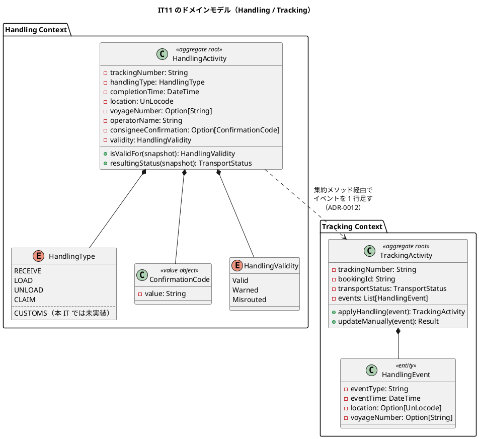
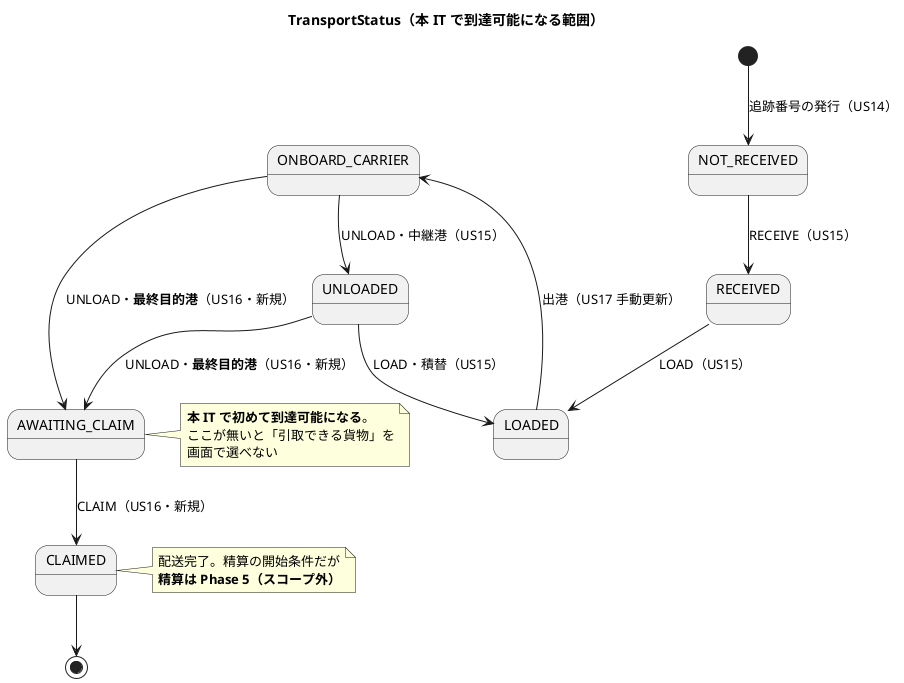
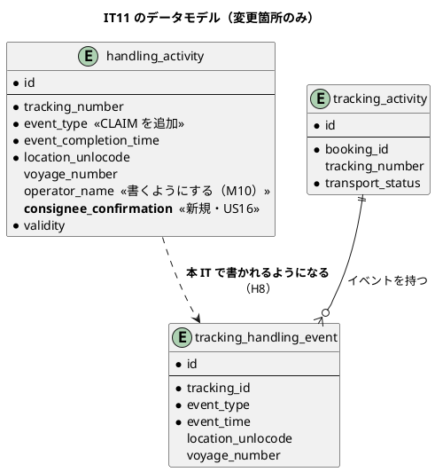
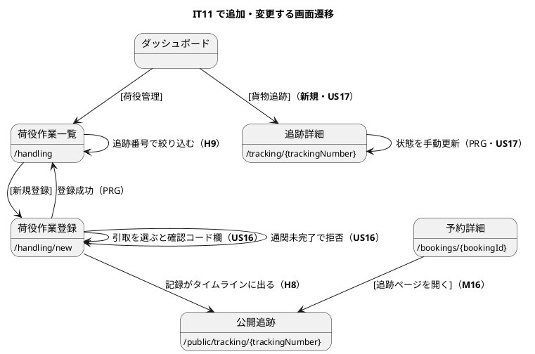

# IT11 イテレーション計画

## 概要

| 項目 | 内容 |
| :--- | :--- |
| 期間 | 2026-08-05 〜（2 週間相当） |
| 局面 | **終盤**（IT8-IT12）。アプローチは**アウトサイドイン** |
| 対象ストーリー | TS15（3 SP）・US16（5 SP）・US17（3 SP） |
| 計画 SP | **11**（リリース計画の暫定配分どおり） |
| 新規 Bounded Context | なし（Handling / Tracking を完成させる IT） |

> **返済枠 TS15（3 SP）はリリース計画に最初から計上済み**です。IT10 の返済枠
> TS17 のように追加起票する必要はありません。**TS15 を最初に着手します**——
> IT10 のふりかえりが「**US16 より先に H8 を扱う**」と定めたためです。

---

## ゴール

### イテレーション終了時の達成状態

**荷役作業員が記録した作業が荷主の追跡タイムラインにそのまま現れ、
荷受人の確認を取って引取を記録すると貨物が「引取完了」になる**——
ここまでが画面から通ります。これで v1.0.0 の業務フロー（予約 → 経路 → 追跡番号 →
荷役 → 引取）が**端から端まで繋がります**。

IT10 は「コンテキストをまたいで状態が伝播する」イテレーションでした。
IT11 は**伝播した結果が利用者の目に見えるところまで届く**イテレーションです。

### 成功基準

| # | 基準 | 検証 |
| :--: | :--- | :--- |
| 1 | 荷役の記録が**荷主の追跡タイムラインに 1 行として現れる**（日時・場所・作業種別） | `HandlingHttpTest` + `PublicTrackingHttpTest` |
| 2 | 荷役履歴が**追跡番号で絞り込める**。全件表示のときも上限と落とした件数を出す | `HandlingHistoryHttpTest` |
| 3 | 最終目的港での荷降しで貨物状態が **AWAITING_CLAIM** になる | `HandlingActivityTest` |
| 4 | 荷受人確認（署名または確認コード）を取って引取を記録でき、貨物状態が **CLAIMED** になる | `ClaimHttpTest` |
| 5 | **通関が完了していない貨物の引取は拒まれ、次に何をすればよいかが画面に出る** | 同上 |
| 6 | 追跡管理者が追跡番号を指定して**状態・位置・日時を手動で更新**でき、履歴に 1 行残る | `TrackingUpdateHttpTest` |
| 7 | 手動更新は**荷役が記録した状態を巻き戻さない**（時刻の逆行・状態の後退を拒む） | 同上 + `TrackingActivityTest` |
| 8 | ACL の書き込みが失敗したとき、**利用者に届く**（`discard` しない） | `RegisterHandlingTest` |
| 9 | 追跡管理者・荷役作業員が navbar / ダッシュボードから当該画面へ到達できる | `NavigationReachabilityTest` |
| 10 | 品質ゲートを通過（[`test_strategy.md` 6.4](../design/test_strategy.md) の 5 検査。CI で確認） | クローズ手順 |

> 成功基準 10 は**条件を書き写さず正典を引用**しています（IT10 Try T1）。

---

## IT10 ふりかえりの反映

IT10 の Try 7 件を、本計画のどこで扱うかを明示します。

| Try | 本計画での扱い |
| :--- | :--- |
| **T1** DoD に条件を書き写さない。正典を 1 行で引用する | **成功基準 10・DoD**。品質ゲートは `test_strategy.md` 6.4 を引用するだけにしました。**同じ形を ADR とコメントにも適用**します（タスク 4.1） |
| **T2** ADR を書いたら、その ADR の再検討条件を自分の実装が満たしていないか起票時に確認する | **タスク 0.2 と 4.2 の DoD**。ADR-0014 を起こすため、起票時に「本 IT の実装は条件に触れるか」を必ず書きます |
| **T3** コメントが規律を宣言したら、その場で実装がそれを守っているか読み直す | **全実装タスクの DoD**。あわせて**既存のコメントを 1 度 grep して棚卸し**します（タスク 4.3） |
| **T4** ポートの書き込みメソッドは集約型を引数に取る | **タスク 1.1・3.2 の DoD**。`updateTransportStatus` 型の列単位ポート（L4）を規約 12 の候補として起票判断します（タスク 4.4） |
| **T5** 受入基準を満たしたら、利用者代表の観点で「毎朝どう使うか」を通す | **全ストーリーの DoD**。とくに**荷役履歴（一覧）**と**引取の拒否メッセージ（受け手）**を通します |
| **T6** 間欠失敗の診断を `withApp` 系でも有効にする | **タスク 0.3**（IT11 タスク 0 と名指しで指定されている） |
| **T7** 新規 BC を立ち上げたら、既存 BC の共有の道具を先に探す | 本 IT に新規 BC はありません。**代わりに IT10 で作った私物を棚卸し**します（L1 の `timestampText` 重複を含む・タスク 1.4） |

---

## ユーザーストーリー

### 対象ストーリー

| ID | 内容 | アクター | SP |
| :--- | :--- | :--- | :--: |
| TS15 | IT10 レビューの返済 | — | 3 |
| US16 | 引取作業を記録する | 荷役作業員 | 5 |
| US17 | 貨物状態を手動更新する | 追跡管理者 | 3 |

### TS15: IT10 レビューの返済（3 SP・**Day 1-3**）

**最初に着手します**。IT10 のふりかえりが「US16 より先に H8」と定めています。

| # | 返済対象 | 出所 |
| :--: | :--- | :--- |
| 1 | **荷役の記録が荷主の追跡タイムラインに出る**（`handling_activity` と `tracking_handling_event` の関係を決める） | **H8** |
| 2 | **荷役履歴を追跡番号で絞り込む**。上限と落とした件数を出す（IT9 の経路割り当てと同じ形） | **H9** |
| 3 | ACL の失敗が `discard` されて誰にも届かない。**ADR-0012 リスク 2 の記述と実装が逆**であることも訂正する | M6 |
| 4 | 作業場所を港マスタから選ぶ（存在しないコードで DB 例外 = 500 になる） | M17 |
| 5 | 予約一覧を追跡番号で検索できるようにする | M18 |
| 6 | 予約詳細に**追跡番号の案内文と公開追跡へのリンク**を出す（荷主へ伝える手段が画面に無い） | M16 |
| 7 | `BookingMisroutingReport` を `trackingNumber` で受ける（ADR-0012 決定 4 と食い違っている） | M13 |
| 8 | `ReportMisrouting` が旅程の全削除・再挿入を通る（`updateRoutingStatus` を足す） | M4 |
| 9 | `Admin` が「押せるのに必ず失敗するボタン」を踏む。**ロール集合の突合メタテストで根治**する | M9 |
| 10 | `operator_name` を**書く**（US16 で荷受人確認を記録するため、担当者名も同時に決着させる） | M10 |
| 11 | `timestampText` の重複・`TransportStatus.label` の置き場所・文言の二重定義 | L1・M14・M15 |

**送らないもの**は理由を付けて残します。

| 指摘 | 扱い |
| :--- | :--- |
| M5 `saveTrackingNumber` が未設定を空文字に倒す | **集約が `None` を通さないため到達しない**。ただし**根拠を壊すタスクが本 IT にある**（US17 が Tracking を書く）ため、タスク 3.2 の DoD で再確認し、触れるなら同時に `setNull` へ直す（Try T2 の形） |
| M7 未来日時の検査が日付単位 | `Clock` の分単位取得が要る。**US17 が日時を扱う**ため、タスク 3.1 で分単位に揃える |
| M8 「未判定」を `Valid` として構築できる（型で守れていない） | **US16 で `HandlingType` に CLAIM を足すため同じ場所を触る**。タスク 2.2 に含める |
| M11 HTTP に UNLOAD のケースが無い | **US16 が UNLOAD → AWAITING_CLAIM を扱う**ため、タスク 2.3 の受入テストで自然に埋まる |
| M12 テスト DB 名の一意性が規律だけに依存 | **恒久策（ランダムサフィックス）は独立した技術ストーリー**。IT12 の予備枠に起票する |
| L2 連番が 10000 を超えるとその日は発行できない | 業務量から当面到達しない。**文言だけ直す**（「時間をおいて」は復旧手段ではない） |
| L3・L6・L7・L8・L9 | **L7（未認証の認可テスト）のみタスク 4.3 で入れる**。ほかは IT12 の予備枠 |

### US16: 引取作業を記録する（5 SP・Day 4-8）

| # | 受入基準 | 本 IT での扱い |
| :--: | :--- | :--- |
| 1 | 作業種別「引取」を選択すると、荷受人確認フィールド（署名または確認コード）が表示される | **実装**。署名画像は扱わず**確認コードの入力**とする（画面と設計の両方に明記） |
| 2 | 荷受人確認が取得されると引取作業が記録される | **実装**（確認が無ければ集約が拒む） |
| 3 | 記録後、貨物状態が「引取済」に更新される | **実装**（`TransportStatus.Claimed` をカラムに永続化） |
| 4 | 貨物状態「引取済」は配送完了を意味し、精算処理の開始条件となる | **精算はスコープ外**（Phase 5・[ADR-0007](../adr/ADR-0007-defer-external-acl-and-scope-v1.md)）。**状態の意味だけを実装**し、精算の開始は将来リリースと画面に明記する |

**受入基準に書かれていないが実装するもの**（[ドメインモデル](../design/domain-model.md) の追加ルール 2）:

| # | 内容 | 根拠 |
| :--: | :--- | :--- |
| a | **通関が完了するまで引取を拒む** | `domain-model.md` 追加ルール 2。リリース計画の IT11 の題も「通関未完了時の拒否」 |
| b | **最終目的港での荷降しで AWAITING_CLAIM になる** | 引取待ちの状態が無いと「引取できる貨物」を画面で選べない |
| c | 引取場所が目的港と異なる場合は**警告**（MISROUTED にはしない） | `domain-model.md` のデシジョンテーブル CLAIM 行 |

### US17: 貨物状態を手動更新する（3 SP・Day 9-10）

| # | 受入基準 | 本 IT での扱い |
| :--: | :--- | :--- |
| 1 | 追跡番号を指定して現在の貨物情報を確認できる | **実装**（`/tracking/{trackingNumber}` の**認証つき追跡詳細**。US18 の公開追跡とは別画面） |
| 2 | 新しい状態・位置・日時を入力して追跡情報を更新できる | **実装**（追跡管理者のみ） |
| 3 | 更新後、追跡イベントが履歴に記録される | **実装**（TS15-1 で決めた形にそのまま乗る） |
| 4 | 状態変更の種類に応じて荷主への通知が送信される | **将来リリース**（US12 と同じ通知基盤。画面と計画の両方に明記する） |

---

## 壊れ方の観点（6 軸）

受入基準は正常系しか書きません。着手前に「この機能はどう壊れるか」を書き出します。

| 軸 | 問い | 本 IT で該当するもの |
| :--: | :--- | :--- |
| 1 | **状態が永続化されず履歴から再導出されていないか** | 引取後の `CLAIMED`・手動更新後の状態。**カラムに書く** |
| 2 | **同時に来たらどうなるか** | 同じ貨物への引取の二重登録。荷役の記録と手動更新の競合（**どちらも `TrackingActivity` を書く**） |
| 3 | **その状態のレコードから画面を開けるか** | 引取済の貨物・追跡番号未発行の予約・通関未完了の貨物 |
| 4 | **拒まれた理由が画面の表示と食い違わないか** | **通関未完了の引取拒否**（「なぜ拒まれたか」と「次に何をするか」の両方を出す） |
| 5 | **横断的な防御が正常な経路を巻き込まないか** | 認証つき追跡詳細（`/tracking/...`）が**公開追跡（`/public/tracking/...`）の無認証を壊さない** |
| 6 | **BC をまたぐ書き込みが集約を通っているか** | Handling → Tracking（タイムライン 1 行の追加）。**列単位ポートを足さない**（Try T4） |

---

## タスク

### 0. 着手前の準備（0 SP）

| # | タスク | 内容 |
| :--: | :--- | :--- |
| 0.1 | 設計ドキュメントの読み合わせ | `domain-model.md` の Handling / Tracking 節、`data-model.md` の `handling_activity`・`customs_declaration`・`tracking_handling_event`、`ui_design.md` の追跡詳細・荷役登録 |
| 0.2 | **BC 間連携の設計の見直し**（IT10 の引き継ぎ 1・ADR-0011/0012 の再検討条件） | 下記「ADR」節。**見直すのは本数ではなく `Cargo` のハブ化**。条件を「単一 BC へ向かう書き込みアダプタ数」へ置き換えるかを判断し、ADR に残す |
| 0.3 | **間欠失敗の診断を `withApp` 系で有効にする**（Try T6・IT9 から 3 イテレーション未解決） | 起動時のインスタンス ID を暗黙に保持し、`assertStatus` の失敗に期待インスタンスを出す。503 は同時実行セマフォの残数も診断ヘッダへ |

### 1. TS15: IT10 レビューの返済（3 SP・Day 1-3・**独立したコミット**）

| # | タスク | 理想時間 |
| :--: | :--- | :--: |
| 1.1 | **H8: 荷役をタイムラインに出す**。`tracking_handling_event` は Tracking の所有であり、`TrackingActivity` の集約メソッドで 1 行足す（**列単位ポートを足さない**・Try T4）。`ApplyHandling` を「状態を変える」から「**出来事を記録し、その結果状態が変わる**」へ | 8 |
| 1.2 | **H9: 荷役履歴の絞り込み**（追跡番号・期間・判定）。上限と落とした件数を出す | 6 |
| 1.3 | **M6: ACL の失敗を利用者に届ける**（`RegisterResult` の拡張）。**ADR-0012 リスク 2 の記述を実装に合わせて訂正**する | 4 |
| 1.4 | M17（港マスタから選ぶ）・M18（追跡番号で検索）・M16（案内文と公開追跡リンク）・M10（`operator_name` を書く） | 6 |
| 1.5 | M13・M4（ポートを `trackingNumber` へ・`updateRoutingStatus` の追加）・M9（ロール集合の突合メタテスト）・L1・M14・M15 | 6 |

### 2. US16: 引取作業の記録（5 SP・Day 4-8）

| # | タスク | 理想時間 |
| :--: | :--- | :--: |
| 2.1 | 受入テスト（HTTP）を先に書く——荷降し → 引取待ち → 荷受人確認を入れて引取 → 公開追跡が「引取完了」 | 6 |
| 2.2 | `HandlingType` に **CLAIM** を足す（正典の 5 値のうち 4 値目）。デシジョンテーブルの CLAIM 行を実装。**M8（未判定を `Valid` にできる）を型で直す**のを同時に行う | 8 |
| 2.3 | **AWAITING_CLAIM**: 最終目的港での荷降しを判定する（`Itinerary` の最終脚と `RouteSpecification.destination`）。**M11 の HTTP UNLOAD ケースをここで埋める** | 6 |
| 2.4 | **荷受人確認**（確認コード）を集約の不変条件にする。確認が無い CLAIM を構築できない形にする | 6 |
| 2.5 | **通関未完了時の拒否**（ADR-0014 の決定に従う）。拒否メッセージは「なぜ」と「次に何を」の両方を出す | 6 |
| 2.6 | 画面（荷役登録の CLAIM 選択時に確認コード欄）とナビゲーション整合・状態ごとの到達性 | 6 |
| 2.7 | **E2E シナリオ③**（荷役登録 → 追跡ステータス反映）。基盤は TS05b で導入済みで、本数は 1 → 2 本になる | 6 |

### 3. US17: 貨物状態の手動更新（3 SP・Day 9-10）

| # | タスク | 理想時間 |
| :--: | :--- | :--: |
| 3.1 | 受入テスト（HTTP）を先に書く——追跡管理者が状態・位置・日時を更新 → 履歴に 1 行残る。**M7（未来日時の検査を分単位へ）を同時に**扱う | 6 |
| 3.2 | 集約に手動更新の遷移を足す。**荷役が記録した状態を巻き戻さない**（時刻の逆行・状態の後退を拒む）。**M5 の再確認**（Tracking の書き込みを触るため） | 8 |
| 3.3 | **認証つき追跡詳細 `/tracking/{trackingNumber}`**（新規画面）と更新フォーム。**公開追跡の無認証を壊さない**（観点 5） | 8 |

### 4. 観測・規律・ドキュメント（0 SP）

| # | タスク | 内容 |
| :--: | :--- | :--- |
| 4.1 | **書き写された条件の棚卸し**（Try T1）。計画・ADR・コメントで規約や検査を再掲している箇所を探し、参照に置き換える | `grep` で「Quality Gate」「規約 N」「5 検査」などを洗う |
| 4.2 | **ADR-0014 の起票**（下記「ADR」節）。**起票時に自分の再検討条件を本 IT の実装が満たしていないか確認**する（Try T2） | ADR テンプレートに「本 IT の実装は条件に触れるか」の欄を設ける |
| 4.3 | **コメントの棚卸し**（Try T3）。「〜しない」「〜まで確かめる」「〜に倒さない」を含むコメントを集め、1 件ずつ実装と突き合わせる。**L7（未認証の認可テスト）**もここで入れる | IT10 で 4 件見つかった形 |
| 4.4 | **規約 12 の起票判断**（IT4 M1 由来で 7 イテレーション未着手）。Try T4 の「ポートの書き込みメソッドは集約型を取る」を候補に含める | 起票するなら CI のどのステップから呼ばれるかを DoD に書く |
| 4.5 | 設計ドキュメントの同期（**実装コミットに同梱**） | 下記「設計ドキュメントへの反映」 |

### タスク合計

| 区分 | SP | 理想時間 |
| :--- | :--: | :--: |
| TS15 | 3 | 30 |
| US16 | 5 | 44 |
| US17 | 3 | 22 |
| 観測・規律 | 0 | — |
| **合計** | **11** | **96** |

---

## 縮退順序（着手前に確定させる）

判定日に間に合わない見込みなら、**上から順に**落とします。

| 順 | 落とすもの | 理由 |
| :--: | :--- | :--- |
| 1 | US17 受入基準 1 の**専用画面**（`/tracking/{trackingNumber}`）。更新は荷役履歴の行からの操作にする | 更新できることが先。画面の分割は後から足せる |
| 2 | TS15-5（M13・M4・M9・L1・M14・M15） | いずれも内部の整理であり、業務は現状でも回る。**落としたら IT12 計画に先に書く**（繰り越しの固定化を防ぐ） |
| 3 | US16 の警告（引取場所が目的港と異なる） | 警告は業務を止めない |

**TS15-1（H8）・TS15-2（H9）・US16 の受入基準 1-3 と通関拒否は落としません**。
H8/H9 は「機能が入っているのに業務が回らない」状態の解消であり、
落とすと IT10 と同じ状態が 2 イテレーション続きます。

### 縮退の判定日

**Day 8 終了時**。US16 のタスク 2.1-2.5 が終わっていなければ、上の順で落とします。

---

## 設計

### ドメインモデル（本 IT のスコープ）

**本 IT で追加するもの**

| 種別 | 名前 | 内容 |
| :--- | :--- | :--- |
| 値オブジェクト | `ConfirmationCode` | 荷受人確認コード。**CLAIM の不変条件**（無いと構築できない） |
| 列挙型の要素 | `HandlingType.CLAIM` | 正典 5 値の 4 値目。`CUSTOMS` は本 IT でも未実装（下記 ADR-0014） |
| 集約メソッド | `TrackingActivity.applyHandling(event)` | **状態を変えるのではなく出来事を記録し、その結果状態が変わる**（H8） |
| 集約メソッド | `TrackingActivity.updateManually(event)` | 手動更新。**時刻の逆行・状態の後退を拒む**（US17） |

> **注（設計への反映が必要）**: `domain-model.md` の `HandlingActivity` に
> **荷受人確認の属性がありません**（US16 受入基準 1-2 が要求）。
> `ConfirmationCode` を要素表と図に追加します（タスク 4.5）。

### 状態遷移（本 IT のスコープ）

> **`ONBOARD_CARRIER` は荷役では到達しません**。出港は荷役作業ではなく
> 航海の出来事であり、**US17（手動更新）で初めて到達可能になります**。
> US15 の「なぜ」（荷役だけでは捕捉できない状態変化）がここに現れます。

### データモデル（本 IT のスコープ）

**本 IT のマイグレーション**

| 版 | 内容 | 理由 |
| :--- | :--- | :--- |
| `V13` | `handling_activity.consignee_confirmation VARCHAR(50)` を追加 | US16 受入基準 1-2。**CLAIM のときだけ NOT NULL** にできないため、制約は集約が持つ |

> **`customs_declaration` は本 IT でも作りません**（下記 ADR-0014）。
> `data-model.md:489` の「US16（IT11）まで作らない」という注記を、
> **決定の変更として書き換えます**（タスク 4.5）。無言で先送りしません。

> **`tracking_handling_event` にスキーマ変更はありません**。
> H8 は「書かれていないテーブルに書くようになる」だけです。

### ユーザーインターフェース（本 IT のスコープ）

| 画面 | URL | ロール | 状態 |
| :--- | :--- | :--- | :--- |
| 追跡詳細（認証つき） | `/tracking/{trackingNumber}` | 追跡管理者・荷主・荷受人 | **新規** |
| 荷役作業一覧 | `/handling` | 荷役作業員・追跡管理者 | **変更**（絞り込み・件数上限） |
| 荷役作業登録 | `/handling/new` | 荷役作業員 | **変更**（CLAIM・確認コード・港の選択） |
| 予約詳細 | `/bookings/{bookingId}` | 営業担当者・経路設計者 | **変更**（追跡番号の案内・公開追跡リンク・追跡番号での検索は一覧側） |

> **注（設計への反映が必要）が 3 件あります**（タスク 4.5）。
>
> 1. `ui_design.md:987` の追跡詳細に**更新フォームがありません**。US17 受入基準 2 が
>    要求するため、ワイヤーフレームと仕様に追記します
> 2. 同画面の**通関ステータス**は `customs_declaration` を前提としています。
>    ADR-0014 の決定に合わせて表示の出どころを書き換えます
> 3. `ui_design.md:1062` の荷役種別に `CUSTOMS_CLEARANCE` がありますが、
>    `domain-model.md:875` は `CUSTOMS` です。**名前が正典どうしで食い違っている**ため、
>    どちらかに揃えます（実装しない値でも、揃っていない方向へ放置しない）

### ナビゲーション整合性

| 確認箇所 | 内容 |
| :--- | :--- |
| `ui_design.md` の画面一覧・ナビゲーション表 | 追跡詳細を「実装済み」へ |
| `Layout.navItems` | 「貨物追跡」の遷移先を確認（IT7 の判断で `/public/tracking` にしている。**追跡管理者は認証つきへ**） |
| ダッシュボード | 追跡管理者向けの作業入口（[貨物を追跡する]） |
| `NavigationReachabilityTest` | 追跡管理者が 2 クリック以内で追跡詳細へ到達できること |
| **ロール集合の突合メタテスト**（M9） | 画面に出すロールとルートが許すロールが一致すること。**IT9 H1・IT10 M9 と同型の再発を根治する** |

**状態ごとの到達性**（IT9 Try T1）

| 貨物の状態 | 引取を登録できるか | 画面の見え方 |
| :--- | :---: | :--- |
| 追跡番号 未発行 | ✕ | 「その追跡番号は登録されていません」 |
| NOT_RECEIVED / RECEIVED / LOADED | ✕ | 「まだ引取できません。現在の状態は〇〇です」 |
| ONBOARD_CARRIER / UNLOADED | ✕ | 同上（**最終目的港で荷降しされると引取待ちになります**と次を示す） |
| AWAITING_CLAIM・通関未完了 | ✕ | **「通関が完了していません。通関完了後に引取を記録できます」** |
| AWAITING_CLAIM・通関済 | ✅ | 確認コード欄が出る |
| CLAIMED | ✕ | 「この貨物は引取済です」＋引取の記録へのリンク |

### ADR

| # | 主題 | 判断が要る理由 |
| :--- | :--- | :--- |
| **ADR-0014** | **通関の扱いと、BC 間連携の再検討条件の書き直し** | 2 つを 1 本にまとめます。どちらも「**条件や設計の書き方が誤っていた**」ことへの是正であり、根が同じためです。  **(a) 通関**: `domain-model.md` は `CustomsDeclaration` を `HandlingActivity` と同じ集約に置き、状態更新は**税関システムの ACL**（`CustomsClearancePort`）から来ると描いています。しかし **TS07（外部 ACL 基盤）は [ADR-0007](../adr/ADR-0007-defer-external-acl-and-scope-v1.md) で延期中**であり、`customs_declaration` を作っても **CLEARED にできる者が誰もいません**。そのまま引取のゲートにすると、**引取が永久にできない**——IT10 の P5（機能が入っているのに業務が回らない）と同じ形です。本 IT で通関の表現を決めます。  **(b) 再検討条件**: ADR-0011「`composition/acl/` 5 本超」・ADR-0012「3 集約以上」はどちらも**代理指標として機能していません**（IT10 レビュー・architect）。書き込み 4 本のうち 3 本が Booking へ向いている——これは連携が増えたのではなく **`Cargo` がハブ化**しています。条件を「**単一 BC へ向かう書き込みアダプタ数**」へ置き換えるかを判断します |

> **起票時に必ず書くこと**（Try T2）: 本 IT の実装が ADR-0014 自身の再検討条件に
> 触れていないか。IT10 では ADR-0012 が**起票と同時に 2 つの条件を発火させていた**のに
> 気付いていませんでした。

---

## スケジュール

| Day | 内容 |
| :--- | :--- |
| 1 | タスク 0（BC 間連携の見直し・診断強化）+ TS15-1（H8） |
| 2 | TS15-2（H9）+ TS15-3（M6） |
| 3 | TS15-4・TS15-5。**ここまでを独立したコミットにする** |
| 4-5 | US16 受入テスト（2.1）+ CLAIM とデシジョンテーブル（2.2）+ AWAITING_CLAIM（2.3） |
| 6-7 | 荷受人確認（2.4）+ 通関ゲート（2.5）。**ADR-0014 は Day 6 までに起票** |
| 8 | US16 の画面とナビゲーション（2.6）+ E2E シナリオ③（2.7）。**Day 8 終了時が縮退の判定日** |
| 9-10 | US17 全体（3.1-3.3） |
| 11 | 観測・規律・ドキュメント（タスク 4）。**取りこぼしの確認だけにする** |

---

## リスクと対策

| リスク | 影響 | 対策 |
| :--- | :--- | :--- |
| **通関のゲートが「誰も CLEARED にできない」形になる** | 引取が永久にできない | **ADR-0014 で先に決める**（Day 6 まで）。IT10 P5 と同型であり、最も再発しやすい |
| **荷役の記録と手動更新が同じ集約を書く** | 後着順で状態が決まる | `findForUpdate` を通す（IT10 M3 で入れた形）。**時刻の逆行・状態の後退を集約が拒む** |
| **返済枠 TS15 が 11 件と多い** | 実装ストーリーを圧迫する | **H8・H9 を最優先**とし、縮退順序 2 で TS15-5 を落とせる形にした。落としたら IT12 計画に先に書く |
| **認証つき追跡詳細が公開追跡の無認証を壊す** | 荷主が追跡できなくなる | 観点 5。**公開追跡の無認証テストを先に赤くできるか確かめる**（IT7 の教訓・ヘルスチェックと同型） |
| 間欠失敗（503 / 404）が 3 イテレーション未解決 | 品質ゲートの信頼性 | **タスク 0.3 を Day 1 に置く**。切り分けられる形にしないと次も同じ |

---

## 完了条件

### Definition of Done

- [ ] 全受入基準を満たす（将来リリースへ送るものは**画面と計画の両方に明記**）
- [ ] **品質ゲートを通過**（[`test_strategy.md` 6.4](../design/test_strategy.md) の 5 検査。CI で確認）
- [ ] CI 緑
- [ ] **DoD・ADR・コメントに条件を書き写していない**（正典を引用している。Try T1）
- [ ] **ADR-0014 を起票し、その再検討条件を本 IT の実装が満たしていないか確認済み**（Try T2）
- [ ] **規律を宣言したコメントを実装と突き合わせ済み**（Try T3。棚卸しの結果を記録する）
- [ ] **ポートの書き込みメソッドが集約型を取る**（列単位ポートを増やしていない。Try T4）
- [ ] **利用者代表の観点で「毎朝どう使うか」を通した**（荷役履歴・引取の拒否メッセージ。Try T5）
- [ ] **間欠失敗の診断が `withApp` 系で有効**（Try T6）
- [ ] 状態ごとの到達性を確認（受入テストは URL 直叩きでなく画面のリンクを辿る）
- [ ] 見送りの判断に**その根拠を壊しうる同 IT のタスク名を併記**
- [ ] 各実装コミットのメッセージに**壊れ方の観点の該当行を引用**
- [ ] `docs/design/` への反映を**実装と同じコミット**で行う

### デモ項目

| # | デモ項目 | 対応するテスト |
| :--: | :--- | :--- |
| 1 | 荷役作業員が積込を記録すると、荷主の追跡タイムラインに 1 行現れる | `HandlingHttpTest.testHandlingAppearsInTrackingTimeline` |
| 2 | 追跡管理者が追跡番号で荷役履歴を絞り込む | `HandlingHistoryHttpTest.testFilterByTrackingNumber` |
| 3 | 最終目的港での荷降しで貨物が「引取待ち」になる | `HandlingActivityTest.testUnloadAtDestinationAwaitsClaim` |
| 4 | 荷受人確認を取って引取を記録し、貨物が「引取完了」になる | `ClaimHttpTest.testHandlerRegistersClaim` |
| 5 | 通関が完了していない貨物の引取が拒まれる | `ClaimHttpTest.testClaimIsRejectedBeforeCustomsClearance` |
| 6 | 追跡管理者が出港を手動で記録する（荷役では捕捉できない状態変化） | `TrackingUpdateHttpTest.testManagerUpdatesStatusManually` |

> **E2E（Playwright）はシナリオ③を本 IT で書きます**（タスク 2.7）。
> IT10 計画は「US16 が入った時点でシナリオ 1 本」と書きました。
> **基盤は TS05b で導入済み**であり（`playwright.config.js`・`e2e/booking.spec.js`・
> CI の `e2e` ジョブ）、書くのはシナリオ 1 本だけです。
>
> [テスト戦略 3.4](../design/test_strategy.md) のシナリオ③は
> **「荷役登録 → 追跡ステータス反映」**——本 IT の H8 そのものです。
> 現状の 1 本（シナリオ①・貨物予約）に 1 本足して 2 本にします。
> **htmx の 30 秒ポーリングは待ちません**（画面を開き直して反映を確かめる）——
> 待つテストはフレイキーの源であり、`retries: 0` の方針と合いません。

---

## 前イテレーション（IT10）からの引き継ぎ

### 本 IT で扱うもの

| # | 内容 | 扱う場所 |
| :--- | :--- | :--- |
| 1 | BC 間連携の設計の見直し（`Cargo` のハブ化） | タスク 0.2・ADR-0014 |
| 2 | **US16 より先に H8** | タスク 1.1（Day 1） |
| 3 | 間欠失敗の診断強化（T6） | タスク 0.3（Day 1） |
| 4 | H9・M4・M6・M9・M10・M13・M14・M15・M16・M17・M18・L1 | タスク 1.2-1.5 |
| 5 | M7・M8・M11 | US16・US17 のタスクに同梱（触る場所が同じため） |

### 本 IT で扱わないもの（方針を明記する）

| 指摘 | 扱い |
| :--- | :--- |
| M12 テスト DB 名のランダムサフィックス | **IT12 の予備枠に起票**。恒久策であり本 IT の 11 SP には入らない |
| L2 連番の上限（10000/日） | 文言だけ直す。到達は当面しない |
| L3・L6・L8・L9 | IT12 の予備枠 |
| `operator_name` の扱い | **本 IT で決着**（書く。タスク 1.4） |
| 規約 12（BC の SQL に現れるテーブル） | **タスク 4.4 で起票判断**。IT4 M1 由来で 7 イテレーション未着手であり、判断そのものを先送りしない |
| E2E（Playwright） | **本 IT でシナリオ③を書く**（タスク 2.7）。基盤は TS05b で導入済み |

---

## 設計ドキュメントへの反映（タスク 4.5）

| ファイル | 反映内容 |
| :--- | :--- |
| `domain-model.md` | `ConfirmationCode` を要素表と図に追加。`HandlingActivity` の属性に荷受人確認。追加ルール 2（通関）の実現方法を ADR-0014 に合わせる。`applyHandling` / `updateManually` を `TrackingActivity` のメソッドに追加 |
| `data-model.md` | `V13`（`consignee_confirmation`）。**`customs_declaration` の「US16（IT11）まで作らない」を決定の変更として書き換える**。`tracking_handling_event` が書かれるようになったことを明記 |
| `ui_design.md` | 追跡詳細の更新フォーム（ワイヤー・仕様）。通関ステータスの出どころ。荷役種別の名前の食い違い（`CUSTOMS_CLEARANCE` / `CUSTOMS`）。荷役一覧の絞り込み。予約詳細の追跡案内。画面一覧とナビゲーション表の状態 |
| `architecture_backend.md` | ADR-0014 の決定（BC 間連携の再検討条件）をコンテキストマップと規約一覧へ |
| `arch_lint_rules.md` | 規約 12 を起票する場合（タスク 4.4） |
| `test_strategy.md` | US16・US17 のテスト方針行。**シナリオ③を「実装済み」へ**（3.4 と US 別テスト方針表） |
| `release_plan.md` | IT11 の進捗表・状態。**TS19 のような追加起票は不要**（返済枠 TS15 は最初から計上済み） |

---

## 実績（クローズ時に記入）

| 項目 | 計画 | 実績 |
| :--- | :--- | :--- |
| SP | 11 | **11**（TS15 3 + US16 5 + US17 3。縮退 0 件） |
| テスト件数 | — | **858**（IT10 終了時 839 から +19）+ E2E 2 本 |
| 縮退 | — | **0 件** |
| 品質ゲート | 5 検査 | すべて緑（`arch-lint` は規約 12 件・メタテスト 34 件へ） |
| CI | 緑 | **緑**（E2E ジョブを含む） |

### 計画との差分（正直に記録する）

| # | 内容 |
| :--- | :--- |
| 1 | **`CUSTOMS` を実装した**。計画は「CLAIM だけ・CUSTOMS は未実装」としていたが、通関のゲートを作るには**通関済にできる者が要る**（ADR-0014 決定 1）。実装しないと引取が永久にできず、IT10 の P5 と同じ形になる |
| 2 | **状態ごとの到達性の表を実装が満たしていない**。計画は「NOT_RECEIVED では『まだ引取できません』」と書いたが、実装は**通関の有無だけで拒む**。荷役は「起きた事実の記録」であり順序を強制しない方針（US15 から一貫）と、計画の表が食い違っていた。**方針を優先した** |
| 3 | **荷役履歴から追跡詳細へのリンクを置けなかった**。`arch-lint` 規約 4 が Handling → Tracking の参照を止めたため、追跡の入口（`GET /tracking`）を Tracking 側に作った。**検査器が設計の誤りを実際に捕まえた** |
| 4 | **規約 12 を起票した**（タスク 4.4 の判断）。IT4 M1 由来で 7 イテレーション未着手だったため、判断そのものを先送りしない |
| 5 | **間欠失敗の根本原因が判明した**（Try T6）。`localhost` の名前解決と IPv4 束縛の食い違いで、**別プロセスが応答していた**。接続先を `127.0.0.1` に固定した |
| 6 | **E2E が実環境の欠陥を 2 件暴いた**。開発シードの追跡番号に対応する貨物が無かったこと、シードが主キーを直書きして採番列と衝突していたこと。どちらも HTTP 統合テストでは現れない |

---

## 更新履歴

| 日付 | 内容 |
| :--- | :--- |
| 2026-08-05 | 初版（IT10 のふりかえりを反映して作成） |

---

## 関連ドキュメント

- [IT10 ふりかえり](retrospective-10.md)
- [IT10 完了報告書](iteration_report-10.md)
- [IT10 実装レビュー](../review/IT10実装_review_20260805.md)
- [リリース計画](release_plan.md)
- [開発戦略](development_strategy.md)
- [ADR-0011](../adr/ADR-0011-routing-writes-booking-through-its-aggregate.md) / [ADR-0012](../adr/ADR-0012-cross-context-writes-go-through-the-target-aggregate.md) / [ADR-0013](../adr/ADR-0013-quality-gate-canon-is-the-test-strategy.md)
