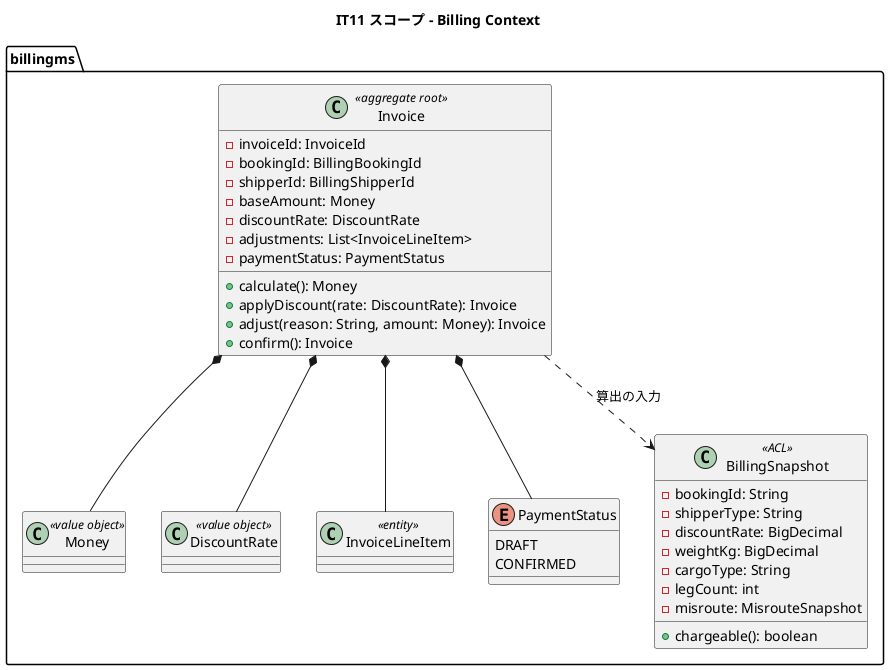
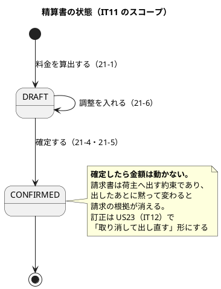
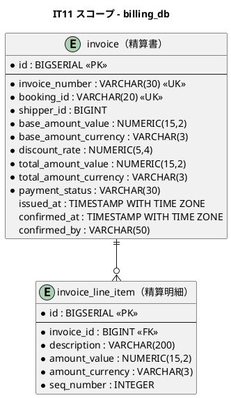
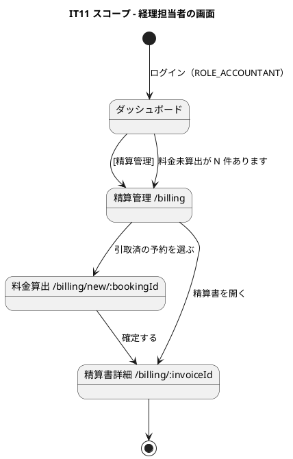

# イテレーション 11 計画

| 項目 | 内容 |
| :--- | :--- |
| イテレーション | IT11 |
| 期間 | 2026-10-05 〜 2026-10-18（2 週間） |
| 対象ストーリー | US21（輸送料金を算出する）・US22（法人割引を適用する） |
| 計画 SP | 9（US21 = 7・US22 = 2） |
| 局面 | **終盤（4 本目）／アウトサイドイン**（[開発戦略](development_strategy.md)） |
| 前提 | [IT10 完了報告書](iteration_report-10.md)・[IT10 ふりかえり](retrospective-10.md) |
| リリース | [Release 2.0](release_plan.md)（IT11〜IT12）——**billingms を業務として立ち上げる最初の IT** |

## ゴール

**運び終えた貨物に、いくら請求するかが決まるようになる。**

IT1 のウォーキングスケルトンで billingms を起こしてから 10 イテレーション、このサービスは
**ヘルスチェックしか返していない**。予約は取れ、経路は組め、荷役は記録され、追跡でき、
通関を通り、誤配も直せるようになったが、**運賃は 1 円も計算していない**。

IT10 で `Misroute` を「料金調整の根拠」として残したが、**その根拠を読む相手がまだいない**。
IT9 で「キャンセル料は算定していません」と画面に書いたのも、算定する場所が無かったからである。
**本 IT でその相手を作る。**

> **経理担当者（`ROLE_ACCOUNTANT`）が初めて仕事をする IT である。** ロールは IT1 から
> 存在するが、開いている画面が 1 つも無い。ログインしても「準備中」しか見えない状態が
> 10 イテレーション続いていた。

## 前イテレーションからの反映

### ふりかえりの Try（[retrospective-10.md](retrospective-10.md)）

| # | Try | 本 IT での扱い |
| :--- | :--- | :--- |
| 1 | デモ項目の表を「検査名の対応表」として読む | **DoD に入れた。** チェックを入れる前に 1 件ずつ検査を書き出す。IT10 はクローズ直前に 2 件の空白が見つかった |
| 2 | **ADR の決定は、決まった経路を端から端まで 1 度通す** | **成功基準 6 に据えた。** 本 IT は料金計算の規則を ADR で決める——**規則が効く経路（画面 → 集約 → ACL → 相手サービス）を 1 度通す検査**を同じ変更の中で書く。IT10 の「決定を書いて集約に検査も置いたのに、その決定が効く経路を一度も通していなかった」を繰り返さない |
| 3 | 述語を足したら、それを使う場所の一覧を作って読み合わせる。名前で区別する | **進め方に入れた。** 本 IT では `PaymentStatus`・`DiscountPolicyType` を足す。**列挙に値を足したら、その値を使う場所すべてを回る検査**を置く（Try 3 の一般形） |
| 4 | 画面から踏むテストは、遷移先まで含めて 1 本にする | **DoD に入れた。** 精算一覧 → 料金算出 → 確定の 3 画面をまたぐ |
| 5 | ロール別到達性は、ルートガードを通る検査で確かめる | **DoD に入れた。** `ROLE_ACCOUNTANT` に初めて画面を開く IT であり、**開いたつもりで 403** が最も起きやすい |
| 6 | フロントエンドの品質ゲートも CI と同じコマンドで回す | **返済枠 0.1 で `npm run verify` にまとめる。** IT10 は `oxlint` を回さず CI が赤になった |
| 7 | 実環境へ反映したら、Pod の起動時刻とコンテナ内 jar の日時で確かめる | **進め方に入れた。** あわせて `dev:k8s:rollout:image` の `--tag` が効かない件を返済枠 0.2 で直す |

### 引き継ぎ（返済枠・SP 対象外）

IT10 のレビュー低指摘 4 件と、ふりかえりの Try 6・7 を返済枠として持つ。
**IT 序盤（Day 1-3）に独立したコミットで済ませる**——5 IT 連続で全返済できている形を保つ。

| # | 内容 | 見積 | 出典 |
| :--- | :--- | :--- | :--- |
| 0.1 | **フロントエンドの品質ゲートを 1 コマンドにまとめる**（`oxlint` + `tsc -b` + `vitest`）。**壊して赤を確認する** | 3h | IT10 Problem 6 |
| 0.2 | **`dev:k8s:rollout:image` の `--tag` / `DEV_K8S_IMAGE_TAG` が効かない**。効くように直し、**Pod の起動時刻で反映を確かめる手順**を運用手順書に書く | 5h | IT10 Problem 7 |
| 0.3 | **誤配バナーの港を名前で出す**（他画面は港名を優先表示）。`lastHandlingLocationUnLocode` を使う他の画面と揃える | 4h | IT10 レビュー低 15 |
| 0.4 | **`RoutingStatus#visibleToRoutingPlanner` を `switch` 式にする**。否定リストのままだと値を足したとき自動的に開く方向に倒れる。[ADR-026](../adr/026-misroute-detection-and-rerouting.md) 決定 2 が「述語がすべての値を明示的に扱う」と決めているのに、検査になっていない | 3h | IT10 レビュー低 16 |
| 0.5 | **ADR-026 コンプライアンス表の決定 7 の行を、実際の壊し方に直す**（いま決定 5 の壊し方が書いてある） | 1h | IT10 レビュー低 17 |
| 0.6 | **trackingms の配線から完全修飾名を外す**（IT9 の `DetectCustomsHoldUseCase` から伝播） | 2h | IT10 レビュー低 18 |
| 0.7 | **`BookingStatus` の全値がラベルを持つことを検査する**。IT10 はキャプチャを撮って初めて 3 つの欠落に気づいた | 2h | IT10 レビュー スコープ外 |
| 0.8 | **購読側で 2 つ目のユースケースを呼ぶ順序を、壊すと赤くなる形で固定する**。IT9・IT10 で同じ構造が 2 つでき、コメントで順序を説明しているだけ | 4h | IT10 レビュー 懸念 |
| 0.9 | **IT10 時点のコメントが残っていないか確かめる**（実装した IT で消す） | 2h | 各 IT の慣行 |
| **合計** | | **26h** | |

### IT10 から「着手前に決めること」として引き継いだもの

| # | 決めること | 本 IT での扱い |
| :--- | :--- | :--- |
| A | **2 回目の誤配の扱い。** `Misroute` は 1 件しか持たず、組み直した先でまた外れたときに 1 回目が残る | **本 IT で決める（ADR-027）。** 料金調整は回数で変わる——**回数を数える必要があるなら履歴が要り、初回だけでよいなら現状のままでよい**。決めてから US21 の調整計算を書く |
| B | **誤配の記録を経理がどう読むか。** 予約詳細にしか出ず、経理担当者は開けない | **本 IT で決める。** ACL（`BillingSnapshot`）に載せる。**「残っている」と「読める」は別**（IT10 レビュー懸念） |
| C | **料金計算の規則。** US21 は「基本料金が自動計算される」としか言っていない | **本 IT で決める（ADR-027）。** 重量・貨物種別・区間数から算出する。**IT4 の経路候補が返す「概算費用」との関係**も決める——[domain-model.md](../design/domain-model.md) の 862 行が「費用は概算であり、請求される金額ではない（US21 で実料金に差し替える）」と書いている |
| D | **料金算出の起点。** `CargoDeliveredEvent` を待つのか、経理担当者が開始するのか | **経理担当者が開始する。** 受入基準 21-1 が「『引取済』状態の予約に対して料金算出を開始できる」であり、**イベントは要らない**。`CargoDeliveredEvent` は US23（IT12）の精算通知で必要になる——[domain-model.md](../design/domain-model.md) の 1472 行もそう書いている。**リリース計画の「US21 は trackingms の `CargoDeliveredEvent` 発行実装を含む」（レビュー H4）は IT12 へ送る**（注 1） |
| E | **キャンセル料の算定。** IT9 で「算定していません」と画面に書いた | **本 IT の範囲に含める**（[release_plan.md](release_plan.md) の Release 1.1 の注記どおり）。`CancellationFee` は設計済み（[domain-model.md](../design/domain-model.md)） |

## 対象ストーリーと受入基準

### US21: 輸送料金を算出する（7 SP）

| # | 受入基準 | 本 IT での扱い |
| :--- | :--- | :--- |
| 21-1 | 「引取済」状態の予約に対して料金算出を開始できる | **満たす。** 経理担当者が一覧から選ぶ |
| 21-2 | 輸送実績（経路・距離・重量・貨物種別・荷役作業実績）が表示される | **満たす**（距離を除く）。**距離は持っていない**——港のマスタに緯度経度が無く、航海も距離を持たない。**区間数で代替**し、その旨を画面に書く（注 2） |
| 21-3 | 基本料金が自動計算される | **満たす。** 規則は ADR-027 で決める |
| 21-4 | 算出結果を確認して確定操作ができる | **満たす** |
| 21-5 | 確定後、輸送料金が「確定」状態で登録される | **満たす** |
| 21-6 | 例外（遅延・破損等）が発生している場合、料金調整（減額・補償費用）の入力ができる | **満たす。** 誤配（IT10 の `Misroute`）と例外（IT8）の両方を根拠として表示する |

### US22: 法人割引を適用する（2 SP）

| # | 受入基準 | 本 IT での扱い |
| :--- | :--- | :--- |
| 22-1 | 荷主種別が「法人」の場合、契約割引率が自動的に取得・表示される | **満たす。** `shipper.discount_rate` は IT2（US03）で登録済み |
| 22-2 | 割引率（0〜30%）が基本料金に適用され、割引後の金額が表示される | **満たす** |
| 22-3 | 個人荷主の場合は割引が適用されない | **満たす** |
| 22-4 | 割引計算の根拠（割引率・基本料金・割引後料金）が精算書に記載される | **満たす**（明細として持つ） |

## 設計

### ドメインモデル図（本 IT のスコープ）

> **`PaymentStatus` は本 IT では `DRAFT` / `CONFIRMED` の 2 つだけ置く。**
> `PENDING` / `OVERDUE` / `REFUNDED` は支払いの状態であり、支払いを扱うのは US23（IT12）である。
> **持たない状態を先に足しても、遷移させる相手がいないうちは検査できない**（IT5 で
> `MISROUTED` について同じ判断をしている）。

### 状態遷移図

### ER 図（本 IT のスコープ）

> **金額は `NUMERIC(15,2)` にする。** [data-model.md](../design/data-model.md) の論理モデルは
> `INTEGER` と書いているが、**割引後の金額に端数が出る**（基本料金 × 0.85 など）。
> 端数の丸め方は ADR-027 で決め、**丸めた結果を保存する**（注 3）。

### 画面遷移図

> **件数から対象一覧へ辿れる**（[横断規約](release_plan.md)）。ダッシュボードに
> 「料金を算出していない引取済の予約が N 件あります」を出す——**経理担当者は他に
> 気づく手段を持たない**（メールの仕組みは無い）。

## タスク

### Phase 0: 返済枠（Day 1-3・26h）

上表の 0.1〜0.9。**独立したコミットで済ませる。**

### Phase 1: 受け入れテストと ADR（Day 3-4）

| # | タスク | 見積 | 備考 |
| :--- | :--- | :--- | :--- |
| 1.1 | **ADR-027 を書く**——料金計算の規則・2 回目の誤配の扱い・端数の丸め・確定後の不変性・`BillingSnapshot` の範囲 | 6h | **決定ごとに検査を用意し、決定が効く経路を 1 度通す**（Try 2） |
| 1.2 | デモ項目を受け入れテストに翻訳（Red） | 4h | 画面から踏む。**遷移先まで 1 本にする**（Try 4） |

### Phase 2: 画面と導線（Day 4-6）

| # | タスク | 見積 | 備考 |
| :--- | :--- | :--- | :--- |
| 2.1 | 精算管理の一覧（`/billing`）——精算書の一覧と、**料金未算出の引取済予約** | 6h | 2 つの待ち行列を 1 画面に置く |
| 2.2 | 料金算出の画面（`/billing/new/:bookingId`）——実績の表示・基本料金・割引・調整の入力 | 8h | 21-2・21-3・21-6・22-1〜22-3 |
| 2.3 | 精算書詳細（`/billing/:invoiceId`）——確定した内容と明細 | 4h | 22-4 |
| 2.4 | ダッシュボードに件数と導線 | 3h | 横断規約。**ロール別到達性をルートガードを通る検査で**（Try 5） |

### Phase 3: API と ACL（Day 6-8）

| # | タスク | 見積 | 備考 |
| :--- | :--- | :--- | :--- |
| 3.1 | `BillingSnapshot` の提供口を bookingms に置く | 5h | 既存の `CargoSnapshot`（handlingms 向け）と同じ形。**誤配の記録を載せる**（決めること B） |
| 3.2 | billingms 側の ACL（`BillingSnapshotFinder`）と契約テスト | 5h | `CargoSnapshotContract` と同じ形で共有 |
| 3.3 | 料金算出・確定の API | 6h | **応答の操作一覧に載せる**（IT9・IT10 で 2 度踏んだ形） |
| 3.4 | 例外の実績を trackingms から引く（21-6 の根拠） | 4h | 誤配は bookingms、例外は trackingms |

### Phase 4: ドメイン（Day 8-10）

| # | タスク | 見積 | 備考 |
| :--- | :--- | :--- | :--- |
| 4.1 | `Money`・`DiscountRate`・`InvoiceId` | 5h | **端数の丸めは 1 か所に置く** |
| 4.2 | `Invoice` 集約——算出・割引・調整・確定 | 8h | 確定後は動かない |
| 4.3 | 採番（`InvoiceId` ← `invoice_number` 列）と永続化 | 5h | **DB のシーケンス**（[ADR-011](../adr/011-booking-id-numbering.md) と同じ形） |
| 4.4 | キャンセル料の算定（`CancellationFee`） | 5h | IT9 の「算定していません」を消す |

### Phase 5: 実環境（Day 11-12）

| # | タスク | 見積 | 備考 |
| :--- | :--- | :--- | :--- |
| 5.1 | kind で引取 → 料金算出 → 確定を 1 往復させる | 5h | **反映は Pod の起動時刻で確かめる**（Try 7） |
| 5.2 | 誤配した貨物の料金調整を実環境で通す | 3h | IT10 の `Misroute` が初めて読まれる |

### Phase 6: マニュアルと計画への差し戻し（Day 12-13）

| # | タスク | 見積 | 備考 |
| :--- | :--- | :--- | :--- |
| 6.1 | **ユーザーマニュアル 12 章（精算管理）を新設**・キャプチャ生成 | 6h | 経理担当者が初めて使う画面 |
| 6.2 | 09 章・11 章の「キャンセル料は算定していません」を直す | 2h | 算定するようになる |
| 6.3 | 設計文書への反映（注 1〜3） | 3h | |

## スケジュール

| Day | 内容 |
| :--- | :--- |
| 1-3 | Phase 0（返済枠 9 件） |
| 3-4 | Phase 1（ADR-027・受け入れテスト） |
| 4-6 | Phase 2（画面と導線） |
| 6-8 | Phase 3（API と ACL） |
| 8-10 | Phase 4（ドメイン） |
| 11-12 | Phase 5（実環境） |
| 12-13 | Phase 6（マニュアル・設計反映） |
| 14 | クローズ（`closing-iteration`） |

## 成功基準

1. **経理担当者が、引取済の予約から料金を算出して確定できる**（21-1〜21-5）
2. **法人には割引が、個人には割引が適用されない**（22-1〜22-3）
3. **誤配・例外を根拠として調整を入れられる**（21-6）——IT10 の `Misroute` が初めて読まれる
4. **キャンセル料が算定される**——IT9 の「算定していません」が消える
5. **ダッシュボードの件数から、料金未算出の予約へ辿れる**（横断規約）
6. **ADR-027 の決定ごとに検査があり、その決定が効く経路を 1 度通した**（Try 2）
7. **列挙に足した値を使う場所すべてを回る検査がある**（Try 3・IT10 で 3 回踏んだ形）
8. **`ROLE_ACCOUNTANT` の到達性を、ルートガードを通る検査で確かめた**（Try 5）
9. **デモ項目 1 件ごとに、それを守る検査を書き出した**（Try 1）

## リスク

| # | リスク | 影響 | 対策 |
| :--- | :--- | :--- | :--- |
| 1 | **料金計算の規則が業務として決まっていない** | 実装したあとで「その計算式ではない」となる | ADR-027 で決め、**根拠（重量・種別・区間数）を画面に出す**。金額そのものより「なぜその金額か」が読めることを優先する |
| 2 | **距離を持っていない**（21-2） | 受入基準を字面どおりには満たせない | 区間数で代替し、画面に明記する。**満たせないことを完了報告書に記録する**（注 2） |
| 3 | **billingms が初めて他サービスを読む** | ACL の形が定まらず、BC 独立性を崩す | `CargoSnapshot`（handlingms 向け）と**同じ形**にする。契約テストを共有カーネルに置く |
| 4 | **経理の画面が 1 つも無い状態から 3 画面を作る** | ロール別到達性の欠落（IT7・IT9 で踏んだ形） | Try 5 をそのまま適用。**ルートガードを通る検査**で確かめる |
| 5 | **金額の端数** | 丸め方が 2 か所に分かれ、画面と保存値が食い違う | 丸めを 1 か所に置き、**画面はサーバが返した値を出すだけ**にする |
| 6 | **確定後の不変性** | 請求の根拠が黙って変わる | 集約で守り、**壊して赤を確認する** |

## 設計への反映が必要な箇所（注）

| # | 箇所 | 内容 |
| :--- | :--- | :--- |
| 1 | [release_plan.md](release_plan.md) の Release 2.0 | 「US21 は trackingms の `CargoDeliveredEvent` 発行実装を含む」（レビュー H4）を **US23（IT12）へ送る**。US21 の起点は経理担当者の操作であり、イベントは要らない |
| 2 | [user_story.md](../requirements/user_story.md) の US21-2 | **距離は持っていない**（港マスタに緯度経度が無い）。区間数で代替する旨を追記する |
| 3 | [data-model.md](../design/data-model.md) の `invoice` | 金額列を `INTEGER` から `NUMERIC(15,2)` へ。**割引後に端数が出る** |
| 4 | [domain-model.md](../design/domain-model.md) の Billing Context | `PaymentStatus` を IT11 では `DRAFT` / `CONFIRMED` の 2 つだけ置くことを明記（残りは US23） |
| 5 | [ui_design.md](../design/ui_design.md) | 料金算出（`/billing/new/:bookingId`）を画面一覧とロール別到達性の表に追加 |
| 6 | [domain-model.md](../design/domain-model.md) の Billing Context | **`BillingSnapshot`（ACL）を要素表に追加**。handlingms 向けの `CargoSnapshot` と同じ形で、billingms が bookingms から料金算出の入力を引く。**誤配の記録を載せる**（IT10 レビューの懸念「残っていると読めるは別」への対応） |
| 7 | [domain-model.md](../design/domain-model.md) の Billing Context | **`InvoiceId` は採番された請求番号を持つ**（`invoice_number` 列に対応。予約の `BookingId` と同じ形）。DB の `id` ではない旨を明記する |
| 8 | [architecture_backend.md](../design/architecture_backend.md) の `CargoCancelledEvent` の行 | 「キャンセル料の算定は **US23・IT11**」と書いてあるが、**US23 は IT12** である。[release_plan.md](release_plan.md) の Release 1.1 注記が「キャンセル料の算定（billingms 側）は Release 2.0 の **US21** に含める」と書いており、そちらが正。**US21・IT11** に直す |
| 9 | [architecture_backend.md](../design/architecture_backend.md) の `CargoCancelledEvent` の行 | **billingms へは本 IT でも発行しない**。料金算出の起点は経理担当者の操作であり（決めること D）、キャンセルされた予約も一覧から選ぶ。**読む側の無い配線を先に敷かない**（[ADR-025](../adr/025-customs-declaration-and-cancellation-approval.md) 決定 3）という判断はそのまま生きる——その旨に書き換える |

## デモ項目

| # | 項目 | アクター | 受入基準 |
| :--- | :--- | :--- | :--- |
| 1 | ダッシュボードの件数から、料金未算出の予約へ辿れることを示す | 経理担当者 | 横断規約 |
| 2 | 引取済の予約を選ぶと、輸送実績が出ることを示す | 経理担当者 | 21-2 |
| 3 | 基本料金が自動で計算され、**その根拠**が出ることを示す | 経理担当者 | 21-3 |
| 4 | 法人荷主では割引率が自動で入り、割引後の金額が出ることを示す | 経理担当者 | 22-1・22-2 |
| 5 | 個人荷主では割引が適用されないことを示す | 経理担当者 | 22-3 |
| 6 | 誤配した貨物では、その記録が根拠として出ることを示す | 経理担当者 | 21-6 |
| 7 | 調整（減額・補償）を入れると、合計が変わることを示す | 経理担当者 | 21-6 |
| 8 | 確定すると精算書が「確定」になり、**金額が動かなくなる**ことを示す | 経理担当者 | 21-4・21-5 |
| 9 | 精算書に割引の根拠が記載されていることを示す | 経理担当者 | 22-4 |
| 10 | キャンセルされた予約にキャンセル料が算定されることを示す | 経理担当者 | US30-9（IT9 からの持ち越し） |

## DoD（完了の定義）

- [ ] 対象ストーリーの受入基準を満たす。**果たせないもの（21-2 の距離）を完了報告書に記録する**
- [ ] 成功基準 1〜9 を満たす
- [ ] **受入基準 21-1〜21-6・22-1〜22-4 それぞれに、達成を確かめる検査がある**
- [ ] **デモ項目 10 件それぞれに、それを守る検査を書き出した**（Try 1）。**実演で緑になることを「固定されている」と取り違えない**
- [ ] 全テストが緑。**品質ゲートは CI と同じコマンドで回す**——バックエンドは `./gradlew build`、フロントエンドは **返済枠 0.1 でまとめた 1 コマンド**（Try 6）
- [ ] **CI が緑**（run 番号を完了報告書に記録）
- [ ] **`TZ=UTC` でも緑**
- [ ] **ドメイン層のカバレッジが 90% 以上**（7 サービス + shared）
- [ ] SonarQube Quality Gate が **両プロジェクトで PASS**
- [ ] **ADR-027 の決定ごとに検査があり、その決定が効く経路を 1 度通した**（Try 2）。**集約に検査を置いて終わりにしない**
- [ ] **列挙に足した値を使う場所すべてを回る検査がある**（Try 3）。**名簿は書き写さず実体から回す**
- [ ] **画面から踏むテストが、遷移先まで含めて 1 本になっている**（Try 4）
- [ ] **`ROLE_ACCOUNTANT` の到達性を、ルートガードを通る検査で確かめた**（Try 5）
- [ ] **この IT で書いた「〜しない」「〜まで確かめる」の数だけ検査があり、壊して赤を確認した**
- [ ] **新しく足した値が層をまたいで生き延びる**。値ごとに 1 本
- [ ] **件数から対象一覧へ辿れる**（[横断規約](release_plan.md)）
- [ ] **サービス間の呼び出しを実際に 1 往復させた**（kind で引取 → 料金算出 → 確定）
- [ ] **実環境へ反映したら、Pod の起動時刻とコンテナ内 jar の日時で確かめた**（Try 7）
- [ ] **デモ項目 10 件をこの順で通した**
- [ ] **IT10 時点のコメントが残っていない**（返済枠 0.9）
- [ ] **JIG / jig-erd の出力を再生成した**
- [ ] ユーザーマニュアル **12 章を新設**し、09 章・11 章の「算定していません」を直し、**キャプチャを再生成して目視した**
- [ ] 注 1〜5 を設計文書に反映した
- [ ] `docs/index.md` / `development/index.md` / `mkdocs.yml` を同期した

## 進捗

| 区分 | 状態 |
| :--- | :--- |
| 返済枠（0.1〜0.9） | 未着手 |
| Phase 1 受け入れテストと ADR | 未着手 |
| Phase 2 画面と導線 | 未着手 |
| Phase 3 API と ACL | 未着手 |
| Phase 4 ドメイン | 未着手 |
| Phase 5 実環境 | 未着手 |
| Phase 6 マニュアルと設計反映 | 未着手 |
