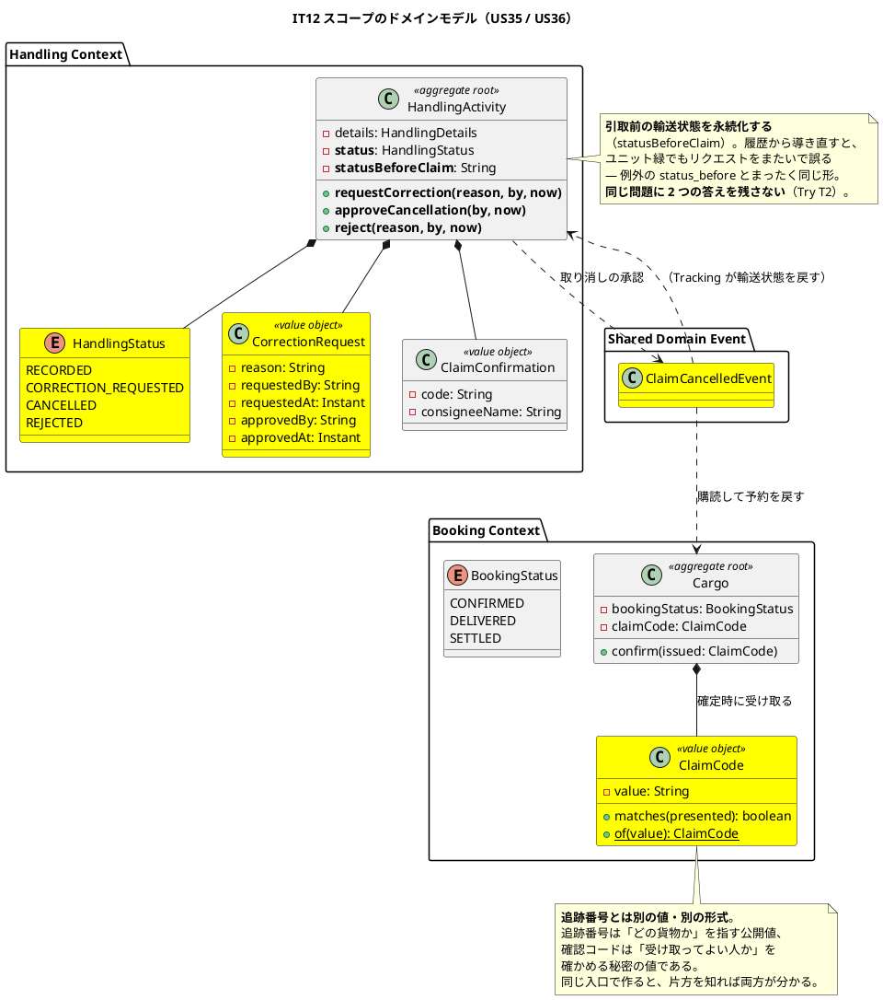
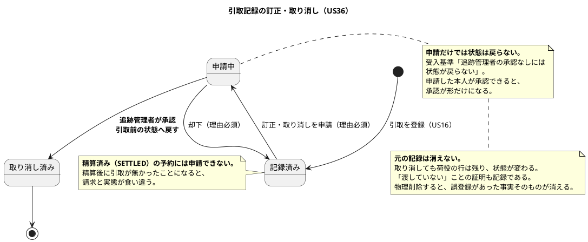
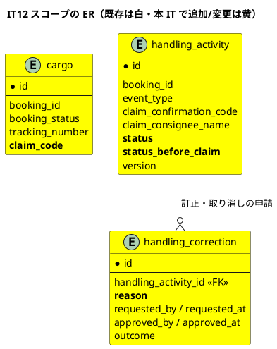
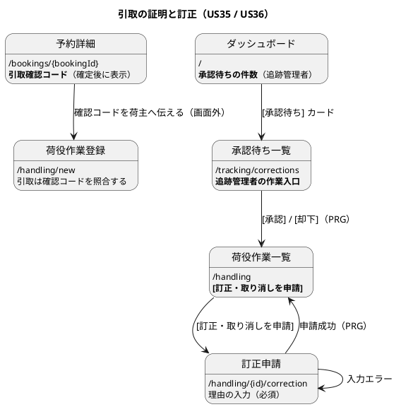

# イテレーション 12 計画

## 概要

| 項目 | 内容 |
| :--- | :--- |
| イテレーション | IT12 |
| リリース | 1.1 実運用補完 |
| 期間 | 2026-08-09 〜 2026-08-10（10 営業日相当） |
| 局面 | **終盤**（`development_strategy.md`。アプローチ: アウトサイドイン） |
| 計画 SP | **5SP**（US35 3SP / US36 2SP） |
| 前提 | IT11 クローズ済み（累計 91SP / 91SP、11 IT 連続で計画 = 実績。ベロシティ平均 8.27） |

---

## ゴール

**「渡した」「受け取っていない」の争いに、システムが答えられるようにする。**

IT7 で引取を記録できるようにしたが、確認コードは**入力された文字列を書き写すだけ**で、照合する相手がシステムの中に無かった。記録はあるが証明にならない。あわせて、誤って登録した引取を**取り消す手段が無い**。引取は輸送の終点であり、誤登録をそのままにすると**貨物が届いていないのに配送完了として扱われる**。

**本 IT は Release 1.1 の最後であり、リリース全体の一貫性を確定させる。**

---

## 5SP をどう使うか（**返済枠が本 IT の主戦場である**）

| 区分 | SP / 見積 | 内容 |
| :--- | :--- | :--- |
| ストーリー | 5SP / 約 30h | US35 / US36 |
| **返済枠** | — / 約 30h | **高 4 件（C28〜C31）＋ 3 IT 繰り越し 4 件（C6 / C11 / C12 / C16）＋ 中・低から 8 件** |

**ベロシティ 8.27 に対して 5SP である。差の 3SP 分をまるごと返済に充てる。** これは「余力次第」ではなく、**計画として先に確保した枠**である（[ADR-008 が IT6〜IT8 で 3 回繰り越された](retrospective-9.md)形にしない）。

---

## 前イテレーションの学びの反映（ふりかえり Try）

IT11 のふりかえり（`retrospective-11.md`）の Try 8 件を、本計画のタスクと DoD に落とす。

| Try | 内容 | 本計画への反映 |
| :--- | :--- | :--- |
| **T1** | **「〜する」と書いたコメントは、その IT のうちに壊して赤にする。** とくに「同じ〜を使う」「〜を持ち回る」「〜の内部にある」のような**構造を主張する**コメント | **DoD の最上位に置く。** 本 IT は「取り消しで状態を戻す」「照合する」という**構造を主張しやすい**題材である。3 IT 連続で出ている食い違いを、書いた時点で潰す |
| **T2** | **同じ問題に 2 つの答えを残さない。** 違うやり方をするなら理由を書く | タスク 1 の進め方。**取り消しの状態復帰は例外の `statusBefore` と同型**であり、そちらに揃える |
| **T3** | **検査の射程を毎 IT 確かめる。** SQL・テンプレート・設定は検査の外にある | **タスク 0-1（C28）で Mapper の SQL が触るテーブルの所有 BC を検査する仕組みを入れる** |
| **T4** | **列挙型に値を足したら、その値を扱う経路を全部数える** | US36 で引取の状態（申請中・承認・却下）を足すため直接効く |
| **T5** | null になりうる値を画面・通知に出すときは、null のときの見え方を先に決める | 確認コード未採番の予約の見え方（DoD） |
| **T6** | **受入基準ごとに「その道を実行したテスト」を 1 つ名指しする** | タスク 5-0。指差し確認の様式を変える |
| **T7** | **マニュアルは実装を見てから書く** | タスク 5-2 の手順 |
| **T8** | 返済枠は IT 序盤の独立コミットで先に着手する（6 IT 連続） | **タスク 0 を最初に置く** |

---

## 返済枠（タスク 0。**序盤に先に着手する**）

### 返すもの

| # | 内容 | 由来 | 扱い |
| :--- | :--- | :--- | :--- |
| **C28** | **BC をまたぐ SQL の JOIN 2 本と、それを検出する仕組み** | IT11 レビュー（architect 高） | **仕組みを先に作る。** ArchUnit を 1 件も破らずに結合が増えた。**検査が緑であることが越境していないことの根拠にならない**（Try T3）。Mapper の `@Select` が触るテーブルの所有 BC を検査する自作 lint を入れ、**フィクスチャは実コードの形で作る** |
| **C29** | **引取の拒否が「申告のある貨物」にしか効かない** | IT11 レビュー（高） | **US35 と同じ「引取の守り」であり、本 IT のスコープと重なる。** どの貨物に通関が要るのかをドメインの述語として置く |
| **C30** | **荷受人が通関状態を読める画面が無い** | IT11 レビュー（高） | 追跡照会に通関状態の行を足す。**引き取りに来る当人が確認できない**のは US29 の目的に届いていない |
| **C31** | **誤配の記録を営業担当者が追えない** | IT11 レビュー（高） | 予約詳細に「この貨物の例外」を読み取り専用で出す |
| **C6** | 温度の境界・危険物クラスの妥当性・秒単位の境界 | IT9 レビュー（**3 IT 繰り越し**） | **返す。** IT11 の計画で「IT12 の返済枠へ名前で送る」と確定させた |
| **C11 / C16** | 荷主の紐付けを画面で確認する手段と、ADR-013 の手順書 | IT9 レビュー（**3 IT 繰り越し**） | **返す。** 2 件同時に扱う（画面ができれば手順書の対象が変わる） |
| **C12** | US05 受入基準 3 が E2E 1 本だけで支えられている | IT9 レビュー（**3 IT 繰り越し**） | 返す |
| C35 | 通関申告の登録が ui_design と画面で食い違う（**見えないが URL を叩けば実行できる**） | IT11 レビュー 中 | 返す。認可の意図を決める |
| C36 / C37 | 申告日時・新しい到着予定日に未来日／過去日を入れられる | IT11 レビュー 中 | 返す（**T5 の対象**） |
| C33 / C34 | ダッシュボードのリンク先が件数と一致しない・ADR-014 の誤配カード | IT11 レビュー 中 | 返す |
| C43 | 監査ログの出力を確認するテストが無い | IT11 レビュー 中 | 返す（`LogCapture` の既存の型がある）。**US35 の「一致しなかった事実が監査ログに残る」に直結する** |
| C49 | `domain-model.md` の ACL ポート一覧に漏れ（**IT11 で対応済み**） | — | 完了 |

### 返さないもの（**理由を明記する**）

| # | 内容 | 理由 |
| :--- | :--- | :--- |
| C38 / C39 / C40 | 往復数・コマンド組み立ての重複・Javadoc の食い違い | **内部の整理であり、業務の穴ではない。** 本 IT は Release 1.1 の最後であり、業務として届いていないもの（C29〜C31）を優先する。**Release 2.0 の開始準備で扱う** |
| C41 / C42 / C44 | テストの穴（候補ゼロの空振り・誤配の日時・誤配判定のユニット） | 同上。ただし **C41 は空振りしうるテストであり、T6 の指差し確認で当たれば直す** |
| C45〜C48 / C50〜C55 | ドキュメント・命名・未参照メソッドほか | 低。**Release 2.0 の開始準備で棚卸しする** |

---

## 対象ユーザーストーリー

| ID | ユーザーストーリー | SP | 優先度 | Issue |
| :--- | :--- | :--- | :--- | :--- |
| US35 | 引取確認コードを採番して照合する | 3 | 必須 | [#509](https://github.com/k2works/case-study-cargo-tracker/issues/509) |
| US36 | 引取記録を訂正・取り消しする | 2 | 必須 | [#510](https://github.com/k2works/case-study-cargo-tracker/issues/510) |
| | **合計** | **5** | | |

> マイルストーンは 2 件とも `[java/take-6] Release 1.1 実運用補完`、ラベルは `it12` である。

### 実装順序

**US35 → US36** の順に進める。US35 が「引取の守り」を作り、US36 は**その守りをすり抜けた記録を後始末する**。逆順にすると、取り消す対象がまだ緩い状態で取り消しを設計することになる。

### 受入基準

受入基準の正典は [ユーザーストーリー](../requirements/user_story.md) である。**本計画に書き写さず引用する。**

- US35: [US35 の受入基準](../requirements/user_story.md#us35-引取確認コードを採番して照合する)
- US36: [US36 の受入基準](../requirements/user_story.md#us36-引取記録を訂正取り消しする)

### 受入基準のうち解釈が要るもの（**括弧の中まで読む**。T6）

| 内容 | 扱い | 理由 |
| :--- | :--- | :--- |
| US35「予約確定時（**US13**）に引取確認コードが採番される」 | **予約の確定で採番する。** 追跡番号（US14）とは別の入口・別の値 | 追跡番号は「どの貨物か」を指す公開値、確認コードは「受け取ってよい人か」を確かめる秘密の値である。**同じ入口で作ると、片方を知れば両方が分かる** |
| US35「営業担当者が荷主へ**伝えられる**」 | **予約詳細に表示し、通知の記録に載せる**（ADR-006） | 外部へは送らない。IT11 の C20 で本文を読めるようにしたので、**荷主も自分のコードを画面で読める** |
| US35「一致しない場合、**記録できない**」 | **拒否する。** 警告ではない | 引き渡しの証明が無いまま「引き渡し済み」を記録すると、争いになったときに会社が不利になる（US16 の判断と同じ） |
| US35「一致しなかった事実が**監査ログに残る**（総当たりの検知）」 | **監査ログに出し、テストで固定する**（C43） | 「出している」と「確かめている」は別である。IT11 は監査ログのテストが無かった |
| US35「コードは**追跡番号とは別の値である**」 | **形式も別にする。** 追跡番号は `TRK-YYYYMMDD-NNNN`、確認コードは別の形式 | 「別の値」は同じ形式の別インスタンスでは足りない。**追跡番号を知っているだけでは引き取れない**が受入基準の意図である |
| US36「取り消しが承認されると、貨物状態が**引取前の状態**に戻る」 | **引取前の状態を永続化する。** 履歴から導出しない | IT10 の例外（`status_before`）とまったく同じ形。**導出はユニット緑でもリクエストをまたぐと誤る**（T2: 同じ問題に 2 つの答えを残さない） |
| US36「元の記録は**消えない**」 | **取り消しても荷役の行は残す。** 状態を「取り消し済み」にする | 「渡していない」ことの証明も記録である。物理削除すると、誤登録があった事実そのものが消える |
| US36「**精算済み**（`SETTLED`）の予約に対しては訂正・取り消しできない」 | **拒否する** | 精算が済んだ後に引取が無かったことになると、請求と実態が食い違う |

---

## 設計への反映が必要（当該 IT で対応）

着手前の突合で見つかった差分。**当該 IT で設計ドキュメントに反映する。**

| # | 対象 | 内容 | 反映先 |
| :--- | :--- | :--- | :--- |
| 1 | `data-model.md` / マイグレーション | **確認コードを採番して保持する列が `cargo` に無い**。`handling_activity.claim_confirmation_code` は**入力された値**であり、照合する相手ではない | V25・`data-model.md` |
| 2 | `domain-model.md` | **引取確認コードの値オブジェクトが要素表に無い**。`ClaimConfirmation`（入力側）はあるが、採番される側が無い | `domain-model.md` |
| 3 | `data-model.md` / マイグレーション | **引取記録の訂正・取り消しの状態と履歴を持つ場所が無い** | V25・`data-model.md` |
| 4 | `domain-model.md` | 取り消しで戻る先（引取前の輸送状態）を持つことが要素表に無い | `domain-model.md` |
| 5 | `ui_design.md` | **US35 / US36 の画面がどこにも定義されていない**（画面一覧・遷移図とも） | `ui_design.md` |
| 6 | `ui_design.md` | 荷役作業一覧に「訂正・取り消しを申請する」入口が無い | `ui_design.md` |
| 7 | `ui_design.md` | **追跡管理者が承認する画面が無い**（US36 の受入基準「追跡管理者の承認なしには状態が戻らない」の受け皿） | `ui_design.md` |
| 8 | `non_functional.md` | ROLE_HANDLER / ROLE_TRACKER の権限範囲に訂正申請・承認が無い | `non_functional.md` §4.1 |
| 9 | `test_strategy.md` | US35 / US36 のテスト対象の記述を実装に合わせる（IT11 で US28 の記述が実装と食い違っていた前例） | `test_strategy.md` |
| 10 | ADR | **確認コードの採番を Booking が行い、照合を Handling が行う**（BC をまたぐ） | 判断を後述。**ADR は起票せず ADR-012 の適用として記録する** |

> **採番の値は集約の外で作り、`confirm` に渡す**（既存の `issueTrackingNumber(BookingTrackingNumber)` と同じ形）。
> 集約の中で乱数を引くと、**同じ入力から同じ結果が出ないためテストが書けない**。
> 追跡番号で確立した形をそのまま使う（Try T2: 同じ問題に 2 つの答えを残さない）。

### 設計反映 #10 の方針（**採番と照合の分担**）

**採番は Booking（予約の確定時）、照合は Handling（引取の登録時）である。** 両者は別 BC であり、Handling は照合のために Booking の値を知る必要がある。

**既存の `CargoSnapshots`（Handling → Booking）に載せる。** 新しいポートを足さない — このポートは既に「荷役の判定に要る予約の写し」を運んでおり、確認コードはまさにその一部である（予定ルート・荷受人名と同じ性質）。

**`CustomsDeclaration` の轍を踏まない。** IT11 は同じ問題（荷主名の取得）に「ポートで越境する」と「SQL で JOIN する」の 2 つの答えを残した。**本 IT は既存のポートに揃える**（Try T2）。

---

## 設計（IT12 スコープ）

### ドメインモデル図

### 状態遷移図（IT12 スコープ）

### ER 図（IT12 スコープ）

> **`claim_code` は `cargo` に置く**（採番するのは予約の確定であり、Booking の持ち物）。
> `handling_activity.claim_confirmation_code` は**入力された値**であり、別物である。
> **NULL 可にする** — IT11 以前に確定した予約は持たない。読み戻す側は拒まない
> （V22 / V23 / V24 と同じ判断。**Try T4 により旧形式の行を読むテストを本 IT で書く**）。

### 画面遷移図（IT12 スコープ）

---

## タスク分解

### 0. 返済枠（**最初に着手する**。T8。6 IT 連続）

| # | タスク | 見積 |
| :--- | :--- | :--- |
| 0-1 | **C28: Mapper の SQL が触るテーブルの所有 BC を検査する仕組み**（**フィクスチャは実コードの形で作る**）＋既存 2 本の越境を解消 | 6.0h |
| 0-2 | **C29: 引取に通関が要るかをドメインの述語として置く**（申告なしの輸入貨物） | 3.0h |
| 0-3 | **C30: 追跡照会に通関状態を出す**（荷受人が確認できる） | 2.5h |
| 0-4 | **C31: 予約詳細に「この貨物の例外」を読み取り専用で出す**（営業担当者） | 2.5h |
| 0-5 | **C6 / C12: US05 の追検証**（温度の境界・危険物クラス・E2E 依存の解消） | 3.5h |
| 0-6 | **C11 / C16: 荷主の紐付けの確認画面と ADR-013 の手順書** | 3.5h |
| 0-7 | C35 / C36 / C37: 認可の意図を決める・未来日／過去日の検査（T5） | 3.0h |
| 0-8 | C33 / C34 / C43: ダッシュボードのリンク先・誤配カード・監査ログのテスト | 3.0h |
| | **小計** | **27.0h** |

### 1. 受け入れテスト（赤）とドメイン

| # | タスク | 見積 |
| :--- | :--- | :--- |
| 1-1 | US35 / US36 の受け入れテストを**赤で**書く（**受入基準ごとに「その道を実行したテスト」を名指しする**。T6） | 3.0h |
| 1-2 | `ClaimCode`（採番・照合）。**追跡番号とは別の形式**にする | 2.5h |
| 1-3 | `HandlingStatus` と `CorrectionRequest`。**引取前の状態を永続化する**（例外の `status_before` と同型） | 3.0h |
| 1-4 | **申請した本人は承認できない**・**精算済みには申請できない** | 2.0h |
| | **小計** | **10.5h** |

### 2. 永続化

| # | タスク | 見積 |
| :--- | :--- | :--- |
| 2-1 | `V25`（`cargo.claim_code`・`handling_activity.status` / `status_before_claim`・`handling_correction`）＋**旧形式の行を読み戻すテスト**（T4） | 2.5h |
| 2-2 | 読み書きと Testcontainers のテスト | 2.5h |
| 2-3 | ドメインイベント（`ClaimCancelledEvent`）と購読側（予約・追跡の状態を戻す） | 3.0h |
| | **小計** | **8.0h** |

### 3. アプリケーションと画面

| # | タスク | 見積 |
| :--- | :--- | :--- |
| 3-1 | 予約確定時の採番と、予約詳細での表示（**荷主も読める**） | 2.5h |
| 3-2 | 引取登録での照合（**一致しなければ記録しない**・監査ログ） | 2.5h |
| 3-3 | 訂正・取り消しの申請（荷役作業一覧から。理由必須） | 2.5h |
| 3-4 | 承認待ち一覧と承認・却下（追跡管理者）＋ダッシュボードのカード（ADR-014） | 3.0h |
| 3-5 | 認可。**「開けないこと」と「開けること」を対で書く**（T2 の系） | 1.5h |
| | **小計** | **12.0h** |

### 4. E2E とテスト

| # | タスク | 見積 |
| :--- | :--- | :--- |
| 4-1 | E2E: 採番 → 荷主へ伝える → 照合して引取 → 誤ったコードでは記録されない | 2.5h |
| 4-2 | E2E: 誤登録 → 申請 → 承認 → 引取前の状態に戻る | 2.5h |
| 4-3 | **T1: 「〜する」と書いたコメントを数え上げ、その全件を壊して赤にする**（構造を主張するコメントが対象） | 3.0h |
| 4-4 | **T3: 検査の射程を確かめる**（0-1 の仕組みが実コードの違反を捕まえるか） | 1.5h |
| 4-5 | E2E の逆検証（操作を 1 本ずつ外す） | 1.0h |
| | **小計** | **10.5h** |

### 5. ドキュメント

| # | タスク | 見積 |
| :--- | :--- | :--- |
| 5-0 | **T6: 受入基準ごとに「その道を実行したテスト」を名指しする**（存在ではなく実行を確認する） | 1.0h |
| 5-1 | 設計ドキュメントの反映（10 件） | 3.5h |
| 5-2 | **マニュアル更新**（**04 に確認コード・08 に訂正申請・07 に承認**）＋キャプチャ再生成。**実装を見てから書く**（T7） | 4.5h |
| 5-3 | 用語集・付録 B・索引 3 点同期 | 2.0h |
| | **小計** | **11.0h** |

**合計見積: 79.0h**（うち返済枠 27.0h）

---

## ADR

| # | 判断 | 起票要否 |
| :--- | :--- | :--- |
| 1 | 確認コードの採番は Booking、照合は Handling。既存の `CargoSnapshots` に載せる | **起票しない。** ADR-012 の適用であり、**新しいポートを足さない**という判断は Try T2（同じ問題に 2 つの答えを残さない）の実践である |
| 2 | 取り消しの状態復帰を `status_before_claim` の永続化で表す | **起票しない。** 例外の `status_before`（IT10）と同じ判断であり、`data-model.md` に記録済みの形をそのまま使う |
| 3 | 引取の取り消しを Handling → Booking / Tracking のドメインイベントで伝える | **起票しない。** ADR-009 / ADR-012 の適用 |
| 4 | **Mapper の SQL が触るテーブルの所有 BC を検査する**（C28） | **ADR を起票する。** 「検査の射程をどこまで広げるか」は ADR-012 の前提を補強する構造上の判断である。**設計図の向きを変えたら ADR** |

---

## スケジュール

| 日 | 内容 |
| :--- | :--- |
| 1-3 | タスク 0（返済枠 27h。**C28 の仕組みを最初に作る**） |
| 4-5 | タスク 1（受け入れテストを赤にしてからドメイン） |
| 6 | タスク 2（永続化） |
| 7-8 | タスク 3（アプリケーションと画面） |
| 9 | タスク 4（E2E と破壊検証） |
| 10 | タスク 5（ドキュメント）・**Release 1.1 のクローズ準備** |

---

## リスクと対策

| # | リスク | 影響 | 対策 |
| :--- | :--- | :--- | :--- |
| 1 | **返済枠 27h がストーリー本体（30h）と同規模である** | 大 | **落とす順序を先に決める**: 0-8 → 0-7 → 0-5 の順。**C28〜C31（高）と 3 IT 繰り越しの C11 / C16 は落とさない**。US35 / US36 の受入基準も落とさない |
| 2 | C28 の自作 lint が実コードの違反を捕まえられない | 中 | **フィクスチャを実コードの形で作る**（最小の違反例だけだと検出 0 件になる）。タスク 4-4 で射程を確かめる |
| 3 | 取り消しの状態復帰が例外の復帰と衝突する | 中 | **例外が未解決の貨物で引取の取り消しをするケース**を先にタスク 1-3 で決める。復帰先が 2 つになる形は C21 で一度扱っている |
| 4 | 確認コードの採番が既存の確定処理（US13）を壊す | 中 | **既存の E2E（`critical-path.spec.js`）が緑であること**で守る。コードは NULL 可で足し、既存の予約は照合の対象外にする |
| 5 | **Release 1.1 の最後であり、残った穴がそのまま残る** | 大 | タスク 5-0 で**Release 1.1 全体の受入基準**を見渡し、未達・部分的な項目を完了報告書に名前で残す |

---

## 完了条件

### デモ項目

1. 予約を確定すると**引取確認コードが採番される**
2. 予約詳細でコードを確認できる（**荷主も自分のコードを読める**）
3. **誤ったコードでは引取を記録できない**（記録が残らないことまで）
4. 一致しなかった事実が**監査ログに残る**
5. コードは**追跡番号とは別の形式**である
6. 荷役作業一覧から**訂正・取り消しを申請できる**（理由必須）
7. **申請しただけでは状態は戻らない**
8. 追跡管理者が承認すると、**引取前の状態に戻る**
9. **元の記録は消えない**（状態が「取り消し済み」になる）
10. **精算済みの予約には申請できない**
11. **申請した本人は承認できない**
12. 通関が要る貨物で**申告が無ければ引取が拒まれる**（C29）
13. **荷受人が追跡照会で通関状態を読める**（C30）
14. **営業担当者が予約詳細で誤配の記録を読める**（C31）

### 完了の定義（DoD）

#### 機能

- [x] US35 / US36 の受入基準（受入基準ごとに、テストクラスの Javadoc で「その道を実行したテスト」を名指しした。T6）
- [x] デモ項目 14 件が動作する（E2E 13 spec 緑。うち本 IT で 1 本追加・2 本修正）
- [x] **返済枠の高 4 件（C28〜C31）と 3 IT 繰り越し 4 件（C6 / C11 / C12 / C16）を返した**。あわせて C33 / C34 / C35 / C36 / C37 / C43 も返した（返済枠 8 タスクすべて）

#### 終盤の完了条件（`development_strategy.md`）

- [x] 業務シナリオが通しで動作する
- [x] E2E が緑（既存 12 本＋本 IT の 1 本 = 13 本）。**2 本の計画に対し 1 本にまとめた** — US35 と US36 は同じ貨物の同じ流れで確かめるほうが、止まる理由を判別できる
- [x] ArchUnit のルールがすべて有効・緑（C28 の `MapperTableOwnershipTest` を含む）

#### 品質

- [x] `./gradlew check` が緑（test / checkstyle / spotbugs）
- [ ] CI が緑・SonarQube Quality Gate が PASS（Bug 0 / Vulnerability 0 / Code Smell 0 / 重複 3% 未満 / 新規コードのカバレッジ 80% 以上）

#### 主張とテスト（T1。**本 IT の最上位**）

- [x] **「〜する」と書いたコメントを数え上げ、その全件を壊して赤にする。** 本 IT の中核 8 ファイルから構造を主張するもの **10 件**を機械的に数え、**7 件はすでに壊して赤にしていた**。残り 3 件は主張しただけで支えるテストが無く、テストを足した（`d917eedf`）
- [x] 壊せない主張はコメントから落とす（該当なし。**3 件とも実装は正しく、確かめていなかっただけだった**）
- [x] **マイグレーションのコメントに「読み戻す側の責務」を書いたら、その IT のうちに読み戻すテストを書く**（T4）。V25 / V26 / V27 の「NULL 可・読み戻す側は拒まない」に対し、`Cargo.withClaimCode` / `CorrectionRequest.reconstruct` / `TrackingActivity.withStatusBeforeClaim` の復元経路を検査で固定した

#### 安全装置（**着手前にリストを作らない**）

**実装後に数え上げた結果で埋める。** やらなかったものは名前で記録する。

| # | 装置 | 数え上げ元 | 壊し方 | 結果 |
| :--- | :--- | :--- | :--- | :--- |
| 1 | 通関の要否（C30 の行の出し分け） | 実装後の数え上げ | 常に要るとみなす | **赤**（国内輸送に行が出た） |
| 2 | 申告が無いときの「手続き前」 | 同上 | 空を返す | **赤** |
| 3 | 引取可否の文言 | 同上 | 文言を変える | **赤**（2 件） |
| 4 | 例外の節の出し分け（C31） | 同上 | 常に出す | **赤** |
| 5 | 対応済／未解決の区別 | 同上 | 全件を未解決にする | **赤** |
| 6 | 荷主の紐付けの絞り込み（C11） | 同上 | 荷主で絞らない | **赤** |
| 7 | 紐付けが無いときの案内先 | 同上 | 案内文を消す | **赤** |
| 8 | 冷凍の便適合（C12） | 同上 | 冷凍の検査を外す | **赤** |
| 9 | 運べない便の確定拒否 | 同上 | 集約の検査を外す | **赤** |
| 10 | 通関の認可（C35） | 同上 | TRACKER に POST を開く | **赤**（2 件） |
| 11 | 申告日時の未来検査（C36） | 同上 | 検査を通す | **赤**（2 件） |
| 12 | 到着予定日の過去検査（C37） | 同上 | 検査を通す | **赤**（2 件） |
| 13 | 留置カードの行き先（C33） | 同上 | `days` を外す | **赤** |
| 14 | 誤配の件数（C34） | 同上 | 全件を数える | **赤** |
| 15 | 誤配カードのリンク先 | 同上 | 一覧全件へ向ける | **赤** |
| 16 | 拒否の監査ログ（C43） | 同上 | `info` を `debug` に落とす | **赤**（2 件） |
| 17 | 引取確認コードの照合（US35） | 同上 | 常に一致とみなす | **赤**（3 件） |
| 18 | 予約詳細でのコード表示 | 同上 | 表示しない | **赤** |
| 19 | 申請者本人の承認拒否（US36） | 同上 | 検査を外す | **赤**（2 件） |
| 20 | 精算済みの申請拒否 | 同上 | 検査を外す | **赤** |
| 21 | 取り消しの復帰先 | 同上 | 引取完了のままにする | **赤** |

**21 件すべてが赤になった。空振りは 0 件。** IT11（22 件中 3 件空振り）と違い、
**本 IT は「作った直後に壊す」を各コミットの中で行った**。IT11 は実装をまとめてから
数え上げたため、間に合わせで足した検査が混ざっていた可能性がある。

#### 検査の射程（T3）

- [x] **Mapper の SQL が触るテーブルの所有 BC を検査する仕組みが動く**（実コードの形のフィクスチャで確かめた）
- [x] 既存の越境が解消している（または理由を明記して残す）。**レビューは 2 本と言ったが、検査は 9 本を見つけた**（7 本は既存）。1 本を写しで解消し、8 本を理由つきで登録した

#### 到達性（ロール別・状態別・**発生時点**）

- [x] 営業担当者が予約詳細で確認コードを読める
- [x] **荷主が自分の予約で確認コードを読める**（予約詳細は ROLE_SHIPPER も開ける。自社のみ）
- [x] 荷役作業員が荷役作業一覧から訂正申請へ到達できる
- [x] **追跡管理者がダッシュボードから承認待ちへ到達できる**（navbar とカードの両方）
- [x] **荷受人が追跡照会で通関状態を読める**（C30。公開追跡でも読める）
- [x] 「無いこと」を見るアサートの前に「開けたこと」を見ている（監査ログの検査で
      `isNotEmpty()` を先に置いた。**壊してみると、この順序が空振りを防いだ**）

#### ドキュメント

- [x] 設計への反映を完了（ui_design / domain-model / data-model / ADR-013 / ADR-014）。**ADR-015 を起票した**（C28。BC 間の結合は SQL の層でも検査する）
- [x] **マニュアルを更新**（04 に確認コード・08 に訂正申請・07 に承認・09 に通関・用語集・付録 B）。**実装を見てから書いた**（T7）。**「照合しません」「訂正はできません」と書いていた記述を削除した** — 古い記述を消すことが更新である
- [ ] キャプチャの再生成（**未実施**。クローズ時に生成 spec で撮り直す）
- [x] 早見表に足した行の文言が**実際に画面に出ることを確認**（「引取確認コードが一致しません」「精算済みの予約は訂正・取り消しできません」「申請した本人は承認できません」はいずれもテストが本文を検査している）
- [x] 用語集・付録 B・索引 3 点を同期（08 章の節番号の繰り下げを含む）
- [ ] **Release 1.1 全体の未達・部分的な項目を完了報告書に名前で残す**

---

## 更新履歴

| 日付 | 版 | 内容 |
| :--- | :--- | :--- |
| 2026-08-09 | 1.0 | 初版作成（IT12 開始準備） |

---

## 参照

- [リリース計画](release_plan.md) / [開発戦略](development_strategy.md)
- [IT11 ふりかえり](retrospective-11.md) / [IT11 完了報告書](iteration_report-11.md) / [IT11 実装レビュー](../review/IT11実装_review_20260809.md)
- [ユーザーストーリー](../requirements/user_story.md) / [ドメインモデル](../design/domain-model.md) / [データモデル](../design/data-model.md) / [UI 設計](../design/ui_design.md)
- [ADR-009](../adr/009-domain-events-for-cross-context-propagation.md) / [ADR-012](../adr/012-cross-context-dependency-direction.md) / [ADR-014](../adr/014-dashboard-contribution-by-context.md)
