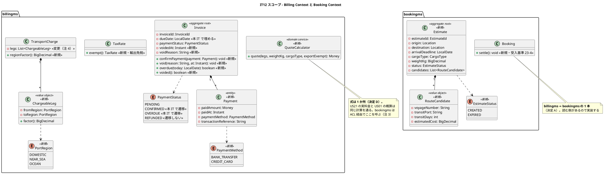
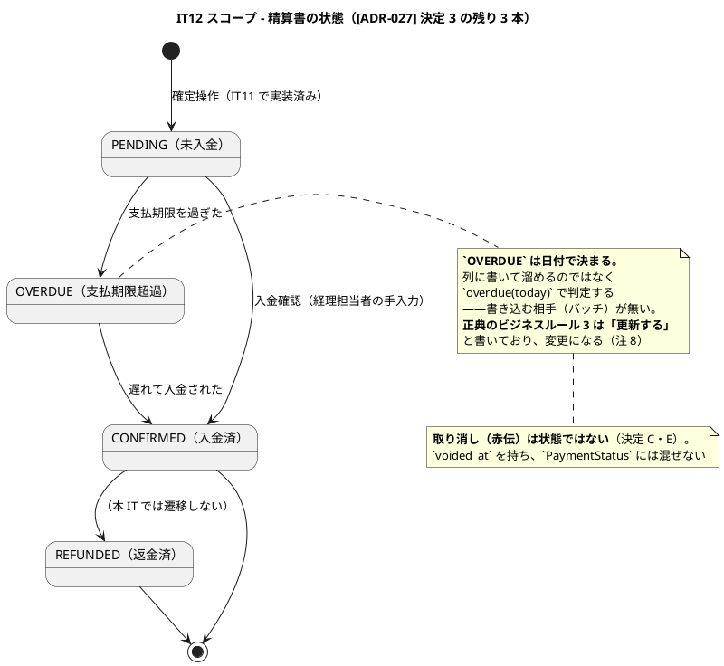
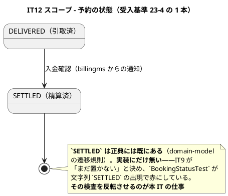
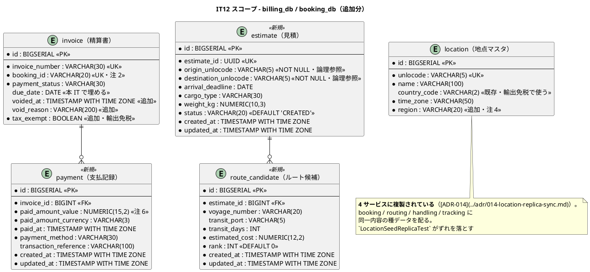
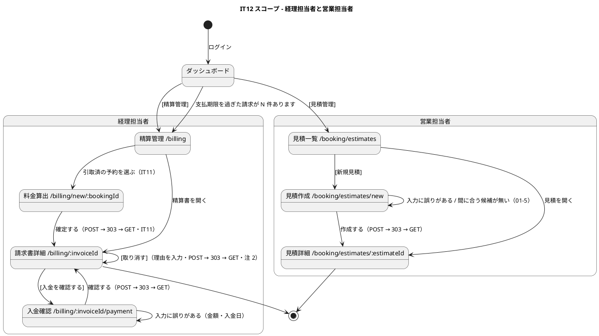

# イテレーション 12 計画

| 項目 | 内容 |
| :--- | :--- |
| イテレーション | IT12 |
| 期間 | 2026-10-19 〜 2026-11-01（2 週間） |
| 対象ストーリー | US23（精算を処理する）・US01（輸送見積を作成する）＋ **US21 の未達 2 件（距離・輸出免税）** |
| 計画 SP | **11**（US23 = 3・US01 = 5・距離 = 2・輸出免税 = 1） |
| 局面 | **終盤（5 本目・最終）／アウトサイドイン**（[開発戦略](development_strategy.md)） |
| 前提 | [IT11 完了報告書](iteration_report-11.md)・[IT11 ふりかえり](retrospective-11.md) |
| リリース | [Release 2.0](release_plan.md)（IT11〜IT12）——**予約から精算までが繋がる最後の IT** |

## 局面とアプローチ

**終盤（5 本目・最終）／アウトサイドイン**（[開発戦略](development_strategy.md)）。

業務シナリオ（精算書を出す → 入金を確認する → 予約が精算済になる）を受け入れテストに
翻訳してから、画面・API・ドメインの順に降りる。理由は 2 つある。

1. **US23 は「一気通貫が閉じる」ストーリーである。** 予約 → 経路 → 荷役 → 通関 → 引取 →
   料金算出（IT11）と繋いできた鎖の最後の輪であり、内側から積むと繋ぎ目が最後に残る
2. **US01（見積）は入口に戻るストーリーである。** 営業担当者が最初に触る画面でありながら、
   料金の式（IT11 で決めた）に依存するため最後に置いた。**画面から入らないと、見積が
   「実料金と違う数字を出す機械」になる**

## ゴール

**出した請求の入金が確認でき、予約が精算済で閉じる。そして、その料金を先に見積もれる。**

IT11 で運賃を計算できるようになったが、**発行した請求書は `PENDING` のまま動かない**。
入金を確認する手段が無く、予約は引取済のまま残る。US23 でこの 1 本を通す。

US01 で入口に戻る。営業担当者は荷主に「いくらで何日か」を答えられるようになる——
**IT11 で決めた式をそのまま使う**ので、見積と実料金が別物になることはない。

> **IT11 で果たせなかった 2 件を、同じ IT で直す。** 距離を持たないこと（受入基準 21-2）と
> 輸出免税を扱っていないこと（[ADR-027](../adr/027-transport-charge-calculation.md) 決定 8）は、
> **US01 が同じ式を使う以上、見積にもそのまま伝染する**。見積を作ってから直すと、
> 直す場所が 2 か所になる。

## 前イテレーションからの反映

### ふりかえりの Try（[retrospective-11.md](retrospective-11.md)）

| # | Try | 本 IT での扱い |
| :--- | :--- | :--- |
| 1 | **Phase の完了を宣言する前に、その Phase のタスク表を 1 行ずつ読む** | **進め方に入れた。** IT11 は Phase 3.4 の「例外を trackingms から引く 4h」を実装しないまま Phase を完了扱いにした。**実装しなかった行は「完了」ではなく「送った」と書く** |
| 2 | **受入基準の「〜が表示される」は、項目を 1 つずつ画面と突き合わせる** | **DoD に入れた。** US01 の「経由港・所要日数・概算料金・航海番号」は 4 項目あり、**1 つ欠けても字面は満たす**。字面を満たしても根拠が片肺なら未達として記録する |
| 3 | **リトライで通ったテストは、その IT のうちに原因を見る** | **返済枠 0.1 に据えた（最優先）。** `tracking.spec.ts` は 4 回連続で初回失敗している。**5 回目を作らない** |
| 4 | **編集したら、その場で結果を確かめる**（grep で 1 行見る） | **進め方に入れた。** IT11 は 2 回、適用されていない編集を「適用した」と思って進めた |
| 5 | **「決めること」に「持っているか」を入れる** | **本 IT の「着手前に決めること」に列を足した。** 下表の「データはあるか」列。距離は着手後に「持っていない」と分かった |
| 6 | 着手前の整合性検証を続ける | 本計画で実施（ステップ 3・4） |
| 7 | キャプチャの目視を続ける | **クローズの DoD。** 3 IT 連続で欠陥を見せている |
| 8 | **ADR のコンプライアンス表に「その決定が破られたら何が起きるか」を書く** | **成功基準 6 に据えた。** IT11 は決定 4 の検査が明細の不変性だけを見ており、**金額そのものを一度も見ていなかった**。本 IT の ADR-028 は決定ごとに「破られたら何が起きるか」→「それが起きないことの検査」の順に書く |
| 9 | **新しい BC を立ち上げたら、他 BC との規律の差分を数える** | **Phase 0 のタスクに入れた。** billingms だけ `@Transactional` が 0 件だった。本 IT で `Estimate` を bookingms に足すため、**同じ差分の数え直しを US01 の側でも行う** |
| 10 | レビューは 5 視点そろうまで待つ | クローズの DoD |

### 引き継ぎ（返済枠・SP 対象外）

IT11 の引き継ぎは **12 件・35h**。本 IT はスコープが 11 SP でベロシティ（8〜10 SP）を
超えるため、**35h をそのまま持つと必ず溢れる**。

**先に落とす順序を決める**（[バッファ消費ルール](release_plan.md)）。判断基準は
「次の IT で対象が増えるか」——増えるものを先に返す（[IT9 の学び](retrospective-9.md)）。

| # | 内容 | 見積 | 出典 | 扱い |
| :--- | :--- | :--- | :--- | :--- |
| 0.1 | **`tracking.spec.ts` の 2 件が毎回初回失敗する原因を直す**。tester の見立ては共有モック状態の持ち越し。単独実行で切り分ける | 4h | Try 3 | **本 IT（最優先）** |
| 0.2 | **モックと本物の式が 2 か所で食い違う**（負値の丸め・重量係数の精度） | 3h | programmer | **本 IT。** 式を変える IT なので、放置すると食い違いが 3 か所に増える |
| 0.3 | **表示名の写しが 4 か所**（サーバ 3・フロント 1） | 4h | programmer | **本 IT。** `EstimateStatus`・`PaymentMethod` を足すため、写しが 6 か所に増える |
| 0.4 | **ロール検査をエンドポイント一覧から回す**。いま `/unbilled` 1 本のみ | 3h | tester | **本 IT。** US23・US01 でエンドポイントが 6 本増える |
| 0.5 | **二重発行の競合が 500**（`DuplicateKeyException` 未捕捉） | 2h | programmer | **本 IT。** US23 で入金確認の二重送信が同じ形で起きる |
| 0.6 | **重量係数の「境目」が境目を判別していない**（99/100/101 で書く） | 1h | tester | **本 IT。** 係数を変える IT である |
| 0.7 | **実バックエンドで料金を 1 円も計算していない**。`unbilled` → `calculations` → `calculate` → `invoices` を 1 本通す | 4h | tester | **本 IT。** US23 の実環境シナリオがこの続きになる |
| 0.8 | **消費者側の契約テストが経路をリテラルで持つ** | 2h | tester | **本 IT。** Phase 4.2 で ACL をもう 1 本足すため、**放置すると同じ欠陥が複製される**（「対象が増えるものを先に返す」） |
| **小計（本 IT）** | | **23h** | | |
| — | **例外の実績を trackingms から引く**（21-6 の片肺） | 4h | Problem 1 | **IT13 へ送る**（下記） |
| — | **`cancellation` を本番の変換器に通す** | 2h | tester | **IT13 へ送る** |
| — | **`billable()` の N+1** | 3h | architect | **IT13 へ送る** |
| — | **「請求書」と「精算書」の混在** | 3h | writer | **IT13 へ送る** |
| **小計（IT13 へ）** | | **12h** | | |

> **落とした 4 件のうち、増えるのは 1 件だけである。** 「請求書 / 精算書」の混在は US23 で
> 画面が増えるぶん広がる（3h → 4h 程度）。残る 3 件は対象が増えない。
> **「例外を trackingms から引く」を送るのは 2 度目である**——IT11 で落として IT12 でも
> 落とす。3 度目は無い形にするため、**IT13 の計画に SP 付きで載せる**（下記「IT13 への申し送り」）。

### IT11 から「着手前に決めること」として引き継いだもの

**「データはあるか」列は Try 5 である。** 計算に使う値が実際に存在するかを、着手前に確かめる。

| # | 決めること | データはあるか | 本 IT での決定 |
| :--- | :--- | :--- | :--- |
| A | **`CargoDeliveredEvent` を実装するか** | — | **実装しない。** 精算の起点は経理担当者の操作であり（[ADR-027](../adr/027-transport-charge-calculation.md) 決定 5）、US23 の受入基準にも自動起票は無い。**代わりに逆向きの 1 本を実装する**——入金確認で予約を「精算済」にするには billingms → bookingms の通知が要る（受入基準 23-4）。**こちらは読む側がある**（注 1） |
| B | **`payment` テーブルを作るか** | 論理モデルにあり・物理は未作成（[data-model.md](../design/data-model.md) 783-792・1105） | **作る。** US23 で支払いを扱うため、読む側ができる。**`invoice` に列を足さない**——発行した請求書の金額は動かない（決定 4）ので、入金は別の表に持つ |
| C | **発行した請求書の訂正をどう扱うか** | — | **取り消して出し直す（赤伝）。** 経理担当者の申し送り②。**`invoice` を書き換えない**——`voided_at` / `void_reason` を足し、出し直しは新しい請求番号で発行する（注 2） |
| D | **見積（US01）と実料金（US21）の突き合わせ** | `estimate` / `route_candidate` は論理モデルにあり・物理は未作成 | **同じ式を使う。** 見積は「区間数 × 重量 × 貨物種別」を候補ルートの区間数で計算する。**式を 2 つ持たない**——持てば必ずずれる（[IT11 返済枠 0.2](#引き継ぎ返済枠sp-対象外) が現にそうなっている）。**式の在り処は billingms** で、bookingms が ACL 経由で試算を問う（注 3） |
| E | **「取消済み」を `PaymentStatus` に混ぜるか** | — | **混ぜない（別列）。** 決定 3 で `DRAFT` を混ぜなかったのと同じ理由である。`PaymentStatus` は支払いの状態であり、取り消しは請求書そのものの状態である。C の `voided_at` で表す |
| F | **距離をどう扱うか** | **`location.country_code` はある。地域区分は無い**（[data-model.md](../design/data-model.md) 387-396） | **港に地域区分（`region`）を足し、区間ごとに係数を変える。** 緯度経度は全港の座標整備が要り（ADR-027 決定 1 の不採用理由）、いまも変わらない。**区分なら 1 列で足りる**（注 4）。経理担当者の「国内の積み替え 1 回と太平洋横断が同額」に応える |
| G | **輸出免税をいつ入れるか** | **`location.country_code` がある**（新しい列は要らない） | **本 IT で入れる。** 出発地と目的地の国が異なる輸送は消費税を免除する。**いまは一律 10% で、これはキャンペーンではなく誤りである**（IT11 経理担当者レビュー） |

## 対象ストーリーと受入基準

### US23: 精算を処理する（3 SP）

**として**: 経理担当者
**したい**: 確定した輸送料金をもとに精算書を発行し、荷主への通知・入金確認・精算完了処理を行いたい
**なぜなら**: 精算業務を一元管理し、入金状況を追跡して確実に精算を完了できるからだ
**対応 UC**: UC18

| # | 受入基準 | 本 IT での扱い |
| :--- | :--- | :--- |
| 23-1 | 「確定」状態の輸送料金をもとに精算書（請求番号・請求金額・支払い期限）を発行できる | **満たす。** 発行自体は IT11 で実装済み（`PENDING`）。**本 IT で `due_date` を埋める**——列はあるが IT11 は書いていない |
| 23-2 | 精算書が荷主にメール通知される | **代替で満たす（未実装を明示）。** メールの仕組みは全サービスに無い。**画面が「送られていないので営業から伝えてください」と言う**——US28-6（誤配通知）・US20 と同じ形（注 5） |
| 23-3 | 決済機関との連携により入金確認ができる | **代替で満たす（未実装を明示）。** `PaymentGatewayPort` は設計にあるが（[domain-model.md](../design/domain-model.md) 1551）、**接続先が無い**。経理担当者が入金日・金額・方法・参照番号を手入力する（注 5） |
| 23-4 | 入金確認後、精算状態が「精算済」に更新され予約状態も「精算済」になる | **満たす。** billingms の `Invoice` を `CONFIRMED` に、**bookingms の予約を `SETTLED` に**（決定 A の逆向きの 1 本）。`SETTLED` は正典にあり実装に無い——`BookingStatusTest` の禁止検査を反転させる |
| 23-5 | 支払い期限超過時、経理担当者に未払い通知が送信される | **代替で満たす（未実装を明示）。** ダッシュボードに「支払期限を過ぎた請求が N 件あります」を出し、そこから対象一覧へ辿れる（[横断規約](release_plan.md)）。**気づく手段は次の行動へ繋ぐ** |

> **受入基準 5 件のうち 3 件が代替である。** 字面は満たすが、外部連携（メール・決済機関）は
> 実装しない。**「代替で満たす」と「満たす」を報告書で区別する**——IT11 の 21-6 は
> 「入力はできる」で満たしたことにして、根拠が片肺のまま残った。

### US01: 輸送見積を作成する（5 SP）

**として**: 営業担当者
**したい**: 荷主の輸送要件（出発地・目的地・希望期限・貨物種別・重量）を入力し、輸送料金と所要日数の見積を作成したい
**なぜなら**: 荷主が予算と納期を事前に把握でき、予約決定を迅速に行えるからだ
**対応 UC**: UC01

| # | 受入基準 | 本 IT での扱い |
| :--- | :--- | :--- |
| 01-1 | 出発地・目的地・希望期限・貨物種別・重量を入力できる | **満たす。** 5 項目すべて |
| 01-2 | 航海スケジュール情報をもとにルート概算候補が表示される | **満たす。** routingms の既存の経路探索を使う（bookingms → routingms の ACL は US09 で実装済み） |
| 01-3 | ルート候補ごとに「経由港・所要日数・概算料金・航海番号」が表示される | **満たす。4 項目を 1 つずつ突き合わせる**（Try 2）。概算料金は US21 と同じ式（決定 D） |
| 01-4 | 見積情報が保存され、見積番号が発行される | **満たす。** `estimate` / `route_candidate` を作る |
| 01-5 | 希望期限に間に合うルートが存在しない場合、その旨が通知される | **満たす。** 画面に出す。**「候補が 0 件」と「間に合う候補が 0 件」を区別する**——後者は「最短でも N 日超過します」と出す（IT10 の誤配通知と同じ形） |
| 01-6 | 危険物が含まれる場合、危険物申告情報の入力フォームが表示される | **満たす。** 貨物種別が `HAZARDOUS` のとき。既存の危険物申告（US05「危険物・冷凍貨物の予約を登録する」）の項目を踏襲する |
| 01-7 | **（US04 の未達）見積との整合確認。** 予約登録時に、対応する見積の内容と食い違わないことを確かめる | **満たす。** IT2 で「US01・IT12 で満たす」と記録した未達である（[release_plan.md](release_plan.md) 446）。**Release 2.0 を閉じる前にここで閉じる** |

### US21 の未達返済: 距離（2 SP）・輸出免税（1 SP）

| # | 内容 | 受入基準の出所 |
| :--- | :--- | :--- |
| 21-2' | **区間ごとに地域区分（国内 / 近海 / 遠洋）で係数を変える。** 画面の内訳に区分と係数を出す | US21 受入基準 21-2（距離）・IT11 経理担当者レビュー |
| 08-1' | **出発地と目的地の国が異なる輸送は消費税を免除する**（輸出免税）。請求書に税区分を出す | [ADR-027](../adr/027-transport-charge-calculation.md) 決定 8・IT11 経理担当者レビュー |

## 設計

### ドメインモデル図（本 IT のスコープ）

### 状態遷移図

### ER 図（本 IT のスコープ）

### 画面遷移図

> **状態軸の到達性**（[横断規約](release_plan.md)）。ダッシュボードの「支払期限を過ぎた
> 請求が N 件あります」から対象一覧へ辿れる——**未払い通知のメールが無い以上、経理担当者は
> 他に気づく手段を持たない**（受入基準 23-5 の代替）。

## タスク

### Phase 0: 返済枠（Day 1-3・23h）

| # | 内容 | 見積 |
| :--- | :--- | :--- |
| 0.1 | `tracking.spec.ts` の初回失敗の原因を直す（単独実行で切り分け） | 4h |
| 0.2 | モックと本物の式の食い違いを消す（負値の丸め・重量係数の精度） | 3h |
| 0.3 | 表示名の写しを 1 か所に集約する（サーバ 3・フロント 1） | 4h |
| 0.4 | ロール検査をエンドポイント一覧から回す | 3h |
| 0.5 | 二重発行の競合を 409 で返す（`DuplicateKeyException`） | 2h |
| 0.6 | 重量係数の境目を 99 / 100 / 101 で書く | 1h |
| 0.7 | 実バックエンドで料金を 1 本通す（`unbilled` → `invoices`） | 4h |
| 0.8 | 契約テストの経路をリテラルから外す（Phase 4.2 で複製しないため） | 2h |
| 0.8 | **他 BC との規律の差分を数える**（Try 9・`@Transactional` / 例外 / N+1） | — |

### Phase 1: 受け入れテストと ADR（Day 3-4）

| # | 内容 | 見積 |
| :--- | :--- | :--- |
| 1.1 | デモ項目を E2E に翻訳して赤を確認する（精算 1 本・見積 1 本） | 4h |
| 1.2 | **ADR-028（精算処理と見積）を書く。** 決定ごとに「破られたら何が起きるか」→「それが起きないことの検査」の順（Try 8）。**bookingms → billingms の試算 ACL（新しい結合方向）を決定として起票する**——終盤で新しい結合方式を発明しない（[開発戦略](development_strategy.md)）。見積番号の採番方式（注 13）も含める | 7h |
| 1.3 | ADR-027 に**距離・輸出免税の決定を追補する**（決定 1・8 の改訂） | 3h |

### Phase 2: 距離と輸出免税（Day 4-6・US21 の未達返済）

| # | 内容 | 見積 |
| :--- | :--- | :--- |
| 2.1 | `location.region` を足し、**4 サービスへ種データを配る**（booking / routing / handling / tracking）（`LocationSeedReplicaTest` で確かめる） | 5h |
| 2.2 | `PortRegion`・`ChargeableLeg` を足し、区間係数を計算する | 4h |
| 2.3 | `TaxRate.exempt()` と `invoice.tax_exempt`。**国が異なれば免税** | 4h |
| 2.4 | 画面の内訳に区分・係数・税区分を出す。**なぜその金額かが読める**（ADR-027 決定 1） | 3h |

### Phase 3: 精算処理（US23・Day 6-9）

| # | 内容 | 見積 |
| :--- | :--- | :--- |
| 3.1 | `payment` テーブルと `Payment` エンティティ・`PaymentMethod` | 4h |
| 3.2 | `Invoice.confirmPayment` / `overdue(today)` / `void(reason)`。**取り消しは状態に混ぜない** | 5h |
| 3.3 | 入金確認の画面と API（`POST /api/v1/billing/{bookingId}/settlement`） | 5h |
| 3.4 | **billingms → bookingms の通知**（予約を `SETTLED` に・受入基準 23-4）。**`BookingStatusTest` / `status-labels.test.ts` の「`SETTLED` を置かない」検査を反転させる**（IT9 タスク 4.4 の裏返し）。値を扱う場所すべてを回る検査を置き、**遷移を壊すと赤になること**を確かめる | 7h |
| 3.5 | `due_date` を発行時に埋める（発行日 + 30 日）。**期限超過の件数をダッシュボードに出す** | 3h |
| 3.6 | 代替の明示（23-2・23-3・23-5 を画面に書く） | 2h |
| 3.7 | **請求書の印刷**（経理担当者の申し送り③・優先度 高）。印刷用スタイルと印刷ボタン。**無いと数字を書き写して表計算で作ることになり、システムの金額と実際に送った請求書が食い違い始める** | 2h |

### Phase 4: 見積（US01・Day 9-12）

| # | 内容 | 見積 |
| :--- | :--- | :--- |
| 4.1 | `Estimate` / `RouteCandidate` / `EstimateStatus` と `estimate` / `route_candidate` | 5h |
| 4.2 | **料金試算の ACL**（bookingms → billingms・注 3）。**式は billingms の 1 か所**。過去 IT で確立した 4 点をそのまま踏む——(a) `application/port/` に `〜Finder`、(b) `infrastructure/<相手>/` に `Rest〜`、(c) 相手の型を出さない専用 Response record、(d) `shared/testFixtures/.../contract/` の契約フィクスチャ + 消費者/プロバイダ 2 本。**契約の経路はリテラルで持たない**（返済枠 0.8 で直した形を最初から使う）。サービス間認可は `system:bookingms` を `X-User-Id` に載せ、billingms 側で `TRUSTED_SERVICE_PRINCIPALS` に足す（`authorizationCalledRule` が強制する） | 7h |
| 4.3 | ルート候補を routingms から引く（既存 ACL の再利用） | 3h |
| 4.4 | 見積の 3 画面。**01-3 の 4 項目を 1 つずつ突き合わせる**（Try 2） | 6h |
| 4.5 | 間に合う候補が無いときの表示（01-5）・危険物申告フォーム（01-6） | 4h |
| 4.6 | **ナビゲーション整合の 4 点を揃える**（絶対項目）。(a) ui_design のナビ構成表、(b) `navigation.ts` の見積管理を **`available: false` → `true`**、(c) 営業ダッシュボードに見積の action・経理ダッシュボードに「支払期限を過ぎた請求」の action、(d) **`available: false` のまま残った項目を検出する検査**を `navigation.test.ts` に足す——いまの検査は重複・未定義ロール・到達性しか見ておらず、**ルートガードの検査では navbar の表示漏れを捕まえられない** | 3h |

### Phase 5: 実環境（Day 12-13）

| # | 内容 | 見積 |
| :--- | :--- | :--- |
| 5.1 | kind クラスタへ反映（**images → rollout:image → rollout:restart の 3 つを踏む**） | 3h |
| 5.2 | 実環境で一気通貫を通す（**予約 → 経路 → 荷役 → 通関 → 引取 → 料金 → 入金 → 精算済**） | 4h |

### Phase 6: マニュアルと計画への差し戻し（Day 13-14）

| # | 内容 | 見積 |
| :--- | :--- | :--- |
| 6.1 | **マニュアル 12 章に入金確認・取り消し・印刷を追記**。13 章「見積管理」を新設。**基準運賃 50,000 円が暫定値であることを 1 行書く**（いまは ADR にしか無い）。**キャプチャを撮り直す**（3 IT 連続で欠陥を見せている） | 6h |
| 6.2 | **残った設計ドキュメントへの反映を確かめる**（注 1〜13）。**あわせて `development_strategy.md` / `release_plan.md` の IT12 の SP を 11 に直す**（成功基準 7）。**原則は各 Phase の同じ変更の中で反映する**（[開発戦略](development_strategy.md) の「正典 3 点を同一変更で更新する」）——ここは取りこぼしの検査であって、まとめて書く場ではない | 4h |
| 6.3 | **JIG / jig-erd を再生成し、設計と実装の乖離を差分で見る**（[開発戦略](development_strategy.md)） | 2h |
| 6.4 | Release 2.0 完了報告書の下準備 | 2h |

### 見積もり合計

| Phase | 見積 |
| :--- | :--- |
| Phase 0（返済枠・SP 対象外） | 23h |
| Phase 1 | 14h |
| Phase 2（距離・免税 = 3 SP） | 16h |
| Phase 3（US23 = 3 SP） | 28h |
| Phase 4（US01 = 5 SP） | 28h |
| Phase 5 | 7h |
| Phase 6 | 14h |
| **合計** | **130h** |

### 超過をどう吸収するか

**11 SP・130h は、ベロシティ（8〜10 SP・[release_plan.md](release_plan.md) の実績）を
3 SP 超える。** これを曖昧にしない。

| 事実 | 数字 |
| :--- | :--- |
| 本 IT の計画 | 11 SP（US23 3・US01 5・距離 2・免税 1） |
| 開発戦略・リリース計画の IT12 | **8 SP**（US23・US01 のみ） |
| スケジュールバッファの残り | **1 SP** |
| 不足 | **2 SP** |

**超過 3 SP は新しい機能ではなく、US21（IT11・7 SP）の未達の再実施である。**
したがって**リリース全体の SP は増えない**——Release 2.0 の 17 SP に対し、
US21 の 7 SP のうち 3 SP 相当を IT12 で作り直す形になる。**実績として二重に数えない**
（[release_plan.md](release_plan.md) の進捗表に「うち 3 SP は US21 の再実施」と注記する。Phase 6.2）。

**それでも 130h は入りきらない可能性が高い。** 落とす順序を先に決める
（[バッファ消費ルール](release_plan.md)——フィーチャバッファを先に消費し、
スケジュールバッファは最後の手段）。

| 順 | 落とすもの | 時間 | 理由 |
| :--- | :--- | :--- | :--- |
| 1 | Phase 0.3（表示名の写しを 1 か所に） | 4h | 対象は増えるが、増えても壊れ方は「英字が出る」に留まる |
| 2 | Phase 4.5（01-5 の日数超過表示・01-6 の危険物フォーム） | 4h | **US01 の受入基準 2 件を未達として記録する**（字面をごまかさない） |
| 3 | Phase 2.4（内訳の表示） | 3h | 金額は正しくなるが「なぜその金額か」が読めない。ADR-027 決定 1 の趣旨に反するため 3 番目 |
| 4 | Phase 4 の見積を「保存と一覧」までに縮める | 8h | **US01 を分割し、残りを IT13 へ送る** |

**Phase 3（US23）と Phase 2.1-2.3（距離・免税）は落とさない。** 前者は Release 2.0 の
閉じであり、後者は**誤りの修正**だからである。

**落としたら「完了」ではなく「送った」と書く**（Try 1）。IT11 は 4h のタスクを黙って落とした。

## スケジュール

| Day | 内容 |
| :--- | :--- |
| 1-3 | Phase 0（返済枠 21h・独立コミット） |
| 3-4 | Phase 1（受け入れテスト・ADR-028・ADR-027 追補） |
| 4-6 | Phase 2（距離・輸出免税） |
| 6-9 | Phase 3（US23 精算処理） |
| 9-12 | Phase 4（US01 見積） |
| 12-13 | Phase 5（実環境・一気通貫） |
| 13-14 | Phase 6（マニュアル・設計反映） |

## 成功基準

| # | 基準 |
| :--- | :--- |
| 1 | US23 の受入基準 5 件・US01 の受入基準 6 件が満たされる（**代替で満たすものは「代替」と記録する**） |
| 2 | 距離（地域区分）と輸出免税が入り、**IT11 の未達 2 件が閉じる** |
| 3 | 実環境で**予約 → 精算済**の一気通貫が 1 本通る（Phase 5.2） |
| 4 | 返済枠 7 件（21h）を Day 3 までに独立コミットで消化する。**`tracking.spec.ts` の 5 回目を作らない** |
| 5 | 料金の式が **1 か所**にある（US21 と US01 が同じ計算を通ることを検査で固定する） |
| 6 | **ADR-028 の決定ごとに「破られたら何が起きるか」と「それが起きないことの検査」が対応する**（Try 8）。検査は決定の全体を見る |
| 7 | **`development_strategy.md`（IT12 = 8 SP）と `release_plan.md`（IT 一覧・進捗表）を 11 SP に更新し、うち 3 SP が US21 の再実施であることを注記する**——3 つのドキュメントが違う数字を持ったまま IT を終えない |
| 8 | 全テスト緑・SonarQube Quality Gate PASS・CI 緑・`TZ=UTC` 緑 |

## リスク

| # | リスク | 対策 |
| :--- | :--- | :--- |
| 1 | **11 SP はベロシティを 3 SP 超える。** スケジュールバッファは 1 SP しか残っておらず、2 SP が行き場を持たない | [超過をどう吸収するか](#超過をどう吸収するか)に落とす順序を 4 段で先に決めた。**超過分は US21 の再実施であり、リリース全体の SP は増えない**——進捗表に注記する。落としたら「送った」と書く |
| 2 | **`location` に列を足すと 4 サービスに種データを配る**（booking / routing / handling / tracking・[ADR-014](../adr/014-location-replica-sync.md)）。1 つ漏れると起動時に落ちる | `LocationSeedReplicaTest`（shared）が shape・seed の完全一致で落とす。**Phase 2.1 を Phase 2 の先頭に置く**。**マイグレーションは文字列順で読まれる**（bookingms は既に `V10` があり `V10 → V2 → V3` の順になる）ため、版番号ではなく `CREATE TABLE` 本体を直す |
| 3 | **bookingms → billingms の ACL を足すと、サービス間の呼び出しが双方向になる**（billingms → bookingms は IT11 で実装済み）。**試算が `CalculateChargeUseCase` を再利用した瞬間に bookingms → billingms → bookingms の同期往復が成立し、ワーカースレッドが相互に待つ** | **役割を分ける**（注 3）。billingms → bookingms は「読み取り」、bookingms → billingms は「試算（引数だけで完結し、外部を引かない）」。**「循環しないこと」は ArchUnit では表せない**——HTTP の向きはリテラル文字列で構造に現れないため、代わりに「**試算のユースケースが `BillingSnapshotFinder` と `RestClient` に依存しない**」という層内依存禁止ルールで固定する（`layerRules` と同型）。**ADR-028 の決定として起票してから実装する**（[開発戦略](development_strategy.md)「終盤で新しい結合方式を発明しない」） |
| 4 | **`SETTLED` は IT9 が「置かない」と決め、検査で固定してある**。足した瞬間に `BookingStatusTest`・`status-labels.test.ts` が無関係な赤を出す | Phase 3.4 で**検査を反転させる**（禁止 → 遷移が正しいこと）。**壊すと赤になること**まで確かめる（[開発戦略](development_strategy.md) の安全装置の規約） |
| 5 | **代替が 3 件あり、「実装した」と読まれる** | 画面に**未実装であることを書く**（IT9・IT10 と同じ形）。報告書で「代替で満たす」と「満たす」を分ける |
| 7 | **赤伝を入れると [ADR-027](../adr/027-transport-charge-calculation.md) 決定 4（発行後の金額は動かない）が最も揺れる**（IT11 レビューの懸念）。取り消し・出し直しの経路で金額を作り直す誘惑がある | **決定 4 の検査を構造で置く**——`InvoiceMapper` に UPDATE を書かないこと・取り消しは `voided_at` のみを書くことを、**壊すと赤になる形**で固定する。IT11 の検査は明細の不変性しか見ていなかった |
| 6 | **輸出免税は既に発行済みの請求書には遡らない** | 復元では検査しない（[新しい不変条件は既存行を壊す](retrospective-9.md)）。`tax_exempt` は既定 `false` で、**新規発行時のみ判定する** |

## 設計への反映が必要な箇所（注）

| 注 | 内容 | 反映先 |
| :--- | :--- | :--- |
| 1 | **`CargoDeliveredEvent` は実装しない**（決定 A）。代わりに billingms → bookingms の精算完了通知を実装する。`InvoiceCreatedEvent`（通知システム宛）も実装しない | [architecture_backend.md](../design/architecture_backend.md) 617-618・[domain-model.md](../design/domain-model.md) 1355-1358 |
| 2 | **請求書の取り消し（赤伝）**。`voided_at` / `void_reason` を足す。`booking_id` の UNIQUE 制約は**出し直しを妨げる**ため、**取り消し済みを除いた部分 UNIQUE に変える**。**2 つ落とし穴がある**——(a) いまは列インライン `UNIQUE` で制約名が自動生成のため、DROP の書き方が H2 と PostgreSQL で違う。**H2 は部分 UNIQUE の `WHERE` を解釈しない公算が高く、CI は緑のままローカル起動だけが落ちる**（方言差は両方向に起きる）。着手時に実測する。(b) `existsForBooking` の `COUNT(*)` が**取り消し済みも数える**ため、制約を変えてもアプリ側が先に弾く。`voided_at IS NULL` を足す | [data-model.md](../design/data-model.md) 1055-1086・`InvoiceMapper.java:93` |
| 3 | **料金試算 ACL（bookingms → billingms）**。既存の ACL は billingms → bookingms のみで、方向が増える | [architecture_backend.md](../design/architecture_backend.md)・[domain-model.md](../design/domain-model.md) |
| 4 | **`location.region`（地域区分）を足す**。`PortRegion` は DOMESTIC / NEAR_SEA / OCEAN。区間係数は区分の組で決まる | [data-model.md](../design/data-model.md) 387-396・[ADR-010](../adr/010-location-master-shape.md)・[ADR-014](../adr/014-location-replica-sync.md) |
| 5 | **メール通知・決済機関連携は実装しない**（代替）。`PaymentGatewayPort` は設計に残すが本 IT では起こさない | [domain-model.md](../design/domain-model.md) 1551・[architecture_backend.md](../design/architecture_backend.md) 331 |
| 6 | **`payment.paid_amount_value` の型**。論理モデルは `INTEGER` だが `invoice` 側は `NUMERIC(15,2)` に変更済み（IT11 の注 3）。**`NUMERIC(15,2)` に揃える** | [data-model.md](../design/data-model.md) 783-792 |
| 7 | **入金確認画面（`/billing/:invoiceId/payment`）と見積 3 画面**。ui_design.md に見積の行はあるが（114-116）、入金確認の定義は無い。**全体画面遷移図にダッシュボード → 見積管理の遷移も足す** | [ui_design.md](../design/ui_design.md) 134-136・269-276 |
| 8 | **`OVERDUE` を永続化しない**。正典のビジネスルール 3 は「支払期限を超過したら `PaymentStatus` を `OVERDUE` に更新する」だが、**更新する相手（バッチ）が無い**。日付から判定する形に変える | [domain-model.md](../design/domain-model.md) 1360 |
| 9 | **新しいドメイン要素を要素表に足す**。`QuoteCalculator`（ドメインサービス。routingms の `TransitPathFinder` と同じ形）・`ChargeableLeg`・`PortRegion`・`TaxRate.exempt()`・`TransportCharge.regionFactor()`・`Invoice.voidedAt` / `void_()` / `overdue()` / `voided()`。**IT1〜IT3 で繰り返したドリフトの再発を防ぐ** | [domain-model.md](../design/domain-model.md) 1219-1353 |
| 10 | **`invoice.tax_exempt`（BOOLEAN）を足す**。現行は `tax_rate` / `tax_amount` のみ | [data-model.md](../design/data-model.md) 1055-1086 |
| 11 | **`estimate` / `route_candidate` / `payment` の物理定義を書く**。いまは論理モデルにしか無い | [data-model.md](../design/data-model.md) 1053-1106 |
| 12 | **bookingms の API 一覧に `/api/v1/estimates` を足す** | [architecture_backend.md](../design/architecture_backend.md) 860-1000 |
| 13 | **見積番号の採番方式を決める**。`InvoiceId` は `INV-YYYY` + 6 桁の人が読める採番（[ADR-011](../adr/011-invoice-numbering.md)）だが、`EstimateId` は正典で UUID。**受入基準 01-4 は「見積番号が発行される」であり、人が読める番号が要る** | [domain-model.md](../design/domain-model.md) 1339・ADR-028 |

## デモ項目

| # | 項目 | 対応する検査 |
| :--- | :--- | :--- |
| 1 | 経理担当者が請求書を開き、入金を確認すると「入金済」になる | `billing.spec.ts`（新規） |
| 2 | 入金確認後、**予約が「精算済」になっている** | 同上（画面をまたぐ 1 本） |
| 3 | 支払期限を過ぎた請求がダッシュボードに件数で出て、そこから一覧へ辿れる | 同上 |
| 4 | 請求書を取り消し、**新しい請求番号で出し直せる** | 同上 |
| 5 | 営業担当者が見積を作ると、**経由港・所要日数・概算料金・航海番号**が候補ごとに出る | `estimate.spec.ts`（新規・4 項目を個別に確かめる） |
| 6 | 期限に間に合う候補が無いとき、**何日超過するか**が出る | 同上 |
| 7 | 危険物を選ぶと危険物申告フォームが出る | 同上 |
| 8 | **東京 → 横浜と東京 → ロサンゼルスの金額が違う**（地域区分） | `charge.spec.ts`・単体 |
| 9 | **国際輸送の請求書に消費税が付かない**（輸出免税）。税区分が画面に出る | 同上 |
| 10 | 見積の概算料金と、同じ条件の実料金が**一致する**（式が 1 か所） | 統合テスト |
| 11 | 請求書を印刷できる（**画面の数字がそのまま紙になる**） | `billing.spec.ts` |
| 12 | 営業担当者の navbar とダッシュボードから見積管理へ行ける（**`available: false` のままでない**） | `navigation.test.ts` + ルートガードを通る検査 |
| 13 | 経理担当者は見積管理を開けない / 営業担当者は入金確認を開けない | 同上 |
| 14 | 予約登録時に、対応する見積との食い違いが検出される（US04 の未達・01-7） | `estimate.spec.ts` |

## DoD（完了の定義）

- [ ] US23 の受入基準 5 件・US01 の受入基準 6 件を、**1 項目ずつ画面と突き合わせた**（Try 2）
- [ ] **「代替で満たす」ものを「満たす」と書いていない**（23-2・23-3・23-5）
- [ ] 距離（地域区分）・輸出免税が入り、IT11 の未達 2 件が閉じた
- [ ] デモ項目 14 件すべてに**対応する検査がある**（チェックを入れる前に検査名を書き出す）
- [ ] **Phase の完了を宣言する前に、その Phase のタスク表を 1 行ずつ読んだ**（Try 1）
- [ ] 料金の式が 1 か所にあり、US21 と US01 が同じ計算を通ることが検査で固定されている
- [ ] ADR-028 の決定ごとに「破られたら何が起きるか」と検査が対応する（Try 8）
- [ ] `BookingStatus` に値を足した箇所を、**扱う場所すべてを回る検査**で固定した
- [ ] `location.region` を 4 サービス（booking / routing / handling / tracking）に配り、`LocationSeedReplicaTest` が緑
- [ ] **マニュアル 12 章に入金確認・取り消しを追記し、13 章「見積管理」を新設**。キャプチャを生成 spec 経由で撮り直した
- [ ] **一気通貫 E2E（予約 → 経路 → 荷役 → 通関 → 引取 → 料金 → 入金 → 精算済）が緑**（[開発戦略](development_strategy.md) の終盤の完了条件）
- [ ] 実環境（kind）でも同じ 1 本を通した
- [ ] **JIG / jig-erd を再生成し、設計と実装の乖離を差分で確かめた**（[開発戦略](development_strategy.md)）
- [ ] 注 1〜13 の設計反映が済んでいる
- [ ] 全テスト緑・SonarQube PASS・CI 緑・`TZ=UTC` 緑
- [ ] 返済枠 8 件（23h）を消化し、**IT13 へ送る 4 件を計画に SP 付きで載せた**

## IT13 への申し送り

| # | 内容 | 見積 | 送るのは何度目か |
| :--- | :--- | :--- | :--- |
| 1 | **例外の実績を trackingms から引く**（21-6 の片肺） | 4h | **2 度目。IT13 の計画に SP 付きで載せる** |
| 3 | `cancellation` を本番の変換器に通す | 2h | 1 度目 |
| 4 | `billable()` の N+1 | 3h | 1 度目 |
| 5 | 「請求書」と「精算書」の混在（US23 で広がる） | 4h | 1 度目 |
| 6 | **請求書の検索**（請求番号・荷主名・予約番号）と発行月の絞り込み（経理担当者の申し送り③・優先度 **高**） | 4h | 1 度目。**本 IT に入れられなかった**——11 SP で既にベロシティ超過であり、印刷（食い違いを生む）を先に取った |
| 7 | 荷主へ連絡したことを残す場所（23-2 の代替の裏返し） | 3h | 1 度目 |

## 他 BC との規律の差分（Phase 0.8・Try 9 の実測）

`@Transactional` の有無ではなく、**書き方が 1 サービスだけ違っていた**。

| サービス | `@Transactional` を持つファイル | 独自例外 |
| :--- | :--- | :--- |
| bookingms | 4 | 2 |
| trackingms | 5 | 1 |
| handlingms | 3 | 1 |
| routingms | 1 | 0 |
| billingms | **1**（IT11 レビューで追加） | 2 |
| authms | 0 | 0 |

**billingms だけが完全修飾（`@org.springframework...Transactional`）で書いていた。**
他の 5 サービスはすべて import している。適用層に Spring の import を 1 つも
持たない形を守ろうとした跡だが、**完全修飾でも依存は同じ**であり、隠れただけである。
揃えた。US01 で `Estimate` を bookingms に足す側では、この差分は生じない。

## 進捗

| Phase | 状態 |
| :--- | :--- |
| Phase 0 | **完了**（0.1-0.6・0.8。0.7 は Phase 5 に寄せる——実バックエンドを起こす作業は Phase 5.2 の一気通貫と同じ段取りであり、2 度起こす意味が無い） |
| Phase 1 | **完了**（受け入れテストの赤を確認・ADR-028 起票・ADR-027 追補） |
| Phase 2 | **完了**（地域区分を 4 サービスへ・輸出免税・内訳の表示） |
| Phase 3 | **完了**（`payment`・入金確認・赤伝・支払期限・印刷・予約が精算済になる） |
| Phase 4 | **完了**（`Estimate` と 3 画面・試算 ACL・01-5・01-6・01-7・ナビ整合 4 点） |
| Phase 5 | **完了**（kind へ反映し、実環境 E2E 27 件が緑。**実環境でしか出ない設定漏れを 1 件見つけた**） |
| Phase 6 | **完了**（マニュアル 12 章改訂・13 章新設・設計反映・JIG / jig-erd 再生成） |

## 更新履歴

| 日付 | 内容 | 担当 |
| :--- | :--- | :--- |
| 2026-08-26 | 初版作成（`opening-iteration` ステップ 2） | - |

## 関連ドキュメント

- [リリース計画](release_plan.md)・[開発戦略](development_strategy.md)
- [IT11 完了報告書](iteration_report-11.md)・[IT11 ふりかえり](retrospective-11.md)・[IT11 レビュー](../review/イテレーション11_review_20260826.md)
- [ユーザーストーリー](../requirements/user_story.md)（US23・US01）
- [ドメインモデル](../design/domain-model.md)・[データモデル](../design/data-model.md)・[UI 設計](../design/ui_design.md)
- [ADR-027 輸送料金の算定規則](../adr/027-transport-charge-calculation.md)・[ADR-014 地点マスタの複製同期](../adr/014-location-replica-sync.md)・[ADR-010 地点マスタの形](../adr/010-location-master-shape.md)
