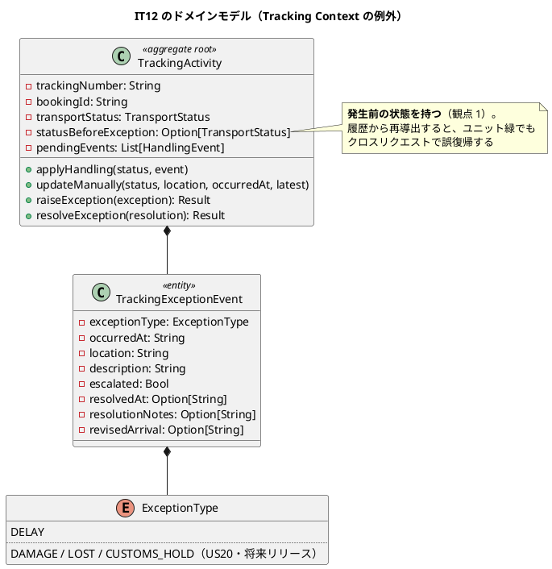
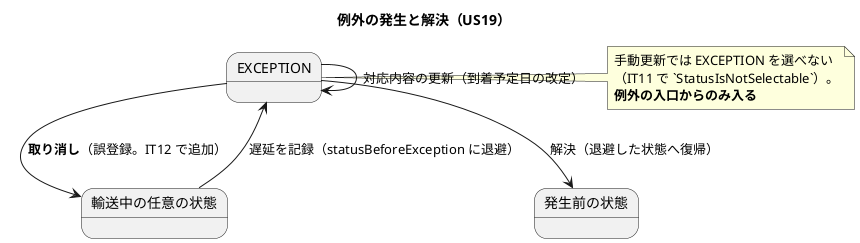

# IT12 イテレーション計画

## 概要

| 項目 | 内容 |
| :--- | :--- |
| 期間 | 2026-08-05 〜（2 週間相当） |
| 局面 | **終盤**（IT8-IT12）。アプローチは**アウトサイドイン** |
| 対象ストーリー | US19（8 SP）・TS18（3 SP） |
| 計画 SP | **11**（リリース計画の暫定配分どおり） |
| 位置づけ | **v1.0.0 の最終イテレーション** |

> **リリース計画では IT12 を「US19 + 予備」11 SP** としていました。
> IT11 のレビューが中 8 件・低 5 件を送っており、**予備を返済枠 TS18（3 SP）
> として計上**します。「余力があれば」と書きません——ADR-0008 が
> 3 イテレーション繰り越した前例があります。

---

## ゴール

### イテレーション終了時の達成状態

**輸送中に遅延が起きたとき、追跡管理者がそれを記録し、荷主が自分の画面で
「遅れている・いつ着く見込みか」を知れる**——ここまでが画面から通ります。

IT11 で業務フローは端から端まで繋がりました。IT12 は**そのフローが乱れたとき
どうするか**を扱います。例外は業務が最も助けを必要とする場面です。

### 成功基準

| # | 基準 | 検証 |
| :--: | :--- | :--- |
| 1 | 追跡管理者が遅延を記録でき、貨物状態が **EXCEPTION** になる | `TrackingExceptionHttpTest` |
| 2 | 記録した例外が**荷主の追跡画面に出る**（発生日時・場所・理由） | 同上 + `PublicTrackingHttpTest` |
| 3 | 対応内容（新しい到着予定日・対応方針）を入力でき、**荷主の画面の到着予定が変わる** | 同上 |
| 4 | 例外を解決すると**例外発生前の状態に復帰する**（履歴から再導出しない） | `TrackingActivityTest` |
| 5 | **48 時間を超える遅延はエスカレーションされる**（閾値ちょうど・未満・超過の 3 ケース） | `TrackingExceptionTest` |
| 6 | **誤登録した荷役を訂正できる**（IT11 レビュー M10） | `HandlingHttpTest` |
| 7 | 荷受人確認コードが業務側から読める（IT11 レビュー M11） | 同上 |
| 8 | 追跡管理者が navbar / 追跡詳細から例外の入口へ到達できる | `NavigationReachabilityTest` |
| 9 | 品質ゲートを通過（[`test_strategy.md` 6.2](../design/test_strategy.md)。CI で確認） | クローズ手順 |

---

## IT11 ふりかえりの反映

| Try | 本計画での扱い |
| :--- | :--- |
| **T1** 返済した内容を「この IT で塞いだ穴」の一覧にし、新規実装のたびに突き合わせる | **タスク 0.1**。IT11 で塞いだ穴（入力の検証・表示の翻訳・識別子の正規化）を一覧にし、**新しい入口を作るたびに照合**する。US19 は新しい入口を 2 つ作る |
| **T2** 不変条件を書いたら、その IT のうちにユニットテストを書く | **全ドメイン変更の DoD**。集約に `pub def` を足したら同名のテストがあるかを確認する |
| **T3** 既定値が「素通し」になっている変換表を探す | **タスク 0.2**。`case other => other` / `case _ => value` を棚卸しする |
| **T4** ADR で条件を置き換えたら、置き換えられる側を同じコミットで触る | ADR を起こす場合の DoD（本 IT は起票予定なし） |
| **T5** 再検討条件は機械が数える形にする | **タスク 4.1**（規約 13。IT11 レビュー M15） |
| **T6** 受入基準を満たしたら「間違えたときどう戻すか」を通す | **全ストーリーの DoD**。US19 は「例外を誤って記録したら」を必ず通す |
| **T7** ローカルで E2E を実行できる状態にする | **タスク 0.3** |

---

## ユーザーストーリー

### 対象ストーリー

| ID | 内容 | アクター | SP |
| :--- | :--- | :--- | :--: |
| US19 | 遅延例外を処理する | 追跡管理者 | 8 |
| TS18 | IT11 レビューの返済 | — | 3 |

### US19: 遅延例外を処理する（8 SP・Day 3-9）

| # | 受入基準 | 本 IT での扱い |
| :--: | :--- | :--- |
| 1 | 追跡番号と例外種別「遅延」・発生状況（場所・日時・理由）を記録できる | **実装** |
| 2 | 記録後、貨物状態が「例外発生」に更新される | **実装**（`TransportStatus.Exception` をカラムに永続化） |
| 3 | 荷主に遅延発生の通知が送信される | **将来リリース**（US12 と同じ通知基盤）。ただし**荷主の追跡画面には出す**——通知が無くても荷主が自分で確認できる形にする |
| 4 | 対応内容（新しい到着予定日・対応方針）を入力して荷主に対応報告を送信できる | **実装**（送信は将来リリース。**到着予定日の更新と対応方針の表示**は実装） |
| 5 | 例外対応履歴が記録される | **実装** |

**受入基準に書かれていないが実装するもの**:

| # | 内容 | 根拠 |
| :--: | :--- | :--- |
| a | **48 時間超の遅延はエスカレーションする** | [ドメインモデル](../design/domain-model.md)のビジネスルール 3・[テスト戦略](../design/test_strategy.md) 8.2 |
| b | **例外の解決で発生前の状態へ復帰する** | `domain-model.md` のビジネスルール 5。**状態を永続化する**（履歴から再導出しない） |
| c | 例外の誤登録を取り消せる | ふりかえり T6。記録できて戻せない機能は運用 2 週間で必ず当たる |

### TS18: IT11 レビューの返済（3 SP・**Day 1-2**）

| # | 返済対象 | 出所 |
| :--: | :--- | :--- |
| 1 | **誤登録した荷役を訂正できる**（引取済が積込に戻り誰も直せない） | **M10** |
| 2 | **荷受人確認コードを業務側から読める**（必須にした証跡が読めない） | **M11** |
| 3 | 手動更新が拒まれると入力が消える（荷役登録は保持している） | M12 |
| 4 | 荷役履歴から追跡詳細へのリンク | M13 |
| 5 | 規約 12 の所有表の陳腐化を検出する（マイグレーションを走査） | M16 |
| 6 | 引取の重複記録を止める | M17 |
| 7 | E2E に US16・US17 を入れる・履歴検証の粒度・確認コードの桁数 | L1・L2・L4 |

**送らないもの**は理由を付けて残します。

| 指摘 | 扱い |
| :--- | :--- |
| M14 通関ゲートが「記録が 1 件でもあるか」だけ | **外部税関システム（TS07）が入るときに厳密化する**。現時点で港一致まで求めると、別港で通した貨物が引取できない |
| M15 再検討条件を機械が数える | **タスク 4.1 で規約 13 として実装**（返済枠ではなく規律のタスク） |
| L3 規約 12 が折り返した SQL を拾えない | **既知の限界として規約仕様に明記する**（穴に名前を付ける） |
| L5 表示名の規約が 2 つある | US19 で `eventTypeLabel` を触るため、そのときに揃える |

---

## 壊れ方の観点（6 軸）

| 軸 | 問い | 本 IT で該当するもの |
| :--: | :--- | :--- |
| 1 | **状態が永続化されず履歴から再導出されていないか** | **例外の解決で復帰する状態**。発生前の状態を**カラムに持つ**——履歴から再導出すると、ユニット緑でもクロスリクエストで誤復帰する（記録済みの教訓） |
| 2 | **同時に来たらどうなるか** | 同じ貨物への例外の二重登録。例外の記録と荷役の登録の競合 |
| 3 | **その状態のレコードから画面を開けるか** | 例外発生中の貨物・解決済みの貨物・引取済の貨物 |
| 4 | **拒まれた理由が画面の表示と食い違わないか** | 例外の誤登録の取り消し。解決済みの例外を再度解決しようとしたとき |
| 5 | **横断的な防御が正常な経路を巻き込まないか** | 例外の入口を足しても**公開追跡の無認証が壊れない** |
| 6 | **BC をまたぐ書き込みが集約を通っているか** | 例外は Tracking の中で完結する（BC をまたがない）。**またがないことを確かめる** |

**7 軸目（本 IT で追加）**: **既定値が素通しになっていないか**（ふりかえり T3）。
例外種別・状態の表示は、値が増えたときに社内の記号が漏れる口になる。

---

## タスク

### 0. 着手前の準備（0 SP）

| # | タスク | 内容 |
| :--: | :--- | :--- |
| 0.1 | **IT11 で塞いだ穴の一覧化**（Try T1） | 入力の検証（マスタ照合）・表示の翻訳・識別子の正規化。**US19 は新しい入口を 2 つ作る**ため、作るたびに照合する |
| 0.2 | **既定値が素通しの変換表の棚卸し**（Try T3） | `case other => other` / `case _ => value` を `grep` で集める |
| 0.3 | **ローカルの E2E 実行環境の修復**（Try T7） | fat JAR のビルドが収束しない原因を突き止める |
| 0.4 | 設計ドキュメントの読み合わせ | `domain-model.md` の Tracking 節（例外）、`data-model.md` の `tracking_exception_event`、`ui_design.md` の追跡例外対応 |

### 1. TS18: IT11 レビューの返済（3 SP・Day 1-2・**独立したコミット**）

| # | タスク | 理想時間 |
| :--: | :--- | :--: |
| 1.1 | **M10: 荷役の誤登録を訂正できる**。引取済への荷役登録の扱いを決める | 8 |
| 1.2 | **M11: 荷受人確認コードを業務側から読める** | 4 |
| 1.3 | M12（入力の保持）・M13（履歴から追跡詳細へのリンク）・M17（引取の重複） | 6 |
| 1.4 | M16（所有表の陳腐化検出）・L1・L2・L4 | 6 |

### 2. US19: 遅延例外の処理（8 SP・Day 3-9）

| # | タスク | 理想時間 |
| :--: | :--- | :--: |
| 2.1 | 受入テスト（HTTP）を先に書く——遅延を記録 → 荷主の画面に出る → 対応を入力 → 到着予定が変わる | 8 |
| 2.2 | `TrackingExceptionEvent` の設計と `V14`。**発生前の状態を持つ列**を含む（観点 1） | 8 |
| 2.3 | エスカレーション判定（48 時間。閾値ちょうど・未満・超過） | 6 |
| 2.4 | 例外の解決と**発生前の状態への復帰** | 6 |
| 2.5 | 例外の誤登録の取り消し（Try T6） | 6 |
| 2.6 | 画面（`/tracking/{番号}/exceptions`）とナビゲーション整合・状態ごとの到達性 | 8 |
| 2.7 | E2E シナリオへの追加（遅延の記録が荷主に出る） | 4 |

### 3. 観測・規律・ドキュメント（0 SP）

| # | タスク | 内容 |
| :--: | :--- | :--- |
| 3.1 | **規約 13 の実装**（単一 BC へ向かう書き込みアダプタ数。Try T5・M15） | ADR-0014 決定 4 を機械が数える形にする |
| 3.2 | 規約 12 の既知の限界を仕様に明記（L3） | 穴に名前を付ける |
| 3.3 | 設計ドキュメントの同期（**実装コミットに同梱**） | `domain-model.md`・`data-model.md`・`ui_design.md`・`test_strategy.md` |

### タスク合計

| 区分 | SP | 理想時間 |
| :--- | :--: | :--: |
| TS18 | 3 | 24 |
| US19 | 8 | 46 |
| 観測・規律 | 0 | — |
| **合計** | **11** | **70** |

---

## 縮退順序（着手前に確定させる）

| 順 | 落とすもの | 理由 |
| :--: | :--- | :--- |
| 1 | US19 の**例外の誤登録の取り消し**（2.5） | 記録と解決が先。ただし落としたら「取り消せない」ことを画面に明記する |
| 2 | TS18-4（M16・L1・L2・L4） | 内部の整理と検査器の改善。落としたら IT13（もしあれば）または将来リリースへ明記 |
| 3 | US19 の E2E 追加（2.7） | HTTP 受入テストで業務は確かめられる |

**US19 の受入基準 1・2・4・5 と TS18-1（誤登録の訂正）は落としません**。
前者は v1.0.0 の定義に含まれ、後者は「記録できて戻せない」形の解消です。

### 縮退の判定日

**Day 8 終了時**。US19 のタスク 2.1-2.4 が終わっていなければ、上の順で落とします。

---

## 設計

### ドメインモデル（本 IT のスコープ）

**本 IT で追加するもの**

| 種別 | 名前 | 内容 |
| :--- | :--- | :--- |
| エンティティ | `TrackingExceptionEvent` | 例外の記録。**解決の記録も同じ行**に持つ（別テーブルにすると「未解決の一覧」が結合になる） |
| 列挙型 | `ExceptionType` | 本 IT は `DELAY` のみ。`DAMAGE` / `LOST` / `CUSTOMS_HOLD` は US20（将来リリース） |
| 属性 | `statusBeforeException` | 復帰先。**カラムに永続化する** |
| 集約メソッド | `raiseException` / `resolveException` | 例外の発生と解決 |

### 状態遷移（本 IT のスコープ）

### データモデル（本 IT のスコープ）

| 版 | 内容 | 理由 |
| :--- | :--- | :--- |
| `V14` | `tracking_exception_event` を作る（設計の定義に `location` と `revised_arrival` を追加） | 受入基準 1 が発生場所を、受入基準 4 が新しい到着予定日を要求する |
| `V14` | `tracking_activity.status_before_exception VARCHAR(30)` | 復帰先を**カラムに持つ**（観点 1） |

> **`escalation_flag` は設計どおり残します**。48 時間の判定結果を保存しないと、
> 後から「なぜエスカレーションされたか」を追えません。

### ユーザーインターフェース（本 IT のスコープ）

| 画面 | URL | ロール | 状態 |
| :--- | :--- | :--- | :--- |
| 追跡詳細 | `/tracking/{trackingNumber}` | 追跡管理者 | **変更**（例外の記録・一覧を足す） |
| 追跡例外対応 | `/tracking/{trackingNumber}/exceptions/{exceptionId}` | 追跡管理者 | **新規**（対応内容の入力・解決） |
| 公開追跡 | `/public/tracking/{trackingNumber}` | 荷主・荷受人（未認証） | **変更**（例外と改定後の到着予定を出す） |

> **注（設計への反映が必要）**: `ui_design.md` の追跡例外対応画面は
> ワイヤーフレームがありますが、**荷主側（公開追跡）に例外をどう出すかが
> 書かれていません**。受入基準 3 の通知が将来リリースである以上、
> **荷主が自分で確認できる形**が唯一の伝達手段になります（タスク 3.3）。

### ADR

本 IT で起票を予定している ADR はありません。US19 は Tracking の中で完結し、
BC をまたぐ書き込みを増やしません（**ADR-0014 決定 4 の条件に触れない**）。

> 規約 13（タスク 3.1）は ADR-0014 決定 4 を機械検査にするものであり、
> 新しい判断ではなく**既にある判断を測れるようにする**作業です。

---

## スケジュール

| Day | 内容 |
| :--- | :--- |
| 1 | タスク 0（穴の一覧化・既定値の棚卸し・E2E 環境）+ TS18-1（M10） |
| 2 | TS18-2〜4。**ここまでを独立したコミットにする** |
| 3-4 | US19 受入テスト（2.1）+ 集約と `V14`（2.2） |
| 5-6 | エスカレーション（2.3）+ 解決と復帰（2.4） |
| 7 | 取り消し（2.5） |
| 8 | 画面とナビゲーション（2.6）。**Day 8 終了時が縮退の判定日** |
| 9 | E2E（2.7） |
| 10 | 観測・規律・ドキュメント（タスク 3）。**取りこぼしの確認だけにする** |

---

## リスクと対策

| リスク | 影響 | 対策 |
| :--- | :--- | :--- |
| **復帰先を履歴から再導出してしまう** | クロスリクエストで誤復帰 | **カラムに永続化する**（観点 1）。記録済みの教訓が直接あたる |
| **新しい入口で同じ穴を開ける**（IT11 の P1） | 500・社内の記号の露出 | タスク 0.1 の一覧と照合する。US19 は入口を 2 つ作る |
| **不変条件にユニットテストを書き忘れる**（IT11 の P2） | 安全装置の 4 度目の空振り | 集約に `pub def` を足したら同名のテストを DoD で確認 |
| 例外の記録と荷役の登録が競合 | 状態が後着順で決まる | `findForUpdate` を通す（IT10・IT11 と同じ形） |
| v1.0.0 最終 IT でスコープが膨らむ | リリースできない | 縮退順序を先に決めた。**受入基準 3 の通知は将来リリース**を計画に明記済み |

---

## 完了条件

### Definition of Done

- [ ] 全受入基準を満たす（将来リリースへ送るものは**画面と計画の両方に明記**）
- [ ] **品質ゲートを通過**（[`test_strategy.md` 6.2](../design/test_strategy.md)。CI で確認）
- [ ] CI 緑（E2E ジョブを含む）
- [ ] **集約に足した `pub def` に同名のユニットテストがある**（Try T2）
- [ ] **新しい入口を作るたび「この IT で塞いだ穴」と照合した**（Try T1）
- [ ] **既定値が素通しの変換表を棚卸しした**（Try T3）
- [ ] **「間違えたときどう戻すか」を通した**（Try T6）
- [ ] 状態ごとの到達性を確認（受入テストは画面のリンクを辿る）
- [ ] 各実装コミットのメッセージに**壊れ方の観点の該当行を引用**
- [ ] `docs/design/` への反映を**実装と同じコミット**で行う

### デモ項目

| # | デモ項目 | 対応するテスト |
| :--: | :--- | :--- |
| 1 | 追跡管理者が遅延を記録し、貨物が「異常あり」になる | `TrackingExceptionHttpTest.testTrackerRaisesDelay` |
| 2 | 荷主が自分の画面で遅延と理由を確認できる | `TrackingExceptionHttpTest.testDelayAppearsInPublicTracking` |
| 3 | 対応内容を入力すると、荷主の画面の到着予定が変わる | `TrackingExceptionHttpTest.testResolutionUpdatesEstimatedArrival` |
| 4 | 例外を解決すると発生前の状態に戻る | `TrackingActivityTest.testResolveRestoresPreviousStatus` |
| 5 | 48 時間を超える遅延がエスカレーションされる | `TrackingExceptionTest.testEscalatesBeyondThreshold` |
| 6 | 誤登録した荷役を訂正できる | `HandlingHttpTest.testHandlerCorrectsMistakenRegistration` |

---

## 前イテレーション（IT11）からの引き継ぎ

### 本 IT で扱うもの

| # | 内容 | 扱う場所 |
| :--- | :--- | :--- |
| 1 | 既定値が素通しの変換表の棚卸し | タスク 0.2 |
| 2 | ローカルの E2E 実行環境 | タスク 0.3 |
| 3 | 誤登録の訂正手段（M10） | タスク 1.1・US19 と同じ土俵で設計 |
| 4 | M11・M12・M13・M16・M17・L1・L2・L4 | タスク 1.2-1.4 |
| 5 | 規約 13（M15） | タスク 3.1 |

### 本 IT で扱わないもの（方針を明記する）

| 指摘 | 扱い |
| :--- | :--- |
| M14 通関ゲートの厳密化 | 外部税関システム（TS07）が入るとき |
| L3 規約 12 の折り返し SQL | **既知の限界として仕様に明記**（タスク 3.2） |
| L5 表示名の規約が 2 つ | US19 で `eventTypeLabel` を触るときに揃える |
| テスト DB 名のランダムサフィックス | **v1.0.0 のスコープ外**。恒久策として将来リリースへ |

---

## 実績（クローズ時に記入）

| 項目 | 計画 | 実績 |
| :--- | :--- | :--- |
| SP | 11 | — |
| テスト件数 | — | — |
| 縮退 | — | — |

---

## 更新履歴

| 日付 | 内容 |
| :--- | :--- |
| 2026-08-05 | 初版（IT11 のふりかえりを反映して作成） |

---

## 関連ドキュメント

- [IT11 ふりかえり](retrospective-11.md)
- [IT11 完了報告書](iteration_report-11.md)
- [IT11 実装レビュー](../review/IT11実装_review_20260805.md)
- [リリース計画](release_plan.md)
- [開発戦略](development_strategy.md)
