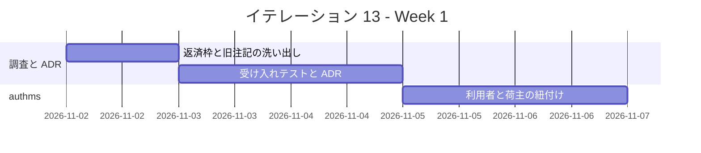
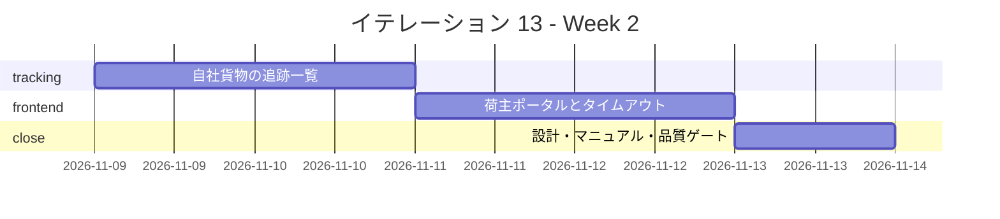
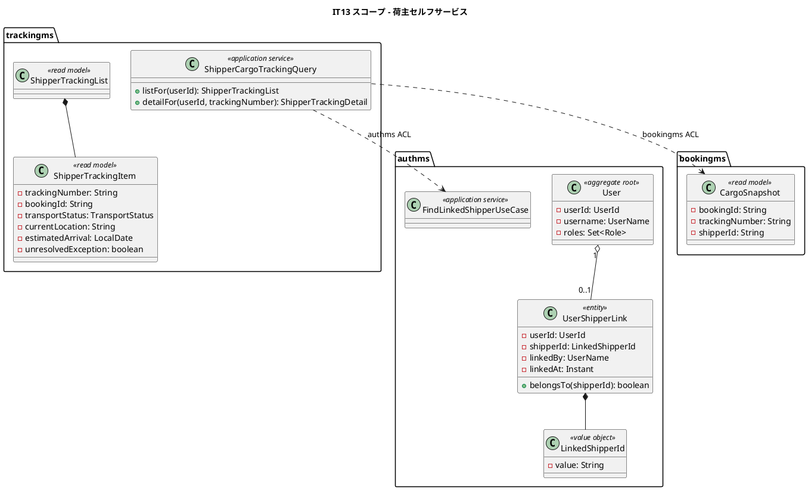
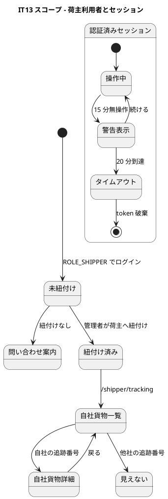
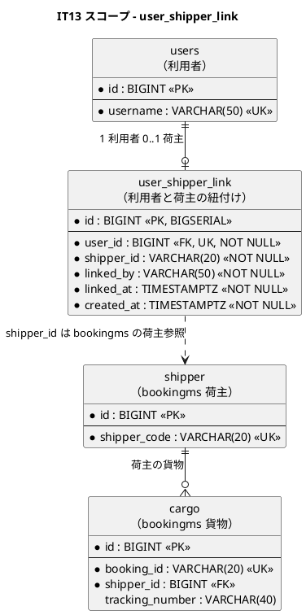
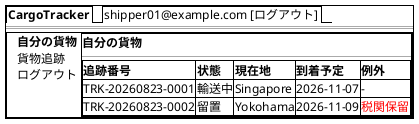
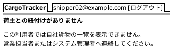
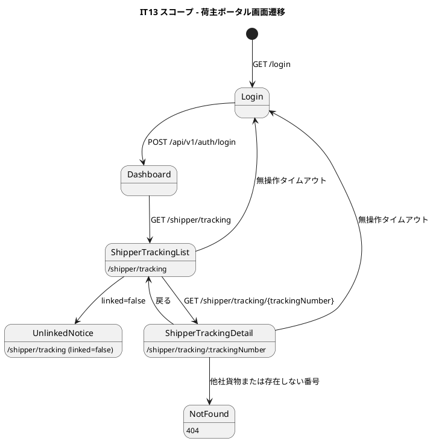

<!-- markdownlint-disable MD013 -->

# イテレーション 13 計画

## 概要

| 項目 | 内容 |
| :--- | :--- |
| イテレーション | IT13 |
| 期間 | 2026-11-02 〜 2026-11-15（2 週間） |
| ゴール | 荷主の担当者がログイン後に自社の貨物だけを一覧で追跡でき、共用端末を放置しても操作され続けない状態にする |
| 対象ストーリー | US33（荷主の担当者が自分の貨物だけを追跡する）・TD-01（共用端末の無操作タイムアウト） |
| 計画 SP | **7**（US33 = 5・TD-01 = 2） |
| 局面 | **予備 IT / 終盤の延長・アウトサイドイン**（[開発戦略](development_strategy.md)） |
| 前提 | [IT12 完了報告書](iteration_report-12.md)・[IT12 ふりかえり](retrospective-12.md) |
| リリース | [Release 2.1](release_plan.md)（荷主のセルフサービス） |

---

## ゴール

### イテレーション終了時の達成状態

1. **荷主セルフサービス**: `ROLE_SHIPPER` の利用者がログインし、自社の貨物だけを一覧で追跡できる。
2. **境界の保護**: 他社の貨物は一覧にも詳細にも出ない。追跡番号を知っていても、認証済みの荷主向け詳細では見えない。
3. **共用端末の保護**: 無操作のまま放置された業務画面は自動的にセッションを閉じ、次の利用者が前任者の権限で操作できない。

### 成功基準

- [x] US33 の受入基準 4 件が、E2E / API / ドメインのテストで 1:1 に固定されている。
- [x] 利用者と荷主の紐付けは、authms と bookingms のどちらにも暗黙の文字列一致を置かない。
- [x] `ROLE_SHIPPER` から見える API は自社貨物に絞られ、未紐付け利用者には問い合わせ先が出る。
- [x] 無操作タイムアウトは ADR で判定時間・警告有無・入力中データの扱いを決め、破るテストを置く。
- [x] IT12 の Try 1〜6 を計画と DoD に反映している。
- [x] 画面を伴うため、ユーザーマニュアルと画面キャプチャを更新する。
- [ ] テストカバレッジ 80% 以上、ドメイン層 90% 以上。

---

## 前イテレーションからの反映

### ふりかえりの Try

| # | Try | 本 IT での扱い |
| :--- | :--- | :--- |
| 1 | 決定どうしが出会う筋を、着手前に 1 本書き出す | Phase 1 で ADR を起票し、「利用者紐付け」「自社貨物絞り込み」「公開追跡」「無操作タイムアウト」が同時に効く筋を先に列挙する。 |
| 2 | ADR に検査名を書いたら、その場で実在を確かめる | ADR のコンプライアンス表は `AdrComplianceTableTest` の対象にし、検査名を置いた時点で実在確認する。 |
| 3 | 「〜に翻訳する」と書いたら、翻訳先を同じ変更の中で書く | 「自社貨物だけ」を API 認可、Repository 絞り込み、E2E の 3 つに翻訳し、同じ Phase でテストを置く。 |
| 4 | 改訂したら、その決定に言及している既存の記述を grep で洗う | `ROLE_SHIPPER`・`ADR-008`・`US18`・`自分の貨物` を grep し、設計・マニュアルの旧注記を同じ変更で改訂する。 |
| 5 | 金額を扱う画面は「間違えた入力」を 1 つ試す | 本 IT で金額画面は触らない。請求書検索を入れる場合は、検索条件の空・不正月・存在しない荷主名を 1 つずつ試す。 |
| 6 | 「出せる」と「出せる形になっている」を分ける | 荷主向け一覧は「出る」だけでなく、状態・現在地・到着予定・例外が 1 画面で判断できることをキャプチャで確認する。 |
| 7 | 着手前の整合性検証を続ける | 本計画で実施する。 |
| 8 | キャプチャの目視を続ける | マニュアル更新と DoD に含める。 |
| 9 | レビューは 5 視点そろうまで待つ | クローズ条件に含める。 |

### IT12 からの申し送り

7 SP 枠を超えるため、全件は持ち込まない。基準は「US33 / TD-01 と同じファイル・同じ導線を触るか」と「3 度目か」である。

| # | 内容 | 見積 | 本 IT での扱い |
| :--- | :--- | :--- | :--- |
| 1 | 請求書の検索（請求番号・荷主名・予約番号）と発行月の絞り込み・合計 | 5h | **本 IT に入れる余地があれば先頭で返す。** 月末締めの業務価値は高いが、US33 / TD-01 と触る画面が違うため、7 SP を壊してまで本体には混ぜない。 |
| 2 | 見積に荷主を入れる | 4h | **送る。** US33 の利用者―荷主紐付けと概念は近いが、見積 / 予約突き合わせまで触ると Release 2.1 のゴールから外れる。 |
| 3 | 例外の実績を trackingms から引く | 4h | **本 IT に SP 付きタスクとして入れる。** 3 度目であり、US33 の一覧で「例外が起きている貨物が分かる」ためにも必要。 |
| 4 | `overdue()` の全件走査と `billable()` の N+1 を SQL に降ろす | 4h | 送る。 |
| 5 | 「請求書」と「精算書」の混在 | 4h | 送る。 |
| 6 | `cancellation` を本番の変換器に通す | 2h | 送る。 |
| 7 | 完全修飾名の混在を揃える | 1h | 触ったファイルに現れた場合だけ同時に直す。単独返済枠にはしない。 |
| 8 | `V5` マイグレーションのスキーマ絞り・`invoice` の `CHECK` 制約 | 2h | 送る。 |
| 9 | SonarQube の Hotspot が毎回 UI 操作を要する形を解く | 1h | **Phase 6 に判断だけ入れる。** 権限とゲート条件の見直しであり、実装タスクには混ぜない。 |

---

## ユーザーストーリー

### 対象ストーリー

| ID | ユーザーストーリー | SP | 優先度 |
| :--- | :--- | :--- | :--- |
| US33 | 荷主の担当者が自分の貨物だけを追跡する | 5 | 中 |
| TD-01 | 共用端末の無操作タイムアウトを設ける | 2 | - |
| **合計** | | **7** | |

### ストーリー詳細

#### US33: 荷主の担当者が自分の貨物だけを追跡する

**として**: 荷主

**したい**: ログインして、自社の貨物だけを一覧で追跡したい

**なぜなら**: 追跡番号を 1 件ずつ控えて公開照会に入れる運用では、貨物が増えるほど控え漏れが起き、「どれがいま止まっているか」を自分では把握できないからだ

**対応 UC**: UC18

**受け入れ基準**:

- [x] 利用者（`ROLE_SHIPPER`）と荷主が紐付き、ログインした担当者は自社の貨物だけを見られる
- [x] 他社の貨物は、追跡番号を知っていても一覧・詳細のどちらにも出ない
- [x] 一覧には状態・現在地・到着予定が出て、例外が起きている貨物が分かる
- [x] 紐付いていない利用者には、その旨と問い合わせ先が出る（空の一覧を見せて終わりにしない）

#### TD-01: 共用端末の無操作タイムアウトを設ける

**出典**: [Issue #551](https://github.com/k2works/case-study-cargo-tracker/issues/551)・[release_plan.md](release_plan.md)

**目的**: 共用端末でログアウト忘れが起きても、次の利用者が前任者の権限で業務画面を操作できないようにする。

**受け入れ基準**:

- [x] 一定時間の無操作で認証状態が破棄され、ログイン画面へ戻る
- [x] 入力中の業務フォームでは、タイムアウト前に警告を出すか、保存されないことを明示する
- [x] タブを閉じた場合は従来どおり `sessionStorage` のトークンが消える
- [x] タイムアウト後の API 呼び出しは認証切れとして扱われる

---

## 着手前に決めること

| # | 決めること | 組み合わせて効く既存決定 | 本 IT での決定 |
| :--- | :--- | :--- | :--- |
| A | 利用者と荷主の紐付けをどこに持つか | ADR-008 は「紐付けが無い間は `ROLE_SHIPPER` に予約参照を開かない」と決めた | **authms に `user_shipper_link` を追加し、bookingms は Gateway から渡された `X-User-Id` をキーに authms へ紐付けを問い合わせる。** bookingms の `shipper` へ authms の利用者 ID を混ぜない。 |
| B | 荷主向け一覧をどのサービスが返すか | US18 の公開追跡は認証不要、US33 は認証あり | **trackingms が荷主向けの Read API を返す。** ただし自社貨物判定に必要な荷主 ID は bookingms の CargoSnapshot を ACL で参照する。 |
| C | 詳細画面を公開追跡と共用するか | ADR-024 は公開照会を認証不要にした | **URL を分ける。** 公開は `/tracking/:trackingNumber`、荷主向けは `/shipper/tracking/:trackingNumber`。公開画面は追跡番号を知る人向け、荷主向け画面は自社境界を守る画面である。 |
| D | 紐付いていない利用者をどう扱うか | US33-4 は空一覧で終わらせない | **問い合わせ先を出して、一覧 API は 403 ではなく 200 + `linked=false` を返す。** 認証は通っているが業務上の紐付けが無い状態だからである。 |
| E | 無操作タイムアウトの判定時間 | ADR-005 は `sessionStorage` を採用済み | **15 分無操作で警告、20 分でログアウト**を初期値にする。荷役・通関など入力中の画面では、警告に「保存されません」を出す。実装時に ADR を起票して固定する。 |

---

## タスク

### Phase 0: 返済枠と調査（0 SP）

| # | タスク | 見積 | 状態 |
| :--- | :--- | :--- | :--- |
| 0.1 | `ROLE_SHIPPER`・`ADR-008`・`US18`・`自分の貨物` を grep し、改訂が必要な設計・マニュアル箇所を一覧化する | 3h | [x] |
| 0.2 | **例外の実績を trackingms から引く**テストを赤で置く。US33 一覧の例外表示がこの Read Model を使うことを確認する | 4h | [ ] |
| 0.3 | 請求書検索は 7 SP 枠に入るかを Day 2 終了時に判断し、入れない場合は release_plan の次リリース候補へ明示的に送る | 1h | [ ] |

### Phase 1: 受け入れテストと ADR（US33 / TD-01）

| # | タスク | 見積 | 状態 |
| :--- | :--- | :--- | :--- |
| 1.1 | US33 の 4 受入基準を E2E シナリオに翻訳し、赤を確認する | 8h | [x] |
| 1.2 | TD-01 のタイムアウトシナリオをコンポーネントテストと E2E に翻訳し、赤を確認する | 5h | [x] |
| 1.3 | ADR-029（利用者と荷主の紐付け・荷主向け追跡境界・無操作タイムアウト）を起票する | 5h | [x] |
| 1.4 | ADR のコンプライアンス表に検査名を書き、`AdrComplianceTableTest` で実在確認する | 3h | [x] |

### Phase 2: 利用者と荷主の紐付け（authms）

| # | タスク | 見積 | 状態 |
| :--- | :--- | :--- | :--- |
| 2.1 | `user_shipper_link` の Flyway マイグレーションと Mapper テストを追加する | 6h | [x] |
| 2.2 | `UserShipperLink` / `ShipperLinkedUser` のドメインモデルと紐付け照会ユースケースを TDD で実装する | 8h | [x] |
| 2.3 | 管理者向けの紐付け API と認可テストを実装する | 6h | [x] |
| 2.4 | bookingms / trackingms から参照する内部 API の契約テストを追加する | 5h | [x] |

### Phase 3: 自社貨物の追跡一覧（trackingms / bookingms）

| # | タスク | 見積 | 状態 |
| :--- | :--- | :--- | :--- |
| 3.1 | bookingms の CargoSnapshot に荷主 ID を返す内部 API を追加し、`system:trackingms` だけが読めることを固定する | 6h | [x] |
| 3.2 | trackingms に `ShipperCargoTrackingQuery` を追加し、自社貨物だけを返すテストを赤から通す | 8h | [x] |
| 3.3 | 他社貨物の追跡番号を指定した荷主向け詳細は 404 とし、公開追跡とは別経路で固定する | 5h | [x] |
| 3.4 | 一覧項目に状態・現在地・到着予定・未解決例外を出す Read Model を整える | 6h | [x] |

### Phase 4: フロントエンド（荷主ポータル / タイムアウト）

| # | タスク | 見積 | 状態 |
| :--- | :--- | :--- | :--- |
| 4.1 | `ROLE_SHIPPER` のダッシュボードとサイドバーに「自分の貨物」を追加し、ナビ表示テストを置く | 5h | [x] |
| 4.2 | `/shipper/tracking` 一覧と `/shipper/tracking/:trackingNumber` 詳細を MSW で実装する | 8h | [x] |
| 4.3 | 未紐付け利用者の問い合わせ案内画面を実装し、空一覧にしないことをテストする | 4h | [x] |
| 4.4 | 無操作検知・警告・自動ログアウトをルートガードに実装する | 7h | [x] |
| 4.5 | 入力中画面でタイムアウト警告が操作を隠さないことを Playwright のスクリーンショットで確認する | 4h | [x] |

### Phase 5: 設計・マニュアル反映

| # | タスク | 見積 | 状態 |
| :--- | :--- | :--- | :--- |
| 5.1 | `domain-model.md` に `UserShipperLink`、荷主向け追跡クエリ、タイムアウト方針を反映する | 4h | [x] |
| 5.2 | `data-model.md` に `user_shipper_link` と内部 API の参照関係を反映する | 3h | [x] |
| 5.3 | `ui_design.md` に `/shipper/tracking`、ナビゲーション、RBAC マトリクスを反映する | 5h | [x] |
| 5.4 | ユーザーマニュアルに「荷主ポータル」章を追加し、ログイン・一覧・詳細・未紐付け・タイムアウトのキャプチャを撮る | 8h | [x] |
| 5.5 | `ROLE_SHIPPER`・`ADR-008`・`US18` の旧注記を grep で洗い、必要箇所を更新する | 4h | [x] |

### Phase 6: 統合・品質ゲート・同期

| # | タスク | 見積 | 状態 |
| :--- | :--- | :--- | :--- |
| 6.1 | 実バックエンドで荷主ログイン → 自社貨物一覧 → 詳細 → 他社貨物拒否を通す | 6h | [ ] |
| 6.2 | `./gradlew build`、`TZ=UTC ./gradlew test`、frontend test / build、E2E を実行する | 8h | [ ] |
| 6.3 | JIG / jig-erd を再生成し、設計と実装の差分を確認する | 4h | [ ] |
| 6.4 | SonarQube Hotspot の UI 手動待ちをどう扱うかを記録し、資格情報かゲート条件の見直し先を決める | 2h | [ ] |
| 6.5 | IT13 ふりかえり・完了報告書・Release 2.1 完了報告書の下準備を行う | 5h | [ ] |

### 見積もり合計

| カテゴリ | SP | 理想時間 | 状態 |
| :--- | :--- | :--- | :--- |
| Phase 0: 返済枠と調査 | 0 | 8h | [ ] |
| Phase 1: 受け入れテストと ADR | 1 | 21h | [x] |
| Phase 2: 利用者と荷主の紐付け | 2 | 25h | [x] |
| Phase 3: 自社貨物の追跡一覧 | 2 | 25h | [x] |
| Phase 4: フロントエンド | 1 | 28h | [x] |
| Phase 5: 設計・マニュアル反映 | 1 | 24h | [x] |
| Phase 6: 統合・品質ゲート・同期 | 0 | 25h | [ ] |
| **合計** | **7** | **156h** | |

**1 SP あたり**: 約 22.3h

**進捗率**: 100%（7 / 7 SP）

---

## スケジュール

### Week 1（Day 1-5）

| 日 | タスク |
| :--- | :--- |
| Day 1 | Phase 0、US33 / TD-01 の受け入れテスト設計、旧注記の洗い出し |
| Day 2 | E2E / コンポーネントテスト Red、ADR-029 起票 |
| Day 3 | ADR コンプライアンス検査、`user_shipper_link` のスキーマ Red-Green |
| Day 4 | authms の紐付けドメイン・照会 API |
| Day 5 | 内部 API 契約、管理者向け紐付け API |

### Week 2（Day 6-10）

| 日 | タスク |
| :--- | :--- |
| Day 6 | bookingms CargoSnapshot、trackingms 自社貨物クエリ |
| Day 7 | 他社貨物拒否、例外表示、API 統合 |
| Day 8 | 荷主ポータル UI、未紐付け案内 |
| Day 9 | 無操作タイムアウト、画面キャプチャ、マニュアル更新 |
| Day 10 | 実環境 E2E、品質ゲート、JIG / jig-erd、同期とクローズ準備 |

---

## 設計

### ドメインモデル

> **設計への反映済み**: `UserShipperLink` と荷主向け追跡 Read Model は `domain-model.md` に反映した。`user_shipper_link` は `data-model.md`、`/shipper/tracking` と RBAC は `ui_design.md` に反映済みである。

### 状態遷移図

### データモデル

> **設計への反映済み**: `user_shipper_link.shipper_id` はサービス境界をまたぐ参照であり DB FK は張らない。参照整合は authms の内部 API と管理者 UI の候補検索で守る。

### ユーザーインターフェース

#### ビュー

#### 画面遷移

> **設計への反映済み**: `ui_design.md` の画面一覧・ナビゲーション構成・RBAC マトリクスに `/shipper/tracking` と `/shipper/tracking/:trackingNumber` を追加した。`/tracking/:trackingNumber` は公開画面のまま残す。

---

## リスクと対策

| # | リスク | 影響 | 対策 |
| :--- | :--- | :--- | :--- |
| 1 | authms と bookingms の間に DB FK を張りたくなる | サービス境界を壊す | `user_shipper_link.shipper_id` は外部 ID とし、内部 API / 契約テストで整合を守る。 |
| 2 | 公開追跡と荷主向け追跡を共用し、他社貨物が見える | 情報漏えい | URL と API を分け、他社貨物は 404 にするテストを最初に置く。 |
| 3 | 無操作タイムアウトが入力中作業を突然失わせる | 現場の事故 | 警告表示と「保存されない」表示を入れ、キャプチャで確認する。 |
| 4 | 7 SP に IT12 申し送りを混ぜすぎる | IT13 が閉じない | 3 度目の「例外の実績」以外は明示的に送る。請求書検索は Day 2 の判断で入れなければ送る。 |
| 5 | 荷主向け一覧が状態だけで、何をすべきか分からない | 業務価値が落ちる | 例外・現在地・到着予定を 1 画面で出し、キャプチャをユーザー代表の視点で見る。 |

---

## 完了条件

### Definition of Done

- [x] US33 / TD-01 の受け入れテストが Red → Green で実装されている。
- [x] 他社貨物が一覧・詳細に出ないことを API と E2E の両方で固定している。
- [x] `ROLE_SHIPPER` のナビゲーションとダッシュボード導線が実装され、押した先で 403 にならない。
- [x] 未紐付け利用者に問い合わせ先が表示される。
- [x] 無操作タイムアウトの警告とログアウトが動作し、入力中画面を隠さないことを確認している。
- [x] `domain-model.md`、`data-model.md`、`ui_design.md`、ユーザーマニュアルを更新している。
- [x] マニュアル用キャプチャを撮り直し、目視で UI 欠陥がないことを確認している。
- [ ] `./gradlew build`、`TZ=UTC ./gradlew test`、frontend test / build、E2E、JIG / jig-erd が完了している。
- [ ] 5 視点レビューを実施し、高優先度をすべて対応または明示的に送っている。

### デモ項目

| # | デモ | 対応する受入基準 |
| :--- | :--- | :--- |
| 1 | 管理者が `shipper01` を荷主 A に紐付ける | US33-1 |
| 2 | `shipper01` でログインすると、自社貨物だけが `/shipper/tracking` に並ぶ | US33-1 |
| 3 | 一覧に状態・現在地・到着予定・例外が表示される | US33-3 |
| 4 | 他社貨物の追跡番号を `/shipper/tracking/:trackingNumber` に入れても 404 になる | US33-2 |
| 5 | 紐付いていない `shipper02` でログインすると問い合わせ案内が出る | US33-4 |
| 6 | 無操作 15 分で警告、20 分でログアウトする | TD-01 |
| 7 | ログアウト後の API 呼び出しが認証切れになる | TD-01 |

---

## 整合性検証結果

### 詳細整合性検証（`validating-iteration-plan`）

| ステップ | 検証対象 | 結果 | 不整合件数 |
| :--- | :--- | :--- | :--- |
| 1 | テンプレートフォーマット | OK | 0 |
| 2 | ユーザーストーリー | OK | 0 |
| 3 | ドメインモデル | 注記あり | 2 |
| 4 | データモデル | 注記あり | 1 |
| 5 | UI 設計（ビュー） | 注記あり | 2 |
| 6 | UI 設計（インタラクション） | 注記あり | 1 |
| 7 | ゴールの整合性 | OK | 0 |
| 8 | 過去レビュー指摘事項 | OK | 0 |

#### 設計ドキュメントへの反映が必要な注記

| # | 内容 | 反映先 | 扱い |
| :--- | :--- | :--- | :--- |
| 1 | `UserShipperLink` と荷主向け追跡クエリが未記載 | `domain-model.md` | 反映済み |
| 2 | 荷主向け追跡 Read Model が未記載 | `domain-model.md` | 反映済み |
| 3 | `user_shipper_link` が未記載 | `data-model.md` | 反映済み |
| 4 | `/shipper/tracking` と `/shipper/tracking/:trackingNumber` が未記載 | `ui_design.md` | 反映済み |
| 5 | `ROLE_SHIPPER` のナビゲーションが旧注記のまま | `ui_design.md`・マニュアル | 反映済み |

### 横断整合性検証（`validating-design`）

| 軸 | 検証対象 | 結果 | 不整合件数 |
| :--- | :--- | :--- | :--- |
| A | 開発戦略 ↔ 計画 | OK | 0 |
| B | 計画 ↔ 設計ドキュメント | OK | 0 |
| C | 計画 ↔ 過去計画 | OK | 0 |

> IT13 は予備 IT であり、Release 2.1 は終盤の延長として扱う。開発戦略の「予備 IT13 は消化する局面のアプローチに従う」に従い、アウトサイドインで進める。

---

## 進捗

| Phase | 状態 |
| :--- | :--- |
| Phase 0 | 一部完了 |
| Phase 1 | 完了 |
| Phase 2 | 完了 |
| Phase 3 | 完了 |
| Phase 4 | 完了 |
| Phase 5 | 完了 |
| Phase 6 | 未着手 |

---

## 更新履歴

| 日付 | 内容 | 担当 |
| :--- | :--- | :--- |
| 2026-08-27 | 初版作成（`opening-iteration` ステップ 2） | - |
| 2026-08-27 | Phase 2 の管理者向け紐付け API と内部 API 契約テストを実装済みに更新 | Codex |
| 2026-08-27 | Phase 5.1〜5.3 の設計ドキュメント反映を完了に更新 | Codex |
| 2026-08-27 | Phase 5.4〜5.5 のマニュアル更新・旧注記改訂を完了に更新 | Codex |
| 2026-08-27 | Phase 1 と Phase 4.5 の E2E を追加し、US33 / TD-01 の受け入れ基準を完了に更新 | Codex |

## 関連ドキュメント

- [リリース計画](release_plan.md)
- [開発戦略](development_strategy.md)
- [IT12 ふりかえり](retrospective-12.md)
- [IT12 完了報告書](iteration_report-12.md)
- [ユーザーストーリー](../requirements/user_story.md)
- [ドメインモデル](../design/domain-model.md)
- [データモデル](../design/data-model.md)
- [UI 設計](../design/ui_design.md)
