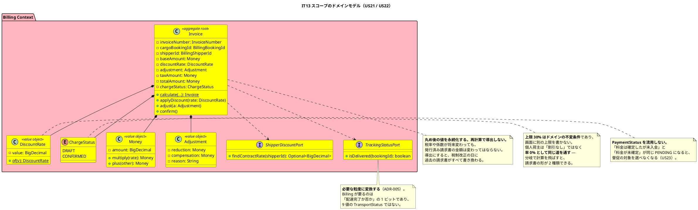
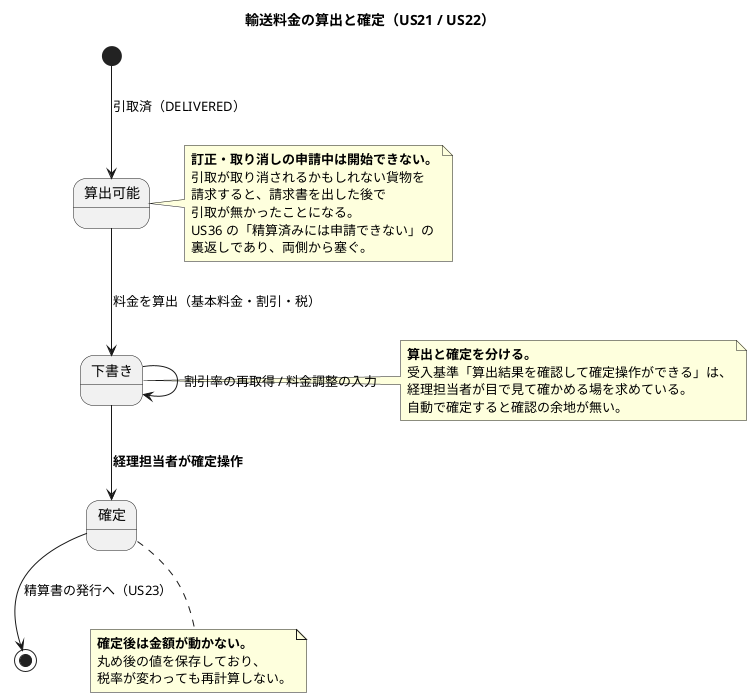
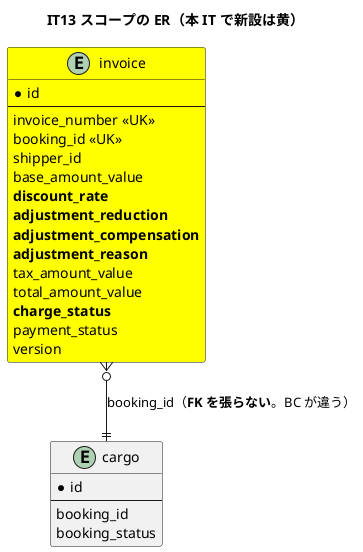
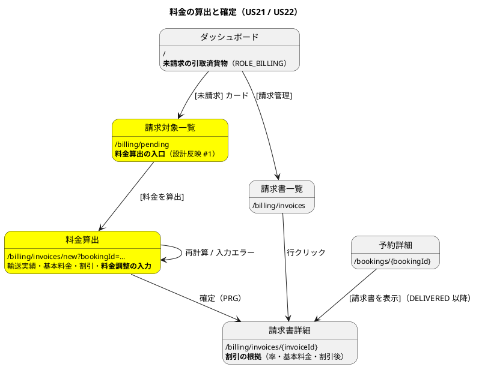

# イテレーション 13 計画

## 概要

| 項目 | 内容 |
| :--- | :--- |
| イテレーション | IT13 |
| リリース | **2.0 精算**（最初のイテレーション） |
| 期間 | 2026-08-10 〜（10 営業日相当） |
| 局面 | **精算**（`development_strategy.md`。アプローチ: **インサイドアウト**） |
| 計画 SP | **6SP**（US21 3SP / US22 3SP） |
| 前提 | IT12 クローズ済み・**v1.1.0 タグ済み**（累計 96SP / 96SP、12 IT 連続で計画 = 実績。ベロシティ平均 8.0） |

---

## ゴール

**「いくら請求するか」をシステムが答えられるようにする。**

v1.1.0 は予約から引取までを通したが、**その先が無い**。引取が済んだ貨物は `DELIVERED` のまま止まり、経理担当者にはダッシュボードのカードすら無い。会社は運んだが、請求できない。

本 IT は **Billing Context をゼロから立ち上げる唯一のイテレーション**である。ここで決めた金額の扱い（丸め・割引・永続化）は、以降のすべての請求に効く。

---

## なぜインサイドアウトに戻すか（**局面の名前ではなく条件で選ぶ**）

IT7〜IT12 はアウトサイドインだった。理由は「既存集約の組み合わせであり、新しい集約をできるだけ作らない」ことだった。**本 IT はその条件を満たさない。**

| 条件 | 終盤（IT7〜IT12） | 本 IT |
| :--- | :--- | :--- |
| 集約 | 既存を組み合わせる | **Billing は `package-info` のみ。集約が 1 つも無い** |
| BC 間の越境 | 既存ポートに載せる | **新規ポートを 2 つ実装する**（`ShipperDiscountPort` / `TrackingStatusPort`） |
| 誤りの取り返し | 画面を直せば済む | **金額は後から直せない。** 発行済み請求書は税率が変わっても変わってはならない |

**中盤（IT3〜IT6）と同じ条件なので、同じ選択をする。** 金額の丸めを画面から下ろすと、必ず表示都合（カンマ区切り・切り上げ表示）が規則に混ざる。

---

## 6SP をどう使うか

| 区分 | SP / 見積 | 内容 |
| :--- | :--- | :--- |
| ストーリー | 6SP / 約 36h | US21 / US22 |
| **返済枠** | — / 約 14h | IT12 持ち越し 10 件のうち **7 件**（C1 / C3 / C7 / C8 / C9 / C10 / C5） |
| **運用要件** | — / 約 4h | **ROLE_BILLING の月次業務**（Release 1.1 で積み残した。C4 / C6 を含む） |

**ベロシティ 8.0 に対して 6SP である。** 差の 2SP 分を返済枠と運用要件に充てる。**「余力次第」ではなく、計画として先に確保した枠**である（Try T7。7 IT 連続）。

> **運用要件を枠に入れたのは、`release_scope.md` が「Release 1.1 までに定義する」と書いたまま
> IT12 で Release 1.1 を完了させたからである。** 期限を過ぎた約束は、次に名前を付けないと
> そのまま消える（`retrospective-9.md` の ADR-008 が 3 回繰り越された形）。
> **ROLE_BILLING の月次業務は、精算機能を作る本 IT でしか決められない。**

---

## 前イテレーションの学びの反映（ふりかえり Try）

IT12 のふりかえり（`retrospective-12.md`）の Try 12 件を、本計画のタスクと DoD に落とす。

| Try | 内容 | 本計画への反映 |
| :--- | :--- | :--- |
| **T1** | **「実装しなかった守り」を数える。** 受入基準・マニュアル・ADR に書いた「〜する」に、**それを実行するテストがあるか**を 1 件ずつ確かめる。破壊検証と対にする | **DoD の最上位に置く。** 本 IT は「丸めます」「割引を適用します」「再計算しません」と**主張しやすい**題材である。破壊検証（作った守り）だけでは、H1 型（作らなかった守り）を捕まえられない |
| **T2** | マニュアルに書いた振る舞いは、その文を書いた時点でテストに落とす | タスク 5-2。**金額の説明は書いた瞬間に約束になる** |
| **T3** | **クローズ前の検証は `TZ=UTC ./gradlew check` で行う** | タスク 4-5。**支払期限は日付であり、時差でずれる**（`feedback_business-timezone-not-utc` の型） |
| **T4** | 静的解析の指摘は「同じ種類」を横断で潰す | タスク 4-4 |
| **T5** | 見出しを増減させたら `mkdocs build` の警告を 0 にする | タスク 5-3 |
| **T6** | レビューが応答しないときは自己レビューで代替したと記録し、届いたら突合する | クローズ手順 |
| **T9** | **宣言と実装の食い違いを両方向で探す。** US を実装したらその語で画面・マニュアル・ADR を横断検索する | タスク 4-3。本 IT の語は「割引」「丸め」「税」「請求」 |
| **T10** | **画面の出し分けは認可と対で検査する。** 「見えないこと」を**その操作がある状態で**確かめる | タスク 3-5。**請求書は金額であり、見える範囲を誤ると他社の取引条件が漏れる** |
| **T11** | 節番号を繰り下げたらアンカーの実在だけでなく節名との一致まで突き合わせる | タスク 5-3 |
| **T7** | **返済枠は IT 序盤の独立コミットで先に着手する**（7 IT 連続） | **タスク 0 を最初に置く** |
| **T8** | **数え上げてから壊す。壊すのは「作った直後」に行う** | 安全装置の節。IT12 は空振り 0 件だった |

---

## 返済枠（タスク 0。**序盤に先に着手する**）

### 返すもの

| # | 内容 | 由来 | 扱い |
| :--- | :--- | :--- | :--- |
| **C8** | **承認待ちの間、貨物が「配送完了」のままで、営業の予約詳細に申請中が出ない** | IT12 持ち越し | **返す。** 荷主から電話を受けた営業が答えられない。**精算は `DELIVERED` を入口にする**ため、申請中の貨物が請求に流れる形を本 IT で塞ぐ必要がある |
| **C9** | 追跡管理者が 1 人の拠点で、自分の申請を承認できない | IT12 持ち越し | **返す。** 一覧のボタンを無効化し「あなたが申請したものです」と出す（認可は現状で十分） |
| **C1** | 訂正で直せるのは作業日時とメモだけ（意図的な制限だがマニュアルに無い） | IT12 持ち越し（レビュー L3） | **返す。** T2 の裏返し — **実装のほうが少ないのに、マニュアルが黙っている** |
| **C7** | 引取確認コードを荷受人が忘れたときの逃げ道（再伝達・再発行） | IT12 持ち越し | **返す。** 案内文は足したが手段が無い |
| **C10** | 申請できるのは引取のみ（積込・荷降しの誤登録のほうが件数は多い） | IT12 持ち越し | **返す。** マニュアルの「システム管理担当窓口へ」に実際の手段があるかを確かめ、無ければ**無いと書く** |
| **C3** | `MapperTableOwnershipTest.ALLOWED` の 2 件（`BookingQueryMapper` → `voyage` / `carrier_movement`）は写しにできる | IT12 持ち越し（レビュー L2） | **返す。** **本 IT で Billing のマッパーを新設する前に減らす**。越境の許容リストは、足す前に減らすほうが安い |
| **C5** | 分岐カバレッジ 73.3%（行 92.5%） | IT12 持ち越し | **測って記録する**に留める。数値目標は置かない |

### 運用要件（**Release 1.1 の積み残し**）

| # | 内容 | 由来 |
| :--- | :--- | :--- |
| **R1** | **ROLE_BILLING の月次業務**（締め・請求書一括発行・未入金の督促）を `release_scope.md` の「業務運用」に定義する | `release_scope.md`（Release 1.1 までにと書いて未実施） |
| **R2** | 承認待ちが滞るときの期限・通知の考え方（C4） | IT12 持ち越し |
| **R3** | 公開追跡の問い合わせ先（C6） | IT12 持ち越し。**連絡先は運用が決める — 実装側で先取りしない** |

### 返さないもの（**理由を明記する**）

| # | 内容 | 理由 |
| :--- | :--- | :--- |
| C2 / L1 | `ClaimCode.matches`（Booking）と `ClaimCodeMatch.matches`（Handling）に照合の規則が 2 か所ある | **許容を継続する。** BC をまたいで運べるのは素の文字列だけであり（ADR-005）、値オブジェクトは渡せない。**本 IT は Billing の立ち上げで手一杯であり、既存 BC の切り出しに手を入れると両方が中途半端になる** |
| L5 | 追跡管理者 1 人の拠点で取り消しができない | **許容。** 承認の意味は別人であって初めて生まれる（US36 の受入基準そのもの） |

---

## 対象ユーザーストーリー

| ID | ユーザーストーリー | SP | 優先度 | Issue |
| :--- | :--- | :--- | :--- | :--- |
| US21 | 輸送料金を算出する | 3 | 必須 | 開始準備の GitHub 同期で採番する |
| US22 | 法人割引を適用する | 3 | 必須 | 同上 |
| | **合計** | **6** | | |

> マイルストーンは 2 件とも `[java/take-6] Release 2.0 精算`、ラベルは `it13` とする。

### 実装順序

**US21 → US22** の順に進める。割引は基本料金の上に乗るため、**基本料金の確定と丸めが先に決まっていなければ、割引後の丸めを決められない**（`release_scope.md` の依存順序）。

### 受入基準

受入基準の正典は [ユーザーストーリー](../requirements/user_story.md) である。**本計画に書き写さず引用する。**

- US21: [US21 の受入基準](../requirements/user_story.md#us21-輸送料金を算出する)
- US22: [US22 の受入基準](../requirements/user_story.md#us22-法人割引を適用する)

### 受入基準のうち解釈が要るもの（**括弧の中まで読む**）

| 内容 | 扱い | 理由 |
| :--- | :--- | :--- |
| US21「**「引取済」状態の予約**に対して料金算出を開始できる」 | **`DELIVERED` を入口にする。** ただし**訂正・取り消しの申請中は開始できない**（C8 と直結） | 引取が取り消されるかもしれない貨物を請求すると、請求書を出した後で引取が無かったことになる。**US36 が「精算済みには申請できない」と定めた裏返し**であり、両側から塞がないと隙間が残る |
| US21「基本料金が**自動計算**される」 | **確定した経路・重量・貨物種別から算出する。** 概算式（ADR-008）は使わない | ADR-008 の概算は**候補の並べ替え用**であり、`ui_design.md` は「荷主に見せた瞬間に請求額として読まれる」ため画面に出さないと定めている。**並べ替えの物差しを請求に使ってはならない** |
| US21「算出結果を確認して**確定操作ができる**」 | **算出と確定を分ける。** 確定するまで金額は変わりうる | 経理担当者が目で見て確かめる場が受入基準の意図である。自動で確定すると確認の余地が無い |
| US21「確定後、輸送料金が**「確定」状態**で登録される」 | **丸め後の値を永続化する。再計算で導出しない**（`domain-model.md`） | **税率や係数が将来変わっても、発行済みの金額は変わってはならない。** 導出にすると、税制改正の日に過去の請求書がすべて書き換わる |
| US21「例外が発生している場合、**料金調整（減額・補償費用）の入力ができる**」 | **入力欄を設ける。** 自動計算はしない | 減額の判断は業務であり、金額を機械が決めると根拠が説明できない。**IT10 の例外記録（`status_before`）を参照して「調整の対象があること」だけを示す** |
| US22「荷主種別が「法人」の場合、**契約割引率が自動的に取得・表示**される」 | **`ShipperDiscountPort` で Shipper Context から取得する**（`domain-model.md`） | 旧設計 `DiscountPolicy.calculateRate(shipperType, amount)` は金額から割引率を出しており、**契約割引率を参照していなかった**（レビュー H15）。是正済みの設計に従う |
| US22「割引率（**0〜30%**）が基本料金に適用され」 | **上限 30% はドメインの不変条件**（`DiscountRate`）。画面に別の上限を書かない | `domain-model.md` の用語集が明記している。**画面が独自の上限を持つと、二つの正解ができる** |
| US22「割引計算の**根拠**（割引率・基本料金・割引後料金）が精算書に記載される」 | **3 つとも永続化する**（`invoice.discount_rate` ほか） | 「根拠が記載される」は表示要件ではなく**保存要件**である。荷主の契約が翌月変わっても、先月の請求書の根拠は先月の率でなければならない |
| US22「**個人荷主の場合は割引が適用されない**」 | **割引率 0% として同じ道を通す。** 分岐で計算そのものを飛ばさない | 飛ばすと、個人荷主の請求書に割引の行が無い形と、率 0% の行がある形の 2 種類ができる。**同じ問題に 2 つの答えを残さない** |

---

## 設計への反映が必要（当該 IT で対応）

着手前の突合で見つかった差分。**当該 IT で設計ドキュメントに反映する。**

| # | 対象 | 内容 | 反映先 |
| :--- | :--- | :--- | :--- |
| 1 | `ui_design.md` | **料金算出を開始する入口が無い。** 画面一覧には請求書一覧 / 請求書詳細しかなく、US21 の「引取済の予約に対して料金算出を開始できる」の受け皿が定義されていない | `ui_design.md` |
| 2 | `ui_design.md` | **料金調整（減額・補償費用）の入力欄がどの画面にも無い**（US21 の受入基準 6） | `ui_design.md` |
| 3 | `data-model.md` | **`invoice_line_item` の要否が「Release 2.0 で判断する」のまま**（`release_scope.md` のスコープ外表） | 本 IT で判断する。後述 |
| 4 | `data-model.md` / マイグレーション | 料金調整（減額・補償費用）を保持する場所が無い | V28・`data-model.md` |
| 5 | `domain-model.md` | **輸送料金の「算出済み」と「確定」を区別する状態が要素表に無い**（`PaymentStatus` は支払いの状態であり、料金の状態ではない） | `domain-model.md` |
| 6 | `non_functional.md` | ROLE_BILLING の権限範囲に料金算出・確定が無い | `non_functional.md` §4.1 |
| 7 | `test_strategy.md` | Billing Context のテスト方針が無い（**金額の丸めをどの層で固定するか**） | `test_strategy.md` |
| 8 | ADR-015 の検査 | **`MapperTableOwnershipTest.OWNER` に Billing の 3 テーブルを登録する** | テストコード＋ADR-015 の追記 |
| 9 | `architecture_backend.md` | 実装状況の `billing/` を更新する | `architecture_backend.md` |

### 設計反映 #3 の方針（**`invoice_line_item` を作るか**）

**本 IT では作らない。**

US21 / US22 / US23 の受入基準は、請求金額を「基本料金・割引率・割引後料金・消費税・合計」で説明することしか求めていない。**明細行を要求する受入基準が 1 つも無い。** 要求元のないものは作らない（`release_scope.md` の原則 3）。

**ただし料金調整（US21 の受入基準 6）は明細に見える。** 減額と補償費用は基本料金とは別の行として説明されるべきものである。**`invoice` に調整額の列を 2 つ持つ形で始め、種類が 3 つ以上に増えたら明細テーブルへ移す。** 判断は `data-model.md` に記録する。

### 設計反映 #5 の方針（**料金の状態**）

US21 は「算出 → 確認 → 確定」を求め、確定後は「確定」状態と書いている。一方 `PaymentStatus`（PENDING / CONFIRMED / OVERDUE / REFUNDED）は**支払いの状態**であり、料金の状態ではない。

**`Invoice` に料金の状態（DRAFT / CONFIRMED）を持たせる。** `PaymentStatus` を流用すると、「料金は確定したが未入金」と「料金が未確定」が同じ `PENDING` になり、**督促の対象を選べなくなる**（US23 の受入基準「支払い期限超過時に未払い通知」に直結する）。

---

## 設計（IT13 スコープ）

### ドメインモデル図

### 状態遷移図（IT13 スコープ）

### ER 図（IT13 スコープ）

> **`invoice_line_item` は本 IT では作らない**（設計反映 #3）。明細行を要求する受入基準が無い。
> 料金調整は `invoice` の列 2 つで始め、**種類が 3 つ以上に増えたら明細テーブルへ移す**。
>
> **`booking_id` に FK を張らない。** BC が違い、ADR-005 / ADR-012 が定める越境の形に従う。
> 一意制約（二重請求の防止）は `invoice` 側だけで持つ。

### 画面遷移図（IT13 スコープ）

> **請求対象一覧を新設する**（設計反映 #1）。`ui_design.md` は請求書一覧 / 詳細しか定義しておらず、
> **まだ請求書が無い貨物にたどり着く道が無かった**。
> 「気づく手段」（ダッシュボードのカード）だけでは仕事は進まない — **そこから対象へ行けること**まで要る。

---

## タスク分解

### 0. 返済枠と運用要件（**最初に着手する**。T7。7 IT 連続）

| # | タスク | 見積 |
| :--- | :--- | :--- |
| 0-1 | **C8: 訂正・取り消しの申請中を予約詳細に出す**（営業が答えられる）＋**申請中は料金算出の対象外にする** | 3.5h |
| 0-2 | **C3: `MapperTableOwnershipTest.ALLOWED` の 2 件を写しで解消する**（Billing を足す前に減らす） | 2.5h |
| 0-3 | **C9: 自分の申請は承認ボタンを無効化し「あなたが申請したものです」と出す** | 1.5h |
| 0-4 | **C1 / C10: マニュアルに「訂正で直せる範囲」と「積込・荷降しの誤登録の手段」を書く**（**無ければ無いと書く**） | 2.0h |
| 0-5 | **C7: 引取確認コードの再伝達**（営業が予約詳細から再度伝えられる。**再発行はしない** — 発行し直すと元のコードで来た荷受人が弾かれる） | 2.5h |
| 0-6 | **R1 / R2 / R3: 運用要件を `release_scope.md` に定義する**（ROLE_BILLING の月次業務・承認待ちの期限・公開追跡の連絡先） | 4.0h |
| 0-7 | C5: 分岐カバレッジを測って記録する（目標は置かない） | 0.5h |
| | **小計** | **16.5h** |

### 1. ドメイン（**インサイドアウトの起点。画面もコントローラも作らない**）

| # | タスク | 見積 |
| :--- | :--- | :--- |
| 1-1 | `Money` と**丸め規則**を値オブジェクトのテストから書く（`domain-model.md` の計算例で固定する） | 3.0h |
| 1-2 | `DiscountRate`（上限 30% の不変条件）・**個人荷主は率 0% で同じ道を通す** | 2.0h |
| 1-3 | `Invoice` 集約と `ChargeStatus`（DRAFT / CONFIRMED）。**確定後は金額が動かない** | 3.5h |
| 1-4 | `Adjustment`（減額・補償費用・理由）。**自動計算はしない** | 2.0h |
| 1-5 | **算出できない条件**（未引取・訂正申請中・請求済み）を集約の述語として置く | 2.5h |
| | **小計** | **13.0h** |

### 2. ACL ポートと永続化

| # | タスク | 見積 |
| :--- | :--- | :--- |
| 2-1 | `ShipperDiscountPort`（契約割引率）＋実装。**ポートを足したら `./gradlew test` をフルで回す** | 2.5h |
| 2-2 | `TrackingStatusPort`（**配達完了か否かの 1 ビットに変換する**。ADR-005） | 2.0h |
| 2-3 | `V28`（`invoice`）＋`MapperTableOwnershipTest.OWNER` への登録（ADR-015） | 2.5h |
| 2-4 | 読み書きと Testcontainers のテスト（**二重請求の一意制約を含む**） | 2.5h |
| | **小計** | **9.5h** |

### 3. アプリケーションと画面

| # | タスク | 見積 |
| :--- | :--- | :--- |
| 3-1 | 請求対象一覧（`/billing/pending`）＋ダッシュボードのカード（ADR-014） | 3.0h |
| 3-2 | 料金算出画面（輸送実績の表示・基本料金・割引の根拠・料金調整の入力） | 3.5h |
| 3-3 | 確定操作（PRG）と請求書詳細での**割引根拠の表示** | 2.5h |
| 3-4 | 請求書一覧（ステータスでの絞り込み） | 2.0h |
| 3-5 | 認可。**T10: 「見えないこと」を、その操作がある状態で確かめる**（空リストでは判別しない） | 2.0h |
| | **小計** | **13.0h** |

### 4. テストと検証

| # | タスク | 見積 |
| :--- | :--- | :--- |
| 4-1 | E2E: 引取済 → 料金算出 → 割引適用 → 確定 → 請求書詳細に根拠が出る | 2.5h |
| 4-2 | **E2E: 訂正申請中の貨物は請求対象に出ない**（C8 と US21 の接合点） | 1.5h |
| 4-3 | **T9: 「割引」「丸め」「税」「請求」で画面・マニュアル・ADR を横断検索し、両方向の食い違いを数える** | 2.5h |
| 4-4 | **T4: 静的解析の指摘は同じ種類を横断で潰す** | 1.5h |
| 4-5 | **T3: `TZ=UTC ./gradlew check` で検証する**（支払期限は日付であり時差でずれる） | 1.0h |
| | **小計** | **9.0h** |

### 5. ドキュメント

| # | タスク | 見積 |
| :--- | :--- | :--- |
| 5-0 | **T1: 「実装しなかった守り」を数える。** 受入基準・マニュアル・ADR の「〜する」に、それを実行するテストがあるかを 1 件ずつ確かめる | 2.0h |
| 5-1 | 設計ドキュメントの反映（9 件） | 4.0h |
| 5-2 | **マニュアルに請求の章を新設**＋キャプチャ生成。**実装を見てから書く**。**T2: 書いた文をその場でテストに落とす** | 4.5h |
| 5-3 | 用語集・付録 B・索引 3 点同期＋**`mkdocs build` の警告 0**（T5 / T11） | 2.0h |
| | **小計** | **12.5h** |

**合計見積: 73.5h**（うち返済枠・運用要件 16.5h）

---

## ADR

| # | 判断 | 起票要否 |
| :--- | :--- | :--- |
| 1 | 丸め後の金額を永続化し、再計算で導出しない | **起票しない。** `domain-model.md` が既に定めており、本 IT はその実装である |
| 2 | `TrackingStatusPort` を「配達完了か否か」の 1 ビットに変換する | **起票しない。** ADR-005 の適用 |
| 3 | `MapperTableOwnershipTest.OWNER` に Billing を登録する | **起票しない。** ADR-015 に追記する（新しい BC を足すときの手順として既に書かれている） |
| 4 | **`invoice_line_item` を作らず、料金調整を `invoice` の列で持つ** | **起票する。** `data-model.md` が定義していたテーブルを**作らないという判断**であり、設計図の形を変える。**種類が 3 つ以上に増えたら明細テーブルへ移す**という条件も含めて残す |
| 5 | **料金の状態（`ChargeStatus`）を `PaymentStatus` と分ける** | **起票する。** 状態を 1 つにするか 2 つにするかは構造の判断であり、US23 の督促対象の選び方に直結する |

---

## スケジュール

| 日 | 内容 |
| :--- | :--- |
| 1-2 | タスク 0（返済枠・運用要件 16.5h。**C3 を Billing を足す前に済ませる**） |
| 3-4 | タスク 1（**ドメインから。画面もコントローラも作らない**） |
| 5-6 | タスク 2（ACL ポートと永続化。**ポートを足したらフルテスト**） |
| 7-8 | タスク 3（アプリケーションと画面） |
| 9 | タスク 4（E2E と横断検索） |
| 10 | タスク 5（ドキュメント） |

---

## リスクと対策

| # | リスク | 影響 | 対策 |
| :--- | :--- | :--- | :--- |
| 1 | **新規 BC の立ち上げが 6SP に収まらない** | 大 | **落とす順序を先に決める**: 3-4（請求書一覧の絞り込み）→ 0-5（C7 再伝達）→ 0-4 の順。**US21 / US22 の受入基準と、C8（申請中の除外）は落とさない** |
| 2 | **丸め規則を実装で決めてしまい、`domain-model.md` の計算例と食い違う** | 大 | **タスク 1-1 で計算例（基本料金 100,003 円・割引率 15%・税率 10%）をそのままテストにする。** 実装より先に例を固定する |
| 3 | ACL ポートの追加で ArchUnit の BC 分離ルールが落ちる | 中 | **ポートを足すたびに `./gradlew test` をフルで回す**（レビューでは構造的検証は捕まらない） |
| 4 | 支払期限の日付が時差でずれる | 中 | **T3: `TZ=UTC ./gradlew check`。** 業務タイムゾーンで日付を決める既存の型に揃える |
| 5 | **請求書が他社の経理担当者に見える** | 大 | T10: 「見えないこと」を**その請求書が存在する状態で**確かめる。空リストは判別しない |
| 6 | 訂正・取り消しの申請中と料金算出の接合が漏れる | 中 | **C8 をタスク 0 の最初に置き、US21 の実装前に済ませる。** 後から足すと、算出済みの請求書をどうするかという別問題が生まれる |

---

## 完了条件

### デモ項目

1. 経理担当者のダッシュボードに**未請求の引取済貨物**が出る
2. そこから**請求対象一覧へ到達できる**
3. 引取済の貨物に対して**料金算出を開始できる**
4. 輸送実績（経路・重量・貨物種別・荷役実績）が表示される
5. **基本料金が自動計算される**（ADR-008 の概算式ではない）
6. **法人荷主では契約割引率が自動的に取得・表示される**
7. **個人荷主では割引が適用されない**（率 0% として同じ形で表示される）
8. **割引率 30% を超える値は登録できない**
9. **例外がある貨物では料金調整（減額・補償費用）を入力できる**
10. 算出結果を確認して**確定操作ができる**
11. **確定後は金額が動かない**（税率を変えても再計算されない）
12. 請求書詳細に**割引の根拠**（率・基本料金・割引後料金）が出る
13. **同じ予約に二重に請求書を作れない**
14. **訂正・取り消しの申請中の貨物は請求対象に出ない**（C8）
15. **営業担当者が予約詳細で訂正申請中を確認できる**（C8）
16. **自分の申請には承認ボタンが出ない**（C9）
17. **営業担当者が引取確認コードを再度伝えられる**（C7。再発行はしない）

### 完了の定義（DoD）

#### 機能

- [ ] US21 / US22 の受入基準（**受入基準ごとに「その道を実行したテスト」を名指しする**）
- [ ] デモ項目 17 件が動作する
- [ ] **返済枠 7 件（C1 / C3 / C5 / C7 / C8 / C9 / C10）と運用要件 3 件（R1 / R2 / R3）を返した**

#### 精算局面の完了条件（`development_strategy.md`）

- [ ] **`Money`・`DiscountRate`・丸め規則を値オブジェクトのテストから書いた**（画面より先に）
- [ ] **丸め後の金額が永続化され、税率を変えても発行済みの金額が変わらない**ことをテストで固定している
- [ ] ArchUnit の全ルールと ADR-015 の検査が緑（**Billing を `OWNER` 表に登録済み**）

#### 品質

- [ ] `./gradlew check` が緑（test / checkstyle / spotbugs）
- [ ] **`TZ=UTC ./gradlew check` が緑**（T3）
- [ ] CI が緑・SonarQube Quality Gate が PASS

#### 主張とテスト（**本 IT の最上位**）

- [ ] **T1: 「実装しなかった守り」を数える。** 受入基準・マニュアル・ADR に書いた「〜する」を数え上げ、**それを実行するテストがあるか**を 1 件ずつ確かめる（破壊検証は「作った守り」しか捕まえない）
- [ ] **T9: 「割引」「丸め」「税」「請求」で画面・マニュアル・ADR を横断検索し、両方向の食い違いを数える**（ドキュメント > 実装だけでなく実装 > ドキュメントも）
- [ ] **T2: マニュアルに書いた振る舞いは、その文を書いた時点でテストに落とした**

#### 安全装置（**着手前にリストを作らない**）

**実装後に数え上げた結果で埋める。** やらなかったものは名前で記録する。**壊すのは「作った直後」に行う**（T8。IT12 は空振り 0 件）。

| # | 装置 | 数え上げ元 | 壊し方 | 結果 |
| :--- | :--- | :--- | :--- | :--- |
| | *実装後に記入する* | | | |

#### 到達性（ロール別・状態別・**発生時点**）

- [ ] **経理担当者がダッシュボードから請求対象一覧へ到達できる**（navbar とカードの両方）
- [ ] **`DELIVERED` の貨物から料金算出を開けること**を確認した（状態軸の到達性）
- [ ] **`DELIVERED` でない貨物からは開けないこと**を確認した
- [ ] 営業担当者・荷主には請求書が見えない（**請求書が存在する状態で**確かめた。T10）
- [ ] **荷主が自社の請求書を見られるか**を判断し、判断を記録した（US23 の通知と関係する。**本 IT のスコープ外なら「出さない」と書く**）

#### ドキュメント

- [ ] 設計への反映を完了（ui_design / domain-model / data-model / non_functional / test_strategy / architecture_backend）
- [ ] **ADR を 2 件起票**（`invoice_line_item` を作らない判断・`ChargeStatus` を `PaymentStatus` と分ける判断）
- [ ] **マニュアルに請求の章を新設**（実装を見てから書く）＋キャプチャ生成
- [ ] 用語集・付録 B・索引 3 点を同期し、**`mkdocs build` の警告が 0**（T5 / T11）
- [ ] **`release_scope.md` の「業務運用」に ROLE_BILLING の月次業務を定義した**（R1）

---

## 更新履歴

| 日付 | 版 | 内容 |
| :--- | :--- | :--- |
| 2026-08-10 | 1.0 | 初版作成（IT13 開始準備。**Release 2.0 の最初のイテレーション**） |

---

## 参照

- [リリース計画](release_plan.md) / [リリーススコープ定義](release_scope.md) / [開発戦略](development_strategy.md)
- [IT12 ふりかえり](retrospective-12.md) / [IT12 完了報告書](iteration_report-12.md) / [IT12 実装レビュー](../review/IT12実装_review_20260809.md)
- [リリース完了報告書 v1.1.0](release_report-1_1_0.md)
- [ユーザーストーリー](../requirements/user_story.md) / [ドメインモデル](../design/domain-model.md) / [データモデル](../design/data-model.md) / [UI 設計](../design/ui_design.md)
- [ADR-005](../adr/005-shared-kernel-scope.md) / [ADR-008](../adr/008-freight-cost-estimation.md) / [ADR-012](../adr/012-cross-context-dependency-direction.md) / [ADR-014](../adr/014-dashboard-contribution-by-context.md) / [ADR-015](../adr/015-mapper-sql-table-ownership.md)
