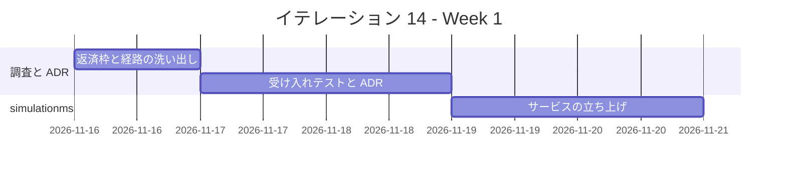
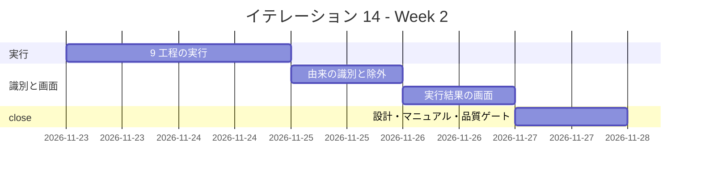
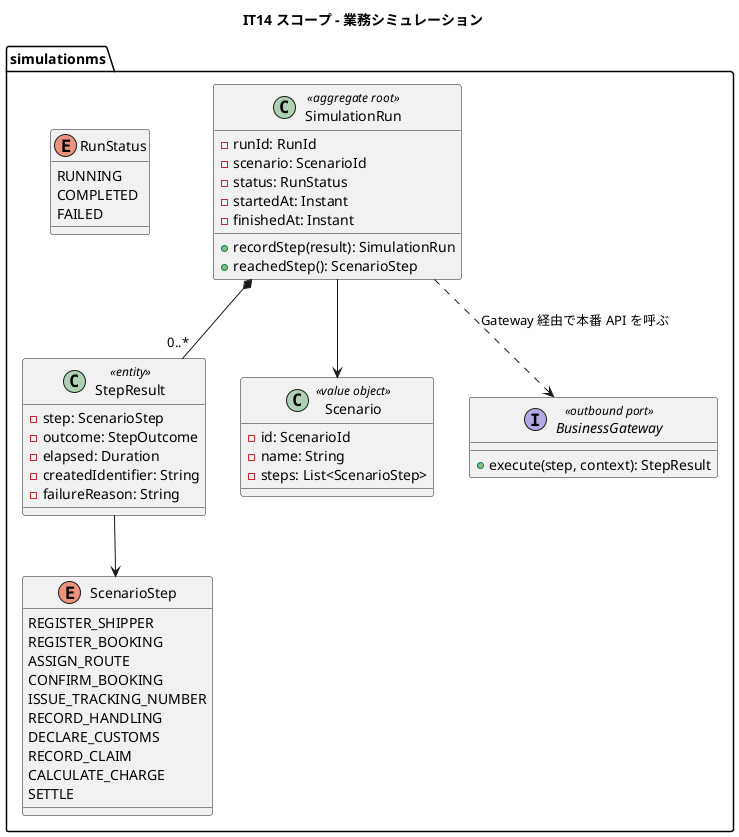
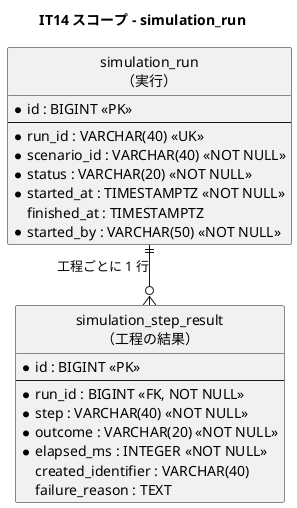

<!-- markdownlint-disable MD013 -->

# イテレーション 14 計画

## 概要

| 項目 | 内容 |
| :--- | :--- |
| イテレーション | IT14 |
| 期間 | 2026-11-16 〜 2026-11-29（2 週間） |
| ゴール | 管理者が 1 回の操作で予約から精算までを自動実行でき、どの工程まで進んだかを画面で追える状態にする |
| 対象ストーリー | US34（業務シナリオを選んで自動実行する）・US35（結果を工程ごとに確認する） |
| 計画 SP | **8**（US34 = 5・US35 = 3） |
| 局面 | **拡張・アウトサイドイン**（[開発戦略](development_strategy.md)） |
| 前提 | [IT13 完了報告書](iteration_report-13.md)・[IT13 ふりかえり](retrospective-13.md)・[Release 2.1 完了報告書](release_report-2_1_0.md) |
| リリース | [Release 2.2](release_plan.md)（業務シミュレーション） |

---

## ゴール

### イテレーション終了時の達成状態

1. **一連の業務が自動で通る**: 管理者がシナリオを選ぶと、予約登録 → 経路確定 → 予約確定 → 追跡番号発行 → 荷役 → 通関 → 引取 → 料金算出 → 精算までが順に実行される。
2. **本番と同じ経路を踏む**: 各工程はシミュレーション専用の書き込み経路を使わず、実利用者と同じ API・同じ認可を通る。
3. **どこで止まったか分かる**: 工程ごとの成否・所要時間・生成した識別子が残り、失敗した工程には理由が出る。生成した識別子から業務画面へ行ける。
4. **実データに混ざらない**: 生成された荷主・予約・請求書はシミュレーション由来と識別でき、経理の締めや追跡管理者の対応一覧に混ざらない。

### 成功基準

- [ ] US34 の受入基準 5 件・US35 の受入基準 5 件が、E2E / API / ドメインのテストで 1:1 に固定されている。
- [ ] シミュレーションは**本番と同じ API** を通る。専用の書き込み経路が存在しないことを検査で固定している。
- [ ] 本番環境では起動しないことを、設定ではなく**起動時の検査**で保証している。
- [ ] シミュレーション由来のデータが業務一覧から除外されることを、除外側の検査で固定している。
- [ ] 失敗しても途中の業務データが取り消されないことを、失敗を注入するテストで固定している。
- [ ] IT13 の Try 1〜5' を計画と DoD に反映している。
- [ ] 画面を伴うため、ユーザーマニュアルと画面キャプチャを更新する。
- [ ] テストカバレッジ 80% 以上、ドメイン層 90% 以上。

---

## 前イテレーションからの反映

### ふりかえりの Try

| # | Try | 本 IT での扱い |
| :--- | :--- | :--- |
| 1 | 実環境確認は `apply` → `rollout:image` → `rollout:restart` の 3 手を必ず踏む | Phase 6 の実環境確認タスクに 3 手を明記する。**本 IT はサービスを 1 つ増やすため、踏み外すと必ず 500 になる**。 |
| 2 | 内部 REST の呼び先を足したら、同じ変更でマニフェスト検査の対象に加える | simulationms は 6 サービスすべてを呼ぶ。**呼び先が 6 本増える**ため、`APP_*_SERVICE_BASE_URL` の検査を最初に拡張する。 |
| 3 | Phase を終えたら、同じコミットで DoD と状態表を更新する | 進捗コミットの単位を「実装 + 計画書の状態」にする。 |
| 4 | 保留にする指摘は「いつ壊れるか」を書いて送る | 本 IT の送りにも適用する。 |
| 5 | 走査トークンに Hotspot の権限を与える | **Phase 0 の返済枠に SP 付きで入れる**（4 度目。決めるだけでは解けないことが IT13 で実証された）。 |
| 5' | 品質ゲートの後に大きな変更を入れたら、ゲートを測り直す | クローズのステップ 2 を「最後のコミットに対して」実行する。DoD に明記する。 |
| 6-8 | 整合性検証・キャプチャ目視・5 視点レビューを続ける | 継続。 |

### Release 2.2 候補バックログからの持ち込み

8 SP 枠を超えるため、全件は持ち込まない。基準は「US34 / US35 と同じファイル・同じ導線を触るか」と「3 度目以上か」である。

| # | 内容 | 見積 | 本 IT での扱い |
| :--- | :--- | :--- | :--- |
| 1 | 請求書の検索・発行月の絞り込みと合計 | 5h | **送る。** 3 度目だが、シミュレーションとは触る画面・サービスが異なる。IT16 の先頭に置く。 |
| 2 | SonarQube 走査トークンへの Hotspot 権限 | 1h | **本 IT の Phase 0 に入れる**（4 度目）。 |
| 3 | 荷主向け一覧の所有判定を Read Model へ降ろす | 4h | **本 IT に入れる。** シミュレーションは貨物を継続的に増やすため、**`findRecent(100)` の外に落ちる条件を本 IT が自分で作る**。 |
| 4 | 1 荷主に複数担当者を紐付ける | 3h | 送る。 |
| 5-9 | 精算の負債・命名・E2E helper 統一 | 16h | 送る。 |

---

## ユーザーストーリー

### 対象ストーリー

| ID | ユーザーストーリー | SP | 優先度 |
| :--- | :--- | :--- | :--- |
| US34 | 業務シナリオを選んで自動実行する | 5 | 中 |
| US35 | 業務シミュレーションの結果を工程ごとに確認する | 3 | 中 |
| **合計** | | **8** | |

### ストーリー詳細

#### US34: 業務シナリオを選んで自動実行する

**として**: システム管理者

**したい**: 定義済みの業務シナリオを選んで実行し、予約から精算までを自動で通したい

**なぜなら**: 予約から精算まで手で追うには 7 ロール分のログインと 20 以上の画面操作が要り、実演のたびに手順が揺れる。配備直後にどこが切れているかを切り分ける手段も無いからだ

**対応 UC**: UC23

**受け入れ基準**:

- [ ] シナリオを選んで実行を指示すると、予約登録 → 経路確定 → 予約確定 → 追跡番号発行 → 荷役 → 通関 → 引取 → 料金算出 → 精算までが順に実行される
- [ ] 各工程は**本番と同じ API** を通る（シミュレーション専用の書き込み経路を作らない）
- [ ] 生成された荷主・予約・請求書は**シミュレーション由来であると識別できる**
- [ ] 本番環境では実行が拒否される
- [ ] 同じシナリオの二重実行が拒否され、実行中の結果へ案内される

#### US35: 業務シミュレーションの結果を工程ごとに確認する

**として**: システム管理者

**したい**: 実行がどの工程まで進み、どこで止まったかを工程ごとに見たい

**なぜなら**: 「失敗しました」だけでは、経路候補が 0 件なのか、サービス間の設定が間違っているのか、通関で止まっているのかが分からず、原因の切り分けに結局手作業が要るからだ

**対応 UC**: UC23

**受け入れ基準**:

- [ ] 工程ごとに成否・所要時間・生成した識別子（予約番号・追跡番号・請求番号）が表示される
- [ ] 失敗した工程には理由（応答コード・メッセージ）が出る
- [ ] 失敗しても、それまでに作られた業務データは**取り消されない**
- [ ] 実行の開始・終了・到達した工程が記録に残る
- [ ] 生成した識別子から、対応する業務画面（予約詳細・追跡・請求書）へ遷移できる

---

## 着手前に決めること

| # | 決めること | 組み合わせて効く既存決定 | 本 IT での決定（案。Phase 1 で ADR-030 に固定する） |
| :--- | :--- | :--- | :--- |
| A | シミュレーションの実行主体をどこに置くか | [ADR-001](../adr/001-microservices-architecture.md) は BC 単位でサービスを分けた | **`simulationms` を新設する。** 既存サービスに入れると、そのサービスだけが他の 5 サービスを呼ぶ「太い依存」を持つ。シミュレーションは業務ではなく**業務の呼び出し元**であり、独立した BC として置く。 |
| B | どうやって本番と同じ API を通るか | [ADR-004](../adr/004-gateway-jwt-verification.md) は JWT 検証を Gateway に一元化、[ADR-007](../adr/007-authenticated-user-header-required.md) は利用者ヘッダ必須 | **simulationms は Gateway 経由で、実在のデモ利用者としてログインして呼ぶ。** 内部 API や `system:` principal は使わない。使うと**認可を素通りする経路**を新設することになり、「本番と同じ」が崩れる。 |
| C | シミュレーション由来をどう識別するか | [ADR-009](../adr/009-cargo-status-columns-from-the-start.md) は状態列を最初から NOT NULL で作った | **荷主コードに予約帯（`SIM-` 接頭辞）を設け、bookingms の荷主に `simulated` 列を持つ。** 貨物・請求書は荷主から辿れる。**trackingms / billingms の一覧は荷主コードで除外する**——列を全サービスへ伝播させると、伝播漏れた 1 サービスだけが実データに混ぜる。 |
| D | 本番で動かさない保証をどう作るか | — | **設定ではなく起動時の検査にする。** `app.simulation.enabled` が真かつ環境が本番なら**起動を失敗させる**。設定値の読み違いを起動時に落とす。 |
| E | 失敗したときに巻き戻すか | IT12 の「`@Transactional` が入金の記録ごと巻き戻す」欠陥 | **巻き戻さない。** どこまで進んだかを追えることが US35 の目的であり、巻き戻すと失敗の痕跡が消える。工程ごとに独立したトランザクションで進める。 |

---

## タスク

### Phase 0: 返済枠と調査（0 SP）

| # | タスク | 見積 | 状態 |
| :--- | :--- | :--- | :--- |
| 0.1 | SonarQube 走査トークンに Hotspot の権限を与え、`sonar-local:gate` から承認できることを確かめる（**4 度目**） | 1h | [x]（**仕組みは完了・資格情報は未設定**。下記） |
| 0.2 | 荷主向け一覧の所有判定を Read Model へ降ろす（`findRecent(100)` の外に自社貨物が落ちる件。**本 IT が落ちる条件を自分で作る**） | 4h | [x] |
| 0.3 | 既存 6 サービスの「実利用者として呼べる API」を洗い出し、シミュレーションが踏む経路の一覧を作る | 3h | [x] |

#### Phase 0 の結果

**0.1 — 仕組みは用意した。残るのは資格情報だけ**（コミット `0ea3bbda6`）。

- `sonar-local:hotspots` でレビュー待ちを一覧表示し、`sonar-local:hotspot:review --key --comment` で承認できるようにした
- 権限が無いときは「`SONAR_ADMIN_TOKEN` を設定せよ」と**赤の理由を一意に**返す（従来は列挙すらできず、何をすればいいか分からなかった）
- 承認には**理由コメントを必須**にした。次に同じ指摘が出たときに読み直す材料が要る
- **利用者への依頼**: 「Administer Security」を持つ利用者でトークンを発行し、`.env` の `SONAR_ADMIN_TOKEN` に設定する

**0.2 — 完了**（コミット `6dedbfadf`）。荷主で先に絞ってから追跡を引く形にした。

- bookingms に `GET /api/v1/bookings/shipper-snapshots?shipperId=` を追加（`system:trackingms` だけ・上限なし）
- 赤で固定: 「自社貨物が直近 100 件の外にあっても一覧に出る」「一覧の経路で 1 件ずつ問い合わせない」
- 副産物として **方言スモークが動的 SQL を扱えるようにした**。`foreach` を含むステートメントはこれまで検査から漏れる形だった

**0.3 — シミュレーションが踏む経路（9 工程の対応表）**

| # | 工程 | サービス | 経路 |
| :--- | :--- | :--- | :--- |
| 0 | ログイン | authms | `POST /api/v1/auth/login` |
| 1 | 荷主登録 | bookingms | `POST /api/v1/shippers` |
| 2 | 予約登録 | bookingms | `POST /api/v1/bookings` |
| 3 | 経路設計依頼 → 割り当て | bookingms / routingms | `POST /api/v1/bookings/{id}/routing-request` → `GET /api/v1/routes` → `PUT /api/v1/bookings/{id}/route` |
| 4 | 予約確定 → 追跡番号 | bookingms | `PUT /api/v1/bookings/{id}/confirm` → `POST /api/v1/bookings/{id}/tracking-number` |
| 5 | 荷役（受領・積込・荷降し） | handlingms | `POST /api/v1/handling` |
| 6 | 通関 | handlingms | `POST /api/v1/customs` → `PUT /api/v1/customs/{declarationId}/status` |
| 7 | 引取 | handlingms | `POST /api/v1/handling`（CLAIM） |
| 8 | 料金算出 | billingms | `POST /api/v1/billing/{bookingId}/calculate` |
| 9 | 精算 | billingms | `POST /api/v1/billing/invoices/{invoiceNumber}/payment` |

> **すべて実利用者が踏む経路である。** 内部 API（`/api/v1/internal/**`・`shipper-snapshots`・
> `by-tracking-number`）は 1 つも使わない。使うと認可を素通りする経路を新設することになる。
>
> **ロールは工程ごとに違う**（営業・経路設計者・荷役作業員・追跡管理者・経理担当者）。
> シミュレーションは**工程ごとにログインし直す**——1 つの利用者に全ロールを与えると、
> 本番には存在しない権限の持ち主を作ることになり、認可の検査を素通りする。

### Phase 1: 受け入れテストと ADR（US34 / US35）

| # | タスク | 見積 | 状態 |
| :--- | :--- | :--- | :--- |
| 1.1 | US34 の 5 受入基準を E2E シナリオに翻訳し、赤を確認する | 8h | [ ] |
| 1.2 | US35 の 5 受入基準を E2E とコンポーネントテストに翻訳し、赤を確認する | 5h | [ ] |
| 1.3 | ADR-030（実行主体の置き場・本番と同じ経路・由来の識別・本番での停止・巻き戻さない方針）を起票する | 5h | [x] |
| 1.4 | ADR のコンプライアンス表に検査名を書き、`AdrComplianceTableTest` で実在確認する | 2h | [x]（決定 1・2・4・5 は名前で埋めた。決定 3 は Phase 4） |

### Phase 2: simulationms の立ち上げ（US34）

| # | タスク | 見積 | 状態 |
| :--- | :--- | :--- | :--- |
| 2.1 | Gradle サブプロジェクト・Flyway・ArchUnit・k8s マニフェストを既存サービスの型どおりに作る | 6h | [x] |
| 2.2 | `Scenario`・`ScenarioStep`・`SimulationRun`・`StepResult` のドメインモデルを TDD で実装する | 8h | [x]（永続化まで実施） |
| 2.3 | Gateway に `/api/v1/simulations` を振り分け、`ROLE_ADMIN` だけが叩けることを固定する | 4h | [x] |
| 2.4 | 本番環境では起動を失敗させる検査を実装する（設定ではなく起動時） | 3h | [x] |

### Phase 3: 工程の実行（US34）

| # | タスク | 見積 | 状態 |
| :--- | :--- | :--- | :--- |
| 3.1 | デモ利用者としてログインし、Gateway 経由で呼ぶ実行基盤を作る（**内部 API を使わないことを検査で固定**） | 8h | [~]（出口 1 ポートと内部 API 不使用の検査は完了。ログイン実装は次） |
| 3.2 | 予約登録 → 経路確定 → 予約確定 → 追跡番号発行の 4 工程を実装する | 8h | [ ] |
| 3.3 | 荷役 → 通関 → 引取 → 料金算出 → 精算の 5 工程を実装する | 8h | [ ] |
| 3.4 | 二重実行の拒否と、工程ごとの独立トランザクション（巻き戻さない）を固定する | 5h | [ ] |

### Phase 4: 由来の識別と除外（US34）

| # | タスク | 見積 | 状態 |
| :--- | :--- | :--- | :--- |
| 4.1 | 荷主コードの `SIM-` 帯と bookingms の `simulated` 列を追加する | 4h | [ ] |
| 4.2 | 精算の締め対象・未解決例外一覧・荷主向け一覧から、シミュレーション由来を除外する | 6h | [ ] |
| 4.3 | **除外側の検査**を置く（シミュレーション由来を 1 件作り、各一覧に出ないことを確かめる） | 5h | [ ] |

### Phase 5: 実行結果の画面（US35）

| # | タスク | 見積 | 状態 |
| :--- | :--- | :--- | :--- |
| 5.1 | `/admin/simulations` 一覧と `/admin/simulations/:runId` 詳細を MSW で実装する | 8h | [ ] |
| 5.2 | 工程ごとの成否・所要時間・識別子・失敗理由を出す | 5h | [ ] |
| 5.3 | 生成した識別子から予約詳細・追跡・請求書へ遷移する導線を作り、**押した先で 403 にならない**ことを確かめる | 4h | [ ] |
| 5.4 | `ROLE_ADMIN` のサイドバーとダッシュボードに入口を追加し、ナビ表示テストを置く | 3h | [ ] |

### Phase 6: 設計・マニュアル・品質ゲート

| # | タスク | 見積 | 状態 |
| :--- | :--- | :--- | :--- |
| 6.1 | `architecture_backend.md`・`domain-model.md`・`data-model.md`・`ui_design.md` に simulationms と実行記録を反映する（**8 サービス目**。「未着手のサービスはもうありません」の記述も改訂する） | 8h | [ ] |
| 6.2 | ユーザーマニュアルに「業務シミュレーション」章を追加し、キャプチャを撮る | 6h | [ ] |
| 6.3 | 実環境で `apply` → `rollout:image` → `rollout:restart` を踏み、シナリオ 1 本を通す | 6h | [ ] |
| 6.4 | `./gradlew build`、`TZ=UTC ./gradlew test`、frontend test / build、E2E、JIG / jig-erd を実行する | 8h | [ ] |
| 6.5 | **最後のコミットに対して** SonarQube を回し、Quality Gate PASS を確認する（IT13 Try 5'） | 2h | [ ] |

### 見積もり合計

| カテゴリ | SP | 理想時間 | 状態 |
| :--- | :--- | :--- | :--- |
| Phase 0: 返済枠と調査 | 0 | 8h | [ ] |
| Phase 1: 受け入れテストと ADR | 1 | 20h | [ ] |
| Phase 2: simulationms の立ち上げ | 2 | 21h | [ ] |
| Phase 3: 工程の実行 | 2 | 29h | [ ] |
| Phase 4: 由来の識別と除外 | 1 | 15h | [ ] |
| Phase 5: 実行結果の画面 | 2 | 20h | [ ] |
| Phase 6: 設計・マニュアル・品質ゲート | 0 | 30h | [ ] |
| **合計** | **8** | **143h** | |

**1 SP あたり**: 約 17.9h

**進捗率**: 約 44%（3.5 / 8 SP。Phase 0〜2 完了・Phase 3 着手）

---

## スケジュール

### Week 1（Day 1-5）

| 日 | タスク |
| :--- | :--- |
| Day 1 | Phase 0（Hotspot 権限・所有判定・経路の洗い出し） |
| Day 2 | US34 / US35 の受け入れテスト Red |
| Day 3 | ADR-030 起票、コンプライアンス検査 |
| Day 4 | simulationms の骨格（Gradle・Flyway・ArchUnit・k8s） |
| Day 5 | ドメインモデル、Gateway 振り分け、本番での起動失敗 |

### Week 2（Day 6-10）

| 日 | タスク |
| :--- | :--- |
| Day 6 | 実行基盤（デモ利用者ログイン・Gateway 経由）、前半 4 工程 |
| Day 7 | 後半 5 工程、二重実行の拒否、巻き戻さない検査 |
| Day 8 | `SIM-` 帯と除外、除外側の検査 |
| Day 9 | 実行結果の画面、遷移導線、ナビ |
| Day 10 | 設計反映、マニュアル、実環境確認、品質ゲート |

---

## 設計

### ドメインモデル

> **`BusinessGateway` は 1 本しかない。** 各サービスへ直接つなぐ ACL を 6 本作ると、
> そのうち 1 本でも内部 API を向いた時点で「本番と同じ経路」が崩れる。
> 出口を 1 つに絞り、**Gateway だけを見る**ことを構造で強制する。

### データモデル

> **`simulated` 列は bookingms の `shipper` にだけ足す。** 全サービスへ伝播させると、
> 伝播漏れた 1 サービスだけが実データに混ぜる。他サービスは荷主コードの `SIM-` 帯で判断する。

### API 設計

| メソッド | エンドポイント | 説明 |
| :--- | :--- | :--- |
| GET | `/api/v1/simulations/scenarios` | 実行できるシナリオの一覧 |
| POST | `/api/v1/simulations` | シナリオを指定して実行を開始する |
| GET | `/api/v1/simulations` | 実行の一覧 |
| GET | `/api/v1/simulations/{runId}` | 工程ごとの結果 |

### ADR

| ADR | タイトル | ステータス |
| :--- | :--- | :--- |
| ADR-030 | 業務シミュレーションは Gateway 経由で本番の経路を踏み、由来を荷主コードで識別する | 提案（Phase 1 で起票） |

---

## リスクと対策

| # | リスク | 影響 | 対策 |
| :--- | :--- | :--- | :--- |
| 1 | 「速く通す」ために内部 API を直接呼びたくなる | 認可を素通りする経路が新設され、「本番と同じ」が崩れる | 出口を `BusinessGateway` 1 本に絞り、**内部 API を参照していないことを ArchUnit で固定**する |
| 2 | シミュレーションのデータが実データに混ざる | 経理の締めと例外対応が信用できなくなる | 除外**される側**ではなく除外**する側**に検査を置く（Phase 4.3） |
| 3 | サービスが 1 つ増え、実環境の設定漏れで 500 になる | IT5・IT12・IT13 と同型（3 度目） | `APP_*_SERVICE_BASE_URL` の検査を Phase 0 で拡張し、Phase 6.3 で 3 手を踏む |
| 4 | 9 工程の実装が 8 SP に収まらない | IT14 が閉じない | 落とす順序を決めておく——(1) 通関、(2) 精算、(3) 料金算出。**予約〜追跡番号発行までは落とさない**（ここが通らなければ何も確かめられない） |
| 5 | 失敗時に巻き戻したくなる | 失敗の痕跡が消え、US35 の目的が失われる | 工程ごとに独立トランザクション。**失敗を注入するテスト**で固定する |

---

## 整合性検証結果

### 詳細整合性検証（`validating-iteration-plan`）

| ステップ | 検証対象 | 結果 | 不整合件数 |
| :--- | :--- | :--- | :--- |
| 1 | テンプレートフォーマット | OK | 0 |
| 2 | ユーザーストーリー（US34・US35 の受入基準 5 件ずつ） | OK（正典と 1:1） | 0 |
| 3 | ドメインモデル | **注記あり** | 1 |
| 4 | データモデル | **注記あり** | 2 |
| 5 | UI 設計（ビュー・ナビゲーション・RBAC） | **注記あり** | 1 |
| 6 | アーキテクチャ（バックエンド） | **注記あり** | 1 |
| 7 | ゴールの整合性 | OK | 0 |
| 8 | 過去レビュー指摘事項（IT13 高 3 件） | OK（Try 3・5' として反映） | 0 |

#### 設計ドキュメントへの反映が必要な注記

**いずれも「設計が先に無い」種類の欠落であり、本 IT で反映する**（Phase 6.1）。

| # | 内容 | 反映先 | 扱い |
| :--- | :--- | :--- | :--- |
| 1 | `SimulationRun`・`StepResult`・`Scenario`・`ScenarioStep` が未記載 | `domain-model.md` | 本 IT で反映 |
| 2 | `simulation_run`・`simulation_step_result` が未記載 | `data-model.md` | 本 IT で反映 |
| 3 | `shipper.simulated` 列と荷主コードの `SIM-` 帯が未記載 | `data-model.md` | 本 IT で反映 |
| 4 | `/admin/simulations`・`/admin/simulations/:runId` と RBAC マトリクスが未記載 | `ui_design.md` | 本 IT で反映 |
| 5 | **simulationms が BC 一覧に無い**（現在 7 サービス前提。「未着手のサービスはもうありません」の記述も古くなる） | `architecture_backend.md` | 本 IT で反映 |

### 横断整合性検証（`validating-design`）

| 軸 | 検証対象 | 結果 | 不整合件数 |
| :--- | :--- | :--- | :--- |
| A | 開発戦略 ↔ 計画 | **修正済み** | 1 |
| B | 設計トピックカバレッジ | 注記あり（上表 5 件） | 5 |
| C | 計画 ↔ 過去計画（命名・BC 独立性・共有カーネル・認可パターン） | OK | 0 |

**軸 A の不整合（修正済み）**: 開発戦略は IT13 までしか局面を定義していなかった。
**拡張局面（IT14〜IT15 / Release 2.2）を追加**し、IT14 = アウトサイドイン、
IT15 = インサイドアウトと定義した。あわせて「終盤 → 拡張」の移行方針
（サービス立ち上げの型を踏襲する）と、この局面で守る規律 3 件を明記した。

**軸 C で確認したこと**:

- **BC 独立性**: simulationms のドメイン層は他 BC の型を持ち込まない。出口は `BusinessGateway` の 1 ポートのみで、ArchUnit の BC 分離ルールはポートのパッケージだけを除外する（IT7 で確立した規約を踏襲）
- **サービス立ち上げの型**: IT2・IT3・IT7・IT11 と同じ手順（Gradle サブプロジェクト・Flyway・ArchUnit・k8s マニフェスト・`APP_*_SERVICE_BASE_URL` の検査）を Phase 2.1 に置いた
- **認可パターン**: [ADR-004](../adr/004-gateway-jwt-verification.md)（Gateway で JWT 検証）・[ADR-007](../adr/007-authenticated-user-header-required.md)（利用者ヘッダ必須）を踏襲し、**新しい認可の抜け道を作らない**ことを決定 B に明記した
- **ユビキタス言語**: 「実行（run）」「工程（step）」「シナリオ（scenario）」を新しく導入する。既存語（予約・経路・荷役・通関・精算）はそのまま使い、言い換えない

## 完了条件

### Definition of Done

- [ ] US34 / US35 の受け入れテストが Red → Green で実装されている。
- [ ] シミュレーションが内部 API を呼んでいないことを ArchUnit で固定している。
- [ ] 本番環境で起動が失敗することを検査で固定している。
- [ ] シミュレーション由来が業務一覧から除外されることを、除外側の検査で固定している。
- [ ] 失敗しても途中の業務データが残ることを、失敗を注入するテストで固定している。
- [ ] `ROLE_ADMIN` のナビゲーションと遷移導線が実装され、押した先で 403 にならない。
- [ ] `domain-model.md`、`data-model.md`、`ui_design.md`、ユーザーマニュアルを更新している。
- [ ] マニュアル用キャプチャを撮り直し、目視で UI 欠陥がないことを確認している。
- [ ] `./gradlew build`、`TZ=UTC ./gradlew test`、frontend test / build、E2E、JIG / jig-erd が完了している。
- [ ] **最後のコミットに対して** SonarQube を回し、Quality Gate が PASS である（IT13 Try 5'）。
- [ ] 5 視点レビューを実施し、高優先度をすべて対応または明示的に送っている。

### デモ項目

| # | デモ | 対応する受入基準 |
| :--- | :--- | :--- |
| 1 | 管理者が「一般貨物の標準輸送」を選んで実行すると、9 工程がすべて成功する | US34-1 |
| 2 | 生成された予約が予約一覧に出て、荷主コードが `SIM-` で始まる | US34-3 |
| 3 | 生成された請求書が**精算の締め対象に出ない** | US34-3 |
| 4 | 同じシナリオを実行中にもう一度実行すると拒否され、実行中の結果へ案内される | US34-5 |
| 5 | 経路候補が 0 件になるシナリオでは、経路確定の工程で止まり理由が出る | US35-2 |
| 6 | 止まった実行でも、それまでに作られた予約は残っている | US35-3 |
| 7 | 実行結果の追跡番号を押すと、追跡画面が開く（403 にならない） | US35-5 |

---

## 更新履歴

| 日付 | 内容 | 担当 |
| :--- | :--- | :--- |
| 2026-08-31 | 初版作成 | - |

---

## 関連ドキュメント

- [リリース計画](release_plan.md)
- [開発戦略](development_strategy.md)
- [IT13 ふりかえり](retrospective-13.md)
- [IT13 完了報告書](iteration_report-13.md)
- [Release 2.1 完了報告書](release_report-2_1_0.md)
- [ユーザーストーリー](../requirements/user_story.md)
- [システムユースケース](../requirements/system_usecase.md)（UC23）
