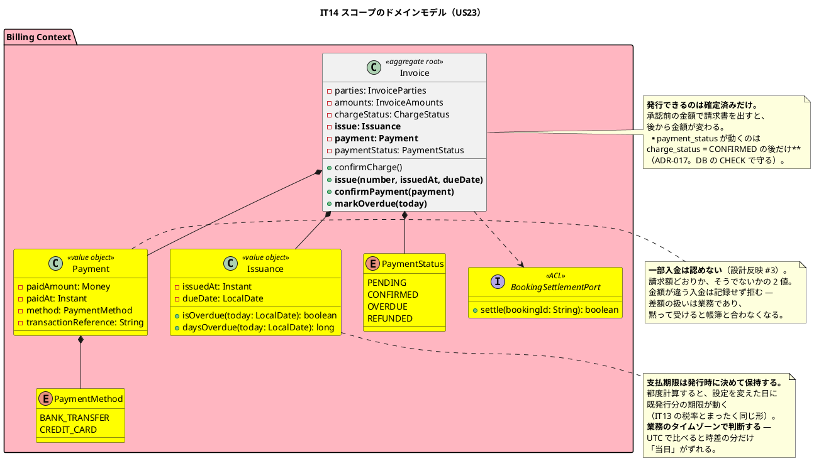
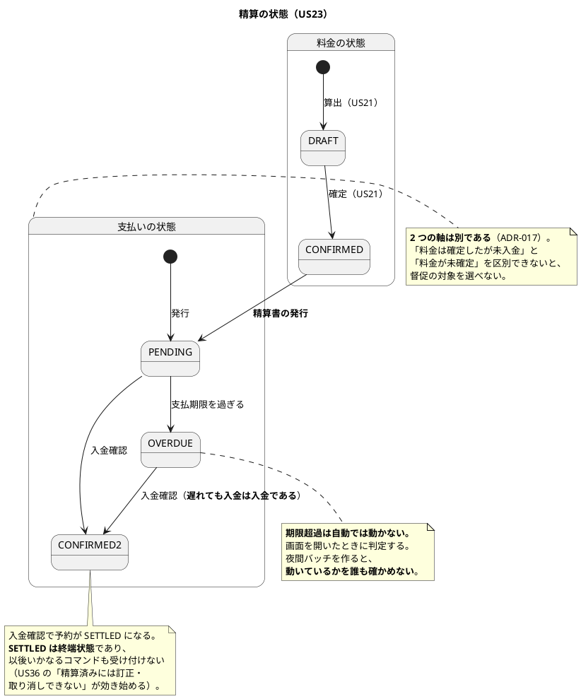
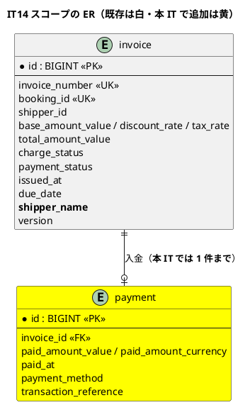
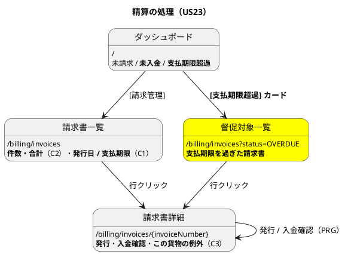

# イテレーション 14 計画

## 概要

| 項目 | 内容 |
| :--- | :--- |
| イテレーション | IT14 |
| リリース | 2.0 精算 |
| 期間 | 2026-08-10 〜（10 営業日相当） |
| 局面 | **精算**（`development_strategy.md`。アプローチ: **アウトサイドイン**。理由は後述） |
| 計画 SP | **5SP**（US23 5SP） |
| 前提 | IT13 クローズ済み（累計 102SP / 102SP、13 IT 連続で計画 = 実績。ベロシティ平均 7.85） |

---

## ゴール

**「請求した」で終わらせず、「入金を確認して閉じる」まで通す。**

IT13 で料金を算出し確定できるようになった。しかし**確定した金額は請求書として荷主に届かず、入金も追えない**。経理担当者から見ると、金額が決まっただけで**取引はまだ閉じていない**。

本 IT で、精算書を発行し、荷主に通知の記録を残し、入金を確認して**予約を `SETTLED`（終端状態）へ進める**。ここまでで「予約 → 追跡 → 引取 → 請求 → 精算」の一本道が完成する。

---

## なぜアウトサイドインに戻すか（**局面の名前ではなく条件で選ぶ**）

IT13 はインサイドアウトだった。理由は「Billing に集約が 1 つも無く、金額の丸め規則を確定させる必要がある」ことだった。**本 IT はその条件を満たさない。**

| 条件 | IT13 | 本 IT |
| :--- | :--- | :--- |
| 集約 | ゼロから作る | **`Invoice` は既にある**。支払いの軸を足す |
| 金額の計算 | 丸め規則を確定させる | **金額は確定済みで動かさない**（確定後は不変） |
| 新規ポート | 2 つ同時 | **1 つ**（`BookingSettlementPort`） |
| 主眼 | 金額の正しさ | **業務が最後まで流れること** |

**終盤（IT7〜IT12）と同じ条件なので、同じ選択をする。** 業務シナリオ「発行 → 通知 → 入金確認 → 精算完了」を受け入れテストで束ね、そこから内側を埋める。

> **例外が 1 つある。支払期限の計算と状態遷移だけは先にドメインで固める。**
> 期限は日付であり<strong>時差でずれる</strong>（`feedback_business-timezone-not-utc` の型）。
> 督促の対象を決める値でもあるため、画面から下ろすと表示都合が混ざる。

---

## 5SP をどう使うか

| 区分 | SP / 見積 | 内容 |
| :--- | :--- | :--- |
| ストーリー | 5SP / 約 30h | US23 |
| **返済枠** | — / 約 26h | **IT13 レビューの高 4 件（C1〜C4）＋ 中 8 件** |

**ベロシティ 7.85 に対して 5SP である。** 差の分をまるごと返済に充てる。**「余力次第」ではなく、計画として先に確保した枠**である（Try T8。9 IT 連続）。

> **返済枠がストーリー本体に近い規模になっている。** IT13 のレビューで高 13 件が出て、
> うち 4 件を送ったためである。**送った以上は返す** — 送り先を決めずに「余力次第」に
> すると固定化する（`retrospective-9.md` の ADR-008 が 3 回繰り越された形）。

---

## 前イテレーションの学びの反映（ふりかえり Try）

IT13 のふりかえり（`retrospective-13.md`）の Try 9 件を、本計画のタスクと DoD に落とす。

| Try | 内容 | 本計画への反映 |
| :--- | :--- | :--- |
| **T1** | **表示用の型に計算を書かない。** 画面に出す値は集約が計算したものをそのまま渡す。View に引き算・足し算を書いたら、それは集約に無い値である合図 | **DoD に置く。** 本 IT は支払期限・未入金額・経過日数と、**計算したくなる値が並ぶ**。IT13 の H1 と同じ形を作らない |
| **T2** | **「2 つの条件が同時に成り立つ」組み合わせを数え上げる。** 片方ずつは通っているが両方は踏んでいない道 | タスク 4-2。本 IT の組み合わせは「期限超過 × 一部入金」「法人 × 調整あり × 精算」 |
| **T3** | **運用要件とマニュアルに書いた作業は、できることをテストで固定する** | タスク 5-0。R1 の月次業務（締め・一括発行・督促）が**実際に回せるか**を検査する |
| **T4** | **「実装しなかった守り」の数え上げに、本番コードの Javadoc とテンプレートのコメントを含める** | タスク 5-0。IT13 は 3 IT 連続で「主張したが実在しない守り」を出した |
| **T5** | **破壊検証を既存のテストにも向ける。** 「この検査は何を壊せば赤になるか」を主要なテストで 1 度確かめる | タスク 4-4。IT13 で空振りが 1 件見つかった |
| **T6** | **破壊検証は「テストが赤になったか」で判定する。** コンパイルエラーと区別し、失敗の記録が stderr に出る前提で見る | タスク 4-4 の手順 |
| **T7** | **E2E の新規 spec は、既存 spec の「準備の作法」を差分で確かめてから書く** | タスク 4-1。IT13 は `page.on('dialog')` の写し忘れで**痕跡の残らない失敗**を踏んだ |
| **T8** | **返済枠は IT 序盤の独立コミットで先に着手する**（9 IT 連続） | **タスク 0 を最初に置く** |
| **T9** | **検査が止めたら回避せず構造を直す**（IT13 で 11 回実践） | 進め方。Checkstyle・SpotBugs・ArchUnit・H2 スモークを合図として扱う |

---

## 返済枠（タスク 0。**序盤に先に着手する**）

### 返すもの（**IT13 レビューで送った高 4 件は必ず返す**）

| # | 内容 | 由来 | 扱い |
| :--- | :--- | :--- | :--- |
| **C1** | **請求対象一覧に引取日が無く、月次の締めができない** | IT13 レビュー高（user） | **返す。** 前月分と当月分を切り分ける道具が無い。**US23 の「支払期限」と同じ日付の扱い**であり、まとめて片づく |
| **C2** | **請求書一覧に件数・合計が無い。** 総勘定元帳と突き合わせられない | IT13 レビュー高（user） | **返す。** US23 の督促一覧も同じ形を要る |
| **C3** | **例外の中身が請求の画面から読めない** | IT13 レビュー高（user） | **返す。** IT13 で予約詳細への到達は開いたが、請求書詳細に並ばない |
| **C4** | **N+1。** ダッシュボードが表示のたびに全件走査。一覧は 1 行あたり約 4 クエリ | IT13 レビュー高（programmer / architect） | **返す。** 件数は `COUNT` に分け、ポートに一括版を足す。**US23 で一覧が増える前に直す** |
| **C5** | 調整と割引の適用順を業務判断として明示する（補償費用にも割引が掛かる）。`domain-model.md` の計算式に `Adjustment` が無い | IT13 レビュー中 | **返す。** 請求書を荷主に出す以上、根拠の説明が要る |
| **C6** | 法人かどうかを割引率から判断している（契約 0% の法人が個人として復元される） | IT13 レビュー中 | **返す** |
| **C7** | 確定済み請求書の荷主名を毎回引き直している（改名すると宛名が変わる） | IT13 レビュー中 | **返す。** 請求書を発行する以上、**宛名が後から変わってはならない** |
| **C12** | 確定を戻せないことの暫定運用がマニュアルに無い | IT13 レビュー中 | **返す。** US23 で精算の取り消しを扱うため、同時に決める |
| **C14** | 引取済みかの真実が 2 つある（`cargo.claimed()` と `TrackingStatusPort`） | IT13 レビュー中 | **返す** |
| **C16** | **ダッシュボードの案内がロールの列挙で 2 回露見した。** 条件を「カードが 1 枚も無いこと」に変えられないか | IT13 クローズ後 | **返す。** 検査では止められるようにしたが、根本は条件の書き方にある |

### 返さないもの（**理由を明記する**）

| # | 内容 | 理由 |
| :--- | :--- | :--- |
| C8 | `VoyageRescheduledEvent` の取りこぼしが沈黙する | **IT15 で返す。** 結果整合の再同期はイベント全体の設計であり、US23 と同時に触ると両方が中途半端になる。**名前で IT15 に送る** |
| C9 | ADR-016 の移行条件（調整 3 種類で明細テーブルへ）を検知する仕掛け | **IT15 で返す。** 本 IT で調整の種類は増えない |
| C13 | `Invoice.version` が `final`。1 トランザクション内で調整→確定すると必ず競合 | **本 IT で顕在化する可能性がある**（発行→入金確認を続けて行う場合）。**タスク 1 で触るため、そこで直す**（返済枠ではなく本体に含める） |
| C15 | 分岐カバレッジ 72.8% | **測って記録するに留める。** 数値目標は置かない |

---

## 対象ユーザーストーリー

| ID | ユーザーストーリー | SP | 優先度 | Issue |
| :--- | :--- | :--- | :--- | :--- |
| US23 | 精算を処理する | 5 | 必須 | [#513](https://github.com/k2works/case-study-cargo-tracker/issues/513) |

> マイルストーンは `[java/take-6] Release 2.0 精算`（#52）、ラベルは `it14` である。

### 受入基準

受入基準の正典は [ユーザーストーリー](../requirements/user_story.md) である。**本計画に書き写さず引用する。**

- US23: [US23 の受入基準](../requirements/user_story.md#us23-精算を処理する)

### 受入基準のうち解釈が要るもの（**括弧の中まで読む**）

| 内容 | 扱い | 理由 |
| :--- | :--- | :--- |
| US23「**「確定」状態の輸送料金**をもとに精算書を発行できる」 | **`ChargeStatus.CONFIRMED` を入口にする。** 下書きからは発行できない | 確定は経理担当者が金額を承認した印である（ADR-017）。承認前の金額で請求書を出すと、後から金額が変わる |
| US23「精算書（**請求番号・請求金額・支払い期限**）」 | **支払期限を発行時に決めて保持する。** 発行日から N 日後を設定値で持つ | **期限は督促の対象を決める値である。** 都度計算すると、設定を変えた日に既発行分の期限が動く（IT13 の税率と同じ形） |
| US23「精算書が荷主に**メール通知される**」 | **記録を残す**（ADR-006 により外部へは送らない）。通知種別を分ける | 「送ったつもり」の検知が US12 で作った記録の目的である。**状態更新に混ぜると履歴で判別できない** |
| US23「**決済機関との連携**により入金確認ができる」 | **内部シミュレーション**（ADR-006）。経理担当者が入金を記録する画面にする | 外部連携はスコープ外。**実体のない連携先の契約テストは契約を保証しない** |
| US23「入金確認後、精算状態が「精算済」に更新され**予約状態も「精算済」になる**」 | **`BookingSettlementPort` で Booking に伝える。** `DELIVERED → SETTLED`（遷移表 #8） | `SETTLED` は**終端状態**であり、以後いかなるコマンドも受け付けない（US36 の「精算済みには訂正・取り消しできない」が効き始める） |
| US23「**支払い期限超過時**、経理担当者に未払い通知が送信される」 | **画面で気づける形にする**（ダッシュボードのカード＋一覧）。**通知の自動送信は作らない** | 送信の仕組みを先に作っても、**受け取る人が見る場所が無ければ届かない**。IT13 の R2 で「拾えなかった実績が出てから作る」と決めた形に揃える |
| **返金** | **本 IT では作らない。** 精算の取り消しも作らない | `release_scope.md` のスコープ外。**ただし「間違えたときどうするか」は運用として書く**（C12） |

---

## 設計への反映が必要（当該 IT で対応）

着手前の突合で見つかった差分。**当該 IT で設計ドキュメントに反映する。**

| # | 対象 | 内容 | 反映先 |
| :--- | :--- | :--- | :--- |
| 1 | `domain-model.md` | **支払期限（`due_date`）を決める規則が無い。** 発行日から何日後かが定義されていない | `domain-model.md` |
| 2 | `domain-model.md` | **`Payment`（支払記録）が要素表に無い。** `data-model.md` にはテーブルがある | `domain-model.md` |
| 3 | `domain-model.md` | **一部入金を認めるかが定義されていない。** 認めるなら「未入金額」の概念が要る | 判断を後述 |
| 4 | `domain-model.md` | 計算式に `Adjustment` が反映されていない（C5） | `domain-model.md` |
| 5 | `ui_design.md` | **督促の対象一覧（支払期限超過）の画面が無い。** ダッシュボードのカードは定義済みだが行き先が無い | `ui_design.md` |
| 6 | `ui_design.md` | 請求書一覧に**件数・合計・日付**が無い（C1 / C2） | `ui_design.md` |
| 7 | `ui_design.md` | 請求書詳細に**例外の記録**が無い（C3） | `ui_design.md` |
| 8 | `data-model.md` | **請求書に宛名を凍結する列が無い**（C7）。荷主名が後から変わる | `data-model.md`・V31 |
| 9 | `non_functional.md` | ROLE_BILLING の権限範囲に発行・入金確認・督促が無い | `non_functional.md` §4.1 |
| 10 | ADR-017 | **「`payment_status` が動くのは `CONFIRMED` の後だけ」が口約束のまま。** DB 制約でも検査でもない | 判断を後述 |
| 11 | `test_strategy.md` | US23 のテスト方針（日付・状態遷移・終端状態） | `test_strategy.md` |
| 12 | `architecture_backend.md` | 実装状況の `billing/` を更新する | `architecture_backend.md` |
| 13 | `domain-model.md` | **`PaymentStatus` は Java に未実装である**（着手前の検証で判明）。要素表と DB の `CHECK` にはあるが、IT13 では作らなかった（支払いの軸を触らなかったため） | 本 IT で新規実装 |
| 14 | `NotificationType` | **精算書の発行を知らせる通知種別が無い。** `CLAIM_CODE_RESENT` までで、請求に関する種別を持たない | `NotificationType`・V31 の `CHECK` |

> **#13 は「未実装のものを既存と読み違えた」ものである。** 着手前の検証で拾えた。
> `domain-model.md` の ACL ポート表が「実装」列を持っているのと同じ理由で、
> <strong>要素表にも「あるが未実装」が混ざる</strong>。図に描いてあることは
> 実装されていることを意味しない。

### 設計反映 #3 の方針（**一部入金を認めるか**）

**認めない。** 入金は「請求額どおりか、そうでないか」の 2 値として扱う。

- US23 の受入基準は「入金確認後、精算状態が『精算済』に更新され」であり、**部分的な状態を要求していない**
- 一部入金を認めると「未入金額」「入金の履歴」「一部入金中の督促」が芋づるで要る。**要求元のないものは作らない**（`release_scope.md` の原則 3）
- **金額が違う入金は記録せず、拒む。** 差額の扱いは業務（過入金は返金、不足は再請求）であり、システムが黙って受けると帳簿と合わなくなる

> **`payment` テーブルは 1 請求書 1 行として使う。** 複数行を許す構造だが、
> 本 IT では 1 行しか作らない。**構造が許すことと、業務が許すことは別である。**

### 設計反映 #10 の方針（**ADR-017 の口約束を検査にする**）

**DB の `CHECK` 制約にする。**

```sql
CHECK (payment_status = 'PENDING' OR charge_status = 'CONFIRMED')
```

ADR-017 は「状態を 1 つにまとめると後から分けるほうが高くつく」と述べて軸を分けた。**分けた後の不変条件を口約束のままにするのは非対称である**（IT13 レビューの指摘）。

---

## 設計（IT14 スコープ）

### ドメインモデル図



### 状態遷移図（IT14 スコープ）



### ER 図（IT14 スコープ）



> **`payment` テーブルは V1 で作成済みである**（IT13 で `invoice` を作り直そうとして
> Flyway が落ちた教訓）。**本 IT で足すのは `invoice.shipper_name` の 1 列**（C7）と、
> ADR-017 の `CHECK` 制約である。
>
> **`issued_at` / `due_date` も V1 にある。** 使い始めるだけであり、追加は要らない。
>
> **宛名を凍結する。** 荷主が改名すると確定済みの請求書の宛名が変わる（C7）。
> 金額を丸め後スナップショットで持っているのと同じ理由である。

### 画面遷移図（IT14 スコープ）



> **督促対象一覧は請求書一覧の絞り込みである**（新しい画面を作らない）。
> `ui_design.md` が既に `?status=OVERDUE` を定めている。
> **カードの行き先を実在させる**のが本 IT の仕事である。

### インタラクション（既存規約に従う）

| 項目 | 方式 |
| :--- | :--- |
| フォーム送信後の遷移 | **PRG**（発行・入金確認とも） |
| フィードバック | `alert-success` / `alert-warning` / `alert-danger` |
| 確認ダイアログ | 発行と入金確認に付ける。**E2E では `page.on('dialog', accept)` を張る**（T7） |

---

## タスク分解

### 0. 返済枠（**最初に着手する**。T8。9 IT 連続）

| # | タスク | 見積 |
| :--- | :--- | :--- |
| 0-1 | ✅ **C4: N+1 を解く。** 件数を `COUNT` に分け、ポートに一括版（`findByBookingIds`）を足す。**一覧が増える前に直す** | 5.0h |
| 0-2 | ✅ **C1 / C2: 請求対象一覧に引取日、請求書一覧に発行日・支払期限・件数・合計** | 4.5h |
| 0-3 | ✅ **C3: 請求書詳細に「この貨物の例外」を読み取り専用で出す** | 2.5h |
| 0-4 | ✅ **C7: 宛名を請求書に凍結する**（V31。荷主が改名しても変わらない） | 3.0h |
| 0-5 | ✅ **C5 / C6: 調整と割引の適用順を `domain-model.md` に明示。法人判定を割引率から切り離す** | 3.5h |
| 0-6 | ✅ **C14: 引取済みかの真実を 1 つにする**（どちらが正典かを決めて片方を消す） | 2.0h |
| 0-7 | ✅ **C16: ダッシュボードの案内をロールの列挙から「カードが 1 枚も無いこと」へ** | 3.0h |
| 0-8 | ✅ C12: 確定を戻せないことの暫定運用をマニュアルに書く（**US23 の精算取り消しと同時に決める**） | 2.5h |
| | **小計** | **26.0h** |

### 1. ドメイン（**期限と状態遷移だけ先に固める**）

| # | タスク | 見積 |
| :--- | :--- | :--- |
| 1-1 | ✅ `Issuance`（発行日時・支払期限）。**業務のタイムゾーンで期限を判断する。`TZ=UTC` でも緑にする** | 3.0h |
| 1-2 | ✅ `Payment` と `PaymentMethod`。**一部入金を拒む**（設計反映 #3） | 2.5h |
| 1-3 | ✅ `PaymentStatus`（**Java には未実装だった**。設計反映 #13）と `Invoice.issue` / `confirmPayment` / `markOverdue`。**発行できるのは確定済みだけ** | 3.5h |
| 1-4 | ✅ **C13: `version` の扱いを直す**（1 トランザクション内で 2 回更新できる形にする） | 2.0h |
| | **小計** | **11.0h** |

### 2. ACL ポートと永続化

| # | タスク | 見積 |
| :--- | :--- | :--- |
| 2-1 | ✅ `BookingSettlementPort`（`DELIVERED → SETTLED`）＋ Booking 側アダプタ。**ポートを足したら `./gradlew test` をフルで回す** | 3.0h |
| 2-2 | ✅ `V31`（`invoice.shipper_name`・ADR-017 の `CHECK`）＋`payment` の読み書き | 3.0h |
| 2-3 | ✅ Testcontainers のテスト（**終端状態・期限超過・一部入金の拒否**） | 2.5h |
| | **小計** | **8.5h** |

### 3. アプリケーションと画面

| # | タスク | 見積 |
| :--- | :--- | :--- |
| 3-1 | ✅ 精算書の発行（PRG）＋**通知の記録**（`INVOICE_ISSUED` を新設。設計反映 #14） | 3.5h |
| 3-2 | ✅ 入金確認（PRG）＋予約を `SETTLED` へ | 3.0h |
| 3-3 | ✅ 督促対象一覧（`?status=OVERDUE`）＋ダッシュボードのカード（ADR-014） | 2.5h |
| 3-4 | ✅ 認可。**T10 の系: 「見えないこと」をその請求書が存在する状態で確かめる** | 1.5h |
| | **小計** | **10.5h** |

### 4. テストと検証

| # | タスク | 見積 |
| :--- | :--- | :--- |
| 4-1 | ✅ **E2E: 確定 → 発行 → 入金確認 → 予約が精算済**（T7: 既存 spec の作法を差分で確かめてから書く） | 3.0h |
| 4-2 | ✅ **T2: 組み合わせを数え上げる**（期限超過 × 入金確認、法人 × 調整 × 精算） | 2.5h |
| 4-3 | ✅ **T3: 運用要件 R1 の月次業務が実際に回せるかを検査する** | 2.0h |
| 4-4 | ✅ **T5 / T6: 破壊検証を既存のテストにも向ける。** 主要なテストについて「何を壊せば赤になるか」を確かめる | 3.0h |
| 4-5 | ✅ **`TZ=UTC ./gradlew check`**（支払期限は日付である） | 1.0h |
| | **小計** | **11.5h** |

### 5. ドキュメント

| # | タスク | 見積 |
| :--- | :--- | :--- |
| 5-0 | ✅ **T4: 「実装しなかった守り」を数える。** 受入基準・マニュアル・**本番コードの Javadoc・テンプレートのコメント**から数え上げる | 2.5h |
| 5-1 | ✅ 設計ドキュメントの反映（12 件） | 4.5h |
| 5-2 | ✅ **マニュアル 11 章に発行・入金確認・督促を追記**＋**キャプチャ再生成**（生成 spec 経由。手で差し替えない） | 4.0h |
| 5-3 | ✅ 用語集・付録 B・索引の同期＋`mkdocs build` の警告 0 | 2.0h |
| | **小計** | **13.0h** |

**合計見積: 80.5h**（うち返済枠 26.0h）

---

## ADR

| # | 判断 | 起票要否 |
| :--- | :--- | :--- |
| 1 | 支払期限を発行時に決めて保持する | **起票しない。** 税率と同じ判断であり、ADR-017 の適用として記録する |
| 2 | **一部入金を認めない**（設計反映 #3） | **起票する。** 「認めない」という判断は後から覆しにくく、**認めるなら未入金額・入金履歴・部分督促が芋づるで要る**。再訪の条件（複数回入金の要求が業務から出たら）を含めて残す |
| 3 | ADR-017 の不変条件を DB の `CHECK` にする | **起票しない。** ADR-017 への追記とする（口約束を検査にしただけであり、判断は変えていない） |
| 4 | **宛名を請求書に凍結する**（C7） | **起票しない。** 金額を丸め後スナップショットで持つのと同じ判断であり、`data-model.md` に記録する |
| 5 | **期限超過の判定を画面を開いたときに行う**（夜間バッチを作らない） | **起票する。** 「動いているかを誰も確かめない仕組みを作らない」は構造の判断である。R2 で「拾えなかった実績が出てから作る」と決めた形の適用でもある |

---

## スケジュール

| 日 | 内容 |
| :--- | :--- |
| 1-3 | タスク 0（返済枠 26h。**C4 の N+1 を一覧が増える前に直す**） |
| 4-5 | タスク 1（期限と状態遷移をドメインで固める） |
| 6 | タスク 2（ポートと永続化。**ポートを足したらフルテスト**） |
| 7-8 | タスク 3（アプリケーションと画面） |
| 9 | タスク 4（E2E と破壊検証） |
| 10 | タスク 5（ドキュメント）・**Release 2.0 の残り 1 IT へ引き継ぎ** |

---

## リスクと対策

| # | リスク | 影響 | 対策 |
| :--- | :--- | :--- | :--- |
| 1 | **返済枠 26h がストーリー本体（30h）に近い** | 大 | **落とす順序を先に決める**: 0-8 → 0-6 → 0-5 の順。**IT13 レビューで送った高 4 件（C1〜C4）は落とさない**。US23 の受入基準も落とさない |
| 2 | **支払期限が時差でずれる** | 大 | **タスク 1-1 で業務のタイムゾーンを使う。** `TZ=UTC ./gradlew check` を通す（4-5）。**日中しか動かさないと気づかない** |
| 3 | `SETTLED` が終端状態であることの副作用 | 中 | **US36（訂正・取り消し）が精算済みを拒む形が既にある。** その検査が働き続けることをタスク 2-3 で確かめる |
| 4 | **一部入金を拒む判断が業務と合わない可能性** | 中 | **ADR に再訪の条件を書く。** 複数回入金の要求が出たら見直す |
| 5 | 期限超過の判定を画面で行うため、**開かない日は誰も気づかない** | 中 | **ダッシュボードのカードで気づく形にする**（R2 の日次業務に載っている）。**通知の自動送信は作らない** — 拾えなかった実績が出てから作る |
| 6 | **Release 2.0 の残りが US30（IT15）だけになる** | 中 | US30 はキャンセル料の算定が US21 に依存する。**本 IT で `Money` の減額・返金まわりに手を入れるなら、IT15 の前提を壊さないか確かめる** |

---

## 完了条件

### デモ項目

1. 確定した請求書から**精算書を発行できる**（請求番号・請求金額・支払期限）
2. **下書きの請求書は発行できない**
3. 発行した事実が**通知の記録に残る**（種別が分かれている）
4. **入金を確認できる**（金額・入金日・支払方法）
5. **請求額と違う入金は記録できない**（一部入金を認めない）
6. 入金確認で**精算状態が「精算済」になる**
7. **予約状態も「精算済」になる**（`SETTLED`）
8. **精算済みの予約には訂正・取り消しを申請できない**（US36 の検査が働き続ける）
9. **支払期限を過ぎた請求書がダッシュボードのカードに出る**
10. **カードから督促対象一覧へ到達できる**
11. **請求対象一覧に引取日が出る**（C1）
12. **請求書一覧に発行日・支払期限・件数・合計が出る**（C2）
13. **請求書詳細で例外の記録を読める**（C3）
14. **荷主が改名しても発行済みの請求書の宛名が変わらない**（C7）
15. **入口があるロールに「利用できる機能はありません」と併記されない**（C16）

### 完了の定義（DoD）

#### 機能

- [x] US23 の受入基準（`SettlementScenarioTest` の Javadoc に対応表を置いた）
- [x] デモ項目 15 件が動作する
- [x] **返済枠 10 件（C1〜C7 / C12 / C14 / C16）を返した**

#### 精算局面の完了条件（`development_strategy.md`）

- [x] 精算までの業務シナリオが通しで動作する（E2E `charge-calculation.spec.js`）
- [x] ArchUnit の全ルールと ADR-015 の検査が緑
- [x] **ROLE_BILLING の月次業務が実際に回せる**（請求対象 → 算出 → 確定 → 発行 → 督促 → 入金確認。マニュアル 11 章の作業の流れと画面が一致している）

#### 品質

- [x] `./gradlew check` が緑
- [x] **`TZ=UTC ./gradlew check` が緑**（支払期限は日付である）
- [ ] CI が緑・SonarQube Quality Gate が PASS（**クローズ時に確認する**）

#### 主張とテスト

- [x] **T1: 表示用の型に計算を書いていない。** `InvoiceView` の日付・状態はいずれも集約の値であり、`discountedAmount()` も丸め後の値どうしから導く
- [x] **T4: 「実装しなかった守り」を数えた。** マニュアル 11.5〜11.7 の記述（発行は 1 回だけ・期限は動かない・一部入金は不可・期限当日は対象外・入金確認で一覧から消える）を実装と突き合わせた
- [x] **T2: 組み合わせを数え上げた**（期限超過 × 入金確認／法人 × 料金調整 × 精算）
- [x] **T5 / T6: 破壊検証を行った。** テストが赤になったかで判定した（下記の表）

#### 安全装置（**着手前にリストを作らない**）

**実装後に数え上げた結果で埋める。** やらなかったものは名前で記録する。

| # | 装置 | 数え上げ元 | 壊し方 | 結果 |
| :--- | :--- | :--- | :--- | :--- |
| 1 | 期限当日を超過にしない | マニュアル 11.7・ADR-019 | `isAfter` を `!isBefore` に | **赤**（単体・シナリオの 2 本） |
| 2 | 一部入金・過入金を拒む | ADR-018・マニュアル 11.6 | 金額の一致検査を外す | **赤**（3 本） |
| 3 | 入金確認で予約を精算完了にする | US23 受入基準 4 | `settlementPort.settle` を呼ばない | **赤**（シナリオ） |
| 4 | 発行できるのは確定済みだけ | US23 受入基準 1 | 確定の検査を外す | **赤**（2 本） |
| 5 | 引取の登録で引取日が残る（C1） | 請求対象一覧の引取日 | `completeDelivery(null)` にする | **赤**（IT14 序盤に実施） |
| 6 | カードのロールが名簿に載っている（C16） | ダッシュボードの案内 | 名簿から `BILLING` を外す | **赤**（2 本） |

#### 到達性（ロール別・状態別・**発生時点**）

- [x] 経理担当者がダッシュボードから**督促対象一覧**へ到達できる（カードの行き先まで検査した）
- [x] **確定済みの請求書から発行を開けること**を確認した（状態軸の到達性）
- [x] **下書きの請求書からは開けないこと**を確認した（画面に理由が出る）
- [x] **入口があるロールに「利用できる機能はありません」と併記されない**（C16。名簿と画面を突き合わせる検査を追加した）

#### ドキュメント

- [x] 設計への反映を完了（domain-model・ui_design・non_functional・test_strategy・architecture_backend）
- [x] **ADR を 2 件起票**（ADR-018 一部入金を認めない／ADR-019 期限超過は画面を開いたときに判定する）
- [x] **マニュアル 11 章に発行・入金確認・督促を追記**＋**キャプチャを再生成**（生成 spec 経由）
- [x] 用語集・索引・`mkdocs.yml` を同期し、`mkdocs build` の新規警告が 0

---

## 更新履歴

| 日付 | 版 | 内容 |
| :--- | :--- | :--- |
| 2026-08-10 | 1.0 | 初版作成（IT14 開始準備） |

---

## 参照

- [リリース計画](release_plan.md) / [リリーススコープ定義](release_scope.md) / [開発戦略](development_strategy.md)
- [IT13 ふりかえり](retrospective-13.md) / [IT13 完了報告書](iteration_report-13.md) / [IT13 実装レビュー](../review/IT13実装_review_20260810.md)
- [ユーザーストーリー](../requirements/user_story.md) / [ドメインモデル](../design/domain-model.md) / [データモデル](../design/data-model.md) / [UI 設計](../design/ui_design.md)
- [ADR-005](../adr/005-shared-kernel-scope.md) / [ADR-006](../adr/006-external-integration-internal-simulation.md) / [ADR-012](../adr/012-cross-context-dependency-direction.md) / [ADR-014](../adr/014-dashboard-contribution-by-context.md) / [ADR-015](../adr/015-mapper-sql-table-ownership.md) / [ADR-016](../adr/016-no-invoice-line-item.md) / [ADR-017](../adr/017-charge-status-separate-from-payment-status.md)
