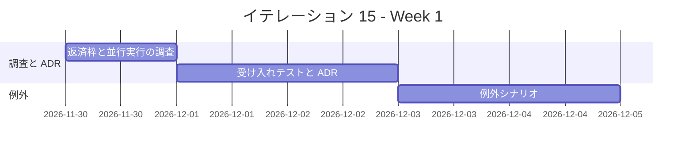
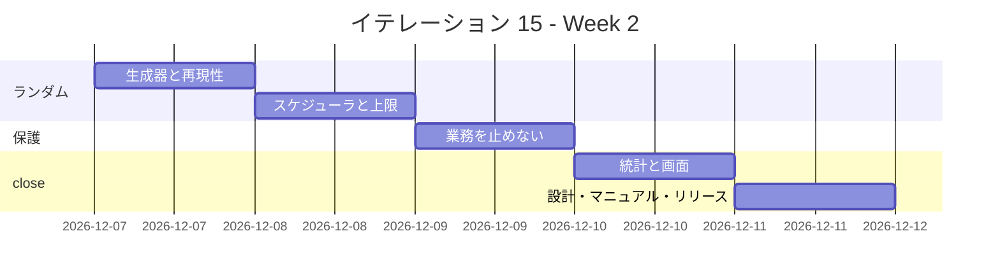
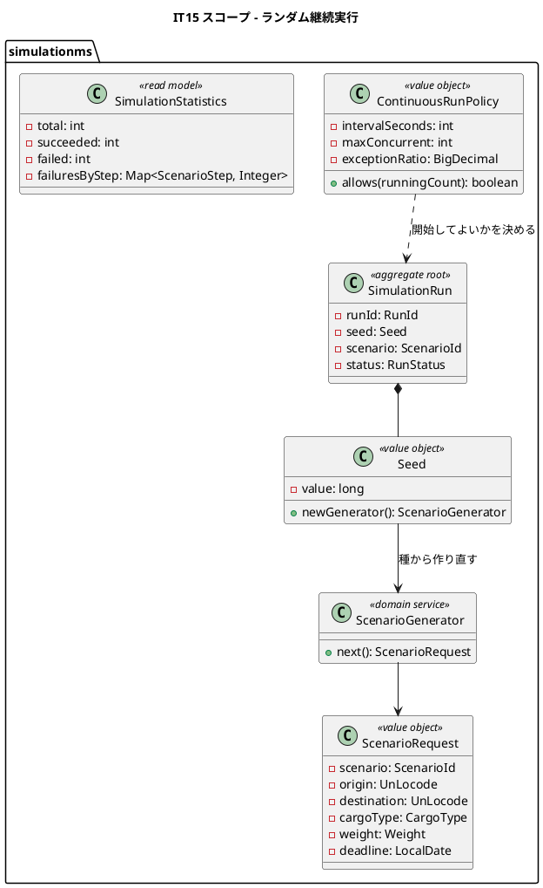
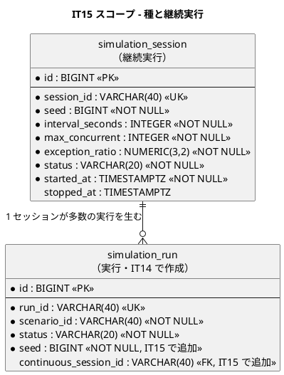

<!-- markdownlint-disable MD013 -->

# イテレーション 15 計画

## 概要

| 項目 | 内容 |
| :--- | :--- |
| イテレーション | IT15 |
| 期間 | 2026-11-30 〜 2026-12-13（2 週間） |
| ゴール | 例外を含むシナリオが自動で通り、バックエンドがランダムな業務を実運用と同じように流し続けられる状態にする |
| 対象ストーリー | US36（例外を含む業務シナリオを自動実行する）・US37（ランダムな業務シナリオをバックエンドが継続実行する） |
| 計画 SP | **8**（US36 = 3・US37 = 5） |
| 局面 | **拡張・インサイドアウト**（[開発戦略](development_strategy.md)） |
| 前提 | IT14 完了報告書・IT14 ふりかえり |
| リリース | [Release 2.2](release_plan.md)（業務シミュレーション）——**本 IT で完了する** |

---

## ゴール

### イテレーション終了時の達成状態

1. **例外まで含めて通る**: 遅延・破損・誤配・税関保留・輸送中キャンセルを含むシナリオが、対応（例外解決・経路の組み直し・承認）まで自動で実行される。
2. **実運用に近い状態を作れる**: バックエンドが乱数でシナリオと入力を選び、一定間隔で実行し続ける。複数の予約が並行して進む。
3. **落ちたら再現できる**: 乱数の種が記録され、同じ種を指定すると同じ並びを再現できる。
4. **業務を止めない**: シミュレーションの負荷でヘルスチェックと実利用者の操作が劣化しない。

### 成功基準

- [ ] US36 の受入基準 4 件・US37 の受入基準 8 件が、E2E / API / ドメインのテストで 1:1 に固定されている。
- [ ] 乱数の種を固定した再現テストが緑である（**同じ種 → 同じシナリオ列**）。
- [ ] 実行間隔・同時実行数・例外比率の上限を超えないことを、破るテストで固定している。
- [ ] 継続実行中もヘルスチェックが劣化しないことを、負荷をかけた状態で確認している。
- [ ] IT14 のふりかえり Try を計画と DoD に反映している。
- [ ] 画面を伴うため、ユーザーマニュアルと画面キャプチャを更新する。
- [ ] テストカバレッジ 80% 以上、ドメイン層 90% 以上。

---

## ユーザーストーリー

### 対象ストーリー

| ID | ユーザーストーリー | SP | 優先度 |
| :--- | :--- | :--- | :--- |
| US36 | 例外を含む業務シナリオを自動実行する | 3 | 低 |
| US37 | ランダムな業務シナリオをバックエンドが継続実行する | 5 | 中 |
| **合計** | | **8** | |

### ストーリー詳細

#### US36: 例外を含む業務シナリオを自動実行する

**として**: システム管理者

**したい**: 遅延・破損・誤配・税関保留・輸送中キャンセルを含むシナリオも自動で流したい

**なぜなら**: 正常系だけを流しても、業務が本当に難しいのは例外が起きたあとであり、実演でも受け入れ確認でも、そこを見せられないと「動く」ことの証明にならないからだ

**対応 UC**: UC23, UC16

**受け入れ基準**:

- [ ] 例外シナリオ（遅延・破損・誤配・税関保留・輸送中キャンセル）を選んで実行できる
- [ ] 例外が記録され、対応（例外解決・経路の組み直し・キャンセル承認）まで含めて実行される
- [ ] 誤配シナリオでは、現在地からの経路が組み直されて輸送が再開する
- [ ] 例外シナリオの結果も、US35 と同じ形式で工程ごとに確認できる

#### US37: ランダムな業務シナリオをバックエンドが継続実行する

**として**: システム管理者

**したい**: バックエンドが乱数で業務シナリオと入力を選び、一定間隔で実行し続けてほしい

**なぜなら**: 手で 1 件ずつ流す実行（US34）では常に同じ 1 本の経路しか踏まない。実運用では複数の予約が並行して進み、その状態でしか出ない欠陥を、リリース前に踏んでおきたいからだ

**対応 UC**: UC23

**受け入れ基準**:

- [ ] バックエンドが乱数でシナリオ・出発地・目的地・貨物種別・重量・期限を選び、一定間隔で実行し続ける
- [ ] 実行間隔・同時実行数・例外の発生比率を設定でき、設定した上限を超えて実行しない
- [ ] 使った乱数の種（seed）が記録され、同じ種を指定すると同じ並びを再現できる
- [ ] 管理者が開始・停止でき、停止すると進行中の実行は最後まで終えてから止まる
- [ ] 生成されたデータは、US34 と同じ印でシミュレーション由来と識別できる
- [ ] 本番環境では起動しない
- [ ] 実行中もヘルスチェックと実利用者の操作は劣化しない
- [ ] 実行の統計（実行件数・成功／失敗の内訳・失敗した工程の分布）が US35 と同じ形式で確認できる

---

## 着手前に決めること

| # | 決めること | 組み合わせて効く既存決定 | 本 IT での決定（案。Phase 1 で ADR-031 に固定する） |
| :--- | :--- | :--- | :--- |
| A | 乱数をどこに持つか | IT14 の決定 E（巻き戻さない）・US37 の再現性 | **種は `simulation_run` に保存し、乱数器は実行ごとに種から作り直す。** グローバルな乱数器を共有すると、並行実行の順序で並びが変わり**再現できなくなる**。 |
| B | 継続実行のスケジューラをどこに置くか | [ADR-022](../adr/022-domain-event-contract.md) は非同期の配線を持つ | **simulationms 内のスケジューラにする。** 外部のジョブ基盤を持ち込むと、停止・再現・上限の 3 つを別の場所で管理することになる。 |
| C | 上限をどう守るか | IT7 の「一律の防御で liveness が 503 になり再起動ループ」 | **同時実行数はセマフォで、実行間隔はスケジューラで守る。ヘルスチェックの経路は上限の対象外にする。** 一律に掛けると、過負荷のとき自分でクラスタを落とす。 |
| D | 停止の意味 | US37-4「進行中の実行は最後まで終えてから止まる」 | **新規の開始だけを止める。** 進行中を中断すると、業務データが中途半端な状態で残り、IT14 の「巻き戻さない」と噛み合わない。 |
| E | 例外をどう注入するか | [ADR-026](../adr/026-misroute-detection-and-rerouting.md) は誤配を荷役の記録そのものから検知する | **例外専用の API は作らない。** 誤配は「違う港での荷役を記録する」、遅延は「予定より遅い日時で記録する」——**実際に起きる操作をそのまま行う**。専用 API を作ると、検知ロジックを迂回してしまう。 |

---

## タスク

### Phase 0: 返済枠と調査（0 SP）

| # | タスク | 見積 | 状態 |
| :--- | :--- | :--- | :--- |
| 0.1 | IT14 のふりかえり Try を本計画と DoD に反映する | 2h | [ ] |
| 0.2 | IT14 で送った負債のうち、本 IT が触るファイルに現れるものを洗い出す | 2h | [ ] |
| 0.3 | 並行実行で壊れる可能性のある箇所（一覧の件数絞り込み・楽観的ロック）を調査し、赤いテストを置く | 4h | [ ] |

### Phase 1: 受け入れテストと ADR（US36 / US37）

| # | タスク | 見積 | 状態 |
| :--- | :--- | :--- | :--- |
| 1.1 | US36 の 4 受入基準を E2E に翻訳し、赤を確認する | 5h | [ ] |
| 1.2 | US37 の 8 受入基準を E2E とコンポーネントテストに翻訳し、赤を確認する | 8h | [ ] |
| 1.3 | ADR-031（乱数の種の持ち方・スケジューラの置き場・上限の守り方・停止の意味・例外の注入方法）を起票する | 5h | [ ] |
| 1.4 | ADR のコンプライアンス表に検査名を書き、`AdrComplianceTableTest` で実在確認する | 2h | [ ] |

### Phase 2: 例外シナリオ（US36）

| # | タスク | 見積 | 状態 |
| :--- | :--- | :--- | :--- |
| 2.1 | 遅延・破損シナリオを実装する（**実際に起きる操作をそのまま行う**。専用 API を作らない） | 6h | [ ] |
| 2.2 | 誤配シナリオを実装し、現在地からの経路の組み直しまで通す | 8h | [ ] |
| 2.3 | 税関保留・輸送中キャンセルシナリオを実装する（キャンセルは追跡管理者の承認を含む） | 6h | [ ] |
| 2.4 | 例外シナリオの結果が US35 と同じ形式で出ることを固定する | 3h | [ ] |

### Phase 3: ランダム実行（US37）

| # | タスク | 見積 | 状態 |
| :--- | :--- | :--- | :--- |
| 3.1 | 種から乱数器を作り、シナリオ・出発地・目的地・貨物種別・重量・期限を選ぶ生成器を TDD で実装する | 6h | [ ] |
| 3.2 | **同じ種 → 同じ並び**の再現テストを置く（並行実行下でも成立することを確かめる） | 5h | [ ] |
| 3.3 | スケジューラと開始・停止 API を実装する（停止は新規の開始だけを止める） | 6h | [ ] |
| 3.4 | 実行間隔・同時実行数・例外比率の上限を実装し、**破るテスト**で固定する | 6h | [ ] |

### Phase 4: 業務を止めない（US37）

| # | タスク | 見積 | 状態 |
| :--- | :--- | :--- | :--- |
| 4.1 | 同時実行のセマフォを入れ、**ヘルスチェックの経路を対象外にする**（IT7 の再発防止） | 5h | [ ] |
| 4.2 | 継続実行中にヘルスチェックと実利用者の操作が劣化しないことを確認するテストを置く | 6h | [ ] |
| 4.3 | Phase 0.3 で置いた赤（並行実行で壊れる箇所）を緑にする | 5h | [ ] |

### Phase 5: 統計と画面（US37）

| # | タスク | 見積 | 状態 |
| :--- | :--- | :--- | :--- |
| 5.1 | 実行件数・成功／失敗の内訳・失敗した工程の分布を集計する | 5h | [ ] |
| 5.2 | 継続実行の開始・停止・状態と統計を `/admin/simulations` に出す | 6h | [ ] |
| 5.3 | 種の表示と、種を指定した再実行の導線を作る | 4h | [ ] |

### Phase 6: 設計・マニュアル・品質ゲート・リリース

| # | タスク | 見積 | 状態 |
| :--- | :--- | :--- | :--- |
| 6.1 | `domain-model.md`・`data-model.md`・`ui_design.md` に継続実行と統計を反映する | 5h | [ ] |
| 6.2 | ユーザーマニュアルの「業務シミュレーション」章に、例外シナリオと継続実行を追記する | 5h | [ ] |
| 6.3 | 実環境で継続実行を 1 時間流し、業務が劣化しないことを確かめる | 6h | [ ] |
| 6.4 | `./gradlew build`、`TZ=UTC ./gradlew test`、frontend test / build、E2E、JIG / jig-erd を実行する | 8h | [ ] |
| 6.5 | **最後のコミットに対して** SonarQube を回し、Quality Gate PASS を確認する | 2h | [ ] |
| 6.6 | **git タグと `CHANGELOG.md` を作る**（`developing-release`。**5 リリース連続の欠落を解消する**） | 5h | [ ] |

### 見積もり合計

| カテゴリ | SP | 理想時間 | 状態 |
| :--- | :--- | :--- | :--- |
| Phase 0: 返済枠と調査 | 0 | 8h | [ ] |
| Phase 1: 受け入れテストと ADR | 1 | 20h | [ ] |
| Phase 2: 例外シナリオ | 2 | 23h | [ ] |
| Phase 3: ランダム実行 | 2 | 23h | [ ] |
| Phase 4: 業務を止めない | 1 | 16h | [ ] |
| Phase 5: 統計と画面 | 2 | 15h | [ ] |
| Phase 6: 設計・マニュアル・品質ゲート・リリース | 0 | 31h | [ ] |
| **合計** | **8** | **136h** | |

**1 SP あたり**: 約 17.0h

**進捗率**: 0%（0 / 8 SP）

---

## スケジュール

### Week 1（Day 1-5）

| 日 | タスク |
| :--- | :--- |
| Day 1 | Phase 0（Try の反映・並行実行で壊れる箇所の赤） |
| Day 2 | US36 / US37 の受け入れテスト Red |
| Day 3 | ADR-031 起票、コンプライアンス検査 |
| Day 4 | 遅延・破損・誤配シナリオ |
| Day 5 | 税関保留・輸送中キャンセル、結果形式の統一 |

### Week 2（Day 6-10）

| 日 | タスク |
| :--- | :--- |
| Day 6 | 生成器、同じ種 → 同じ並びの再現テスト |
| Day 7 | スケジューラ、開始・停止、上限を破るテスト |
| Day 8 | セマフォ、ヘルスチェックの除外、並行実行の赤を緑に |
| Day 9 | 統計、画面、種の表示と再実行 |
| Day 10 | 設計反映、マニュアル、実環境で 1 時間、品質ゲート、タグと CHANGELOG |

---

## 設計

### ドメインモデル

> **乱数器は種から作り直す。** グローバルな乱数器を共有すると、並行実行の順序で
> 並びが変わり、**同じ種を指定しても再現できない**。再現できないランダム実行は、
> 落ちても報告手段にならない。

### データモデル

> **`seed` は既存行にも必要になる。** IT14 の行には種が無いため、
> **既定値で埋めてから NOT NULL にする**（「不変条件の追加は既存行を壊す」）。

### API 設計

| メソッド | エンドポイント | 説明 |
| :--- | :--- | :--- |
| POST | `/api/v1/simulations/sessions` | 継続実行を開始する（種・間隔・同時実行数・例外比率） |
| DELETE | `/api/v1/simulations/sessions/{sessionId}` | 継続実行を停止する（新規の開始だけを止める） |
| GET | `/api/v1/simulations/sessions/{sessionId}` | 継続実行の状態と統計 |

### ADR

| ADR | タイトル | ステータス |
| :--- | :--- | :--- |
| ADR-031 | ランダム実行は種から乱数器を作り直し、上限はセマフォで守りヘルスチェックを対象外にする | 提案（Phase 1 で起票） |

---

## リスクと対策

| # | リスク | 影響 | 対策 |
| :--- | :--- | :--- | :--- |
| 1 | 継続実行の負荷でヘルスチェックが落ち、再起動ループになる | クラスタが自分で止まる（IT7 と同型） | ヘルスチェックの経路をセマフォの対象外にし、**負荷をかけた状態で liveness を確認**する（Phase 4.2） |
| 2 | 並行実行で「たまに落ちる」テストが出る | 再実行で通ることを理由に見送り、本物の赤を見逃す | **種を記録**しているので、落ちた種で再現する。2 回目の目撃で追う |
| 3 | 例外注入に専用 API を作りたくなる | 検知ロジックを迂回し、実際には動かない実装が緑になる | 決定 E で禁じ、**実際に起きる操作をそのまま行う**（誤配 = 違う港での荷役記録） |
| 4 | シミュレーションのデータが溜まり続ける | 一覧が重くなり、実データが埋もれる | 継続実行のデータ量の上限と削除手段を Phase 5 に含める。IT14 の除外検査が効いていることを再確認する |
| 5 | 8 SP に収まらない | Release 2.2 が閉じない | 落とす順序——(1) 統計の分布表示、(2) 税関保留・キャンセルシナリオ、(3) 種を指定した再実行の導線。**再現性（Phase 3.2）とヘルスチェック保護（Phase 4.1）は落とさない** |

---

## 整合性検証結果

> **本 IT の検証は IT14 のクローズ後に再実施する。** IT14 で simulationms の設計を
> 各ドキュメントへ反映するため、**現時点の検証結果は IT14 の反映内容に依存する**。
> ここに記すのは、着手前に確定している分だけである。

| 軸 | 検証対象 | 結果 | 備考 |
| :--- | :--- | :--- | :--- |
| A | 開発戦略 ↔ 計画 | OK | 拡張局面の IT15 = インサイドアウトと一致 |
| B | 設計トピックカバレッジ | **IT14 に依存** | `simulation_session`・`seed` 列・統計 Read Model は本 IT で追加。反映先は IT14 が作る節 |
| C | 計画 ↔ 過去計画 | OK | 上限の守り方は IT7 の「ヘルスチェックを除外する」を踏襲。例外の注入は [ADR-026](../adr/026-misroute-detection-and-rerouting.md)（誤配は荷役の記録から検知）に従い、専用 API を作らない |

**既存行への影響（着手前に確定）**: `simulation_run.seed` を NOT NULL にすると、
IT14 で作られた行が読めなくなる。**既定値で埋めてから NOT NULL にする**
（「不変条件の追加は既存行を壊す」）。Phase 3.1 のタスクに含める。

## 完了条件

### Definition of Done

- [ ] US36 / US37 の受け入れテストが Red → Green で実装されている。
- [ ] 同じ種で同じ並びが再現されることを、並行実行下のテストで固定している。
- [ ] 実行間隔・同時実行数・例外比率の上限を、**破るテスト**で固定している。
- [ ] ヘルスチェックがセマフォの対象外であることを検査で固定している。
- [ ] 例外の注入に専用 API を使っていないことを、実際の操作を踏むテストで固定している。
- [ ] `domain-model.md`、`data-model.md`、`ui_design.md`、ユーザーマニュアルを更新している。
- [ ] マニュアル用キャプチャを撮り直し、目視で UI 欠陥がないことを確認している。
- [ ] `./gradlew build`、`TZ=UTC ./gradlew test`、frontend test / build、E2E、JIG / jig-erd が完了している。
- [ ] **最後のコミットに対して** SonarQube を回し、Quality Gate が PASS である。
- [ ] 5 視点レビューを実施し、高優先度をすべて対応または明示的に送っている。
- [ ] **git タグ（`java/take-7/v2.2.0`）と `CHANGELOG.md` を作成している**（5 リリース連続の欠落を解消）。

### デモ項目

| # | デモ | 対応する受入基準 |
| :--- | :--- | :--- |
| 1 | 誤配シナリオを実行すると、誤配が記録され経路が組み直されて輸送が再開する | US36-3 |
| 2 | 輸送中キャンセルシナリオでは、追跡管理者の承認まで自動で通る | US36-2 |
| 3 | 継続実行を開始すると、複数の予約が並行して進む | US37-1 |
| 4 | 同時実行数の上限を 2 にすると、3 本目は開始されない | US37-2 |
| 5 | 同じ種で 2 回実行すると、同じシナリオの並びになる | US37-3 |
| 6 | 停止を押すと新規の開始が止まり、進行中の実行は最後まで終わる | US37-4 |
| 7 | 継続実行中もヘルスチェックが緑のままで、実利用者の予約登録が成功する | US37-7 |
| 8 | 統計に実行件数・成功／失敗の内訳・失敗した工程の分布が出る | US37-8 |

---

## 更新履歴

| 日付 | 内容 | 担当 |
| :--- | :--- | :--- |
| 2026-08-31 | 初版作成 | - |

---

## 関連ドキュメント

- [リリース計画](release_plan.md)
- [開発戦略](development_strategy.md)
- [イテレーション 14 計画](iteration_plan-14.md)
- [ユーザーストーリー](../requirements/user_story.md)
- [システムユースケース](../requirements/system_usecase.md)（UC23）
