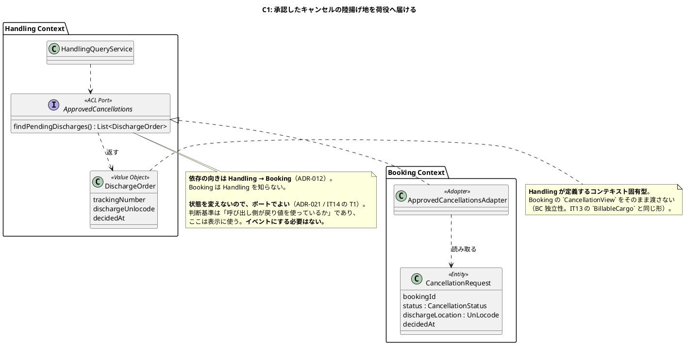
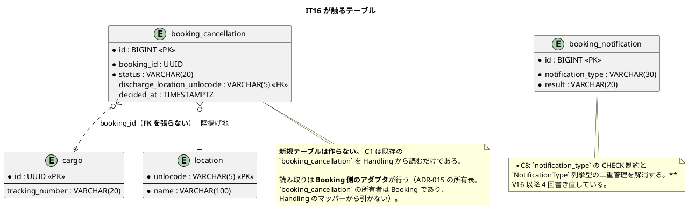
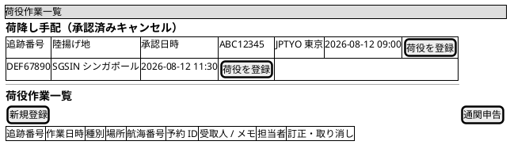
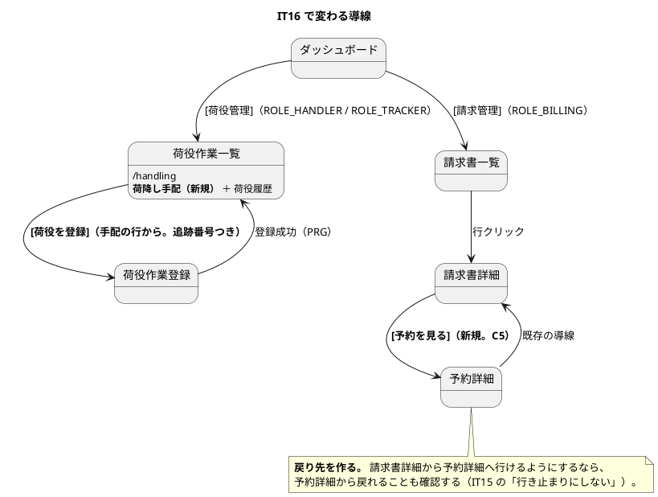

# イテレーション 16 計画

## 概要

| 項目 | 内容 |
| :--- | :--- |
| **対象** | US30 の未達分（C1）＋ IT15 引き継ぎの返済枠 8 件（C2〜C9）＋ ふりかえり Try 6 件（T1〜T6） |
| **計画 SP** | **2**（US30 の残作業のみ。返済枠と Try は SP に計上しない） |
| **局面** | **整流**（IT16。新設） |
| **主アプローチ** | **アウトサイドイン** |
| **期間** | 10 営業日 |
| **前提** | Release 2.0 は IT15 で完成（`java/take-6/v2.0.0` タグ済み） |

> **新規ユーザーストーリーを入れない。** Release 0.1〜2.0 の 35 US はすべて完了しており、
> 未配分は US01（輸送見積・未見積）1 件だけである。US01 は次のリリースで扱う。
>
> **本イテレーションは「作ったものを、宣言したとおりに働かせる」ためのものである。**
> IT15 のふりかえりが出した最大の発見は、**ADR に「必ず守る」と書いた規則をコードの半分が
> 守っていなかった**ことだった（P1）。同じ形の穴が、名簿方式の検査（P4）にも、
> 一覧の問い合わせ回数（P3）にもあった。**どれも「入れたこと」と「働くこと」の差である。**

---

## ゴール

**荷役の現場に「手配した」が届き、宣言した規則が検査で守られる状態にする。**

1. 承認したキャンセルの**陸揚げ地が荷役作業員に届く**（US30 唯一の未達受入基準を満たす）
2. **ADR に書いた規則を検査に落とす**か、落とせないなら「守り手: 守らない」と明記する（T1）
3. **名簿方式の検査が、名簿に無い入力を赤にする**（T4）
4. **育つ負債（テストヘルパー・ビューの引数）を先に返す**（T5）

---

## なぜアウトサイドインか

| 条件 | 本イテレーションの状況 |
| :--- | :--- |
| ドメインの複雑さ | **低い。** C1 は既存の `CancellationRequest`（承認済み・陸揚げ地あり）を**読み取って表示する**だけであり、新しい業務規則を作らない |
| 既存実装の有無 | **すべて実装済み。** 集約・テーブル・承認の経路は IT15 で完成している |
| 検証したいこと | **画面に届くか**。「承認の記録は残るのに現場には届かない」が未達の中身である |

**条件が終盤（IT7〜IT12）と同じなので、同じ選択をする。** 局面の名前ではなく、そのときの条件でアプローチを選ぶ（`development_strategy.md`）。

返済枠と Try は**アプローチの対象外**である。既存コードの是正であり、テストの入口を選ぶ問題ではない。ただし **T1・T3・T4 は「検査を先に書いて赤を見る」** — 検査が既存の違反を見つけることを確認してから直す。**IT15 で ADR-009 の違反 5 本が見つかったのは、検査を書いた瞬間だった。**

---

## 2SP をどう使うか

C1（陸揚げ地を荷役の一覧に出す）を 2SP とする。IT15 の計画ではタスク 3-6 として計上していたもので、**US30 の 5SP の内訳の一部である**。US30 自体は IT15 で 5SP を計上済みのため、**本 IT の 2SP は二重計上になる**。

> **二重計上を避けるため、release_plan.md の累計 SP には IT16 を加算しない。**
> IT16 の 2SP は「US30 の残作業の規模」を示す見積もりであって、新たに獲得する価値ではない。
> **未達を「完了扱いのまま追加で数える」ことのほうが、実績を歪める。**

返済枠 8 件と Try 6 件は SP に計上しない。`release_plan.md` の方針どおり、**見積もりの対象はユーザーストーリーであり、品質を満たすための作業はストーリーの一部**だからである。理想時間では見積もる（下記タスク分解）。

---

## 前イテレーションの学びの反映（ふりかえり Try）

`retrospective-15.md` の Try 6 件を、本 IT のタスクと成功基準に落とす。

| # | Try | 本 IT での落とし方 |
| :--- | :--- | :--- |
| T1 | ADR に「必ず守る」と書いた規則は、その場で検査を書く。書けないなら「守り手: 守らない」と明記する | **タスク 1**。ADR-001〜019 の 20 件に「守り手」欄を遡って埋める。**検査が無い規則は、検査を書くか「守らない」と書くかの二択とする**（`release_scope.md` 原則 3 と同じ形） |
| T2 | `try` を書いたら、握り潰してよい失敗以外が入っていないか数える | **タスク 2**。`} catch` 96 か所を数え上げ、**catch の範囲に「解析」以外が入っているもの**を洗い出す |
| T3 | 一覧を返すクエリサービスを書いたら、その場で問い合わせ回数のテストを書く | **タスク 3**。一覧を返すクエリサービス 9 件のうち `QueryCounter` テストが無いものに足す |
| T4 | 名簿方式の検査を書いたら「名簿に無い入力」のテストを必ず書く | **タスク 4**。`DashboardEntryRoles` / `SYNCHRONOUS_COMMANDS` / `OWNER`（ADR-015 所有表）の 3 名簿に未登録 → 赤のテストを足す |
| T5 | 落とした返済枠のうち「対象が増えたもの」を先頭に置く | **タスク分解の順序そのもの**。C2（5 → **7 クラス**）と C3（1 → **2 クラス**）をタスク 5・6 として、他の返済枠より前に置く |
| T6 | レビューを実装の途中で 1 度入れる | **タスク 8**。タスク 6 完了時点で `developing-review` を回す。**IT14・IT15 と 2 回続けて落としたため、今回は落とす順序の最後尾に置く** |

> **T6 は 2 IT 連続で落としている。** 「余力次第の返済枠」は毎 IT 繰り越されて固定化する
> （IT6〜IT8 の ADR-008 と同じ形）。**落とす順序の最後尾に置く**ことで、
> 落とすなら他をすべて落としてからにする。

---

## 対象

### C1: 承認したキャンセルの陸揚げ地を荷役の一覧に出す（2SP。US30 の未達受入基準）

**GitHub Issue [#515](https://github.com/k2works/case-study-cargo-tracker/issues/515)**

US30 の受入基準は次のように定める（`../requirements/user_story.md` の US30）。

> 承認するとキャンセルが確定し、**指定した陸揚げ地への荷降しが手配され**、荷主に通知される

IT15 で満たしたのは「荷主に通知される」までである。**「手配され」を現場が読める場所に置いていない。**

- 承認の記録が残るのは**予約詳細**と**荷主への通知**（`booking_notification`）
- 実際に荷降しを行う**荷役作業員が見る `/handling` には何も出ない**

**船から降ろす人が知らないなら、手配したことにならない。**

### 返済枠（IT15 引き継ぎ。**育つ負債を先頭に**）

| # | 内容 | 出典 | 育ち方 |
| :--- | :--- | :--- | :--- |
| C2 | テストの貨物準備ヘルパーの重複を解消 | IT14 C4 / IT15 M6 | **5 → 7 クラス**（IT15 で +2） |
| C3 | ビューの引数整理（`InvoiceView` / `CancellationView`） | IT14 M9 / IT15 M5 | **1 → 2 クラス**（`CancellationView` が 19 引数で生まれた） |
| C6 | 請求書一覧・詳細に種別のバッジを出す | IT15 M8 | 育たない（ADR-020 で種別は 2 つに固定） |
| C7 | 一覧の既定の並び順を支払期限の昇順に＋「◯ 日超過」 | IT14 C9 | 育たない |
| C8 | `booking_notification` の許容値が DB と列挙型で二重管理 | 設計反映 #8 / IT15 L2 | **通知種別を足すたび CHECK 制約を書き直す**（V16 以降 **5 回**書き直した） |
| C9 | 承認待ち一覧の見出しが「予約 ID」なのに中身は追跡番号 | IT15 L1 | 育たない |
| C4 | `markPersisted()` の呼び出し元を ArchUnit で限定 | IT14 C6 | 育たない（呼び出し元は現在 1 か所） |
| C5 | 完全修飾名を import に寄せる＋請求書詳細から予約詳細への導線 | IT14 C5 / C7 | 育たない |
| C10 | **ADR-015 の所有表を `data-model.md` に新設** | IT14 C8 / IT15 の 0-8 | **テーブルが増えるたび差が開く**（現在 40 テーブル超） |

> **C10 は引き継ぎの表に載っていなかった。** IT15 で「部分的に実施（新テーブル 2 件は登録した。
> **表そのものの新設は落とした**）」と記録しながら、`retrospective-15.md` の引き継ぎ表に
> 記名されていない。**記名のない引き継ぎは返済されない**（IT7 の C1・C2 と同じ形）。
> IT16 の開始準備の検証で見つけたため、ここで記名する。
>
> 現在 `data-model.md` に所有表は存在せず、テーブルの所有者を示すのは
> `MapperTableOwnershipTest.OWNER` だけである。**検査だけが正典で、設計文書が空白**という
> 状態は T4（名簿に無い入力を赤にする）と同じ根を持つ。**タスク 4 と同時に片付ける。**

> **C8 は「育たない」に見えて育っていた。** 通知種別の許容値は V16 で作った後、
> V19 / V29 / V34 / V39 と **4 回書き直されている**。列挙型に種別を足すたびに
> マイグレーションを 1 本足す形になっており、**5 回目の書き直しが済んだところである**。
> 育つ負債として C2・C3 の次に置く。

---

## 設計への反映が必要（当該 IT で対応）

**開始準備の検証（ステップ 3）で見つけた設計文書の欠落・ずれ。実装と同じ変更で反映する。**

| # | 反映先 | 内容 |
| :--- | :--- | :--- |
| 1 | `domain-model.md` の「BC 間 ACL ポート一覧（正典）」 | **`ApprovedCancellations`（Handling → Booking）を追加する。** 本表が正典であり、載せずに実装すると契約が文書に無い状態になる |
| 2 | `data-model.md` の `booking_notification.notification_type` | **許容値の列挙が実装とずれている。** 文書は 5 種別（`ROUTE_CONFIRMED` / `SCHEDULE_CHANGED` / `EXCEPTION_RAISED` / `EXCEPTION_RESOLVED` / `STATUS_UPDATED`）だが、DB は V29 / V34 / V39 で 3 種別以上増えている。**C8 の是正と同じ変更で直す** |
| 3 | `data-model.md` に**所有表を新設**（C10） | ADR-015 の所有者を示すのが検査だけになっている |
| 4 | `ui_design.md` の荷役作業一覧 | **荷降し手配の節を追加**（C1）。対応 US に US30 を足す |
| 5 | `ui_design.md` の請求書一覧・請求書詳細 | 種別バッジ・既定の並び順・「◯ 日超過」・予約詳細への導線（C5 / C6 / C7） |
| 6 | `ui_design.md` のキャンセル承認待ち一覧 | 見出しを「追跡番号」に（C9） |
| 7 | `domain-model.md` の Handling Context 要素表 ＋ `operation.md` 9.4 の用語集 | **「荷降し手配」と「荷降し（`UNLOAD`）」の使い分けを明記する**（下記ワイヤーフレームの注） |

### ナビゲーション整合性（**絶対項目**）

**本 IT は新規画面を作らないため、navbar とダッシュボードのカードは変えない。**

- C1 が変えるのは**既存の荷役作業一覧（`/handling`）の中身**であり、入口は `ui_design.md` の同画面の定義（`ROLE_HANDLER` / `ROLE_TRACKER`）をそのまま使う
- C5 が足す「請求書詳細 → 予約詳細」は**画面内のリンク**であり、ナビ項目ではない。**ただし `ROLE_BILLING` が予約詳細を開けるかを確認する**（共有画面のリンクもロールで出し分ける）
- **`NavigationConsistencyTest` は T4 で触る**（`DashboardEntryRoles` の名簿に未登録 → 赤のテストを足す）。ナビ定義そのものは変えない

**確認する**: 本 IT の後も `ui_design.md` のナビゲーション構成表・navbar・ダッシュボード・検証テストの 4 点が一致していること。

> **反映 #2 は「ドキュメントが古い」だけではない。** 許容値が DB の CHECK 制約・
> 列挙型・設計文書の **3 か所**にあり、**5 回書き直して 3 か所とも揃ったことが一度もない**。
> C8 は二重管理の解消であり、**三重管理の解消として扱う。**

---

## ADR

**新規起票は想定しない。** 本イテレーションは既存 ADR に守り手を与える回である。

ただし次の 2 つは、作業の結果として ADR が必要になりうる。

| 契機 | 起票するか |
| :--- | :--- |
| **T1 で「守り手: 守らない」と書く規則が複数出た場合** | **その判断が構造的なら ADR を起票する。** 「検査を書かない」ことの理由が規則ごとにばらばらなら、それは判断が定まっていないということである |
| **C8 で許容値の管理場所を 1 か所に決めた場合** | **決め方が今後の種別追加を縛るなら起票する**（列挙型を正典とし DB の CHECK を外すのか、生成するのか） |

**起票しなかった場合は「起票しなかった」と完了報告書に書く**（IT15 で料率の ADR について同じ扱いをした）。

---

## スケジュール

10 営業日。**タスク番号は上記「タスク分解」に対応する。**

### Week 1（Day 1-5）

| Day | 内容 | 見積 |
| :--- | :--- | :--- |
| Day 1 | タスク 1（ADR に守り手を与える。T1） | 6h |
| Day 2 | タスク 2（catch の広さを数える。T2）＋ タスク 3 前半（T3） | 8h |
| Day 3 | タスク 3 後半（一覧の問い合わせ回数。T3） | 4h ／ タスク 4 前半（T4）4h |
| Day 4 | タスク 4 後半（名簿。T4）＋ C10（所有表の新設） | 8h |
| Day 5 | タスク 5（テストヘルパーの統合。C2） | 8h |

### Week 2（Day 6-10）

| Day | 内容 | 見積 |
| :--- | :--- | :--- |
| Day 6 | タスク 6（ビューの引数整理。C3） | 6h |
| Day 7 | タスク 7 前半（C1 の ACL ポートとアダプタ） | 8h |
| Day 8 | タスク 7 後半（荷役作業一覧への表示）＋ **タスク 8（途中レビュー。T6）** | 5h ／ 3h |
| Day 9 | タスク 9（残りの返済枠 C6 → C7 → C8 → C9 → C4 → C5） | 8h |
| Day 10 | タスク 10（品質ゲート・破壊検証）＋ タスク 11（ドキュメント・マニュアル） | 8h |

> **タスク 10・11 に 16h を見込みながら Day 10 の 8h しか置いていない。**
> 合計 78h に対して 10 営業日 80h であり、**タスク 9〜11 は Day 8 以降に重なる**。
> 超過が見えた時点で「落とす順序」に従って下から落とす。

---

## 設計（IT16 スコープ）

### ドメインモデル図（C1 の越境）

**この図は C1 だけを対象とする。** 返済枠・Try は既存構造の是正であり、ドメインモデルを変えない。

### 状態遷移図

**省略する。** C1 は `CancellationStatus` が `APPROVED` になった**後**の読み取りであり、新しい状態も遷移も作らない。遷移の正典は IT15 計画の状態遷移図（`iteration_plan-15.md`）である。

返済枠のうち C8 は `BookingNotification.NotificationType` の**許容値の管理方法**を変えるが、通知に状態遷移は無い（`SUCCEEDED` / `FAILED` の結果を 1 行残すだけ）。

### ER 図（IT16 スコープ）

**マイグレーションは C8 の 1 本だけ**（`V40__booking_notification_type_check.sql`）。C1 はスキーマを変えない。

### 画面（IT16 スコープ）

新規画面は無い。**既存 4 画面の表示を変える。**

| 画面 | パス | 変更内容 | 対象 |
| :--- | :--- | :--- | :--- |
| 荷役作業一覧 | `/handling` | **荷降し手配の一覧を追加**（承認済みキャンセルの陸揚げ地） | C1 |
| 請求書一覧 | `/billing/invoices` | 種別バッジ／既定の並び順を支払期限の昇順に／「◯ 日超過」 | C6 / C7 |
| 請求書詳細 | `/billing/invoices/{invoiceNumber}` | 種別バッジ／**予約詳細への導線** | C6 / C5 |
| キャンセル承認待ち一覧 | `/bookings/cancellations` | 見出しを「予約 ID」→「**追跡番号**」に | C9 |

#### ワイヤーフレーム（荷役作業一覧・C1）

**手配を一覧の上に置く。** 通常の荷役履歴より優先度が高い — **船が着く前に知らないと降ろせない**。

> **「荷降し」と「荷降し手配」を混ぜない（ユビキタス言語）。**
> **`UNLOAD`（荷降し）はすでに荷役種別として存在する**（`domain-model.md` の `HandlingType`）。
> それは**現場が実際に降ろした記録**である。本 IT が足す**荷降し手配**は
> **「ここで降ろせ」という指示**であり、まだ降ろしていない。
>
> **同じ言葉が記録と指示の両方を指すと、一覧を見た作業員が「もう降ろしたのか」と読む。**
> IT15 で「キャンセル」と「取り消し」を分けたのと同じ扱いにする — 見出し・
> `domain-model.md` の要素表・`operation.md` 9.4 の用語集の 3 か所で使い分けを明記する。
>
> **`DischargeOrder`（手配）と `HandlingType.UNLOAD`（記録）は別物である。**
> 手配に対して荷役を登録すると `UNLOAD` の記録ができ、**そこで手配は一覧から消える**。

**「気づく手段」を次の行動に繋ぐ**（`retrospective` の既知の型）。手配の行から `[荷役を登録]` で `/handling/new` へ、追跡番号を持った状態で遷移する。**件数だけ出して対象へ行けない画面にしない。**

#### 画面遷移図（IT16 スコープ）

---

## タスク分解

**育つ負債を先に返す**（T5）。検査を書く Try（T1・T3・T4）は、**既存の違反を見つけるため**に受入基準の実装より先に置く。

### 1. ADR の規則に守り手を与える（T1）— 6h

- ADR-001〜019 の 20 件に**「守り手」欄**を追加する（ADR-020 / ADR-021 で導入した欄）
- 各規則について**検査があるか**を確認し、無ければ次の二択にする
  - 検査を書く（ArchUnit / 単体テスト / マイグレーションの制約）
  - **「守り手: 守らない」と明記する**（守れない理由を書く）
- **成功基準**: 20 件すべての ADR で、規則ごとに守り手が名前で書かれている。**空欄がゼロ**

> **ADR-009 は 7 IT のあいだ口約束だった。** 検査を書いた瞬間に既存 5 本の違反が
> 見つかっている。**同じことが他の ADR で起きていないかを、この作業で確かめる。**

### 2. catch の広さを数える（T2）— 4h

- `} catch` 96 か所を数え上げ、**catch の範囲に「解析」以外が入っているもの**を洗い出す
- 該当したものは try の範囲を狭める。**握り潰してよい失敗だけを囲む**
- **成功基準**: 広い catch が 0 件、または「なぜ広いままでよいか」がコメントで説明されている

### 3. 一覧の問い合わせ回数を計測する（T3）— 6h

- 一覧を返すクエリサービス **9 件**（`BillingQueryService` / `BookingNotificationQueryService` / `CancellationQueryService` / `CorrectionQueryService` / `CustomsQueryService` / `HandlingQueryService` / `LockedAccountQueryService` / `RouteProposalQueryService` / `TrackingExceptionQueryService`）に `QueryCounter` テストを足す
- **N+1 が見つかったら SQL の絞り込みへ寄せる**（IT13 C4 / IT15 P3 と同じ是正）
- **成功基準**: 9 件すべてに問い合わせ回数のテストがあり、**行数に比例しない**ことを検証している

### 4. 名簿に無い入力を赤にする（T4）＋ 所有表を設計文書に置く（C10）— 8h

- `DashboardEntryRoles.ROLES` / `SYNCHRONOUS_COMMANDS` / ADR-015 の `OWNER` の 3 名簿に、**未登録の入力 → 赤**のテストを足す
- **成功基準**: 3 名簿すべてで「載っていないものが素通りしない」ことをテストが示す

- **C10**: ADR-015 の所有表を `data-model.md` に新設する。**検査だけが正典で設計文書が空白**という状態を解消する
- **成功基準（C10）**: `data-model.md` の所有表と `MapperTableOwnershipTest.OWNER` の内容が一致し、**ずれたら赤になる**

> **`handling_correction` は IT12 から 3 イテレーション素通りしていた。**
> 載せ忘れたものほど検査から漏れる。**同じ性質を持つ名簿を全部直す。**

### 5. テストの貨物準備ヘルパーを 1 つに寄せる（C2。**育つ負債**）— 8h

- **7 クラス**に重複している貨物準備を 1 つの支援クラスに寄せる
- **成功基準**: `cargo` に列を足したとき、直す場所が 1 か所である

### 6. ビューの引数を整理する（C3。**育つ負債**）— 6h

- `InvoiceView`（26 引数）・`CancellationView`（19 引数）を、**意味のまとまりごとの値オブジェクト**に分ける
- **成功基準**: どちらも引数が 10 個以下。**まとまりに名前がついている**

### 7. C1: 陸揚げ地を荷役の一覧に出す（**受入基準**）— 10h

- Handling 側に ACL ポート `ApprovedCancellations` と `DischargeOrder` を定義する
- Booking 側に `ApprovedCancellationsAdapter` を実装する（`booking_cancellation` の所有者は Booking）
- `/handling` に**荷降し手配**の一覧を追加し、行から `/handling/new` へ追跡番号つきで遷移する
- **成功基準**: 受入基準「指定した陸揚げ地への荷降しが手配され」を実行するテストがある

### 8. 実装の途中でレビューを 1 度回す（T6）— 3h

- `developing-review` をこの時点で回す。**高・中の指摘を本 IT の残り時間で対応する**

### 9. 残りの返済枠（C6 → C7 → C8 → C9 → C4 → C5）— 14h

| # | 内容 | 見積 |
| :--- | :--- | :--- |
| C6 | 請求書一覧・詳細に種別のバッジ | 2h |
| C7 | 既定の並び順を支払期限の昇順に＋「◯ 日超過」 | 3h |
| C8 | `booking_notification` の許容値の二重管理を解消（`V40`） | 4h |
| C9 | 承認待ち一覧の見出しを「追跡番号」に | 1h |
| C4 | `markPersisted()` の呼び出し元を ArchUnit で限定 | 2h |
| C5 | 完全修飾名を import に寄せる＋請求書詳細 → 予約詳細の導線 | 2h |

> **C5 の対象は `DashboardEntryRoles.hasEntry` である。** 引数と本文に
> `org.springframework.security.core.GrantedAuthority` が 3 回、
> `java.util.Collection` が 1 回、完全修飾名のまま書かれている。

### 10. 品質ゲートと破壊検証 — 8h

- `./gradlew check` ／ **`TZ=UTC ./gradlew check`** ／ E2E ／ CI ／ SonarQube
- **安全装置を数え上げてから壊す**（着手前にリストを作らない）

### 11. ドキュメントとマニュアル — 8h

- `ui_design.md`（荷役作業一覧に荷降し手配を追記）・`domain-model.md`（`ApprovedCancellations` ポート）
- **マニュアル**: 8.x（荷役）に荷降し手配の節を追加。**キャプチャを撮り直す**（荷役作業一覧・請求書一覧・請求書詳細・承認待ち一覧の 4 枚）
- ふりかえり・完了報告書はクローズ時（`closing-iteration`）

**合計 81h**（10 営業日 = 80h）。**すでに 1h 超過している。**

> **超えることは着手前に分かっている**（IT15 と同じ）。**落とす順序を先に決めておく**ことで、
> 超過が見えたときに迷わず落とせるようにする（IT15 の Keep K3）。

---

## 落とす順序（**先に決めておく**）

超過が見えた時点で、**下から落とす**。

| 順序 | 落とすもの | 理由 |
| :--- | :--- | :--- |
| 1 | C5（完全修飾名・導線） | 育たない。読みやすさの問題であり、業務が止まらない |
| 2 | C4（`markPersisted()` の ArchUnit） | 呼び出し元は現在 1 か所。ADR-021 の名簿が構造的な歯止めになっている |
| 3 | C9（見出しの表記） | 1h。落としても次に育たない |
| 4 | C7（並び順・超過表示） | 2 IT 連続で落としている。**3 回目になるため、落とすなら記名して起票する** |
| 5 | C6（種別バッジ） | ADR-020 で種別は 2 つに固定されており育たない |
| — | **T6（途中レビュー）は落とさない** | **2 IT 連続で落としている。** これ以上落とすと固定化する |
| — | **C1 は落とさない** | **受入基準の未達分である。** 落とすなら US30 を「未完了」に戻す |
| — | **C2・C3 は落とさない** | **育つ負債**。落とすと次の IT でさらに大きくなる |
| — | **T1〜T4 は落とさない** | 検査であり、落とすと「宣言したまま守られない」状態が続く |
| — | **C10 は落とさない** | **IT15 で落としたうえに引き継ぎに記名されていなかった。** 2 度目は落とさない |

### 本 IT では扱わないもの（**名前で記録する**）

| 内容 | 出典 | 扱い |
| :--- | :--- | :--- |
| `Cargo` が 500 行ちょうどで、次に 1 行足すと Checkstyle が落ちる | IT15 レビュー M7 / 引き継ぎの設計判断 | **本 IT では扱わない。** IT16 は `Cargo` に手を入れないため、制限が合図を出す場面が来ない。**次に `Cargo` を触るイテレーションで、引取まわり（`claimCode` / `consignee` / `claimedAt`）の切り出しを行う** |
| 返金の扱い（過払いの経路が 2 つになった） | IT15 引き継ぎ | **本 IT では扱わない。** 業務そのものが存在しないため、US を起票してリリースに配分する（次のリリース計画で決める） |
| 適格請求書（インボイス制度）の要件 | IT15 引き継ぎ | 同上 |
| `Location.of` が `new Location(...)` に委譲するだけで生成経路が 2 つある | IT15 引き継ぎ | **T1 の結果しだい。** ADR-005（共有カーネルの範囲）に守り手を与えるとき、生成経路の制約が規則として書けるなら同時に扱う |
| US01（輸送見積） | `release_plan.md` の未割当 | **次のリリースで扱う。** 唯一どのリリースにも配分されていない US である |

---

## リスクと対策

| リスク | 影響 | 対策 |
| :--- | :--- | :--- |
| **T1 で ADR-009 と同型の違反が大量に出る** | タスク 1 が 6h で終わらない | **見つけた違反は数えて記録し、直すのは本 IT の範囲で区切る。** 直せない分は「守り手: 検査あり・既存違反 N 件（IT17 で返済）」と ADR に明記する。**見つけたことを隠さない** |
| **T3 で N+1 が複数見つかる** | タスク 3 が 6h で終わらない | 同上。**計測を全 9 件に入れることを優先し、是正は件数の多いものから** |
| **C2（ヘルパー統合）が 7 クラスすべてのテストを揺らす** | 広範囲の赤 | **1 クラスずつ移す。** 全部を一度に書き換えない |
| C1 の ACL ポートが BC 独立性を壊す | ArchUnit が赤 | **Handling が自分の型（`DischargeOrder`）を定義する。** Booking の `CancellationView` を渡さない（IT13 `BillableCargo` の踏襲） |
| **余白が 2h しかない** | 想定外が入ると即超過 | **落とす順序を上に定めた。** 8SP の IT で毎回「計画外の作業」が発生している（`release_plan.md`）ため、超過は前提として扱う |

---

## 完了条件

### デモ項目

1. **荷役作業一覧に荷降し手配が出る**（承認済みキャンセルの陸揚げ地）
2. **手配の行から荷役登録へ、追跡番号を持ったまま行ける**
2b. **手配に対して荷役（`UNLOAD`）を登録すると、その手配が一覧から消える**（指示と記録を混ぜない）
3. 承認していないキャンセル申請は**手配に出ない**
4. **却下した申請は手配に出ない**
5. **請求書一覧で輸送料金とキャンセル料が区別できる**（種別バッジ）
6. **請求書一覧が支払期限の昇順で開く**＋期限超過が「◯ 日超過」で読める
7. **請求書詳細から予約詳細へ行ける**
8. **承認待ち一覧の見出しが中身と一致する**（追跡番号）
9. **通知種別を足すとき、直す場所が 1 か所である**（C8）
10. **`data-model.md` の所有表と検査がずれたら赤になる**（C10）

### 完了の定義（DoD）

**条件は書き写さず、正典を引用する。** 書き写した条件は正典が変わっても追随しない。

#### 機能

- [ ] **US30 の受入基準のうち、IT15 で未達だった 1 件を満たす**
  - 正典: `../requirements/user_story.md` の US30 の受入基準「承認するとキャンセルが確定し、**指定した陸揚げ地への荷降しが手配され**、荷主に通知される」
  - IT15 の到達点: `iteration_report-15.md`（**荷役の一覧への表示は落とした**と記録）
  - 本 IT で満たす: **手配が荷役作業員の画面に出る**ことを実行するテストを名指しする
- [ ] デモ項目 11 件がすべて動作する
- [ ] **落としたものは名前で記録する**（上記「落とす順序」に対応させる）

#### 局面の完了条件

- [ ] 正典: `development_strategy.md` の「整流（IT16）」の節

#### 品質

- [ ] `./gradlew check` が緑
- [ ] **`TZ=UTC ./gradlew check` が緑**
- [ ] CI が緑
- [ ] SonarQube Quality Gate が PASS

#### 主張とテスト（Try の検証）

- [ ] **T1: ADR 20 件すべてに守り手が書かれている**（空欄ゼロ。「守らない」も明示的な答えとする）
- [ ] **T2: catch の広さを 96 か所すべてについて確認した**
- [ ] **T3: 一覧を返すクエリサービス 9 件すべてに問い合わせ回数のテストがある**
- [ ] **T4: 名簿 3 件すべてで「未登録 → 赤」のテストがある**
- [ ] **T5: 育つ負債（C2 / C3）を落とさずに返した**
- [ ] **T6: タスク 6 完了時点でレビューを 1 度回した**（**3 IT 連続で落とさない**）
- [ ] **破壊検証で空振り 0**（4 IT 連続を維持する）

#### 安全装置（**着手前にリストを作らない**）

実装後に数え上げた結果で埋める。やらなかったものは名前で記録する。

#### 到達性（ロール別・状態別・発生時点）

- [ ] **荷役作業員（ROLE_HANDLER）が荷降し手配に到達できる**（ダッシュボード → 荷役作業一覧）
- [ ] **ROLE_TRACKER でも同じ画面が開ける**（`ui_design.md` の荷役作業一覧のロール定義に従う）
- [ ] **手配のある状態の貨物から、荷役登録へ行ける**（状態軸）
- [ ] **経理担当者が請求書詳細から予約詳細へ行ける**（403 にならない。**共有画面のリンクもロールで出し分ける**）

#### ドキュメント

- [ ] **「設計への反映が必要」の 6 件をすべて反映**（`domain-model.md` の ACL ポート正典表・`data-model.md` の通知種別と所有表・`ui_design.md` の 3 画面）
- [ ] **マニュアルの荷役の章に荷降し手配の節を追加し、キャプチャを 4 枚撮り直す**
- [ ] `mkdocs build` の新規警告 0
- [ ] ADR: **新規起票は想定しない**（本 IT は既存 ADR に守り手を与える回である）。起票が必要になったら `creating-adr` で追加する

---

## 更新履歴

| 日付 | 内容 |
| :--- | :--- |
| 2026-08-11 | 初版作成（`opening-iteration` のステップ 2） |
| 2026-08-11 | **横断整合性検証（ステップ 4）の指摘を反映**: 軸 C で語彙の衝突を検出 — **`UNLOAD`（荷降し）がすでに荷役種別として存在する**ため、「荷降し手配」（指示）と「荷降し」（記録）の使い分けを明記し、設計反映 #7（要素表・用語集）とデモ項目 2b を追加。ナビゲーション整合性（絶対項目）の確認結果を明記 |
| 2026-08-11 | **詳細整合性検証（ステップ 3）の指摘を反映**: テンプレート必須節（スケジュール・ADR）を追加、請求書詳細の URL を `{invoiceNumber}` に是正、「設計への反映が必要」6 件を追加、**C10（ADR-015 の所有表の新設）を記名して追加**（IT15 で落としたまま引き継ぎに載っていなかった）、本 IT で扱わないものを名前で記録 |

---

## 関連ドキュメント

- [リリース計画](release_plan.md)
- [開発戦略](development_strategy.md)
- [IT15 ふりかえり](retrospective-15.md)
- [IT15 完了報告書](iteration_report-15.md)
- [IT15 実装レビュー](../review/IT15実装_review_20260811.md)
- [ユーザーストーリー US30](../requirements/user_story.md)
- [ドメインモデル設計](../design/domain-model.md)
- [UI 設計](../design/ui_design.md)
- [ADR 一覧](../adr/index.md)
- [ADR-012 BC 間の依存の向きを一方通行に保つ](../adr/012-cross-context-dependency-direction.md)
- [ADR-015 BC 間の結合は SQL の層でも検査する](../adr/015-mapper-sql-table-ownership.md)
- [ADR-021 BC 越しに状態を変えるポートは、失敗が届く先を名簿に登録する](../adr/021-cross-context-state-change-must-name-where-failure-surfaces.md)
