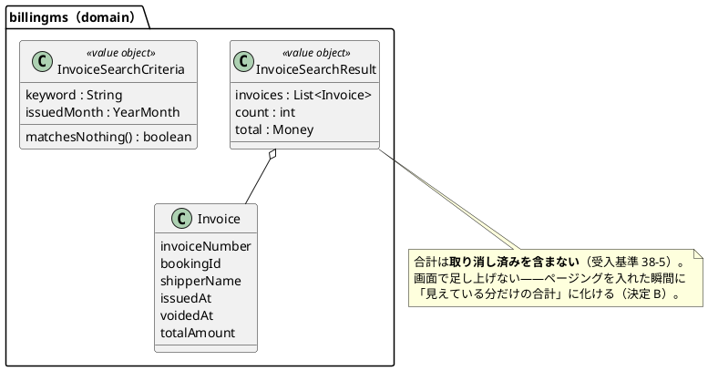
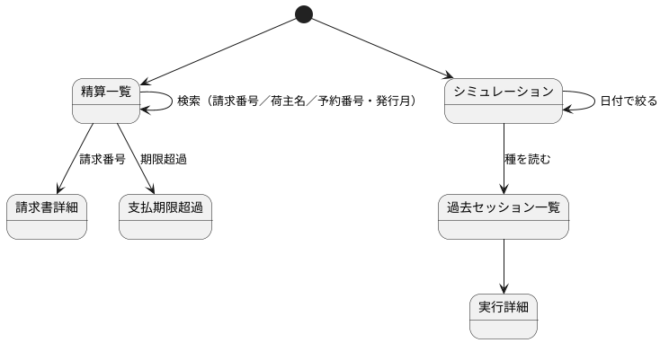

<!-- markdownlint-disable MD013 -->

# イテレーション 16 計画

## 概要

| 項目 | 内容 |
| :--- | :--- |
| イテレーション | IT16 |
| 期間 | 2026-12-14 〜 2026-12-27（2 週間） |
| ゴール | 経理の締めを表計算から引き上げ、シミュレーションが実利用者の一覧に残した混入を塞ぐ |
| 対象ストーリー | US38（請求書を検索する）・**US39（貨物の知らせを画面で受け取る・計画外の追加）**＋ IT15 から送った負債 3 件（TD-02・TD-03・TD-04） |
| 計画 SP | **11**（US38 = 3・**US39 = 3**・TD-02 = 2・TD-03 = 2・TD-04 = 1） |
| 局面 | **仕上げ・アウトサイドイン**（[開発戦略](development_strategy.md)。画面から入る） |
| 前提 | [IT15 完了報告書](iteration_report-15.md)・[IT15 ふりかえり](retrospective-15.md)・[IT15 レビュー](../review/イテレーション15_review_20260901.md) |
| リリース | [Release 2.3](release_plan.md)（締めの仕上げとシミュレーションの後始末）——**本 IT で完了する** |

---

## ゴール

### イテレーション終了時の達成状態

1. **締めが画面で終わる**: 経理担当者が請求番号・荷主名・予約番号で請求書を探し、発行月で絞って合計を読める。表計算に写す作業が要らない。
2. **朝の一覧が信用できる**: キャンセル承認待ち・荷役・通関の一覧から、シミュレーション由来が消える。**夜間の継続実行を禁じる運用が要らなくなる。**
3. **落ちた実行に翌朝辿り着ける**: 日付で絞り込め、過去のセッションと種を読める。実行一覧からセッションと種が分かる。
4. **単一 Pod の前提が明示される**: 継続実行のスケジューラが `replicas: 1` を前提にしていることが、文章ではなく**検査**で固定される。

### 成功基準

- [ ] US38 の受入基準 6 件が、E2E / API / ドメインのテストで 1:1 に対応している。
- [ ] **合計が取り消し済みを含まないこと**を、赤伝を 1 件置いた状態のテストで固定している（含めると合計が誤る形を赤で見る）。
- [ ] TD-02 の 5 つの一覧について、**実業務の案件を 1 件置いた状態**で `contains(実業務).doesNotContain(SIM)` を確かめている（IT15 で空振りした形を繰り返さない）。
- [ ] `replicas: 1` を 2 に変えるとマニフェストの検査が赤くなる。
- [ ] IT15 のふりかえり Try 5 件を計画と DoD に反映している。
- [ ] 画面を伴うため、ユーザーマニュアルと画面キャプチャを更新する。**マニュアルから「夜間の継続実行を禁じる」記述を外す**（TD-02 完了時）。
- [ ] テストカバレッジ 80% 以上、ドメイン層 90% 以上。

---

## ユーザーストーリー

### 対象ストーリー

| ID | ユーザーストーリー | SP | 優先度 |
| :--- | :--- | :--- | :--- |
| US38 | 請求書を検索する（[#563](https://github.com/k2works/case-study-cargo-tracker/issues/563)） | 3 | 中 |
| US39 | 貨物の知らせを画面で受け取る（[#567](https://github.com/k2works/case-study-cargo-tracker/issues/567)） | 3 | 中 |
| [TD-02](https://github.com/k2works/case-study-cargo-tracker/issues/564) | シミュレーション由来を実利用者の 5 つの一覧から外す | 2 | — |
| [TD-03](https://github.com/k2works/case-study-cargo-tracker/issues/565) | 落ちた実行への到達性 | 2 | — |
| [TD-04](https://github.com/k2works/case-study-cargo-tracker/issues/566) | 継続実行の単一 Pod 前提を決定として残す | 1 | — |
| **合計** | | **11** | |

### ストーリー詳細

#### US38: 請求書を検索する（3 SP）

**として**: 経理担当者 / **したい**: 請求番号・荷主名・予約番号で探し、発行月で絞って合計を見たい

**受入基準**（[正典](../requirements/user_story.md)）:

| # | 受入基準 |
| :--- | :--- |
| 38-1 | 請求番号・荷主名・予約番号のいずれかで検索できる（部分一致） |
| 38-2 | 発行月で絞り込める |
| 38-3 | 検索結果の件数と**金額の合計**が表示される |
| 38-4 | 検索条件を組み合わせられる |
| 38-5 | 取り消し済みの請求書は合計に含めない |
| 38-6 | シミュレーション由来は検索結果に出ない |

> **4 度目の申し送りである。** IT11・IT12 で経理担当者から 2 IT 連続の指摘。
> **返済枠ではなく SP 付きのストーリーとして載せた**（[IT15 ふりかえり](retrospective-15.md) Keep 3）。

#### US39: 貨物の知らせを画面で受け取る（3 SP・**計画外の追加**）

**として**: 荷主 / **したい**: 自社の貨物に何かあったとき、画面を開いているあいだに知らせてほしい

**計画を立てたあとに要望があった。** 黙って足さず、正典（[user_story.md](../requirements/user_story.md)）・
[リリース計画](release_plan.md)・本計画の 3 つを同じ変更で更新している。
**コミットメントが 11 SP になりベロシティ実績 8.6 を上回るため、溢れる分は
TD-03（落ちた実行への到達性）から落とす**ことを先に決めた——統計からは辿れるため、
落としても業務が止まらない唯一の項目である。

| # | 受入基準 |
| :--- | :--- |
| 39-1 | 新しい知らせがポップアップで出る |
| 39-2 | ポップアップからその貨物の詳細へ行ける |
| 39-3 | 一度出た知らせは、**別の端末で開き直しても**もう一度出ない |
| 39-4 | 他社の貨物の知らせは、番号を知っていても届かない |
| 39-5 | 荷主以外では何も出ない（読みにも行かない） |
| 39-6 | シミュレーションが作った貨物の知らせを、確認用の利用者で見られる |

> **押し出す仕組みにしない。** ブラウザは RabbitMQ を直接読めない——購読するのは
> trackingms で、画面が読むのはその結果である。押し出す経路（WebSocket・SSE）を足すと、
> Gateway と認証をもう 1 本通すことになる。

#### TD-02: シミュレーション由来を実利用者の 5 つの一覧から外す（2 SP）

**IT15 の最優先引き継ぎ**——荷役作業員と通関の担当者は朝いちばんに自分の一覧を見て
今日やることを決め、**他の入口が無い**。

| # | 一覧 | サービス | エンドポイント |
| :--- | :--- | :--- | :--- |
| 1 | キャンセル承認待ち | bookingms | `GET /api/v1/cancellations` |
| 2 | 陸揚げ待ち | bookingms | `GET /api/v1/cancellations/awaiting-discharge` |
| 3 | 荷役作業 | handlingms | `GET /api/v1/handling` |
| 4 | 通関申告 | handlingms | `GET /api/v1/customs` |
| 5 | 通関の期限超過 | handlingms | `GET /api/v1/customs/overdue` |

> **当初は 3 つと書いていた。** 自己検証でコントローラを読み直したところ、
> **陸揚げ待ちと通関の期限超過**が漏れていた——マニュアルの表は「キャンセル承認待ち・
> **陸揚げ待ち**（追跡管理者）」と 2 つ挙げており、計画の側が数え落としていた。
> **一覧を数えるときは、画面ではなくコントローラの `@GetMapping` から数える。**

#### TD-03: 落ちた実行への到達性（2 SP）

直近 50 件で切れており、翌朝には落ちた実行が一覧から押し出されている。
日付での絞り込み・過去セッションの一覧（種つき）・実行一覧のセッション/種の列。

#### TD-04: 継続実行の単一 Pod 前提を決定として残す（1 SP）

`ContinuousRunScheduler` は間隔と上限をメモリ上の状態で守る。Pod が増えると
**どちらも守られない**。ADR に決定として残し、`replicas: 1` を検査で固定する。

---

## 着手前に決めること

| # | 決めること | 組み合わせて効く既存決定 | 本 IT での決定（案。Phase 1 で ADR-033 に固定する） |
| :--- | :--- | :--- | :--- |
| A | 検索を SQL に降ろすか、読んでから絞るか | IT12 の負債「`overdue()` の全件走査と `billable()` の N+1」 | **SQL に降ろす。** 請求書は月ごとに増え続ける。読んでから絞る形は、増えた分だけ確実に悪化する。**同じ条件を件数・合計にも掛ける**（3 か所で別々に持たない） |
| B | 合計をどこで出すか | [ADR-027] 決定 4（発行した金額は動かない） | **SQL の集計で出す。** 画面で足し上げると、ページングを入れた瞬間に「見えている分だけの合計」に化ける |
| C | 荷役・通関の由来をどう知るか | [ADR-030] 決定 3（由来は荷主コードの帯）・IT15 の `ShipperCargoSnapshotFinder` | **既存の ACL ポートに追跡番号で問い合わせる。** handlingms に新しい越境点を作らない——[記憶] 「ACL ポートだけが越境点」 |
| D | 由来の判定をどこに置くか | IT15 の `simulatedAmong` | **判定は bookingms に 1 つだけ置く。** 各サービスが `SIM-` の前方一致を自前で持つと、帯を変えたときに取り残しが出る |
| E | 単一 Pod をどう固定するか | [記憶] 「ADR の規則は同じ変更で検査に落とす」 | **マニフェストを読む検査で `replicas: 1` を固定する。** 文章だけで残すと守られない（ADR-009 は 7 IT のあいだ半分守られなかった） |

---

## タスク

### Phase 0: IT15 から送った返済枠（0 SP・**IT 序盤に独立コミットで着手する**）

> **「余力次第」にしない**（[IT15 ふりかえり](retrospective-15.md) Keep 3）。
> 落とす場合は「余力が無かった」ではなく**スコープ外**として理由を明記する。

| # | タスク | 由来 | 見積 | 状態 |
| :--- | :--- | :--- | :--- | :--- |
| 0.1 | IT15 のふりかえり Try 5 件を本計画の DoD に反映する | Try 1-5 | 2h | [ ] |
| 0.2 | **使う予定の運用タスクを一度空打ちする**（`release:*`・`sonar-local:check`・`dev:k8s:*`） | Try 3 | 2h | [ ] |
| 0.3 | レビューの待ち時間の上限（1 時間）を先に決め、DoD に書く | Try 4 | 1h | [ ] |
| 0.4 | 独立したレビューが返らなかった 4 視点（programmer / tester / architect / technical-writer）を実施する | [IT15 レビュー](../review/イテレーション15_review_20260901.md) | 4h | [ ] |
| 0.5 | `SONAR_ADMIN_TOKEN` の設定と Hotspot 2 件の承認 | IT14 からの引き継ぎ（**利用者の作業が要る**） | 1h | [ ] |

> **0.5 は自分だけでは閉じられない。** 資格情報が要る。着手時点で利用者に依頼し、
> **返らなければ「未承認のまま記録」を繰り返さず、ゲート条件の見直しを検討する**
> （3 度目の申し送りになっている）。

### Phase 1: 受け入れテストと ADR

| # | タスク | 見積 | 状態 |
| :--- | :--- | :--- | :--- |
| 1.1 | US38 の受入基準 6 件を E2E の骨組みで置く（**赤で始める**） | 3h | [ ] |
| 1.2 | ADR-033（請求書検索の絞り込みと合計・継続実行の単一 Pod 前提）を書く | 3h | [ ] |

### Phase 2: 請求書検索（US38・3 SP）

| # | タスク | 見積 | 状態 |
| :--- | :--- | :--- | :--- |
| 2.1 | 検索条件の値オブジェクト（部分一致・発行月）をドメインに置く | 3h | [ ] |
| 2.2 | `InvoiceMapper` に検索・件数・合計を足す。**同じ条件を 1 か所で組み立てる** | 4h | [ ] |
| 2.3 | 取り消し済みを合計から外す。**赤伝を 1 件置いたテストで固定** | 2h | [ ] |
| 2.4 | 検索 API（`GET /api/v1/billing/invoices?...`）と契約テスト | 3h | [ ] |
| 2.5 | 画面に検索欄・発行月の絞り込み・件数と合計を出す | 4h | [ ] |
| 2.6 | 方言スモーク（PostgreSQL / H2 の両方で文が通る）を通す | 1h | [ ] |

> **2.6 を外さない。** 部分一致は方言差が出やすい（`ILIKE` は H2 の互換モードでも
> 通るが、実行時にしか出ない差がある——[記憶] 「方言スモークで捕まる範囲は狭い」）。

### Phase 3: 一覧からの除外（TD-02・2 SP）

| # | タスク | 見積 | 状態 |
| :--- | :--- | :--- | :--- |
| 3.1 | handlingms に由来を問い合わせる ACL ポートを足す（**bookingms の既存 API を使う**） | 4h | [ ] |
| 3.2 | 荷役・通関・通関の期限超過の 3 つから由来を外す | 3h | [ ] |
| 3.3 | キャンセル承認待ち・陸揚げ待ちの 2 つから SQL で外す（bookingms 内なので越境しない） | 2h | [ ] |
| 3.4 | **5 つとも実業務の案件を 1 件置いた状態**で除外を確かめる | 4h | [ ] |

> **3.4 が本体である。** IT15 では空の一覧に対して `doesNotContain` を確かめており、
> **何も判別していなかった**。`contains(実業務).doesNotContain(SIM)` で書く。

### Phase 4: 落ちた実行への到達性（TD-03・2 SP）

| # | タスク | 見積 | 状態 |
| :--- | :--- | :--- | :--- |
| 4.1 | 実行一覧に日付での絞り込みを足す（SQL に降ろす） | 3h | [ ] |
| 4.2 | 過去セッションの一覧（種・設定・期間・成否の内訳） | 4h | [ ] |
| 4.3 | 実行一覧にセッション・種の列を出す | 2h | [ ] |

### Phase 5: 単一 Pod の前提（TD-04・1 SP）

| # | タスク | 見積 | 状態 |
| :--- | :--- | :--- | :--- |
| 5.1 | ADR-033 に決定として残す（前提の外にあるものも書く） | 1h | [ ] |
| 5.2 | マニフェストを読む検査で `replicas: 1` を固定する。**2 に変えて赤を見る** | 3h | [ ] |

### Phase 6: 設計・マニュアル・品質ゲート・リリース

| # | タスク | 見積 | 状態 |
| :--- | :--- | :--- | :--- |
| 6.1 | 設計ドキュメント（`data-model` / `ui_design` / `domain-model`）へ反映 | 3h | [ ] |
| 6.2 | マニュアル更新・画面キャプチャ再生成。**「夜間の継続実行を禁じる」を外す** | 3h | [ ] |
| 6.3 | 実環境で通す（検索・5 つの一覧・継続実行を一晩回す） | 4h | [ ] |
| 6.4 | 品質ゲート（`build` + CI + SonarQube）とリリース | 3h | [ ] |

> **6.3 で「一晩回す」ことが TD-02 の検収である。** 禁じていた運用を解くのだから、
> 解いた状態で朝の一覧を見る。

### 見積もり合計

| Phase | 見積 |
| :--- | :--- |
| Phase 0（返済枠） | 10h |
| Phase 1 | 6h |
| Phase 2（US38） | 17h |
| Phase 3（TD-02） | 13h |
| Phase 4（TD-03） | 9h |
| Phase 5（TD-04） | 4h |
| Phase 6 | 13h |
| **合計** | **72h** |

---

## スケジュール

### Week 1（Day 1-5）

| Day | 内容 |
| :--- | :--- |
| 1 | Phase 0（返済枠・4 視点レビューの起動） |
| 2 | Phase 1（受入テストの骨組み・ADR-033） |
| 3-4 | Phase 2（請求書検索） |
| 5 | Phase 3 前半（ACL ポート） |

### Week 2（Day 6-10）

| Day | 内容 |
| :--- | :--- |
| 6 | Phase 3 後半（5 つの一覧・除外の検査） |
| 7 | Phase 4（到達性） |
| 8 | Phase 5（単一 Pod）・Phase 6.1 |
| 9 | Phase 6.2-6.3（マニュアル・実環境で一晩回す） |
| 10 | Phase 6.4（品質ゲート・リリース）・クローズ |

---

## 設計

### ドメインモデル（本 IT のスコープ）

> **状態遷移図は省略する。** 本 IT で状態を持つ集約を新設・変更しない
> （検索は読み取り、除外は問い合わせ条件、単一 Pod は配備の制約）。

### データモデル

`invoice` 表への**列の追加は無い**。検索に使う列（`invoice_number` / `shipper_name` /
`booking_id` / `issued_at` / `voided_at` / `simulated`）はすべて既存である。

| 追加するもの | 対象 | 理由 |
| :--- | :--- | :--- |
| `V8__invoice_search_index.sql` | `invoice(issued_at)`・`invoice(shipper_name)` | 発行月の絞り込みと荷主名の部分一致が全件走査になるのを避ける |

> **部分一致に索引は効きにくい。** 前方一致でない検索に索引を張っても走査は残る。
> **効くのは発行月の絞り込みが先に掛かる場合**であり、そのことを ADR-033 に書く
> ——「索引を張ったから速い」と読まれないようにする。

### 画面遷移

### API 設計

| メソッド | パス | 用途 |
| :--- | :--- | :--- |
| GET | `/api/v1/billing/invoices?keyword=&issuedMonth=` | 請求書の検索（件数・合計を含む） |
| GET | `/api/v1/simulations/sessions?from=&to=` | 過去セッションの一覧 |
| GET | `/api/v1/simulations/runs?from=&to=&sessionId=` | 実行の絞り込み |

> **既存の `GET /api/v1/billing/invoices` に条件を足す形にする。** 別のパスを作ると、
> 一覧と検索で結果の形が食い違う余地が生まれる。

### ADR

| ID | 内容 |
| :--- | :--- |
| [ADR-032](../adr/032-shipper-notification-delivery.md) | 荷主への知らせをどう届けるか（US39・**本 IT で作成済み**） |
| ADR-033 | 請求書検索の絞り込みと合計・継続実行の単一 Pod 前提 |

---

## リスクと対策

| リスク | 影響 | 対策 |
| :--- | :--- | :--- |
| handlingms から bookingms への新しい同期依存 | 一覧の表示が bookingms の可用性に引きずられる | **由来が引けないときは「出す」側に倒す**——実業務の案件を落とすより、シミュレーションが混ざる方が害が小さい。倒れた向きをログに残す |
| 部分一致の検索が遅い | 締めの作業が止まる | 発行月の絞り込みを**必須ではなく既定で当月**にし、無条件の全件検索を作らない |
| 一晩回した結果、別の一覧に混入が見つかる | TD-02 が閉じない | 6.3 を Day 9 に置き、直す時間を Day 10 に残す |
| 4 視点レビューがまた返らない | 自己レビューの弱さが続く | 0.3 で**待ち時間の上限を先に決める**（Try 4） |

---

## 整合性検証結果

### 実施方法（正直に記録する）

**独立した検証は返ってこなかった。** `validating-iteration-plan` / `validating-design` を
別のエージェントで起動したが、両方とも結果を返さないまま idle になった
（IT15 でレビュー 5 視点のうち 4 つが返らなかったのと同じ形である）。
**Try 4 に従い、待ち時間の上限を超えた時点で自己検証に切り替えた**——
自己検証は独立した検証より弱く、見落としの可能性を差し引いて読む必要がある。

### 詳細突合（上流設計との整合）

| 観点 | 判定 |
| :--- | :--- |
| US38 の ID・受入基準が [正典](../requirements/user_story.md) と一致 | 一致（本 IT で正典に起票） |
| 検索に使う列が実スキーマに存在（`invoice_number` / `shipper_name` / `booking_id` / `issued_at` / `voided_at` / `simulated`） | **6 列すべて存在**（V2・V4・V7 で確認）。列の追加は不要 |
| マイグレーション番号 | billingms は V7 まで。**V8 が次**（[記憶] 「マイグレーションは数値順で読む」） |
| API パスが既存と整合 | `GET /api/v1/billing/invoices` は既存。**条件を足す形にし、別パスを作らない** |

### 横断整合（戦略・過去計画との連続性）

| 軸 | 判定 |
| :--- | :--- |
| A（開発戦略） | **不整合を検出し、設計側を直した**——`development_strategy.md` に IT16 の局面が無かった。**仕上げ（アウトサイドイン）**として追加した |
| B（設計トピックカバレッジ） | 状態遷移図は省略（理由を明記）。新規の値オブジェクト 2 件は Phase 6.1 で `domain-model.md` へ反映する |
| C（BC 独立性） | handlingms → bookingms は**既存の ACL ポート経由**とし、新しい越境点を作らない（IT15 の `ShipperCargoSnapshotFinder` と同じ形） |
| C（前 IT 引き継ぎの反映） | **1 件の数え落としを検出**——TD-02 の対象を 3 つと書いていたが、コントローラの `@GetMapping` から数えると **5 つ**だった（陸揚げ待ち・通関の期限超過が漏れ）。計画を修正した |

---

## 完了条件

### Definition of Done

- [ ] US38 の受入基準 6 件が満たされ、テストと 1:1 に対応している
- [ ] **合計に取り消し済みが入らないことを、赤伝を置いた状態で確かめている**
- [ ] 5 つの一覧の除外を、**実業務の案件を置いた状態**で確かめている（空の一覧で確かめない）
- [ ] `replicas: 1` を 2 に変えると検査が赤くなる
- [ ] **新しく生成する値・運ぶ値は、届く先までのテストを同じ変更で書いている**（Try 1）
- [ ] **API の要求・応答・契約に項目を足す変更では、コミット前に IT14 Try 2 を読む**（Try 2）
- [ ] **使う予定の運用タスクを序盤に一度空打ちしている**（Try 3）
- [ ] **レビューの待ち時間の上限を先に決め、超えたら自己レビューへ切り替えたことをレポートに書く**（Try 4）
- [ ] **テストを直したときは、実装の誤りかテストの前提かをコミットメッセージに書いている**（Try 5）
- [ ] マニュアルを更新し、**「夜間の継続実行を禁じる」記述を外している**
- [ ] `./gradlew build` 緑・フロントエンド緑・E2E 緑・CI 緑
- [ ] SonarQube Quality Gate PASS（**Hotspot 承認まで含む**。閉じられない場合は理由を記録）
- [ ] カバレッジ 80% 以上・ドメイン層 90% 以上

### デモ項目

| # | 項目 | 検査 |
| :--- | :--- | :--- |
| 1 | 荷主名で請求書を探し、当月で絞って合計を読む | E2E |
| 2 | 赤伝を 1 件出しても合計が変わらない | 結合 |
| 3 | 継続実行を一晩回した翌朝、5 つの一覧がすべて実業務だけ | 結合 + 実環境 |
| 4 | 落ちた実行を日付で絞って開き、種を読む | E2E |
| 5 | `replicas: 2` に変えると検査が落ちる | マニフェスト検査 |

> **デモ項目には検査を対応させる**（[記憶] 「実演で緑になるものは、実装済みでも
> 固定されていないことがある」）。

---

## 更新履歴

| 日付 | 更新内容 |
| :--- | :--- |
| 2026-09-01 | 初版作成（IT15 のふりかえり・レビューの引き継ぎを反映） |

---

## 関連ドキュメント

- [リリース計画](release_plan.md)
- [IT15 完了報告書](iteration_report-15.md)
- [IT15 ふりかえり](retrospective-15.md)
- [IT15 レビュー](../review/イテレーション15_review_20260901.md)
- [ユーザーストーリー](../requirements/user_story.md)
