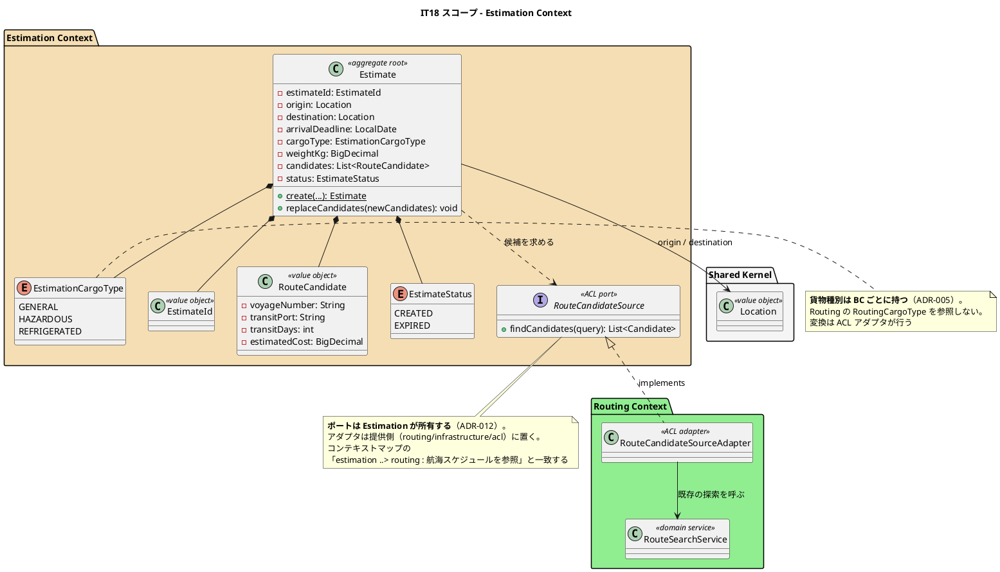
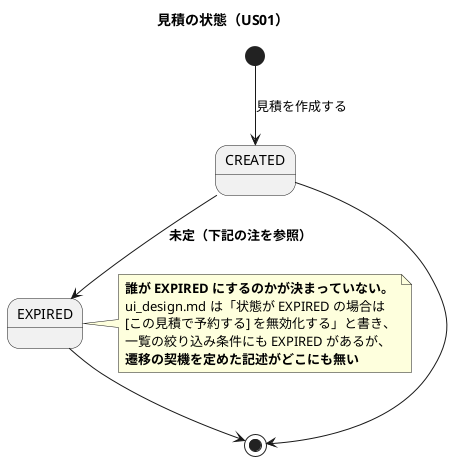
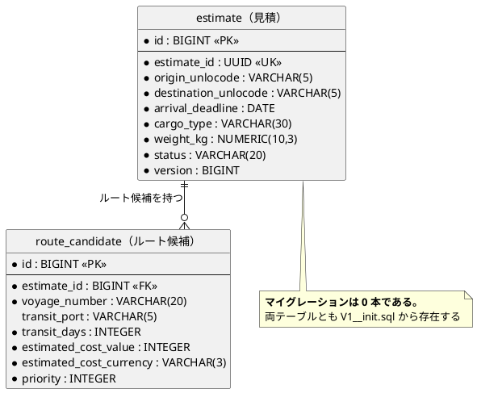
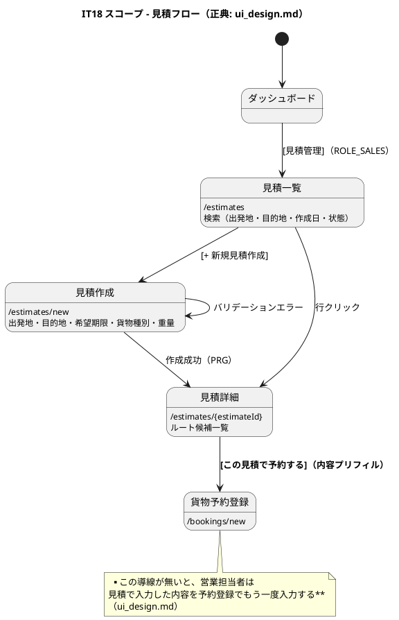

# イテレーション 18 計画

## 概要

| 項目 | 内容 |
| :--- | :--- |
| **イテレーション** | 18 |
| **期間** | 10 営業日 |
| **局面** | **見積**（`development_strategy.md`。アウトサイドイン） |
| **ゴール** | 営業担当者が輸送条件から概算を作り、その内容のまま予約へ進めるようにする |
| **目標 SP** | **5**（US01）。返済枠は SP 外 |

---

## ゴール

### イテレーション終了時の達成状態

1. **営業担当者が見積を作れる**。出発地・目的地・希望期限・貨物仕様を入れると、**実在する便**からルート候補が出る
2. **見積の内容のまま予約へ進める**。同じ条件を 2 度入力しない
3. **最後の未実装 BC が無くなる**。`estimation/` が `package-info.java` だけの状態を終える

### 成功基準

- [ ] US01 の受入基準 6 件をすべて満たす（正典: `../requirements/user_story.md`）
- [ ] **見積の数字が Routing の探索と概算から来ている**（固定値でない）
- [ ] **育つ負債（C1・C2）に着手している**

---

## 前イテレーションの学びの反映（ふりかえり Try）

IT17 の Try 6 件のうち、本 IT に効くものを計画へ落とす。

| Try | 本 IT での落とし込み |
| :--- | :--- |
| **T1** 認可を変えたら画面の出し分けも見直す | **DoD の到達性に「押せないボタンが出ていないか」を入れた**（下記）。見積は ROLE_SALES 専用であり、他ロールに入口・ボタンを出さない |
| **T2** 「検査で固定した」と書く前に実行の出力を確認する | 返済枠 C2 の作業手順に組み込む |
| **T3** 検査の失敗メッセージに由来を入れる | **返済枠 C2 そのもの** |
| **T4** 解析失敗で行を落とすときは気づく手段を残す | 見積の一覧・詳細で「読めない行を黙って落とす」形を作らない |
| **T5** 正規表現の識別子は `\p{L}` を使う | 検査を触るとき（C2）に適用 |
| **T6** バッチ作業では各区切りで `check` を回す | タスクの区切りごとに `check`（`test` で止めない） |

---

## 着手前に決めたこと

**正典が食い違っていた。着手前に決着させた**（IT17 の Try T6 の継続）。

| 論点 | 決定 | 影響 |
| :--- | :--- | :--- |
| ルート候補をどこから作るか | **Routing に ACL ポートで問い合わせる** | `domain-model.md` の「スタブ実装（固定値）」の記述を改訂し、**ADR-023 を起票する**。SP は 5 |

**なぜスタブを採らなかったか。** `domain-model.md` は「ルート候補はスタブ実装（固定値）で生成される。将来、外部ルーティングサービスとの連携時に置換予定」と書いていた。しかし **ADR-006 は外部連携を採らないと決めており、その「将来」は来ない**。一方 Routing には US08 で本物の探索が入っている。

固定値を返す見積は、**画面は動くのに数字が現実と無関係**になる。荷主に渡る数字であり、実在しない便の所要日数と費用を「概算」として提示することになる。

---

## 対象

### ユーザーストーリー

| ID | ユーザーストーリー | SP | 優先度 |
| :--- | :--- | ---: | :--- |
| US01 | 輸送見積を作成する | 5 | 必須 |
| **合計** | | **5** | |

#### US01: 輸送見積を作成する

**ストーリー**（正典: `../requirements/user_story.md`）:

> **営業担当者**として、荷主の輸送要件（出発地・目的地・希望期限・貨物種別・重量）を入力し、輸送料金と所要日数の見積を作成したい。なぜなら、荷主が予算と納期を事前に把握でき、予約決定を迅速に行えるからだ。

**受入基準**（正典を引用。書き写して固定しない）:

1. 出発地・目的地・希望期限・貨物種別・重量を入力できる
2. 航海スケジュール情報をもとにルート概算候補が表示される
3. ルート候補ごとに「経由港・所要日数・概算料金・航海番号」が表示される
4. 見積情報が保存され、見積番号が発行される
5. 希望期限に間に合うルートが存在しない場合、その旨が通知される
6. 危険物が含まれる場合、危険物申告情報の入力フォームが表示される

### 返済枠（**SP 外**。IT17 の引き継ぎ）

**育つ負債を先に返す**（IT16 の教訓: 落とす順序は見積もりでなく「次の IT で対象が増えるか」で決める）。

| # | 内容 | 実測 | 見積 |
| :--- | :--- | :--- | ---: |
| **C1** | **委譲アクセサを畳む**（テンプレート改修とセット） | 記録 6 レコード・34 個 → **実測 38 ファイル・249 個**（4 度目の過小記録） | 10h |
| **C2** | **検査の失敗メッセージに由来を入れる** | 11 本。歯止め・メタテストのメッセージに由来が無い | 5h |

C3〜C6（育たない負債）は**本 IT では扱わない**。名前で記録して次 IT へ送る。

> **C1 は部分返済にした（IT18 の実績）。** 着手時に数え直したところ、記録の「6 レコード・34 個」に対し**実測は 38 ファイル・249 個**だった。10h で返せる量ではない。
>
> **最大の `BookingView`（39 個）を、テンプレート・Java の呼び出し 4 ファイル・テスト 3 ファイルまで含めて返した。** 残る 210 個は<strong>上限で固定した</strong>（`DelegatingAccessorRatchetTest`）——減らすのは自由だが、増やすと落ちる。**育つ負債を、育たない負債に変えた。**
>
> 残りは名前で記録して次 IT へ送る（`InvoiceView` 22・`CancellationView` 20・`ShipperView` 13・`RouteProposalView` 13 ほか 34 ファイル）。

---

## 設計（IT18 スコープ）

### ドメインモデル図

正典は `../design/domain-model.md` の「7. Estimation Context」。**本 IT で新設するのは実装だけであり、モデルは既に確定している。**

> **注（設計への反映が必要）**: `domain-model.md` は貨物種別を `CargoType` と書いているが、**BC 固有型の命名（`RoutingCargoType` / `HandlingType`）に揃えて `EstimationCargoType` とする**。共有カーネルは `Location` と `ShipperId` の 2 つのみである（ADR-005）。本 IT で `domain-model.md` を改訂する。

### 状態遷移図

> **注（設計への反映が必要）**: **`EXPIRED` への遷移の契機が正典のどこにも無い。** `domain-model.md` のビジネスルールは「作成時のデフォルトは `CREATED`」までしか定めておらず、`ui_design.md` は `EXPIRED` の画面挙動だけを書いている。
>
> **本 IT では「希望到着期限を過ぎた見積を EXPIRED として扱う」を第 1 案とし、タスク 1 で決着させる。** 画面の分岐だけ作って遷移が起きない状態にはしない —— **状態が変わらない `EXPIRED` は、画面の分岐が永遠に死んでいることを意味する**。

### ER 図

**所有 BC**: `estimate` / `route_candidate` はいずれも **estimation** が所有する。

> **マイグレーションは 1 本になった**（計画時は 0 本と見込んでいた）。候補が 0 件だった理由（`no_candidate_reason`）を残す列が必要だった。**「便が無い」と「期限に間に合わない」は別の事態であり、営業担当者が次に取る行動が違う**（ADR-023）。理由は作成時に決まり、あとから変わらない —— 便はあとで追加されうるが、荷主に伝えたのは作成時点の話である。

> **開始準備の突合で誤りを 1 件見つけ、直した。** `route_candidate` は正典（`data-model.md` の所有表）でも検査の名簿でも **Routing** になっていた。しかし `route_candidate.estimate_id` は `estimate(id)` を参照しており、**ER 図もテーブル定義も見積の子テーブルとして書いていた**。
>
> **IT17 の R2（正典と検査の突合）はこれを検出できなかった。** 正典の表は IT16 に検査の名簿から書き起こしたもので、**両方が同じ間違いをしていた**。突合が守るのは「2 か所がずれないこと」であって「正しいこと」ではない。
>
> 気づいたのは**スキーマまで遡ったとき**である。直さずに着手すれば、estimation のマッパーが `route_candidate` を触った瞬間に「越境」として赤くなっていた。

### 画面遷移図

### ナビゲーションと到達性

| 画面 | パス | 表示ロール | 正典 |
| :--- | :--- | :--- | :--- |
| 見積一覧 | `/estimates` | **ROLE_SALES** | `ui_design.md` のナビゲーション構成表 |

- navbar「見積管理」は**構成表に既に載っている**（実装が無いだけ）
- ダッシュボードにも ROLE_SALES の入口を出す
- **T1 の反映**: 他ロールに入口を出さない。かつ**出した先で押せないボタンを出さない**

### ADR

| ADR | タイトル | ステータス |
| :--- | :--- | :--- |
| **ADR-023** | **見積のルート候補は Routing の探索から作る**（スタブを採らない） | 本 IT で起票 |

---

## タスク分解

**アウトサイドイン**（局面の指定どおり）。画面から入り、既にある部品へ繋ぐ。

### 0. 設計の欠落を決着させる — 4h（**完了** `36a2eb473`）

- **`EXPIRED` の遷移契機**を決める（第 1 案: 希望到着期限を過ぎたら期限切れ）。`domain-model.md` のビジネスルールに追記
- **貨物種別の命名**を `EstimationCargoType` に決める（ADR-005 / BC 固有型）。`domain-model.md` を改訂
- **ルート候補の出所**を ADR-023 として起票し、`domain-model.md` の「スタブ実装」記述を改訂
- `data-model.md` の所有表と `MapperTableOwnershipTest.OWNER` に `estimate` / `route_candidate` が **estimation** として載っていることを確認

### 1. 見積一覧の画面（空の状態から） — 6h（**完了** `ec3d59356`）

- `/estimates` の一覧・検索・空状態
- navbar とダッシュボードの入口（ROLE_SALES）
- **ロール別到達性の検査**（T1: 入口が出るか＋**押せないボタンが出ていないか**）

### 2. 見積の作成 — 10h（**完了** `5b6b92da6` / `b86227e9b`）

- `Estimate` 集約・`EstimateId` / `RouteCandidate` / `EstimationCargoType` / `EstimateStatus`
- `EstimateRepository`（MyBatis。**マイグレーションは 0 本**）
- `/estimates/new` のフォームと検証（出発地 ≠ 目的地・期限は当日以降）
- 危険物を選んだときの申告欄（受入基準 6。US05 と同じ仕組み）
- PRG で詳細へ

### 3. ルート候補を Routing から取る — 10h（**完了** `060d5dd6a`）

- `RouteCandidateSource` ポート（estimation が所有）
- `RouteCandidateSourceAdapter`（routing/infrastructure/acl）が `RouteSearchService` を呼ぶ
- **BC 間で型を渡さない**。アダプタが変換する（ADR-005 / ADR-012）
- **候補が 0 件のときの通知**（受入基準 5）。「便が無い」と「期限に間に合わない」を**区別する**
- **問い合わせ回数の計測**（IT16 の T3 / IT17 の R5。一覧は件数に比例させない）

### 4. 見積詳細と予約への引き継ぎ — 8h（**完了** `2b520c070`）

- ルート候補一覧（経由港・所要日数・概算料金・航海番号）
- **「概算です。実際の経路は予約時に確定します」の明示**（ADR-006 / ADR-008）
- `[この見積で予約する]` で `/bookings/new` へプリフィル
- `EXPIRED` のときの無効化と `[同じ条件で再見積]`

### 5. 返済枠 C1: 委譲アクセサを畳む — 10h（**部分完了** `d51c748ce`。実測 249 個のうち 39 個を返し、残りは上限で固定）

- 6 レコードの委譲アクセサをテンプレート改修とセットで畳む
- **テンプレートを触るため、画面のテストを先に確かめてから進む**

### 6. 返済枠 C2: 検査の失敗メッセージに由来を入れる — 5h（**完了** `ae4950be2`。29 件）

- 11 本の検査の失敗メッセージに ADR 番号・IT の指摘番号を入れる
- **歯止め（走査 0 件）とメタテストのメッセージにも入れる**（実測ではここが空だった）
- **T2 の適用**: 「入れた」と書く前に、実際に失敗させて出力を確認する

### 7. ユーザーマニュアル — 6h（**完了** `0beef20f7`。新章 12）

- **新章「見積管理」を追加する**（画面 3 つ）。マニュアルの索引と全体構成表も合わせる
- キャプチャは生成 spec 経由で撮る（手で PNG を置かない）
- **候補が 0 件のときの画面**も撮る —— 業務担当者が最初に戸惑うのはここである

### 8. 途中レビュー — 3h（**完了** `c3a85515d`）

セルフレビュー（中間）。正式なマルチパースペクティブレビューはクローズ時。

### 9. 品質ゲートと破壊検証 — 8h（**完了** `bd0e0042c`）

- `check` / `TZ=UTC check` / E2E / CI / SonarQube
- **本 IT で足した安全装置を全数壊す**（IT17 で「書いたつもりで入っていない検査」を見つけた手順）

### 10. ドキュメント — 4h（**完了**）

`domain-model.md`（3 件の改訂）・`ui_design.md`・`data-model.md`・ADR-023・`test_strategy.md`

**合計 74h**（10 営業日 = 80h）。**余白は 6h。**

---

## スケジュール

| 日 | タスク |
| :--- | :--- |
| Day 1 | 0（設計の決着）＋ 1（一覧の画面） |
| Day 2 | 1（到達性の検査）＋ 2（集約） |
| Day 3 | 2（フォームと検証） |
| Day 4 | 3（ACL ポートとアダプタ） |
| Day 5 | 3（候補 0 件の扱い・計測） |
| Day 6 | 4（詳細と予約への引き継ぎ） |
| Day 7 | 5（C1 委譲アクセサ） |
| Day 8 | 6（C2 失敗メッセージ）＋ 8（途中レビュー） |
| Day 9 | 7（マニュアル） |
| Day 10 | 9（品質ゲート）＋ 10（ドキュメント） |

---

## 落とす順序（**先に決めておく**）

余白が尽きたときに落とす順序を、着手前に決める。

1. **タスク 7（マニュアル）の一部** — キャプチャは撮り、本文の作り込みを削る
2. **タスク 5（C1 委譲アクセサ）** — 育つ負債だが、テンプレート改修を伴うため risk が高い。**落とすなら名前で記録し、次 IT の先頭に置く**
3. **タスク 4 の `[同じ条件で再見積]`** — `EXPIRED` の無効化までは残す

**落とさないもの**: タスク 0（設計の決着）・タスク 3（Routing からの候補）・タスク 6（C2）・タスク 9（品質ゲート）。

- タスク 0 を落とすと、**決まっていない設計のまま実装する**ことになる
- タスク 3 を落とすと、**画面は動くのに数字が現実と無関係**になる（本 IT の主目的）
- タスク 6 は 5h と軽く、育つ負債である

---

## リスクと対策

| リスク | 影響度 | 対策 |
| :--- | :--- | :--- |
| **`EXPIRED` の遷移契機が決まらない** | 高 | タスク 0 で決着させる。決まらなければ**画面の分岐そのものを作らない**（死んだ分岐を残さない） |
| Routing の探索が見積の条件（荷主なし・期限のみ）で使えない | 中 | タスク 3 を早めに置いた。`RoutingCriteria` は荷主を要求しないことを確認済み |
| C1（委譲アクセサ）がテンプレート改修で広く壊す | 中 | 画面のテストを先に確かめる。落とす順序の 2 番目に置いた |
| 新 BC の ArchUnit ルール（BC 集合）に `estimation` が入っていない | 低 | `PackageStructureTest` の BC 集合は既に `estimation` を含む（`package-info.java` があるため）。着手時に確認 |

---

## 完了条件

### デモ項目

1. **営業担当者が見積を作れる**（出発地・目的地・期限・貨物種別・重量）
2. **ルート候補に実在する航海番号が出る**（固定値でない）
3. **候補が 0 件のとき、その旨が出る**（「便が無い」と「期限に間に合わない」を区別する）
4. **危険物を選ぶと申告欄が出る**
5. **見積番号が発行され、一覧から詳細を開ける**
6. **[この見積で予約する] で予約登録に内容が入った状態で進める**
7. **営業担当者以外に見積の入口が出ない**
8. **委譲アクセサが減っている**（C1）
9. **検査の失敗メッセージから由来に辿り着ける**（C2）

### 完了の定義（DoD）

**条件は書き写さず、正典を引用する。**

#### 機能

- [ ] 正典: `../requirements/user_story.md` の US01 受入基準 6 件
- [ ] デモ項目 9 件がすべて動作する
- [ ] **落としたものは名前で記録する**

#### 局面の完了条件

- [ ] 正典: `development_strategy.md` の「見積（IT18）」の節

#### 品質

- [ ] `./gradlew check` が緑
- [ ] **`TZ=UTC ./gradlew check --rerun-tasks` が緑**
- [ ] E2E が緑
- [ ] **CI が緑**（`gh run`）
- [ ] SonarQube Quality Gate が PASS

#### 到達性（ロール別・状態別・**操作可否**）

- [ ] **営業担当者がダッシュボード・navbar の両方から見積一覧へ到達できる**
- [ ] **営業担当者以外に見積の入口が出ない**
- [ ] **T1: 押せないボタンが出ていない**（見えているのに 403 になる操作を作らない）
- [ ] **`EXPIRED` の見積から予約へ進めない**（状態別の到達性）

#### 主張とテスト

- [ ] **着手時に返済枠を数え直した**（C1・C2 の実測値を計画に記録する）
- [ ] **破壊検証で空振り 0**
- [ ] **T2: 「検査で固定した」と書く前に、失敗の出力を確認した**

#### 安全装置（**着手前にリストを作らない**）

実装後に数え上げた結果で埋める。やらなかったものは名前で記録する。

#### ドキュメント

- [ ] `domain-model.md` の 3 件の改訂（ルート候補の出所・`EXPIRED` の契機・`EstimationCargoType`）
- [ ] ADR-023 を起票
- [ ] **マニュアルに「見積管理」の章を追加**（キャプチャは生成 spec 経由）
- [ ] `mkdocs build` の新規警告 0

---

## 更新履歴

| 日付 | 内容 |
| :--- | :--- |
| 2026-08-12 | 初版作成（`opening-iteration` のステップ 2）。**ルート候補の出所を着手前に決着させた**（Routing に ACL で問い合わせる。IT17 の Try T6）。着手前の突合で**設計の欠落を 2 件発見**（`EXPIRED` の遷移契機・貨物種別の命名）し、タスク 0 に載せた |
| 2026-08-12 | 整合性検証（ステップ 3・4）を実施。**`route_candidate` の所有 BC が正典・検査の両方で誤っていた**（Routing → Estimation）。**その場で直した** — 直さずに着手すれば、estimation のマッパーが触った瞬間に越境として赤くなっていた |

---

## 関連ドキュメント

- [イテレーション 17 ふりかえり](retrospective-17.md)
- [リリース計画](release_plan.md)
- [開発戦略](development_strategy.md)
