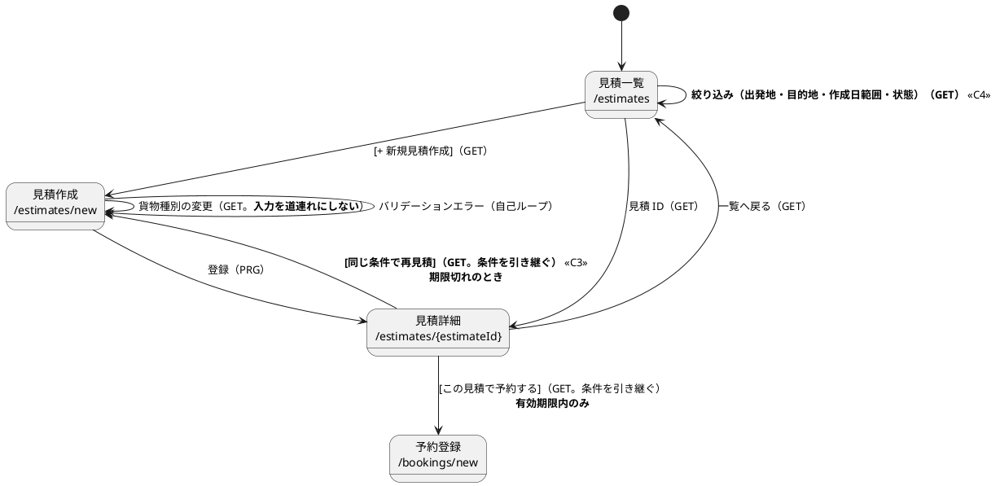

# イテレーション 19 計画

## 概要

| 項目 | 内容 |
| :--- | :--- |
| **イテレーション** | 19 |
| **期間** | 10 営業日 |
| **局面** | **出荷と是正**（`development_strategy.md` への追記が要る。下記「注 1」） |
| **主アプローチ** | **アウトサイドイン**（画面と検査から。ドメインは変えない） |
| **ゴール** | Release 2.1 を出荷済みとして確定させ、**正典に届いていない実装**と**人の記憶に預けている規律**を返す |
| **目標 SP** | **0**（新規ストーリーなし）。達成は**出荷の確定**と**返済枠・Try の完了数**で測る |

> **US01〜US36 のすべてが実装完了しています。** 新しいユーザーストーリーはありません。

### 「整流 3 回目」と呼ばない理由

`development_strategy.md` は整流について「**この局面を繰り返さないことが目的である**」と書いており、
IT17 のふりかえりは「整流（2 回目・**最終**）」と宣言しています。**その宣言を取り消しません。**

本 IT の中身は整流とは別です。

| 整流（IT16〜IT17） | 本 IT（IT19） |
| :--- | :--- |
| 数え上げた**技術的負債**を返す（据え置きの表を空にする） | **正典に届いていない実装**を返す（C3・C4 は `ui_design.md` の未達）＋ **出荷の確定** |
| 対象は自分たちが作った据え置き | 対象は**受入基準と正典との差** |

**局面名を「出荷と是正」とします。** 整流の表（`NOT_SPLIT_YET` / `NOT_MEASURED_YET`）は
IT17 で空になっており、再び埋まってはいません。

---

## ゴール

### イテレーション終了時の達成状態

1. **Release 2.1 が出荷済みとして確定している**。タグ・CHANGELOG・リリース完了報告書が揃い、「何が出荷済みか」が曖昧でなくなる
2. **`ui_design.md` に書いてあって実装に無いものが無くなる**（見積の再見積導線・一覧の絞り込み）
3. **「一覧を足したらスモークにも足す」が人の記憶から検査に移っている**。2 イテレーション続けて外した網を、名簿方式ごとやめる
4. **落としたものが名前で残っている**。返せなかったものは次 IT の先頭に置く

### 成功基準

- [ ] **v2.1.0 のタグとリリース完了報告書がある**（`release_report-2_1_0.md`）
- [ ] **H2 スモークが名簿方式でなくなっている**（未収載 7 件が自動で対象に入る）
- [ ] **US01 の受入基準のうち `ui_design.md` 未達の 2 件が満たされている**（C3・C4）
- [ ] **落としたものを名前で記録している**（下記「本 IT では扱わないもの」）

---

## 前イテレーションの学びの反映（ふりかえり Try）

IT18 の Try 5 件を、本 IT のタスクへ 1 対 1 で落とす。**「余力次第」で置かない** —— 余力次第の返済枠は毎 IT 繰り越されて固定化する（ADR-008 が IT6〜IT8 で 3 回繰り越された前例）。

| Try | 本 IT のタスク | 検査になるか |
| :--- | :--- | :--- |
| **T1** 入力欄を足したら「保存されるか」「他の欄を壊さないか」をセットでテストする | タスク 5 | **なる**（フォームの往復テスト） |
| **T2** 負債を記録するときは、その場で数えた数を書く | 本計画の返済枠表（**実測列を必須にした**） | ならない（記述の規律。DoD で確認） |
| **T3** クエリサービスが H2 スモークに載っているかを検査にする | **タスク 2** | **なる**（名簿方式をやめる） |
| **T4** 画面のキャプチャは「データがある状態」を既定にする | タスク 6 | **なる**（spec 内でデータを作る） |
| **T5** テーブルを足すときは `data-model.md` と検査の名簿を同一コミットで更新する | **タスク 3** | **なる**（逆方向の突合を足す） |

> **T2 だけは検査にできません。** 「数えずに書いた」を機械が判定する手段がないためです。
> 代わりに**本計画の返済枠表に実測列を設け、着手時の数え直しを DoD に入れました**。

---

## 着手前に決めたこと

| 論点 | 決定 | 理由 |
| :--- | :--- | :--- |
| H2 スモークを名簿の追加で直すか、方式ごと変えるか | **方式を変える**（Bean を自動で集めて全件叩く） | **名簿方式は載せ忘れたものほど漏れる**。ADR-015 の名簿が 3 IT 素通りした前例があり、2 IT 連続で外したのは人ではなく方式の問題 |
| Release 2.1 のタグを IT19 の頭で打つか末尾か | **頭で打つ**（タスク 1） | 是正の途中でタグを打つと、**是正のコミットが出荷物に混ざる**。US01 が完成した時点（`a2749d134`）を出荷とする |
| C4 の絞り込みで「状態」を SQL の `estimate.status` 列で絞るか | **絞らない**（`arrival_deadline` と業務 TZ の今日で判定する） | **`estimate.status` 列は書き込まれたまま更新されない死に列**である。読み取りは `EstimateStatus.asOf(arrival_deadline, today)` で導出しており（`MyBatisEstimateQueryService:92`）、`WHERE status='EXPIRED'` は**必ず 0 件**になる |
| C4 の絞り込み規則をどの層に置くか | **application 層**（ADR-022 に従う） | 期限切れの判定は**規則**であり問い合わせではない。infrastructure に書くと ADR-022 に反し、**本 IT のタスク 4（ADR-022 の検査）が自分の実装を赤にする** |

> **注 1（`development_strategy.md` / `release_plan.md` への反映が要る）**: 局面表は IT18 で終わっており、
> IT19 の行がありません。**局面表は 2 か所にあります**（`development_strategy.md` と `release_plan.md:419-426`）。
> IT15 で片方だけ直して忘れた前例が同じ表の直下に記録されているため、**両方を同時に直します**（タスク 9）。
> あわせて `release_plan.md:62` の「開発期間: 18 イテレーション」と進捗表の IT19 行も更新します。
>
> **注 2（`ui_design.md` への反映が要る）**: 見積の画面遷移図（`ui_design.md:476-496`）は 3 遷移しかなく、
> **IT18 で実装済みの `見積詳細 → /bookings/new` すら反映されていません**。C3・C4 とあわせてタスク 9 で反映します。
>
> **注 3（`domain-model.md` への反映が要る）**: `domain-model.md:1227` の `Estimate` に
> `-status: EstimateStatus` フィールドが残っていますが、実装は保持せず期限から導出します。タスク 9 で直します。

---

## 対象

### ユーザーストーリー

**新規はありません。** US01〜US36 はすべて実装完了しています（`release_scope.md:128`）。

ただし **US01 は `ui_design.md` の仕様に 2 点届いていません**（C3・C4）。**「改善」ではなく「未達の返済」**として扱います。

| # | 正典 | 実装 |
| :--- | :--- | :--- |
| C3 | `ui_design.md:1791`「`EXPIRED` の場合は…`[同じ条件で再見積]` を提示する」 | **文言だけで導線が無い**（`estimates/detail.html:68-85`） |
| C4 | `ui_design.md:1760`「出発地・目的地・作成日範囲・状態で絞り込む」 | **絞り込みが無い** |

### 出荷の確定

| 対象 | 内容 |
| :--- | :--- |
| Release 2.1 | US01 輸送見積を作成する（5SP）。IT18 で完了。**タグ・CHANGELOG・リリース完了報告書が未作成** |

### 返済枠（**SP 外**。実測は本計画の作成時に数え直した）

**記録した数ではなく、数えた数を書きます**（Try T2）。

| # | 内容 | 記録 | **実測（計画時）** | 育つか |
| :--- | :--- | :--- | ---: | :--- |
| **T3** | H2 スモークに載っていないクエリサービス | 「2 IT 連続で外した」 | **7 件**（13 件中 6 件のみ収載。`@Autowired` 12 件・`assertThatCode` **24 回**） | **育つ**（BC を足すたび増える） |
| **T5** | 名簿にあって実 DDL に無いテーブル（**逆方向**） | 「同一コミットで更新」 | **0 件**（いまは一致。**検査が片方向しか無い**） | 育つ |
| **T1** | 入力の往復が未検証のフォーム | 「2 件捨てていた」 | **1 画面**（予約登録）。**見積作成は IT18 で検査済み**（下記） | 育たない |
| **T4** | 既存データに依存するキャプチャ | 「1 件」 | **9 件以上**（02 / 03×4 / 04 / 05×2 / 07×2 / 10 / 11 系。**着手時に数え直す**） | 育たない |
| C2 | ラチェットの失敗メッセージにファイル別内訳 | 1 か所 | **1 か所**（`DelegatingAccessorRatchetTest`） | 育たない |
| **C3** | 期限切れの見積に「同じ条件で再見積」（**正典未達**） | 1 画面 | **1 画面** | 育たない |
| **C4** | 見積一覧の絞り込み（**正典未達。4 条件**） | 1 画面 | **1 画面・4 条件** | 育たない |
| C5 | マニュアル 12 章の記述 | 「12.2」 | **12.1 と 12.3**（12.3 には既に「同じ条件でもう一度」の記述あり。**直すのは 12.1 の一覧説明と 12.3 の導線**） | 育たない |
| C6a | 貨物 ID 解析失敗の気づく手段 | 1 件 | **1 か所**（`DischargeOrderSelection.parse()`。ロガー無し） | 育たない |
| C6b | ADR-022 のレビュー観点化 | 1 件 | **観点も検査も 0 件**（ADR は文章だけで守られている） | **育つ**（読み取り側を書くたび） |
| C6c | 滞留の次の一手 | 1 件 | マニュアル 08 に 1 行あり・**節としては無い**。画面からの導線 0 | 育たない |
| C6d | `SelfLinkResolvesTest` の取りこぼし | 1 件 | 他クラス参照 `{@link Xxx#name()}` が**未カバー** | 育たない |

> **T1 の記録が実態より大きかったのは初めてです。** IT18 のふりかえりは「2 件捨てていた」から
> 2 画面と見積もりましたが、**見積作成は IT18 の H1 対応で既にテストがあります**
> （`EstimateCreationTest#貨物種別を変えても入力済みの内容は消えない()` / `#危険物の申告は保存され詳細に出る()`）。
> **数え直しは減る方向にも効きます。**

> **T5 も前提が違っていました。** `MapperTableOwnershipTest#名簿に無いテーブルは所有者が引けない()` は
> **既に `Files.walk(db/migration)` で実 DDL を走査しています**（IT16 の T4）。
> **未実装なのは逆方向** —— 名簿にあって DDL に無い幽霊エントリの検出です。

> **育つのは 3 件**（T3・T5・C6b）です。**落とす順序はこれで決めます** —— 見積もりではなく
> 「次の IT で対象が増えるか」で決める（IT18 の学び）。

---

## 本 IT では扱わないもの（**名前で記録する**）

**記名のない引き継ぎは返済されません**（IT16 の学び）。扱わないものをここに書きます。

| # | 内容 | 実測 | 扱わない理由 |
| :--- | :--- | :--- | :--- |
| **C1** | **委譲アクセサの残り**（IT18 で部分返済） | **210 個・37 ファイル** | **ラチェットで止めてある**（`DelegatingAccessorRatchetTest` の `LIMIT = 210`）。増えれば赤になる。**育たない負債に変えたので、正典未達（C3・C4）より後ろに置く** |
| D1 | `Cargo` が 500 行ちょうど（IT15 から継続） | 1 クラス | **次に `Cargo` を触る IT で**引取まわり（`claimCode` / `consignee` / `claimedAt`）を切り出す。本 IT は `Cargo` を触らない |
| D2 | 返金の扱い（ADR-018 もマニュアルも「別の業務」で止まっている） | 1 件 | **その業務が存在しない**。新しいストーリーの起票が要る |
| D3 | 適格請求書（インボイス制度）の要件 | 1 件 | 同上 |
| D4 | `Location.of` が `new Location(...)` に委譲するだけ | 1 件 | 実害が出ていない |

> **D1〜D4 は IT16 で記名されたあと、IT17・IT18 の計画に節ごと現れませんでした**（3 IT 行方不明）。
> **書く場所を決めていなかったのが原因**です。本 IT でこの節を置き、以後の計画に引き継ぎます。

---

## 設計（IT19 スコープ）

### ドメインモデル図

**省略します。** 本 IT はドメインモデルを変更しません。C3（再見積導線）・C4（絞り込み）はいずれも
画面と読み取り側だけの変更で、集約・値オブジェクトは追加も改変もしません。C4 の期限切れ判定は
**既にドメインに述語があります**（`EstimateStatus.asOf()` / `Estimate.statusAsOf()`）。

### 状態遷移図

**省略します。** `EstimateStatus` の遷移は変えません。期限切れ判定の正典は
`domain-model.md` のビジネスルール 7 と **ADR-019**（画面を開いた時点で判定する）です。

### ER 図

**省略します。** マイグレーションはありません。タスク 3 は既存の DDL を**読む**検査を足すだけです。

> **前提が崩れたら記録します。** IT18 は「マイグレーション 0 本」の見込みが 2 本になりました
> （ふりかえり P6）。本 IT で DDL を足すことになったら、その時点で ER 図を追加します。
>
> **`estimate.status` 列は増やしも減らしもしません。** 死に列であることは「着手前に決めたこと」に
> 記録し、C4 では使いません。**列を消すのは別の判断**であり、本 IT のスコープに入れません。

### 画面遷移図（見積のみ）

C3・C4 で変わる範囲だけを描きます。**`ui_design.md` への反映が要ります**（注 2）。

**C3 の要点**: 予約ボタンに渡している条件（出発地・目的地・期限・貨物種別・重量・危険物 3 項目）は
すべて揃っているので、同じクエリを `/estimates/new` に向けるだけで作り直せます。
**気づく手段は次の行動へ繋ぐ** —— いまは「期限を過ぎています」で行き止まりです。

### ナビゲーションと到達性

**変更なし。** 見積管理は ROLE_SALES 専用で、navbar・ダッシュボードの両方に既に入っています（IT18）。
C4 の絞り込みは一覧の中の操作であり、新しい入口を作りません。

### ADR

| ADR | 内容 | 要否 |
| :--- | :--- | :--- |
| — | H2 スモークの方式変更（名簿 → 自動収集） | **不要**。ADR-003 の「SQL は実 DB で検証する」方針は変えず、補助 DB の網の張り方だけを変える |
| — | ADR-022 の観点化（C6b） | **不要**。新しい決定ではなく、既存 ADR に検査を付ける |
| — | C4 の絞り込み規則を application 層に置く | **不要**。ADR-022 がそのまま適用される（「着手前に決めたこと」に記録） |

> **設計図の向きを変えたら ADR** ですが、本 IT に方向転換はありません。

---

## タスク分解

| # | タスク | 見積 | 状態 |
| ---: | :--- | ---: | :--- |
| 1 | Release 2.1 を出荷として確定させる | 6h | 未着手 |
| 2 | T3: H2 スモークの名簿方式をやめる（**育つ**） | 8h | 未着手 |
| 3 | T5: 名簿の幽霊エントリを検出する（**育つ**） | 4h | 未着手 |
| 4 | C6b: ADR-022 に検査を付ける（**育つ**） | 6h | 未着手 |
| 5 | T1: 予約登録フォームの往復テスト | 4h | 未着手 |
| 6 | T4: キャプチャをデータのある状態で撮る | 5h | 未着手 |
| 7 | C3 / C5: 期限切れの見積から作り直せるようにする（**正典未達**） | 6h | 未着手 |
| 8 | C4: 見積一覧の絞り込み 4 条件（**正典未達**） | 8h | 未着手 |
| 9 | C2 / C6a / C6c / C6d | 10h | 未着手 |
| 10 | ドキュメント（正典 3 件の反映・マニュアル・インデックス） | 7h | 未着手 |
| 11 | 途中レビュー | 3h | 未着手 |
| 12 | 品質ゲートと破壊検証 | 8h | 未着手 |
| | **合計** | **75h** | **余白 5h**（10 営業日 = 80h） |

### 1. Release 2.1 を出荷として確定させる — 6h

- `CHANGELOG.md` に v2.1.0 を追記（US01。**利用者向けの変更点**として書く）
- `docs/development/release_report-2_1_0.md` を作成（`creating-release-report`）
- **`a2749d134`（IT18 クローズ完了時点）に `v2.1.0` タグを打つ** —— 是正のコミットを出荷物に混ぜない
- `release_plan.md` の Release 2.1 を「出荷済み」に

### 2. T3: H2 スモークの名簿方式をやめる — 8h（**育つ**）

- **いまの形**: `H2DialectSmokeTest` が `@Autowired` を手で 12 件並べ、`assertThatCode` を 24 回書いている。クエリサービス 13 件のうち **7 件が未収載**
- **変える形**: `ApplicationContext` から対象 Bean を**自動で集め**、引数なし／既定値で叩ける読み取りメソッドを全件実行する
- **載せ忘れを検出する検査を先に書く**（Red）: 未収載の 7 件のどれかを叩いて赤にする
- **落とし穴**: 引数が要るメソッド・副作用のあるメソッドを叩かないこと。**「叩けなかったもの」を黙って飛ばさず、件数と名前を出す**（名簿方式に戻ってしまう）
- **`DischargeOrderSelection` は Spring Bean ではない**（`final` ＋ private コンストラクタ ＋ static のみ）。自動収集では**原理的に拾えない**ため、**Bean でない読み取り支援クラスをどう扱うかを検査の中で明示する**（黙って対象外にしない）

### 3. T5: 名簿の幽霊エントリを検出する — 4h（**育つ**）

- **既にある**: `MapperTableOwnershipTest#名簿に無いテーブルは所有者が引けない()` が実 DDL → 名簿の方向を検査している（IT16 の T4）
- **足すのは逆方向**: 名簿（`OWNER` ＋ `SHARED_TABLES`）にあって実 DDL に無いテーブルを検出する
- **正典・名簿・実 DDL の 3 者が双方向で揃って初めて意味がある** —— IT18 で「正典と名簿が**両方とも同じ間違い**をしていて検出できなかった」ため

### 4. C6b: ADR-022 に検査を付ける — 6h（**育つ**）

- **ADR の規則は同じ変更で検査に落とす** —— ADR-009 は 7 IT のあいだ半分守られず、違反が 5 本増えていた
- ADR-022 は「読み取り側の**規則**は application 層、**問い合わせ**は infrastructure」
- `infrastructure/repositories` のクエリサービス実装に**判断（条件分岐・並べ替えの規則）が入っていないか**を検査する
- **フィクスチャは実コードの形で作る**（最小の違反例だけだと実コードの違反を見逃す。Flix IT2 で実測 0 件検出の前例）。**既存の実装から違反例を 1 件見つけてから検査を書く**

### 5. T1: 予約登録フォームの往復テスト — 4h

- **見積作成は IT18 で検査済み**（上表の注）。**残るのは予約登録 1 画面**
- **「出るか」ではなく「往復するか」を見る**: 入れた値がすべて保存され、詳細に出ること
- 破壊検証: 1 フィールドの永続化を外して赤になるか

### 6. T4: キャプチャをデータのある状態で撮る — 5h

- **着手時に数え直す**（計画時の実測は 9 件以上）。既存データ（`db/demo/V900-V905`）に依存している spec を洗い出す
- spec 内でデータを作ってから撮る形に寄せる
- **空状態は別に撮る**（`12-estimate-list-empty` の形を標準にする。既に実在）

### 7. C3 / C5: 期限切れの見積から作り直せるようにする — 6h（**正典未達**）

- `estimates/detail.html` の期限切れ分岐に `[同じ条件で再見積]` を足す（条件を引き継ぐ）
- マニュアル **12.3** の導線を実装に合わせる（12.3 には既に「同じ条件でもう一度見積を作成してください」とあるが、**画面にボタンが無い**）

### 8. C4: 見積一覧の絞り込み — 8h（**正典未達**）

- 正典は **4 条件**（出発地・目的地・作成日範囲・状態）。**部分実装にするなら落としたものを名前で記録する**
- **状態は `estimate.status` 列で絞らない**（死に列。「着手前に決めたこと」）。`arrival_deadline` と業務 TZ の今日で判定する
- **絞り込みの規則は application 層に置く**（ADR-022。タスク 4 の検査と衝突させない）
- **一覧は「毎朝どう使うか」から確かめる** —— 期限切れが混ざったままだと一覧全体が信用されない
- 件数を変えて `ListQueryEfficiencyTest` が緑であることを確認する（N+1 を招かない）

### 9. C2 / C6a / C6c / C6d — 10h

| # | 作業 |
| :--- | :--- |
| C2 | ラチェットの失敗メッセージにファイル別内訳（**どのファイルで増えたか**）を出す |
| C6a | `DischargeOrderSelection.parse()` の握り潰しに監査ログを出す（**「例外にしない」は「記録しない」ではない**） |
| C6c | 滞留に気づいた追跡管理者の次の一手を、マニュアル 08 に節として書く |
| C6d | `SelfLinkResolvesTest` を他クラス参照 `{@link Xxx#name()}` まで広げる（**メタテストを先に**。`\p{L}` を使う） |

### 10. ドキュメント — 7h

- **正典 3 件**（注 1〜3）: `development_strategy.md` ＋ `release_plan.md` の局面表（**2 か所を同時に**）・`ui_design.md` の見積画面遷移図・`domain-model.md` の `Estimate.status`
- `release_plan.md:62` の「18 イテレーション」と進捗表の IT19 行
- マニュアル **12.1**（一覧の絞り込み。C4）・**12.3**（再見積。C3 / C5）・**08 章**（C6c）とキャプチャ再生成
- `docs/index.md` / `mkdocs.yml` / 各 index の同期

### 11. 途中レビュー — 3h

タスク 4 を終えた時点で `self-review`（中間）。**正式レビューはクローズ時**。

### 12. 品質ゲートと破壊検証 — 8h

- `TZ=UTC ./gradlew check --rerun-tasks` / E2E / CI / SonarQube
- **本 IT で足した検査を全件壊して赤を確認する**（T3 / T5 / T1 / C6b / C6d）
- **JIG の突合**（`gulp app:jig` を `domain-model.md` / `architecture_backend.md` と。`development_strategy.md` §横断方針）

---

## スケジュール

10 営業日。**タスク番号は上記「タスク分解」に対応する。**

### Week 1（Day 1-5）

| Day | 内容 | 見積 |
| :--- | :--- | :--- |
| Day 1 | タスク 1（Release 2.1 の確定） | 6h |
| Day 2 | タスク 2（T3 H2 スモーク） | 8h |
| Day 3 | タスク 3（T5 幽霊エントリ）4h ＋ タスク 4 着手 4h | 8h |
| Day 4 | タスク 4 完了（C6b ADR-022 の検査）2h ＋ **タスク 11（途中レビュー）** 3h ＋ タスク 5 着手 3h | 8h |
| Day 5 | タスク 5 完了 1h ＋ タスク 6（T4 キャプチャ）5h | 6h |

### Week 2（Day 6-10）

| Day | 内容 | 見積 |
| :--- | :--- | :--- |
| Day 6 | タスク 7（C3 / C5 再見積導線） | 6h |
| Day 7 | タスク 8（C4 絞り込み） | 8h |
| Day 8 | タスク 9（C2 / C6a / C6c / C6d） | 8h |
| Day 9 | タスク 9 完了 2h ＋ タスク 10（ドキュメント） | 9h |
| Day 10 | タスク 12（品質ゲートと破壊検証） | 8h |

> **合計 75h に対して 80h であり、余白は 5h。** IT18 は 74h で余白 6h でしたが、
> **前提が 2 つ崩れて超過しました**（マイグレーション 0 → 2 本、C1 が 34 → 249 個）。
> 本 IT は着手前の突合で**前提の誤りを 3 件（T1・T5・C4 の状態列）先に見つけている**分だけ読みやすいはずです。
> **着手時の数え直しで T4 が増えたら、落とす順序を先に見直します。**

---

## 落とす順序（**先に決めておく**）

**見積もりではなく「次の IT で対象が増えるか」で決めます**（IT18 の学び）。

1. **タスク 6（T4 キャプチャ）** — 件数は増えるが、実害は図の見づらさに留まる
2. **タスク 9 のうち C6c・C6d** — どちらも 1 件で止まっており増えない
3. **タスク 8（C4）の 4 条件のうち出発地・目的地** — 状態と作成日範囲を残す（**期限切れが混ざる問題が主**）

**落とさないもの**: タスク 1（出荷の確定）・タスク 2（T3）・タスク 3（T5）・タスク 4（C6b）・タスク 7（C3）・タスク 10（ドキュメント）・タスク 12（品質ゲート）。

- タスク 1 を落とすと、**何が出荷済みか曖昧なまま**次の IT に入る
- タスク 2・3・4 は**育つ負債**。落とせば次 IT で対象が増える
- タスク 2 は 2 IT 連続で外した網であり、3 度目を作らない
- タスク 7 は**正典未達**であり、落とすと US01 が受入基準に届かないまま出荷済みになる
- **タスク 10 を落とすと局面表の空白が次 IT へ持ち越される**（IT15 で同じことが起きた）

---

## リスクと対策

| リスク | 影響度 | 対策 |
| :--- | :--- | :--- |
| **自動収集の H2 スモークが、叩けないメソッドを黙って飛ばす** | **高** | 「叩けなかった件数と名前」を出力し、0 でなければ理由を明示する。**名簿方式に戻らないこと**が目的 |
| **Bean でない読み取り支援クラス（`DischargeOrderSelection`）が網から落ちる** | 高 | タスク 2 で扱いを明示する。**黙って対象外にしない** |
| C6b の検査が、実コードの違反を 1 件も検出しない（空振り） | 高 | **既存の実装から違反例を 1 件見つけてから検査を書く**。フィクスチャは実コードの形で |
| **C4 の状態絞り込みが常に 0 件になる** | 中 | 死に列を使わないことを着手前に決めた。**「期限切れだけを出す」を実データで確かめる** |
| C4 の絞り込みが一覧の N+1 を招く | 中 | `ListQueryEfficiencyTest` に見積一覧が入っている（281-293 行）。件数を変えて測る |
| タグを打つコミットを取り違える | 中 | `a2749d134`（IT18 のクローズ完了）を明示。**是正のコミットより前**である |
| 本 IT が「Try の消化」だけになり、出荷の確定が後回しになる | 中 | **タスク 1 を初日に置いた** |

---

## 完了条件

### デモ項目

1. **v2.1.0 のタグとリリース完了報告書がある**
2. **新しいクエリサービスを足すと、H2 スモークが自動で対象に入れる**（名簿に書かなくてよい）
3. **名簿にあって DDL に無いテーブルを書くと赤になる**
4. **予約登録で入れた内容がすべて詳細に出る**（テストで固定されている）
5. **期限切れの見積から `[同じ条件で再見積]` で作り直せる**
6. **見積一覧を状態で絞ると、期限切れだけが出る**（0 件にならない）
7. **貨物 ID の解析に失敗した行が、監査ログに残る**
8. **ラチェットが落ちたとき、どのファイルで増えたか分かる**

### Definition of Done

**条件は書き写さず、正典を引用します。**

#### 出荷

- [ ] `CHANGELOG.md` に v2.1.0
- [ ] `docs/development/release_report-2_1_0.md`
- [ ] `v2.1.0` タグ（`a2749d134`）
- [ ] `release_plan.md` の Release 2.1 が「出荷済み」

#### 機能（**正典未達の返済**）

- [ ] 正典: `docs/design/ui_design.md` の「見積一覧」「見積詳細」の仕様
- [ ] デモ項目 8 件がすべて動作する
- [ ] **落としたものは名前で記録する**（「本 IT では扱わないもの」の節を更新する）

#### 局面の完了条件

- [ ] 正典: `development_strategy.md` の「出荷と是正（IT19）」の節（**タスク 10 で追記する**）

#### 品質

- [ ] `./gradlew check` が緑
- [ ] **`TZ=UTC ./gradlew check --rerun-tasks` が緑**
- [ ] E2E が緑
- [ ] **CI が緑**（`gh run`）
- [ ] SonarQube Quality Gate が PASS
- [ ] **JIG を `domain-model.md` / `architecture_backend.md` と突き合わせた**（`development_strategy.md` §横断方針）

#### 到達性（ロール別・状態別・**操作可否**）

- [ ] **期限切れの見積から予約へ進めない**（IT18 で確認済み。回帰していないこと）
- [ ] **期限切れの見積から作り直しへ進める**（C3）
- [ ] **押せないボタンが出ていない**

#### 主張とテスト

- [ ] **着手時に返済枠を数え直した**（上表の実測列を更新する。Try T2）
- [ ] **本 IT で足した検査を全件壊して赤を確認した**（T3 / T5 / T1 / C6b / C6d）
- [ ] **「検査で固定した」と書く前に、失敗の出力を確認した**（IT17 の Try T2）

#### 安全装置（**着手前にリストを作らない**）

実装後に数え上げた結果で埋めます。

#### ドキュメント

- [ ] 正典 3 件の反映（注 1〜3）: 局面表**2 か所**・`ui_design.md` の見積画面遷移図・`domain-model.md` の `Estimate.status`
- [ ] マニュアル 12.1 / 12.3 / 08 章の更新とキャプチャ再生成
- [ ] `mkdocs build` の新規警告 0

---

## 更新履歴

| 日付 | 内容 |
| :--- | :--- |
| 2026-08-12 | 初版作成（`opening-iteration` のステップ 2）。**全 36 US が実装完了したため新規ストーリーは無い**。スコープは「Release 2.1 の出荷確定 ＋ 正典未達の是正」。返済枠は**計画時に数え直した実測**で起票（Try T2） |
| 2026-08-12 | 整合性検証（ステップ 3・4）を反映。**計画の前提が 3 件誤っていた** —— (1) T1 は 2 画面でなく **1 画面**（見積作成は IT18 で検査済み）、(2) T5 は「実 DDL と突合していない」ではなく**逆方向だけが未実装**、(3) C4 の状態絞り込みは `estimate.status` が**死に列**のため SQL で書くと 0 件になる。**いずれも着手前に見つけた**。あわせて C1（残り 210 個）と IT16 からの持ち越し 4 件が計画から**無言で落ちていた**ため「本 IT では扱わないもの」の節を新設。局面名を「整流 3 回目」から「**出荷と是正**」に改めた（戦略の「整流を繰り返さない」という宣言を取り消さないため） |

---

## 関連ドキュメント

- [リリース計画](release_plan.md)
- [開発戦略](development_strategy.md)
- [IT18 計画](iteration_plan-18.md) / [IT18 ふりかえり](retrospective-18.md) / [IT18 完了報告書](iteration_report-18.md)
- [UI 設計](../design/ui_design.md)
- [ADR-019 期限超過は画面を開いた時点で判定する](../adr/019-overdue-detected-on-screen-open.md)
- [ADR-022 読み取り側の規則は application 層に置く](../adr/022-read-side-rules-live-in-application.md)
- [ADR-023 見積のルート候補は Routing の探索から作る](../adr/023-estimate-candidates-from-routing.md)
