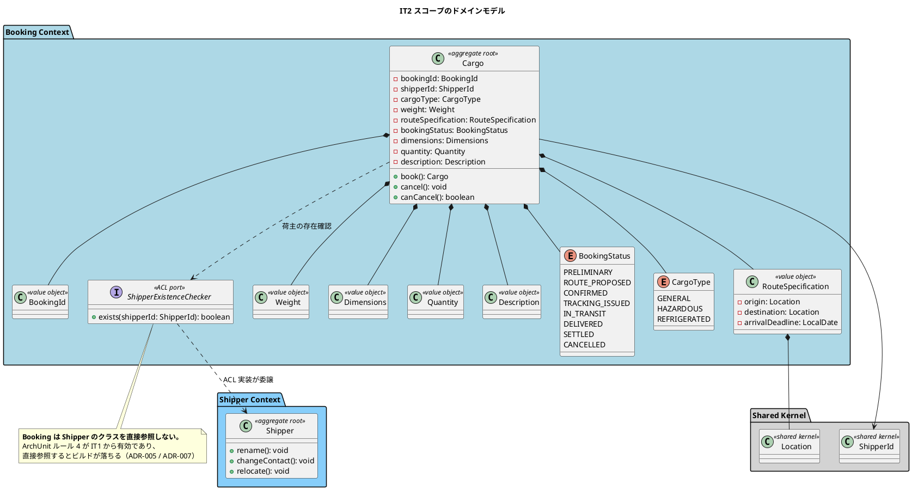
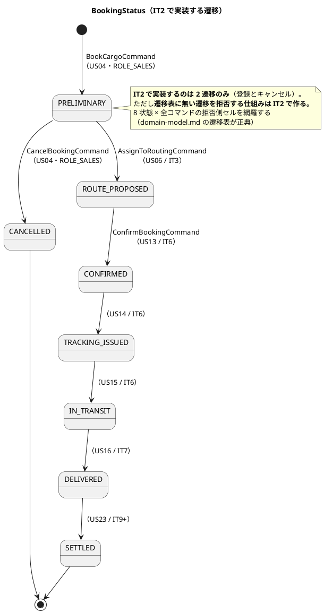
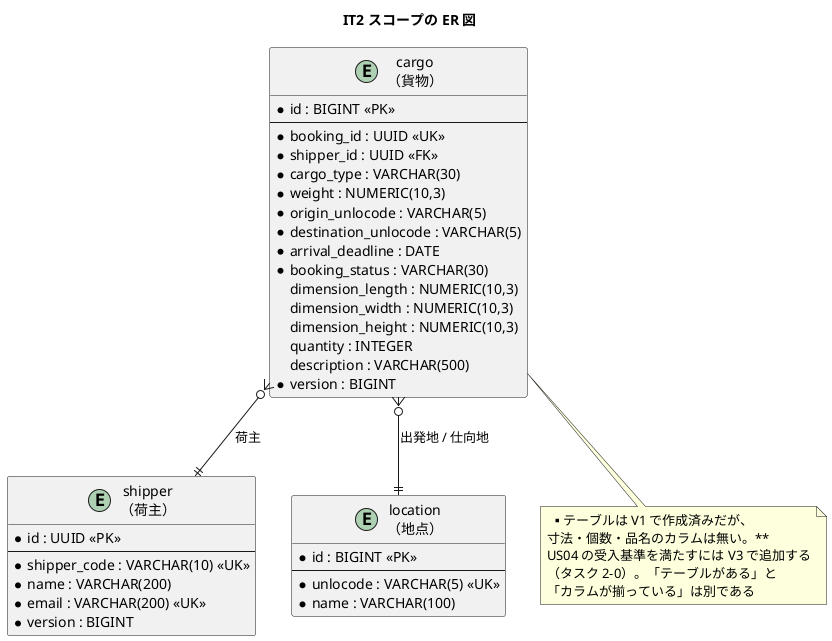
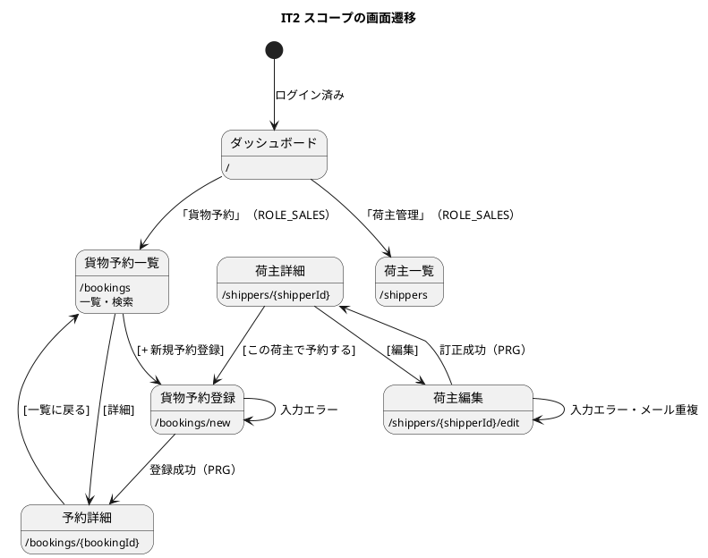

# イテレーション 2 計画

## ゴール

**貨物予約を登録し、荷主情報を訂正できるようにする。** Booking Context の `Cargo` 集約と
`BookingStatus` の遷移規則を確立し、Booking → Shipper の ACL ポートを最初の 1 本として通す。

| 項目 | 内容 |
| :--- | :--- |
| リリース | Release 0.1（予約基盤） |
| 局面 | **序盤（アウトサイドイン）** — `development_strategy.md` |
| 計画 SP | 7 |
| 前提 | IT1 完了（認証・荷主登録・品質ゲート） |

---

## 前イテレーションからの引き継ぎ

IT1 のふりかえり（[retrospective-1.md](retrospective-1.md)）の Try と持ち越しを、本計画の
タスク・成功基準・DoD に落とし込む。**「余力次第の返済枠」は繰り越されて固定化するため、
返済枠を最初から時間として確保する。**

### Try の反映

| Try | 本計画での扱い |
| :--- | :--- |
| T1 「宣言」を見つけたらテストにする | **タスク 0-1** として着手前に実施。棚卸しの結果を本計画に追記する |
| T2 ドメインの不変条件はユニットテストから書く | **DoD に追加。** `BookingStatus` の遷移表は許可・拒否の全セルを `@ParameterizedTest` で網羅する |
| T3 マニュアルは実装が動いてから書く | **タスクの順序で担保。** キャプチャ生成が通ることを記述開始の前提とする |
| T4 ADR の「確認する」は自動化手段を決める | ADR 起票時のルール。本 IT で ADR を起こす場合に適用 |
| T5 計画外の作業を記録する | クローズ時（完了報告書）に「今回の地ならし」として記録する |
| T6 CQRS のクエリ側を導入する | **タスク 3-3。** 予約一覧・詳細で `queryservices` を導入し、ArchUnit ルールで固定する |

### 持ち越しの返済枠

| # | 内容 | 本計画での扱い |
| :--- | :--- | :--- |
| C1 | 荷主の訂正手段が無い | **US32 として起票し、本 IT のスコープに含めた**（2SP） |
| C3 | 荷主一覧の検索・絞り込み | タスク 4-1（返済枠） |
| C4 | 監査ログ出力のテスト | タスク 4-2（返済枠） |
| C5 | 荷主コードの採番が同時登録で重複しうる | タスク 2-4 |
| C6 | 重複メールの競合時に 500 になる | タスク 2-5。**US32 でメール変更が入るため同時に直すのが最も安い** |
| C7 | US31 の受入基準の矛盾 | タスク 0-2（返済枠） |
| C8 | `mkdocs.yml` の nav 欠落 | **IT1 クローズ時に対応済み** |
| C2 | 管理者によるロック解除 | **US33 として起票し IT6 に配置した**（タスク 0-2）。本 IT では実装しない。US31 の受入基準からは外し、「未達なのに完了扱い」を解消した |

---

## ユーザーストーリー

### 対象ストーリー

| ID | ユーザーストーリー | SP | 優先度 | Issue |
| :--- | :--- | :--- | :--- | :--- |
| US04 | 貨物予約を登録する | 5 | 必須 | [#484](https://github.com/k2works/case-study-cargo-tracker/issues/484) |
| US32 | 荷主情報を訂正する | 2 | 必須 | [#506](https://github.com/k2works/case-study-cargo-tracker/issues/506) |
| | **合計** | **7** | | |

### 受入基準

受入基準の正典は [ユーザーストーリー](../requirements/user_story.md) である。**本計画に書き写さず引用する。**

- US04: [US04 の受入基準](../requirements/user_story.md#us04-貨物予約を登録する)
- US32: [US32 の受入基準](../requirements/user_story.md#us32-荷主情報を訂正する)

### 受入基準のうち本 IT で満たさないもの

**US04 の受入基準 6 項目のうち 2 項目は、本 IT では満たせない。** 隠さず明示する。

| 受入基準 | 扱い | 理由 |
| :--- | :--- | :--- |
| 経路設計者に予約登録の通知が送信される | **US06（IT3）へ** | 「経路設計者への引き渡し」は US06 のストーリーそのものである。US04 に通知を含めると US06 と重複する |
| 見積情報との整合性が確認される | **Release 2.0 以降** | 見積（Estimation Context）は Release 2.0 のスコープ（`release_scope.md`）。**前提が存在しない受入基準は満たしようがない** |

いずれも**受入基準の側を修正する**（タスク 0-2）。US31 の矛盾（C7）と同じ扱いとする。

---

## 設計（IT2 スコープ）

### ドメインモデル図

> **`Consignee`（荷受人）は本 IT のスコープ外である。** `ui_design.md` の貨物予約登録画面は
> 荷受人 3 項目（氏名・住所・連絡先メール）を必須としているが、**US04 の受入基準には
> 含まれていない**（受入基準の正典は `user_story.md`）。加えて `cargo` テーブルには
> `consignee_name` と `consignee_email` はあるが**住所のカラムが無い**。
>
> 画面・受入基準・データモデルの 3 者で扱いが食い違っている。**「国際輸送では荷受人が必須」
> という業務上の指摘は妥当である**ため、無視せずどの US で実装するかを決める（タスク 0-3）。

### 状態遷移図（IT2 スコープ）

### ER 図（IT2 スコープ）

> **`shipper` テーブルの `version` 列は IT1 で作成済みだが、まだ使っていない。**
> US32（訂正）で更新が入るため、本 IT で楽観的ロックを実際に効かせる（タスク 2-3）。

### 画面遷移図（IT2 スコープ）

> **`[この荷主で予約する]` を本 IT で入れる**（`ui_design.md` L650）。新規荷主を登録した直後に
> そのまま予約へ進むのが実際の業務の流れであり、荷主コードを覚えて画面を往復するのが
> 現場で最もストレスになる（IT1 のユーザー代表レビュー）。

---

## 設計への反映が必要（当該 IT で対応）

計画作成時の突合で見つかった、**設計ドキュメント側の欠落・矛盾**である。IT2 の実装とあわせて反映する。

| # | 内容 | 対応 |
| :--- | :--- | :--- |
| 1 | 貨物予約登録画面のワイヤーフレームに**荷主の入力欄が無い**。US04 の受入基準「荷主 ID を入力して既存荷主を選択できる」と `cargo.shipper_id NOT NULL` に反する | `ui_design.md` のワイヤーフレームと仕様に荷主選択を追加する |
| 2 | 同画面が**荷受人 3 項目を必須**としているが、US04 の受入基準に無く、`cargo` の `consignee_*` は「将来追加予定カラム」。画面・ドメイン・データモデルで扱いが食い違う | どの US で実装するかを決めて `ui_design.md` に明記する。IT2 のスコープ外とする |
| 3 | 同画面に**個数・寸法・品名**の入力欄が無い。US04 の受入基準にはある | `ui_design.md` に追加する |
| 4 | US04 の受入基準 2 項目が本 IT で満たせない（通知は US06、見積は Release 2.0） | `user_story.md` の受入基準を修正する（タスク 0-2） |
| 5 | ✅ `domain-model.md` / `data-model.md` / `test_strategy.md` に**他 take の実装状況**（2026-04-04 / 04-06 の日付）が混入していた | **計画作成時に是正済み。** 本 take の実態（2026-08-06 / IT1 完了時点）に置き換えた |
| 7 | ✅ `cargo` テーブルに**寸法・個数・品名のカラムが無い**（V1 で作られていない）。`data-model.md` は載せているため、テーブルの存在だけを見ると揃っていると誤認する | **計画作成時に `data-model.md` へ実装状況の内訳を追記済み。** カラムの追加はタスク 2-0 |
| 6 | 荷主編集画面（`/shippers/{shipperId}/edit`）が `ui_design.md` の画面一覧に無い | US32 の起票にあわせて追加する |

---

## タスク分解

見積は理想時間。局面は**アウトサイドイン**（受入基準から画面・API を先に決め、薄く貫通させる）だが、
**ドメインの不変条件だけはユニットテストから書く**（Try T2）。

### 0. 着手前の棚卸し（返済枠）

| # | タスク | 見積 |
| :--- | :--- | :--- |
| 0-1 | ✅ **「宣言」の棚卸し（T1）。** 下表を参照 | 3h |
| 0-2 | ✅ 受入基準の修正（US31 の矛盾 C7、US04 の 2 項目）。**US33 を起票し IT6 に配置**（C2） | 2h |
| 0-3 | ✅ `ui_design.md` の反映（上表 1・2・3・6）。荷受人は **US16 が担当**と決めた | 3h |

#### 0-1 の結果:「宣言」の棚卸し

ADR に書かれた「〜しない」を洗い出し、**それを破ったときに落ちるものがあるか**を確認した。

| 宣言 | 出典 | 棚卸し前 | 対応 |
| :--- | :--- | :--- | :--- |
| 動作確認用データを本番の locations に含めない | ADR-003 | ✅ `MigrationLocationsTest` | — |
| 共有カーネルは `Location` と `ShipperId` のみ | ADR-005 | ✅ ArchUnit ルール 6 | — |
| BC 間でクラスを直接参照しない | ADR-005 / 007 | ✅ ArchUnit ルール 4 | — |
| `security` は業務の集約を参照しない | ADR-007 | ✅ ルール 4 が拾う（対象側が業務 BC のため除外されない） | — |
| **H2 を本番の成果物に含めない** | ADR-003 | ❌ **コメントだけ** | **`verifyProductionDependencies` を追加**（`check` に接続） |
| **WireMock / Spring Cloud Contract を採用しない** | ADR-006 | ❌ **無し** | 同上 |
| **JPA / Hibernate を採用しない** | ADR-004 | ❌ **無し** | 同上 |
| **ドメインモデルに MyBatis の型が現れない** | ADR-004 | ❌ **無し**（`org.apache.ibatis` は `..infrastructure..` に含まれないため、依存方向のルールをすり抜ける） | **ArchUnit ルールを追加** |
| Repository のテストは Testcontainers で書く（H2 では書かない） | ADR-003 | ⚠️ 対象となるテストがまだ 1 件も無い | **タスク 2-1 で最初の Repository テストと同時に固定する** |
| `/handling/*` の URL は変更しない | ADR-002 | ⚠️ 画面が未実装 | 荷役の IT で対応（本 IT では対象なし） |

追加した 2 つは、いずれも**破れることを確認してから採用した**。`developmentOnly` を
`runtimeOnly` に書き換えると `verifyProductionDependencies` が落ち、ドメインの値オブジェクトに
`@Mapper` を付けると ArchUnit が落ちることを実測している。

### 1. Booking Context のドメイン（インサイドから固める）

| # | タスク | 見積 |
| :--- | :--- | :--- |
| 1-1 | ✅ 値オブジェクト（`BookingId`・`RouteSpecification`・`Weight`・`Dimensions`・`Quantity`・`Description`）とユニットテスト。**境界値を含める** | 6h |
| 1-2 | ✅ `BookingStatus` の遷移規則。**遷移表の許可・拒否の全セルを `@ParameterizedTest` で網羅**（8 状態 × 全コマンド） | 6h |
| 1-3 | ✅ `Cargo` 集約（`book` / `cancel` / `canCancel`）とユニットテスト | 5h |
| 1-4 | ✅ `ShipperExistenceChecker` ACL ポート（Booking 側）と Shipper 側の実装 | 3h |

> **出発地と仕向地が同じ予約を拒否する**（`domain-model.md` ビジネスルール 2）ことと、
> **到着期限が過去の予約を拒否する**ことを、1-1 の境界値に必ず含める。

### 2. 永続化と荷主の訂正

| # | タスク | 見積 |
| :--- | :--- | :--- |
| 2-0 | ✅ **`V3__cargo_specification.sql`。** `cargo` に `dimension_length` / `dimension_width` / `dimension_height` / `quantity` / `description` を追加する。**V1 でこれらのカラムが作られておらず、US04 の受入基準「寸法・個数・品名を入力できる」を満たせない**（計画作成時の突合で発覚） | 2h |
| 2-1 | ✅ `CargoRepository`（ポート）と MyBatis 実装。**テストは Testcontainers**（ADR-003） | 5h |
| 2-2 | ✅ `Shipper` に訂正の振る舞い（`rename` / `changeContact` / `relocate`）を追加。**Setter を生やさない** | 3h |
| 2-3 | ✅ **楽観的ロックを実際に効かせる**（`shipper.version`）。2 つの更新が競合したときに後勝ちにならないことをテストで固定する | 4h |
| 2-4 | ✅ 荷主コードの採番を DB シーケンスへ（C5）。**setval が H2 に無く、PostgreSQL 固有部分を V102 に隔離**した。**同時登録で重複しないことをテストで実証してから直す** | 3h |
| 2-5 | ✅ 重複メールの競合時に 500 にならないようにする（C6）。`DuplicateKeyException` を業務の結果に落とす | 3h |

### 3. アプリケーションと画面

| # | タスク | 見積 |
| :--- | :--- | :--- |
| 3-1 | ✅ `BookCargoCommandService`・`CancelBookingCommandService` | 4h |
| 3-2 | ✅ `UpdateShipperCommandService`（US32） | 3h |
| 3-3 | ✅ **CQRS のクエリ側を導入（T6）。** `BookingQueryService` / `ShipperQueryService` を置き、`interfaces` から `domain.repository` への直接参照をやめる。**ArchUnit ルールで固定する** | 5h |
| 3-4 | ✅ 貨物予約一覧・登録・詳細の 3 画面 | 8h |
| 3-5 | ✅ 荷主編集画面と `[この荷主で予約する]` 導線 | 4h |
| 3-6 | ✅ ロール別到達性の検証（`NavigationReachabilityTest` に貨物予約を追加）。**荷主の入口も追加**した | 2h |

### 4. 返済枠

| # | タスク | 見積 |
| :--- | :--- | :--- |
| 4-1 | ✅ 荷主一覧の検索・絞り込み（C3。`ui_design.md` の正典どおり） | 4h |
| 4-2 | ✅ 監査ログ出力のテスト（C4）。`LogCapture` で実出力を検証。**失敗した操作が記録されないこと**も固定した | 3h |

### 5. ドキュメント

| # | タスク | 見積 |
| :--- | :--- | :--- |
| 5-1 | ✅ **マニュアル更新（T3）。** 「04. 貨物予約」を新設し、「03. 荷主管理」に訂正の節を追加。**キャプチャ生成が通ってから記述を始める** | 5h |
| 5-2 | ✅ 設計ドキュメントの反映（上表の残り）・JIG / jig-erd との突き合わせ | 3h |

**合計見積: 91 理想時間**

---

## リスク

| リスク | 影響 | 対応 |
| :--- | :--- | :--- |
| 返済枠（0-1〜0-3・4-1〜4-2）が膨らみ US04 を圧迫する | IT2 が未達になる | **返済枠は上限 15 時間で打ち切る。** 超えた分は次 IT へ送り、送ったことを完了報告書に明記する |
| `BookingStatus` の全セル網羅が想定より重い | 1-2 が膨らむ | 遷移表は 10 遷移・8 状態と規模が確定している。**表を正典としてテストを生成する形にすれば、増えるのはデータであってコードではない** |
| ArchUnit ルール 4 により `booking → shipper` の直接参照が落ちる | 実装が止まる | **これは想定どおりの挙動である。** 最初から ACL ポート（1-4）を通す設計で始める |
| 楽観的ロック（2-3）が「入れただけ」になる | 後勝ちが残る | **競合を再現するテストを先に書く。** IT1 の教訓（安全装置は破るテストで固定する） |
| US32 が「訂正」を超えて識別子の変更まで広がる | スコープが膨らむ | 荷主コードと荷主種別は変更不可（受入基準）。**変更できない項目を画面から消す** |

---

## 完了の定義（DoD）

**条件は正典を引用する。書き写さない。**

| 項目 | 正典 |
| :--- | :--- |
| 受け入れ基準 | [ユーザーストーリー](../requirements/user_story.md) の US04 / US32 |
| テストレベルと責務 | [テスト戦略](../design/test_strategy.md) §1.3 / §3 |
| 品質ゲート | [テスト戦略](../design/test_strategy.md) §6.2 |
| 画面仕様・ロール別の到達性 | [UI 設計](../design/ui_design.md) |
| ドメインの不変条件 | [ドメインモデル設計](../design/domain-model.md) |

加えて、本イテレーション固有の条件:

- [x] **`BookingStatus` の遷移表の全セル（許可・拒否）がユニットテストで網羅されている**（Try T2）— 8 状態 × 8 コマンド = 64 セル。許可セルのみを列挙し拒否側は自動生成
- [x] **ドメインの不変条件は統合テストではなくユニットテストで固定されている**（Try T2）
- [x] **`booking` から `shipper` への直接参照が無い**（ArchUnit ルール 4。IT1 から有効）— ACL ポートのパッケージのみを越境の許可地点として除外し、集約への生の参照が落ちることをプローブで実測
- [x] **CQRS のクエリ側が導入され、`interfaces` → `domain.repository` の直接参照が無い**（Try T6）。ArchUnit ルールで固定した（先に赤を確認）
- [x] **楽観的ロックが競合を実際に検出する**ことをテストで確認済み（貨物・荷主の両方）
- [x] Repository のテストは Testcontainers で書く。H2 では書かない（ADR-003）
- [x] ロール別・状態別の到達性を確認する（`ui_design.md` の DoD）— 荷主の入口も追加した
- [x] **ユーザーマニュアルを更新し、キャプチャを再生成して `/manual/` に配信されることを確認する**（12 件のキャプチャがすべて生成、8 ページに配信）
- [x] Heroku 開発環境にデプロイして動作を確認する（ヘルスチェック UP。予約一覧・登録・荷主一覧に営業担当者でログインして到達を確認）
- [x] 品質ゲート: `check`（テスト・Checkstyle・SpotBugs・JaCoCo・ArchUnit・依存検証）が緑
- [x] CI が緑（Backend CI run 31105856285。ローカル緑と CI 緑を混同しない）
- [ ] **SonarQube Quality Gate**: カバレッジ 90.2%（閾値 80）・重複 0.0%（閾値 3）・
      指摘 0 件（閾値 0）は通過。**新規セキュリティホットスポット 2 件が未レビューのため
      ゲート全体は FAIL のままである。**
      `SONAR_TOKEN` に権限が無く（`api/hotspots/search` と `api/issues/do_transition` が
      いずれも Insufficient privileges）、どの箇所が対象かを CLI から特定できない。
      **SonarQube の画面（<http://localhost:9000>）でレビューする必要がある。**
      なお、当たりを付けて対処した監査ログのログインジェクションは実際の欠陥であり、
      ホットスポットの有無に関わらず修正済みである
- [ ] **満たせない受入基準は、隠さず完了報告書に記録する**（クローズ時）

---

## 参照

- [リリース計画](release_plan.md) — IT 配分と SP の正典
- [開発戦略](development_strategy.md) — 局面とアプローチ
- [IT1 ふりかえり](retrospective-1.md) — 本計画の入力
- [IT1 実装レビュー](../review/IT1実装_review_20260806.md) — 持ち越し事項の出典
- [ドメインモデル設計](../design/domain-model.md) — `BookingStatus` 遷移表の正典
