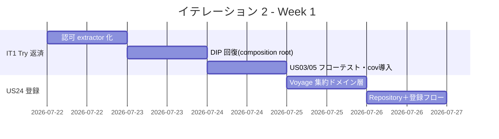
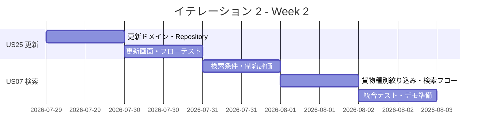
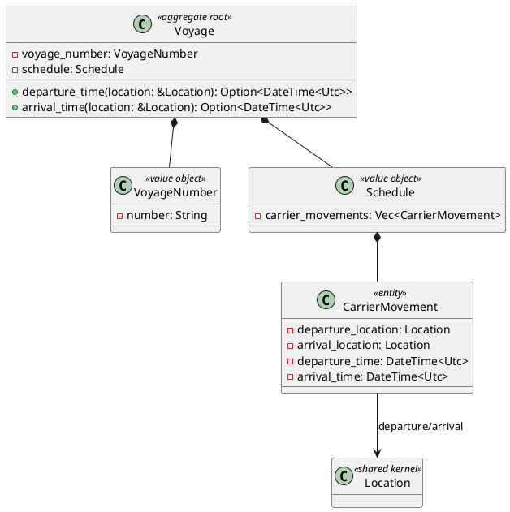
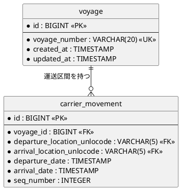
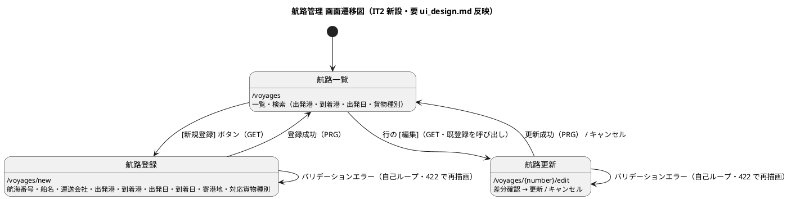

# イテレーション 2 計画

## 概要

| 項目 | 内容 |
|------|------|
| **イテレーション** | 2 |
| **期間** | Week 3-4（2 週間・2026-07-22 〜 2026-08-04） |
| **局面** | 中盤（インサイドアウト） |
| **ゴール** | Routing Context の Voyage 集約をドメイン層から堅牢に作り込み、航海スケジュールの新規登録・更新・検索を実 PostgreSQL 上で成立させる |
| **目標 SP** | 11（+ IT1 Try リファクタリング枠 3 SP 相当） |

---

## ゴール

### イテレーション終了時の達成状態

1. **Voyage 集約の確立**: `domain-routing` に Voyage 集約ルート（VoyageNumber・Schedule・CarrierMovement）をインサイドアウトで実装し、スケジュール整合性（出発日 < 到着日、時系列順）をドメイン不変条件として保証する。
2. **航海スケジュールの永続化と CRUD**: `infra-persistence` に VoyageRepository を実装し、航路一覧（`/voyages`）画面から航海の新規登録（US24）・更新（US25）ができる。
3. **航海スケジュール検索**: 出発地・目的地・出発期間・貨物種別の制約条件に基づく検索（US07）ができ、経路候補算出（IT3）の入力を準備できる。
4. **IT1 技術的負債の返済**: 認可の axum extractor 化・composition root への DIP 回復・US03/US05 フローテスト追加を完了し、後続イテレーションの土台を整える。

### 成功基準

- [ ] US24・US25・US07 の全受入基準を満たす
- [ ] Voyage 集約のドメイン単体テストが Red-Green-Refactor で作成されている
- [ ] VoyageRepository の testcontainers 統合テストが green
- [ ] 航路一覧・登録・更新・検索の HTTP フローテストが green
- [ ] IT1 Try #1-#3（認可 extractor・DIP 回復・US03/05 フローテスト）が完了
- [ ] `cargo clippy --workspace -- -D warnings` と `cargo fmt --check` が全 green
- [ ] テストカバレッジ計測（cargo-llvm-cov）を導入し、ドメイン層の現在地を可視化
- [ ] 設計反映: Voyage 集約・voyage テーブルへの船名/運送会社/対応貨物種別の追加、`/voyages` 登録・更新画面の新設を domain-model.md / data-model.md / ui_design.md に反映

---

## ユーザーストーリー

### 対象ストーリー

| ID | ユーザーストーリー | SP | 優先度 |
|----|-------------------|----|----|
| US24 | 航海スケジュールを新規登録する | 3 | 必須 |
| US25 | 既存航海スケジュールを更新する | 3 | 必須 |
| US07 | 航海スケジュールを検索する | 5 | 必須 |
| **合計** | | **11** | |

### ストーリー詳細

#### US24: 航海スケジュールを新規登録する

**ストーリー**:
> 経路設計者として、各運送会社が公開している航海スケジュール（航海番号・船名・出発港・到着港・出発日・到着日・寄港地・対応貨物種別）をシステムに新規登録したい。なぜなら、最新の運航情報を反映することで経路候補の算出精度が上がり、荷主に正確な経路・所要日数を提案できるからだ。

**受入条件**:

1. 航海番号・船名・運送会社・出発港（UN/LOCODE）・到着港（UN/LOCODE）・出発日・到着日・対応貨物種別を入力できる
2. 寄港地を複数かつ順序付きで入力できる
3. 必須項目が未入力の場合、未入力箇所を明示したエラーが表示される
4. 出発日が到着日より後の場合、日付の整合性エラーが表示される
5. 同一航海番号がシステムに存在しない場合、登録が完了し登録番号が発行される
6. 登録後、UC05（航海スケジュール検索）の検索対象として利用できる

#### US25: 既存航海スケジュールを更新する

**ストーリー**:
> 経路設計者として、運送会社が運航変更を発表した場合に、登録済みの航海スケジュールを最新情報に更新したい。なぜなら、スケジュール変更を即座に反映することで、変更後の経路候補算出に誤りが生じるのを防げるからだ。

**受入条件**:

1. 既存の航海番号を指定して既登録スケジュールを呼び出せる
2. 既存内容と更新内容の差分が確認画面に表示される
3. 差分確認後に「更新する」を選択することで既存スケジュールが上書き更新される
4. 更新後、UC05（航海スケジュール検索）の検索結果に更新内容が反映される
5. 「キャンセル」を選択した場合、既存スケジュールは変更されない

#### US07: 航海スケジュールを検索する

**ストーリー**:
> 経路設計者として、予約の出発地・目的地・期限をもとに利用可能な航海スケジュールを検索したい。なぜなら、制約条件を満たす航海を特定し、経路候補算出の入力を準備できるからだ。

**受入条件**:

1. 予約番号を指定して出発地・目的地・期限・貨物仕様を確認できる
2. 検索条件（出発地・目的地・出発期間・貨物種別）を入力して検索できる
3. 制約条件（航海スケジュール・寄港地接続・港湾制約・貨物種別対応）に基づき利用可能な航海が表示される
4. 一覧に航海番号・運送会社・出発日・到着日・寄港地が表示される
5. 条件を満たす航海がない場合、その旨が表示され条件を緩和して再検索できる
6. 危険物・冷凍貨物の場合、対応可能な航海のみに絞り込まれる
7. 出発地・目的地は UN/LOCODE 形式で指定できる

### タスク

#### 0. IT1 Try リファクタリング枠（技術的負債返済・SP 外）

> IT2 冒頭で着手し、Voyage 実装の土台を整える。詳細は [IT1 ふりかえり](./retrospective-1.md) Try #1-#3 を参照。
>
> **IT1 持ち越し（infra-eventbus 予約登録イベント発行の骨格）の方針**: IT1 タスク 3.6 で ACL（ShipperExistenceChecker）は完成し、tokio broadcast のイベントバス骨格が持ち越されている。IT2 は Routing Context の Voyage を独立実装するスコープでイベント連携を伴わないため、**イベントバス骨格は本格活用が始まる IT4-5（US13 予約確定 → US14 追跡番号発行の Booking/Tracking 連携）で完成させる**。IT2 では着手せず、本注記で持ち越しを明示する。

| # | タスク | 見積もり | 担当 | 状態 |
|---|--------|---------|------|------|
| 0.1 | 認可を axum extractor（`RouteDesignerUser` 等）+ `require_role` で宣言化し、`CurrentUser.roles` を `Vec<Role>` に型化（Try #1） | 4h | - | [ ] |
| 0.2 | interface 層のサービス生成を composition root（AppState ファクトリ）へ集約し DIP を回復・ADR 化（Try #2） | 4h | - | [ ] |
| 0.3 | 法人荷主（US03）・危険物/冷凍（US05）の HTTP フローテストを追加（Try #3） | 3h | - | [ ] |
| 0.4 | cargo-llvm-cov を導入しカバレッジ計測を CI 暫定ゲートに組み込む | 2h | - | [ ] |

**小計**: 13h（理想時間）

#### 1. Voyage 集約・ドメイン層（US24 / インサイドアウト起点）（3 SP）

| # | タスク | 見積もり | 担当 | 状態 |
|---|--------|---------|------|------|
| 1.1 | `VoyageNumber`・`CarrierMovement`（seq 順・出発<到着）値オブジェクトの単体テスト → 実装 | 3h | - | [ ] |
| 1.2 | `Schedule`（時系列順検証・`Schedule::new`）の単体テスト → 実装 | 3h | - | [ ] |
| 1.3 | `Voyage` 集約ルート（新規生成・不変条件）の単体テスト → 実装 | 3h | - | [ ] |
| 1.4 | `VoyageRepository` ポート定義（`save`/`find_by_voyage_number`） | 1h | - | [ ] |
| 1.5 | `infra-persistence` に SqlxVoyageRepository（voyage/carrier_movement）＋ migration を実装、testcontainers 統合テスト | 4h | - | [ ] |
| 1.6 | app-routing サービス（航海登録ユースケース）＋ 航路一覧/登録画面・POST `/voyages` の HTTP フローテスト | 4h | - | [ ] |
| 1.7 | ナビゲーション整合: navbar「航路管理」を IT1 プレースホルダから実リンク（`/voyages`）化＋ダッシュボードに ROLE_ROUTE_DESIGNER 導線を反映＋ナビ表示の検証テスト | 2h | - | [ ] |

**小計**: 20h（理想時間）

#### 2. 航海スケジュール更新（US25）（3 SP）

| # | タスク | 見積もり | 担当 | 状態 |
|---|--------|---------|------|------|
| 2.1 | Voyage 集約の更新（スケジュール上書き）ドメインメソッドの単体テスト → 実装 | 3h | - | [ ] |
| 2.2 | SqlxVoyageRepository の upsert / 更新対応と統合テスト | 3h | - | [ ] |
| 2.3 | 更新ユースケース（既存呼び出し・差分算出）と app-routing サービス | 3h | - | [ ] |
| 2.4 | 更新画面（差分確認・更新/キャンセル）・GET/POST `/voyages/{number}/edit` の HTTP フローテスト | 4h | - | [ ] |

**小計**: 13h（理想時間）

#### 3. 航海スケジュール検索（US07）（5 SP）

| # | タスク | 見積もり | 担当 | 状態 |
|---|--------|---------|------|------|
| 3.1 | 検索条件（出発地・目的地・出発期間・貨物種別）値オブジェクトと制約評価ロジックの単体テスト → 実装 | 4h | - | [ ] |
| 3.2 | VoyageRepository の検索メソッド（条件フィルタ）と統合テスト | 4h | - | [ ] |
| 3.3 | 貨物種別対応（危険物・冷凍の絞り込み）・寄港地接続評価の単体テスト → 実装 | 4h | - | [ ] |
| 3.4 | 検索ユースケース（予約番号からの貨物仕様確認含む）と app-routing サービス | 3h | - | [ ] |
| 3.5 | 検索画面（条件入力・結果一覧・0 件時の再検索）・GET `/voyages` 検索の HTTP フローテスト | 4h | - | [ ] |

**小計**: 19h（理想時間）

#### タスク合計

| カテゴリ | SP | 理想時間 | 状態 |
|---------|----|----|------|
| IT1 Try リファクタリング枠（SP 外） | - | 13h | [ ] |
| Voyage 集約・登録（US24） | 3 | 18h | [ ] |
| 航海スケジュール更新（US25） | 3 | 13h | [ ] |
| 航海スケジュール検索（US07） | 5 | 19h | [ ] |
| **合計** | **11** | **63h** | |

**1 SP あたり**: 約 4.5h（リファクタリング枠除く実装のみ）
**進捗率**: 100% (11/11 SP)

> **実績（2026-07-22）**: US24・US25・US07 の縦切りを実 PostgreSQL・実 HTTP フローで完成。
> ドメイン単体 16 + app 単体 5 + Repository 統合 4 + HTTP フロー 6（+ US03/US05 の 4）＝全 green。
> ドメイン層カバレッジ 83〜91%（cargo-llvm-cov、目標 85% にほぼ到達）。
> IT1 Try 返済: #1 認可 extractor 化・#2 DIP 回復（composition root・ADR-0003）・
> #3 US03/US05 フローテスト・cargo-llvm-cov 導入をすべて完了。
> developing-review（[it2_development_review_20260722.md](../review/it2_development_review_20260722.md)）を実施し、
> 高優先度の受入基準テスト漏れ（寄港地複数・0 件・キャンセル・日付逆転）も補完済み。
> **残作業**: ui_design.md への航路登録・更新画面の反映（クローズ時）、`search` の N+1 の SQL 絞り込み化、
> CurrentUser の Vec<Role> 型化（ADR-0003 でスコープ外・別途）。

---

## スケジュール

### Week 1（Day 1-5）

| 日 | タスク |
|----|--------|
| Day 1 | Try #1 認可 extractor 化・Role 型化 |
| Day 2 | Try #2 composition root へ DIP 回復・ADR 起票 |
| Day 3 | Try #3 US03/US05 フローテスト・cargo-llvm-cov 導入 |
| Day 4 | Voyage 集約（VoyageNumber/CarrierMovement/Schedule/Voyage）ドメイン単体テスト → 実装 |
| Day 5 | SqlxVoyageRepository＋migration・登録ユースケース・POST /voyages フローテスト |

### Week 2（Day 6-10）

| 日 | タスク |
|----|--------|
| Day 6 | US25 更新ドメインメソッド・Repository upsert・統合テスト |
| Day 7 | US25 更新画面（差分確認）・HTTP フローテスト |
| Day 8 | US07 検索条件・制約評価ロジック・Repository 検索メソッド |
| Day 9 | US07 貨物種別絞り込み・検索ユースケース・検索画面フローテスト |
| Day 10 | 統合テスト、バグ修正、カバレッジ確認、デモ準備 |

---

## 設計

> **対象スコープの設計図**: 本 IT スコープ（Routing Context の Voyage 集約）に絞り、(1) ドメインモデル図、(3) ER 図、(4) 画面遷移図を掲載する。**(2) 状態遷移図は省略する** — Voyage 集約は BookingStatus のような状態機械を持たず、登録・更新・検索の CRUD のみで状態遷移を伴わないため。後続 IT の要素は掲載せず、docs/design への反映が必要な新規要素（船名・運送会社・対応貨物種別・登録更新画面）は各図に注記する。
>
> **局面移行の一貫性（IT1 序盤 → IT2 中盤）**: アプローチはアウトサイドイン → インサイドアウトへ移行するが、[開発戦略](./development_strategy.md) の局面移行規律（Red-Green-Refactor 3 原則・1 コミット 1 変更・品質基準・ヘキサゴナル境界・ユビキタス言語の連続性）は不変とし、IT1 で確立した共有カーネル `Location`・認可・composition root パターンを踏襲する。

### ドメインモデル（Routing Context）

> 詳細は [ドメインモデル設計](../design/domain-model.md) の Routing Context を参照。CarrierMovement は**エンティティ**、出発地・到着地は共有カーネルの `Location`（UN/LOCODE）を参照し、時刻フィールドは `departure_time`/`arrival_time`（`DateTime<Utc>`）を用いる。順序は `Schedule::new` で時系列検証し、`seq_number` は永続化層（carrier_movement.seq_number）でのみ保持する。
>
> **注（設計への反映が必要）**: US24 受入基準は「船名」「運送会社」「対応貨物種別」の入力を要求するが、現行の domain-model.md / data-model.md の Voyage 集約・voyage テーブルには vessel（船名）・carrier（運送会社）・supported_cargo_type（対応貨物種別）が未定義。IT2 で Voyage 集約と voyage テーブルにこれらの属性を追加し、両設計ドキュメントへ反映する（US07 の貨物種別絞り込み・UI 航路一覧の船名列の前提となる）。

### データモデル（Routing Context）

> 詳細は [データモデル設計](../design/data-model.md) の Routing Context を参照。テーブル名は単数形（`voyage`・`carrier_movement`）、PK はサロゲートキー（`BIGSERIAL id`）+ 業務キー UK（`voyage_number`）、FK は `voyage.id` 参照、順序は `seq_number`（INTEGER）、監査カラム `created_at`/`updated_at` を持つ規約に準拠する。
>
> **注（設計への反映が必要）**: US24 受入基準を満たすため、IT2 で `voyage` テーブルに `vessel_name`（船名）・`carrier`（運送会社）・`supported_cargo_type`（対応貨物種別）カラムを追加し、data-model.md に反映する。carrier_movement の時刻カラムは data-model.md 準拠で `departure_date`/`arrival_date`（TIMESTAMP）を用いる（ドメイン層の `departure_time`/`arrival_time` とマッピングする）。

#### ビュー

- 航路一覧 `/voyages`（ROLE_ROUTE_DESIGNER）: 航路・スケジュール一覧・検索。ナビバーは全画面共通形式 `{/ <b>CargoTracker</b> | … | <b>航路管理</b> | [ログアウト] }`、テーブルヘッダーは `**太字**` 形式、検索フィルタは出発港・到着港・出発日（[UI 設計](../design/ui_design.md) の航路一覧に準拠）。
- 詳細は [UI 設計](../design/ui_design.md) の航路一覧・経路設計画面を参照。
- **用語の使い分け**: Voyage 集約を扱う本 IT の画面は「**航路**」（航路一覧・航路登録・航路更新 / `/voyages`）で統一する。Booking 経由で経路候補を割り当てる画面は ui_design.md 正式名の「**経路設計・割り当て**」（`/bookings/{bookingId}/route`・IT3 以降）を指し、両者を区別する。

> **注（UI 設計への反映が必要）**: 現行の ui_design.md は `/voyages` を「**閲覧専用**（航路の追加・変更は管理機能から）」と定義し、画面一覧では US24/US25 を `/voyages` にマッピングしているが、**登録・更新画面のワイヤーフレーム・URL・画面遷移が未定義**である。IT2 では割引ポリシー画面（`/admin/discount-policies/new`・`/{id}/edit`）のパターンに倣い、下記の登録・更新画面と URL を新設し、ui_design.md の画面一覧・ワイヤーフレーム・画面遷移図に反映する。あわせて航路一覧仕様の「閲覧専用」記述を「ROLE_ROUTE_DESIGNER は登録・更新可」に修正する。US07 の貨物種別による絞り込みは経路設計画面（`/bookings/{bookingId}/route` ステップ 1）と航路一覧検索の双方で用いるため、検索条件に貨物種別を追加する。

#### インタラクション

- **htmx パターン**: 航路一覧の検索は `hx-get="/voyages" hx-target="#voyage-list" hx-swap="innerHTML"` で部分更新（貨物予約一覧の検索と同一パターン）。
- **PRG パターン**: 登録・更新の POST は成功時 `303 See Other` で `/voyages` へ Redirect し二重送信を防止する。
- **フィードバック**: 登録・更新成功は `alert-success`、日付整合性・必須未入力などのバリデーションは `alert-danger` で該当フィールドを赤ボーダー強調、0 件検索は `alert-warning`（「該当する航海がありません」）で再検索を促す。
- **htmx エラーハンドリング**: `htmx:responseError` を捕捉し共通エラーバナーを表示する。

### API 設計

> `/voyages/new`・`/voyages/{number}/edit`・POST 系は ui_design.md 未定義のため IT2 で新設・反映する（上記「注」参照）。

| メソッド | エンドポイント | 説明 |
|---------|---------------|------|
| GET | `/voyages` | 航路一覧・検索（出発港・到着港・出発日・貨物種別クエリ対応） |
| GET | `/voyages/new` | 新規登録フォーム（新設） |
| POST | `/voyages` | 航海スケジュール新規登録（US24・成功時 303 → `/voyages`） |
| GET | `/voyages/{number}/edit` | 更新フォーム・差分確認（新設） |
| POST | `/voyages/{number}` | 航海スケジュール更新（US25・成功時 303 → `/voyages`） |

### ADR

| ADR | タイトル | ステータス |
|-----|---------|-----------|
| ADR-XXXX | interface 層の DIP 回復（composition root への集約） | 提案（Try #2 で起票） |

---

## リスクと対策

| リスク | 影響度 | 対策 |
|--------|--------|------|
| インサイドアウト初回で Schedule/CarrierMovement の不変条件設計が過剰・不足になる | 中 | ドメインモデル設計書の不変条件（時系列順・日付整合）に忠実に実装し、単体テストで境界を先に固定 |
| US07 検索の制約評価が IT3（経路候補算出）とスコープ重複する | 中 | IT2 は「利用可能な航海の絞り込み」までとし、寄港地接続の経路探索は IT3 に委ねる境界を明示 |
| IT1 Try 返済に時間を取られ US スコープが圧迫される | 中 | Try 枠は Day 1-3 でタイムボックス化し、超過分はバッファ消費ルールに従い US25/US07 を後回し |
| 11 SP が実効ベロシティ（10-12）上限に近い | 低 | US07（5 SP）を最終週配置とし、未完了時は検索の貨物種別絞り込み（3.3）を IT3 へ繰り越し可能に設計 |

---

## 完了条件

### Definition of Done

- [ ] コードレビュー完了（self-review、区切りで実施）
- [ ] ユニットテストがパス（ドメイン層 Red-Green-Refactor）
- [ ] testcontainers 統合テストがパス
- [ ] HTTP フローテストがパス
- [ ] `cargo clippy --workspace -- -D warnings` エラーなし・`cargo fmt --check` 準拠
- [ ] 機能がローカル環境（実 PostgreSQL・実ブラウザ）で動作確認済み
- [ ] ナビゲーション整合性（navbar → `/voyages` → 検証テスト）を確認
- [ ] ドキュメント更新完了（ADR・設計差分）

### デモ項目

1. 経路設計者でログインし、航路一覧から航海スケジュールを新規登録する（US24）
2. 登録済み航海スケジュールを呼び出し、差分確認のうえ更新する（US25）
3. 出発地・目的地・出発期間・貨物種別で航海を検索し、危険物対応の絞り込みを確認する（US07）

---

## 更新履歴

| 日付 | 更新内容 | 更新者 |
|------|---------|--------|
| 2026-07-22 | 初版作成 | Claude Code |

---

## 関連ドキュメント

- [イテレーション 1 ふりかえり](./retrospective-1.md)
- [開発戦略](./development_strategy.md)
- [リリース計画](./release_plan.md)
- [イテレーション 2 ふりかえり](./retrospective-2.md)
