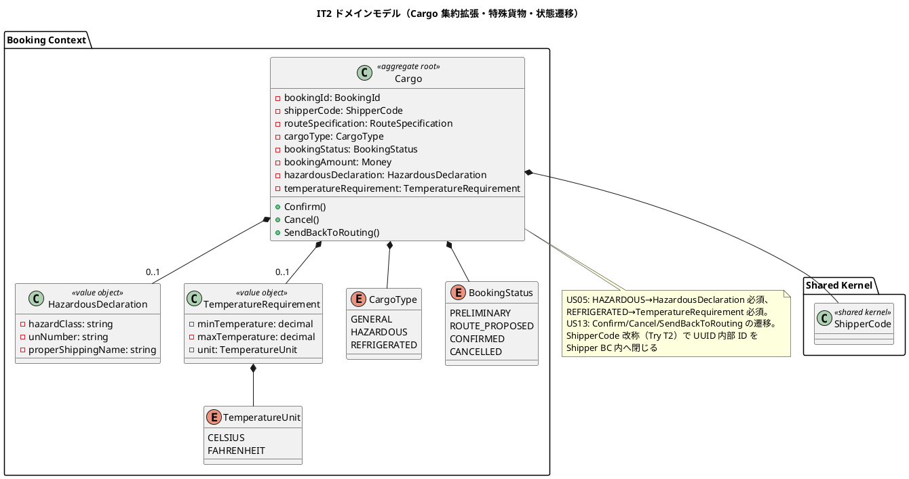
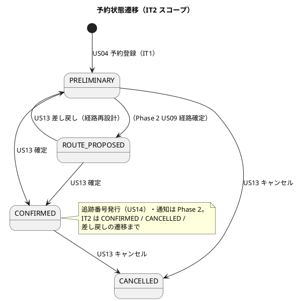
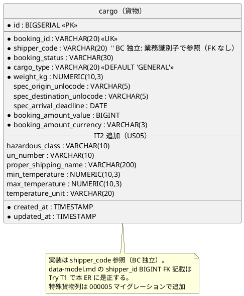
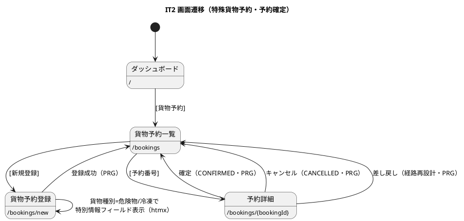

# イテレーション 2 計画

## 概要

本イテレーション（IT2）は、序盤局面（アウトサイドイン）の締めくくりとして **US05 危険物・冷凍貨物の予約登録** と **US13 予約確定** を実装し、Phase 1（予約・荷主管理基盤 MVP）を完了させる。あわせて IT1 ふりかえりの Try（上流設計の是正・共有カーネル型の改称・sqlc の BC 別分割・重複の共有化・受入 E2E の穴埋め）を**設計是正の返済枠**として明示的に組み込む。

- **局面**: 序盤（IT1-2）／アプローチ: **アウトサイドイン**（受け入れテスト・画面のニーズから interfaces → application → domain → infrastructure を縦に貫通）
- **対象 BC**: Booking Context（Cargo 集約の拡張）を中心に、Shared Kernel（ShipperCode 改称）を横断
- **前提**: IT1 で Cargo は PRELIMINARY まで実装済み。US05 は CargoType の危険物申告/温度条件で Cargo 集約を拡張、US13 は状態遷移（→ CONFIRMED / CANCELLED / 経路設計中への差し戻し）を追加する

---

## ゴール

### イテレーション終了時の達成状態

- 危険物・冷凍貨物の予約が、貨物種別に応じた特別情報（危険物申告・温度管理条件）を必須入力として登録できる。
- 仮受付済みの予約を確定（CONFIRMED）でき、荷主のキャンセル・経路設計中への差し戻しにも対応する。
- IT1 の設計乖離（`shipper_code` 参照・`ShipperCode` 型・`shipper.address`）を上流設計ドキュメントに是正し、実装と設計を一致させる。

### 成功基準

- [ ] US05・US13 の受け入れ基準を満たす（US13 の追跡番号発行通知など Phase 2 依存分は「注」で明示）。
- [ ] 危険物・冷凍貨物の異常系（クラス未入力・温度範囲逆転・31%/負値割引）を E2E/ユニットで固定（Try T5）。
- [ ] `data-model.md`・`domain-model.md`・`ui_design.md` を実装（`shipper_code`・`ShipperCode`・`address`）に是正（Try T1）。
- [ ] 共有カーネルの BC 間参照キーを `ShipperCode` 型へ改称し、UUID 内部 ID を Shipper BC 内へ閉じる（Try T2 / ADR-0005）。
- [ ] `make check`（build + test + lint + govulncheck + arch）green・SonarQube Quality Gate PASS・CI success。
- [ ] ドメイン層カバレッジ 90% 以上を維持。

---

## ユーザーストーリー

### 対象ストーリー

| ID | ユーザーストーリー | SP | 対応 UC | 優先度 |
|----|-------------------|----|---------|--------|
| US05 | 危険物・冷凍貨物の予約を登録する | 3 | UC03 | 必須 |
| US13 | 予約を確定する | 3 | UC11 | 必須 |
| **合計** | | **6** | | |

> ベロシティ注記: 基本 6 SP に加え、Try 返済（設計是正 T1・ShipperCode 改称 T2・sqlc 分割 T3・重複共有化 T4・E2E 穴埋め T5）のオーバーヘッドを見込む。IT1 実績 15 SP を踏まえ、着手時点の実効見積もりは 6 SP + 返済枠。ベロシティは 3 IT 完了時に再評価する。

### ストーリー詳細

#### US05: 危険物・冷凍貨物の予約を登録する

**として** 営業担当者 **したい** 危険物・冷凍貨物では特別な追加情報（危険物申告・温度管理条件）を含めて予約を登録したい **なぜなら** 貨物種別に応じた法的要件と取扱い条件を正確に管理し安全な輸送を保証できるから。

受け入れ基準:

- [ ] 貨物種別「危険物（HAZARDOUS）」選択時、危険物申告（危険物クラス・UN 番号・正式輸送品名）の入力が表示され必須となる。
- [ ] 貨物種別「冷凍・冷蔵貨物（REFRIGERATED）」選択時、温度管理条件（最低温度・最高温度・温度単位）の入力が表示され必須となる。
- [ ] 特別情報が登録された予約は、経路設計時に対応可能な航海・ルートのみ候補表示される（**注**: 候補フィルタは Phase 2/US08 依存。IT2 は特別情報の入力・保持・検証まで）。

#### US13: 予約を確定する

**として** 営業担当者 **したい** 荷主がルートを承認したことを確認して予約を正式確定したい **なぜなら** 荷主の同意を記録し追跡番号発行・輸送手配に進めるから。

受け入れ基準:

- [ ] 予約番号を指定して予約内容と選択ルートを確認できる（**注**: 選択ルート表示は Phase 2/US09 依存。IT2 は予約内容確認まで）。
- [ ] 確定操作で予約状態が「予約確定（CONFIRMED）」に更新される。
- [ ] 経路設計者に追跡番号発行依頼の通知が送信される（**注**: 通知基盤は Phase 2。IT2 は状態遷移まで）。
- [ ] 荷主がルート変更を希望する場合、予約を「経路設計中（ROUTE_PROPOSED へ戻す/差し戻し）」に戻せる。
- [ ] 荷主がキャンセルを希望する場合、予約をキャンセル（CANCELLED）状態に変更できる。
- [ ] キャンセル時、荷主にキャンセル確認通知が送信される（**注**: 通知は Phase 2 依存）。

---

## タスク

### 0. Try 返済（設計是正・技術的負債／序盤締めのオーバーヘッド）

- [ ] **T1 上流設計是正**: `data-model.md` の `cargo.shipper_id BIGINT FK` → `shipper_code VARCHAR(20)`、`shipper.address` 列の追記、`domain-model.md` の `ShipperId` 定義、`ui_design.md` の荷主画面/US 番号を実装に合わせる。
- [ ] **T2 ShipperCode 改称**: 共有カーネルの BC 間参照キーを `ShipperCode` 型へ改称し、UUID 内部 ID を Shipper BC に閉じる（ADR-0005）。
- [ ] **T3 sqlc BC 別分割**: `booking/infrastructure/sqlcgen` 等へ分割し go-arch-lint で BC 越境を構造検出。
- [ ] **T4 重複共有化**: `numericFromFloat`・コード生成（SHP-/BKG- プレフィックス）を shared へ抽出。

### 1. 危険物・冷凍貨物予約（US05 / 3 SP・アウトサイドイン）

- [ ] E2E（Red）: 危険物/冷凍の入力フィールド表示・必須検証・登録成功のシナリオを Playwright で先に固定。
- [ ] interfaces: `/bookings/new` フォームに貨物種別連動フィールド（htmx）追加、POST ハンドラ拡張。
- [ ] application: `RegisterBookingCommand` を拡張（危険物申告・温度条件）、バリデーション。
- [ ] domain: `HazardousDeclaration`（危険物クラス・UN 番号・正式輸送品名）・`TemperatureRequirement`（最低/最高温度・単位）値オブジェクトと不変条件（温度範囲逆転禁止・クラス必須）を Cargo 集約に追加。
- [ ] infrastructure: `000005_add_cargo_special_cargo.up/down.sql`（`hazardous_class`・`un_number`・`proper_shipping_name`・`min_temperature`・`max_temperature`・`temperature_unit`）、sqlc クエリ・マッパー拡張。

### 2. 予約確定（US13 / 3 SP・アウトサイドイン）

- [ ] E2E（Red）: 予約確定・キャンセル・差し戻しのシナリオを Playwright で先に固定。
- [ ] interfaces: 予約詳細画面（`/bookings/{bookingId}`）・確定/キャンセル/差し戻しアクション（PRG）。
- [ ] application: `ConfirmBookingCommand`・`CancelBookingCommand`・（差し戻し）コマンドとハンドラ。
- [ ] domain: `Cargo.Confirm()`・`Cargo.Cancel()`・`Cargo.SendBackToRouting()` の状態遷移メソッドと不変条件（許容遷移のみ）。
- [ ] infrastructure: `booking_status` 更新クエリ・Repository 拡張。

### 3. 受入 E2E の穴埋め（Try T5）

- [ ] 割引率異常系（31%/負値）、cargo Save の round-trip 検証、CargoBooked ペイロード契約テストを追加。

### タスク合計

- Try 返済 + US05 + US13 + E2E 穴埋め。各タスクは 4-16 理想時間に収まる粒度で分割済み。

---

## スケジュール

### Week 1（Day 1-5）

- Day 1-2: Try 返済（T1 設計是正・T2 ShipperCode 改称）。設計と実装の一致を先に確立。
- Day 3: T3 sqlc BC 別分割・T4 重複共有化。
- Day 4-5: US05（E2E Red → 集約拡張 → マイグレーション → Green）。

### Week 2（Day 6-10）

- Day 6-7: US13（E2E Red → 状態遷移 → Green）。
- Day 8: T5 受入 E2E 穴埋め。
- Day 9: マルチパースペクティブレビュー（中間 self-review）・指摘対応。
- Day 10: 品質ゲート（make check / SonarQube / CI）・デモ・クローズ準備。

---

## 設計

IT2 スコープ（Booking Context の Cargo 集約拡張・Shared Kernel の ShipperCode 改称）に絞って掲載する。荷主画面は IT1 で確立済みのため、本 IT の画面遷移は予約系に限定する。

### ドメインモデル

### 状態遷移図（BookingStatus）

### データモデル（ER 図）

### 画面遷移図

### API 設計

| メソッド | エンドポイント | 説明 |
|---------|---------------|------|
| GET | `/bookings/new` | 貨物予約登録フォーム（貨物種別連動の特別情報フィールド） |
| POST | `/bookings` | 貨物予約登録（危険物申告/温度条件を含む）・PRELIMINARY |
| GET | `/bookings/{bookingId}` | 予約詳細 |
| POST | `/bookings/{bookingId}/confirm` | 予約確定（→ CONFIRMED） |
| POST | `/bookings/{bookingId}/cancel` | 予約キャンセル（→ CANCELLED） |
| POST | `/bookings/{bookingId}/send-back` | 経路再設計への差し戻し |

### ADR

| ADR | タイトル | ステータス |
|-----|---------|-----------|
| [ADR-0002](../adr/0002-bounded-context-canon.md) | BC 正典 | 承認 |
| [ADR-0004](../adr/0004-discount-rate-limit.md) | 割引率上限（0〜30%） | 承認 |
| [ADR-0005](../adr/0005-bc-reference-and-shared-sqlcgen.md) | BC 間参照（shipper_code）・共有 sqlcgen の扱い | 承認（暫定・IT2 で ShipperCode 改称と sqlc 分割を再評価） |

---

## 検証結果（validating-iteration-plan / validating-design）

ステップ 3（validating-iteration-plan）・ステップ 4（validating-design）を実施した。

### 一致を確認した項目

- **ストーリー**: US05（UC03）・US13（UC11）が `user_story.md` の ID・受入基準と一致。
- **ドメインモデル**: `HazardousDeclaration`・`TemperatureRequirement`・`CargoType`（GENERAL/HAZARDOUS/REFRIGERATED）・`BookingStatus`（8 値のうち PRELIMINARY/ROUTE_PROPOSED/CONFIRMED/CANCELLED）が `domain-model.md` と一致。
- **データモデル**: 特殊貨物列（`hazardous_class`・`un_number`・`proper_shipping_name`・`min_temperature`・`max_temperature`・`temperature_unit`）は `data-model.md` の `cargo` 定義（行 703-708）と一致。マイグレーション追加のみ。
- **予約詳細 URL**: `/bookings/{bookingId}` は `ui_design.md`（行 73）と一致。
- **局面整合（軸 A）**: 開発戦略の IT2＝序盤・アウトサイドインと一致。
- **BC 独立性（軸 C）**: 実装は `cargo.shipper_code` 参照（FK なし）で ADR-0005 準拠。ドメインは現状 `ShipperId` 型のまま（T2 で `ShipperCode` へ改称予定）。sqlcgen は `shared/infrastructure/sqlcgen` に一括配置（T3 で BC 別分割予定）。

### 設計是正の実施（T1 返済済み）

- **T1-a（済）**: `data-model.md` の `cargo.shipper_id BIGINT FK` を `shipper_code VARCHAR(20)`（FK なし・ADR-0005）に是正。`shipper.address` 列・cargo の特殊貨物列を追記。`domain-model.md` の Cargo は `shipperCode: ShipperCode`、共有カーネルに `ShipperCode` を追加。
- **T1-b（済）**: `ui_design.md` の `/bookings/new` に US05 特別情報フィールドを追記。貨物種別 enum を `GENERAL/HAZARDOUS/REFRIGERATED` に是正（`GENERAL_CARGO/PERISHABLE` を除去）。
- **T1-c（済）**: `ui_design.md` の予約詳細に US13 の確定・キャンセル・差し戻しアクションを追記。画面一覧の US マッピングを US13 まで更新。

### 注（Phase 2 依存 / IT2 範囲外）

- **US05 候補フィルタ**は Phase 2/US08 依存。IT2 は特別情報の入力・保持・検証まで。
- **US13 通知・選択ルート表示**は Phase 2 依存。IT2 は状態遷移まで。
- **T3（sqlc の BC 別分割）**は計画どおり IT2-3 にまたがる返済枠。IT2 では共有 sqlcgen のまま US05/US13 を実装し、分割は次段で対応（ADR-0005 の暫定方針を維持）。

---

## リスクと対策

| リスク | 影響 | 対策 |
|--------|------|------|
| ShipperCode 改称（T2）が広範囲に波及しコンパイル不能 | 高 | Maybe/段階導入ではなく型改称のため、booking→shipper 参照経路を先に洗い出し 1 コミットで通す。`make arch` で BC 越境を検証 |
| sqlc BC 別分割（T3）でクエリ生成設定が壊れる | 中 | パッケージ分割は US05 のマイグレーション追加前に実施し、既存テスト green を確認してから進める |
| 特殊貨物の nullable 列と domain の必須不変条件の齟齬 | 中 | DB は nullable、必須性は domain 不変条件 + application バリデーションで担保。round-trip テストで固定 |
| 状態遷移の許容外遷移 | 中 | 遷移メソッドで許容元状態を検証し、テストで異常系を網羅 |

---

## 完了条件

### Definition of Done

- [ ] US05・US13 の受け入れ基準を満たす（Phase 2 依存分は「注」で明示）。
- [ ] Try T1〜T5 を返済（設計是正・ShipperCode 改称・sqlc 分割・重複共有化・E2E 穴埋め）。
- [ ] ドメイン層カバレッジ 90% 以上。
- [ ] `make check`（build + test + lint + govulncheck + arch）green。
- [ ] SonarQube Quality Gate PASS・CI success。
- [ ] マルチパースペクティブレビュー（self-review）実施・高優先度指摘対応。
- [ ] 設計ドキュメント（data-model / domain-model / ui_design）と実装が一致。

### デモ項目（E2E 受け入れ基準）

- [ ] 危険物貨物の予約登録（危険物申告必須・異常系）。
- [ ] 冷凍貨物の予約登録（温度条件必須・範囲逆転拒否）。
- [ ] 予約確定（PRELIMINARY → CONFIRMED）。
- [ ] 予約キャンセル・経路再設計への差し戻し。

---

## 更新履歴

| 日付 | 内容 |
|------|------|
| 2026-07-25 | 初版作成（IT2 開始準備・opening-iteration ステップ 2） |

---

## 関連ドキュメント

- [リリース計画](release_plan.md)
- [開発戦略](development_strategy.md)
- [IT1 ふりかえり](retrospective-1.md)
- [IT1 完了報告書](iteration_report-1.md)
- [ドメインモデル設計](../design/domain-model.md)
- [データモデル設計](../design/data-model.md)
- [UI 設計](../design/ui_design.md)
- [ユーザーストーリー](../requirements/user_story.md)
