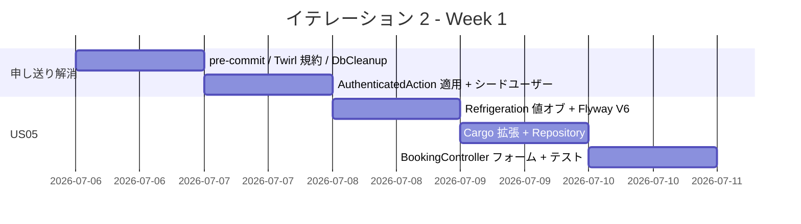
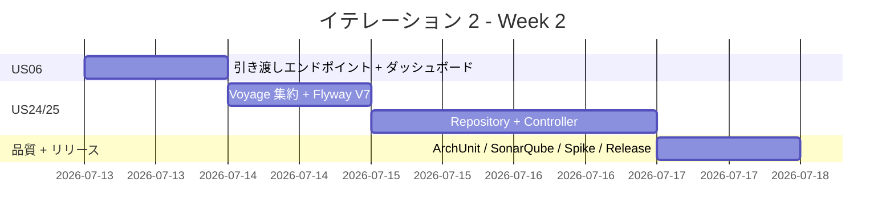
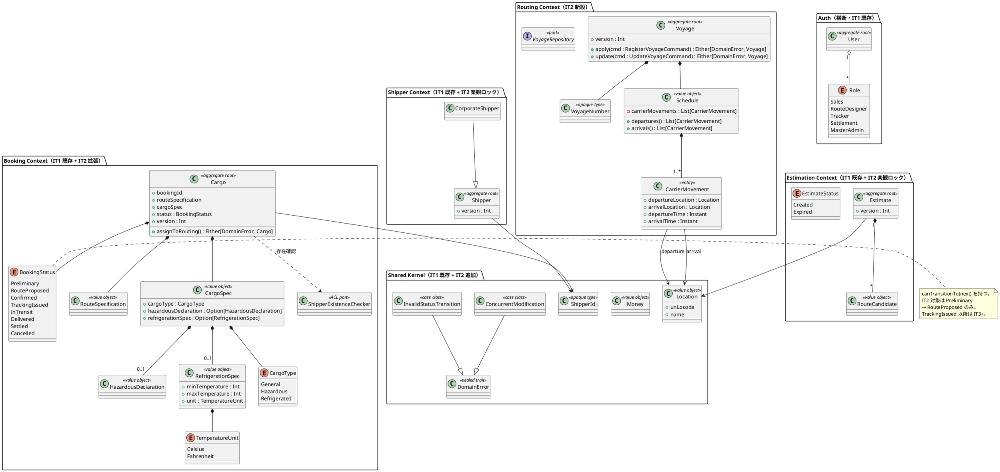
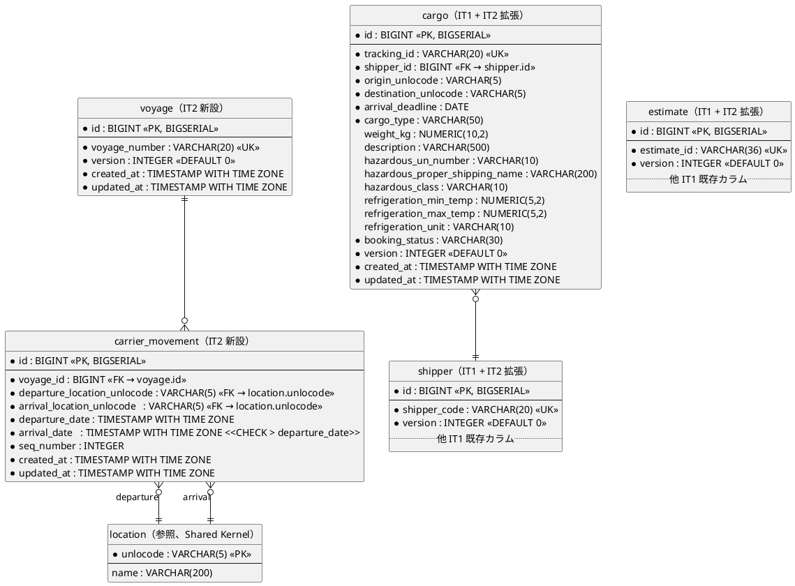
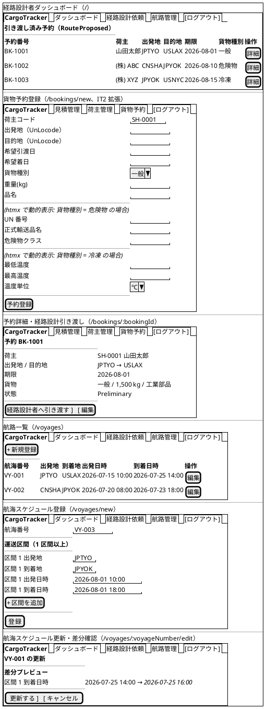
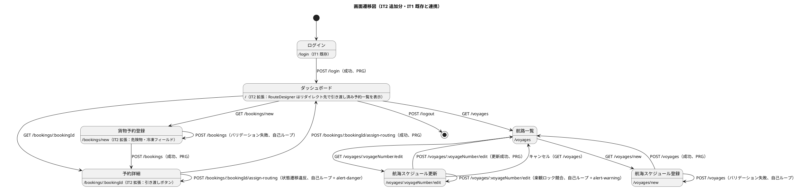

# イテレーション 2 計画

## 概要

| 項目 | 内容 |
|------|------|
| **イテレーション** | 2 |
| **期間** | Week 3-4（2026-07-06 〜 2026-07-19、2 週間） |
| **ゴール** | 特殊貨物予約・経路設計引き渡し・航海スケジュール管理を完成させ Release 0.1 Internal Alpha をリリースする。あわせて US08 経路算出スパイクで Phase 2 最大リスクを早期検証する |
| **目標 SP** | 12（基本 10 + スパイク別計上 2） |

---

## ゴール

### イテレーション終了時の達成状態

1. **Booking コンテキスト拡張**: 危険物・冷凍貨物の特殊申告付き予約が登録でき、`Preliminary → RouteProposed` 状態遷移と経路設計者への引き渡しが動作する
2. **Routing コンテキスト新設**: `Voyage` 集約と `voyage` / `voyage_call` テーブルを導入し、航海スケジュールの新規登録・更新が動作する
3. **認証適用と運用整備**: 既存 3 コントローラに `AuthenticatedAction` を適用し、開発環境シードユーザーで `/login` から全機能を辿れる
4. **品質ゲート復元**: scoverage を 75% → 80% に復元、ArchUnit 4 ルール導入、SonarQube Quality Gate PASS
5. **Release 0.1 Internal Alpha リリース**: 共通最低リリースゲート + Release 0.1 増分検証を満たし、内部デモ可能な状態
6. **US08 スパイク**: 関数型での経路探索アルゴリズム（DFS / 深さ制限）試作で IT3 着手前にリスク低減

### 成功基準

- [ ] US05・US06・US24・US25 の受入基準すべてを満たす
- [ ] テストカバレッジ 80% 以上（暫定 75% ゲートから復元）
- [ ] ScalaTest 全パス（IT1 末 71 件 → IT2 末 100 件以上）
- [ ] ArchUnit 4 ルール pass（依存方向・パッケージ境界）
- [ ] SonarQube Quality Gate PASS
- [ ] Release 0.1 Internal Alpha リリースゲート pass（E2E 予約フロー: US02 → US01 → US04 → US06）
- [ ] US08 スパイク成果を ADR 0005（経路探索アルゴリズム選定）として記録

---

## ユーザーストーリー

### 対象ストーリー

| ID | ユーザーストーリー | SP | 優先度 |
|----|-------------------|----|----|
| US05 | 危険物・冷凍貨物の予約を登録する | 3 | 必須 |
| US06 | 予約情報を経路設計者に引き渡す | 2 | 必須 |
| US24 | 航海スケジュールを新規登録する | 3 | 必須 |
| US25 | 既存航海スケジュールを更新する | 2 | 必須 |
| Spike | US08 経路算出スパイク（別計上枠） | 2 | 必須 |
| **合計** | | **12** | |

### ストーリー詳細

#### US05: 危険物・冷凍貨物の予約を登録する

**ストーリー**:
> 営業担当者として、危険物や冷凍・冷蔵貨物の場合に特別な追加情報を含めて予約を登録したい。なぜなら、貨物種別に応じた法的要件と取扱い条件を正確に管理し、安全な輸送を保証できるからだ。

**受入条件**:

1. 貨物種別「危険物」を選択すると危険物申告情報が必須化される（htmx で動的表示）
2. 貨物種別「冷凍・冷蔵貨物」を選択すると温度管理条件が必須化される（htmx で動的表示）
3. 特別情報は `cargo` テーブルに保存される
4. 特別情報を持つ予約は、経路設計時（IT3 US08）に対応可能な航海・ルートのみが候補として表示される（IT2 では特別情報をクエリで取得可能にすることまで担保し、フィルタロジック自体は IT3 で実装）

**前提**: IT1 で `HazardousDeclaration` 値オブジェクトと `cargo.hazardous_*` カラムは実装済み。残作業は条件付きバリデーションと冷凍貨物用 `RefrigerationSpec` 値オブジェクトの追加。

#### US06: 予約情報を経路設計者に引き渡す

**ストーリー**:
> 営業担当者として、仮受付された予約情報を確認し経路設計者に引き渡したい。なぜなら、経路設計者が正確な情報をもとに最適な経路設計を開始できるからだ。

**受入条件**:

1. 予約番号で予約情報（出発地・目的地・期限・貨物仕様）を確認できる
2. 経路設計依頼（`AssignToRoutingCommand`）を実行すると `BookingStatus` が `Preliminary → RouteProposed` に遷移する
3. 経路設計者に通知が送信される（IT2 ではログ出力 + 経路設計者ダッシュボードへの一覧反映で実現。メール / Slack 等の外部連携は IT4 以降）
4. 経路設計者ロールのダッシュボードに引き渡し済み予約一覧が表示される
5. 不備があれば修正してから引き渡せる

#### US24: 航海スケジュールを新規登録する

**ストーリー**:
> 経路設計者として、運送会社が公開している航海スケジュールをシステムに新規登録したい。なぜなら、最新の運航情報を反映することで経路候補の算出精度が上がるからだ。

**受入条件**:

1. 航海番号（`VoyageNumber`）と運送区間（`CarrierMovement`：出発港 / 到着港（UN/LOCODE）・出発日時 / 到着日時・順序）を入力できる
2. 運送区間（寄港地）を複数かつ順序付きで入力できる（`Schedule` 集約内 `List[CarrierMovement]`）
3. 必須項目未入力・日付逆転は明示的エラー（`Schedule.apply` で順序・連続性検証、`CarrierMovement` で `arrival_date > departure_date` 検証）
4. 同一 `VoyageNumber` が存在しない場合のみ `RegisterVoyageCommand` を受理し登録完了
5. 登録後、UC05（航海スケジュール検索、IT3 US07）の検索対象として利用可能なことを `VoyageRepository.findByCriteria` の単体テストで確認する

**注**: 船名・運送会社・対応貨物種別カラムは data-model.md 未定義のため IT2 では取り扱わず、必要となった時点（IT3 US07 検索要件と合わせて）データモデル追補 ADR で追加する。

#### US25: 既存航海スケジュールを更新する

**ストーリー**:
> 経路設計者として、運航変更があった場合に登録済みスケジュールを最新情報に更新したい。なぜなら、変更後の経路候補算出に誤りが生じるのを防げるからだ。

**受入条件**:

1. 既存航海番号で既登録スケジュールを呼び出せる
2. 既存内容と更新内容の差分が確認画面に表示される
3. 差分確認後の「更新する」で上書き更新、「キャンセル」で変更しない

#### Spike: US08 経路算出スパイク

**目的**: Phase 2 最大リスク（US08 経路候補算出、8 SP）を IT3 着手前に技術検証する。

**成果物**:

- `routing.application.RouteCandidateSearchSpike` プロトタイプ（DFS + 深さ制限の関数型実装）
- IT2 末で IT3 計画にフィードバック
- ADR 0005「経路探索アルゴリズム選定」

---

### タスク

#### 0. IT1 申し送り事項の解消（0 SP、技術的負債）

| # | タスク | 見積もり | 担当 | 状態 |
|---|--------|---------|------|------|
| 0.1 | ShipperController・EstimateController・BookingController に `AuthenticatedAction` 適用 | 2h | - | [x] |
| 0.2 | HomeController にロール別ダッシュボード（Sales / RouteDesigner / Tracker / Settlement / MasterAdmin の 6 種カードをロールで切替表示）。引き渡し済み予約一覧の本実装は US06 で行う | 3h | - | [x] |
| 0.3 | Flyway V5 で開発用シードユーザー投入 → タスク 0.10（AdminUserSeeder の application.conf 化）で代替済み。複数ロール用シードは IT3 以降の認可検証時に再評価 | 1h | - | [x] |
| 0.4 | pre-commit hook を高速化（scalafix を CI 専用に移動、pre-commit は scalafmtCheckAll のみ）。30 秒超 → 約 12 秒に短縮 | 1h | - | [x] |
| 0.5 | Twirl ファイル名規約整理（`form.scala.html` → `formPage.scala.html`、helper.form 名前衝突回避） | 1h | - | [x] |
| 0.6 | `DbCleanupSupport` trait 追加（テスト独立化、TRUNCATE RESTART IDENTITY CASCADE）。afterContainersStart で Flyway 実行 + ConnectionPool 登録、beforeEach で aggregate テーブル TRUNCATE | 2h | - | [x] |
| 0.7 | ArchUnit 4 ルール導入（ドメイン純粋性・application 境界・コンテキスト分離・リポジトリ実装方向）。ヘキサゴナル DDD パッケージ構成（domain/model/{aggregates,valueobjects,repositories,acl} 他）への全面リファクタを伴う | 3h | - | [x] |
| 0.8 | SonarQube Quality Gate 閾値確定 + CI 連携確認 | 2h | - | [ ] |
| 0.9 | scoverage ゲート 75% → 80% 復元（ドメインテスト追加で達成）。実績 82.34% で復元完了 | 2h | - | [x] |
| 0.10 | admin 資格情報を application.conf に外出し（IT1 レビュー H1 対応、Day 1 着手） | 1h | - | [x] |
| 0.11 | 楽観ロック準備: `cargo` / `estimate` / `shipper` に `version INTEGER NOT NULL DEFAULT 0` を追加（IT1 レビュー H5 対応、Flyway V5）。Repository の UPDATE で `version = version + 1` をインクリメント、`OptimisticLockException` を共有カーネルに追加（完全な競合検出は IT3 で集約に version フィールド追加と合わせて活性化） | 4h | - | [x] |

**小計**: 22h（理想時間）

#### 1. US05: 危険物・冷凍貨物予約（3 SP）

| # | タスク | 見積もり | 担当 | 状態 |
|---|--------|---------|------|------|
| 1.1 | `RefrigerationSpec` 値オブジェクト追加（temperature range / unit） | 2h | - | [x] |
| 1.2 | `Cargo` 集約に冷凍貨物バリデーション追加（CargoType 別必須項目検査） | 3h | - | [x] |
| 1.3 | Flyway V6: `cargo` に `refrigeration_min_temp` / `refrigeration_max_temp` / `refrigeration_unit` カラム追加 | 1h | - | [x] |
| 1.4 | ScalikeJdbcCargoRepository 拡張（refrigeration マッピング） | 2h | - | [x] |
| 1.5 | BookingController フォーム拡張（貨物種別選択に応じて危険物 / 冷凍フィールドを htmx で動的表示・必須化、ui_design.md 565 準拠） | 3h | - | [x] |
| 1.6 | ドメインユニット + E2E テスト（危険物 / 冷凍 / 通常の 3 系統） | 4h | - | [x] |

**小計**: 15h（約 5h/SP）

#### 2. US06: 予約情報引き渡し（2 SP）

| # | タスク | 見積もり | 担当 | 状態 |
|---|--------|---------|------|------|
| 2.1 | `Cargo` 集約に `assignToRouting()` 実装（`AssignToRoutingCommand` 受領で `Preliminary → RouteProposed` 遷移、`BookingStatus.canTransitionTo` を使用） | 2h | - | [x] |
| 2.2 | BookingController に引き渡しエンドポイント追加（POST `/bookings/:bookingId/assign-routing`、PRG で予約詳細へリダイレクト + flash 通知。BookingCommandService.assignToRouting で BookingId 形式検証・予約存在確認・状態遷移検証） | 3h | - | [x] |
| 2.3 | 経路設計者ダッシュボード（`RouteProposed` 予約一覧）画面追加。CargoRepository.findByStatus / BookingQueryService.findRouteProposed / HomeController が RouteDesigner / MasterAdmin ロールに対してのみ一覧をテンプレートに注入。通知は flash success メッセージで代替（外部通知 IT4 以降） | 3h | - | [x] |
| 2.4 | ドメインユニット + E2E テスト（通知ログ検証含む）。CargoAssignToRoutingSpec + BookingCommandServiceSpec assignToRouting 3 件 + Playwright us06-assign-routing.spec.ts 2 件（フロー全体 / RouteProposed 後のボタン非表示） | 2h | - | [x] |

**小計**: 10h（5h/SP）

#### 3. US24・US25: 航海スケジュール管理（5 SP）

| # | タスク | 見積もり | 担当 | 状態 |
|---|--------|---------|------|------|
| 3.1 | Routing コンテキスト初期化（パッケージ + ArchUnit ルール追加） | 1h | - | [x] |
| 3.2 | `Voyage` 集約 + `VoyageNumber`（opaque type）/ `Schedule` / `CarrierMovement` 実装（domain-model.md 585-625 準拠）。`Schedule.apply` で順序・連続性検証、`CarrierMovement` で `arrival_date > departure_date` 検証 | 4h | - | [x] |
| 3.3 | Flyway V7: `voyage`（`id BIGSERIAL PK`・`voyage_number UK`）+ `carrier_movement`（`id BIGSERIAL PK`・`voyage_id FK → voyage.id`・`departure_location_unlocode FK`・`arrival_location_unlocode FK`・`seq_number`）作成。両テーブルに `version` カラムも付与 | 2h | - | [x] |
| 3.4 | ScalikeJdbcVoyageRepository 実装（`findByVoyageNumber` / `findByCriteria` / `save` upsert + 楽観ロック）。`AssignToRoutingCommand` 用通知記録の参照 API も用意 | 4h | - | [x] |
| 3.5 | VoyageController + `RegisterVoyageCommand` / `UpdateVoyageCommand` アプリケーションサービス実装（一覧 `/voyages` / 新規 `/voyages/new` / 編集・差分確認 `/voyages/:voyageNumber/edit` の 3 画面、ui_design.md 85-87 準拠） | 5h | - | [x] |
| 3.6 | Twirl テンプレート（一覧・登録・差分確認）。ナビバーは layout/nav.scala.html でロール別表示（RouteDesigner にのみ「航路管理」メニュー表示、ui_design.md 130 準拠） | 4h | - | [x] |
| 3.7 | ドメインユニット + リポジトリ統合 + E2E テスト（UC05 検索対象として利用可能なことの確認テスト含む） | 5h | - | [x] |

**小計**: 25h（5h/SP）

#### 4. US08 スパイク（2 SP、別計上枠）

| # | タスク | 見積もり | 担当 | 状態 |
|---|--------|---------|------|------|
| 4.1 | DFS + 深さ制限の経路探索プロトタイプ（純関数版） | 4h | - | [x] |
| 4.2 | サンプル航海データでの探索結果検証（テスト 3 ケース） | 2h | - | [x] |
| 4.3 | ADR 0005 経路探索アルゴリズム選定を作成 | 2h | - | [x] |

**小計**: 8h（4h/SP）

#### 5. Release 0.1 Internal Alpha リリース準備（バッファ）

| # | タスク | 見積もり | 担当 | 状態 |
|---|--------|---------|------|------|
| 5.1 | CHANGELOG 0.1.0 追記 | 1h | - | [ ] |
| 5.2 | リリースゲート確認（共通ゲート + 予約フロー E2E pass） | 2h | - | [ ] |
| 5.3 | `developing-release` スキルでバージョンバンプ + タグ付与（v0.1.0） | 1h | - | [ ] |

**小計**: 4h

#### タスク合計

| カテゴリ | SP | 理想時間 | 状態 |
|---------|----|---------|------|
| IT1 申し送り解消 | 0（負債） | 22h | [ ] |
| US05 危険物・冷凍貨物 | 3 | 15h | [ ] |
| US06 引き渡し | 2 | 10h | [ ] |
| US24・US25 航海スケジュール | 5 | 25h | [ ] |
| US08 スパイク（別計上） | 2 | 8h | [ ] |
| Release 0.1 準備 | - | 4h | [ ] |
| **合計** | **12** | **84h** | |

**1 SP あたり**: 約 7.0h（負債解消 22h・リリース準備 4h 込み）。基本ストーリーのみだと約 5.0h/SP で IT1 と整合。負債解消増加分（+5h）は IT1 レビュー H1・H5 反映による。
**進捗率**: 0% (0/12 SP)

---

## スケジュール

### Week 1（Day 1-5）



| 日 | タスク |
|----|--------|
| Day 1 | 0.4 pre-commit hook、0.5 Twirl 規約、0.6 DbCleanup trait |
| Day 2 | 0.1 AuthenticatedAction 適用、0.3 シードユーザー、0.2 ダッシュボード骨組み |
| Day 3 | US05: 1.1 Refrigeration 値オブジェクト、1.3 Flyway V6、1.2 Cargo 集約拡張 |
| Day 4 | US05: 1.4 Repository 拡張、1.5 Controller フォーム拡張（前半） |
| Day 5 | US05: 1.5 Controller 後半、1.6 ユニット + E2E テスト |

### Week 2（Day 6-10）



| 日 | タスク |
|----|--------|
| Day 6 | US06: 2.1-2.4 引き渡しフロー一式完成 |
| Day 7 | US24/25: 3.1-3.3 Routing コンテキスト初期化、Voyage 集約、Flyway V7 |
| Day 8 | US24/25: 3.4-3.5 Repository + Controller 実装 |
| Day 9 | US24/25: 3.6-3.7 Twirl テンプレート + テスト完成 |
| Day 10 | 0.7 ArchUnit、0.8 SonarQube、0.9 カバレッジ復元、US08 スパイク + ADR 0005、Release 0.1 リリース |

---

## 設計

### ドメインモデル

IT1 から継続する Booking / Estimation / Shipper / Auth / Shared Kernel に加え、IT2 で **Routing Context** を新設する。コマンド命名・遷移・値オブジェクト構造は domain-model.md（line 442 / 585-625 / 642-651）準拠。



**実装規約（domain-model.md 準拠、IT1 継続）**:

- 集約ルート・エンティティ: `final case class`（イミュータブル）、状態変更は `Either[DomainError, Self]` で新インスタンスを返す
- 値オブジェクト（単一値）: `opaque type` + スマートコンストラクタ（`apply` が `Either[DomainError, A]`）
- 値オブジェクト（複合値）: `final case class` + コンパニオンのスマートコンストラクタ
- **IT2 追加**: 更新系操作を持つ集約ルートは `version: Int` フィールドを持ち、リポジトリの UPDATE 失敗（更新 0 行）を `DomainError.ConcurrentModification` で返す（data-model.md 1175 / IT1 レビュー H5 対応）

**不変条件（IT2 追加分）**:

1. `Schedule.apply` は `carrierMovements` の順序・連続性を検証する（前区間の到着地 = 次区間の出発地、出発時刻が時系列順）
2. `CarrierMovement.apply` は `departureLocation != arrivalLocation`、`arrivalTime > departureTime` を検証する（US24 日付整合性）
3. `RefrigerationSpec.apply` は `minTemperature <= maxTemperature` を検証する
4. `CargoSpec.apply` は `cargoType == Hazardous` 時に `hazardousDeclaration.isDefined` を、`cargoType == Refrigerated` 時に `refrigerationSpec.isDefined` を検証する（US05 条件付き必須）
5. `Cargo.assignToRouting()` は `BookingStatus.canTransitionTo(RouteProposed)` を判定。違反時は `DomainError.InvalidStatusTransition`

### データモデル

IT1 既存テーブル（`users`・`user_roles`・`shipper`・`estimate`・`route_candidate`・`cargo`）に加え、IT2 で `voyage`・`carrier_movement` を新設し、`cargo`・`estimate`・`shipper` に楽観ロック用 `version` カラムと US05 用 refrigeration カラムを追加する。data-model.md（line 755-779・1175）準拠。



**マイグレーション**:

| バージョン | ファイル | 内容 |
|-----------|---------|------|
| V5 | `V5__add_version_column.sql` | `shipper` / `estimate` / `cargo` に `version INTEGER NOT NULL DEFAULT 0`（IT1 レビュー H5） |
| V6 | `V6__add_cargo_refrigeration.sql` | `cargo` に `refrigeration_min_temp` / `refrigeration_max_temp` / `refrigeration_unit`（US05） |
| V7 | `V7__create_voyage_and_carrier_movement.sql` | `voyage` + `carrier_movement` テーブル新設（US24・US25） |

**注**: ui_design.md / user_story US24 に登場する船名・運送会社・対応貨物種別カラムは data-model.md 未定義のため IT2 では追加しない（IT3 US07 検索要件と合わせてデータモデル追補 ADR で対応）。

### ユーザーインターフェース

#### ビュー

ui_design.md（line 71-130 / 940-997）準拠。ナビバーはロール別表示（RouteDesigner にのみ「航路管理」「経路設計依頼」を表示）。



#### インタラクション



**htmx パターン（IT2 追加分）**:

- 貨物予約登録の条件付きフィールド（US05）: 貨物種別 `select` の変更で `hx-get="/bookings/cargo-type-fields"` `hx-target="#cargo-type-fields"` `hx-swap="innerHTML"` `hx-trigger="change"`。返却フラグメントには危険物（UN 番号等）または冷凍（温度範囲）の入力フィールドを含む（ui_design.md 565 準拠）
- 航海スケジュール登録の区間追加: `hx-get="/voyages/movement-fragment?seq=N+1"` `hx-target="#carrier-movements"` `hx-swap="beforeend"`
- 経路設計依頼の楽観ロック競合通知: `htmx:responseError` で 409 を捕捉し `alert-warning` を表示

**フィードバックメッセージ**（Bootstrap 5 alert、IT1 規約継続）:

| 種別 | スタイル | IT2 で利用する例 |
|------|---------|------|
| 成功 | `alert-success` | 「予約 BK-1001 を経路設計者へ引き渡しました」「航海 VY-001 を登録しました」 |
| 警告 | `alert-warning` | 「他のユーザーが先に更新しました。最新内容を読み込んで再度更新してください」（楽観ロック競合） |
| エラー | `alert-danger` | 「貨物種別が危険物の場合は UN 番号が必須です」「現在の状態（Confirmed）から RouteProposed への遷移はできません」 |

**htmx エラーハンドリング**:

- `htmx:responseError` で 409（楽観ロック競合）を捕捉し `alert-warning` を共通レイアウトに通知
- 422（バリデーションエラー）は通常フォーム送信側で PRG 自己ループ
- 500 は IT1 規約どおり `alert-danger`

### ディレクトリ構成

IT1 から継続するレイアウト（コンテキスト × レイヤー）を維持しつつ、IT2 で `routing/` を新設し `booking/` と `shared/` を拡張する。

```
app/cargotracker/
├── auth/                                # IT1 既存
│   ├── domain/
│   ├── infrastructure/
│   └── interfaces/web/
├── shared/                              # IT1 既存 + IT2 拡張
│   ├── domain/
│   │   ├── Location.scala
│   │   ├── Money.scala
│   │   ├── ShipperId.scala
│   │   └── DomainError.scala            # + ConcurrentModification
│   └── interfaces/web/
│       └── layout/
│           ├── main.scala.html
│           └── nav.scala.html           # + ロール別メニュー表示
├── shipper/                             # IT1 既存 + IT2 楽観ロック
│   ├── domain/
│   └── infrastructure/                  # ScalikeJdbcShipperRepository に version 比較 UPDATE
├── estimation/                          # IT1 既存 + IT2 楽観ロック
├── booking/                             # IT1 既存 + IT2 拡張
│   ├── domain/
│   │   ├── Cargo.scala                  # + assignToRouting(), + version
│   │   ├── BookingStatus.scala
│   │   ├── CargoSpec.scala              # + 条件付きバリデーション
│   │   ├── HazardousDeclaration.scala   # IT1 既存
│   │   ├── RefrigerationSpec.scala      # 新規
│   │   ├── TemperatureUnit.scala        # 新規
│   │   └── CargoRepository.scala
│   ├── infrastructure/
│   │   └── ScalikeJdbcCargoRepository.scala  # + refrigeration マッピング, + version
│   └── interfaces/web/
│       ├── BookingController.scala      # + assignRouting アクション, + 条件付きフォーム
│       └── CargoTypeFragmentController.scala # htmx フラグメント返却（新規）
└── routing/                             # IT2 新設
    ├── domain/
    │   ├── Voyage.scala
    │   ├── VoyageNumber.scala           # opaque type
    │   ├── Schedule.scala               # List[CarrierMovement] + 連続性検証
    │   ├── CarrierMovement.scala
    │   └── VoyageRepository.scala       # ポート
    ├── application/
    │   ├── RegisterVoyageCommand.scala
    │   ├── UpdateVoyageCommand.scala
    │   ├── VoyageApplicationService.scala
    │   └── RouteCandidateSearchSpike.scala  # US08 スパイク
    ├── infrastructure/
    │   └── ScalikeJdbcVoyageRepository.scala
    └── interfaces/web/
        ├── VoyageController.scala
        └── VoyageMovementFragmentController.scala # htmx フラグメント返却

conf/
├── routes                                # + 航海・引き渡し・htmx フラグメント
├── application.conf                      # + admin 資格情報（IT1 レビュー H1）
└── db/migration/
    ├── V1__create_users_and_roles.sql    # IT1
    ├── V2__create_shipper.sql            # IT1
    ├── V3__create_estimate_and_route_candidate.sql # IT1
    ├── V4__create_cargo.sql              # IT1
    ├── V5__add_version_column.sql        # IT2
    ├── V6__add_cargo_refrigeration.sql   # IT2
    └── V7__create_voyage_and_carrier_movement.sql # IT2
```

### API 設計

IT1 既存（認証・荷主・見積・予約）に加え、IT2 で経路設計引き渡しと航海スケジュール管理・htmx フラグメントを追加する。ui_design.md（line 85-87・992-997）準拠。

| メソッド | エンドポイント | 説明 | 区分 |
|---------|---------------|------|------|
| GET | `/` | ダッシュボード（ロール別表示、RouteDesigner は引き渡し済み予約一覧） | IT2 拡張 |
| GET | `/bookings/new` | 貨物予約登録画面 | IT2 拡張（危険物・冷凍フィールド追加） |
| POST | `/bookings` | 貨物予約登録（PRG） | IT2 拡張（条件付き必須検証） |
| GET | `/bookings/cargo-type-fields` | 貨物種別に応じたフォームフラグメント（htmx） | IT2 新規 |
| POST | `/bookings/:bookingId/assign-routing` | 予約を経路設計者へ引き渡し（`AssignToRoutingCommand`、PRG） | IT2 新規 |
| GET | `/voyages` | 航海スケジュール一覧 | IT2 新規 |
| GET | `/voyages/new` | 航海スケジュール新規登録画面 | IT2 新規 |
| POST | `/voyages` | 航海スケジュール登録（`RegisterVoyageCommand`、PRG） | IT2 新規 |
| GET | `/voyages/movement-fragment` | 運送区間入力フラグメント（htmx） | IT2 新規 |
| GET | `/voyages/:voyageNumber/edit` | 航海スケジュール更新フォーム + 差分確認 | IT2 新規 |
| POST | `/voyages/:voyageNumber/edit` | 航海スケジュール更新（`UpdateVoyageCommand`、楽観ロック競合は 409 + 自己ループ、PRG） | IT2 新規 |

### ADR

| ADR | タイトル | ステータス |
|-----|---------|-----------|
| [ADR 0001](../adr/0001-play-framework-scala-stack.md) | Play Framework + Scala 採用 | 承認 |
| [ADR 0002](../adr/0002-bcrypt-and-session-timeout.md) | bcrypt パスワードハッシュとセッションタイムアウト方針 | 承認（IT1） |
| [ADR 0003](../adr/0003-pricing-service-shared.md) | 料金計算ドメインサービスの US01/US21 共通化方針 | 承認（IT1） |
| [ADR 0004](../adr/0004-us26-cross-cutting-story.md) | US26 を UC 横断ストーリーとして扱う方針 | 承認（IT1） |
| ADR 0005（IT2 Day 10 作成予定） | 経路探索アルゴリズム選定（DFS + 深さ制限） | 提案 |
| ADR 0006（IT2 Day 1-2 作成予定） | 楽観ロック方針（`version` カラム + 比較 UPDATE + `DomainError.ConcurrentModification`） | 提案 |

---

## リスクと対策

| リスク | 影響度 | 対策 |
|--------|--------|------|
| Routing コンテキスト新設の見積もり過小 | 中 | US24・US25 で 5 SP / 25h を確保。前半 4 日に集中配置 |
| AuthenticatedAction 後付け適用による既存 E2E テスト崩壊 | 高 | Day 2 に最優先で対応し、`AuthenticatedSpec` trait でテスト側を追従 |
| scoverage 80% 復元失敗（ドメインテスト不足） | 中 | 各ストーリーで Twirl / Controller 除外を維持しドメイン層中心にテスト追加 |
| US08 スパイクが想定以上に時間を要する | 中 | 8h タイムボックス厳守、超過時は IT3 着手週に持ち越し（IT2 のリリースは優先） |

---

## 完了条件

### Definition of Done

- [ ] IT1 申し送り事項すべて解消
- [ ] 対象ストーリー（US05・US06・US24・US25）のすべての受入条件を満たす
- [ ] ScalaTest 全パス（目標 100 件以上）
- [ ] テストカバレッジ 80% 以上（ゲートも 80% に復元）
- [ ] ScalafmtCheck / ScalafixAll / ArchUnit / SonarQube QG すべて pass
- [ ] Release 0.1 Internal Alpha 共通最低リリースゲート pass
- [ ] Release 0.1 増分検証 pass（E2E: US02 → US01 → US04 → US06）
- [ ] ADR 0005 作成
- [ ] CHANGELOG / docs/index.md / mkdocs.yml 更新

### デモ項目

1. シードユーザーで `/login` → 経路設計者ダッシュボード遷移
2. 危険物・冷凍貨物予約を 3 種類（通常 / 危険物 / 冷凍）登録
3. 予約を経路設計者へ引き渡し → ダッシュボード一覧反映
4. 航海スケジュール新規登録 → 一覧表示
5. 既存航海スケジュールを更新 → 差分確認 → 反映確認
6. US08 経路探索スパイクのプロトタイプ実行結果デモ

---

## 更新履歴

| 日付 | 更新内容 | 更新者 |
|------|---------|--------|
| 2026-06-21 | 初版作成（IT1 ふりかえり申し送り反映 + Release 0.1 リリース計画反映） | AI Agent |
| 2026-06-21 | validating-iteration-plan 検証反映：(a) US05/06/24 受入条件補完、(b) ドメインコマンド命名を `AssignToRoutingCommand`・`RegisterVoyageCommand`・`UpdateVoyageCommand` に統一、(c) データモデルを data-model.md 規約準拠（`carrier_movement` テーブル名 + BIGSERIAL PK + UK + FK to id）に修正、(d) 更新エンドポイント URL を `/voyages/:voyageNumber/edit` に統一、(e) ナビバーロール別表示制御を明記、(f) US05 条件付きフィールドの htmx 利用を明記、(g) IT1 レビュー H1（admin 資格情報外出し）・H5（楽観ロック `version` カラム追加）をタスク 0.10・0.11 に追加、合計 84h | AI Agent |
| 2026-06-21 | 設計節の精度を iteration_plan-1.md と同等に拡張：ドメインモデルに IT1 既存コンテキスト全体と不変条件 5 件、データモデルに既存テーブル + マイグレーション一覧、ユーザーインターフェース節（ビュー salt 図 5 画面 + 画面遷移図 + htmx パターン + フィードバックメッセージ表 + htmx エラーハンドリング）、フルディレクトリ構成、IT2 区分付き API 表、ADR 0006 楽観ロック方針を追加 | AI Agent |

---

## 関連ドキュメント

- [リリース計画](./release_plan.md)
- [イテレーション 1 完了報告書](./iteration_report-1.md)
- [イテレーション 1 ふりかえり](./retrospective-1.md)
- [イテレーション 2 ふりかえり](./retrospective-2.md)（IT2 完了後に作成）
