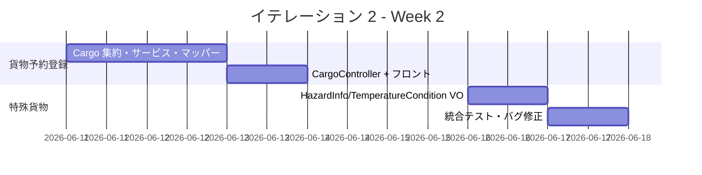
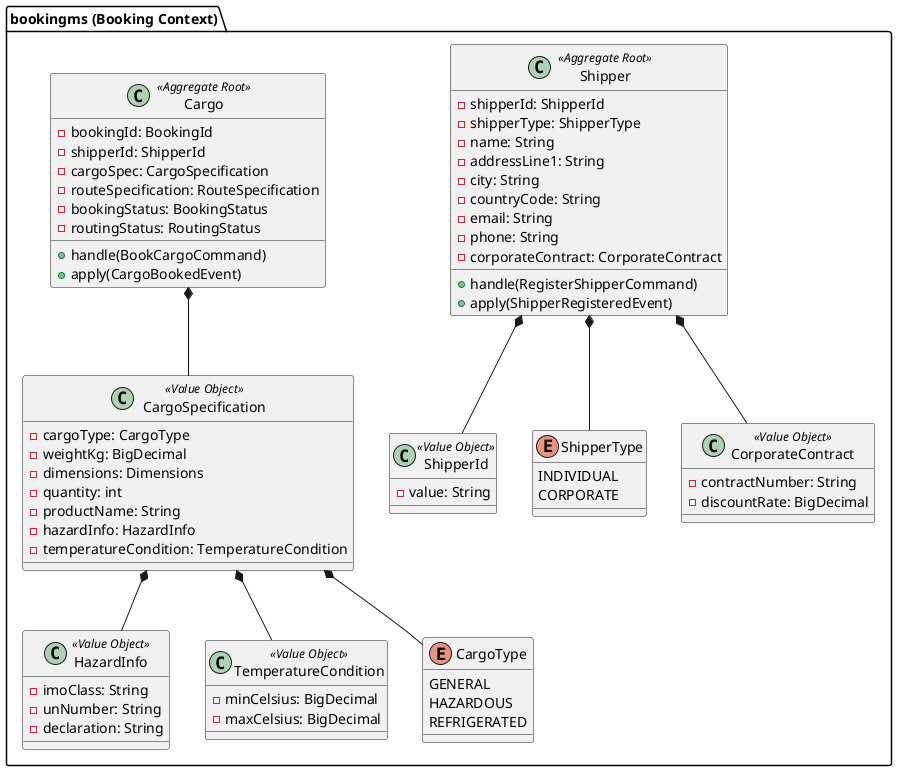
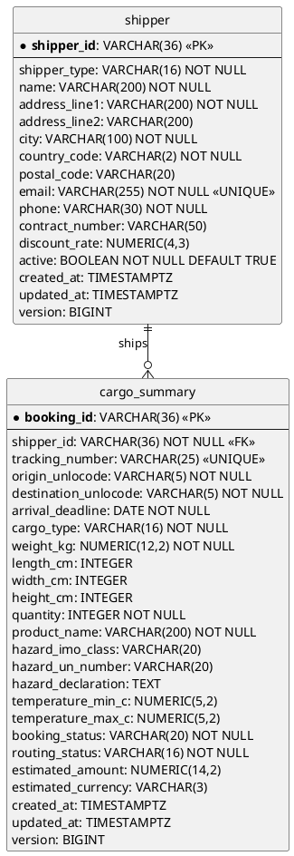
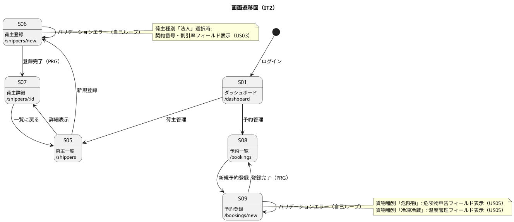

# イテレーション 2 計画

## 概要

| 項目 | 内容 |
|------|------|
| **イテレーション** | 2 |
| **期間** | 2026-06-04 〜 2026-06-17（2 週間） |
| **ゴール** | 荷主登録・法人荷主登録・貨物予約登録を実現し、予約ドメイン（bookingms）の基盤を確立する |
| **目標 SP** | 10 |

---

## ゴール

### イテレーション終了時の達成状態

1. **荷主管理**: 個人荷主・法人荷主（契約番号・割引率付き）の登録・参照が動作する
2. **貨物予約**: 標準貨物・危険物・冷凍貨物の予約登録が動作する
3. **品質維持**: テストカバレッジ 80% 以上（新規コード）、SonarQube Quality Gate PASS

### 成功基準

- [ ] US02: 荷主（個人）を登録・参照できる
- [ ] US03: 法人荷主（契約番号・割引率）を登録・参照できる
- [ ] US04: 標準貨物の予約を登録できる
- [ ] US05: 危険物・冷凍貨物の予約を登録できる
- [ ] テストカバレッジ 80% 以上（新規コード）
- [ ] SonarQube Quality Gate PASS

---

## ユーザーストーリー

### 対象ストーリー

| ID | ユーザーストーリー | SP | 優先度 |
|----|-------------------|----|--------|
| US02 | 荷主を登録する | 2 | 必須 |
| US03 | 法人荷主を登録する | 2 | 必須 |
| US04 | 貨物予約を登録する | 3 | 必須 |
| US05 | 危険物・冷凍貨物の予約を登録する | 3 | 必須 |
| **合計** | | **10** | |

### ストーリー詳細

#### US02: 荷主を登録する

**ストーリー**:

> 営業担当者として、新規荷主の氏名/社名・住所・連絡先・メールアドレスをシステムに登録したい。なぜなら、次回以降の予約で荷主情報の再入力を省略でき、顧客情報を一元管理できるからだ。

**受入条件**:

- [ ] 氏名/社名・住所・連絡先・メールアドレス・荷主種別（個人/法人）を入力できる
- [ ] 同一メールアドレスが既に登録されている場合、既存荷主として表示しどちらを使用するか選択できる
- [ ] 登録完了後、荷主 ID が発行される
- [ ] 荷主種別「個人」で登録できる

**対応 UC**: UC02

#### US03: 法人荷主を登録する

**ストーリー**:

> 営業担当者として、法人荷主の契約番号と割引率を含めて登録したい。なぜなら、法人契約条件（割引率）を精算時に自動適用できるからだ。

**受入条件**:

- [ ] 荷主種別「法人」を選択すると、法人契約情報（契約番号・割引率）の入力フィールドが表示される
- [ ] 割引率は 0〜30% の範囲で設定できる
- [ ] 法人荷主で登録完了後、荷主 ID が発行される
- [ ] 登録した法人情報は US22（法人割引を適用する）で参照される

**対応 UC**: UC02

#### US04: 貨物予約を登録する

**ストーリー**:

> 営業担当者として、荷主 ID・貨物仕様（種別・重量・寸法・個数・品名）・輸送条件（出発地・目的地・希望日）を入力して予約を登録したい。なぜなら、荷主の見積承認後に正式な予約を受け付け、経路設計フェーズに引き継げるからだ。

**受入条件**:

- [ ] 荷主 ID を入力して既存荷主を選択できる
- [ ] 貨物種別・重量・寸法・個数・品名を入力できる
- [ ] 出発地・目的地・希望引渡日・希望着日を入力できる
- [ ] 登録完了後、予約番号が発行され状態が「仮受付」になる
- [ ] 経路設計者に予約登録の通知が送信される
- [ ] 見積情報との整合性が確認される

**対応 UC**: UC03

#### US05: 危険物・冷凍貨物の予約を登録する

**ストーリー**:

> 営業担当者として、危険物や冷凍・冷蔵貨物の場合に、特別な追加情報（危険物申告・温度管理条件）を含めて予約を登録したい。なぜなら、貨物種別に応じた法的要件と取扱い条件を正確に管理し、安全な輸送を保証できるからだ。

**受入条件**:

- [ ] 貨物種別「危険物」を選択すると、危険物申告情報の入力フィールドが表示され入力が必須となる
- [ ] 貨物種別「冷凍・冷蔵貨物」を選択すると、温度管理条件の入力フィールドが表示され入力が必須となる
- [ ] 特別情報が登録された予約は、経路設計時に対応可能な航海・ルートのみが候補として表示される

**対応 UC**: UC03

---

## タスク

### 1. bookingms 基盤構築（1 SP）

| # | タスク | 見積もり | 担当 | 状態 |
|---|--------|---------|------|------|
| 1.1 | bookingms Gradle サブモジュール作成 | 4h | - | [ ] |
| 1.2 | Spring Boot + Axon 依存関係設定 | 2h | - | [ ] |
| 1.3 | Flyway マイグレーション（shipper / cargo_summary テーブル） | 2h | - | [ ] |

**小計**: 8h（理想時間）

### 2. US02: 荷主登録（2 SP）

| # | タスク | 見積もり | 担当 | 状態 |
|---|--------|---------|------|------|
| 2.1 | Shipper 集約（RegisterShipperCommand / ShipperRegisteredEvent） | 3h | - | [ ] |
| 2.2 | ShipperCommandService + ShipperQueryService | 2h | - | [ ] |
| 2.3 | ShipperMapper（MyBatis）+ ShipperProjectionEventHandler | 2h | - | [ ] |
| 2.4 | ShipperController（POST /api/v1/shippers / GET） | 2h | - | [ ] |
| 2.5 | フロントエンド: 荷主一覧（S05）・荷主登録（S06） | 3h | - | [ ] |
| 2.6 | テスト（Service / Controller / EventHandler） | 4h | - | [ ] |

**小計**: 16h（理想時間）

### 3. US03: 法人荷主登録（2 SP）

| # | タスク | 見積もり | 担当 | 状態 |
|---|--------|---------|------|------|
| 3.1 | Shipper 集約拡張（法人種別 + CorporateContract value object） | 3h | - | [ ] |
| 3.2 | RegisterShipperCommand に契約番号・割引率フィールド追加 | 2h | - | [ ] |
| 3.3 | フロントエンド: 荷主登録フォームに法人フィールド表示切替 | 2h | - | [ ] |
| 3.4 | テスト（法人種別登録・割引率バリデーション） | 4h | - | [ ] |

**小計**: 11h（理想時間）

### 4. US04: 貨物予約登録（3 SP）

| # | タスク | 見積もり | 担当 | 状態 |
|---|--------|---------|------|------|
| 4.1 | Cargo 集約（BookCargoCommand / CargoBookedEvent） | 4h | - | [ ] |
| 4.2 | CargoCommandService + CargoQueryService | 2h | - | [ ] |
| 4.3 | CargoMapper（MyBatis）+ cargo_summary EventHandler | 2h | - | [ ] |
| 4.4 | CargoController（POST /api/v1/bookings / GET） | 2h | - | [ ] |
| 4.5 | フロントエンド: 予約一覧（S08）・予約登録（S09） | 3h | - | [ ] |
| 4.6 | テスト（Service / Controller / EventHandler） | 4h | - | [ ] |

**小計**: 17h（理想時間）

### 5. US05: 危険物・冷凍貨物予約登録（3 SP）

| # | タスク | 見積もり | 担当 | 状態 |
|---|--------|---------|------|------|
| 5.1 | HazardInfo・TemperatureCondition value object 追加 | 3h | - | [ ] |
| 5.2 | CargoSpecification に特殊貨物情報統合 + バリデーション | 3h | - | [ ] |
| 5.3 | フロントエンド: 貨物種別選択による入力フィールド表示切替 | 3h | - | [ ] |
| 5.4 | テスト（バリデーション・フィールド必須チェック） | 4h | - | [ ] |

**小計**: 13h（理想時間）

### タスク合計

| カテゴリ | SP | 理想時間 | 状態 |
|---------|----|---------|----|
| bookingms 基盤構築 | 0 | 8h | [ ] |
| US02: 荷主登録 | 2 | 16h | [ ] |
| US03: 法人荷主登録 | 2 | 11h | [ ] |
| US04: 貨物予約登録 | 3 | 17h | [ ] |
| US05: 危険物・冷凍貨物予約登録 | 3 | 13h | [ ] |
| **合計** | **10** | **65h** | |

**1 SP あたり**: 約 6.5h

**進捗率**: 0% (0/10 SP)

---

## スケジュール

### Week 1（Day 1-5）


| 日 | タスク |
|----|--------|
| Day 1（06-04） | bookingms サブモジュール作成、Flyway マイグレーション |
| Day 2（06-05） | Shipper 集約・CommandService・QueryService |
| Day 3（06-06） | ShipperMapper・EventHandler・Controller |
| Day 4（06-09） | 荷主登録フロントエンド（S05/S06）・テスト |
| Day 5（06-10） | Shipper 集約拡張（法人種別 / CorporateContract）・フォーム切替 |

### Week 2（Day 6-10）



| 日 | タスク |
|----|--------|
| Day 6（06-11） | 法人荷主登録テスト、Cargo 集約・CommandService・QueryService |
| Day 7（06-12） | CargoMapper・EventHandler・Controller |
| Day 8（06-13） | 予約登録フロントエンド（S08/S09）・テスト |
| Day 9（06-16） | HazardInfo・TemperatureCondition VO・バリデーション・フィールド切替 |
| Day 10（06-17） | 統合テスト、バグ修正、SonarQube 確認、デモ準備 |

---

## 設計

### ドメインモデル



### データモデル



### ユーザーインターフェース

#### 画面マッピング

| ID | 画面名 | パス | 対応 UC |
|---|--------|------|---------|
| S05 | 荷主一覧 | `/shippers` | UC02 |
| S06 | 荷主登録 | `/shippers/new` | UC02 |
| S07 | 荷主詳細 | `/shippers/:id` | UC02 |
| S08 | 予約一覧 | `/bookings` | UC03 |
| S09 | 予約登録 | `/bookings/new` | UC03 |

#### インタラクション（画面遷移）



### API 設計

| メソッド | エンドポイント | 説明 |
|---------|---------------|------|
| POST | /api/v1/shippers | 荷主登録（個人・法人共通） |
| GET | /api/v1/shippers | 荷主一覧取得 |
| GET | /api/v1/shippers/{shipperId} | 荷主詳細取得 |
| POST | /api/v1/bookings | 予約登録（Cargo） |
| GET | /api/v1/bookings | 予約一覧取得 |
| GET | /api/v1/bookings/{bookingId} | 予約詳細取得 |

### ディレクトリ構成

```
apps/backend/
└── bookingms/
    └── src/
        ├── main/java/.../bookingms/
        │   ├── application/
        │   │   ├── ShipperCommandService.java
        │   │   ├── ShipperQueryService.java
        │   │   ├── CargoCommandService.java
        │   │   └── CargoQueryService.java
        │   ├── domain/model/
        │   │   ├── Shipper.java          # 集約ルート（INDIVIDUAL/CORPORATE 共通）
        │   │   ├── Cargo.java            # 集約ルート（予約）
        │   │   └── vo/
        │   │       ├── CorporateContract.java
        │   │       ├── CargoSpecification.java
        │   │       ├── HazardInfo.java
        │   │       └── TemperatureCondition.java
        │   ├── infrastructure/
        │   │   ├── mapper/ShipperMapper.java
        │   │   └── mapper/CargoMapper.java
        │   └── interfaces/
        │       ├── events/ShipperProjectionEventHandler.java
        │       ├── events/CargoProjectionEventHandler.java
        │       ├── rest/ShipperController.java
        │       └── rest/CargoController.java
        └── resources/
            └── db/migration/
                ├── V2__create_shipper.sql
                └── V3__create_cargo_summary.sql
```

---

## リスクと対策

| リスク | 影響度 | 対策 |
|--------|--------|------|
| bookingms と routingms の Axon 設定が干渉する | 中 | BoundedContext を明確に分離し、Kafka トピックをマイクロサービス別に分ける |
| US03 の CorporateContract 実装がデータモデルと乖離する | 中 | `shipper` テーブルの `contract_number` / `discount_rate` に対応させ、法人種別時のみ必須とする |
| IT2 ベロシティが IT1 と乖離する | 低 | 10 SP を維持するが、US05 は US04 の後に実装し遅延時はバッファ調整する |

---

## 完了条件

### Definition of Done

- [ ] コードレビュー完了
- [ ] ユニットテストがパス（新規コードカバレッジ 80% 以上）
- [ ] E2E テストがパス
- [ ] SonarQube Quality Gate PASS（重複率 < 3%）
- [ ] ローカル環境（local-docker プロファイル）で動作確認済み
- [ ] Heroku デプロイ確認済み
- [ ] ドキュメント更新完了

### デモ項目

1. 個人荷主を登録し、荷主一覧（S05）に表示されることを確認
2. 法人荷主を登録し（契約番号・割引率付き）、法人として一覧に表示されることを確認
3. 標準貨物の予約を登録し（Cargo 集約）、予約番号発行・状態「仮受付」を確認
4. 危険物種別で予約登録し、危険物申告フィールドが必須表示されることを確認

---

## 更新履歴

| 日付 | 更新内容 | 更新者 |
|------|---------|--------|
| 2026-05-22 | 初版作成 | k2works |
| 2026-05-22 | 整合性検証による修正（ストーリー文・受入条件・集約名・テーブル定義・画面 ID） | k2works |

---

## 関連ドキュメント

- [IT2 ふりかえり](./retrospective-2.md)
- [IT1 完了報告書](./iteration_report-1.md)
- [リリース計画](./release_plan.md)
- [ユーザーストーリー](../requirements/user_story.md)
- [ドメインモデル設計](../design/domain-model.md)
- [データモデル設計](../design/data-model.md)
- [UI 設計](../design/ui_design.md)
