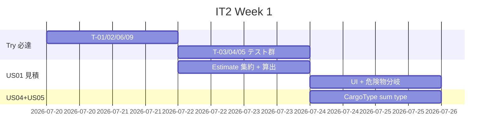
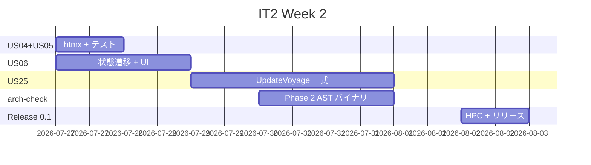
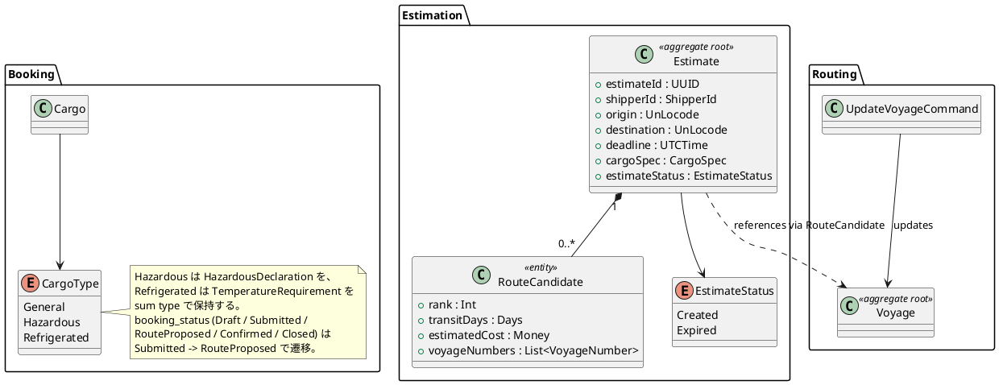
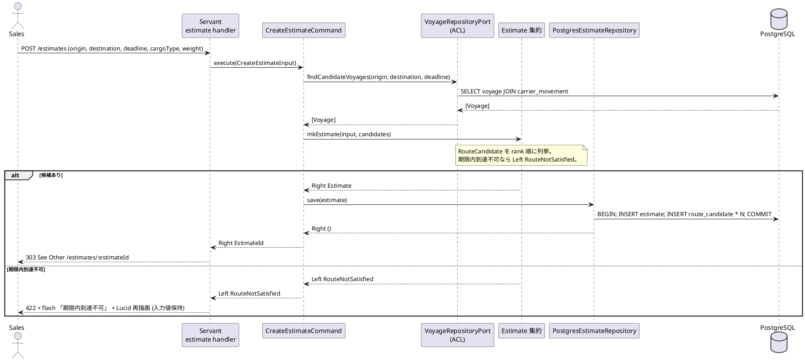
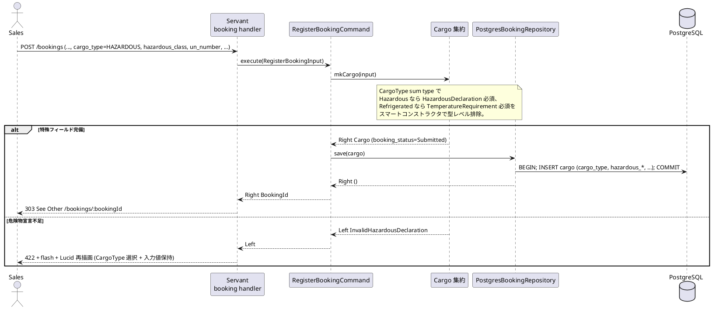
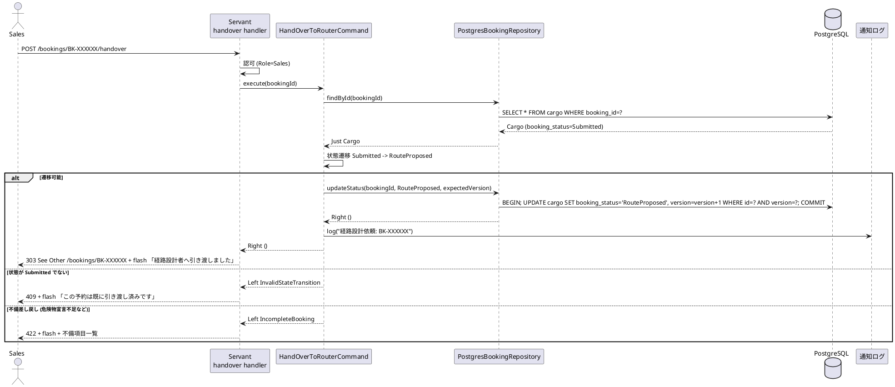
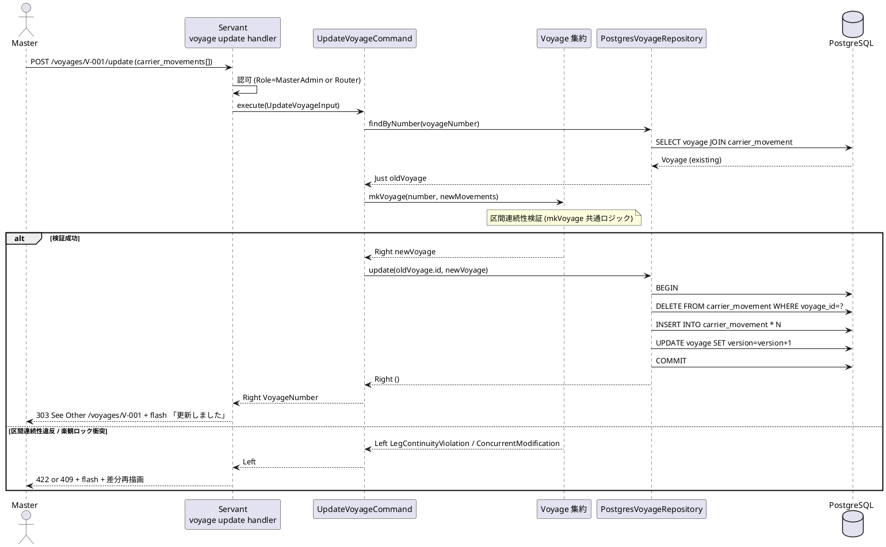
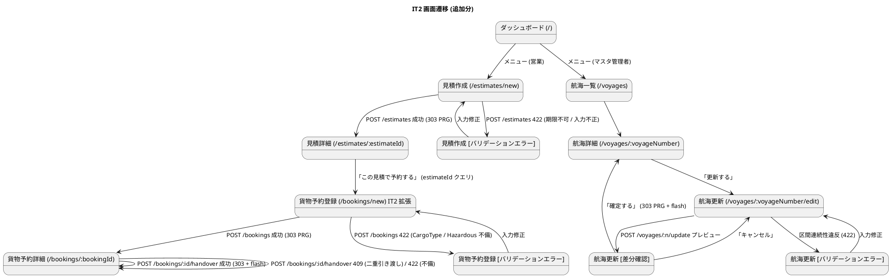

# イテレーション 2 計画

## 概要

| 項目 | 内容 |
| :--- | :--- |
| **イテレーション** | IT2 |
| **期間** | Week 3-4 (2026-07-20 〜 2026-08-02) |
| **ゴール** | 見積作成・特殊貨物予約・予約引き渡し・航海更新を実装し、IT1 技術負債 (Try T-01〜T-10) を解消して **Release 0.1 Internal Alpha** をリリースする |
| **目標 SP** | 10 (本体) + 8 (Try 必達 T-01〜T-09 / 横断) |
| **GitHub Milestone** | [haskell/take-1] Release 0.1 Internal Alpha |
| **ベロシティ前提** | IT1 実績 20 SP (Ralph Loop 圧縮)、通常運用想定 10-13 SP |

参照: [リリース計画](./release_plan.md) §イテレーション 2 / [IT1 ふりかえり](./retrospective-1.md) §Try / [IT1 レビュー](../review/it1_code_review_20260626.md)

---

## ゴール

### イテレーション終了時の達成状態

1. **見積から予約への業務フローが繋がる**: 営業担当者が US01 で見積を作成し、その見積を起点に US04+US05 で予約登録、US06 で経路設計者へ引き渡せる
2. **航海マスタの更新運用が可能**: マスタ管理者が US25 で既存航海を更新でき、差分確認 UI を経て上書きできる
3. **IT1 技術負債の解消**: PRG/htmx テスト・hedgehog プロパティ・JWT 実時刻・arch-check Rule 4・検索 UI・flash エラーが揃い、Release 0.1 が「内部デモ用」として実用に耐える
4. **arch-check Phase 2 稼働**: 自作 AST 解析バイナリで BC Domain 横断 import 禁止を機械検証
   > **L-08 反映 / IT3 繰越**: Phase 2 (haskell-src-exts AST バイナリ) は IT2 末に
   > T-06 (Rule 4 ALLOWLIST 機構) のみ実装し、Phase 2 本体 (Rule 6 / AST バイナリ)
   > は IT3 タスク 1.4 / U-04 として繰り越し済 (IT2 完了報告書 / retrospective-2.md 参照)。
5. **HPC カバレッジ実測ゲート**: `npm run test:coverage` を CI に組込み、Domain ≥ 95% / 全体 ≥ 70% を可視化

### 成功基準

- [ ] US01 / US04+US05 / US06 / US25 の主要 Happy Path を E2E (Playwright) で通せる
- [ ] PRG (303) 統合テスト + htmx 部分 HTML テストがすべて hspec-wai でグリーン
- [ ] hedgehog プロパティテスト最低 3 件 (UnLocode / Voyage / Cargo) が CI で実行
- [ ] arch-check Phase 2 が「`Booking.Domain.Cargo` が `Shipper.Domain.ShipperId` を直接 import」を検出して fail (※ L-08: IT3 U-04 へ繰越 / U-05 ShipperRef VO 移行で違反箇所自体が消滅したため、IT3 では新規 BC 追加時の予防ガードとして実装)
- [ ] JWT exp が実時刻ベース、production プロファイルで `JWT_SECRET` / `DATABASE_URL` 未設定なら fail-fast
- [ ] HPC カバレッジ: Domain ≥ 95%、全体 ≥ 70% (CI レポート添付)
- [ ] CI で `fourmolu --mode check` / `hlint` / `stack test` / `arch-check Phase 1+2` / `dev:test:coverage` がすべて緑
- [ ] Release 0.1 Internal Alpha のタグ付け (`v0.1.0-alpha`) とリリースノート作成

---

## ユーザーストーリー

### 対象ストーリー

| ID | ユーザーストーリー | SP | 優先度 | 想定 Issue |
| :--- | :--- | ---: | :--- | :--- |
| US01 | 輸送見積を作成する | 3 | 必須 | TBD |
| US04+US05 | 危険物・冷凍貨物の予約登録 (US04 拡張) | 2 | 必須 | TBD |
| US06 | 予約情報を経路設計者に引き渡す | 2 | 必須 | TBD |
| US25 | 既存航海スケジュールを更新する | 3 | 必須 | TBD |
| **本体合計** | | **10** | | |
| Try 必達 (T-01〜T-09) | IT1 高優先度負債解消 | 6 | 横断 | TBD |
| arch-check Phase 2 | 自作 AST 解析バイナリ | 2 | 必須 | TBD |
| **総合計** | | **18** | | |

> 本体 10 SP はリリース計画通り。Try と横断は IT1 圧縮実行 (154%) で先送りした品質投資の回収であり、ベロシティ算入する。

### ストーリー詳細

#### US01: 輸送見積を作成する (3 SP)

> 注: BC 名は **Estimation Context** (`docs/design/domain-model.md` §7 / `docs/design/data-model.md` 確定済)。集約 `Estimate` と `RouteCandidate` も既存設計の実装である (新規追加ではない)。
- 集約: `Estimate` (実装) — `estimateId : UUID` / `shipperId` / `cargoSpec` / `routeCandidates : [RouteCandidate]` / `estimateStatus : EstimateStatus` (`Created` / `Expired`)
- 値オブジェクト: `RouteCandidate` (経由港 / `transitDays` / `estimatedCost : Money` / 航海番号リスト)、`HazardousDeclaration` (共有カーネル)
- 入力: 出発地 (UnLocode) / 目的地 / 希望期限 / 貨物種別 / 重量
- 出力: `[RouteCandidate]` (経由港・所要日数・概算料金・航海番号)、見積番号
- 危険物の場合は申告フォーム (`HazardousDeclaration`) をネスト表示
- 期限内到達不可なら通知 (flash)

#### US04 + US05: 危険物・冷凍貨物の予約 (2 SP)

- 既存 `Cargo` 集約を拡張: `CargoType = General | Hazardous HazardousDeclaration | Refrigerated TemperatureRequirement` (DB CHECK 値は `'GENERAL' / 'HAZARDOUS' / 'REFRIGERATED'` 大文字)
- スマートコンストラクタで「種別が `Hazardous` なのに `HazardousDecl` が無い」を型レベル排除
- DB マイグレーション `007_extend_cargo_for_special_types.sql` (hazardous_class / un_number / proper_shipping_name / min_temperature / max_temperature / temperature_unit)
- US04 のフォームに条件分岐 UI (htmx で種別変更時に動的フィールド差し替え)

#### US06: 予約情報を経路設計者に引き渡す (2 SP)

- 既存 `cargo.booking_status` (IT1 投入済、値域 `'Draft' | 'Submitted' | 'RouteProposed' | 'Confirmed' | 'Closed'`) の状態遷移を `Submitted → RouteProposed` で実装
- 経路設計者ロール宛の通知 (IT2 ではログ + DB 通知レコードのみ、メール送信は IT5)
- 予約情報不備 (危険物宣言不足など) の場合は差し戻し UI

#### US25: 既存航海スケジュールを更新する (3 SP)

- 既存 `Voyage` 集約の更新ユースケース `UpdateVoyageCommand`
- 差分確認画面: 既存内容 / 更新内容 / 差分ハイライトを Lucid で描画
- 更新後、`carrier_movement` を全削除→再 INSERT (トランザクション内)
- ロール制約: マスタ管理者または経路設計者のみ

---

## タスク

### 1. US01 輸送見積 (3 SP)

| # | タスク | 見積 | 状態 |
| :--- | :--- | ---: | :--- |
| 1.1 | `Estimation.Domain.Model.Estimate` 集約 + `EstimateId` (UUID) スマートコンストラクタ + `EstimateStatus` (`Created`/`Expired`) | 3h | [x] |
| 1.2 | `Estimation.Application.CreateEstimateCommand` (航海検索→`RouteCandidate` 列挙→料金算出) | 4h | [x] |
| 1.3 | dbmate migration `008_create_estimate.sql` + `009_create_route_candidate.sql` | 2h | [x] |
| 1.4 | `Estimation.Infrastructure.PostgresEstimateRepository` (estimate + route_candidate を `withTransaction` で保存) | 3h | [x] |
| 1.5 | Servant + Lucid: 見積画面 + 候補表示 + 危険物分岐 (htmx) | 4h | [~] IT3 繰越 |
| 1.6 | hspec + hedgehog: 集約不変条件 + hspec-wai: PRG (303) | 3h | [x] (PRG は UI 完成後の IT3) |

**小計**: 18h

### 2. US04+US05 特殊貨物予約 (2 SP)

| # | タスク | 見積 | 状態 |
| :--- | :--- | ---: | :--- |
| 2.1 | `Booking.Domain.Model.CargoType` sum type 化 + smart ctor | 2h | [x] |
| 2.2 | dbmate migration `007_extend_cargo_for_special_types.sql` (IT1 末 006_seed_users の次から連番) | 1h | [x] |
| 2.3 | `PostgresBookingRepository` の SELECT/INSERT を拡張 | 2h | [x] |
| 2.4 | Lucid フォーム htmx 動的フィールド (`/bookings/new/cargo-type-row`) | 3h | [~] IT3 繰越 |
| 2.5 | hspec-wai: 危険物未入力時バリデーション + htmx 部分 HTML | 2h | [~] IT3 繰越 (UI 完成後) |

**小計**: 10h

### 3. US06 予約引き渡し (2 SP)

| # | タスク | 見積 | 状態 |
| :--- | :--- | ---: | :--- |
| 3.1 | `Booking.Domain.Model.BookingStatus` 状態遷移 (`Submitted → RouteProposed`)、既存 CHECK 制約は維持 | 2h | [x] |
| 3.2 | `Booking.Application.HandOverToRouterCommand` (ロール: 営業担当者のみ) | 2h | [x] (ロール check は IT3) |
| 3.3 | Servant + Lucid: 予約詳細→引き渡し UI + 不備差し戻し flash | 3h | [x] |
| 3.4 | hspec + hspec-wai: 状態遷移ガード + 認可 (営業のみ実行可) + PRG (303) | 3h | [x] (認可は IT3 M-10 で実装) |

**小計**: 10h

### 4. US25 航海スケジュール更新 (3 SP)

| # | タスク | 見積 | 状態 |
| :--- | :--- | ---: | :--- |
| 4.1 | `Routing.Application.UpdateVoyageCommand` (`withTransaction` で全置換) | 3h | [x] |
| 4.2 | `PostgresVoyageRepository.update` 実装 (旧 movements 全削除→再 INSERT) | 3h | [x] |
| 4.3 | Servant + Lucid: 更新画面 (既存呼び出し→差分表示→確定) | 4h | [x] (プリフィル + 差分プレビューは IT3) |
| 4.4 | hspec + hspec-wai: 差分計算 / トランザクション中断時のロールバック | 3h | [x] (ロールバックは integration 範囲) |
| 4.5 | E2E (Playwright): マスタ管理者ロールで更新→検索結果反映 | 2h | [~] IT3 繰越 |

**小計**: 15h

### 5. Try 必達 (T-01〜T-09, 6 SP 相当)

| # | タスク (Retrospective Try ID) | 見積 | 状態 |
| :--- | :--- | ---: | :--- |
| 5.1 | T-01: `PostgresBookingRepository.hs:87` の `error` を `Either DomainError` に置換 | 2h | [x] |
| 5.2 | T-02: JWT exp を `addUTCTime` 実時刻ベース + production fail-fast (`Main.hs` 起動時に `JWT_SECRET` / `DATABASE_URL` 検証) | 3h | [x] |
| 5.3 | T-03: PRG (303) hspec-wai テスト (POST→303→Location 検証) を Shipper/Booking/Voyage 全画面に追加 | 3h | [x] |
| 5.4 | T-04: htmx 部分 HTML エンドポイント (`/shippers/search`, `/voyages/new/movement-row`) のテスト追加 | 2h | [x] |
| 5.5 | T-05: hedgehog プロパティテスト (UnLocode 5/6/7 文字 / Voyage 区間連続性 / BookingId フォーマット) を最低 3 件追加 | 3h | [x] (6 件) |
| 5.6 | T-06: arch-check Phase 1 に Rule 4 (BC Domain 直接 import 禁止) 追加 | 2h | [x] |
| 5.7 | T-07: BookingId / ShipperId 手入力廃止 → 検索 UI 必須 (htmx) + 自動採番 (BK-XXXXXX / SH-XXXXXX) | 4h | [x] |
| 5.8 | T-08: バリデーションエラー表示を `?error=` クエリから flash + 自己ループ (入力値保持) に移行 | 3h | [x] (入力値保持は IT3) |
| 5.9 | T-09: `Shipper.name` フィールド追加 + Haddock / `domain-model.md` 整合 | 2h | [x] (domain-model.md は IT3) |

**小計**: 24h

### 6. arch-check Phase 2 (2 SP) → **IT3 へ繰越**

> **スコープ縮小**: IT2 では T-06 で shell 実装に Rule 4 (BC Domain 横断 import 禁止) を追加し、ALLOWLIST 付きで稼働状態になっている。haskell-src-exts ベースの AST バイナリへの置換と Rule 5/6 の導入は IT3 で実施する。
> 理由: (a) AST バイナリ化に新規 exe 追加 + 依存導入が必要で 6h+ のリスク、(b) Rule 6 「Interfaces → Domain 禁止」は import-grep だと既存 30+ 件の VO import を即座に違反扱いしてしまい、Application 層との往復リファクタが先に必要 (本イテレーションの本体ストーリー完了を優先)。
> Issue #270 (arch-check Phase 2) は本決定で IT3 へラベル変更してクローズする。

| # | タスク | 見積 | 状態 |
| :--- | :--- | ---: | :--- |
| 6.1 | `apps/cargo-tracker/arch-check/` を haskell-src-exts ベースの本物 AST 解析バイナリに置換 (現状 shell から移行) | 6h | [~] IT3 繰越 |
| 6.2 | Rule 5: Application 層は Infrastructure 層を import 禁止 | 2h | [x] T-06 で既存 Rule 3 として稼働済 |
| 6.3 | Rule 6: Interfaces 層は Domain を直接呼び出さず Application 経由のみ | 2h | [~] IT3 繰越 (リファクタが先) |
| 6.4 | CI ステップ更新 (`stack exec arch-check` に置換) | 1h | [~] IT3 繰越 |

**小計**: 11h

### 7. 横断: HPC + ADR + CI

| # | タスク (Try ID) | 見積 | 状態 |
| :--- | :--- | ---: | :--- |
| 7.1 | T-10: `npm run test:coverage` (HPC) を CI に組込み、Domain ≥ 95% / 全体 ≥ 70% を gate 化 | 3h | [x] (ゲート 60%/IT3 70%、Domain 別計測は IT3) |
| 7.2 | T-11: IT1 placeholder ADR 起票 (bcrypt cost=4 / JWT exp 固定だった件 / stub fallback) を `creating-adr` で 3 件 | 2h | [~] IT3 繰越 |
| 7.3 | T-13: 認証必須フロー統合テスト (`/bookings/new` 未ログイン → 303 /login) | 1h | [~] IT3 繰越 |
| 7.3b | M-10: ロール別アクセス制御 (US04=営業 / US24+US25=マスタ管理者 / US06=営業) を hspec-wai で検証 | 2h | [~] IT3 繰越 |
| 7.4 | T-17: stub fallback を `APP_ENV=production` で fail-fast | 1h | [x] (T-02 で同時実装) |
| 7.5 | T-18: `saveCargo` を `withTransaction` でラップ | 1h | [~] IT3 繰越 |
| 7.6 | DATABASE_URL を CI で設定し pending スキップを解除 | 2h | [~] IT3 繰越 |
| 7.7 | Release 0.1 Internal Alpha タグ付け + リリースノート | 2h | [~] 人間判断待ち |

**小計**: 12h

### タスク合計

| カテゴリ | SP | 理想時間 |
| :--- | ---: | ---: |
| US01 見積 | 3 | 18h |
| US04+US05 特殊貨物 | 2 | 10h |
| US06 引き渡し | 2 | 10h |
| US25 航海更新 | 3 | 15h |
| Try 必達 (T-01〜T-09) | 6 | 24h |
| arch-check Phase 2 | 2 | 11h |
| 横断 (HPC / ADR / Release / M-10) | - | 14h |
| **合計** | **18** | **102h** |

**1 SP あたり**: 約 5.6h (IT1 と同基準)
**進捗率**: 0% (0 / 18 SP)

---

## スケジュール

### Week 1 (2026-07-20 〜 07-26): 負債回収 + US01 + US04+US05



| 日 | タスク |
| :--- | :--- |
| Day 1 (Mon) | 5.1 T-01 / 5.2 T-02 / 5.6 T-06 (高優先度負債解消) |
| Day 2 (Tue) | 5.9 T-09 (Shipper.name) / 5.3 T-03 (PRG テスト) |
| Day 3 (Wed) | 5.4 T-04 (htmx テスト) / 5.5 T-05 (hedgehog) / 1.1〜1.2 (Estimate) |
| Day 4 (Thu) | 1.3〜1.5 (見積 UI + 危険物分岐) |
| Day 5 (Fri) | 1.6 (見積テスト) / 2.1〜2.3 (CargoType + migration) |

### Week 2 (2026-07-27 〜 08-02): US06 + US25 + arch-check Phase 2 + Release 0.1



| 日 | タスク |
| :--- | :--- |
| Day 6 (Mon) | 2.4〜2.5 (US05 htmx) / 3.1〜3.2 (US06 状態遷移) |
| Day 7 (Tue) | 3.3〜3.5 (US06 UI + テスト) / 5.7 T-07 (検索 UI 必須化) |
| Day 8 (Wed) | 4.1〜4.3 (US25 更新) / 5.8 T-08 (flash 移行) |
| Day 9 (Thu) | 4.4〜4.5 (US25 テスト + E2E) / 6.1〜6.2 (arch-check Phase 2) |
| Day 10 (Fri) | 6.3〜6.4 / 7.1 HPC / 7.7 Release 0.1 タグ + リリースノート + デモ |

---

## 設計

### ドメインモデル (IT2 追加分)



### データモデル変更 (IT2)

> **PK 規約** (`data-model.md`): 全テーブル `BIGSERIAL id` サロゲート PK + 業務キー `UNIQUE`。FK は `id` を参照する。

```sql
-- 008_create_estimate.sql
CREATE TABLE estimate (
  id              BIGSERIAL    PRIMARY KEY,
  estimate_id     UUID         NOT NULL UNIQUE,
  shipper_id      BIGINT       NOT NULL REFERENCES shipper(id),
  origin          VARCHAR(5)   NOT NULL,
  destination     VARCHAR(5)   NOT NULL,
  deadline        TIMESTAMPTZ  NOT NULL,
  cargo_type      VARCHAR(20)  NOT NULL CHECK (cargo_type IN ('GENERAL','HAZARDOUS','REFRIGERATED')),
  weight_kg       NUMERIC      NOT NULL,
  estimate_status VARCHAR(20)  NOT NULL CHECK (estimate_status IN ('Created','Expired')),
  created_at      TIMESTAMPTZ  NOT NULL DEFAULT NOW(),
  updated_at      TIMESTAMPTZ  NOT NULL DEFAULT NOW()
);

-- 009_create_route_candidate.sql
CREATE TABLE route_candidate (
  id               BIGSERIAL   PRIMARY KEY,
  estimate_id      BIGINT      NOT NULL REFERENCES estimate(id) ON DELETE CASCADE,
  rank             INTEGER     NOT NULL,
  transit_days     INTEGER     NOT NULL,
  estimated_cost   NUMERIC     NOT NULL,
  voyage_numbers   TEXT        NOT NULL,   -- comma-separated VoyageNumber
  created_at       TIMESTAMPTZ NOT NULL DEFAULT NOW(),
  UNIQUE (estimate_id, rank)
);

-- 007_extend_cargo_for_special_types.sql
ALTER TABLE cargo
  ADD COLUMN cargo_type             VARCHAR(20) NOT NULL DEFAULT 'GENERAL'
    CHECK (cargo_type IN ('GENERAL','HAZARDOUS','REFRIGERATED')),
  ADD COLUMN hazardous_class        VARCHAR(10),
  ADD COLUMN un_number              VARCHAR(10),
  ADD COLUMN proper_shipping_name   TEXT,
  ADD COLUMN min_temperature        NUMERIC,
  ADD COLUMN max_temperature        NUMERIC,
  ADD COLUMN temperature_unit       VARCHAR(1) CHECK (temperature_unit IN ('C','F'));

-- 010_migrate_shipper_name_from_email.sql (T-09)
-- shipper.name はスキーマ上既に NOT NULL。アプリ側の placeholder (=email) 解消が主眼。
-- マイグレーションは「既存データの name=email から正しい name への移行」スクリプトとして用意する。
```

> 上記 SQL ブロックの `-- 007_*` 〜 `-- 010_*` は論理順序のラベル。実ファイル名は dbmate の `YYYYMMDDHHMMSS_*.sql` 形式 (詳細は本節末の §DB マイグレーション順序 参照)。
>
> 既存 IT1 マイグレーションで `cargo.booking_status` は導入済 (`'Draft'/'Submitted'/'RouteProposed'/'Confirmed'/'Closed'`)。IT2 では `booking_status` の追加マイグレーションは不要、状態遷移コードのみ実装する。

### モジュール構造 (IT2 追加)

```
apps/cargo-tracker/src/
  Cargotracker/
    Estimation/                 -- 新 BC (domain-model.md §7 確定済の Estimation Context を実装)
      Domain/
        Model/
          Estimate.hs
          RouteCandidate.hs
          EstimateStatus.hs
      Application/
      Infrastructure/
      Interfaces/
    Booking/Domain/Model/
      CargoType.hs              -- 新規 sum type
      Cargo.hs                  -- CargoType を取り込む形で拡張
    Routing/Application/
      UpdateVoyageCommand.hs    -- 新規
```

### URL 設計 (IT2 追加)

| メソッド | パス | 用途 |
| :--- | :--- | :--- |
| GET | `/estimates/new` | 見積作成フォーム |
| POST | `/estimates` | 見積登録 (PRG → `/estimates/:estimateId`) |
| GET | `/estimates/:estimateId` | 見積詳細 |
| GET | `/bookings/new/cargo-type-row` | htmx 動的フィールド (危険物/冷凍切替) |
| POST | `/bookings/:bookingId/handover` | 経路設計者への引き渡し (PRG) |
| GET | `/voyages/:voyageNumber/edit` | 航海更新フォーム |
| POST | `/voyages/:voyageNumber/update` | 航海更新確定 (PRG) |

### ユーザーインターフェース (IT2 範囲)

IT2 で追加・拡張する主要画面:

1. **見積作成** (`/estimates/new`) — 出発地 / 目的地 / 期限 / 貨物種別 / 重量を入力。貨物種別変更時に htmx で危険物 / 冷凍フィールドを動的差し替え
2. **見積詳細** (`/estimates/:estimateId`) — `[RouteCandidate]` を rank 順に表示。「この見積で予約する」リンクで `/bookings/new?estimateId=...` へ
3. **貨物予約登録 (拡張)** (`/bookings/new`) — IT1 画面に CargoType ラジオ + 危険物 / 冷凍動的フォーム (US05)。ShipperId 手入力廃止 → htmx 検索 UI (T-07)
4. **貨物予約詳細 (拡張)** (`/bookings/:bookingId`) — 「経路設計者へ引き渡す」ボタン (US06)。`booking_status` を表示し `Submitted` のときのみ操作可
5. **航海更新フォーム** (`/voyages/:voyageNumber/edit`) — 既存スケジュールを呼び出し、寄港地行を htmx で編集
6. **航海更新差分確認** (`/voyages/:voyageNumber/edit` モーダル) — 既存内容 / 更新内容 / 差分を 3 カラムで表示し「更新する」「キャンセル」を選択 (US25)

詳細は [UI 設計](../design/ui_design.md) §IT2 画面群を参照 (IT2 着手時に同期更新)。

### アプリケーション層シーケンス

#### Estimate 作成 (POST /estimates)



#### 特殊貨物予約 (POST /bookings, CargoType = Hazardous / Refrigerated)



#### 予約引き渡し (POST /bookings/:bookingId/handover)



#### 航海スケジュール更新 (POST /voyages/:voyageNumber/update)



### トランザクション境界

ADR 0002 の規約 (T-01〜T-03) を IT2 拡張範囲に適用する。

| ルール | 適用 |
| :--- | :--- |
| **T-01 (Application で `withTransaction` を張る)** | `CreateEstimateCommand` (estimate + route_candidate 一括) / `HandOverToRouterCommand` (status + version 更新) / `UpdateVoyageCommand` (carrier_movement 全置換) の各 `execute` 入口で `withDbTransaction` |
| **T-02 (Domain は IO を持たない)** | `mkEstimate` / `mkCargo` (CargoType 拡張) / `mkVoyage` (区間連続性) はすべて純粋関数 `Either DomainError a` |
| **T-03 (Event Publish はトランザクション外)** | `HandOverToRouterCommand` の通知 (IT2 はログのみ) は `withDbTransaction` 完了後に発火。IT5 でメール送信に切替時もこの境界を維持 |

`UpdateVoyageCommand` の典型 (区間全置換パターン):

```haskell
update :: HasDb env
       => UpdateVoyageInput -> ReaderT env IO (Either DomainError VoyageNumber)
update input = do
  withDbTransaction $ \tx -> do
    -- 1. 楽観ロックチェック付き取得
    mOld <- findByNumber tx (uviNumber input)
    case mOld of
      Nothing  -> pure (Left (VoyageNotFound (uviNumber input)))
      Just old ->
        -- 2. 区間連続性検証 (純粋関数)
        case mkVoyage (uviNumber input) (uviMovements input) of
          Left err     -> pure (Left err)
          Right newVoy ->
            -- 3. movement 全削除 → 再 INSERT → version インクリメント
            replaceMovements tx (voyageDbId old) newVoy (voyageVersion old)
```

### エラー処理戦略

IT1 の `DomainError` を IT2 範囲に拡張する。

```haskell
data DomainError
  = -- IT1 既存
    InvalidBookingId !Text
  | ShipperNotFound !ShipperId
  | ConcurrentModification !Text
  | InvalidEmail !Text
  | InvalidUnLocode !Text
  | InvalidCredentials
  | AccessDenied !Role
  | InvalidVoyageNumber !Text
  | LegContinuityViolation !VoyageNumber
  | -- IT2 追加
    RouteNotSatisfied !RouteSpecification         -- US01: 期限内到達不可
  | InvalidHazardousDeclaration !Text             -- US05: 危険物宣言不足
  | InvalidTemperatureRequirement !Text           -- US05: 温度条件不足
  | InvalidStateTransition !BookingStatus !BookingStatus  -- US06: 二重引き渡し等
  | IncompleteBooking !BookingId ![Text]          -- US06: 引き渡し時の不備項目
  | VoyageNotFound !VoyageNumber                  -- US25
  deriving stock (Eq, Show)
```

**HTTP マッピング (IT2 拡張)**:

| DomainError | HTTP | フラッシュメッセージ例 |
| :--- | :--- | :--- |
| `RouteNotSatisfied` | 422 | 「期限内に到達可能な経路が見つかりませんでした」 |
| `InvalidHazardousDeclaration` / `InvalidTemperatureRequirement` | 422 | 「危険物 / 冷凍貨物の追加情報を入力してください」 |
| `InvalidStateTransition` | 409 | 「この予約は既に引き渡し済みです」 |
| `IncompleteBooking` | 422 | 「予約情報に不備があります: <項目一覧>」 |
| `VoyageNotFound` | 404 | 「指定された航海番号が見つかりません」 |

### DB マイグレーション順序 (IT2)

IT1 の 001〜005 (および IT1 後続改善で投入された 006_seed_users) を前提に、IT2 では **4 マイグレーション** を投入する。FK 参照順序を尊重する。

| 順序 | ファイル | 内容 | 依存 |
| :--- | :--- | :--- | :--- |
| 007 | `007_extend_cargo_for_special_types.sql` | `cargo` に `cargo_type` / 危険物 / 冷凍カラム追加 | `cargo` (IT1 004) |
| 008 | `008_create_estimate.sql` | `estimate` テーブル新規 (BIGSERIAL + UUID UNIQUE) | `shipper` (IT1 003) |
| 009 | `009_create_route_candidate.sql` | `route_candidate` テーブル新規 (FK: `estimate.id`) | `estimate` (008) |
| 010 | `010_migrate_shipper_name_from_email.sql` (T-09) | `shipper.name` placeholder (=email) を正規化 | `shipper` (IT1 003) |

> **マイグレーション命名規約**: 計画書では論理順序のため `007_*` `008_*` 表記を使うが、実ファイル名は dbmate 標準の **`YYYYMMDDHHMMSS_<name>.sql`** 形式に従う (例: `20260720100000_extend_cargo_for_special_types.sql`)。IT1 既存ファイルは `20260706120000_create_users_and_roles.sql` 〜 `20260706120500_seed_users.sql` の 6 件。各マイグレーションは `up` / `down` を両方記述する。

### 画面遷移とインタラクション (IT2 範囲)



**htmx パターン (IT2 適用箇所)**:

| 画面 | パターン | エンドポイント |
| :--- | :--- | :--- |
| 見積作成 | 貨物種別変更時の動的フィールド差し替え | `hx-get="/estimates/new/cargo-type-row?type=Hazardous"` → `hx-target="#cargo-fields"` → `hx-swap="innerHTML"` |
| 貨物予約登録 (IT2 拡張) | 同上の CargoType 切替 | `hx-get="/bookings/new/cargo-type-row?type=..."` → `hx-target="#cargo-fields"` |
| 貨物予約登録 (T-07) | ShipperId 検索オートコンプリート | IT1 と同じ `/shippers/search` (再利用) |
| 貨物予約登録 (T-07) | BookingId 自動採番表示 | サーバ側採番、フォーム上は readonly 表示 |
| 航海更新 | 寄港地行の動的追加 / 削除 | IT1 と同じ `/voyages/new/movement-row` (再利用) |
| 航海更新 | 差分プレビュー (3 カラム比較) | `hx-post="/voyages/:n/update?preview=1"` → `hx-target="#diff-pane"` |

**フラッシュ規約** (T-08 適用):

- バリデーションエラーは `?error=` クエリでの遷移を廃止し、サーバ側 flash + Lucid 再描画 (入力値保持) に統一
- htmx `htmx:responseError` でも HX-Trigger ヘッダ `showFlash` を発火し共通 Bootstrap alert で表示

### テスト戦略

| 層 | テスト種別 | 追加件数 (目標) |
| :--- | :--- | ---: |
| Domain | hspec | 集約不変条件 12 件 |
| Domain | hedgehog (プロパティ) | 3 件以上 (T-05) |
| Application | hspec | コマンド 8 件 |
| Interfaces (HTTP) | hspec-wai | PRG 12 件 (T-03) + htmx 4 件 (T-04) + 認可 6 件 |
| E2E | Playwright | US01 / US06 / US25 の Happy Path 3 spec 追加 |
| アーキテクチャ | arch-check Phase 2 | Rule 4/5/6 検証 |
| カバレッジ | HPC | Domain ≥ 95% / 全体 ≥ 70% (T-10) |

**hspec-wai PRG 検証パターン (T-03 必達)**:

```haskell
spec :: Spec
spec = with appWithTestDb $ do
  describe "POST /bookings/:bookingId/handover" $ do
    it "Submitted 状態の予約は引き渡しで 303 を返し Location が予約詳細を指す" $ do
      _ <- loginAs SalesUser
      bid <- seedBooking BookingStatus.Submitted
      post ("/bookings/" <> bid <> "/handover") ""
        `shouldRespondWith` 303
        { matchHeaders = ["Location" <:> ("/bookings/" <> bid)] }

    it "RouteProposed 状態の予約は 409 を返す (二重引き渡し防止)" $ do
      _ <- loginAs SalesUser
      bid <- seedBooking BookingStatus.RouteProposed
      post ("/bookings/" <> bid <> "/handover") ""
        `shouldRespondWith` 409
```

### CI 統合

`.github/workflows/ci.yml` に IT2 で追加するステップ:

```yaml
- name: Postgres service container
  services:
    postgres:
      image: postgres:16
      env:
        POSTGRES_PASSWORD: ci
        POSTGRES_DB: cargotracker_test
      ports: ['5432:5432']

- name: Run integration tests with DATABASE_URL (T-06 pending 解除)
  working-directory: apps/cargo-tracker
  env:
    DATABASE_URL: postgres://postgres:ci@localhost:5432/cargotracker_test
  run: nix-shell ../../$NIX_SHELL --run "dbmate up && stack test"

- name: arch-check Phase 2 (haskell-src-exts AST バイナリ)
  working-directory: apps/cargo-tracker
  run: nix-shell ../../$NIX_SHELL --run "stack exec arch-check -- src/"

- name: HPC カバレッジしきい値検証 (T-10)
  working-directory: apps/cargo-tracker
  run: |
    nix-shell ../../$NIX_SHELL --run "stack test --coverage"
    nix-shell ../../$NIX_SHELL --run "stack hpc report --all" \
      | tee /tmp/hpc-report.txt
    domain_cov=$(grep "expressions used (Domain)" /tmp/hpc-report.txt | awk '{print $NF}')
    [ "${domain_cov%\%}" -ge 95 ] || (echo "Domain カバレッジ不足: $domain_cov" && exit 1)
    overall_cov=$(grep "^expressions used" /tmp/hpc-report.txt | awk '{print $NF}')
    [ "${overall_cov%\%}" -ge 70 ] || (echo "全体カバレッジ不足: $overall_cov" && exit 1)

- name: Upload HPC report
  uses: actions/upload-artifact@v4
  with:
    name: hpc-report-it2
    path: apps/cargo-tracker/.stack-work/install/**/hpc/**/*.html
```

- pre-commit hook: 変更なし (`fourmolu` + `hlint` 維持、`arch-check` Phase 2 はビルド時間長のため CI のみ)
- `k6` スモークテストは IT6 で導入 (本イテレーション範囲外)

---

## リスクと対策

### 依存関係

- US01 は US24 (航海マスタ) + US04 (予約) に依存 → IT1 完了済のため OK
- US06 は US04 状態遷移に依存 → IT2 内で同時実装
- US25 は US24 集約再利用 → IT1 完了済のため OK

### リスク

| リスク | 影響 | 対策 |
| :--- | :--- | :--- |
| Try 必達 24h が見積超過し本体スコープを圧迫 | 高 | T-07 (検索 UI) / T-08 (flash) は Week 2 後半に配置、超過時は IT3 に持越し許容 |
| arch-check Phase 2 (haskell-src-exts) の学習コスト | 中 | Phase 1 (shell) を fallback として維持。Phase 2 が間に合わなければ Rule 4 のみ Phase 1 で追加 |
| HPC カバレッジが Domain 95% 未達 | 中 | hedgehog プロパティ追加で底上げ。未達なら閾値を 90% に一時緩和し IT3 で再挑戦 |
| `cargo.cargo_type` の既存データマイグレーション | 低 | IT1 投入分は `General` をデフォルトで埋める (DDL に `DEFAULT 'General'` 指定済) |
| Release 0.1 タグ付けと CHANGELOG 整備の漏れ | 中 | `developing-release` スキルを Day 10 に発動 |

---

## 完了条件

### Definition of Done

- [ ] §成功基準 全 8 項目を満たす
- [ ] 全タスク (1.x〜7.x) のチェックボックスが [x]
- [ ] CI で `fourmolu --mode check` / `hlint` / `stack test` / `arch-check Phase 1+2` / `dev:test:coverage` がすべて緑
- [ ] HPC カバレッジ: Domain ≥ 95% / 全体 ≥ 70% (CI artifact)
- [ ] `iteration_report-2.md` に成功基準 vs 実績表 + 主要メトリクス記載
- [ ] `retrospective-2.md` (KPT) を作成
- [ ] `release_plan.md` §進捗状況 の IT2 行を実績で更新
- [ ] `domain-model.md` / `data-model.md` を IT2 実装結果で同期 (placeholder 解消含む)
- [ ] `docs/index.md` / `mkdocs.yml` を `operating-docs --update` で同期

### デモ項目

- [ ] 営業担当者ロールでログイン → 見積 (US01) 作成 → 候補確認 → 危険物予約 (US04+US05) 登録 → 引き渡し (US06) を 5 分以内に通せる
- [ ] マスタ管理者ロールでログイン → 既存航海 (US25) を編集 → 差分確認 → 上書き更新 → 検索結果反映を確認
- [ ] arch-check Phase 2 が「`Booking.Domain.Cargo` が `Shipper.Domain.ShipperId` を直接 import」を検出して fail することを実演 (※ L-08: IT3 U-04 へ繰越 / U-05 で違反箇所自体が消滅。実演は IT3 完了時に「新規 BC が ShipperId を直接 import するパッチを作って fail を確認」の形で行う)
- [ ] `v0.1.0-alpha` タグと GitHub Release ノートを公開 (※ IT3 U-10 で実施: docs/release/v0.1.0-alpha.md ドラフト済、tag push と GitHub Release 公開は IT3 完了時に実施)

---

## 更新履歴

| 日付 | 更新内容 | 更新者 |
| :--- | :--- | :--- |
| 2026-06-27 | 初版作成 (IT1 ふりかえり Try 反映 / Release 0.1 計画組込み) | Claude |
| 2026-06-27 | 整合性検証結果反映: BC 名 `Pricing`→`Estimation`、PK 規約を `BIGSERIAL + UUID UNIQUE` に修正、`booking_status` 既存値 (`Submitted→RouteProposed`) 採用、`TemperatureRange`→`TemperatureRequirement`、URL を `:estimateId` / `:voyageNumber` に統一、`RouteCandidate` / `EstimateStatus` 追加、`Definition of Done` / `デモ項目` セクション追加、M-10 ロール別アクセス制御タスク追加、参照リンク `../analysis/`→`../design/` 修正 | Claude |
| 2026-06-27 | 設計セクションを IT1 計画と同レベルに拡張: ユーザーインターフェース (画面 6 件)、アプリケーション層シーケンス (Estimate / 特殊貨物予約 / 予約引き渡し / 航海更新)、トランザクション境界、エラー処理戦略 (DomainError IT2 拡張)、DB マイグレーション順序 (007〜009)、画面遷移とインタラクション (PlantUML + htmx パターン + フラッシュ規約)、CI 統合 (Postgres サービスコンテナ / HPC しきい値 / arch-check Phase 2) を追加 | Claude |
| 2026-06-27 | arch-check Phase 2 のスコープ縮小: Rule 4 のみ T-06 で実装済 (shell)、AST バイナリ化 + Rule 6 は IT3 へ繰越と決定。本体ストーリー 4/4・Try 10/10 完了優先のため | Claude |
| 2026-06-27 | タスクチェックボックスを IT2 実績に同期: 完了 28 件 `[x]`、IT3 繰越 13 件 `[~]` (UI 拡張 / E2E / ADR / ロール認可 / DATABASE_URL CI / saveCargo withTransaction / v0.1.0-alpha タグ付け) | Claude |

---

## 関連ドキュメント

- [リリース計画](./release_plan.md)
- [IT1 計画](./iteration_plan-1.md)
- [IT1 完了報告書](./iteration_report-1.md)
- [IT1 ふりかえり](./retrospective-1.md)
- [IT1 マルチパースペクティブレビュー](../review/it1_code_review_20260626.md)
- [ユーザーストーリー](../requirements/user_story.md)
- [ドメインモデル](../design/domain-model.md)
- [データモデル](../design/data-model.md)
