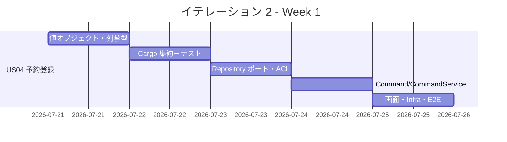
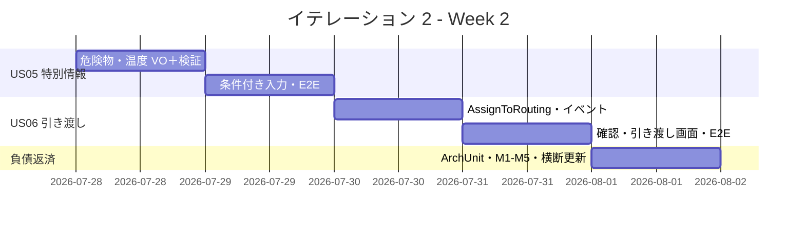
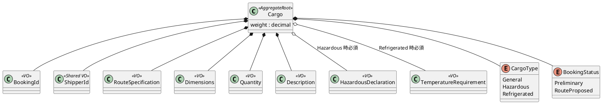
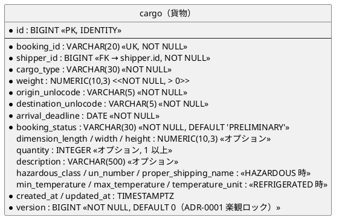

# イテレーション 2 計画

## 概要

| 項目 | 内容 |
|------|------|
| **イテレーション** | 2 |
| **期間** | 2026-07-21 〜 2026-08-01（2 週間） |
| **ゴール** | 貨物予約（危険物・冷凍対応）を登録し、経路設計者へ引き渡せる |
| **目標 SP** | 10（US04 / US05 / US06） |

---

## ゴール

### イテレーション終了時の達成状態

1. **Booking コンテキストの立ち上げ**: `CargoTracker.Domain.Booking` を新規 BC として実装し、Cargo 集約（予約）を Preliminary 状態で登録できる。
2. **貨物種別ごとの特別情報**: 危険物申告（HazardousDeclaration）・温度管理条件（TemperatureRequirement）を貨物種別に応じて必須検証しつつ登録できる。
3. **経路設計者への引き渡し**: 予約を `Preliminary → RouteProposed` に遷移させ、経路設計依頼のドメインイベントを発行できる。

### 成功基準

- [ ] US04・US05・US06 の受入条件をすべて満たす
- [ ] Booking BC のドメイン層ユニットテストが全パス
- [ ] E2E で「予約登録 → 引き渡し」フローが通る
- [ ] ArchUnit ルールを Booking BC に拡張し依存方向を検証（Try T2）
- [ ] 中優先レビュー指摘 M1・M3・M4・M5 を消化（Try T5）
- [ ] テストカバレッジ 80% 以上（ドメイン層 85%）

---

## ユーザーストーリー

### 対象ストーリー

| ID | ユーザーストーリー | SP | 優先度 |
|----|-------------------|----|----|
| US04 | 貨物予約を登録する | 5 | 必須 |
| US05 | 危険物・冷凍貨物の予約を登録する | 3 | 必須 |
| US06 | 予約情報を経路設計者に引き渡す | 2 | 必須 |
| **合計** | | **10** | |

### ストーリー詳細

#### US04: 貨物予約を登録する

**ストーリー**:
> 営業担当者として、荷主 ID・貨物仕様（種別・重量・寸法・個数・品名）・輸送条件（出発地・目的地・希望日）を入力して予約を登録したい。なぜなら、見積承認後に正式な予約を受け付け、経路設計フェーズに引き継げるからだ。

**受入条件**:

1. 荷主 ID を入力して既存荷主を選択できる（ShipperExistenceChecker ACL で存在確認）
2. 貨物種別・重量・寸法・個数・品名を入力できる
3. 出発地・目的地・希望引渡日・希望着日を入力できる
4. 登録完了後、予約番号が発行され状態が「仮受付（Preliminary）」になる
5. 経路設計者に予約登録の通知（ドメインイベント）が送信される
6. 見積情報との整合性が確認される

#### US05: 危険物・冷凍貨物の予約を登録する

**ストーリー**:
> 営業担当者として、危険物や冷凍・冷蔵貨物の場合に特別な追加情報（危険物申告・温度管理条件）を含めて予約を登録したい。なぜなら、貨物種別に応じた法的要件と取扱い条件を正確に管理し、安全な輸送を保証できるからだ。

**受入条件**:

1. 貨物種別「危険物（Hazardous）」を選択すると危険物申告情報が必須入力となる
2. 貨物種別「冷凍・冷蔵（Refrigerated）」を選択すると温度管理条件が必須入力となる
3. 特別情報が登録された予約は、経路設計時に対応可能なルートのみが候補となる（本 IT では登録・検証まで。候補フィルタは IT3 で利用）

#### US06: 予約情報を経路設計者に引き渡す

**ストーリー**:
> 営業担当者として、仮受付された予約の出発地・目的地・期限・貨物仕様を確認し、経路設計者に引き渡したい。なぜなら、経路設計者が正確な情報をもとに最適な経路設計を開始できるからだ。

**受入条件**:

1. 予約番号を指定して予約情報（出発地・目的地・期限・貨物仕様）を確認できる
2. 経路設計依頼を実行すると、予約状態が「経路設計中（RouteProposed）」に更新される
3. 経路設計者に経路設計依頼の通知（ドメインイベント）が送信される
4. 予約情報に不備がある場合、修正してから引き渡せる

### タスク

#### 1. US04 貨物予約を登録する（5 SP）

| # | タスク | 見積もり | 担当 | 状態 |
|---|--------|---------|------|------|
| 1.1 | 値オブジェクト実装（BookingId・Dimensions・Quantity・Description・RouteSpecification。ShipperId は Shared カーネルを参照、weight は decimal） | 4h | - | [ ] |
| 1.2 | CargoType / BookingStatus 列挙型と状態遷移（Preliminary 起点）実装 | 2h | - | [ ] |
| 1.3 | Cargo 集約ルート実装（不変条件・ファクトリ）＋ドメインユニットテスト | 6h | - | [ ] |
| 1.4 | ICargoRepository ポート定義（M1: IDbTransaction 非依存を厳守） | 2h | - | [ ] |
| 1.5 | ShipperExistenceChecker ACL（Booking → Shipper 存在確認ポート）実装 | 3h | - | [ ] |
| 1.6 | BookCargoCommand / CommandService（CargoBookedEvent 発行・見積整合検証） | 4h | - | [ ] |
| 1.7 | 予約登録画面・エンドポイント（htmx フォーム）＋ Infrastructure リポジトリ実装 | 5h | - | [ ] |
| 1.8 | E2E: 予約登録フロー（予約番号発行・Preliminary 確認） | 3h | - | [ ] |

**小計**: 29h（理想時間）

#### 2. US05 危険物・冷凍貨物の予約を登録する（3 SP）

| # | タスク | 見積もり | 担当 | 状態 |
|---|--------|---------|------|------|
| 2.1 | HazardousDeclaration 値オブジェクト（危険物クラス・UN 番号・正式輸送品名）実装 | 3h | - | [ ] |
| 2.2 | TemperatureRequirement 値オブジェクト（最低/最高温度・単位）実装 | 3h | - | [ ] |
| 2.3 | 貨物種別ごとの必須検証を Cargo 集約に組み込み＋ユニットテスト | 4h | - | [ ] |
| 2.4 | 貨物種別選択に応じた条件付き入力フィールド（htmx 部分更新）＋ E2E | 4h | - | [ ] |

**小計**: 14h（理想時間）

#### 3. US06 予約情報を経路設計者に引き渡す（2 SP）

| # | タスク | 見積もり | 担当 | 状態 |
|---|--------|---------|------|------|
| 3.1 | AssignToRoutingCommand / CommandService（Preliminary → RouteProposed 遷移） | 3h | - | [ ] |
| 3.2 | AssignedToRoutingEvent 発行と経路設計依頼通知（post-commit イベント基盤を利用） | 2h | - | [ ] |
| 3.3 | 予約確認・引き渡し画面（不備修正導線含む）＋ E2E | 4h | - | [ ] |

**小計**: 9h（理想時間）

#### 4. Try 反映・技術的負債返済

| # | タスク | 見積もり | 担当 | 状態 |
|---|--------|---------|------|------|
| 4.1 | ArchUnit ルール 4 を Booking BC に拡張（依存方向検証）（Try T2） | 2h | - | [ ] |
| 4.2 | M1: 既存 IShipperRepository / IEstimateRepository の IDbTransaction 依存を除去し、新規 ICargoRepository も同方針で定義（Try T5） | 2h | - | [ ] |
| 4.3 | M3: メールアドレス UNIQUE 制約追加（Try T5） | 1h | - | [ ] |
| 4.4 | M4: 見積期限検証（予約時に見積 Expired を拒否）（Try T5） | 2h | - | [ ] |
| 4.5 | M5: 403 権限エラー分離（Try T5） | 2h | - | [ ] |
| 4.6 | domain-model / data-model / 実装の横断更新チェック（Try T1） | 2h | - | [ ] |

**小計**: 11h（理想時間）

#### タスク合計

| カテゴリ | SP | 理想時間 | 状態 |
|---------|----|----|------|
| US04 貨物予約を登録する | 5 | 29h | [ ] |
| US05 危険物・冷凍貨物の予約を登録する | 3 | 14h | [ ] |
| US06 予約情報を経路設計者に引き渡す | 2 | 9h | [ ] |
| Try 反映・技術的負債返済 | - | 11h | [ ] |
| **合計** | **10** | **63h** | |

**1 SP あたり**: 約 5.2h（ストーリータスクのみ 52h ÷ 10 SP）
**進捗率**: 0% (0/10 SP)

---

## スケジュール

### Week 1（Day 1-5）



| 日 | タスク |
|----|--------|
| Day 1 | 1.1 値オブジェクト、1.2 列挙型・状態遷移 |
| Day 2 | 1.3 Cargo 集約＋ユニットテスト |
| Day 3 | 1.4 Repository ポート、1.5 ShipperExistenceChecker ACL |
| Day 4 | 1.6 BookCargoCommand / CommandService |
| Day 5 | 1.7 予約登録画面・Infra、1.8 E2E |

### Week 2（Day 6-10）



| 日 | タスク |
|----|--------|
| Day 6 | 2.1/2.2 危険物・温度 VO、2.3 必須検証 |
| Day 7 | 2.4 条件付き入力フィールド＋ E2E |
| Day 8 | 3.1 AssignToRoutingCommand、3.2 イベント発行 |
| Day 9 | 3.3 確認・引き渡し画面＋ E2E |
| Day 10 | 4.1-4.6 ArchUnit 拡張・M1-M5 消化・横断更新、統合テスト、デモ準備 |

---

## 設計

Booking コンテキストは本イテレーションで新規に立ち上げる（IT1 時点では骨組みのみ）。詳細は
[ドメインモデル設計](../design/domain-model.md#booking-context) を Single Source of Truth とし、
以下は本 IT のスコープに絞った抜粋である。

### ドメインモデル（本 IT スコープ）



- 集約: Cargo（予約）。domain-model の集約設計に従い `BookingId・ShipperId・RouteSpecification・CargoItinerary・Delivery` を含む。CargoItinerary・Delivery は経路確定（IT3/IT4）で本格利用し、本 IT では Preliminary のため未確定。
- 重量は Estimation の `WeightKg` 前例に倣い `decimal` プリミティブで保持（独立 VO 化しない）。Dimensions・Quantity・Description は VO。
- `ShipperId` は共有カーネル（`CargoTracker.Domain.Shared`）の VO を参照する（直接 string にしない）。
- 状態遷移（本 IT）: `Preliminary → RouteProposed`。いずれの状態からも Cancelled 可能。
- ACL: `ShipperExistenceChecker`（Booking → Shipper 存在確認ポート）。他 BC の内部モデルを直接参照しない。

### ドメインイベント

| イベント | 発火契機 | 用途 |
|---------|---------|------|
| `CargoBookedEvent` | 予約登録（BookCargoCommand） | 経路設計者への予約登録通知 |
| `AssignedToRoutingEvent` | 引き渡し（AssignToRoutingCommand） | 経路設計依頼通知（IT1 の post-commit 基盤で配信） |

### データモデル

[データモデル設計 - Booking Context](../design/data-model.md#booking-context) を SoT とする。
IT2 で適用する `cargo` テーブルの物理定義（`data-model.md` の「IT2 実装状況」節に準拠）から、本 IT スコープのカラムを抜粋する。



- PK はサロゲートキー（`BIGINT IDENTITY`）、業務キー `booking_id` を `UK`。FK は `shipper.id` を参照（data-model 命名規約準拠）。
- 危険物・温度カラムは `cargo` テーブルに包含（別テーブルにしない。data-model の設計を踏襲）。貨物種別ごとの必須/任意はドメイン集約の不変条件で保証する。
- 監査カラム（`created_at`・`updated_at`）と `version` を含む。DbUp マイグレーションで追加する。
- `leg`（旅程）テーブルは経路確定（IT3/IT4）で使用するため本 IT では作成のみ or 繰り延べ。予約登録時点では Preliminary で旅程未確定。

### ユーザーインターフェース

[UI 設計](../design/ui_design.md) を SoT とする。ナビバーは全画面共通形式に従う。

```
{/ <b>CargoTracker</b> | 貨物予約 | 貨物追跡 | 荷役管理 | [ログアウト] }
```

**対象画面**（ui_design の画面一覧より）:

| 画面 | URL | 説明 | 対象ロール | US |
|------|-----|------|-----------|-----|
| 貨物予約登録 | `/bookings/new` | 新規予約フォーム（種別で条件付き入力） | ROLE_SALES | US04, US05 |
| 予約詳細 | `/bookings/{bookingId}` | 予約情報確認・引き渡しアクション | ROLE_SALES | US06 |

**インタラクション**（htmx / PRG パターン）:

- 貨物予約登録: 貨物種別セレクトの `hx-get`／`hx-target` で危険物・温度の入力フィールドを部分更新（US05）。
- 登録成功: PRG（POST → リダイレクト）で予約詳細へ遷移。バリデーションエラーは自己ループ（フォーム再表示＋ `alert-danger`）。
- 引き渡し: 予約詳細画面の「経路設計依頼」アクションで `Preliminary → RouteProposed` に遷移し、`alert-success` を表示。

> **注（Try T1: 横断更新対象）**: US06 の引き渡しエンドポイント（`POST /bookings/{bookingId}/assign-routing`）と 403 権限画面（M5）は ui_design.md に未記載。IT2 実装時に ui_design.md へ追記し、SoT との一致を確認する。

### API 設計

| メソッド | エンドポイント | 説明 |
|---------|---------------|------|
| GET | /bookings/new | 予約登録フォーム表示（US04） |
| GET | /bookings/new/cargo-fields | 貨物種別に応じた条件付き入力フィールド（htmx 部分更新、US05） |
| POST | /bookings | 貨物予約登録（US04/US05） |
| GET | /bookings/{bookingId} | 予約情報確認（US06） |
| POST | /bookings/{bookingId}/assign-routing | 経路設計者へ引き渡し（US06、要 ui_design 追記） |

### ADR

| ADR | タイトル | ステータス |
|-----|---------|-----------|
| [ADR-0002](../adr/ADR-0002.md) | 永続化・トランザクション方針（Unit of Work） | 承認済（適用） |
| [ADR-0003](../adr/ADR-0003.md) | ドメインイベント配信（post-commit） | 承認済（適用） |

> Booking BC 固有の新規 ADR は現時点で不要。ACL 方針・集約境界は既存 ADR とドメインモデルで説明可能。設計判断が新たに必要になった場合のみ `creating-adr` で起票する。

---

## リスクと対策

| リスク | 影響度 | 対策 |
|--------|--------|------|
| 新規 BC 立ち上げで想定より工数が膨らむ | 中 | US04 を Week 1 に集中配置。US05/06 は US04 の集約を再利用し逓減。負債返済（4.x）を最後に配置しバッファ化 |
| ShipperExistenceChecker ACL の設計ぶれ | 中 | domain-model の ACL 方針に準拠。Shipper の内部モデルを参照せず ID 存在確認のみに限定 |
| 危険物・冷凍の条件付きバリデーションの複雑化 | 中 | 集約内の不変条件として一元化し、UI は表示制御のみ担当。ユニットテストで種別ごとの必須を網羅 |
| 中優先指摘の消化がストーリーを圧迫 | 低 | 4.x を Day 10 に集約。SP に影響する場合は M3/M5 を次 IT に繰り越し可（バッファ消費ルール準拠） |

---

## 完了条件

### Definition of Done

- [ ] コードレビュー完了（self-review：中間 / developing-review：正式）
- [ ] ユニットテストがパス（ドメイン層 85% 以上）
- [ ] E2E テストがパス（予約登録 → 引き渡しフロー）
- [ ] ArchUnit テストがパス（Booking BC の依存方向）
- [ ] `dotnet format` / Lint エラーなし
- [ ] 機能がローカル環境で動作確認済み
- [ ] domain-model / data-model / release_plan の横断更新完了（Try T1）

### デモ項目

1. 一般貨物の予約登録 → 予約番号発行・Preliminary 状態確認
2. 危険物・冷凍貨物の予約登録（条件付き必須入力）
3. 予約情報確認 → 経路設計者へ引き渡し（RouteProposed 遷移・通知発行）

---

## 更新履歴

| 日付 | 更新内容 | 更新者 |
|------|---------|--------|
| 2026-07-09 | 初版作成（US04/05/06・目標 10 SP・IT1 ふりかえり Try 反映） | - |

---

## 関連ドキュメント

- [イテレーション 2 ふりかえり](./retrospective-2.md)（IT2 完了後に作成）
- [リリース計画](./release_plan.md)
- [イテレーション 1 ふりかえり](./retrospective-1.md)
- [ドメインモデル設計](../design/domain-model.md)
- [ユーザーストーリー](../requirements/user_story.md)
