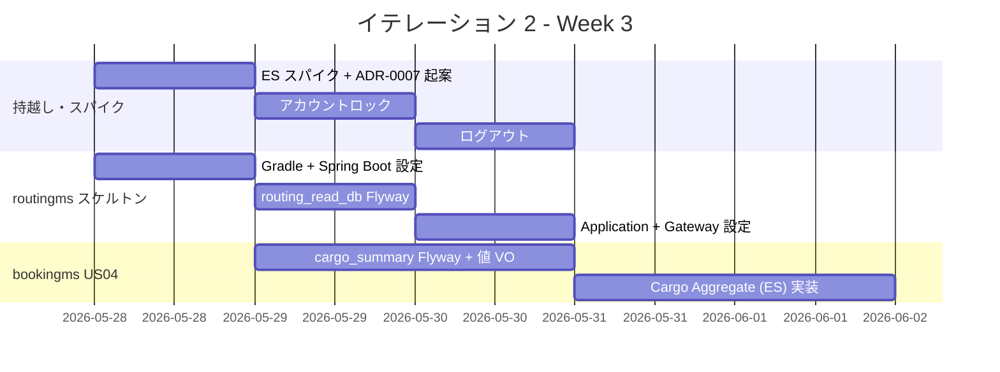
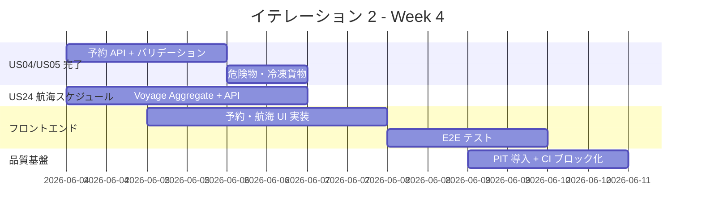
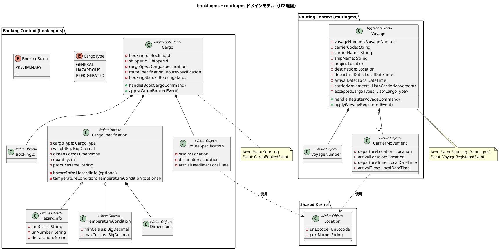
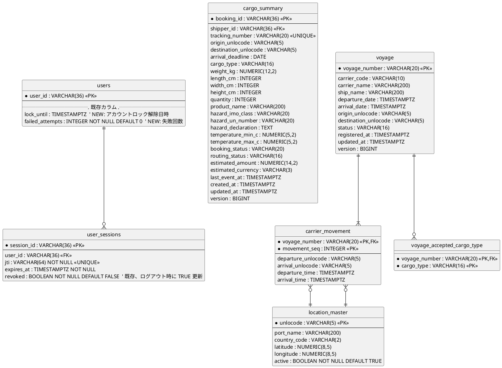
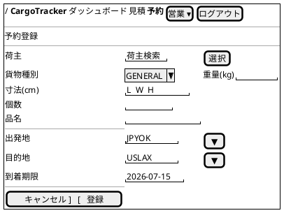
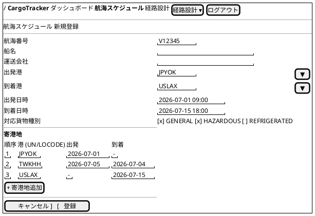

# イテレーション 2 計画

## 概要

| 項目 | 内容 |
|------|------|
| **イテレーション** | 2 / 8 |
| **期間** | Week 3-4（2026-05-28 〜 2026-06-10） |
| **ゴール** | bookingms に `Cargo` Aggregate（Axon Event Sourcing）を導入し、貨物予約の基盤を実装する。routingms スケルトンを構築し航海スケジュール新規登録（US24）を実装する。あわせて IT1 持越し（アカウントロック・ログアウト・E2E）を完了させる |
| **目標 SP** | 14（新規 11 SP + 持越し 3 SP）|
| **基準ベロシティ** | 13 SP（IT1 純実績ベース）/ 計画外バッファ 20% |

> **設計準拠の方針**: 本計画は `docs/design/domain-model.md` および `docs/design/data-model.md` に完全準拠する。集約名は `Cargo`、Read Model テーブルは `cargo_summary` / `cargo_leg` / `voyage` / `carrier_movement` を使用する。Voyage 集約は routingms 所属とし、IT2 で routingms サービスを新規起動する。

---

## ゴール

### イテレーション終了時の達成状態

1. **認証基盤の完成**: IT1 持越しのアカウントロック（5 回失敗で 30 分）とログアウト（トークン無効化）が機能し、JWT 認証の運用品質が満たされる
2. **貨物予約 (Cargo Aggregate)**: 営業担当者が荷主 ID・貨物仕様・輸送条件を入力して予約を登録でき、危険物・冷凍貨物の特別情報も同一 Aggregate で扱える
3. **routingms 起動 + 航海スケジュール**: routingms サービスが Gradle モジュール + Spring Boot + Flyway で稼働し、`Voyage` Aggregate により航海スケジュールが新規登録できる
4. **Axon Event Sourcing 本格導入**: `Cargo` Aggregate を Event Sourcing で実装し、IT1 で CRUD に切り替えた経験を踏まえた設計判断を ADR-0007 に記録する
5. **E2E テスト基盤**: フロントエンドの E2E テスト（Playwright）が 1 シナリオ動作し、IT3 以降の品質基盤となる
6. **品質メトリクス基盤**: PIT 75%（ドメイン層主指標）+ 行カバレッジ 90%（副指標）の計測が CI で動作する

### 成功基準

- [ ] `POST /api/v1/auth/login` で 5 回連続失敗するとアカウントが 30 分ロックされる（`users.lock_until` 管理）
- [ ] `POST /api/v1/auth/logout` で `user_sessions.revoked = TRUE` に更新され、以降の認証で 401 を返す
- [ ] `POST /api/v1/bookings` で貨物予約（`Cargo` Aggregate）を登録でき、`bookingId` と「PRELIMINARY」状態が発行される
- [ ] 貨物種別「HAZARDOUS」を選択すると `HazardInfo`（IMO クラス・UN 番号・宣言）の入力が必須となる
- [ ] 貨物種別「REFRIGERATED」を選択すると `TemperatureCondition`（最低・最高温度）の入力が必須となる
- [ ] routingms サービスが起動し、Swagger UI / Actuator が応答する
- [ ] `POST /api/v1/voyages` で `Voyage` Aggregate を登録でき、`carrier_movement`（寄港地）が複数登録できる
- [ ] `Cargo` Aggregate が Axon Event Sourcing で実装され、`CargoBookedEvent` がイベントストアに永続化される
- [ ] `CargoProjectionsEventHandler` が `cargo_summary` Read Model を更新する
- [ ] Playwright で「ログイン → 荷主登録」シナリオの E2E テストが GREEN
- [ ] ADR-0007（Event Sourcing 導入方針）が作成される
- [ ] PIT カバレッジ（バックエンド集約）が CI で計測される（基準 75%、未達でも計測必須）
- [ ] 行カバレッジが副指標として計測される（基準 90%、未達でも計測必須）
- [ ] Checkstyle / SpotBugs が CI で自動チェックされ、PR 単位でブロックされる

---

## ユーザーストーリー

### 対象ストーリー

| ID | ユーザーストーリー | SP | 優先度 | 区分 |
|----|-------------------|----|--------|------|
| US00-r1 | アカウントロックを有効化する（IT1 持越し） | 1 | 必須 | 持越し |
| US00-r2 | ログアウトを実装する（IT1 持越し） | 1 | 必須 | 持越し |
| US-UI-r | フロントエンド E2E テストを整備する（IT1 持越し） | 1 | 必須 | 持越し |
| US04 | 貨物予約を登録する | 5 | 必須 | 新規 |
| US05 | 危険物・冷凍貨物の予約を登録する | 3 | 必須 | 新規（US04 と同一 Aggregate） |
| US24 | 航海スケジュールを新規登録する | 3 | 必須 | 新規（routingms 起動を含む） |
| **合計** | | **14** | | |

> **画面分離方針（H13 反映）**: US24（新規登録、画面 S12）は US25（既存更新、IT3 で実装）と **別画面** として設計する。誤操作リスク（既存スケジュールの更新と新規登録の取り違え）を抑止する。

> **routingms スケルトン**: US24 を実装するために routingms 自体をゼロから起動する作業は、IT2 計画外バッファ枠（+2 SP 相当）で吸収する。スケルトン作業は SP 計上せず、超過時は US24 を IT3 に再持越し。

> **US25 繰越し**: release_plan.md 上では US25（既存航海スケジュール更新, 3 SP）を IT3 へ繰越し。IT2 では US24 のみ扱う。

### ストーリー詳細

#### US00-r1: アカウントロックを有効化する

**ストーリー**:

> システム管理者として、ID/パスワード認証で 5 回連続失敗したアカウントを 30 分間自動ロックしたい。なぜなら、ブルートフォース攻撃を抑止しシステムを安全に保てるからだ。

**受入条件**:

1. ログイン失敗が同一ユーザーで連続 5 回発生すると、6 回目以降は認証情報が正しくても 423 Locked（または 401 + lockout フラグ）を返す
2. ロックは 30 分後に自動解除される
3. ログイン成功時には失敗カウンタがリセットされる
4. ロック状態は `users.lock_until` カラム（既存 `auth_db.users` の拡張）で管理される

#### US00-r2: ログアウトを実装する

**ストーリー**:

> システムユーザーとして、`POST /api/v1/auth/logout` でトークンを無効化し、確実にログアウトしたい。なぜなら、共用端末などでセッションを安全に終了する必要があるからだ。

**受入条件**:

1. `POST /api/v1/auth/logout` を呼び出すと、リクエストの JWT トークン（JTI）が無効化される
2. 無効化されたトークンで保護リソースへアクセスすると 401 を返す
3. トークン無効化は **既存の `auth_db.user_sessions.revoked` カラム** を `TRUE` に更新することで管理する（新規テーブル不要）
4. 期限切れトークンはバッチで定期削除する（実装はスケジューラのみ、IT3 で運用開始）

#### US-UI-r: フロントエンド E2E テストを整備する

**ストーリー**:

> 開発者として、Playwright で「ログイン → 荷主一覧 → 荷主登録」の E2E シナリオを自動化したい。なぜなら、IT3 以降のフロントエンド改修時にリグレッションを即座に検出できるからだ。

**受入条件**:

1. `apps/frontend/e2e/` 配下に Playwright プロジェクトを構築する
2. シナリオ「ログイン成功 → 荷主登録ページに遷移 → 個人荷主を登録 → 一覧に表示される」を実装する
3. CI（GitHub Actions）で E2E テストが自動実行される
4. テスト用ユーザー・荷主は Testcontainers PostgreSQL のフィクスチャで投入する

#### US04: 貨物予約を登録する

**ストーリー**:

> 営業担当者として、荷主 ID・貨物仕様（種別・重量・寸法・個数・品名）・輸送条件（出発地・目的地・希望日）を入力して予約を登録したい。なぜなら、荷主の見積承認後に正式な予約を受け付け、経路設計フェーズに引き継げるからだ。

**受入条件**:

1. 荷主 ID（`shipperId`）を入力して既存荷主を選択できる
2. 貨物種別（`CargoType`: GENERAL / HAZARDOUS / REFRIGERATED）・重量（`weightKg`）・寸法（`Dimensions`: length/width/height cm）・個数（`quantity`）・品名（`productName`）を入力できる
3. 出発地（`origin: Location`）・目的地（`destination: Location`、いずれも UN/LOCODE）・到着期限（`arrivalDeadline`）を入力できる
4. 登録完了後、`BookingId` が発行され `BookingStatus = PRELIMINARY` になる
5. `CargoBookedEvent` が Axon イベントストアに永続化される
6. `cargo_summary` Read Model に予約サマリーが反映される

#### US05: 危険物・冷凍貨物の予約を登録する

**ストーリー**:

> 営業担当者として、危険物や冷凍・冷蔵貨物の場合に、特別な追加情報（危険物申告・温度管理条件）を含めて予約を登録したい。なぜなら、貨物種別に応じた法的要件と取扱い条件を正確に管理し、安全な輸送を保証できるからだ。

**受入条件**:

1. 貨物種別「HAZARDOUS」を選択すると、`HazardInfo`（`imoClass`・`unNumber`・`declaration`）の入力が必須になる
2. 貨物種別「REFRIGERATED」を選択すると、`TemperatureCondition`（`minCelsius`・`maxCelsius`）の入力が必須になる
3. 特別情報は `CargoSpecification` の **optional フィールド**（`hazardInfo` / `temperatureCondition`）として保持される
4. `cargo_summary` テーブル内の `hazard_imo_class` / `hazard_un_number` / `hazard_declaration` / `temperature_min_c` / `temperature_max_c` カラムに投影される（**別テーブルは作らない**、設計準拠）
5. 冷凍貨物の **温度範囲境界値テスト** をユニットテストに含める（過去レビュー指摘の反映）

#### US24: 航海スケジュールを新規登録する

**ストーリー**:

> 経路設計者として、運送会社が公開する航海スケジュール（航海番号・船名・出発港・到着港・出発日・到着日・寄港地・対応貨物種別）をシステムに登録したい。なぜなら、最新の運航情報を反映することで経路候補の算出精度が上がるからだ。

**受入条件**:

1. 航海番号（`VoyageNumber`）・船名（`shipName`）・運送会社（`carrierCode`/`carrierName`）・出発港（`origin: Location`）・到着港（`destination: Location`）・出発日時（`departureDate`）・到着日時（`arrivalDate`）・対応貨物種別（`acceptedCargoTypes: List<CargoType>`）を入力できる
2. 寄港地（`CarrierMovement` のリスト）を複数かつ順序付き（`movement_seq`）で入力できる
3. 必須項目が未入力の場合、未入力箇所を明示したエラーが返る
4. 出発日が到着日より後の場合、日付の整合性エラーが返る（`CHECK(arrival_date > departure_date)` 制約と同等の Aggregate 不変条件）
5. 同一航海番号がシステムに存在しない場合、登録が完了する
6. 登録後、`voyage` Read Model（`routing_read_db`）に反映され、IT3 の US07（航海スケジュール検索）の対象となる
7. 画面 S12 は **新規登録専用**（US25 の更新画面とは分離、H13 反映）

---

## タスク

### 0. IT1 持越し・スパイク（4 SP）

| # | タスク | 見積もり | 担当 | 状態 |
|---|--------|---------|------|------|
| 0.1 | Event Sourcing スパイク（`Cargo` Aggregate プロトタイプ・タイムボックス 4h） | 4h | - | [ ] |
| 0.2 | ADR-0007 起案（Event Sourcing 導入方針・PIT 主指標の根拠を含む） | 2h | - | [ ] |
| 0.3 | US00-r1: `users.lock_until` カラム追加 Flyway マイグレーション + `LoginAttemptTracker` 実装 | 4h | - | [ ] |
| 0.4 | US00-r1: アカウントロック統合テスト（5 回失敗 → 423 / 30 分後解除） | 2h | - | [ ] |
| 0.5 | US00-r2: `user_sessions.revoked` 更新ロジック + `TokenRevocationService` 実装（既存テーブル拡張） | 3h | - | [ ] |
| 0.6 | US00-r2: `POST /auth/logout` コントローラー + Spring Security 検証フィルター連携 | 2h | - | [ ] |
| 0.7 | US00-r2: ログアウト統合テスト（無効化トークンで 401） | 2h | - | [ ] |

**小計**: 19h

### 1. bookingms `Cargo` Aggregate 実装（US04: 5 SP）

| # | タスク | 見積もり | 担当 | 状態 |
|---|--------|---------|------|------|
| 1.1 | `cargo_summary` / `cargo_leg` Flyway マイグレーション作成（`booking_read_db`、data-model.md 準拠） | 2h | - | [ ] |
| 1.2 | `BookingId` / `TrackingNumber` / `Dimensions` / `Money` / `RouteSpecification` 値オブジェクト実装 | 3h | - | [ ] |
| 1.3 | `Cargo` Aggregate 実装（`@Aggregate` + `@CommandHandler(BookCargoCommand)` + `@EventSourcingHandler(CargoBookedEvent)`） | 4h | - | [ ] |
| 1.4 | `BookCargoCommand` / `CargoBookedEvent` 定義 + `BookingSagaManager` スケルトン（IT3-IT4 用） | 2h | - | [ ] |
| 1.5 | `CargoProjectionsEventHandler`（`@EventHandler` → `cargo_summary` テーブル更新） | 3h | - | [ ] |
| 1.6 | `POST /api/v1/bookings` コントローラー + DTO + バリデーション | 3h | - | [ ] |
| 1.7 | 荷主 ID 存在チェック（`ShipperReadService` を bookingms 内で参照、Query 経由） | 2h | - | [ ] |
| 1.8 | `BookingId` 採番ロジック（UUID v7 推奨、VARCHAR(36)）| 1h | - | [ ] |
| 1.9 | `Cargo` Aggregate Axon `AggregateTestFixture` ユニットテスト | 3h | - | [ ] |
| 1.10 | `POST /api/v1/bookings` 統合テスト（Testcontainers PostgreSQL + Axon Server） | 3h | - | [ ] |

**小計**: 26h

### 2. bookingms 危険物・冷凍貨物（US05: 3 SP）

| # | タスク | 見積もり | 担当 | 状態 |
|---|--------|---------|------|------|
| 2.1 | `HazardInfo`（`imoClass`・`unNumber`・`declaration`）値オブジェクト実装 | 2h | - | [ ] |
| 2.2 | `TemperatureCondition`（`minCelsius`・`maxCelsius`）値オブジェクト実装 + 不変条件（max >= min） | 2h | - | [ ] |
| 2.3 | `CargoSpecification` を `hazardInfo` / `temperatureCondition` を optional で保持するよう拡張 | 2h | - | [ ] |
| 2.4 | `Cargo` Aggregate の貨物種別分岐 + 特別情報必須バリデーション | 2h | - | [ ] |
| 2.5 | `CargoProjectionsEventHandler` 拡張（`cargo_summary` の hazard_* / temperature_* カラム反映） | 2h | - | [ ] |
| 2.6 | 危険物・冷凍貨物のユニットテスト + 統合テスト + **温度境界値テスト**（過去レビュー指摘 反映） | 3h | - | [ ] |

**小計**: 13h

### 3. routingms スケルトン作成（IT2 計画外バッファ枠 +2 SP 相当、SP 計上外）

| # | タスク | 見積もり | 担当 | 状態 |
|---|--------|---------|------|------|
| 3.1 | `routingms` Gradle サブモジュール作成 + `settings.gradle.kts` 追加 | 2h | - | [ ] |
| 3.2 | Spring Boot 4 + Axon Framework 5 + MyBatis 3 の依存関係設定 | 2h | - | [ ] |
| 3.3 | `routing_read_db` 作成 + Flyway マイグレーション（`voyage` / `carrier_movement` / `voyage_accepted_cargo_type` / `location_master`） | 3h | - | [ ] |
| 3.4 | `RoutingApplication` メインクラス + Actuator + Swagger UI 設定 | 2h | - | [ ] |
| 3.5 | gatewayms に `routingms` ルーティング設定追加（JWT 検証付き） | 1h | - | [ ] |
| 3.6 | routingms 起動確認の統合テスト（`PingControllerIntegrationTest` 相当） | 2h | - | [ ] |

**小計**: 12h（SP 外、計画外バッファ枠）

### 4. routingms 航海スケジュール（US24: 3 SP）

| # | タスク | 見積もり | 担当 | 状態 |
|---|--------|---------|------|------|
| 4.1 | `Voyage` Aggregate + `VoyageNumber` / `CarrierMovement` 値オブジェクト実装 | 4h | - | [ ] |
| 4.2 | `RegisterVoyageCommand` / `VoyageRegisteredEvent` 定義 + Aggregate ハンドラ | 3h | - | [ ] |
| 4.3 | `VoyageProjectionsEventHandler`（Read Model 反映: voyage / carrier_movement / voyage_accepted_cargo_type） | 3h | - | [ ] |
| 4.4 | `POST /api/v1/voyages` コントローラー + DTO + 日付整合性バリデーション | 3h | - | [ ] |
| 4.5 | 同一 `voyage_number` の重複チェック（Aggregate ロード時の存在確認） | 1h | - | [ ] |
| 4.6 | 航海スケジュール登録のユニットテスト（`AggregateTestFixture`）+ 統合テスト | 3h | - | [ ] |

**小計**: 17h

### 5. フロントエンド UI 実装（US04/US05/US24: UI 拡張、SP は親ストーリーに含む）

| # | タスク | 対象ファイル | 見積もり | 状態 |
|---|--------|------------|---------|------|
| 5.1 | 予約登録フィーチャー（`bookingApi.ts` / `useBookCargo.ts` / `BookingForm.tsx`） | `features/booking/` | 4h | [ ] |
| 5.2 | 貨物種別による条件分岐 UI（HAZARDOUS / REFRIGERATED / GENERAL の入力フィールド切替） | `features/booking/CargoTypeFields.tsx` | 3h | [ ] |
| 5.3 | 予約一覧画面（`BookingList.tsx` / `BookingListPage.tsx`、URL: `/bookings`） | `features/booking/`・`pages/` | 3h | [ ] |
| 5.4 | 航海スケジュール登録フィーチャー（`voyageApi.ts` / `VoyageForm.tsx`、URL: `/routing/voyages/new`、S12） | `features/routing/voyage/` | 3h | [ ] |
| 5.5 | ロール別メニュー拡張（営業＝予約、経路設計者＝航海スケジュール） | `components/layout/Sidebar.tsx` | 1h | [ ] |
| 5.6 | フロントエンドユニットテスト（Vitest） | `features/booking/__tests__/` 等 | 3h | [ ] |

**小計**: 17h

> **ディレクトリ命名**: フロントエンドは ui_design.md の OOUX 整理に従い、予約は `features/booking/`、航海は経路設計コンテキスト所属のため `features/routing/voyage/` 配下に置く（S11-S13 が `/routing/voyages/...` のため）。

### 6. US-UI-r: フロントエンド E2E テスト（1 SP）

| # | タスク | 対象ファイル | 見積もり | 状態 |
|---|--------|------------|---------|------|
| 6.1 | Playwright インストール + プロジェクト初期化（`apps/frontend/e2e/`） | `apps/frontend/e2e/` | 2h | [ ] |
| 6.2 | テスト用ユーザー・荷主のフィクスチャ作成（Testcontainers + Flyway） | `e2e/fixtures/` | 2h | [ ] |
| 6.3 | 「ログイン → 荷主登録 → 一覧確認」シナリオ実装 | `e2e/login-shipper.spec.ts` | 3h | [ ] |
| 6.4 | GitHub Actions ワークフロー追加（PR 時に E2E 実行） | `.github/workflows/e2e.yml` | 2h | [ ] |

**小計**: 9h

### 7. 品質基盤強化（DoD 段階導入、計画外バッファ枠）

| # | タスク | 見積もり | 担当 | 状態 |
|---|--------|---------|------|------|
| 7.1 | Jacoco（行カバレッジ副指標 90%）の CI 統合 | 2h | - | [ ] |
| 7.2 | **PITest（PIT 主指標 75%）の Gradle プラグイン導入 + CI 統合**（H21 反映、ドメイン層対象） | 4h | - | [ ] |
| 7.3 | Checkstyle / SpotBugs を PR で自動ブロック化（既存セットアップを CI 必須チェックへ昇格） | 2h | - | [ ] |
| 7.4 | SonarQube スキャン安定化 + Quality Gate 結果の CI 表示 | 2h | - | [ ] |

**小計**: 10h（計画外バッファ枠で消化）

### タスク合計

| カテゴリ | SP | 理想時間 | 状態 |
|---------|-----|---------|------|
| IT1 持越し（ロック・ログアウト）+ ES スパイク | 2 | 19h | [ ] |
| US04 `Cargo` Aggregate（bookingms） | 5 | 26h | [ ] |
| US05 危険物・冷凍貨物（`CargoSpecification` 拡張） | 3 | 13h | [ ] |
| routingms スケルトン（SP 外、計画外バッファ） | - | 12h | [ ] |
| US24 航海スケジュール（routingms） | 3 | 17h | [ ] |
| フロントエンド UI（US04/US05/US24） | - | 17h | [ ] |
| US-UI-r E2E テスト | 1 | 9h | [ ] |
| 品質基盤強化（DoD 段階導入 + PIT） | - | 10h（バッファ） | [ ] |
| **合計** | **14** | **123h** | |

**1 SP あたり**: 約 8.8h（routingms 初期化と PIT 導入を含めた実工数ベース。AI エージェント協働前提）。実稼働は 40h 想定で AI 補完による効率化を見込む。

**進捗率**: 0% (0/14 SP)

---

## スケジュール

### Week 3（Day 1-5: 2026-05-28〜06-03）



| 日 | タスク |
|----|--------|
| Day 1（05-28） | Event Sourcing スパイク（0.1）+ ADR-0007 起案（0.2）/ routingms Gradle モジュール（3.1）/ cargo_summary Flyway（1.1） |
| Day 2（05-29） | アカウントロック（0.3, 0.4）/ routingms Spring Boot 依存（3.2）/ 値オブジェクト（1.2） |
| Day 3（05-30） | ログアウト（0.5〜0.7）/ routing_read_db Flyway（3.3）/ `Cargo` Aggregate 着手（1.3） |
| Day 4（06-02） | `Cargo` Aggregate + Command/Event（1.3, 1.4）/ RoutingApplication + Gateway 設定（3.4, 3.5） |
| Day 5（06-03） | `CargoProjectionsEventHandler`（1.5）/ routingms 起動テスト（3.6）/ Jacoco CI 統合（7.1） |

### Week 4（Day 6-10: 2026-06-04〜06-10）



| 日 | タスク |
|----|--------|
| Day 6（06-04） | `POST /api/v1/bookings`（1.6〜1.8）/ Voyage Aggregate + Command/Event（4.1, 4.2）/ フロントエンド予約 UI 着手（5.1, 5.2） |
| Day 7（06-05） | US04 テスト（1.9, 1.10）/ VoyageProjectionsEventHandler（4.3）/ フロントエンド予約 UI（5.3） |
| Day 8（06-08） | US05（2.1〜2.6）/ `POST /api/v1/voyages`（4.4, 4.5）/ Voyage UI（5.4） |
| Day 9（06-09） | US24 テスト（4.6）/ ロール別メニュー（5.5）/ Vitest（5.6）/ Playwright（6.1〜6.3）/ PIT 導入（7.2） |
| Day 10（06-10） | E2E CI 統合（6.4）/ Checkstyle・SpotBugs CI ブロック化（7.3）/ SonarQube 安定化（7.4）/ 統合テスト・デモ準備 |

> **依存関係注記**:
>
> - Day 1 の Event Sourcing スパイク結果が `Cargo` Aggregate 設計（Day 3 以降）に影響する
> - 認証強化（ロック・ログアウト）は Week 3 前半に完了させ、E2E テスト（Week 4 後半）の前提条件とする
> - US04 → US05 の順（US05 は `CargoSpecification` の optional フィールドを拡張するため）
> - routingms スケルトン（Day 1-5）が完了しなければ US24 着手不可

> **スケジュールバッファ**: Day 10 後半 3h をバグ修正・デモ準備に確保。超過時の繰越し候補は (a) PIT 導入 → IT3、(b) US-UI-r E2E → IT3。

---

## 設計

### ドメインモデル（IT2 範囲、domain-model.md 準拠）



> **設計準拠**: 集約名は `Cargo`（不変、domain-model.md 準拠）。`Cargo` は `BookingId` で識別される。危険物・冷凍貨物は `CargoSpecification` の optional フィールドとして表現する。

### データモデル（IT2 範囲、data-model.md 準拠）



> **設計準拠**:
>
> - 予約 Read Model は **`cargo_summary`**（単一テーブル）に集約。危険物・冷凍貨物の情報も同テーブル内のカラム（`hazard_*` / `temperature_*`）として保持する。
> - 航海 Read Model は **routingms 所属**の `routing_read_db.voyage`。寄港地は **`carrier_movement`**（PK: `voyage_number` + `movement_seq`）。
> - PK 戦略は **VARCHAR(36) UUID 文字列**（Axon AggregateIdentifier と接続）。
> - トークン失効は **既存 `user_sessions.revoked`** を使用（新規テーブル不要）。
> - IT2 では `users` テーブルに `lock_until` / `failed_attempts` の 2 カラムを追加する。**data-model.md 側にもこのカラム追加を反映する必要があり、IT2 完了時に同期する**（注記）。

### ユーザーインターフェース

#### ビュー（予約登録画面 S09）



> 貨物種別を `HAZARDOUS` に切替えると `HazardInfo`（IMO クラス・UN 番号・宣言）の入力フィールドが表示される。`REFRIGERATED` に切替えると `TemperatureCondition`（最低・最高温度）が表示される。

#### ビュー（航海スケジュール登録画面 S12）



> **画面分離（H13 反映）**: S12 は **新規登録専用**。US25 の既存更新画面（`/routing/voyages/:vn/edit`）は IT3 で実装する。新規 vs 更新の誤操作リスクを抑止する設計。

#### インタラクション

```plantuml
@startuml
title 予約登録 / 航海スケジュール登録 画面遷移図

[*] --> ダッシュボード

state ダッシュボード
ダッシュボード --> 予約一覧 : 営業ロール / `/bookings`
ダッシュボード --> 航海スケジュール一覧 : 経路設計ロール / `/routing/voyages`

state 予約一覧 : URL `/bookings`
予約一覧 --> 予約登録 : 「新規」(GET)
predicate 予約登録 : URL `/bookings/new`
予約登録 --> 予約登録 : バリデーションエラー (自己ループ)
予約登録 --> 予約詳細 : 送信成功 (POST → 201 → GET /bookings/:id)

state 航海スケジュール一覧 : URL `/routing/voyages`
航海スケジュール一覧 --> 航海スケジュール登録 : 「新規」(GET)
航海スケジュール登録 : URL `/routing/voyages/new` (S12, 新規専用)
航海スケジュール登録 --> 航海スケジュール登録 : バリデーション/日付整合性エラー (自己ループ)
航海スケジュール登録 --> 航海スケジュール詳細 : 送信成功

note right of 航海スケジュール登録
  H13 反映: 新規画面は更新画面と分離
  （更新は IT3 で実装）
end note

@enduml
```

### ディレクトリ構成

```
apps/backend/
├── authms/
│   └── src/main/java/.../auth/
│       ├── LoginAttemptTracker.java          # NEW: アカウントロック
│       ├── TokenRevocationService.java       # NEW: user_sessions.revoked 更新
│       └── controller/LogoutController.java  # NEW
├── bookingms/
│   └── src/main/java/.../booking/
│       ├── domain/
│       │   ├── Cargo.java                    # NEW (Aggregate Root)
│       │   ├── BookingId.java                # NEW
│       │   ├── CargoSpecification.java       # NEW
│       │   ├── HazardInfo.java               # NEW
│       │   ├── TemperatureCondition.java     # NEW
│       │   ├── Dimensions.java               # NEW
│       │   ├── RouteSpecification.java       # NEW
│       │   ├── CargoType.java                # NEW (enum)
│       │   └── BookingStatus.java            # NEW (enum)
│       ├── application/
│       │   ├── command/BookCargoCommand.java # NEW
│       │   └── event/CargoBookedEvent.java   # NEW
│       ├── infrastructure/persistence/
│       │   └── CargoProjectionsEventHandler.java # NEW
│       └── interfaces/rest/
│           └── BookingController.java        # NEW
├── routingms/                                 # ★ NEW モジュール
│   ├── build.gradle.kts                       # NEW
│   ├── src/main/java/.../routing/
│   │   ├── RoutingApplication.java            # NEW
│   │   ├── domain/
│   │   │   ├── Voyage.java                    # NEW (Aggregate Root)
│   │   │   ├── VoyageNumber.java              # NEW
│   │   │   └── CarrierMovement.java           # NEW
│   │   ├── application/
│   │   │   ├── command/RegisterVoyageCommand.java # NEW
│   │   │   └── event/VoyageRegisteredEvent.java   # NEW
│   │   ├── infrastructure/persistence/
│   │   │   └── VoyageProjectionsEventHandler.java # NEW
│   │   └── interfaces/rest/
│   │       └── VoyageController.java          # NEW
│   └── src/main/resources/db/migration/
│       ├── V1__create_voyage.sql              # NEW
│       ├── V2__create_carrier_movement.sql    # NEW
│       ├── V3__create_voyage_accepted_cargo_type.sql # NEW
│       └── V4__create_location_master.sql     # NEW
├── gatewayms/
│   └── src/main/resources/application.yml     # MOD: routingms ルート追加
└── shared/ (Location/UnLocode 利用、変更なし)

apps/frontend/
├── src/features/
│   ├── booking/                               # NEW
│   └── routing/voyage/                        # NEW（経路設計コンテキスト所属）
└── e2e/                                       # NEW（Playwright プロジェクト）
```

### API 設計

| メソッド | エンドポイント | サービス | 概要 |
|---------|---------------|----------|------|
| POST | `/api/v1/auth/logout` | authms | JWT トークン無効化（`user_sessions.revoked = TRUE`） |
| POST | `/api/v1/bookings` | bookingms | 貨物予約登録（`Cargo` Aggregate、`BookCargoCommand`） |
| GET  | `/api/v1/bookings` | bookingms | 予約一覧（営業ロール向け、IT2 では一覧のみ、詳細は IT3） |
| POST | `/api/v1/voyages` | routingms | 航海スケジュール新規登録（`Voyage` Aggregate、`RegisterVoyageCommand`） |
| GET  | `/api/v1/voyages` | routingms | 航海スケジュール一覧（経路設計ロール向け） |

### ADR

| ADR | タイトル | ステータス |
|-----|---------|-----------|
| ADR-0007（新規） | bookingms / routingms における Axon Event Sourcing 導入方針（PIT 主指標の根拠を含む） | 提案 → IT2 Day 1 で起案 |

---

## リスクと対策

| リスク | 影響度 | 対策 |
|--------|--------|------|
| Event Sourcing 導入の工数超過（IT1 と同様 CRUD に切替えるリスク） | 高 | Day 1 にタイムボックス 4h のスパイクを実施。スパイクで成立しない場合は ADR-0007 で CRUD 継続を判断し、Event Sourcing 学習は IT3 以降に延期 |
| routingms スケルトン起動の遅延（Phase 0 経験を踏まえても初期化作業は重い） | 高 | Day 1-5 の routingms 初期化は計画外バッファ枠（12h）で吸収。Day 5 終了時点で起動できなければ US24 を IT3 へ再持越し |
| 持越し（ロック・ログアウト・E2E）が新規ストーリーを圧迫 | 中 | Week 3 前半に完了させる計画。未完了時は US-UI-r を IT3 へ再持越し |
| 計画外タスクの再発（IT1 で 9 件発生） | 中 | DoD 段階導入（7.1-7.4）を計画外バッファ枠で消化。新たな計画外タスクは都度 SP 換算し優先順位を判断 |
| PIT 導入の学習コスト（PITest プラグイン未経験） | 中 | Day 9 に集中して導入。未達成時は IT3 に持越し（CI 必須化は IT3 から） |
| `users` テーブル拡張の data-model.md 反映漏れ | 中 | IT2 完了時に data-model.md を更新（タスク 7.5 として記載するか、ふりかえり時に確認） |

---

## 完了条件

### Definition of Done

- [ ] コードレビュー完了（PR 単位）
- [ ] バックエンド単体・統合テストがパス
- [ ] **PIT カバレッジ 75% 以上**（ドメイン層、`Cargo` / `Voyage` Aggregate）または計測実施
- [ ] 行カバレッジ 90% 以上（副指標）または計測実施
- [ ] フロントエンド Vitest がパス
- [ ] Playwright E2E（1 シナリオ）がパス
- [ ] Checkstyle / SpotBugs エラーなし（CI ブロック化済み）
- [ ] SonarQube Quality Gate 通過
- [ ] Swagger UI で新規 API（auth/logout, bookings, voyages）が動作確認できる
- [ ] `local-docker` プロファイルで authms / bookingms / routingms / gatewayms / frontend が起動し、API が応答する
- [ ] ADR-0007 が作成され `docs/adr/index.md` と `mkdocs.yml` に反映される
- [ ] `iteration_plan-2.md` / `release_plan.md` / `index.md` が最新の進捗を反映
- [ ] **data-model.md に `users.lock_until` / `users.failed_attempts` カラム追加を反映**（IT2 完了時の同期）

### デモ項目

1. 5 回ログイン失敗 → アカウントロック → 30 分後解除
2. ログイン → `POST /api/v1/auth/logout` → 同トークンで保護リソース 401
3. 通常貨物の予約登録（営業ロール、Swagger UI または UI、`POST /api/v1/bookings`）
4. 危険物・冷凍貨物の予約登録（`HazardInfo` / `TemperatureCondition` の必須化）
5. 航海スケジュール新規登録（経路設計者ロール、寄港地複数、routingms 経由）
6. Playwright E2E「ログイン → 荷主登録 → 一覧確認」シナリオの実行
7. PIT カバレッジレポートの確認（ドメイン層）

---

## ベロシティ算定根拠（IT1 実績反映）

| 項目 | 計算 | 値 |
|------|------|-----|
| IT1 純ベロシティ | US00 3 + US00a 3 + US02 3 + US03 3 + US-UI 1（厳格判定） | 13 SP |
| 計画外バッファ 20% | 13 × 0.2 | 3 SP |
| ストーリー消化目標 | 13 − 3 | 10〜11 SP |
| 持越し（強制） | US00-r1 + US00-r2 + US-UI-r | +3 SP |
| **IT2 計画 SP** | ストーリー 11 + 持越し 3 | **14 SP** |

> **routingms スケルトン作業**（12h、+2 SP 相当）は計画外バッファ枠で吸収（SP 計上外）。IT1 で発生した 9 件の計画外タスクを参照すると 7-12h 程度の追加作業は許容範囲内。

> **release_plan.md からの変更**: US25（既存航海スケジュール更新, 3 SP）を IT2 → IT3 へ移動。IT3 は 13 → 16 SP となるが、IT3 終了時のベロシティ実績で再評価する。

---

## 設計ドキュメント反映予定（IT2 完了時）

IT2 計画で明らかになった、設計ドキュメント側に反映が必要な変更点：

| # | 変更内容 | 反映先 | タイミング |
|---|---------|-------|-----------|
| 1 | `users.lock_until` / `users.failed_attempts` カラム追加 | `docs/design/data-model.md` Auth DB セクション | IT2 完了時 |
| 2 | ADR-0007 Event Sourcing 導入方針 | `docs/adr/0007-axon-5-event-sourcing-api.md` 新規 + `docs/adr/index.md` + `mkdocs.yml` | ✅ **IT2 Day 1 起案完了**（2026-05-13）。Axon 5.1 で 4 系 API は削除されており、5.1 系新 API（`@EventSourcedEntity`/`@InjectEntityId`/`@TargetEntityId`）を採用。要追加検証 3 項目は IT2 Day 2 で実施予定 |
| 3 | PIT 75%（主） + 行 90%（副）の品質指標 | `docs/design/test_strategy.md` および `docs/design/non_functional.md` のカバレッジ目標 | ✅ **IT2 着手前に事前反映済み**（2026-05-13） |

---

## 更新履歴

| 日付 | 更新内容 | 更新者 |
|------|---------|--------|
| 2026-05-13 | 初版作成（IT1 ベロシティ反映、US25 を IT3 へ繰越し） | AI Agent（XP PM） |
| 2026-05-13 | 整合性検証結果を反映：集約名を `Cargo` に修正、Read Model を `cargo_summary` / `carrier_movement` に修正、Voyage を routingms に配置（スケルトン作成タスク追加）、`user_sessions.revoked` 利用、H13 画面分離方針明記、H21 PIT カバレッジ指標反映 | AI Agent（XP PM） |

---

## 関連ドキュメント

- [リリース計画](./release_plan.md)
- [イテレーション 1 計画](./iteration_plan-1.md)
- [イテレーション 1 ふりかえり](./retrospective-1.md)
- [イテレーション 1 完了報告書](./iteration_report-1.md)
- [ドメインモデル設計](../design/domain-model.md)
- [データモデル設計](../design/data-model.md)
- [UI 設計](../design/ui_design.md)
- [分析成果物レビュー（2026-05-12）](../review/分析成果物_review_20260512.md)
- [イテレーション 2 ふりかえり](./retrospective-2.md)（IT2 終了時に作成）
