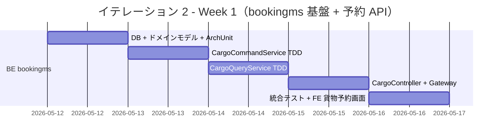
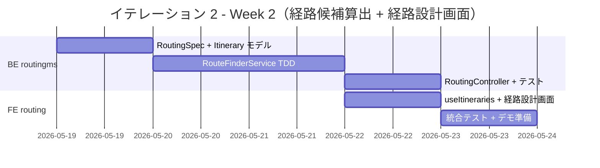
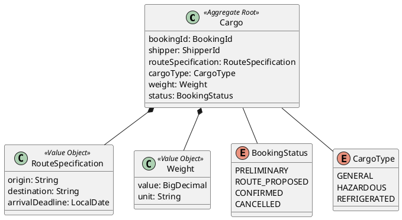
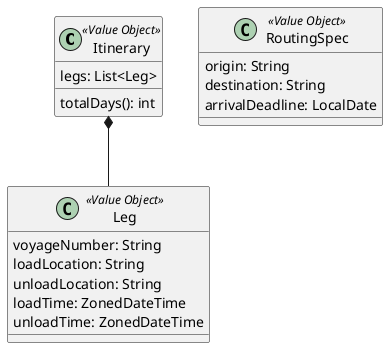
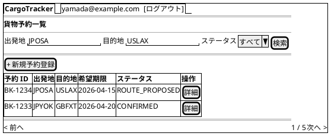
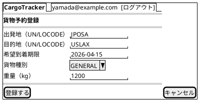
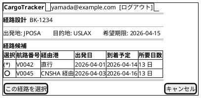
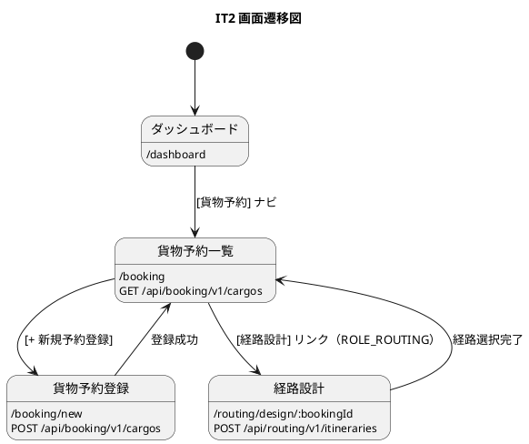

# イテレーション 2 計画

## 概要

| 項目 | 内容 |
|------|------|
| **イテレーション** | 2 |
| **期間** | Week 3-4（2026-05-12〜2026-05-23） |
| **ゴール** | 貨物予約登録 API + 画面、および経路候補算出 API + 経路設計画面を構築する |
| **目標 SP** | 24（BE 16 + FE 8） |

---

## ゴール

### イテレーション終了時の達成状態

1. **貨物予約登録**: bookingms で貨物予約（荷主・出発地・目的地・希望期限・貨物種別・重量）を登録できる REST API が動作し、React SPA で予約一覧・登録画面が実装されている
2. **経路候補算出**: routingms で出発地・目的地・希望期限を入力として経路候補（航海スケジュールの組み合わせ）を算出できる REST API が動作し、React SPA の経路設計画面で候補が表示される
3. **フルスタック連携**: bookingms と routingms が Gateway 経由で連携し、予約から経路候補表示までの一連のフローが動作する

### 成功基準

- [ ] US04: 貨物予約の新規登録 API が動作する（認証必須）
- [ ] US04: 貨物予約一覧・登録画面が動作する
- [ ] US08: 経路候補算出 API が動作する（認証必須）
- [ ] US08: 経路設計画面で候補が表示される
- [ ] ArchUnit テストが通過する（ヘキサゴナル依存ルール）
- [ ] テストカバレッジ 80% 以上（bookingms + routingms、JaCoCo / Vitest で測定）

---

## ユーザーストーリー

### 対象ストーリー

| ID | ユーザーストーリー | BE | FE | SP | 優先度 |
|----|-------------------|----|----|----|----|
| US04 | 貨物予約を登録する | 8 | 5 | 13 | 必須 |
| US08 | 経路候補を算出する | 8 | 3 | 11 | 必須 |
| **合計** | | **16** | **8** | **24** | |

### ストーリー詳細

#### US04: 貨物予約を登録する

**ストーリー**:

> 営業担当者として、荷主・貨物仕様（種別・重量・品名）・輸送条件（出発地・目的地・希望期限）を入力して予約を登録したい。なぜなら、荷主の見積承認後に正式な予約を受け付け、経路設計フェーズに引き継げるからだ。

**受入条件**:

1. 荷主 ID・貨物種別（GENERAL / HAZARDOUS / REFRIGERATED）・重量・出発地・目的地・希望到着期限を入力できる
2. 登録完了後、予約番号（BK-XXXX 形式）が発行され状態が `PRELIMINARY` になる
3. 重複や不正データがある場合、422 エラーとエラーメッセージを返す
4. 認証なしのリクエストは 401 エラーを返す

#### US08: 経路候補を算出する

**ストーリー**:

> 経路設計者として、貨物予約の出発地・目的地・希望期限をもとに経路候補を自動算出してほしい。なぜなら、手作業の属人化を解消し、接続可能な航海スケジュールを組み合わせた最適経路を効率的に見つけられるからだ。

**受入条件**:

1. 出発地・目的地・希望到着期限を入力として経路候補が算出される
2. 期限内に到達可能な航海スケジュールの組み合わせが候補として提示される
3. 経路候補ごとに所要日数・経由港・航海番号が表示される
4. 直行便がある場合は最優先候補として提示される
5. 期限内に到達可能な経路がない場合、空リストを返す

---

## タスク

### Task 1: bookingms TDD 基盤構築（2 SP）

| # | タスク | 見積もり | 状態 |
|---|--------|---------|------|
| 1.1 | Flyway マイグレーション（cargo テーブル） | 1h | [ ] |
| 1.2 | Cargo 集約ドメインモデル（CargoId / CargoType / Weight / RouteSpecification） | 2h | [ ] |
| 1.3 | BookingStatus 列挙型 | 1h | [ ] |
| 1.4 | CargoMapper（MyBatis）+ MyBatisCargoRepository | 2h | [ ] |
| 1.5 | ArchUnit テスト（ヘキサゴナル依存ルール） | 1h | [ ] |

**小計**: 7h

### Task 2: US04 BE — 貨物予約 API（8 SP）

| # | タスク | 見積もり | 状態 |
|---|--------|---------|------|
| 2.1 | CargoCommandService（予約登録）TDD | 2h | [ ] |
| 2.2 | CargoQueryService（一覧・詳細）TDD | 2h | [ ] |
| 2.3 | CargoController（POST /api/booking/v1/cargos）+ DTO | 2h | [ ] |
| 2.4 | CargoController（GET /api/booking/v1/cargos, GET /:bookingId）| 2h | [ ] |
| 2.5 | Gateway ルート追加（/api/booking/**）| 1h | [ ] |
| 2.6 | MockMvc 統合テスト | 2h | [ ] |

**小計**: 11h

### Task 3: US04 FE — 貨物予約画面（5 SP）

| # | タスク | 見積もり | 状態 |
|---|--------|---------|------|
| 3.1 | Cargo 型定義 + useBookings / useCreateBooking hooks | 1h | [ ] |
| 3.2 | BookingList コンポーネント（ステータスバッジ付きテーブル） | 2h | [ ] |
| 3.3 | BookingForm コンポーネント（React Hook Form + バリデーション） | 2h | [ ] |
| 3.4 | BookingListPage / BookingNewPage / App.tsx ルート追加 | 1h | [ ] |
| 3.5 | ナビゲーションに「貨物予約」追加（ROLE_SALES） | 0.5h | [ ] |
| 3.6 | Vitest コンポーネントテスト | 1.5h | [ ] |

**小計**: 8h

### Task 4: US08 BE — 経路候補算出 API（8 SP）

| # | タスク | 見積もり | 状態 |
|---|--------|---------|------|
| 4.1 | RoutingSpec 値オブジェクト（出発地・目的地・期限） | 1h | [ ] |
| 4.2 | Itinerary / Leg ドメインモデル（経路候補） | 2h | [ ] |
| 4.3 | RouteFinderService TDD（接続可能航海の組み合わせ算出ロジック） | 3h | [ ] |
| 4.4 | RoutingController（POST /api/routing/v1/itineraries） + DTO | 2h | [ ] |
| 4.5 | MockMvc 統合テスト | 2h | [ ] |

**小計**: 10h

### Task 5: US08 FE — 経路設計画面（3 SP）

| # | タスク | 見積もり | 状態 |
|---|--------|---------|------|
| 5.1 | Itinerary 型定義 + useItineraries hook | 1h | [ ] |
| 5.2 | RoutingDesignPage（経路候補一覧・選択 UI） | 2h | [ ] |
| 5.3 | App.tsx ルート追加（/routing/design/:bookingId） | 0.5h | [ ] |
| 5.4 | Vitest コンポーネントテスト | 1.5h | [ ] |

**小計**: 5h

### タスク合計

| カテゴリ | SP | 理想時間 | 状態 |
|---------|----|----|------|
| Task 1: bookingms 基盤構築 | 2 | 7h | [ ] |
| Task 2: US04 BE 貨物予約 API | 8 | 11h | [ ] |
| Task 3: US04 FE 貨物予約画面 | 5 | 8h | [ ] |
| Task 4: US08 BE 経路候補算出 API | 8 | 10h | [ ] |
| Task 5: US08 FE 経路設計画面 | 3 | 5h | [ ] |
| **合計** | **26** | **41h** | |

**1 SP あたり**: 約 1.6h（IT1 実績 2.1h より効率改善を期待）

**進捗率**: 0% (0/24 SP)

> **Note**: IT1 のふりかえり「Try」を踏まえ、API パスを事前に Gateway ルートと照合済み（`/api/booking/**`）。FE 実装時は `docs/design/ui-design.md` のワイヤーフレームを必ず参照する。

---

## スケジュール

### Week 1（Day 1-5: 2026-05-12〜2026-05-16）— bookingms 基盤 + 予約 API



| 日 | タスク |
|----|--------|
| Day 1 | Task 1（bookingms 基盤: DB + ドメインモデル + ArchUnit） |
| Day 2 | Task 2.1-2.2（CargoCommandService + CargoQueryService TDD） |
| Day 3 | Task 2.3-2.4（CargoController + DTO） |
| Day 4 | Task 2.5-2.6（Gateway ルート + 統合テスト） |
| Day 5 | Task 3（FE: BookingList + BookingForm + ページ） |

### Week 2（Day 6-10: 2026-05-19〜2026-05-23）— 経路候補算出 + 経路設計画面



| 日 | タスク |
|----|--------|
| Day 6 | Task 4.1-4.2（RoutingSpec + Itinerary モデル） |
| Day 7-8 | Task 4.3（RouteFinderService TDD — 接続可能航海算出ロジック） |
| Day 9 | Task 4.4-4.5（RoutingController + 統合テスト） |
| Day 10 | Task 5（FE: 経路設計画面）+ 統合デモ準備 |

---

## 設計

### ドメインモデル

#### Booking Context（bookingms）



#### Routing Context — 経路候補（routingms 追加分）



### データモデル

```sql
-- bookingms: cargo テーブル
CREATE TABLE cargo (
    id              BIGSERIAL PRIMARY KEY,
    booking_id      VARCHAR(20)  NOT NULL UNIQUE,
    shipper_id      VARCHAR(50),
    origin          VARCHAR(5)   NOT NULL,
    destination     VARCHAR(5)   NOT NULL,
    arrival_deadline DATE         NOT NULL,
    cargo_type      VARCHAR(20)  NOT NULL DEFAULT 'GENERAL',
    weight_kg       DECIMAL(10,2),
    status          VARCHAR(30)  NOT NULL DEFAULT 'PRELIMINARY',
    created_at      TIMESTAMP WITH TIME ZONE NOT NULL DEFAULT NOW(),
    updated_at      TIMESTAMP WITH TIME ZONE NOT NULL DEFAULT NOW()
);
```

### API 設計

| メソッド | エンドポイント | 説明 | ロール |
|---------|---------------|------|--------|
| `GET` | `/api/booking/v1/cargos` | 予約一覧（クエリフィルタ可） | ROLE_SALES |
| `POST` | `/api/booking/v1/cargos` | 新規予約登録 | ROLE_SALES |
| `GET` | `/api/booking/v1/cargos/:bookingId` | 予約詳細 | ROLE_SALES |
| `POST` | `/api/routing/v1/itineraries` | 経路候補算出 | ROLE_ROUTING |

### ユーザーインターフェース

#### 貨物予約一覧（/booking）



#### 貨物予約登録（/booking/new）



#### 経路設計（/routing/design/:bookingId）



#### 画面遷移図



### ディレクトリ構成

#### バックエンド（bookingms）

```
apps/backend/bookingms/src/main/java/com/example/bookingms/
├── BookingApplication.java
├── interfaces/rest/
│   ├── CargoController.java
│   └── dto/
│       ├── CreateCargoRequest.java
│       ├── CargoResponse.java
│       └── CargoListResponse.java
├── application/internal/
│   ├── commandservices/CargoCommandService.java
│   └── queryservices/CargoQueryService.java
├── domain/model/
│   ├── aggregates/Cargo.java
│   └── valueobjects/
│       ├── BookingId.java
│       ├── RouteSpecification.java
│       ├── Weight.java
│       ├── CargoType.java
│       └── BookingStatus.java
└── infrastructure/repositories/
    ├── CargoMapper.java
    └── MyBatisCargoRepository.java
```

#### バックエンド（routingms 追加分）

```
apps/backend/routingms/src/main/java/com/example/routingms/
├── interfaces/rest/
│   ├── ItineraryController.java          ← 新規
│   └── dto/
│       ├── RoutingSpecRequest.java        ← 新規
│       └── ItineraryResponse.java         ← 新規
├── application/internal/
│   └── queryservices/RouteFinderService.java  ← 新規
└── domain/model/
    └── valueobjects/
        ├── Itinerary.java                 ← 新規
        ├── Leg.java                       ← 新規
        └── RoutingSpec.java               ← 新規
```

#### フロントエンド

```
apps/frontend/src/
├── features/
│   └── booking/
│       ├── components/
│       │   ├── BookingList.tsx
│       │   └── BookingForm.tsx
│       ├── hooks/useBookings.ts
│       └── types/booking.ts
├── pages/
│   ├── BookingListPage.tsx
│   ├── BookingNewPage.tsx
│   └── RoutingDesignPage.tsx
```

### ADR

| ADR | タイトル | ステータス |
|-----|---------|-----------|
| 既存 ADR 参照 | ヘキサゴナルアーキテクチャ + MyBatis | 承認済み |

---

## リスクと対策

| リスク | 影響度 | 対策 |
|--------|--------|------|
| RouteFinderService の接続ロジックが複雑 | 高 | Day 7-8 の 2 日間を集中実装に充てる。まず直行便のみのシンプルケースで Green にしてから多区間を実装 |
| bookingms と routingms のデータ参照 | 中 | IT2 では API 分離を維持し、フロントエンドが両 API を直接呼び出す構成とする |
| UI ワイヤーフレームとの乖離（IT1 Problem） | 低 | FE 実装前に `docs/design/ui-design.md` のワイヤーフレームを必ず参照する |
| API パスと Gateway ルートのミスマッチ（IT1 Problem） | 低 | `/api/booking/**` の Gateway ルートを IT2 開始前に追加・確認済み |

---

## 完了条件

### Definition of Done

- [ ] コードレビュー完了（AI エージェントによる多角的レビュー実施）
- [ ] ユニットテスト（BE + FE）がパス
- [ ] 統合テスト（MockMvc + H2）がパス
- [ ] ArchUnit テストがパス
- [ ] Checkstyle / SpotBugs エラーなし（BUILD SUCCESSFUL）
- [ ] テストカバレッジ 80% 以上（JaCoCo / Vitest）
- [ ] E2E テストがパス（新規シナリオ追加）
- [ ] ドキュメント更新完了（iteration_plan-2.md 更新）

### デモ項目

1. 貨物予約登録（出発地・目的地・希望期限・貨物種別・重量を入力して登録）
2. 登録した予約が一覧に表示される
3. 経路設計画面を開き、経路候補が表示される
4. ログアウト → 認証画面にリダイレクト

---

## 更新履歴

| 日付 | 更新内容 | 更新者 |
|------|---------|--------|
| 2026-05-07 | 初版作成 | - |

---

## 関連ドキュメント

- [リリース計画](./release_plan.md)
- [イテレーション 1 ふりかえり](./retrospective-1.md)
- [ユーザーストーリー](../requirements/user_story.md)
- [バックエンドアーキテクチャ](../design/architecture_backend.md)
- [UI 設計](../design/ui-design.md)
- [ドメインモデル設計](../design/domain-model.md)
- [データモデル設計](../design/data-model.md)
